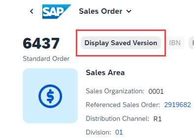
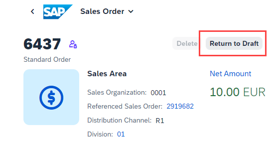
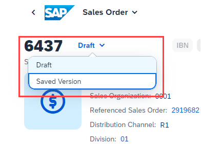
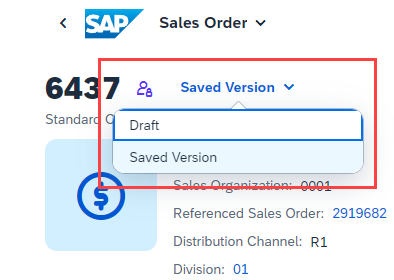
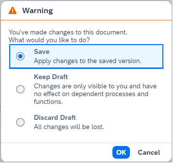

<!-- loio5a184109b1ec44e7ab7e43d40ef56847 -->

# What's New in SAPUI5 1.101

With this release SAPUI5 is upgraded from version 1.100 to 1.101.

<a name="loio5a184109b1ec44e7ab7e43d40ef56847__section_vvy_452_rrb"/>

## Preview and Announcements

The following information concerns important upcoming changes. UI changes may have an impact on the user experience and may require test cases to be adapted.

<table>
<tr>
<th valign="top">

Type

</th>
<th valign="top">

Description

</th>
<th valign="top">

Available as of SAPUI5 Version

</th>
</tr>
<tr>
<td valign="top">

Announcement

</td>
<td valign="top">

**Reminder: Outdated SAPUI5 Versions to Be Removed from the CDN**

For security reasons, SAPUI5 versions that are no longer maintained will be removed from the UI5 content delivery network \(CDN\) one year after their end of maintenance. If a version is still in maintenance, patches of that version that are older than one year will also be removed. We have noted that a number of customers are still using such outdated versions or patches. If this affects you, please note that once these versions or patches are removed, your applications will break. Please update to a more recent version or patch. For more information, see: [Removing Outdated UI5 Versions from UI5 CDN](https://blogs.sap.com/2021/01/26/removing-outdated-ui5-versions-from-ui5-cdn/) as well as the UI5 notifications in the Demo Kit.

</td>
<td valign="top">

n/a

</td>
</tr>
<tr>
<td valign="top">

UI Change \(Preview\)

</td>
<td valign="top">

**Draft-Enabled Apps: Empty Rows Offered by Default in Object Page Tables**

To improve the user experience of draft-enabled apps, a number of empty rows are added automatically to object page tables in *Create*/*Edit* mode. The user no longer has to add each new row individually.

</td>
<td valign="top">

1.102

</td>
</tr>
<tr>
<td valign="top">

UI Change \(Preview\)

</td>
<td valign="top">

**Draft-Enabled Apps: Draft Toggle Button Moved**

To improve the user experience, we've changed the handling of the draft concept in SAP Fiori elements for OData V4 with SAPUI5 1.101. For more information, see the

SAP Fiori Elements

section below. It's planned to add this improvement to SAP Fiori elements for OData V2 with SAPUI5 1.102.

</td>
<td valign="top">

1.101 \(OData V4\)

1.102 \(OData V2, planned\)

</td>
</tr>
</table>

> ### Note:  
> Content marked as **Preview** is provided as a courtesy, without a warranty, and may be subject to change. For more information, see the [preview disclaimer](https://help.sap.com/viewer/wnp_disclaimer).

<a name="loio5a184109b1ec44e7ab7e43d40ef56847__section_qwl_pb5_zcb"/>

## Improved Features

<table>
<tr>
<td valign="top">

**Drag and Drop**

We have now enabled drag and drop for use on mobile devices for iOS 15.1 and higher releases and the latest Chrome 98 for Android.

> ### Note:  
> The availability of drag and drop depends on whether the respective browser supports drag and drop.

For more information, see [Drag and Drop](../04_Essentials/drag-and-drop-3ddb6cd.md).

</td>
</tr>
<tr>
<td valign="top">

**High Contrast Themes**

We have prevented the overwriting of the high contrast setting of Windows for all SAPUI5 themes when using Chrome and Edge browsers.

</td>
</tr>
<tr>
<td valign="top">

**SAPUI5 OData V2 Model**

The new `sap.ui.model.odata.v2.Context#delete` method deletes a binding's `Context` irrespective of its status, including inactive, transient, and persisted contexts.For more information, see the [API Reference](https://ui5.sap.com/#/api/sap.ui.model.odata.v2.Context%23methods/delete).

</td>
</tr>
<tr>
<td valign="top">

**SAPUI5 OData V4 Model**

The new version of the SAPUI5 OData V4 model introduces the following features:

-   We now support the setting of a different binding context for a relative list binding with transient contexts.

-   `sap.ui.model.odata.v4.AnnotationHelper#format` now evaluates the `com.sap.vocabularies.common.v1.Timezone` annotation of properties of the `Edm.DateTimeOffset` type. A composite binding with an `sap.ui.model.odata.type.DateTimeWithTimezone` type is generated, showing the date/time and the time zone. For more information, see [AnnotationHelper](../04_Essentials/meta-model-for-odata-v4-7f29fb3.md#loio7f29fb3ce5964d8090038a9d3cdf5060__section_AnnoHelp).

-   We provide a new sample application that demonstrates how data in different controls can be kept in sync. The application also shows important aspects of consuming a draft-enabled back-end service.For more information, see the [Sample](https://ui5.sap.com/#/entity/sap.ui.model.odata.v4.ODataModel/sample/sap.ui.core.sample.odata.v4.Draft).

</td>
</tr>
</table>

<a name="loio5a184109b1ec44e7ab7e43d40ef56847__section_rqn_wd5_zcb"/>

## Improved Controls

<table>
<tr>
<td valign="top">

**`sap.m.List, sap.m.Table, sap.m.Tree`**

For better user experience with a more visual approach and a more conversational tone, these tables can now use another control, for example, the `sap.m.IllustratedMessage` control, based on the new `noData` aggregation. This control can be used if no data is available for a table. For more information, see the [API Reference for the `noData` aggregation](https://ui5.sap.com/#/api/sap.m.ListBase) and the [API Reference for `IllustratedMessage`](https://ui5.sap.com/#/api/sap.m.IllustratedMessage). 

</td>
</tr>
<tr>
<td valign="top">

**`sap.m.upload.UploadSet`**

You can now sort, group, and filter the items within `UploadSet`.

For more information, see the [API Reference](https://ui5.sap.com/#/api/sap.m.upload.UploadSet) and the [Samples](https://ui5.sap.com/#/entity/sap.m.upload.UploadSet).

</td>
</tr>
<tr>
<td valign="top">

**`sap.m.Wizard`**

-   We have introduced the `navigationChange` event. It is fired when the current visible step is changed by either tapping on the `sap.m.WizardProgressNavigator` or scrolling through the steps. For more information, see the [API Reference](https://ui5.sap.com/#/api/sap.m.Wizard) and the [Sample](https://ui5.sap.com/#/entity/sap.m.Wizard/sample/sap.m.sample.WizardSingleStep). 

-   We have also removed the experimental flag for the `sap.m.WizardRenderMode` property. For more information, see the [API Reference](https://ui5.sap.com/#/api/sap.m.WizardRenderMode).

</td>
</tr>
<tr>
<td valign="top">

**`sap.ui.comp.smartfield.SmartField`**

`SmartField` can now show an empty indicator when the field in display mode doesn't contain a value. Until now, this was only possible when `SmartField` was used within a `SmartForm`. To see the empty indicator when you use `SmartField` standalone, you need to add the `sapMShowEmpty-CTX` context class to one of its parents. For more information, see the [API Reference](https://ui5.sap.com/#/api/sap.ui.comp.smartfield.SmartField%23faq).

</td>
</tr>
<tr>
<td valign="top">

**`sap.ui.comp.smartfilterbar.SmartFilterBar`**

Users can now rearrange the filters in the *Adapt Filters* dialog. With this improvement, the option to rearrange the filters is shown if filter items are available. For more information, see the [API Reference](https://ui5.sap.com/#/api/sap.ui.comp.smartfilterbar.SmartFilterBar) and the [Sample](https://ui5.sap.com/#/entity/sap.ui.comp.smartfilterbar.SmartFilterBar/sample/sap.ui.comp.sample.smartfilterbar.example1).

</td>
</tr>
<tr>
<td valign="top">

**`sap.ui.comp.smartform.SmartForm`**

The `SemanticGroupElement` control now supports currency and unit of measure smart fields.

</td>
</tr>
<tr>
<td valign="top">

**`sap.ui.comp.smarttable.SmartTable`**

We have improved the usability of the [Show Details\]/[Hide Details\] buttons and adapted the buttons and tooltips based on the SAP Fiori design guidelines. For more information, see the [API Reference](https://ui5.sap.com/#/api/sap.ui.comp.smarttable.SmartTable%23methods/getShowDetailsButton) and the [Sample](https://ui5.sap.com/#/entity/sap.ui.comp.smarttable.SmartTable/sample/sap.ui.comp.sample.smarttable.mtableShowDetails).

</td>
</tr>
</table>

<a name="loio5a184109b1ec44e7ab7e43d40ef56847__section_cps_cg5_zcb"/>

## Deprecations

<table>
<tr>
<td valign="top">

There are currently no major deprecations. For a complete list of all deprecations, see [Deprecated APIs](https://ui5.sap.com/#/api/deprecated). 

</td>
</tr>
</table>

<a name="loio5a184109b1ec44e7ab7e43d40ef56847__section_g3r_bf5_zcb"/>

## SAP Fiori Elements

<table>
<tr>
<td valign="top">

The following changes and new features are available for SAP Fiori elements for OData V2:

-   Partial processing is now supported in the mass edit dialog. Also, apps can add custom fields to the mass edit dialog. For more information, see [Adding Custom ViewExtension in the Mass Edit Dialog](../06_SAP_Fiori_Elements/adding-a-custom-viewextension-in-the-mass-edit-dialog-fd26fee.md).

-   You can now display addresses in the contact facet. For more information, see [Adding a Contact Facet](../06_SAP_Fiori_Elements/adding-a-contact-facet-a6a8c0c.md).

-   You can now enable scrollable containers in the object page header, with improved facet order in the desktop screens. For more information, see [Header Facets](../06_SAP_Fiori_Elements/header-facets-17dbd5b.md).

-   We now support custom message strips in the list report and the analytical list page tables. For more information, see [Adding a Custom Message Strip to List Report and Analytical List Page](../06_SAP_Fiori_Elements/adding-a-custom-message-strip-to-list-report-analytical-list-page-and-object-page-tables-0fdbefb.md).

-   The variant name now gets stored and restored from the `iAppState` when it is in a clean state. For more information, see [Store/Restore of the Application State](../06_SAP_Fiori_Elements/store-restore-the-application-state-46bf248.md).

</td>
</tr>
<tr>
<td valign="top">

The following changes and new features are available for SAP Fiori elements for OData V4:

-   When you're using the flexible column layout and switch to edit mode, the subobject page is now kept open. For more information, see [Enabling the Flexible Column Layout](../06_SAP_Fiori_Elements/enabling-the-flexible-column-layout-e762257.md).

-   We've enhanced the `Table` building block to support the `isSearchable` property. For more information, see [Building Blocks](../06_SAP_Fiori_Elements/building-blocks-24c1304.md).

-   We've changed the handling of the draft concept in SAP Fiori elements for OData V4, which results in the following UI changes:

    -   When users edit an object page, we've changed how they switch between the draft and the saved version of a document, to make it more intuitive.

        Until now, when working with the draft version of the document the user could switch to the saved version using the following button:

          

        Likewise, when working with the saved version of the document the user could switch to the draft using the following button:

          

        As of SAPUI5 1.101, when working with the draft version of the document the user can switch to the saved version using the following popover:

          

        Likewise, when working with the saved version of the document the user can switch to the draft version:

          

        The highlighting and labels clearly indicate which version the user is currently working on.

    -   We've changed the dialog for handling draft changes, for example in case of navigation, to better explain the available options.

        Until now we showed the following confirmation dialog:

          

        As of SAPUI5 1.101 we're showing the following confirmation dialog with the new default action *Save*:

          

    For more information, see [Toggling Between Draft and Saved Values](../06_SAP_Fiori_Elements/toggling-between-draft-and-saved-values-fd3950a.md).

-   We've replaced some keys that can be overridden by application developers using the custom i18n file approach. If you're using any of the deprecated keys in the application resource bundles, replace them with the new ones.

    **Changed i18n Keys**

    <table>
    <tr>
    <th valign="top">

    Deprecated Key

    
    </th>
    <th valign="top">

    New Key

    
    </th>
    </tr>
    <tr>
    <td valign="top">

    T\_OP\_TABLE\_AND\_CHART\_NO\_DATA\_TEXT

    
    </td>
    <td valign="top">

    T\_TABLE\_AND\_CHART\_NO\_DATA\_TEXT

    
    </td>
    </tr>
    <tr>
    <td valign="top">

    T\_OP\_TABLE\_AND\_CHART\_NO\_DATA\_TEXT\_WITH\_FILTER

    
    </td>
    <td valign="top">

    T\_TABLE\_AND\_CHART\_NO\_DATA\_TEXT\_WITH\_FILTER

    
    </td>
    </tr>
    <tr>
    <td valign="top">

    M\_OP\_TABLE\_AND\_CHART\_NO\_DATA\_TEXT\_WITH\_FILTER\_MULTI\_VIEW

    
    </td>
    <td valign="top">

    M\_TABLE\_AND\_CHART\_NO\_DATA\_TEXT\_MULTI\_VIEW

    
    </td>
    </tr>
    <tr>
    <td valign="top">

    M\_OP\_TABLE\_AND\_CHART\_OP\_NO\_FILTERS\_NO\_DATA\_TEXT

    
    </td>
    <td valign="top">

    M\_TABLE\_AND\_CHART\_NO\_FILTERS\_NO\_DATA\_TEXT

    
    </td>
    </tr>
    </table>
    
    For more information, see [Localization of UI Texts](../06_SAP_Fiori_Elements/localization-of-ui-texts-b8cb649.md).

-   SAP Fiori elements for OData V4 now also supports charts in draft-enabled entity sets. For more information, see [Configuring Charts](../06_SAP_Fiori_Elements/configuring-charts-653ed0f.md).

-   SAP Fiori elements for OData V4 applications can now use extension APIs to execute custom code before the standard functionality of SAP Fiori elements for OData V4 is triggered. For more information, see [Using Custom Code Before Standard Operations](../06_SAP_Fiori_Elements/using-custom-code-before-standard-operations-877e5ff.md).

-   The filter bar of the value help is now expanded under certain conditions. For more information, see the *Filter Fields Within the Value Help Dialog* section in [Field Help](../06_SAP_Fiori_Elements/field-help-a5608ea.md).

-   You can now specify a timezone for a `DateTimeOffset` field. For more information, see [Field Help](../06_SAP_Fiori_Elements/field-help-a5608ea.md).

</td>
</tr>
</table>

**Related Information**  

[What's New in SAPUI5 1.107](what-s-new-in-sapui5-1-107-b88b40e.md "With this release SAPUI5 is upgraded from version 1.106 to 1.107.")

[What's New in SAPUI5 1.106](what-s-new-in-sapui5-1-106-c70bb90.md "With this release SAPUI5 is upgraded from version 1.105 to 1.106.")

[What's New in SAPUI5 1.105](what-s-new-in-sapui5-1-105-5567dcc.md "With this release SAPUI5 is upgraded from version 1.104 to 1.105.")

[What's New in SAPUI5 1.104](what-s-new-in-sapui5-1-104-f01ebd4.md "With this release SAPUI5 is upgraded from version 1.103 to 1.104.")

[What's New in SAPUI5 1.103](what-s-new-in-sapui5-1-103-7534ae8.md "With this release SAPUI5 is upgraded from version 1.102 to 1.103.")

[What's New in SAPUI5 1.102](what-s-new-in-sapui5-1-102-b530db3.md "With this release SAPUI5 is upgraded from version 1.101 to 1.102.")

[What's New in SAPUI5 1.100](what-s-new-in-sapui5-1-100-5deb78f.md "With this release SAPUI5 is upgraded from version 1.99 to 1.100.")

[What's New in SAPUI5 1.99](what-s-new-in-sapui5-1-99-5e35c25.md "With this release SAPUI5 is upgraded from version 1.98 to 1.99.")

[What's New in SAPUI5 1.98](what-s-new-in-sapui5-1-98-7aacb4e.md "With this release SAPUI5 is upgraded from version 1.97 to 1.98.")

[What's New in SAPUI5 1.97](what-s-new-in-sapui5-1-97-f21858f.md "With this release SAPUI5 is upgraded from version 1.96 to 1.97.")

[What's New in SAPUI5 1.96](what-s-new-in-sapui5-1-96-b39a11b.md "With this release SAPUI5 is upgraded from version 1.95 to 1.96.")

[What's New in SAPUI5 1.95](what-s-new-in-sapui5-1-95-1b09465.md "With this release SAPUI5 is upgraded from version 1.94 to 1.95.")

[What's New in SAPUI5 1.94](what-s-new-in-sapui5-1-94-2d6ffdd.md "With this release SAPUI5 is upgraded from version 1.93 to 1.94.")

[What's New in SAPUI5 1.93](what-s-new-in-sapui5-1-93-e9c8356.md "With this release SAPUI5 is upgraded from version 1.92 to 1.93.")

[What's New in SAPUI5 1.92](what-s-new-in-sapui5-1-92-1492551.md "With this release SAPUI5 is upgraded from version 1.91 to 1.92.")

[What's New in SAPUI5 1.91](what-s-new-in-sapui5-1-91-75777da.md "With this release SAPUI5 is upgraded from version 1.90 to 1.91.")

[What's New in SAPUI5 1.90](what-s-new-in-sapui5-1-90-b475202.md "With this release SAPUI5 is upgraded from version 1.89 to 1.90.")

[What's New in SAPUI5 1.89](what-s-new-in-sapui5-1-89-0805036.md "With this release SAPUI5 is upgraded from version 1.88 to 1.89.")

[What's New in SAPUI5 1.88](what-s-new-in-sapui5-1-88-bda141b.md "With this release SAPUI5 is upgraded from version 1.87 to 1.88.")

[What's New in SAPUI5 1.87](what-s-new-in-sapui5-1-87-e315108.md "With this release SAPUI5 is upgraded from version 1.86 to 1.87.")

[What's New in SAPUI5 1.86](what-s-new-in-sapui5-1-86-067e2fb.md "With this release SAPUI5 is upgraded from version 1.85 to 1.86.")

[What's New in SAPUI5 1.85](what-s-new-in-sapui5-1-85-eeb5bd9.md "With this release SAPUI5 is upgraded from version 1.84 to 1.85.")

[What's New in SAPUI5 1.84](what-s-new-in-sapui5-1-84-ccf76b7.md "With this release SAPUI5 is upgraded from version 1.82 to 1.84.")

[What's New in SAPUI5 1.82](what-s-new-in-sapui5-1-82-f081cf0.md "With this release SAPUI5 is upgraded from version 1.81 to 1.82.")

[What's New in SAPUI5 1.81](what-s-new-in-sapui5-1-81-f71563c.md "With this release SAPUI5 is upgraded from version 1.80 to 1.81.")

[What's New in SAPUI5 1.80](what-s-new-in-sapui5-1-80-3294c68.md "With this release SAPUI5 is upgraded from version 1.79 to 1.80.")

[What's New in SAPUI5 1.79](what-s-new-in-sapui5-1-79-edf8e35.md "With this release SAPUI5 is upgraded from version 1.78 to 1.79.")

[What's New in SAPUI5 1.78](what-s-new-in-sapui5-1-78-d176be3.md "With this release SAPUI5 is upgraded from version 1.77 to 1.78.")

[What's New in SAPUI5 1.77](what-s-new-in-sapui5-1-77-2ec6b6b.md "With this release SAPUI5 is upgraded from version 1.76 to 1.77.")

[What's New in SAPUI5 1.76](what-s-new-in-sapui5-1-76-b9b0a3f.md "With this release SAPUI5 is upgraded from version 1.75 to 1.76.")

[What's New in SAPUI5 1.75](what-s-new-in-sapui5-1-75-dc3d3ce.md "With this release SAPUI5 is upgraded from version 1.74 to 1.75.")

[What's New in SAPUI5 1.74](what-s-new-in-sapui5-1-74-21fc6cb.md "With this release SAPUI5 is upgraded from version 1.73 to 1.74.")

[What's New in SAPUI5 1.73](what-s-new-in-sapui5-1-73-7b82664.md "With this release SAPUI5 is upgraded from version 1.72 to 1.73.")

[What's New in SAPUI5 1.72](what-s-new-in-sapui5-1-72-25e5326.md "With this release SAPUI5 is upgraded from version 1.71 to 1.72.")

[What's New in SAPUI5 1.71](what-s-new-in-sapui5-1-71-609fd01.md "With this release SAPUI5 is upgraded from version 1.70 to 1.71.")

[What's New in SAPUI5 1.70](what-s-new-in-sapui5-1-70-4e89fee.md "With this release SAPUI5 is upgraded from version 1.69 to 1.70.")

[What's New in SAPUI5 1.69](what-s-new-in-sapui5-1-69-41203fd.md "With this release SAPUI5 is upgraded from version 1.68 to 1.69.")

[What's New in SAPUI5 1.68](what-s-new-in-sapui5-1-68-5531aef.md "With this release SAPUI5 is upgraded from version 1.67 to 1.68.")

[What's New in SAPUI5 1.67](what-s-new-in-sapui5-1-67-0968958.md "With this release SAPUI5 is upgraded from version 1.66 to 1.67.")

[What's New in SAPUI5 1.66](what-s-new-in-sapui5-1-66-ebe7fda.md "With this release SAPUI5 is upgraded from version 1.65 to 1.66.")

[What's New in SAPUI5 1.65](what-s-new-in-sapui5-1-65-9d2b189.md "With this release SAPUI5 is upgraded from version 1.64 to 1.65.")

[What's New in SAPUI5 1.64](what-s-new-in-sapui5-1-64-1975e30.md "With this release SAPUI5 is upgraded from version 1.63 to 1.64.")

[What's New in SAPUI5 1.63](what-s-new-in-sapui5-1-63-77e1dcc.md "With this release SAPUI5 is upgraded from version 1.62 to 1.63.")

[What's New in SAPUI5 1.62](what-s-new-in-sapui5-1-62-27eea38.md "With this release SAPUI5 is upgraded from version 1.61 to 1.62.")

[What's New in SAPUI5 1.61](what-s-new-in-sapui5-1-61-de4d50b.md "With this release SAPUI5 is upgraded from version 1.60 to 1.61.")

[What's New in SAPUI5 1.60](what-s-new-in-sapui5-1-60-2a70354.md "With this release SAPUI5 is upgraded from version 1.58 to 1.60.")

[What's New in SAPUI5 1.58](what-s-new-in-sapui5-1-58-b28edde.md "With this release, SAPUI5 is upgraded from version 1.56 to 1.58.")

[What's New in SAPUI5 1.56](what-s-new-in-sapui5-1-56-53b4b5e.md "With this release, SAPUI5 is upgraded from version 1.54 to 1.56.")

[What's New in SAPUI5 1.54](what-s-new-in-sapui5-1-54-f29023e.md "With this release, SAPUI5 is upgraded from version 1.52 to 1.54.")

[What's New in SAPUI5 1.52](what-s-new-in-sapui5-1-52-a09dd79.md "With this release, SAPUI5 is upgraded from version 1.50 to 1.52.")

[What's New in SAPUI5 1.50](what-s-new-in-sapui5-1-50-a844984.md "With this release, SAPUI5 is upgraded from version 1.48 to 1.50.")

[What's New in SAPUI5 1.48](what-s-new-in-sapui5-1-48-2818f80.md "With this release, SAPUI5 is upgraded from version 1.46 to 1.48.")

[What's New in SAPUI5 1.46](what-s-new-in-sapui5-1-46-4cf0986.md "With this release, SAPUI5 is upgraded from version 1.44 to 1.46.")

[What's New in SAPUI5 1.44](what-s-new-in-sapui5-1-44-05ce1dc.md "With this release, SAPUI5 is upgraded from version 1.42 to 1.44.")

[What's New in SAPUI5 1.42](what-s-new-in-sapui5-1-42-4768f1a.md "With this release, SAPUI5 is upgraded from version 1.40 to 1.42.")

[What's New in SAPUI5 1.40](what-s-new-in-sapui5-1-40-e659bd2.md "With this release, SAPUI5 is upgraded from version 1.38 to 1.40.")

[What's New in SAPUI5 1.38](what-s-new-in-sapui5-1-38-6a875f9.md#loio6a875f998994489483e8085705347d72 "With this release, SAPUI5 is upgraded from version 1.36 to 1.38.")

