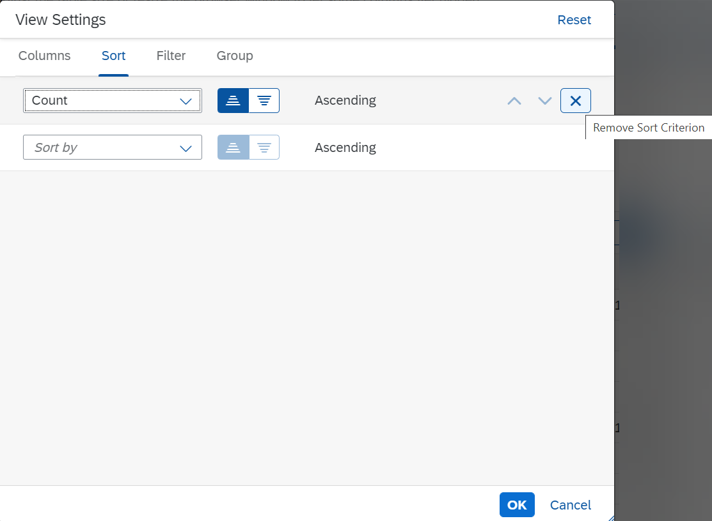
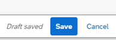
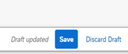
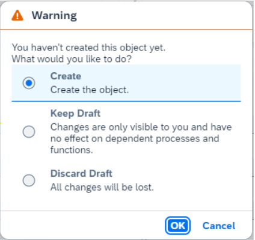
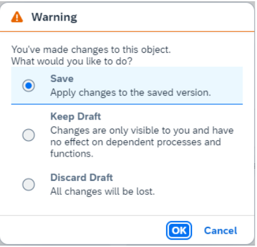

<!-- loiob530db37f4db4164b5e68f20bff93a9a -->

# What's New in SAPUI5 1.102

With this release SAPUI5 is upgraded from version 1.101 to 1.102.

<a name="loiob530db37f4db4164b5e68f20bff93a9a__section_jhg_nsb_ntb"/>

## Preview and Announcements

The following information concerns important upcoming changes. UI changes may have an impact on the user experience and may require test cases to be adapted.

<table>
<tr>
<th valign="top">

Type

</th>
<th valign="top">

Description

</th>
<th valign="top">

Available as of SAPUI5 Version

</th>
</tr>
<tr>
<td valign="top">

Announcement

</td>
<td valign="top">

**Deactivation of Default Time Zone Configuration Feature**

We needed to deactivate the feature to configure the default time zone via the time zone configuration option in [`sap.ui.core.Configuration`](https://ui5.sap.com/#/api/sap.ui.core.Configuration) and the API method [`sap.ui.core.Configuration.setTimezone`](https://ui5.sap.com/#/api/sap.ui.core.Configuration/methods/setTimezone). Reason: There was a risk that dates are visualized by one day off. This wrong date might have been persisted to the back end.

This feature was introduced with UI5 1.102.0. The following UI5 versions still contain this feature:

-   1.102.0 to 1.102.5
-   1.103
-   1.104

If you are on one of these releases, we recommend that you upgrade to a higher version where this feature is deactivated.

We plan to bring this feature back in a different form at a later point in time.

</td>
<td valign="top">

Deactivated as of:

1.106

1.105

1.102.6

</td>
</tr>
<tr>
<td valign="top">

Announcement

</td>
<td valign="top">

**Reminder: Outdated SAPUI5 Versions to Be Removed from the CDN**

For security reasons, SAPUI5 versions that are no longer maintained will be removed from the UI5 content delivery network \(CDN\) one year after their end of maintenance. If a version is still in maintenance, patches of that version that are older than one year will also be removed. We have noted that a number of customers are still using such outdated versions or patches. If this affects you, please note that once these versions or patches are removed, your applications will break. Please update to a more recent version or patch. For more information, see: [Removing Outdated UI5 Versions from UI5 CDN](https://blogs.sap.com/2021/01/26/removing-outdated-ui5-versions-from-ui5-cdn/) as well as the UI5 notifications in the Demo Kit.

</td>
<td valign="top">

n/a

</td>
</tr>
<tr>
<td valign="top">

UI Change

</td>
<td valign="top">

**Draft-Enabled Apps: Empty Rows Offered by Default in Object Page Tables**

To improve the user experience of draft-enabled apps, a number of empty rows are added automatically to object page tables in *Create*/*Edit* mode. The user no longer has to add each new row individually.

</td>
<td valign="top">

1.102

</td>
</tr>
<tr>
<td valign="top">

UI Change

</td>
<td valign="top">

**Draft-Enabled Apps: Draft Toggle Button Moved**

To improve the user experience, we've changed the handling of the draft concept in SAP Fiori elements for OData V4 with SAPUI5 1.101. This improvement has now also been added to SAP Fiori elements for OData V2 with SAPUI5 1.102.

</td>
<td valign="top">

1.101 \(OData V4\)

1.102 \(OData V2\)

</td>
</tr>
</table>

<a name="loiob530db37f4db4164b5e68f20bff93a9a__section_yxw_pxt_zcb"/>

## New Features

<table>
<tr>
<td valign="top">

**Accessibility Guide**

The accessibility guide is a newly developed application about web accessibility in SAPUI5. As an addition to the existing accessibility documentation in the Demo Kit, the accessibility guide provides practical, code-oriented guidance and samples.

For more information, see [Accessibility Guide](https://ui5.sap.com/test-resources/sap/m/demokit/accessibilityGuide/webapp/index.html).

</td>
</tr>
<tr>
<td valign="top">

**Translation of Key User UI Changes**

Developers on SAP BTP, Cloud Foundry environment, can now enable translation of UI changes that were done during key user adaptation. Key users can then download changed UI texts, translate them, and upload the translations again to give end users a fully translated UI. For more information, see [Translating UI Changes](https://help.sap.com/docs/UI5_FLEXIBILITY_KEY_USER/37dd1d2a05e444429d9943d667e0974e/f1119340ad764c5d8cfe62cbd13a0526.html?version=Cloud).

</td>
</tr>
<tr>
<td valign="top">

**Visualization of IANA Time Zones for Date/Time Data**

SAPUI5 now supports the visualization of IANA time zones for date/time data. The time zone can either be passed via configuration or specified via an annotation from a back-end service.

The following SAPUI5 functionality supports IANA time zones:

-   The time zone-specific `DateFormat` [`DateTimeWithTimezone`](https://ui5.sap.com/#/api/sap.ui.core.format.DateFormat.DateTimeWithTimezone), which can be retrieved via [`sap.ui.core.format.DateFormat.getDateTimeWithTimezoneInstance`](https://ui5.sap.com/#/api/api/sap.ui.core.format.DateFormat%23methods/sap.ui.core.format.DateFormat.getDateTimeWithTimezoneInstance). It allows the formatting/parsing of timestamps while visualizing the date and/or the time and/or the time zone. For more information, see [`sap.ui.core.format.DateFormat`](https://ui5.sap.com/#/api/sap.ui.core.format.DateFormat) as well as [Date Format](../04_Essentials/date-format-91f2eba.md).
-   The new [`sap.ui.model.odata.type.DateTimeWithTimezone`](https://ui5.sap.com/#/api/sap.ui.model.odata.type.DateTimeWithTimezone) composite type where the first part is the time stamp and the second part is the IANA time zone.
-   The OData V4 model supports specifying the time zone via the `com.sap.vocabularies.common.v1.Timezone` annotation. For more information, see:

    -   [Meta Model for OData V4](../04_Essentials/meta-model-for-odata-v4-7f29fb3.md)

    -   [AnnotationHelper](../04_Essentials/meta-model-for-odata-v4-7f29fb3.md#loio7f29fb3ce5964d8090038a9d3cdf5060__section_AnnoHelp)

    In OData V2, this is handled by the enhancements mentioned for `sap.ui.comp.smartfield.SmartField` and `sap.ui.comp.smarttable.SmartTable` below.

-   [`sap.m.DateTimePicker`](https://ui5.sap.com/#/api/sap.m.DateTimePicker) visualizes the time zone based on the type information. In addition, it has its own properties for visualizing the time zone.
-   [`sap.ui.comp.smartfield.SmartField`](https://ui5.sap.com/#/api/sap.ui.comp.smartfield.SmartField) supports time zones for `Edm.DateTimeOffset` fields with the `com.sap.vocabularies.common.v1.Timezone` annotation.
-   [`sap.ui.comp.smarttable.SmartTable`](https://ui5.sap.com/#/api/sap.ui.comp.smarttable.SmartTable) supports time zones for `Edm.DateTimeOffset` properties with the `com.sap.vocabularies.Common.v1.TimeZone` annotation. For more information, see the [Sample](https://ui5.sap.com/#/entity/sap.ui.comp.smarttable.SmartTable/sample/sap.ui.comp.sample.smarttable).
-   The spreadsheet export now supports the additional `timezone` property. For more information, see [Data Types for Spreadsheet Export](../04_Essentials/data-types-for-spreadsheet-export-283217d.md).
-   SAP Fiori elements: The time zone can be specified for `Edm.DateTimeOffset` fields. For more information, see [Field Help](../06_SAP_Fiori_Elements/field-help-a5608ea.md).

</td>
</tr>
</table>

<a name="loiob530db37f4db4164b5e68f20bff93a9a__section_qwl_pb5_zcb"/>

## Improved Features

<table>
<tr>
<td valign="top">

**Accessibility**

We are now using JAWS 2022 as a reference testing environment in SAPUI5. For more information, see the *Assistive technologies reference testing environment for SAPUI5* SAP Note [2564165](https://launchpad.support.sap.com/#/notes/2564165).

</td>
</tr>
<tr>
<td valign="top">

**Improved Handling of Aggregations in XML Views**

Aggregations of the XML view itself and of the controls inside the view are now handled in the same way.

If a container control has one of its aggregations marked as the default aggregation, you can now add children directly into that control. For example, if `sap.ui.core.mvc.XMLView`'s `content` aggregation is marked as default, you can define content for the aggregation directly in the XML view, without explicitly adding a `content` tag. Of course, when a container control does not have a default aggregation defined, or when adding a child control into another aggregation, you still need to use an aggregation tag, for example `dependents`.

In order to align the usage of XML views and controls even further, aggregations such as `content` and `dependents` are now also bindable. This is only supported when following the best practice not to use native HTML inside XML views. For more information, see [Aggregation Handling in XML Views](../04_Essentials/aggregation-handling-in-xml-views-19eabf5.md).

</td>
</tr>
<tr>
<td valign="top">

**SAPUI5 OData V2 Model**

The `sap.ui.model.odata.OperationMode.Auto` operation mode is deprecated. If the amount of data is small enough to be loaded completely onto the client, use `sap.ui.model.odata.OperationMode.Client` instead. Otherwise, use `sap.ui.model.odata.OperationMode.Server` or `sap.ui.model.odata.OperationMode.Default`.For more information, see the [API Reference](https://ui5.sap.com/#/api/sap.ui.model.odata.OperationMode%23overview).

</td>
</tr>
<tr>
<td valign="top">

**SAPUI5 OData V4 Model**

The new version of the SAPUI5 OData V4 model introduces the following features:

-   The creation of inactive rows introduced with SAPUI5 1.97 is no longer experimental. For more information, see [Creating an Entity](../04_Essentials/creating-an-entity-c9723f8.md)and the [API Reference](https://ui5.sap.com/#/api/sap.ui.model.odata.v4.ODataListBinding%23methods/create).
-   If metadata is already available, key predicates of message targets received from the back end are now normalized to match the key predicates calculated on the client.

</td>
</tr>
</table>

<a name="loiob530db37f4db4164b5e68f20bff93a9a__section_rqn_wd5_zcb"/>

## Improved Controls

<table>
<tr>
<td valign="top">

**`sap.m.DatePicker`, `sap.m.TimePicker`, and `sap.m.DateTimePicker`**

We have added `afterValueHelpOpen` and `afterValueHelpClose` events, fired when value help dialog opens and closes.

 For more information, see the [API Reference](https://ui5.sap.com/#/api/sap.m.DatePicker). 

</td>
</tr>
<tr>
<td valign="top">

**`sap.m.NotificationListItem` and `sap.m.NotificationListGroup`**

We have applied the following visual changes, which improve the prioritization of the displayed information on small screen sizes:

-   The title of the `sap.m.NotificationListGroup` doesn’t truncate any more. Instead, it wraps to as many lines it needs.

-   The avatar of the `sap.m.NotificationListItem` is hidden in small \(S\) control size.

-   The action button and the close button \(if present\) are moved to a single overflow in small \(S\) control size.

For more information, see the [NotificationListItem](https://ui5.sap.com/#/entity/sap.m.NotificationListItem/sample/sap.m.sample.NotificationListItem) and the [NotificationListGroup](https://ui5.sap.com/#/entity/sap.m.NotificationListGroup/sample/sap.m.sample.NotificationListGroup) samples.

</td>
</tr>
<tr>
<td valign="top">

**`sap.m.p13n*`**

We have improved the usability of the *View Settings* dialog. To do this, we have replaced the `sap.m.Select` control with a `sap.m.ComboBox` control and items of type `sap.m.StandardListItem`.

In particular, the following changes have been applied:

-   We have replaced *None* in the selection lists of the *Sort* and *Group* tabs with the *Sort by* and *Group by* placeholder texts based on the SAP Fiori design guidelines.

-   We have adapted the tooltips of the *Delete* buttons for removing entries on the tabs.

    

-   For a more simplified search, especially in a long selection list, users can now enter a column name.

For more information, see the [Sample](https://ui5.sap.com/#/entity/sap.m.p13n.Popup/sample/sap.m.sample.p13n.Popup) for `sap.m.p13n.Popup` and the [Sample](https://ui5.sap.com/#/entity/sap.ui.comp.smarttable.SmartTable/sample/sap.ui.comp.sample.smarttable.mtableCustom) for `SmartTable`. 

</td>
</tr>
<tr>
<td valign="top">

**`sap.ui.comp.smarttable.SmartTable`**

-   We have provided a feature to export PDF documents based on the `com.sap.vocabularies.PDF.v1.Features` SAP Gateway annotation and the related `UI5ClientPDF` export type of the `exportType` property as the new default value. For more information, see the [API Reference](https://ui5.sap.com/#/api/sap.ui.comp.smarttable.SmartTable%23methods/getExportType) and the SAP Note [3198506](https://launchpad.support.sap.com/#/notes/3198506).

-   We have provided the option to export xlsx files to a local drive or a drive in the cloud if configured accordingly.

</td>
</tr>
<tr>
<td valign="top">

**`sap.ui.richtexteditor.RichTextEditor`**

Application developers can now customize the custom toolbar and remove the buttons that are not needed in the `RichTextEditor`. You can redefine the button group configuration to show only a particular set of buttons in the custom toolbar. For more information, see [sap.ui.richtexteditor](../10_More_About_Controls/sap-ui-richtexteditor-d4f3f15.md) and the [Samples](https://ui5.sap.com/#/entity/sap.ui.richtexteditor.RichTextEditor). 

</td>
</tr>
<tr>
<td valign="top">

**`sap.ui.unified.FileUploader`**

We have implemented `beforeDialogOpen` and `beforeDialogClose` events, fired when the user opens and closes the file select dialog.

 For more information, see the [API Reference](https://ui5.sap.com/#/api/sap.ui.unified.FileUploader). 

</td>
</tr>
</table>

<a name="loiob530db37f4db4164b5e68f20bff93a9a__section_cps_cg5_zcb"/>

## Deprecations

<table>
<tr>
<td valign="top">

There are currently no major deprecations. For a complete list of all deprecations, see [Deprecated APIs](https://ui5.sap.com/#/api/deprecated). 

</td>
</tr>
</table>

<a name="loiob530db37f4db4164b5e68f20bff93a9a__section_g3r_bf5_zcb"/>

## SAP Fiori Elements

<table>
<tr>
<td valign="top">

The following changes and new features are available for SAP Fiori elements for OData V2 and SAP Fiori elements for OData V4:

-   In apps that use draft handling, you can now enable the empty rows mode for table entries. For more information, see [Enabling Inline Creation Mode or Empty Rows Mode of Table Entries](../06_SAP_Fiori_Elements/enabling-inline-creation-mode-or-empty-rows-mode-for-table-entries-cfb04f0.md).

</td>
</tr>
<tr>
<td valign="top">

The following changes and new features are available for SAP Fiori elements for OData V2:

-   Reuse components can now be added using an adaptation project for the SAP delivered apps. For more information, see [Extending the Delivered Apps Manifest Using an Adaptation Project](../06_SAP_Fiori_Elements/extending-the-delivered-apps-manifest-using-an-adaptation-project-a2b24a6.md).

-   Date settings can now be applied to date parameters of a parameterized entity set. For more information, see [Enabling Semantic Dates on the Filter Bar](../06_SAP_Fiori_Elements/enabling-semantic-operators-in-the-filter-bar-fef65d0.md).

-   You now have an option to annotate a function import *Copy* action as a standard *Copy* action. For more information, see [Actions in the List Report](../06_SAP_Fiori_Elements/actions-in-the-list-report-993e99e.md) and [Enabling Actions in Object Page Header](../06_SAP_Fiori_Elements/enabling-actions-in-the-object-page-header-5fe4396.md).

-   Applications can now define their own keyboard shortcuts for custom actions. For more information, see [Adding Custom Actions Using Extension Points](../06_SAP_Fiori_Elements/adding-custom-actions-using-extension-points-7619517.md).

-   The `sap-keep-alive` mode is now available for overview pages. For more information, see [Refresh Entity Sets in `sap-keep-alive` Mode in the Overview Pages](../06_SAP_Fiori_Elements/refresh-entity-sets-in-sap-keep-alive-mode-in-the-overview-pages-0c35c87.md).

-   We've enhanced the handling of the draft concept in SAP Fiori elements for OData V2, which results in the following UI changes:

    -   When users edit an object page, we've changed how they switch between the draft and the saved version of a document, to make it more intuitive.

        Until now, when working with the draft version of the document, the user could switch to the saved version using the following button:

          

        Likewise, when working with the saved version of the document the user could switch to the draft using the following button:

          

        As of SAPUI5 1.102, when working with the draft version of the document the user can switch to the saved version using the following popover:

          

        Likewise, when working with the saved version of the document the user can switch to the draft version:

          

        The highlighting and labels clearly indicate which version the user is currently working on.

    -   We've changed the dialog for handling draft changes, for example for navigation, to better explain the available options.

        Until now we showed the following confirmation dialog:

          

        As of SAPUI5 1.102 we're showing the following confirmation dialog with the new default action *Save*:

          

        In the footer bar, the draft update message text is changed and the *Cancel* button is renamed to *Discard Draft*:

          

        As of SAPUI5 1.102 we're showing the following draft message text with the renamed button:

          

    For more information, see [Toggling Between Draft and Saved Values](../06_SAP_Fiori_Elements/toggling-between-draft-and-saved-values-fd3950a.md) and [Confirmation Popups](../06_SAP_Fiori_Elements/confirmation-popups-9a53662.md).

</td>
</tr>
<tr>
<td valign="top">

The following changes and new features are available for SAP Fiori elements for OData V4:

-   Grouping is now enabled by default in responsive tables. You can disable it using the table personalization in the `manifest.json`. For more information, see [Table Groupings](../06_SAP_Fiori_Elements/table-groupings-d344c5a.md).

-   We now support the synchronization of data between pages when using the flexible column layout. For more information, see [Enabling the Flexible Column Layout](../06_SAP_Fiori_Elements/enabling-the-flexible-column-layout-e762257.md).

-   You can now also export a table to PDF. For more information, see [Using the Export Feature](../06_SAP_Fiori_Elements/using-the-export-feature-4bab6f2.md).

-   We've made additional minor adaptations to the dialog for handling draft changes, for example for navigation, which results in the following UI changes:

    -   We're now showing the following confirmation dialog when a user has created a new object:

          

        Application developers can use the custom i18n approach to override the corresponding keys \(`ST_DRAFT_DATALOSS_POPUP_MESSAGE_CREATE`\) and \(`ST_DRAFT_DATALOSS_CREATE_ENTITY_TOL`\).

    -   We're now showing the following confirmation dialog when a user has edited an existing object:

          

        Application developers can use the custom i18n approach to override the corresponding keys \(`ST_DRAFT_DATALOSS_POPUP_MESSAGE_SAVE`\) and \(`ST_DRAFT_DATALOSS_SAVE_DRAFT_TOL`\).

    For more information, see [Localization of UI Texts](../06_SAP_Fiori_Elements/localization-of-ui-texts-b8cb649.md).

-   SAP Fiori elements now displays an icon for Situation Handling if your service contains the corresponding annotation. For more information, see [Enabling the Icon for Situation Handling](../06_SAP_Fiori_Elements/enabling-the-icon-for-situation-handling-fe4b901.md).

-   You can now enable visual filters from a draft-enabled entity. For more information, see [Configuring the Visual Filter Bar](../06_SAP_Fiori_Elements/configuring-the-visual-filter-bar-33f3d80.md).

-   Personalization changes in a chart are now stored/restored from the `iAppState`. For more information, see [Store/Restore the Application State](../06_SAP_Fiori_Elements/store-restore-the-application-state-46bf248.md).

-   Applications can now define their own custom keyboard shortcuts for application-defined action buttons and navigation buttons. For more information, see [Keyboard Shortcuts](../06_SAP_Fiori_Elements/keyboard-shortcuts-0cd318c.md).

-   SAP Fiori elements for OData V4 now supports the mass edit functionality. For more information, see [Enabling Editing Using a Dialog \(Mass Edit\)](../06_SAP_Fiori_Elements/enabling-editing-using-a-dialog-mass-edit-965ef5b.md).

</td>
</tr>
</table>

**Related Information**  

[What's New in SAPUI5 1.108](what-s-new-in-sapui5-1-108-799291a.md "With this release SAPUI5 is upgraded from version 1.107 to 1.108.")

[What's New in SAPUI5 1.107](what-s-new-in-sapui5-1-107-b88b40e.md "With this release SAPUI5 is upgraded from version 1.106 to 1.107.")

[What's New in SAPUI5 1.106](what-s-new-in-sapui5-1-106-c70bb90.md "With this release SAPUI5 is upgraded from version 1.105 to 1.106.")

[What's New in SAPUI5 1.105](what-s-new-in-sapui5-1-105-5567dcc.md "With this release SAPUI5 is upgraded from version 1.104 to 1.105.")

[What's New in SAPUI5 1.104](what-s-new-in-sapui5-1-104-f01ebd4.md "With this release SAPUI5 is upgraded from version 1.103 to 1.104.")

[What's New in SAPUI5 1.103](what-s-new-in-sapui5-1-103-7534ae8.md "With this release SAPUI5 is upgraded from version 1.102 to 1.103.")

[What's New in SAPUI5 1.101](what-s-new-in-sapui5-1-101-5a18410.md "With this release SAPUI5 is upgraded from version 1.100 to 1.101.")

[What's New in SAPUI5 1.100](what-s-new-in-sapui5-1-100-5deb78f.md "With this release SAPUI5 is upgraded from version 1.99 to 1.100.")

[What's New in SAPUI5 1.99](what-s-new-in-sapui5-1-99-5e35c25.md "With this release SAPUI5 is upgraded from version 1.98 to 1.99.")

[What's New in SAPUI5 1.98](what-s-new-in-sapui5-1-98-7aacb4e.md "With this release SAPUI5 is upgraded from version 1.97 to 1.98.")

[What's New in SAPUI5 1.97](what-s-new-in-sapui5-1-97-f21858f.md "With this release SAPUI5 is upgraded from version 1.96 to 1.97.")

[What's New in SAPUI5 1.96](what-s-new-in-sapui5-1-96-b39a11b.md "With this release SAPUI5 is upgraded from version 1.95 to 1.96.")

[What's New in SAPUI5 1.95](what-s-new-in-sapui5-1-95-1b09465.md "With this release SAPUI5 is upgraded from version 1.94 to 1.95.")

[What's New in SAPUI5 1.94](what-s-new-in-sapui5-1-94-2d6ffdd.md "With this release SAPUI5 is upgraded from version 1.93 to 1.94.")

[What's New in SAPUI5 1.93](what-s-new-in-sapui5-1-93-e9c8356.md "With this release SAPUI5 is upgraded from version 1.92 to 1.93.")

[What's New in SAPUI5 1.92](what-s-new-in-sapui5-1-92-1492551.md "With this release SAPUI5 is upgraded from version 1.91 to 1.92.")

[What's New in SAPUI5 1.91](what-s-new-in-sapui5-1-91-75777da.md "With this release SAPUI5 is upgraded from version 1.90 to 1.91.")

[What's New in SAPUI5 1.90](what-s-new-in-sapui5-1-90-b475202.md "With this release SAPUI5 is upgraded from version 1.89 to 1.90.")

[What's New in SAPUI5 1.89](what-s-new-in-sapui5-1-89-0805036.md "With this release SAPUI5 is upgraded from version 1.88 to 1.89.")

[What's New in SAPUI5 1.88](what-s-new-in-sapui5-1-88-bda141b.md "With this release SAPUI5 is upgraded from version 1.87 to 1.88.")

[What's New in SAPUI5 1.87](what-s-new-in-sapui5-1-87-e315108.md "With this release SAPUI5 is upgraded from version 1.86 to 1.87.")

[What's New in SAPUI5 1.86](what-s-new-in-sapui5-1-86-067e2fb.md "With this release SAPUI5 is upgraded from version 1.85 to 1.86.")

[What's New in SAPUI5 1.85](what-s-new-in-sapui5-1-85-eeb5bd9.md "With this release SAPUI5 is upgraded from version 1.84 to 1.85.")

[What's New in SAPUI5 1.84](what-s-new-in-sapui5-1-84-ccf76b7.md "With this release SAPUI5 is upgraded from version 1.82 to 1.84.")

[What's New in SAPUI5 1.82](what-s-new-in-sapui5-1-82-f081cf0.md "With this release SAPUI5 is upgraded from version 1.81 to 1.82.")

[What's New in SAPUI5 1.81](what-s-new-in-sapui5-1-81-f71563c.md "With this release SAPUI5 is upgraded from version 1.80 to 1.81.")

[What's New in SAPUI5 1.80](what-s-new-in-sapui5-1-80-3294c68.md "With this release SAPUI5 is upgraded from version 1.79 to 1.80.")

[What's New in SAPUI5 1.79](what-s-new-in-sapui5-1-79-edf8e35.md "With this release SAPUI5 is upgraded from version 1.78 to 1.79.")

[What's New in SAPUI5 1.78](what-s-new-in-sapui5-1-78-d176be3.md "With this release SAPUI5 is upgraded from version 1.77 to 1.78.")

[What's New in SAPUI5 1.77](what-s-new-in-sapui5-1-77-2ec6b6b.md "With this release SAPUI5 is upgraded from version 1.76 to 1.77.")

[What's New in SAPUI5 1.76](what-s-new-in-sapui5-1-76-b9b0a3f.md "With this release SAPUI5 is upgraded from version 1.75 to 1.76.")

[What's New in SAPUI5 1.75](what-s-new-in-sapui5-1-75-dc3d3ce.md "With this release SAPUI5 is upgraded from version 1.74 to 1.75.")

[What's New in SAPUI5 1.74](what-s-new-in-sapui5-1-74-21fc6cb.md "With this release SAPUI5 is upgraded from version 1.73 to 1.74.")

[What's New in SAPUI5 1.73](what-s-new-in-sapui5-1-73-7b82664.md "With this release SAPUI5 is upgraded from version 1.72 to 1.73.")

[What's New in SAPUI5 1.72](what-s-new-in-sapui5-1-72-25e5326.md "With this release SAPUI5 is upgraded from version 1.71 to 1.72.")

[What's New in SAPUI5 1.71](what-s-new-in-sapui5-1-71-609fd01.md "With this release SAPUI5 is upgraded from version 1.70 to 1.71.")

[What's New in SAPUI5 1.70](what-s-new-in-sapui5-1-70-4e89fee.md "With this release SAPUI5 is upgraded from version 1.69 to 1.70.")

[What's New in SAPUI5 1.69](what-s-new-in-sapui5-1-69-41203fd.md "With this release SAPUI5 is upgraded from version 1.68 to 1.69.")

[What's New in SAPUI5 1.68](what-s-new-in-sapui5-1-68-5531aef.md "With this release SAPUI5 is upgraded from version 1.67 to 1.68.")

[What's New in SAPUI5 1.67](what-s-new-in-sapui5-1-67-0968958.md "With this release SAPUI5 is upgraded from version 1.66 to 1.67.")

[What's New in SAPUI5 1.66](what-s-new-in-sapui5-1-66-ebe7fda.md "With this release SAPUI5 is upgraded from version 1.65 to 1.66.")

[What's New in SAPUI5 1.65](what-s-new-in-sapui5-1-65-9d2b189.md "With this release SAPUI5 is upgraded from version 1.64 to 1.65.")

[What's New in SAPUI5 1.64](what-s-new-in-sapui5-1-64-1975e30.md "With this release SAPUI5 is upgraded from version 1.63 to 1.64.")

[What's New in SAPUI5 1.63](what-s-new-in-sapui5-1-63-77e1dcc.md "With this release SAPUI5 is upgraded from version 1.62 to 1.63.")

[What's New in SAPUI5 1.62](what-s-new-in-sapui5-1-62-27eea38.md "With this release SAPUI5 is upgraded from version 1.61 to 1.62.")

[What's New in SAPUI5 1.61](what-s-new-in-sapui5-1-61-de4d50b.md "With this release SAPUI5 is upgraded from version 1.60 to 1.61.")

[What's New in SAPUI5 1.60](what-s-new-in-sapui5-1-60-2a70354.md "With this release SAPUI5 is upgraded from version 1.58 to 1.60.")

[What's New in SAPUI5 1.58](what-s-new-in-sapui5-1-58-b28edde.md "With this release, SAPUI5 is upgraded from version 1.56 to 1.58.")

[What's New in SAPUI5 1.56](what-s-new-in-sapui5-1-56-53b4b5e.md "With this release, SAPUI5 is upgraded from version 1.54 to 1.56.")

[What's New in SAPUI5 1.54](what-s-new-in-sapui5-1-54-f29023e.md "With this release, SAPUI5 is upgraded from version 1.52 to 1.54.")

[What's New in SAPUI5 1.52](what-s-new-in-sapui5-1-52-a09dd79.md "With this release, SAPUI5 is upgraded from version 1.50 to 1.52.")

[What's New in SAPUI5 1.50](what-s-new-in-sapui5-1-50-a844984.md "With this release, SAPUI5 is upgraded from version 1.48 to 1.50.")

[What's New in SAPUI5 1.48](what-s-new-in-sapui5-1-48-2818f80.md "With this release, SAPUI5 is upgraded from version 1.46 to 1.48.")

[What's New in SAPUI5 1.46](what-s-new-in-sapui5-1-46-4cf0986.md "With this release, SAPUI5 is upgraded from version 1.44 to 1.46.")

[What's New in SAPUI5 1.44](what-s-new-in-sapui5-1-44-05ce1dc.md "With this release, SAPUI5 is upgraded from version 1.42 to 1.44.")

[What's New in SAPUI5 1.42](what-s-new-in-sapui5-1-42-4768f1a.md "With this release, SAPUI5 is upgraded from version 1.40 to 1.42.")

[What's New in SAPUI5 1.40](what-s-new-in-sapui5-1-40-e659bd2.md "With this release, SAPUI5 is upgraded from version 1.38 to 1.40.")

[What's New in SAPUI5 1.38](what-s-new-in-sapui5-1-38-6a875f9.md#loio6a875f998994489483e8085705347d72 "With this release, SAPUI5 is upgraded from version 1.36 to 1.38.")

