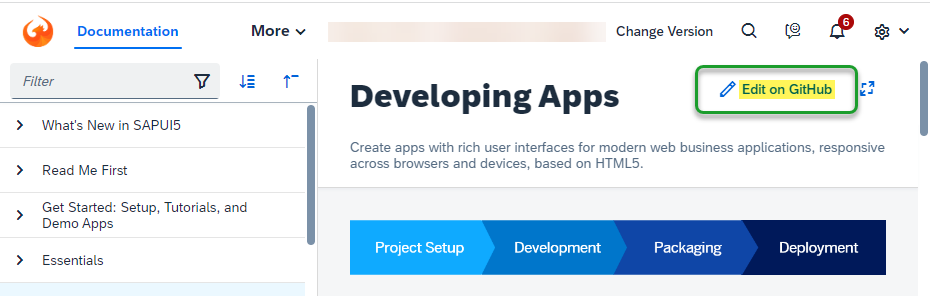
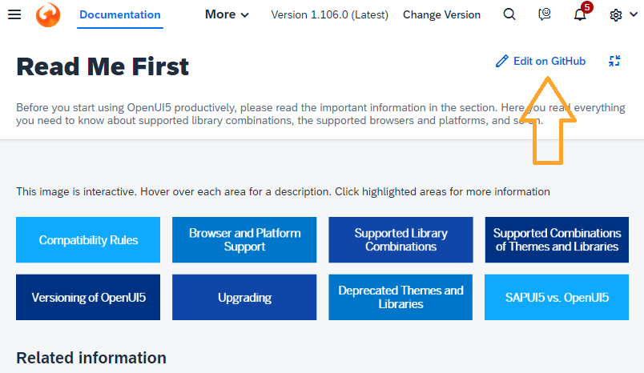

<!-- loiob88b40e124634bb4897f36846f23cd12 -->

# What's New in SAPUI5 1.107

With this release SAPUI5 is upgraded from version 1.106 to 1.107.

<a name="loiob88b40e124634bb4897f36846f23cd12__section_tlr_g1x_z5b"/>

## Preview and Announcements

The following information concerns important upcoming changes. UI changes may have an impact on the user experience and may require test cases to be adapted.

<table>
<tr>
<th valign="top">

Type

</th>
<th valign="top">

Description

</th>
<th valign="top">

Available as of SAPUI5 Version

</th>
</tr>
<tr>
<td valign="top">

Announcement

</td>
<td valign="top">

**Reminder: Outdated SAPUI5 Versions to Be Removed from the CDN**

For security reasons, SAPUI5 versions that are no longer maintained will be removed from the UI5 content delivery network \(CDN\) one year after their end of maintenance. If a version is still in maintenance, patches of that version that are older than one year will also be removed. We have noted that a number of customers are still using such outdated versions or patches. If this affects you, please note that once these versions or patches are removed, your applications will break. Please update to a more recent version or patch. For more information, see: [Removing Outdated UI5 Versions from UI5 CDN](https://blogs.sap.com/2021/01/26/removing-outdated-ui5-versions-from-ui5-cdn/) as well as the UI5 notifications in the Demo Kit.

</td>
<td valign="top">

n/a

</td>
</tr>
<tr>
<td valign="top">

Announcement

</td>
<td valign="top">

**Documentation now open for contributions on GitHub**

The documentation under [https://ui5.sap.com/\#/topic](https://ui5.sap.com/#/topic) is now also available on GitHub as Markdown files. Every documentation page in the Demo Kit has a direct link to the corrresponding Markdown file in the new [https://github.com/SAP-docs/sapui5](https://github.com/SAP-docs/sapui5) repository:

If you have any suggestions for improvements or if you spot an error, feel free to create an issue or a pull request there.

For more information, see [Open Documentation Initiative for SAPUI5 and SAP Fiori Elements – Help Us to Help You!](https://blogs.sap.com/?p=1579981)

</td>
<td valign="top">

1.107

</td>
</tr>
<tr>
<td valign="top">

UI Change \(Preview\)

</td>
<td valign="top">

**List Reports, Analytical List Pages, Object Pages: *Share* Button Replaced by Menu Button**

The current *Share* button available in list reports, analytical list pages, and object pages will be replaced by a menu button to better support new integration functions.

</td>
<td valign="top">

1.108

</td>
</tr>
<tr>
<td valign="top">

UI Change \(Preview\)

</td>
<td valign="top">

**Draft-Enabled Apps: New *Validate* Button for Drafts on Mobile Devices**

A new central *Validate* button will be introduced in draft object pages that are running on mobile phones and tablet devices. It allows the user to validate the draft object at any time.

</td>
<td valign="top">

1.109

</td>
</tr>
</table>

> ### Note:  
> Content marked as **Preview** is provided as a courtesy, without a warranty, and may be subject to change. For more information, see the [preview disclaimer](https://help.sap.com/viewer/wnp_disclaimer).

<a name="loiob88b40e124634bb4897f36846f23cd12__section_qwl_pb5_zcb"/>

## Improved Features

<table>
<tr>
<td valign="top">

**SAPUI5 OData V4 Model**

We now provide the `sap.ui.model.odata.v4.ODataModel#getServiceUrl`, `sap.ui.model.odata.v4.ODataModel#getKeyPredicate`, and`sap.ui.model.odata.v4.ODataModel#requestKeyPredicate` methods.For more information, see the API Reference for [`#getServiceUrl`](https://ui5.sap.com/#/api/sap.ui.model.odata.v4.ODataModel/methods/getServiceUrl), [`#getKeyPredicate`](https://ui5.sap.com/#/api/sap.ui.model.odata.v4.ODataModel/methods/getKeyPredicate), and [`#requestKeyPredicate`](https://ui5.sap.com/#/api/sap.ui.model.odata.v4.ODataModel/methods/requestKeyPredicate).

</td>
</tr>
</table>

<a name="loiob88b40e124634bb4897f36846f23cd12__section_rqn_wd5_zcb"/>

## Improved Controls

<table>
<tr>
<td valign="top">

**`sap.m.List, sap.m.Table, sap.m.Tree`**

To improve performance, we have now made the initial rendering faster: Table, tree, and list items are now already created when the data is requested from the back end. When the data is received, the binding context is updated. This way, rendering the UI with the requested data becomes faster.

</td>
</tr>
<tr>
<td valign="top">

**`sap.m.upload.UploadSet`**

We've introduced directory \(folder\) uploads using the `UploadSet` control. It allows you to directly upload files from directories and subdirectories by configuring the directory property. You can also use the drag and drop feature to upload directories.

</td>
</tr>
<tr>
<td valign="top">

**`sap.ui.comp.smarttable.SmartTable`**

We have improved the usability of the pop-in behavior for toggling the visibility of hidden columns. If the user adds more columns in the *View Settings* dialog in a table where several columns are already in the pop-in area, and these new columns are also moved to the pop-in area because of their importance, these columns are not hidden but are now made visible automatically. This makes it easier for users to recognize which columns have been added. For more information, see the [API Reference](https://ui5.sap.com/#/api/sap.ui.comp.smarttable.SmartTable%23methods/getDetailsButtonSetting) and the [Sample](https://ui5.sap.com/#/entity/sap.ui.comp.smarttable.SmartTable/sample/sap.ui.comp.sample.smarttable.mtableShowDetails).

</td>
</tr>
<tr>
<td valign="top">

**`sap.ui.integration.widgets.Card`**

-   The new \(experimental\) `titleMaxLines` and `subTitleMaxLines` properties enable you to limit the number of lines for the title and subtitle in both the Default and Numeric card headers. Additionally, with the new \(experimental\) `detailsMaxLines` property you can also limit the number of lines for the details in the Numeric card header. For more information, see the [Default Header](https://ui5.sap.com/test-resources/sap/ui/integration/demokit/cardExplorer/webapp/index.html#/learn/headers/default) and [Numeric Header](https://ui5.sap.com/test-resources/sap/ui/integration/demokit/cardExplorer/webapp/index.html#/learn/headers/numeric) sections in the Card Explorer.

-   You can now add items of type `Link` \(experimental\) in the `actionsStrip` of footers and list items. For more information, see the [Card Footer](https://ui5.sap.com/test-resources/sap/ui/integration/demokit/cardExplorer/webapp/index.html#/learn/footer) section and the [Sample](https://ui5.sap.com/test-resources/sap/ui/integration/demokit/cardExplorer/webapp/index.html#/explore/footer) in the Card Explorer.

-   All icons now have a new `initials` property, which is used as a fallback if the `src` property is not set or there is an issue with the resource. For more information, see the [List Card](https://ui5.sap.com/test-resources/sap/ui/integration/demokit/cardExplorer/webapp/index.html#/learn/typesDeclarative/list) section in the Card Explorer.

-   You can now configure the visibility of card headers using the new `visible` Boolean property. Card developers can set this property in the manifest. Additionally, they can add it to the `Configuration.js`, which will also enable card administrators, who are using the Configuration editor, to control the visibility of the card header. For more information, see the [Default Header](https://ui5.sap.com/test-resources/sap/ui/integration/demokit/cardExplorer/webapp/index.html#/learn/headers/default) and [Numeric Header](https://ui5.sap.com/test-resources/sap/ui/integration/demokit/cardExplorer/webapp/index.html#/learn/headers/numeric) sections and the [Sample](https://ui5.sap.com/test-resources/sap/ui/integration/demokit/cardExplorer/webapp/index.html#/explore/designtimeAdmin) in the Card Explorer.

-   We have added a new \(experimental\) `stateChanged` event that is fired when the state of the card is changed. For example, when the card is initialized, a new page inside the card is selected, a filter is changed, or data is refreshed. For more information, see the [API Reference](https://ui5.sap.com/#/api/sap.ui.integration.widgets.Card).

</td>
</tr>
<tr>
<td valign="top">

**`sap.ui.richtexteditor.RichTextEditor`**

-   We have enabled TinyMCE version 6 to be used as the editor type with the `RichTextEditor`.

-   We have changed the default value of the `editorType` property to always point to the version of TinyMCE recommended by UI5, corresponding to `sap.ui.richtexteditor.EditorType.TinyMCE`, and it will be subject to change in the future. This means that **any** `RichTextEditor` that does not have the`editorType` property set, or uses the default value `sap.ui.richtexteditor.EditorType.TinyMCE`, will automatically start using TinyMCE 6.

-   TinyMCE 4 is being deprecated and will be removed in the upcoming releases.

For more information, see [sap.ui.richtexteditor](../10_More_About_Controls/sap-ui-richtexteditor-d4f3f15.md) and the [API Reference](https://ui5.sap.com/#/api/sap.ui.richtexteditor.RichTextEditor).

</td>
</tr>
<tr>
<td valign="top">

**`sap.uxap.ObjectPageSection`**

We have added a new `wrapTitle` property. It allows long titles to wrap into multiple lines. For more information, see the [API Reference](https://ui5.sap.com/#/api/sap.uxap.ObjectPageSection).

</td>
</tr>
</table>

<a name="loiob88b40e124634bb4897f36846f23cd12__section_cps_cg5_zcb"/>

## Deprecations

<table>
<tr>
<td valign="top">

There are currently no major deprecations. For a complete list of all deprecations, see [Deprecated APIs](https://ui5.sap.com/#/api/deprecated). 

</td>
</tr>
</table>

<a name="loiob88b40e124634bb4897f36846f23cd12__section_g3r_bf5_zcb"/>

## SAP Fiori Elements

<table>
<tr>
<td valign="top">

The following changes and new features are available for SAP Fiori elements for OData V2:

-   You can now define a side effect with only a trigger action and without any target property. For more information, see [Side Effects](../06_SAP_Fiori_Elements/side-effects-18b17bd.md).

-   Unbound actions can now have key fields as parameters. For more information, see [Actions](../06_SAP_Fiori_Elements/actions-cbf16c5.md).

</td>
</tr>
<tr>
<td valign="top">

The following changes and new features are available for SAP Fiori elements for OData V4:

-   We now provide the possibility to configure a handler function to control the visibility of actions. For more information, see [Actions](../06_SAP_Fiori_Elements/actions-cbf16c5.md) and [Enabling Actions Added Using Extension Points](../06_SAP_Fiori_Elements/enabling-actions-added-using-extension-points-dd78aca.md).

-   You can now also use the `UI.DataPoint` annotation to add minimum and maximum values to the chart measures. For more information, see [Comparison Micro Chart](../06_SAP_Fiori_Elements/comparison-micro-chart-9d126f1.md).

-   We now show a message strip on the object page with a status message for the object based on information received from the back end. For more information, see [Using Messages](../06_SAP_Fiori_Elements/using-messages-239b192.md).

-   You can now define different table configurations in a list report with multiple entity sets. For more information, see [Defining Multiple Views on a List Report with Different Entity Sets and Table Settings](../06_SAP_Fiori_Elements/defining-multiple-views-on-a-list-report-with-different-entity-sets-and-table-settings-b6b59e4.md).

</td>
</tr>
</table>

<a name="loiob88b40e124634bb4897f36846f23cd12__section_r5v_3h5_zcb"/>

## Demo Kit Improvements and Documentation

<table>
<tr>
<td valign="top">

***Edit on GitHub* Button**

We have enabled external collaboration for our documentation through `github.com`. You can now contribute to our content through pull requests or by asking for enhancements by opening GitHub issues.

</td>
</tr>
</table>

**Related Information**  

[What's New in SAPUI5 1.108](what-s-new-in-sapui5-1-108-799291a.md "With this release SAPUI5 is upgraded from version 1.107 to 1.108.")

[What's New in SAPUI5 1.106](what-s-new-in-sapui5-1-106-c70bb90.md "With this release SAPUI5 is upgraded from version 1.105 to 1.106.")

[What's New in SAPUI5 1.105](what-s-new-in-sapui5-1-105-5567dcc.md "With this release SAPUI5 is upgraded from version 1.104 to 1.105.")

[What's New in SAPUI5 1.104](what-s-new-in-sapui5-1-104-f01ebd4.md "With this release SAPUI5 is upgraded from version 1.103 to 1.104.")

[What's New in SAPUI5 1.103](what-s-new-in-sapui5-1-103-7534ae8.md "With this release SAPUI5 is upgraded from version 1.102 to 1.103.")

[What's New in SAPUI5 1.102](what-s-new-in-sapui5-1-102-b530db3.md "With this release SAPUI5 is upgraded from version 1.101 to 1.102.")

[What's New in SAPUI5 1.101](what-s-new-in-sapui5-1-101-5a18410.md "With this release SAPUI5 is upgraded from version 1.100 to 1.101.")

[What's New in SAPUI5 1.100](what-s-new-in-sapui5-1-100-5deb78f.md "With this release SAPUI5 is upgraded from version 1.99 to 1.100.")

[What's New in SAPUI5 1.99](what-s-new-in-sapui5-1-99-5e35c25.md "With this release SAPUI5 is upgraded from version 1.98 to 1.99.")

[What's New in SAPUI5 1.98](what-s-new-in-sapui5-1-98-7aacb4e.md "With this release SAPUI5 is upgraded from version 1.97 to 1.98.")

[What's New in SAPUI5 1.97](what-s-new-in-sapui5-1-97-f21858f.md "With this release SAPUI5 is upgraded from version 1.96 to 1.97.")

[What's New in SAPUI5 1.96](what-s-new-in-sapui5-1-96-b39a11b.md "With this release SAPUI5 is upgraded from version 1.95 to 1.96.")

[What's New in SAPUI5 1.95](what-s-new-in-sapui5-1-95-1b09465.md "With this release SAPUI5 is upgraded from version 1.94 to 1.95.")

[What's New in SAPUI5 1.94](what-s-new-in-sapui5-1-94-2d6ffdd.md "With this release SAPUI5 is upgraded from version 1.93 to 1.94.")

[What's New in SAPUI5 1.93](what-s-new-in-sapui5-1-93-e9c8356.md "With this release SAPUI5 is upgraded from version 1.92 to 1.93.")

[What's New in SAPUI5 1.92](what-s-new-in-sapui5-1-92-1492551.md "With this release SAPUI5 is upgraded from version 1.91 to 1.92.")

[What's New in SAPUI5 1.91](what-s-new-in-sapui5-1-91-75777da.md "With this release SAPUI5 is upgraded from version 1.90 to 1.91.")

[What's New in SAPUI5 1.90](what-s-new-in-sapui5-1-90-b475202.md "With this release SAPUI5 is upgraded from version 1.89 to 1.90.")

[What's New in SAPUI5 1.89](what-s-new-in-sapui5-1-89-0805036.md "With this release SAPUI5 is upgraded from version 1.88 to 1.89.")

[What's New in SAPUI5 1.88](what-s-new-in-sapui5-1-88-bda141b.md "With this release SAPUI5 is upgraded from version 1.87 to 1.88.")

[What's New in SAPUI5 1.87](what-s-new-in-sapui5-1-87-e315108.md "With this release SAPUI5 is upgraded from version 1.86 to 1.87.")

[What's New in SAPUI5 1.86](what-s-new-in-sapui5-1-86-067e2fb.md "With this release SAPUI5 is upgraded from version 1.85 to 1.86.")

[What's New in SAPUI5 1.85](what-s-new-in-sapui5-1-85-eeb5bd9.md "With this release SAPUI5 is upgraded from version 1.84 to 1.85.")

[What's New in SAPUI5 1.84](what-s-new-in-sapui5-1-84-ccf76b7.md "With this release SAPUI5 is upgraded from version 1.82 to 1.84.")

[What's New in SAPUI5 1.82](what-s-new-in-sapui5-1-82-f081cf0.md "With this release SAPUI5 is upgraded from version 1.81 to 1.82.")

[What's New in SAPUI5 1.81](what-s-new-in-sapui5-1-81-f71563c.md "With this release SAPUI5 is upgraded from version 1.80 to 1.81.")

[What's New in SAPUI5 1.80](what-s-new-in-sapui5-1-80-3294c68.md "With this release SAPUI5 is upgraded from version 1.79 to 1.80.")

[What's New in SAPUI5 1.79](what-s-new-in-sapui5-1-79-edf8e35.md "With this release SAPUI5 is upgraded from version 1.78 to 1.79.")

[What's New in SAPUI5 1.78](what-s-new-in-sapui5-1-78-d176be3.md "With this release SAPUI5 is upgraded from version 1.77 to 1.78.")

[What's New in SAPUI5 1.77](what-s-new-in-sapui5-1-77-2ec6b6b.md "With this release SAPUI5 is upgraded from version 1.76 to 1.77.")

[What's New in SAPUI5 1.76](what-s-new-in-sapui5-1-76-b9b0a3f.md "With this release SAPUI5 is upgraded from version 1.75 to 1.76.")

[What's New in SAPUI5 1.75](what-s-new-in-sapui5-1-75-dc3d3ce.md "With this release SAPUI5 is upgraded from version 1.74 to 1.75.")

[What's New in SAPUI5 1.74](what-s-new-in-sapui5-1-74-21fc6cb.md "With this release SAPUI5 is upgraded from version 1.73 to 1.74.")

[What's New in SAPUI5 1.73](what-s-new-in-sapui5-1-73-7b82664.md "With this release SAPUI5 is upgraded from version 1.72 to 1.73.")

[What's New in SAPUI5 1.72](what-s-new-in-sapui5-1-72-25e5326.md "With this release SAPUI5 is upgraded from version 1.71 to 1.72.")

[What's New in SAPUI5 1.71](what-s-new-in-sapui5-1-71-609fd01.md "With this release SAPUI5 is upgraded from version 1.70 to 1.71.")

[What's New in SAPUI5 1.70](what-s-new-in-sapui5-1-70-4e89fee.md "With this release SAPUI5 is upgraded from version 1.69 to 1.70.")

[What's New in SAPUI5 1.69](what-s-new-in-sapui5-1-69-41203fd.md "With this release SAPUI5 is upgraded from version 1.68 to 1.69.")

[What's New in SAPUI5 1.68](what-s-new-in-sapui5-1-68-5531aef.md "With this release SAPUI5 is upgraded from version 1.67 to 1.68.")

[What's New in SAPUI5 1.67](what-s-new-in-sapui5-1-67-0968958.md "With this release SAPUI5 is upgraded from version 1.66 to 1.67.")

[What's New in SAPUI5 1.66](what-s-new-in-sapui5-1-66-ebe7fda.md "With this release SAPUI5 is upgraded from version 1.65 to 1.66.")

[What's New in SAPUI5 1.65](what-s-new-in-sapui5-1-65-9d2b189.md "With this release SAPUI5 is upgraded from version 1.64 to 1.65.")

[What's New in SAPUI5 1.64](what-s-new-in-sapui5-1-64-1975e30.md "With this release SAPUI5 is upgraded from version 1.63 to 1.64.")

[What's New in SAPUI5 1.63](what-s-new-in-sapui5-1-63-77e1dcc.md "With this release SAPUI5 is upgraded from version 1.62 to 1.63.")

[What's New in SAPUI5 1.62](what-s-new-in-sapui5-1-62-27eea38.md "With this release SAPUI5 is upgraded from version 1.61 to 1.62.")

[What's New in SAPUI5 1.61](what-s-new-in-sapui5-1-61-de4d50b.md "With this release SAPUI5 is upgraded from version 1.60 to 1.61.")

[What's New in SAPUI5 1.60](what-s-new-in-sapui5-1-60-2a70354.md "With this release SAPUI5 is upgraded from version 1.58 to 1.60.")

[What's New in SAPUI5 1.58](what-s-new-in-sapui5-1-58-b28edde.md "With this release, SAPUI5 is upgraded from version 1.56 to 1.58.")

[What's New in SAPUI5 1.56](what-s-new-in-sapui5-1-56-53b4b5e.md "With this release, SAPUI5 is upgraded from version 1.54 to 1.56.")

[What's New in SAPUI5 1.54](what-s-new-in-sapui5-1-54-f29023e.md "With this release, SAPUI5 is upgraded from version 1.52 to 1.54.")

[What's New in SAPUI5 1.52](what-s-new-in-sapui5-1-52-a09dd79.md "With this release, SAPUI5 is upgraded from version 1.50 to 1.52.")

[What's New in SAPUI5 1.50](what-s-new-in-sapui5-1-50-a844984.md "With this release, SAPUI5 is upgraded from version 1.48 to 1.50.")

[What's New in SAPUI5 1.48](what-s-new-in-sapui5-1-48-2818f80.md "With this release, SAPUI5 is upgraded from version 1.46 to 1.48.")

[What's New in SAPUI5 1.46](what-s-new-in-sapui5-1-46-4cf0986.md "With this release, SAPUI5 is upgraded from version 1.44 to 1.46.")

[What's New in SAPUI5 1.44](what-s-new-in-sapui5-1-44-05ce1dc.md "With this release, SAPUI5 is upgraded from version 1.42 to 1.44.")

[What's New in SAPUI5 1.42](what-s-new-in-sapui5-1-42-4768f1a.md "With this release, SAPUI5 is upgraded from version 1.40 to 1.42.")

[What's New in SAPUI5 1.40](what-s-new-in-sapui5-1-40-e659bd2.md "With this release, SAPUI5 is upgraded from version 1.38 to 1.40.")

[What's New in SAPUI5 1.38](what-s-new-in-sapui5-1-38-6a875f9.md#loio6a875f998994489483e8085705347d72 "With this release, SAPUI5 is upgraded from version 1.36 to 1.38.")

