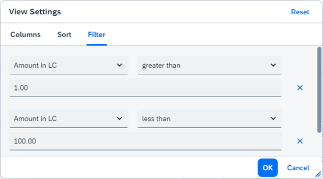
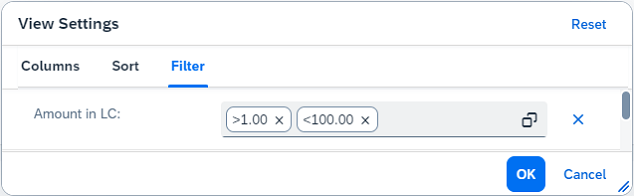

<!-- loio66e33f04bd084a36ad5a30fd30d25d88 -->

# What's New in SAPUI5 1.108

With this release SAPUI5 is upgraded from version 1.107 to 1.108.

****

<table>
<tr>
<th valign="top">

Version

</th>
<th valign="top">

Type

</th>
<th valign="top">

Category

</th>
<th valign="top">

Title

</th>
<th valign="top">

Description

</th>
<th valign="top">

Action

</th>
<th valign="top">

Available as of

</th>
</tr>
<tr>
<td valign="top">

1.108 

</td>
<td valign="top">

Deprecated 

</td>
<td valign="top">

Feature 

</td>
<td valign="top">

**Deprecations** 

</td>
<td valign="top">

**Deprecations**

There are currently no major deprecations. For a complete list of all deprecations, see [Deprecated APIs](https://ui5.sap.com/#/api/deprecated).

Deprecated•Feature•Info Only•1.108

</td>
<td valign="top">

Info Only 

</td>
<td valign="top">

2022-11-03

</td>
</tr>
<tr>
<td valign="top">

1.108 

</td>
<td valign="top">

Changed 

</td>
<td valign="top">

Control 

</td>
<td valign="top">

**`sap.ui.comp.smarttable.SmartTable`** 

</td>
<td valign="top">

**`sap.ui.comp.smarttable.SmartTable`**

-   We have enhanced the `customizeConfig` property: It now supports `autoColumnWidth` configuration settings, which influence the automatic calculation of the column width for columns generated by the `SmartTable` control itself. For more information, see the [API Reference](https://ui5.sap.com/#/api/sap.ui.comp.smarttable.SmartTable%23methods/getCustomizeConfig).

-   We have enhanced the data export to the cloud: Now it is possible to select a file in a Google Sheets format and export it to a Google Workspace file share. For more information, see the SAP Note [3216632](https://me.sap.com/notes/3216632).

Changed•Control•Info Only•1.108

</td>
<td valign="top">

Info Only 

</td>
<td valign="top">

2022-11-03

</td>
</tr>
<tr>
<td valign="top">

1.108 

</td>
<td valign="top">

Changed 

</td>
<td valign="top">

Feature 

</td>
<td valign="top">

**Visualization of Changes in Key User Adaptation** 

</td>
<td valign="top">

**Visualization of Changes in Key User Adaptation**

When visualizing UI changes in key user adaptation, key users can now filter for unsaved changes. On platforms where the draft feature is available, key users can also filter for draft changes.

For more information, see the [Demo App](https://ui5.sap.com/test-resources/sap/ui/demoapps/demokit/rta/freestyle/test/flpSandbox.html?sap-ui-theme=sap_horizon#masterDetail-display).

Changed•Feature•Info Only•1.108

</td>
<td valign="top">

Info Only 

</td>
<td valign="top">

2022-11-03

</td>
</tr>
<tr>
<td valign="top">

1.108 

</td>
<td valign="top">

Changed 

</td>
<td valign="top">

SAP Fiori Elements 

</td>
<td valign="top">

**SAP Fiori elements for OData V2** 

</td>
<td valign="top">

**SAP Fiori elements for OData V2**

The following changes and new features are available for SAP Fiori elements for OData V2:

-   For controls such as the combo box, checkbox, date picker, or date time picker, a side effect is now triggered as soon as the value is set, instead of when the control is out of focus. For more information, see [Side Effects](../06_SAP_Fiori_Elements/side-effects-18b17bd.md).

-   The analytical list page now supports the dynamic date range in `SmartFilterBar`. For more information, see [Enabling Semantic Operators in the Filter Bar](../06_SAP_Fiori_Elements/enabling-semantic-operators-in-the-filter-bar-fef65d0.md).

-   The section title is now hidden in cases where the section contains only a table or a chart, and their title is a duplicate of the section title. For more information, see [Defining and Adapting Sections](../06_SAP_Fiori_Elements/defining-and-adapting-sections-facfea0.md).

Changed•SAP Fiori Elements•Info Only•1.108

</td>
<td valign="top">

Info Only 

</td>
<td valign="top">

2022-11-03

</td>
</tr>
<tr>
<td valign="top">

1.108 

</td>
<td valign="top">

Changed 

</td>
<td valign="top">

SAP Fiori Elements 

</td>
<td valign="top">

**SAP Fiori elements for OData V4** 

</td>
<td valign="top">

**SAP Fiori elements for OData V4**

The following changes and new features are available for SAP Fiori elements for OData V4:

-   You can now define exactly which application links are shown in the *Related Apps* menu. For more information, see [Enabling the Related Apps Button](../06_SAP_Fiori_Elements/enabling-the-related-apps-button-8dcfe2e.md).

-   You can now execute the `PrepareAction` or global side effects by pressing *Enter* in draft mode. For more information, see [Draft Handling](../06_SAP_Fiori_Elements/draft-handling-ed9aa41.md).

-   You can now add a custom message in the message bar above a table in the list report. For more information, see [Adding a Custom Message Strip to List Report, Analytical List Page and Object Page Tables](../06_SAP_Fiori_Elements/adding-a-custom-message-strip-to-list-report-analytical-list-page-and-object-page-tables-0fdbefb.md).

-   You can now render semantically connected fields as a link to enable navigation using these fields. For more information, see [Grouping of Fields](../06_SAP_Fiori_Elements/grouping-of-fields-cb1748e.md).

-   We now provide a keyboard shortcut to trigger the default positive action in a list report, object page, and subobject page. For more information, see [Keyboard Shortcuts](../06_SAP_Fiori_Elements/keyboard-shortcuts-0cd318c.md).

-   We now provide an option to skip the *Create* pop-up dialog for new actions in specific cases. For more information, see [Handling of the preferredMode Parameter](../06_SAP_Fiori_Elements/handling-of-the-preferredmode-parameter-bfaf3cc.md).

-   On mobile devices, header facets are now arranged horizontally and can be accessed via horizontal scrolling. For more information, see [Header Facets](../06_SAP_Fiori_Elements/header-facets-17dbd5b.md).

Changed•SAP Fiori Elements•Info Only•1.108

</td>
<td valign="top">

Info Only 

</td>
<td valign="top">

2022-11-03

</td>
</tr>
<tr>
<td valign="top">

1.108 

</td>
<td valign="top">

Changed 

</td>
<td valign="top">

Feature 

</td>
<td valign="top">

****TypeScript Demo App**** 

</td>
<td valign="top">

****TypeScript Demo App****

A new `TypeScript To-Do List` demo app is now available in both the Demo Apps and the Samples sections of the Demo Kit. For more information, see the [Samples](https://ui5.sap.com/#/entity/sap.m.sample.TsTodos).

Changed•Feature•Info Only•1.108

</td>
<td valign="top">

Info Only 

</td>
<td valign="top">

2022-11-03

</td>
</tr>
<tr>
<td valign="top">

1.108 

</td>
<td valign="top">

Changed 

</td>
<td valign="top">

Control 

</td>
<td valign="top">

**`sap.m.IllustratedMessage`** 

</td>
<td valign="top">

**`sap.m.IllustratedMessage`**

We have introduced a new illustration breakpoint variant `Dot`, suitable for spaces that don't have a lot of vertical space. For more information, see the [API Reference](https://ui5.sap.com/#/api/sap.m.IllustratedMessageSize).

Changed•Control•Info Only•1.108

</td>
<td valign="top">

Info Only 

</td>
<td valign="top">

2022-11-03

</td>
</tr>
<tr>
<td valign="top">

1.108 

</td>
<td valign="top">

Changed 

</td>
<td valign="top">

Control 

</td>
<td valign="top">

**`sap.m.Avatar`** 

</td>
<td valign="top">

**`sap.m.Avatar`**

Up to three Latin letters can be displayed as initials in a `sap.m.Avatar`. For more information, see the [API Reference](https://ui5.sap.com/#/api/sap.m.Avatar) and the [Sample](https://ui5.sap.com/#/entity/sap.m.Avatar/sample/sap.m.sample.Avatar). 

Changed•Control•Info Only•1.108

</td>
<td valign="top">

Info Only 

</td>
<td valign="top">

2022-11-03

</td>
</tr>
<tr>
<td valign="top">

1.108 

</td>
<td valign="top">

Changed 

</td>
<td valign="top">

Feature 

</td>
<td valign="top">

**Replacement for `jQuery.fn.control`** 

</td>
<td valign="top">

**Replacement for `jQuery.fn.control`**

To become more independent from specific jQuery functionality, we now provide the new `sap.ui.core.Element#closestTo` method as a replacement for the `jQuery.fn.control` extension function, which is commonly used to retrieve the nearest SAPUI5 control that wraps a given DOM element. The new method returns a single SAPUI5 element instead of the array of SAPUI5 elements returned by `jQuery.fn.control`. You might therefore need to add an outer loop when migrating your code to the new API.

For more information, see [Replacement of Deprecated jQuery APIs](../04_Essentials/replacement-of-deprecated-jquery-apis-a075ed8.md)and the [API Reference](https://ui5.sap.com/#/api/sap.ui.core.Element/methods/sap.ui.core.Element.closestTo).

Changed•Feature•Info Only•1.108

</td>
<td valign="top">

Info Only 

</td>
<td valign="top">

2022-11-03

</td>
</tr>
<tr>
<td valign="top">

1.108 

</td>
<td valign="top">

Changed 

</td>
<td valign="top">

Feature 

</td>
<td valign="top">

**SAPUI5 OData V4 Model** 

</td>
<td valign="top">

**SAPUI5 OData V4 Model**

The new version of the SAPUI5 OData V4 model introduces the following features:

-   We now provide "deferred delete" requests: You can call the `sap.ui.model.odata.v4.Context#delete` method with an API group; the back-end request is then only sent when `ODataModel#submitBatch` is called for this API group. For more information, see [Deleting an Entity](../04_Essentials/deleting-an-entity-2613ebc.md).
-   We have improved our documentation of how to overwrite value list annotations in local annotation files. For more information, see [Value Lists](../04_Essentials/value-lists-ab267a6.md).
-   The `dataRequested` and `dataReceived` events introduced with SAPUI5 1.106 for the `sap.ui.model.odata.v4.ODataModel` now provide the path for additional property requests.For more information, see the API Reference for [`ODataModel.dataReceived`](https://ui5.sap.com/#/api/sap.ui.model.odata.v4.ODataModel/events/dataReceived) and [`ODataModel.dataRequested`](https://ui5.sap.com/#/api/sap.ui.model.odata.v4.ODataModel/events/dataRequested).

Changed•Feature•Info Only•1.108

</td>
<td valign="top">

Info Only 

</td>
<td valign="top">

2022-11-03

</td>
</tr>
<tr>
<td valign="top">

1.108 

</td>
<td valign="top">

Changed 

</td>
<td valign="top">

Feature 

</td>
<td valign="top">

**SAPUI5 OData V2 Model** 

</td>
<td valign="top">

**SAPUI5 OData V2 Model**

The new version of the SAPUI5 OData V2 model introduces the following features:

-   We now support "deep create" requests for navigation properties of cardinality "many". For more information, see [Deep Create](../04_Essentials/odata-v2-model-6c47b2b.md#loio4c4cd99af9b14e08bb72470cc7cabff4__section_DCR).
-   We now provide the new `sap.ui.model.ClientTreeBinding#getCount` method.For more information, see the [API Reference](https://ui5.sap.com/#/api/sap.ui.model.ClientTreeBinding/methods/getCount).
-   When you use an `sap.ui.model.type.Currency`, `sap.ui.model.odata.type.Currency`, or the currency instance of `sap.ui.core.format.NumberFormat`, entered currency codes are now parsed case-insensitively where possible.
-   We have introduced the new `calendarWeekNumbering` format option for `sap.ui.core.format.DateFormat`.

Changed•Feature•Info Only•1.108

</td>
<td valign="top">

Info Only 

</td>
<td valign="top">

2022-11-03

</td>
</tr>
<tr>
<td valign="top">

1.108 

</td>
<td valign="top">

Changed 

</td>
<td valign="top">

Control 

</td>
<td valign="top">

**sap.m.Carousel** 

</td>
<td valign="top">

**sap.m.Carousel**

We have improved the keyboard interaction and accessibility of the control. The initial focus is now on the active carousel item, unlike before, when it was on the carousel container. This allows you to focus on a concrete item and provides more information to the screen readers.For more information, see the [Sample](https://ui5.sap.com/#/entity/sap.m.Carousel/sample/sap.m.sample.CarouselWithMorePages).

Changed•Control•Info Only•1.108

</td>
<td valign="top">

Info Only 

</td>
<td valign="top">

2022-11-03

</td>
</tr>
<tr>
<td valign="top">

1.108 

</td>
<td valign="top">

Changed 

</td>
<td valign="top">

Control 

</td>
<td valign="top">

**`sap.ui.comp.smarttable.SmartTable` and `sap.ui.comp.smartchart.SmartChart`** 

</td>
<td valign="top">

**`sap.ui.comp.smarttable.SmartTable` and `sap.ui.comp.smartchart.SmartChart`**

To improve the user experience, we have changed the filter panel in the table personalization dialog.

Until now, the user had to add each filtering operator on a new line:

As of now, there is a value help available for the input field and all selected filtering operators are displayed in one line per each filtered column:

For more information, see the [Sample](https://ui5.sap.com/#/entity/sap.ui.comp.smarttable.SmartTable/sample/sap.ui.comp.sample.smarttable).

Changed•Control•Info Only•1.108

</td>
<td valign="top">

Info Only 

</td>
<td valign="top">

2022-11-03

</td>
</tr>
<tr>
<td valign="top">

1.108 

</td>
<td valign="top">

Changed 

</td>
<td valign="top">

Control 

</td>
<td valign="top">

**`sap.ui.integration.widgets.Card`** 

</td>
<td valign="top">

**`sap.ui.integration.widgets.Card`**

-   The Adaptive card now uses the recently released 1.7.0 UI5 WebComponents bundle. For more information, see the [Adaptive Card](https://ui5.sap.com/test-resources/sap/ui/integration/demokit/cardExplorer/webapp/index.html#/learn/typesOther/adaptive) Learn section in the Card Explorer.

-   You can now configure the visibility of the card footer using the new `visible` boolean property. Card developers can set this property in the manifest. Additionally, they can add it to the `Configuration.js`, which will also enable card administrators, who are using the Configuration editor, to control the visibility of the card footer. For more information, see the [Card Footer](https://ui5.sap.com/test-resources/sap/ui/integration/demokit/cardExplorer/webapp/index.html#/learn/footer) section and the [Sample](https://ui5.sap.com/test-resources/sap/ui/integration/demokit/cardExplorer/webapp/index.html#/explore/footer/hiddenFooter) in the Card Explorer.

-   We have made the loading placeholder for Analytical cards more detailed to better reveal the expected loading content. For more information, see the [Sample](https://ui5.sap.com/#/entity/sap.ui.integration.widgets.Card/sample/sap.ui.integration.sample.LazyLoading).

-   We have \(experimentally\) enhanced the `sap.ui.integration.Extension` with a new `loadDependencies` lifecycle hook. As a card developer, you can use it to load critical dependencies for your extension, without which the data cannot be displayed. While the dependencies are loaded, the card displays a loading animation. This hook is asynchronous, so other tasks won't be blocked. For more information, see the [Card Extension](https://ui5.sap.com/test-resources/sap/ui/integration/demokit/cardExplorer/webapp/index.html#/learn/features/extension) section and the [Sample](https://ui5.sap.com/test-resources/sap/ui/integration/demokit/cardExplorer/webapp/index.html#/explore/extension/loadDependencies) in the Card Explorer, and the [API Reference](https://ui5.sap.com/#/api/sap.ui.integration.Extension).

-   A new `visible` property is now introduced for icons and avatars to achieve consistency in representation if an empty value for the `src` property is used in the card manifest. The new property is available for:

    -   Default Header
    -   Sap.f.CardHeader
    -   ObjectContent
    -   TableContent
    -   List Content

    For more information, see the [Sample](https://ui5.sap.com/test-resources/sap/ui/integration/demokit/cardExplorer/webapp/index.html#/explore/object/iconVisibility) in the Card Explorer. 

Changed•Control•Info Only•1.108

</td>
<td valign="top">

Info Only 

</td>
<td valign="top">

2022-11-03

</td>
</tr>
<tr>
<td valign="top">

1.108 

</td>
<td valign="top">

UI Changed 

</td>
<td valign="top">

Announcement 

</td>
<td valign="top">

**Analytical List Pages: Date Ranges Supported** 

</td>
<td valign="top">

**Analytical List Pages: Date Ranges Supported**

> ### Note:  
> The following information concerns important upcoming changes for end users. These changes may require end users to adjust and/or test cases to be adapted, but they won't stop or disrupt software or processes.

Filter fields on analytical list pages now provide date range options.

UI Changed•Announcement•Info Only•1.108

</td>
<td valign="top">

Info Only 

</td>
<td valign="top">

2022-11-03

</td>
</tr>
</table>

**Related Information**  

[What's New in SAPUI5 1.131](what-s-new-in-sapui5-1-131-7d24d94.md "With this release SAPUI5 is upgraded from version 1.130 to 1.131.")

[What's New in SAPUI5 1.130](what-s-new-in-sapui5-1-130-85609d4.md "With this release SAPUI5 is upgraded from version 1.129 to 1.130.")

[What's New in SAPUI5 1.129](what-s-new-in-sapui5-1-129-d22b8af.md "With this release SAPUI5 is upgraded from version 1.128 to 1.129.")

[What's New in SAPUI5 1.128](what-s-new-in-sapui5-1-128-1f76220.md "With this release SAPUI5 is upgraded from version 1.127 to 1.128.")

[What's New in SAPUI5 1.127](what-s-new-in-sapui5-1-127-e5e1317.md "With this release SAPUI5 is upgraded from version 1.126 to 1.127.")

[What's New in SAPUI5 1.126](what-s-new-in-sapui5-1-126-1d98116.md "With this release SAPUI5 is upgraded from version 1.125 to 1.126.")

[What's New in SAPUI5 1.125](what-s-new-in-sapui5-1-125-9d87044.md "With this release SAPUI5 is upgraded from version 1.124 to 1.125.")

[What's New in SAPUI5 1.124](what-s-new-in-sapui5-1-124-7f77c3f.md "With this release SAPUI5 is upgraded from version 1.123 to 1.124.")

[What's New in SAPUI5 1.123](what-s-new-in-sapui5-1-123-9d00ac7.md "With this release SAPUI5 is upgraded from version 1.122 to 1.123.")

[What's New in SAPUI5 1.122](what-s-new-in-sapui5-1-122-5d078da.md "With this release SAPUI5 is upgraded from version 1.121 to 1.122.")

[What's New in SAPUI5 1.121](what-s-new-in-sapui5-1-121-91a4a2f.md "With this release SAPUI5 is upgraded from version 1.120 to 1.121.")

[What's New in SAPUI5 1.120](what-s-new-in-sapui5-1-120-2359b63.md "With this release SAPUI5 is upgraded from version 1.119 to 1.120.")

[What's New in SAPUI5 1.119](what-s-new-in-sapui5-1-119-0b1903a.md "With this release SAPUI5 is upgraded from version 1.118 to 1.119.")

[What's New in SAPUI5 1.118](what-s-new-in-sapui5-1-118-3eecbde.md "With this release SAPUI5 is upgraded from version 1.117 to 1.118.")

[What's New in SAPUI5 1.117](what-s-new-in-sapui5-1-117-029d3b4.md "With this release SAPUI5 is upgraded from version 1.116 to 1.117.")

[What's New in SAPUI5 1.116](what-s-new-in-sapui5-1-116-ebd6f34.md "With this release SAPUI5 is upgraded from version 1.115 to 1.116.")

[What's New in SAPUI5 1.115](what-s-new-in-sapui5-1-115-409fde8.md "With this release SAPUI5 is upgraded from version 1.114 to 1.115.")

[What's New in SAPUI5 1.114](what-s-new-in-sapui5-1-114-890fce1.md "With this release SAPUI5 is upgraded from version 1.113 to 1.114.")

[What's New in SAPUI5 1.113](what-s-new-in-sapui5-1-113-a9553fe.md "With this release SAPUI5 is upgraded from version 1.112 to 1.113.")

[What's New in SAPUI5 1.112](what-s-new-in-sapui5-1-112-34afc69.md "With this release SAPUI5 is upgraded from version 1.111 to 1.112.")

[What's New in SAPUI5 1.111](what-s-new-in-sapui5-1-111-7a67837.md "With this release SAPUI5 is upgraded from version 1.110 to 1.111.")

[What's New in SAPUI5 1.110](what-s-new-in-sapui5-1-110-71a855c.md "With this release SAPUI5 is upgraded from version 1.109 to 1.110.")

[What's New in SAPUI5 1.109](what-s-new-in-sapui5-1-109-3264bd2.md "With this release SAPUI5 is upgraded from version 1.108 to 1.109.")

[What's New in SAPUI5 1.107](what-s-new-in-sapui5-1-107-d4ff916.md "With this release SAPUI5 is upgraded from version 1.106 to 1.107.")

[What's New in SAPUI5 1.106](what-s-new-in-sapui5-1-106-5b497b0.md "With this release SAPUI5 is upgraded from version 1.105 to 1.106.")

[What's New in SAPUI5 1.105](what-s-new-in-sapui5-1-105-4d6c00e.md "With this release SAPUI5 is upgraded from version 1.104 to 1.105.")

[What's New in SAPUI5 1.104](what-s-new-in-sapui5-1-104-69e567c.md "With this release SAPUI5 is upgraded from version 1.103 to 1.104.")

[What's New in SAPUI5 1.103](what-s-new-in-sapui5-1-103-0e98c76.md "With this release SAPUI5 is upgraded from version 1.102 to 1.103.")

[What's New in SAPUI5 1.102](what-s-new-in-sapui5-1-102-f038c99.md "With this release SAPUI5 is upgraded from version 1.101 to 1.102.")

[What's New in SAPUI5 1.101](what-s-new-in-sapui5-1-101-7733b00.md "With this release SAPUI5 is upgraded from version 1.100 to 1.101.")

[What's New in SAPUI5 1.100](what-s-new-in-sapui5-1-100-27dec1d.md "With this release SAPUI5 is upgraded from version 1.99 to 1.100.")

[What's New in SAPUI5 1.99](what-s-new-in-sapui5-1-99-4f35848.md "With this release SAPUI5 is upgraded from version 1.98 to 1.99.")

[What's New in SAPUI5 1.98](what-s-new-in-sapui5-1-98-d9f16f2.md "With this release SAPUI5 is upgraded from version 1.97 to 1.98.")

[What's New in SAPUI5 1.97](what-s-new-in-sapui5-1-97-fa0e282.md "With this release SAPUI5 is upgraded from version 1.96 to 1.97.")

[What's New in SAPUI5 1.96](what-s-new-in-sapui5-1-96-7a9269f.md "With this release SAPUI5 is upgraded from version 1.95 to 1.96.")

[What's New in SAPUI5 1.95](what-s-new-in-sapui5-1-95-a1aea67.md "With this release SAPUI5 is upgraded from version 1.94 to 1.95.")

[What's New in SAPUI5 1.94](what-s-new-in-sapui5-1-94-c40f1e6.md "With this release SAPUI5 is upgraded from version 1.93 to 1.94.")

[What's New in SAPUI5 1.93](what-s-new-in-sapui5-1-93-f273340.md "With this release SAPUI5 is upgraded from version 1.92 to 1.93.")

[What's New in SAPUI5 1.92](what-s-new-in-sapui5-1-92-1ef345d.md "With this release SAPUI5 is upgraded from version 1.91 to 1.92.")

[What's New in SAPUI5 1.91](what-s-new-in-sapui5-1-91-0a2bd79.md "With this release SAPUI5 is upgraded from version 1.90 to 1.91.")

[What's New in SAPUI5 1.90](what-s-new-in-sapui5-1-90-91c10c2.md "With this release SAPUI5 is upgraded from version 1.89 to 1.90.")

[What's New in SAPUI5 1.89](what-s-new-in-sapui5-1-89-e56cddc.md "With this release SAPUI5 is upgraded from version 1.88 to 1.89.")

[What's New in SAPUI5 1.88](what-s-new-in-sapui5-1-88-e15a206.md "With this release SAPUI5 is upgraded from version 1.87 to 1.88.")

[What's New in SAPUI5 1.87](what-s-new-in-sapui5-1-87-b506da7.md "With this release SAPUI5 is upgraded from version 1.86 to 1.87.")

[What's New in SAPUI5 1.86](what-s-new-in-sapui5-1-86-4c1c959.md "With this release SAPUI5 is upgraded from version 1.85 to 1.86.")

[What's New in SAPUI5 1.85](what-s-new-in-sapui5-1-85-1d18eb5.md "With this release SAPUI5 is upgraded from version 1.84 to 1.85.")

[What's New in SAPUI5 1.84](what-s-new-in-sapui5-1-84-dc76640.md "With this release SAPUI5 is upgraded from version 1.82 to 1.84.")

[What's New in SAPUI5 1.82](what-s-new-in-sapui5-1-82-3a8dd13.md "With this release SAPUI5 is upgraded from version 1.81 to 1.82.")

[What's New in SAPUI5 1.81](what-s-new-in-sapui5-1-81-f5e2a21.md "With this release SAPUI5 is upgraded from version 1.80 to 1.81.")

[What's New in SAPUI5 1.80](what-s-new-in-sapui5-1-80-8cee506.md "With this release SAPUI5 is upgraded from version 1.79 to 1.80.")

[What's New in SAPUI5 1.79](what-s-new-in-sapui5-1-79-99c4cdc.md "With this release SAPUI5 is upgraded from version 1.78 to 1.79.")

[What's New in SAPUI5 1.78](what-s-new-in-sapui5-1-78-f09b63e.md "With this release SAPUI5 is upgraded from version 1.77 to 1.78.")

[What's New in SAPUI5 1.77](what-s-new-in-sapui5-1-77-c46b439.md "With this release SAPUI5 is upgraded from version 1.76 to 1.77.")

[What's New in SAPUI5 1.76](what-s-new-in-sapui5-1-76-aad03b5.md "With this release SAPUI5 is upgraded from version 1.75 to 1.76.")

[What's New in SAPUI5 1.75](what-s-new-in-sapui5-1-75-5cbb62d.md "With this release SAPUI5 is upgraded from version 1.74 to 1.75.")

[What's New in SAPUI5 1.74](what-s-new-in-sapui5-1-74-c22208a.md "With this release SAPUI5 is upgraded from version 1.73 to 1.74.")

[What's New in SAPUI5 1.73](what-s-new-in-sapui5-1-73-231dd13.md "With this release SAPUI5 is upgraded from version 1.72 to 1.73.")

[What's New in SAPUI5 1.72](what-s-new-in-sapui5-1-72-521cad9.md "With this release SAPUI5 is upgraded from version 1.71 to 1.72.")

[What's New in SAPUI5 1.71](what-s-new-in-sapui5-1-71-a93a6a3.md "With this release SAPUI5 is upgraded from version 1.70 to 1.71.")

[What's New in SAPUI5 1.70](what-s-new-in-sapui5-1-70-f073d69.md "With this release SAPUI5 is upgraded from version 1.69 to 1.70.")

[What's New in SAPUI5 1.69](what-s-new-in-sapui5-1-69-89a18bd.md "With this release SAPUI5 is upgraded from version 1.68 to 1.69.")

[What's New in SAPUI5 1.68](what-s-new-in-sapui5-1-68-f94bf93.md "With this release SAPUI5 is upgraded from version 1.67 to 1.68.")

[What's New in SAPUI5 1.67](what-s-new-in-sapui5-1-67-a6b1472.md "With this release SAPUI5 is upgraded from version 1.66 to 1.67.")

[What's New in SAPUI5 1.66](what-s-new-in-sapui5-1-66-c9896e9.md "With this release SAPUI5 is upgraded from version 1.65 to 1.66.")

[What's New in SAPUI5 1.65](what-s-new-in-sapui5-1-65-0f5acfd.md "With this release SAPUI5 is upgraded from version 1.64 to 1.65.")

[What's New in SAPUI5 1.64](what-s-new-in-sapui5-1-64-0e30822.md "With this release SAPUI5 is upgraded from version 1.63 to 1.64.")

[What's New in SAPUI5 1.63](what-s-new-in-sapui5-1-63-e8d9da7.md "With this release SAPUI5 is upgraded from version 1.62 to 1.63.")

[What's New in SAPUI5 1.62](what-s-new-in-sapui5-1-62-771f4d5.md "With this release SAPUI5 is upgraded from version 1.61 to 1.62.")

[What's New in SAPUI5 1.61](what-s-new-in-sapui5-1-61-d991552.md "With this release SAPUI5 is upgraded from version 1.60 to 1.61.")

[What's New in SAPUI5 1.60](what-s-new-in-sapui5-1-60-5a0e1f7.md "With this release SAPUI5 is upgraded from version 1.58 to 1.60.")

[What's New in SAPUI5 1.58](what-s-new-in-sapui5-1-58-7c927aa.md "With this release SAPUI5 is upgraded from version 1.56 to 1.58.")

[What's New in SAPUI5 1.56](what-s-new-in-sapui5-1-56-108b7fd.md "With this release SAPUI5 is upgraded from version 1.54 to 1.56.")

[What's New in SAPUI5 1.54](what-s-new-in-sapui5-1-54-c838330.md "With this release SAPUI5 is upgraded from version 1.52 to 1.54.")

[What's New in SAPUI5 1.52](what-s-new-in-sapui5-1-52-849e1b6.md "With this release SAPUI5 is upgraded from version 1.50 to 1.52.")

[What's New in SAPUI5 1.50](what-s-new-in-sapui5-1-50-759e9f3.md "With this release SAPUI5 is upgraded from version 1.48 to 1.50.")

[What's New in SAPUI5 1.48](what-s-new-in-sapui5-1-48-fa1efac.md "With this release SAPUI5 is upgraded from version 1.46 to 1.48.")

[What's New in SAPUI5 1.46](what-s-new-in-sapui5-1-46-6307539.md "With this release SAPUI5 is upgraded from version 1.44 to 1.46.")

[What's New in SAPUI5 1.44](what-s-new-in-sapui5-1-44-a0cb7a0.md "With this release SAPUI5 is upgraded from version 1.42 to 1.44.")

[What's New in SAPUI5 1.42](what-s-new-in-sapui5-1-42-468b05d.md "With this release SAPUI5 is upgraded from version 1.40 to 1.42.")

[What's New in SAPUI5 1.40](what-s-new-in-sapui5-1-40-fbab50e.md "With this release SAPUI5 is upgraded from version 1.38 to 1.40.")

[What's New in SAPUI5 1.38](what-s-new-in-sapui5-1-38-f218918.md "With this release SAPUI5 is upgraded from version 1.36 to 1.38.")

