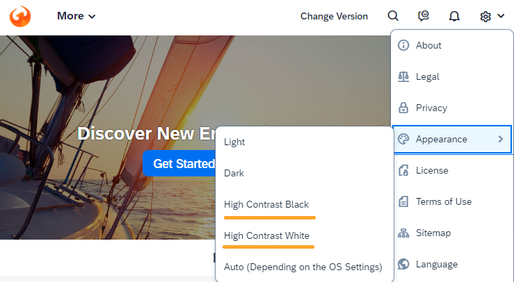

<!-- loio71a855cfc8ad43b2b19f03bcce65bef4 -->

<link rel="stylesheet" type="text/css" href="../css/sap-icons.css"/>

# What's New in SAPUI5 1.110

With this release SAPUI5 is upgraded from version 1.109 to 1.110.

****

<table>
<tr>
<th valign="top">

Version

</th>
<th valign="top">

Type

</th>
<th valign="top">

Category

</th>
<th valign="top">

Title

</th>
<th valign="top">

Description

</th>
<th valign="top">

Action

</th>
<th valign="top">

Available as of

</th>
</tr>
<tr>
<td valign="top">

1.110 

</td>
<td valign="top">

New 

</td>
<td valign="top">

Feature 

</td>
<td valign="top">

**`sap.m.p13n.Engine`** 

</td>
<td valign="top">

**`sap.m.p13n.Engine`**

We have provided a new entity that allows custom control developers and application developers to make use of available personalization settings for their controls, for example, for sorting, grouping, and managing variants, and handling personalization states. For more information, see the [API Reference](https://ui5.sap.com/#/api/sap.m.p13n.Engine) and the [Sample](https://ui5.sap.com/#/entity/sap.m.p13n.Engine/sample/sap.m.sample.p13n.Engine).

New•Feature•Info Only•1.110

</td>
<td valign="top">

Info Only 

</td>
<td valign="top">

2023-01-26

</td>
</tr>
<tr>
<td valign="top">

1.110 

</td>
<td valign="top">

New 

</td>
<td valign="top">

Feature 

</td>
<td valign="top">

**Copy-to-Clipboard Feature for Tables** 

</td>
<td valign="top">

**Copy-to-Clipboard Feature for Tables**

Users can copy selected table content to the clipboard and use it anywhere inside or outside an app. To achieve this, we have introduced the new `sap.m.plugins.CopyProvider` plugin. To extract the cell data from the table, we have created the `extractData` property. This new feature is available for grid and responsive tablesand smart tables. For more information, see the [API Reference](https://ui5.sap.com/#/api/sap.m.plugins.CopyProvider).

New•Feature•Info Only•1.110

</td>
<td valign="top">

Info Only 

</td>
<td valign="top">

2023-01-26

</td>
</tr>
<tr>
<td valign="top">

1.110 

</td>
<td valign="top">

Changed 

</td>
<td valign="top">

Feature 

</td>
<td valign="top">

**Spreadsheet Export** 

</td>
<td valign="top">

**Spreadsheet Export**

When you export data from `ClientListBinding` the data objects are now requested via the binding. This ensures that any related sorting and filtering is taken into account. For more information, see the [Sample](https://ui5.sap.com/#/entity/sap.ui.export.Spreadsheet/sample/sap.ui.export.sample.json).

Changed•Feature•Info Only•1.110

</td>
<td valign="top">

Info Only 

</td>
<td valign="top">

2023-01-26

</td>
</tr>
<tr>
<td valign="top">

1.110 

</td>
<td valign="top">

Deprecated 

</td>
<td valign="top">

Feature 

</td>
<td valign="top">

**Deprecations** 

</td>
<td valign="top">

**Deprecations**

There are currently no major deprecations. For a complete list of all deprecations, see [Deprecated APIs](https://ui5.sap.com/#/api/deprecated).

Deprecated•Feature•Info Only•1.110

</td>
<td valign="top">

Info Only 

</td>
<td valign="top">

2023-01-26

</td>
</tr>
<tr>
<td valign="top">

1.110 

</td>
<td valign="top">

Changed 

</td>
<td valign="top">

Control 

</td>
<td valign="top">

**`sap.ui.comp.smarttable.SmartTable`** 

</td>
<td valign="top">

**`sap.ui.comp.smarttable.SmartTable`**

-   The data exported when you select *Include filter settings* now contains additional application- and type-specific formatting for the filter settings. For example, if you export data and time information, it will be exported in an improved format. We have also improved other filter settings to make it easier to match labels in the application with property names. For more information, see the [API Reference](https://ui5.sap.com/#/api/sap.ui.comp.smarttable.SmartTable%23events/beforeExport)  and the [Sample](https://ui5.sap.com/#/entity/sap.ui.comp.smarttable.SmartTable/sample/sap.ui.comp.sample.smarttable).

-   We have now provided a binding for the `semanticObject` property for `SmartLink` controls. For example, the binding for `Common.SemanticObject.Path` of the `semanticObject` annotation makes it possible to define different semantic objects for a smart link. For more information, see the [API Reference](https://ui5.sap.com/#/api/sap.ui.comp.smarttable.SmartTable%23annotations/SemanticObject).

Changed•Control•Info Only•1.110

</td>
<td valign="top">

Info Only 

</td>
<td valign="top">

2023-01-26

</td>
</tr>
<tr>
<td valign="top">

1.110 

</td>
<td valign="top">

New 

</td>
<td valign="top">

Control 

</td>
<td valign="top">

**`sap.m.table.ColumnMenu`** 

</td>
<td valign="top">

**`sap.m.table.ColumnMenu`**

We have introduced a new control that allows users to do the following in grid and responsive tables:

-   Quick sorting

-   Quick filtering

-   Quick grouping

-   Quick selection of columns

-   Quick totaling

These features are available in a menu that users can choose in the column headers of the tables. Applications can define their own application-specific quick actions.

> ### Note:  
> The menu is also available in the `SmartTable` control.

For more information, see the [API Reference](https://ui5.sap.com/#/api/sap.m.table.columnmenu)  and the [Sample](https://ui5.sap.com/#/entity/sap.ui.comp.smarttable.SmartTable/sample/sap.ui.comp.sample.smarttable). 

New•Control•Info Only•1.110

</td>
<td valign="top">

Info Only 

</td>
<td valign="top">

2023-01-26

</td>
</tr>
<tr>
<td valign="top">

1.110 

</td>
<td valign="top">

Changed 

</td>
<td valign="top">

Feature 

</td>
<td valign="top">

**Header Bar in Key User Adaptation** 

</td>
<td valign="top">

**Header Bar in Key User Adaptation**

The header bar in key user adaptation has been redesigned.

-   The *Save & Exit* button has been replaced by two separate buttons for *Save* \(:floppy_disk:\) and *Exit* \(:x:\).

-   For each action, an icon is now displayed.

-   Actions that are available in some environments only, like *Translate*, *Manage App Variants*, and *Save As*, have been moved to a *More Actions* menu that key users access by clicking on a new hamburger icon \(\).

    When the *More Actions* menu has no entries, like in the demo apps in the SAPUI5 demo kit, the hamburger icon is hidden.

The following screenshot shows an example:

Changed•Feature•Info Only•1.110

</td>
<td valign="top">

Info Only 

</td>
<td valign="top">

2023-01-26

</td>
</tr>
<tr>
<td valign="top">

1.110 

</td>
<td valign="top">

Changed 

</td>
<td valign="top">

Control 

</td>
<td valign="top">

****`sap.m.PlanningCalendar, sap.m.SinglePlanningCalendar`**, and **`sap.ui.core.format.DateFormat`**** 

</td>
<td valign="top">

****`sap.m.PlanningCalendar, sap.m.SinglePlanningCalendar`**, and **`sap.ui.core.format.DateFormat`****

We have adapted our Date and Time controls to support the calendar week based on the `sap.ui.core.format.DateFormat` options.

For more information, see the [API Reference](https://ui5.sap.com/#/api/sap.ui.core.format.DateFormat). 

Changed•Control•Info Only•1.110

</td>
<td valign="top">

Info Only 

</td>
<td valign="top">

2023-01-26

</td>
</tr>
<tr>
<td valign="top">

1.110 

</td>
<td valign="top">

Changed 

</td>
<td valign="top">

Control 

</td>
<td valign="top">

**`sap.m.ObjectStatus`** 

</td>
<td valign="top">

**`sap.m.ObjectStatus`**

We have implemented a new property to give application developers the ability to override the default state announcement. Now the `group` role isn't placed on inactive control instances and a proper `roledescription` is set for active control instances.

For more information, see the [API Reference](https://ui5.sap.com/#/api/sap.m.ObjectStatus). 

Changed•Control•Info Only•1.110

</td>
<td valign="top">

Info Only 

</td>
<td valign="top">

2023-01-26

</td>
</tr>
<tr>
<td valign="top">

1.110 

</td>
<td valign="top">

Changed 

</td>
<td valign="top">

Control 

</td>
<td valign="top">

**`sap.ui.core.ScrollEnablement`** 

</td>
<td valign="top">

**`sap.ui.core.ScrollEnablement`**

We have added a new option to the `scrollToElement` API method of the `sap.ui.core.ScrollEnablement` class. If the new `bSkipElementsInScrollport` parameter is set to `true`, scrolling will happen only if necessary. For more information, see the [API Reference](https://ui5.sap.com/#/api/sap.ui.core.delegate.ScrollEnablemen/methods/scrollToElement).

Changed•Control•Info Only•1.110

</td>
<td valign="top">

Info Only 

</td>
<td valign="top">

2023-01-26

</td>
</tr>
<tr>
<td valign="top">

1.110 

</td>
<td valign="top">

Changed 

</td>
<td valign="top">

Control 

</td>
<td valign="top">

**`sap.m.IllustratedMessage`** 

</td>
<td valign="top">

**`sap.m.IllustratedMessage`**

The `IllustratedMessage`'s sample of the default set of illustrations is now split into three different samples depending on their visual style: classic, illustrative, and simple.

For more information, see the [Samples](https://ui5.sap.com/#/entity/sap.m.IllustratedMessage).

Changed•Control•Info Only•1.110

</td>
<td valign="top">

Info Only 

</td>
<td valign="top">

2023-01-26

</td>
</tr>
<tr>
<td valign="top">

1.110 

</td>
<td valign="top">

Changed 

</td>
<td valign="top">

Control 

</td>
<td valign="top">

**`sap.m.ComboBox`** 

</td>
<td valign="top">

**`sap.m.ComboBox`**

We have updated the behavior of the `loadItems` API. Now, when the picker is open and no items are loaded - the *No data* label is loaded in the list. For more information, see the [Sample](https://ui5.sap.com/#/entity/sap.m.ComboBox/sample/sap.m.sample.ComboBoxLazyLoading).

Changed•Control•Info Only•1.110

</td>
<td valign="top">

Info Only 

</td>
<td valign="top">

2023-01-26

</td>
</tr>
<tr>
<td valign="top">

1.110 

</td>
<td valign="top">

Changed 

</td>
<td valign="top">

Feature 

</td>
<td valign="top">

**Demo Kit: Improved main theme selection** 

</td>
<td valign="top">

**Demo Kit: Improved main theme selection**

We have added the latest high contrast themes to the main theme selector in the Demo Kit.

Changed•Feature•Info Only•1.110

</td>
<td valign="top">

Info Only 

</td>
<td valign="top">

2023-01-26

</td>
</tr>
<tr>
<td valign="top">

1.110 

</td>
<td valign="top">

Changed 

</td>
<td valign="top">

Control 

</td>
<td valign="top">

**`sap.ui.integration.widgets.Card`** 

</td>
<td valign="top">

**`sap.ui.integration.widgets.Card`**

-   List and Object cards can now display \(default\) icons for object attributes of states `Error`, `Warning`, `Success` or `Information`. The icons are shown if the new `showStateIcon` property is set to `true`. For more information, see the [Attributes](https://ui5.sap.com/test-resources/sap/ui/integration/demokit/cardExplorer/webapp/index.html#/explore/list/attributes) and the [Form Inputs](https://ui5.sap.com/test-resources/sap/ui/integration/demokit/cardExplorer/webapp/index.html#/explore/object/form) examples in the Card Explorer.

-   We have improved the loading of the libraries that are specified in the `dependencies` attribute of the `sap.ui5` namespace. This option allows you to use other libraries in the card. For more information, see the [Card Manifest](https://ui5.sap.com/test-resources/sap/ui/integration/demokit/cardExplorer/webapp/index.html#/learn/cardManifest) section and the [Shared Extension](https://ui5.sap.com/test-resources/sap/ui/integration/demokit/cardExplorer/webapp/index.html#/explore/extension/sharedExtension) example in the Card Explorer.

-   As a card developer, you can now dynamically hide the filters in the card using the new `visible` property. For more information, see the [Multiple Filters](https://ui5.sap.com/test-resources/sap/ui/integration/demokit/cardExplorer/webapp/index.html#/explore/searchFilter/multipleFilters) example in the Card Explorer.

Changed•Control•Info Only•1.110

</td>
<td valign="top">

Info Only 

</td>
<td valign="top">

2023-01-26

</td>
</tr>
<tr>
<td valign="top">

1.110 

</td>
<td valign="top">

Changed 

</td>
<td valign="top">

Control 

</td>
<td valign="top">

**`sap.ui.comp.smartfield.SmartField`** 

</td>
<td valign="top">

**`sap.ui.comp.smartfield.SmartField`**

When the control renders a combo box, it gets the text arrangement for the dropdown list from the value-list property that is mapped to the local property, and which has the value-list annotation. Alternatively, if there is no such setting provided there, as before, it looks to find the text arrangement consecutively from the same local property, the entity type of the local property, or finally defaults to `description (ID)`.For more information, see the [API Reference](https://ui5.sap.com/#/api/sap.ui.comp.smartfield.ComboBox).

Changed•Control•Info Only•1.110

</td>
<td valign="top">

Info Only 

</td>
<td valign="top">

2023-01-26

</td>
</tr>
<tr>
<td valign="top">

1.110 

</td>
<td valign="top">

Changed 

</td>
<td valign="top">

SAP Fiori Elements 

</td>
<td valign="top">

**SAP Fiori elements for OData V2** 

</td>
<td valign="top">

**SAP Fiori elements for OData V2**

The following changes and new features are available for SAP Fiori elements for OData V2:

-   You can now group the multi-input fields along with other fields as a source for side effects. For more information, see [Side Effect Annotations: Examples](../06_SAP_Fiori_Elements/side-effect-annotations-examples-61cf21d.md).

-   In edit mode, we now provide an option to hide the empty rows of a table in the object page. For more information, see [Enabling Inline Creation Mode or Empty Row Mode for Table Entries](../06_SAP_Fiori_Elements/enabling-inline-creation-mode-or-empty-row-mode-for-table-entries-cfb04f0.md).

-   We have added a new button, *Validate*, to the object page for applications that are being run on tablets and mobile devices. For more information, see [Draft Handling](../06_SAP_Fiori_Elements/draft-handling-ed9aa41.md).

-   The message grouping and structuring is now improved in the message popover and message view.

Changed•SAP Fiori Elements•Info Only•1.110

</td>
<td valign="top">

Info Only 

</td>
<td valign="top">

2023-01-26

</td>
</tr>
<tr>
<td valign="top">

1.110 

</td>
<td valign="top">

Changed 

</td>
<td valign="top">

SAP Fiori Elements 

</td>
<td valign="top">

**SAP Fiori elements for OData V4** 

</td>
<td valign="top">

**SAP Fiori elements for OData V4**

The following changes and new features are available for SAP Fiori elements for OData V4:

-   The `UI.DataFieldWithUrl` annotation now supports the `IconUrl` property. For more information, see [Different Representations of a Field](../06_SAP_Fiori_Elements/different-representations-of-a-field-c18ada4.md).

-   In apps using the flexible column layout, the state of the object page is now stored/restored using `iAppState`. For more information, see [Enabling Discovery/Persistence Mode](../06_SAP_Fiori_Elements/enabling-discovery-persistence-mode-7c62084.md).

-   You can now add a *Clear* button to the filter bar in the list report, enabling users to clear all filter fields, by making the required settings in the `manifest.json`. For more information, see [Adapting the Filter Bar](../06_SAP_Fiori_Elements/adapting-the-filter-bar-609c39a.md).

-   Changes coming in from other flex layers, such as changes made by key users, are merged with user personalization changes coming from the `iAppState`. For more information, see [Store/Restore the Application State](../06_SAP_Fiori_Elements/store-restore-the-application-state-46bf248.md).

-   The *Edit* button can now be displayed and enabled in both object and subobject pages. For more information, see [Enabling Actions in the Object Page Header](../06_SAP_Fiori_Elements/enabling-actions-in-the-object-page-header-5fe4396.md).

Changed•SAP Fiori Elements•Info Only•1.110

</td>
<td valign="top">

Info Only 

</td>
<td valign="top">

2023-01-26

</td>
</tr>
<tr>
<td valign="top">

1.110 

</td>
<td valign="top">

Changed 

</td>
<td valign="top">

Control 

</td>
<td valign="top">

**`sap.m.SelectDialog`** 

</td>
<td valign="top">

**`sap.m.SelectDialog`**

You can now control the placeholder text in the inner search field using the new `searchPlaceholder` property. If not set, the word `Search` in the current local language or in English will be used as a placeholder.

For more information, see the [API Reference](https://ui5.sap.com/#/api/sap.m.SelectDialog) and the [Sample](https://ui5.sap.com/#/entity/sap.m.SelectDialog/sample/sap.m.sample.SelectDialog).

Changed•Control•Info Only•1.110

</td>
<td valign="top">

Info Only 

</td>
<td valign="top">

2023-01-26

</td>
</tr>
<tr>
<td valign="top">

1.110 

</td>
<td valign="top">

Changed 

</td>
<td valign="top">

Control 

</td>
<td valign="top">

**`sap.m.Dialog`** 

</td>
<td valign="top">

**`sap.m.Dialog`**

We have added a new `footer` aggregation of type `sap.m.Toolbar` to the control. You can now use this horizontal container to display controls that fit different custom scenarios, for example, a button that shows a message popover.For more information, see the [API Reference](https://ui5.sap.com/#/api/sap.m.Dialog) and the [Sample](https://ui5.sap.com/#/entity/sap.m.Dialog/sample/sap.m.sample.DialogWithMessagePopover).

Changed•Control•Info Only•1.110

</td>
<td valign="top">

Info Only 

</td>
<td valign="top">

2023-01-26

</td>
</tr>
<tr>
<td valign="top">

1.110 

</td>
<td valign="top">

Changed 

</td>
<td valign="top">

Control 

</td>
<td valign="top">

**`sap.m.Carousel`** 

</td>
<td valign="top">

**`sap.m.Carousel`**

Using the new `backgroundDesign` property, you can now set the carousel’s background color as `Translucent` \(Default\), `Solid`, or `Transparent`.For more information, see the [API Reference](https://ui5.sap.com/#/api/sap.m.Carousel) and the [Sample](https://ui5.sap.com/#/entity/sap.m.Carousel/sample/sap.m.sample.CarouselWithDisplayOptions).

Changed•Control•Info Only•1.110

</td>
<td valign="top">

Info Only 

</td>
<td valign="top">

2023-01-26

</td>
</tr>
<tr>
<td valign="top">

1.110 

</td>
<td valign="top">

Changed 

</td>
<td valign="top">

Feature 

</td>
<td valign="top">

****SAPUI5 Formatters**** 

</td>
<td valign="top">

****SAPUI5 Formatters****

The new version of SAPUI5 introduces the following formatting features:

-   You can now use the `sap-timezone` URL parameter for testing an application in a different time zone by specifying an IANA time zone, such as "America/New\_York". We do not recommend using this parameter in a productive environment. For more information, see [Configuration Options and URL Parameters](../04_Essentials/configuration-options-and-url-parameters-91f2d03.md) .
-   We have restricted the use of fallback patterns without delimiters in `DateFormat`. Successful parsing now requires that the length matches, as only then year, month, and day values can reliably be attributed.
-   We have updated the SAPUI5 locale data to Version 41 of the Unicode Common Locale Data Repository \(CLDR\). With this upgrade, unit keys have changed incompatibly in the CLDR. A legacy unit mapping ensures that previous unit keys are still supported when formatting. Parsing of user input will provide the current unit keys. For more information, see [Legacy Unit Mapping](../04_Essentials/unit-formatting-8e618a8.md#loio8e618a8d93cb4f92adc911b96047eb8d__section_LUM).

Changed•Feature•Info Only•1.110

</td>
<td valign="top">

Info Only 

</td>
<td valign="top">

2023-01-26

</td>
</tr>
<tr>
<td valign="top">

1.110 

</td>
<td valign="top">

Changed 

</td>
<td valign="top">

Feature 

</td>
<td valign="top">

**SAPUI5 OData V4 Model** 

</td>
<td valign="top">

**SAPUI5 OData V4 Model**

The new version of the SAPUI5 OData V4 model introduces the following features:

-   Requesting `$count` and using `sap.ui.model.odata.v4.ODataListBinding#getDownloadUrl` now work with the experimental hierarchy feature introduced with SAPUI5 1.105. For more information, see the API Reference for [`getDownloadUrl`](https://ui5.sap.com/#/api/sap.ui.model.odata.v4.ODataListBinding/methods/getDownloadUrl) and the `hierarchyQualifier` in [`setAggregation`](https://ui5.sap.com/#/api/sap.ui.model.odata.v4.ODataListBinding/methods/setAggregation), and[Binding Collection Inline Count](../04_Essentials/binding-collection-inline-count-77d2310.md).
-   The `synchronizationMode` model parameter is now optional and deprecated.
-   User input into inactive rows is now regarded as a pending change by `sap.ui.model.odata.v4.Context#hasPendingChanges`; it can be reset using `sap.ui.model.odata.v4.Context#resetChanges`. You can prevent the activation of inactive rows after user input since SAPUI5 1.109 using `sap.ui.base.Event#preventDefault` in the handler of the `createActivate` event.For more information, see the API Reference for [`hasPendingChanges`](https://ui5.sap.com/#/api/sap.ui.model.odata.v4.Context/methods/hasPendingChanges), [`resetChanges`](https://ui5.sap.com/#/api/sap.ui.model.odata.v4.Context/methods/resetChanges), and [`preventDefault`](https://ui5.sap.com/#/api/sap.ui.base.Event/methods/preventDefault).
-   The `sap.ui.model.odata.v4.ODataModel` now supports the `propertyChange` event.For more information, see the [API Reference](https://ui5.sap.com/#/api/sap.ui.model.odata.v4.ODataModel/events/propertyChange).

Changed•Feature•Info Only•1.110

</td>
<td valign="top">

Info Only 

</td>
<td valign="top">

2023-01-26

</td>
</tr>
</table>

**Related Information**  

[What's New in SAPUI5 1.119](what-s-new-in-sapui5-1-119-0b1903a.md "With this release SAPUI5 is upgraded from version 1.118 to 1.119.")

[What's New in SAPUI5 1.118](what-s-new-in-sapui5-1-118-3eecbde.md "With this release SAPUI5 is upgraded from version 1.117 to 1.118.")

[What's New in SAPUI5 1.117](what-s-new-in-sapui5-1-117-029d3b4.md "With this release SAPUI5 is upgraded from version 1.116 to 1.117.")

[What's New in SAPUI5 1.116](what-s-new-in-sapui5-1-116-ebd6f34.md "With this release SAPUI5 is upgraded from version 1.115 to 1.116.")

[What's New in SAPUI5 1.115](what-s-new-in-sapui5-1-115-409fde8.md "With this release SAPUI5 is upgraded from version 1.114 to 1.115.")

[What's New in SAPUI5 1.114](what-s-new-in-sapui5-1-114-890fce1.md "With this release SAPUI5 is upgraded from version 1.113 to 1.114.")

[What's New in SAPUI5 1.113](what-s-new-in-sapui5-1-113-a9553fe.md "With this release SAPUI5 is upgraded from version 1.112 to 1.113.")

[What's New in SAPUI5 1.112](what-s-new-in-sapui5-1-112-34afc69.md "With this release SAPUI5 is upgraded from version 1.111 to 1.112.")

[What's New in SAPUI5 1.111](what-s-new-in-sapui5-1-111-7a67837.md "With this release SAPUI5 is upgraded from version 1.110 to 1.111.")

[What's New in SAPUI5 1.109](what-s-new-in-sapui5-1-109-3264bd2.md "With this release SAPUI5 is upgraded from version 1.108 to 1.109.")

[What's New in SAPUI5 1.108](what-s-new-in-sapui5-1-108-66e33f0.md "With this release SAPUI5 is upgraded from version 1.107 to 1.108.")

[What's New in SAPUI5 1.107](what-s-new-in-sapui5-1-107-d4ff916.md "With this release SAPUI5 is upgraded from version 1.106 to 1.107.")

[What's New in SAPUI5 1.106](what-s-new-in-sapui5-1-106-5b497b0.md "With this release SAPUI5 is upgraded from version 1.105 to 1.106.")

[What's New in SAPUI5 1.105](what-s-new-in-sapui5-1-105-4d6c00e.md "With this release SAPUI5 is upgraded from version 1.104 to 1.105.")

[What's New in SAPUI5 1.104](what-s-new-in-sapui5-1-104-69e567c.md "With this release SAPUI5 is upgraded from version 1.103 to 1.104.")

[What's New in SAPUI5 1.103](what-s-new-in-sapui5-1-103-0e98c76.md "With this release SAPUI5 is upgraded from version 1.102 to 1.103.")

[What's New in SAPUI5 1.102](what-s-new-in-sapui5-1-102-f038c99.md "With this release SAPUI5 is upgraded from version 1.101 to 1.102.")

[What's New in SAPUI5 1.101](what-s-new-in-sapui5-1-101-7733b00.md "With this release SAPUI5 is upgraded from version 1.100 to 1.101.")

[What's New in SAPUI5 1.100](what-s-new-in-sapui5-1-100-27dec1d.md "With this release SAPUI5 is upgraded from version 1.99 to 1.100.")

[What's New in SAPUI5 1.99](what-s-new-in-sapui5-1-99-4f35848.md "With this release SAPUI5 is upgraded from version 1.98 to 1.99.")

[What's New in SAPUI5 1.98](what-s-new-in-sapui5-1-98-d9f16f2.md "With this release SAPUI5 is upgraded from version 1.97 to 1.98.")

[What's New in SAPUI5 1.97](what-s-new-in-sapui5-1-97-fa0e282.md "With this release SAPUI5 is upgraded from version 1.96 to 1.97.")

[What's New in SAPUI5 1.96](what-s-new-in-sapui5-1-96-7a9269f.md "With this release SAPUI5 is upgraded from version 1.95 to 1.96.")

[What's New in SAPUI5 1.95](what-s-new-in-sapui5-1-95-a1aea67.md "With this release SAPUI5 is upgraded from version 1.94 to 1.95.")

[What's New in SAPUI5 1.94](what-s-new-in-sapui5-1-94-c40f1e6.md "With this release SAPUI5 is upgraded from version 1.93 to 1.94.")

[What's New in SAPUI5 1.93](what-s-new-in-sapui5-1-93-f273340.md "With this release SAPUI5 is upgraded from version 1.92 to 1.93.")

[What's New in SAPUI5 1.92](what-s-new-in-sapui5-1-92-1ef345d.md "With this release SAPUI5 is upgraded from version 1.91 to 1.92.")

[What's New in SAPUI5 1.91](what-s-new-in-sapui5-1-91-0a2bd79.md "With this release SAPUI5 is upgraded from version 1.90 to 1.91.")

[What's New in SAPUI5 1.90](what-s-new-in-sapui5-1-90-91c10c2.md "With this release SAPUI5 is upgraded from version 1.89 to 1.90.")

[What's New in SAPUI5 1.89](what-s-new-in-sapui5-1-89-e56cddc.md "With this release SAPUI5 is upgraded from version 1.88 to 1.89.")

[What's New in SAPUI5 1.88](what-s-new-in-sapui5-1-88-e15a206.md "With this release SAPUI5 is upgraded from version 1.87 to 1.88.")

[What's New in SAPUI5 1.87](what-s-new-in-sapui5-1-87-b506da7.md "With this release SAPUI5 is upgraded from version 1.86 to 1.87.")

[What's New in SAPUI5 1.86](what-s-new-in-sapui5-1-86-4c1c959.md "With this release SAPUI5 is upgraded from version 1.85 to 1.86.")

[What's New in SAPUI5 1.85](what-s-new-in-sapui5-1-85-1d18eb5.md "With this release SAPUI5 is upgraded from version 1.84 to 1.85.")

[What's New in SAPUI5 1.84](what-s-new-in-sapui5-1-84-dc76640.md "With this release SAPUI5 is upgraded from version 1.82 to 1.84.")

[What's New in SAPUI5 1.82](what-s-new-in-sapui5-1-82-3a8dd13.md "With this release SAPUI5 is upgraded from version 1.81 to 1.82.")

[What's New in SAPUI5 1.81](what-s-new-in-sapui5-1-81-f5e2a21.md "With this release SAPUI5 is upgraded from version 1.80 to 1.81.")

[What's New in SAPUI5 1.80](what-s-new-in-sapui5-1-80-8cee506.md "With this release SAPUI5 is upgraded from version 1.79 to 1.80.")

[What's New in SAPUI5 1.79](what-s-new-in-sapui5-1-79-99c4cdc.md "With this release SAPUI5 is upgraded from version 1.78 to 1.79.")

[What's New in SAPUI5 1.78](what-s-new-in-sapui5-1-78-f09b63e.md "With this release SAPUI5 is upgraded from version 1.77 to 1.78.")

[What's New in SAPUI5 1.77](what-s-new-in-sapui5-1-77-c46b439.md "With this release SAPUI5 is upgraded from version 1.76 to 1.77.")

[What's New in SAPUI5 1.76](what-s-new-in-sapui5-1-76-aad03b5.md "With this release SAPUI5 is upgraded from version 1.75 to 1.76.")

[What's New in SAPUI5 1.75](what-s-new-in-sapui5-1-75-5cbb62d.md "With this release SAPUI5 is upgraded from version 1.74 to 1.75.")

[What's New in SAPUI5 1.74](what-s-new-in-sapui5-1-74-c22208a.md "With this release SAPUI5 is upgraded from version 1.73 to 1.74.")

[What's New in SAPUI5 1.73](what-s-new-in-sapui5-1-73-231dd13.md "With this release SAPUI5 is upgraded from version 1.72 to 1.73.")

[What's New in SAPUI5 1.72](what-s-new-in-sapui5-1-72-521cad9.md "With this release SAPUI5 is upgraded from version 1.71 to 1.72.")

[What's New in SAPUI5 1.71](what-s-new-in-sapui5-1-71-a93a6a3.md "With this release SAPUI5 is upgraded from version 1.70 to 1.71.")

[What's New in SAPUI5 1.70](what-s-new-in-sapui5-1-70-f073d69.md "With this release SAPUI5 is upgraded from version 1.69 to 1.70.")

[What's New in SAPUI5 1.69](what-s-new-in-sapui5-1-69-89a18bd.md "With this release SAPUI5 is upgraded from version 1.68 to 1.69.")

[What's New in SAPUI5 1.68](what-s-new-in-sapui5-1-68-f94bf93.md "With this release SAPUI5 is upgraded from version 1.67 to 1.68.")

[What's New in SAPUI5 1.67](what-s-new-in-sapui5-1-67-a6b1472.md "With this release SAPUI5 is upgraded from version 1.66 to 1.67.")

[What's New in SAPUI5 1.66](what-s-new-in-sapui5-1-66-c9896e9.md "With this release SAPUI5 is upgraded from version 1.65 to 1.66.")

[What's New in SAPUI5 1.65](what-s-new-in-sapui5-1-65-0f5acfd.md "With this release SAPUI5 is upgraded from version 1.64 to 1.65.")

[What's New in SAPUI5 1.64](what-s-new-in-sapui5-1-64-0e30822.md "With this release SAPUI5 is upgraded from version 1.63 to 1.64.")

[What's New in SAPUI5 1.63](what-s-new-in-sapui5-1-63-e8d9da7.md "With this release SAPUI5 is upgraded from version 1.62 to 1.63.")

[What's New in SAPUI5 1.62](what-s-new-in-sapui5-1-62-771f4d5.md "With this release SAPUI5 is upgraded from version 1.61 to 1.62.")

[What's New in SAPUI5 1.61](what-s-new-in-sapui5-1-61-d991552.md "With this release SAPUI5 is upgraded from version 1.60 to 1.61.")

[What's New in SAPUI5 1.60](what-s-new-in-sapui5-1-60-5a0e1f7.md "With this release SAPUI5 is upgraded from version 1.58 to 1.60.")

[What's New in SAPUI5 1.58](what-s-new-in-sapui5-1-58-7c927aa.md "With this release SAPUI5 is upgraded from version 1.56 to 1.58.")

[What's New in SAPUI5 1.56](what-s-new-in-sapui5-1-56-108b7fd.md "With this release SAPUI5 is upgraded from version 1.54 to 1.56.")

[What's New in SAPUI5 1.54](what-s-new-in-sapui5-1-54-c838330.md "With this release SAPUI5 is upgraded from version 1.52 to 1.54.")

[What's New in SAPUI5 1.52](what-s-new-in-sapui5-1-52-849e1b6.md "With this release SAPUI5 is upgraded from version 1.50 to 1.52.")

[What's New in SAPUI5 1.50](what-s-new-in-sapui5-1-50-759e9f3.md "With this release SAPUI5 is upgraded from version 1.48 to 1.50.")

[What's New in SAPUI5 1.48](what-s-new-in-sapui5-1-48-fa1efac.md "With this release SAPUI5 is upgraded from version 1.46 to 1.48.")

[What's New in SAPUI5 1.46](what-s-new-in-sapui5-1-46-6307539.md "With this release SAPUI5 is upgraded from version 1.44 to 1.46.")

[What's New in SAPUI5 1.44](what-s-new-in-sapui5-1-44-a0cb7a0.md "With this release SAPUI5 is upgraded from version 1.42 to 1.44.")

[What's New in SAPUI5 1.42](what-s-new-in-sapui5-1-42-468b05d.md "With this release SAPUI5 is upgraded from version 1.40 to 1.42.")

[What's New in SAPUI5 1.40](what-s-new-in-sapui5-1-40-fbab50e.md "With this release SAPUI5 is upgraded from version 1.38 to 1.40.")

[What's New in SAPUI5 1.38](what-s-new-in-sapui5-1-38-f218918.md "With this release SAPUI5 is upgraded from version 1.36 to 1.38.")

