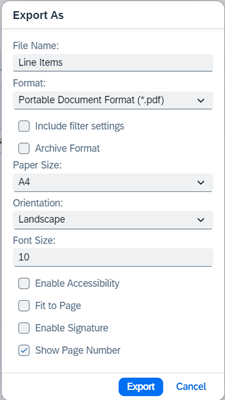
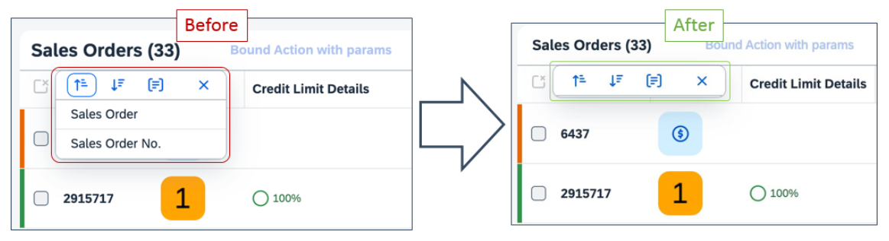

<!-- loioa9553fe29f174452ae86de7b6da4b5f6 -->

<link rel="stylesheet" type="text/css" href="../css/sap-icons.css"/>

# What's New in SAPUI5 1.113

With this release SAPUI5 is upgraded from version 1.112 to 1.113.

> ### Tip:  
> If you want to do a search across all versions of the What's New content, you can also find it in the
> 
>  [SAPUI5 What's New viewer](https://help.sap.com/whats-new/67f60363b57f4ac0b23efd17fa192d60).

> ### Note:  
> Content marked as ** [Preview](https://help.sap.com/docs/whats-new-disclaimer)** is provided as a courtesy, without a warranty, and may be subject to change. For more information, see the [preview disclaimer](https://help.sap.com/docs/whats-new-disclaimer).

** **

<table>
<tr>
<th valign="top">

Version

</th>
<th valign="top">

Type

</th>
<th valign="top">

Category

</th>
<th valign="top">

Title

</th>
<th valign="top">

Description

</th>
<th valign="top">

Action

</th>
<th valign="top">

Available as of

</th>
</tr>
<tr>
<td valign="top">

 Upcoming 

</td>
<td valign="top">

 Changed 

</td>
<td valign="top">

 Announcement 

</td>
<td valign="top">

 **Planned FLP Time Zone Support in SAPUI5** 

</td>
<td valign="top">

**Planned FLP Time Zone Support in SAPUI5**

With SAPUI5 1.114, we intend to enable the usage of the time zone configured in the SAP Fiori launchpad. The usage of a time zone different from the time zone of a user's computer can break existing applications.

Action: Check and, if necessary, adapt your application code if you plan to use a configured time zone different from the browser's time zone.

For more information, see [Dates, Times, Timestamps, and Time Zones](../04_Essentials/dates-times-timestamps-and-time-zones-6c9e61d.md).

** [Preview](https://help.sap.com/docs/whats-new-disclaimer)**•Changed•Announcement•Required•Upcoming

</td>
<td valign="top">

 Required 

</td>
<td valign="top">

2023-05-18

</td>
</tr>
<tr>
<td valign="top">

 Upcoming 

</td>
<td valign="top">

 Deleted 

</td>
<td valign="top">

 Announcement 

</td>
<td valign="top">

 **End of Cloud Provisioning for SAPUI5 Versions \(Q2/2023\)** 

</td>
<td valign="top">

**End of Cloud Provisioning for SAPUI5 Versions \(Q2/2023\)**

The following SAPUI5 versions will be removed from the SAPUI5 Content Delivery Network \(CDN\) after the end of Q2/2023.

**Minor Versions Reaching Their End of Cloud Provisioning**

The following versions including all patches will be removed entirely:

-   1.91
-   1.99
-   1.100
-   1.101

Action: Upgrade to a version that’s still in maintenance.

**Patch Versions Reaching Their End of Cloud Provisioning**

The following patches will be removed:

-   Long-term maintenance versions:

    -   1.38.56
    -   1.71.2
    -   1.71.47 to 1.71.48
    -   1.84.24 to 1.84.25
    -   1.96.8 to 1.96.9

    Action: Upgrade to the latest available patch for the respective SAPUI5 version.

-   Other versions

    -   1.102.0

    Action: Upgrade to a version that’s still in maintenance.

For more information, see [UI5 Releases Ending Service in 2023](https://blogs.sap.com/2022/12/05/ui5-releases-ending-service-in-2023/) and [Version Overview](https://ui5.sap.com/versionoverview.html).

** [Preview](https://help.sap.com/docs/whats-new-disclaimer)**•Deleted•Announcement•Required•Upcoming

</td>
<td valign="top">

 Required 

</td>
<td valign="top">

2023-06-30

</td>
</tr>
<tr>
<td valign="top">

 1.113 

</td>
<td valign="top">

 Changed 

</td>
<td valign="top">

 Control 

</td>
<td valign="top">

 **`sap.m.p13n*`** 

</td>
<td valign="top">

**`sap.m.p13n*`**

We have further improved the usability and accessibility of the *View Settings* dialog: You can now move items up and down using keyboard shortcuts. The required shortcuts have been added to the tooltips of the icons for the `SmartChart` and the `SmartTable` controls. For more information, see the [Sample](https://ui5.sap.com/#/entity/sap.ui.comp.smarttable.SmartTable/sample/sap.ui.comp.sample.smarttable).

Changed•Control•Info Only•1.113

</td>
<td valign="top">

 Info Only 

</td>
<td valign="top">

2023-04-20

</td>
</tr>
<tr>
<td valign="top">

 1.113 

</td>
<td valign="top">

 Changed 

</td>
<td valign="top">

 Announcement 

</td>
<td valign="top">

 **`Variant Management: Button Replaced`** 

</td>
<td valign="top">

**Variant Management: Button Replaced**

> ### Note:  
> The following information concerns important upcoming changes for end users. These changes may require end users to adjust and/or test cases to be adapted, but they won't stop or disrupt software or processes.

`sap.m.ToggleButton` in the `sap.comp.smartvariants.SmartVariantManagement` and `sap.ui.fl.VariantManagement` controls has been replaced by `sap.m.Button`.

Changed•Announcement•Info Only•1.113

</td>
<td valign="top">

 Info Only 

</td>
<td valign="top">

2023-04-20

</td>
</tr>
<tr>
<td valign="top">

 1.113 

</td>
<td valign="top">

 UI Changed 

</td>
<td valign="top">

 Announcement 

</td>
<td valign="top">

 **Multi-Select Table in Value Help Dialog** 

</td>
<td valign="top">

**Multi-Select Table in Value Help Dialog**

> ### Note:  
> The following information concerns important upcoming changes for end users. These changes may require end users to adjust and/or test cases to be adapted, but they won't stop or disrupt software or processes.

Grid tables with a multi-select option will now show a *Deselect All* button instead of a *Select All* checkbox.

UI Changed•Announcement•Info Only•1.113

</td>
<td valign="top">

 Info Only 

</td>
<td valign="top">

2023-04-20

</td>
</tr>
<tr>
<td valign="top">

 1.113 

</td>
<td valign="top">

 Changed 

</td>
<td valign="top">

 Control 

</td>
<td valign="top">

 **`sap.ui.comp.smarttable.SmartTable`** 

</td>
<td valign="top">

**`sap.ui.comp.smarttable.SmartTable`**

If several columns are sorted based on the same sortable property, the indicator for the sorting is now shown in all related columns. For more information, see the [Sample](https://ui5.sap.com/#/entity/sap.ui.comp.smarttable.SmartTable/sample/sap.ui.comp.sample.smarttable).

Changed•Control•Info Only•1.113

</td>
<td valign="top">

 Info Only 

</td>
<td valign="top">

2023-04-20

</td>
</tr>
<tr>
<td valign="top">

 1.113 

</td>
<td valign="top">

 Changed 

</td>
<td valign="top">

 Feature 

</td>
<td valign="top">

 **Spreadsheet Export** 

</td>
<td valign="top">

**Spreadsheet Export**

-   You can now export a table of type `TreeTable` to a PDF document. The exported document will reflect the hierarchical structure of the tree table.

-   In the *Export As* dialog, you can now select the *Show Page Number* option in the PDF-specific settings.

      

Changed•Feature•Info Only•1.113

</td>
<td valign="top">

 Info Only 

</td>
<td valign="top">

2023-04-20

</td>
</tr>
<tr>
<td valign="top">

 1.113 

</td>
<td valign="top">

 Deprecated 

</td>
<td valign="top">

 Feature 

</td>
<td valign="top">

 **Deprecations** 

</td>
<td valign="top">

**Deprecations**

There are currently no major deprecations. For a complete list of all deprecations, see [Deprecated APIs](https://ui5.sap.com/#/api/deprecated).

Deprecated•Feature•Info Only•1.113

</td>
<td valign="top">

 Info Only 

</td>
<td valign="top">

2023-04-20

</td>
</tr>
<tr>
<td valign="top">

 1.113 

</td>
<td valign="top">

 Changed 

</td>
<td valign="top">

 Feature 

</td>
<td valign="top">

 **Code Coverage Powered by `Istanbul`** 

</td>
<td valign="top">

**Code Coverage Powered by `Istanbul`**

SAPUI5 already provides a deep integration of `QUnit` and code coverage measurement. We now introduce `Istanbul` as a modern JavaScript code instrumenter, which is intended to eventually replace the former, now legacy solution based on `Blanket.js`.

To start taking advantage of the more future-proof and feature-rich `Istanbul` solution, see the updated [code coverage documentation](../04_Essentials/code-coverage-measurement-7ef3242.md).

Changed•Feature•Info Only•1.113

</td>
<td valign="top">

 Info Only 

</td>
<td valign="top">

2023-04-20

</td>
</tr>
<tr>
<td valign="top">

 1.113 

</td>
<td valign="top">

 Changed 

</td>
<td valign="top">

 Feature 

</td>
<td valign="top">

 **SAPUI5 Date and Time Formatting** 

</td>
<td valign="top">

**SAPUI5 Date and Time Formatting**

The new version of SAPUI5 introduces the following formatting features:

-   You can now centrally configure calendar week numbering via the new `calendarWeekNumbering` configuration parameter. Note that the `calendarWeekNumbering` format option introduced with SAPUI5 1.108 for `sap.ui.core.format.DateFormat` overrules the central configuration.

    For more information, see [Configuration Options and URL Parameters](../04_Essentials/configuration-options-and-url-parameters-91f2d03.md).

-   We provide the new `intervalDelimiter` format option for `sap.ui.core.format.DateFormat`. If an `intervalDelimiter` is set, the locale-specific rules for displaying a range as defined in the Common Locale Data Repository are overruled; the two parts of the range are formatted individually, and the given delimiter is used.

Changed•Feature•Info Only•1.113

</td>
<td valign="top">

 Info Only 

</td>
<td valign="top">

2023-04-20

</td>
</tr>
<tr>
<td valign="top">

 1.113 

</td>
<td valign="top">

 Changed 

</td>
<td valign="top">

 Feature 

</td>
<td valign="top">

 **SAPUI5 OData V4 Model** 

</td>
<td valign="top">

**SAPUI5 OData V4 Model**

The new version of the SAPUI5 OData V4 model introduces the following features:

-   You can now delete nested transient records that were created using the experimental Deep Create feature provided with SAPUI5 1.112. Any initial data handed over to `sap.ui.model.odata.v4.ODataListBinding#create` can now contain nested entities.

    For more information, see the [API Reference](https://ui5.sap.com/#/api/sap.ui.model.odata.v4.ODataListBinding/methods/create).

-   In read-only scenarios, you can now combine the experimental hierarchy feature introduced with SAPUI5 1.105 with the `sap.ui.model.odata.v4.Context#setKeepAlive` and `sap.ui.model.odata.v4.ODataModel#getKeepAliveContext` data synchronization methods described in [Data Reuse](../04_Essentials/data-reuse-648e360.md).

    For more information, see the API Reference for [`setKeepAlive`](https://ui5.sap.com/#/api/sap.ui.model.odata.v4.Context/methods/setKeepAlive) and [`getKeepAliveContext`](https://ui5.sap.com/#/api/sap.ui.model.odata.v4.ODataModel/methods/getKeepAliveContext).

-   The `sap.ui.model.odata.v4.Context#resetChanges` API introduced as an experimental feature with SAPUI5 1.109 is now generally available.

    For more information, see the [API Reference](https://ui5.sap.com/#/api/sap.ui.model.odata.v4.Context/methods/resetChanges).

Changed•Feature•Info Only•1.113

</td>
<td valign="top">

 Info Only 

</td>
<td valign="top">

2023-04-20

</td>
</tr>
<tr>
<td valign="top">

 1.113 

</td>
<td valign="top">

 Changed 

</td>
<td valign="top">

 Feature 

</td>
<td valign="top">

 **SAPUI5 OData V2 Model** 

</td>
<td valign="top">

**SAPUI5 OData V2 Model**

You can now prevent the activation of a new inactive entity by using `sap.ui.base.Event#preventDefault` in the handler of the `createActivate` event of an `sap.ui.model.odata.v2.ODataListBinding`. Note that user input into inactive rows is regarded as a pending change by `sap.ui.model.odata.v2.ODataModel#hasPendingChanges`; it can be reset using `sap.ui.model.odata.v2.ODataModel#resetChanges`.

For more information, see the API Reference for [`hasPendingChanges`](https://ui5.sap.com/#/api/sap.ui.model.odata.v2.ODataModel/methods/hasPendingChanges), [`resetChanges`](https://ui5.sap.com/#/api/sap.ui.model.odata.v2.ODataModel/methods/resetChanges), and [`Event.preventDefault`](https://ui5.sap.com/#/api/sap.ui.base.Event/methods/preventDefault).

Changed•Feature•Info Only•1.113

</td>
<td valign="top">

 Info Only 

</td>
<td valign="top">

2023-04-20

</td>
</tr>
<tr>
<td valign="top">

 1.113 

</td>
<td valign="top">

 Changed 

</td>
<td valign="top">

 SAP Fiori Elements 

</td>
<td valign="top">

 **SAP Fiori elements for OData V2** 

</td>
<td valign="top">

**SAP Fiori elements for OData V2**

The following changes and new features are available for SAP Fiori elements for OData V2:

-   We now show the subtitle and the app icon in the navigation menu as defined in the application's manifest. For more information, see [Checking Folder Structure and Project Artifacts](../06_SAP_Fiori_Elements/checking-folder-structure-and-project-artifacts-f7abd1b.md).

-   We've improved the data entry experience in draft-enabled SAP Fiori elements apps to make it less disruptive for users.

    SAP Fiori elements no longer requests state messages with every `MERGE` request, resulting in fewer error messages on the UI. Messages are now fetched when a `GET` request is resolved in the following scenarios:

    -   Validation \(a user triggers the request using the [Enter\] key or the *Validate* button\)

    -   Finalizing actions \(a user triggers the request using the *Save* or *Create* button\)

    -   Creation of an object

    -   Update of fields configured with side effects

    -   Update of multi-input fields

    This improvement affects `MERGE` requests such as the following use cases:

    -   Update of a draft \(a user updates data in a field of a draft object\)

    -   Creation of an item in a table on an object page

    -   Update of data from custom facets or reusable components that are merged via `MERGE` requests from the framework

Changed•SAP Fiori Elements•Info Only•1.113

</td>
<td valign="top">

 Info Only 

</td>
<td valign="top">

2023-04-20

</td>
</tr>
<tr>
<td valign="top">

 1.113 

</td>
<td valign="top">

 Changed 

</td>
<td valign="top">

 SAP Fiori Elements 

</td>
<td valign="top">

 **SAP Fiori elements for OData V4** 

</td>
<td valign="top">

**SAP Fiori elements for OData V4**

The following changes and new features are available for SAP Fiori elements for OData V4:

-   You can now show and hide tables in object page reference facets. For more information, see [Showing and Hiding Content in Object Page Facets](../06_SAP_Fiori_Elements/showing-and-hiding-content-in-object-page-facets-9fcea86.md).

-   The sorting mechanism and options on a table column now reflect the visible properties and content of the column. Note that in SAP Fiori apps that were built using ABAP CDS, sort restrictions may apply.

      

-   When no `QuickView` annotations are defined and no target is resolved at runtime, the field now appears as a link and a message is displayed when you click the link. For more information, see [Configuring the Content of Quick Views](../06_SAP_Fiori_Elements/configuring-the-content-of-quick-views-c245ad7.md).

Changed•SAP Fiori Elements•Info Only•1.113

</td>
<td valign="top">

 Info Only 

</td>
<td valign="top">

2023-04-20

</td>
</tr>
<tr>
<td valign="top">

1.112

</td>
<td valign="top">

 Deleted 

</td>
<td valign="top">

 Announcement 

</td>
<td valign="top">

 **End of Cloud Provisioning for SAPUI5 Versions \(Q1/2023\)** 

</td>
<td valign="top">

**End of Cloud Provisioning for SAPUI5 Versions \(Q1/2023\)**

> ### Note:  
> The following information concerns important upcoming changes for end users. These changes may require end users to adjust and/or test cases to be adapted, but they won't stop or disrupt software or processes.

The following SAPUI5 versions will be removed from the SAPUI5 Content Delivery Network \(CDN\) after the end of Q1/2023.

**Minor Versions Reaching Their End of Cloud Provisioning**

The following versions including all patches will be removed entirely:

-   1.90
-   1.93
-   1.97
-   1.98

Action: Upgrade to a version that’s still in maintenance.

**Patch Versions Reaching Their End of Cloud Provisioning**

The following patches will be removed:

-   Long-term maintenance versions:

    -   1.38.53 to 1.38.55
    -   1.71.44 to 1.71.46
    -   1.84.21 to 1.84.23
    -   1.96.2 to 1.96.7

    Action: Upgrade to the latest available patch for the respective SAPUI5 version.

For more information, see [UI5 Releases Ending Service in 2023](https://blogs.sap.com/2022/12/05/ui5-releases-ending-service-in-2023/) and [Version Overview](https://ui5.sap.com/versionoverview.html).

Deleted•Announcement•Required•1.112

</td>
<td valign="top">

 Required 

</td>
<td valign="top">

2023-03-31

</td>
</tr>
<tr>
<td valign="top">

 1.113 

</td>
<td valign="top">

 Changed 

</td>
<td valign="top">

 Control 

</td>
<td valign="top">

 **`sap.ui.integration.widgets.Card`** 

</td>
<td valign="top">

**`sap.ui.integration.widgets.Card`**

-   Using the new `customStateIcon` property, you can now set custom state-icons for the items in Table, List, and Object cards. Before this change, states like `Error`, `Warning`, `Success`, or `Information`, only had default icons. For more information, see the [Table Card](https://ui5.sap.com/test-resources/sap/ui/integration/demokit/cardExplorer/webapp/index.html#/learn/typesDeclarative/table) section and the [Sample](https://ui5.sap.com/test-resources/sap/ui/integration/demokit/cardExplorer/webapp/index.html#/explore/table/visibleColumns) in the Card Explorer.

-   Integration cards now support the `IllustratedMessage` control to provide more informative and consistent error messages. When the application is in debug mode \(when the URL parameter `sap-ui-debug=true` is set\), the *Show More* button opens a dialog with relevant additional \(more technical\) information.

-   We have enhanced the Table card with several new properties:

    -   You can use the new `highlight` property to show the state of each table row. Additionally, the `highlightText` property conveys the semantic of this state for better accessibility.
    -   The `additionalText` property gives you the option to display additional text in the table identifier column.

    For more information, see the [Table Card](https://ui5.sap.com/test-resources/sap/ui/integration/demokit/cardExplorer/webapp/index.html#/learn/typesDeclarative/table) section and the [Sample](https://ui5.sap.com/test-resources/sap/ui/integration/demokit/cardExplorer/webapp/index.html#/explore/table/highlight) in the Card Explorer. 

Changed•Control•Info Only•1.113

</td>
<td valign="top">

 Info Only 

</td>
<td valign="top">

2023-04-20

</td>
</tr>
<tr>
<td valign="top">

 1.113 

</td>
<td valign="top">

 Changed 

</td>
<td valign="top">

 Control 

</td>
<td valign="top">

 **`sap.ui.comp.smartfield.SmartField`** 

</td>
<td valign="top">

**`sap.ui.comp.smartfield.SmartField`**

-   The control now supports the `Common.IsTimezone` annotation that indicates whether a given property of type `Edm.String` is a time zone.

-   We have enhanced the support of the `FieldControl` annotation `<Annotation Term="Common.FieldControl" EnumMember="Common.FieldControlType/Optional"/>`. Because its default value is `Optional` and that's why it usually isn't explicitly defined by the services. Until now, this behavior was controlled by the property\`s `Nullable` annotation \(`Nullable=false` was regarded as mandatory\). Now we respect this enum member, whenever it\`s defined, and in cases when there is a `FieldControl` annotation defined with value `Optional`, we take it into account and do not indicate the field as mandatory.

For more information, see the [API Reference](https://ui5.sap.com/#/api/sap.ui.comp.smartfield.SmartField). 

Changed•Control•Info Only•1.113

</td>
<td valign="top">

 Info Only 

</td>
<td valign="top">

2023-04-20

</td>
</tr>
<tr>
<td valign="top">

 1.113 

</td>
<td valign="top">

 Changed 

</td>
<td valign="top">

 Control 

</td>
<td valign="top">

 **`sap.ui.comp.smartfield.SmartField` and `sap.ui.comp.smartfilterbar.SmartFilterBar`** 

</td>
<td valign="top">

**`sap.ui.comp.smartfield.SmartField` and `sap.ui.comp.smartfilterbar.SmartFilterBar`**

These controls now support the `inputFieldSuggestions` setting from SAP Fiori launchpad. This setting is independent from the recently entered values. When the setting is set to `false`, only the history of the input field \(`Recently used` group\) is shown without suggestions. When the setting is set to `true` \(or when it’s not defined\), then suggestions work as normal.

Changed•Control•Info Only•1.113

</td>
<td valign="top">

 Info Only 

</td>
<td valign="top">

2023-04-20

</td>
</tr>
<tr>
<td valign="top">

 1.113 

</td>
<td valign="top">

 Changed 

</td>
<td valign="top">

 Control 

</td>
<td valign="top">

 **`sap.ui.comp.valuehelpdialog.ValueHelpDialog`** 

</td>
<td valign="top">

**`sap.ui.comp.valuehelpdialog.ValueHelpDialog`**

-   The *Select All* checkbox in the upper left corner of the results table is no longer available. The reason for this change is to improve the user experience in scenarios with larger data sets that require paging of the results. The *Deselect All* button is still available, and range selection is allowed. This change is available only for value help dialogs that are internally created from a `SmartField` or `SmartFilterBar`. For more information, see the [Sample](https://ui5.sap.com/#/entity/sap.ui.comp.valuehelpdialog.ValueHelpDialog/sample/sap.ui.comp.sample.smartfilterbar.Basic).

-   We have introduced an updated UI and design for the column header menu when a `GridTable` is shown in the `ValueHelpDialog`. For more information, see the [Sample](https://ui5.sap.com/#/entity/sap.ui.comp.valuehelpdialog.ValueHelpDialog/sample/sap.ui.comp.sample.smartfield.SmartFieldWithValueHelp).

Changed•Control•Info Only•1.113

</td>
<td valign="top">

 Info Only 

</td>
<td valign="top">

2023-04-20

</td>
</tr>
<tr>
<td valign="top">

 1.113 

</td>
<td valign="top">

 Changed 

</td>
<td valign="top">

 Feature 

</td>
<td valign="top">

 **`sap.ui.test.Opa5`** 

</td>
<td valign="top">

**`sap.ui.test.Opa5`**

We have introduced a new `fetchWaiter`, which checks for currently ongoing fetch requests.

Changed•Feature•Info Only•1.113

</td>
<td valign="top">

 Info Only 

</td>
<td valign="top">

2023-04-20

</td>
</tr>
<tr>
<td valign="top">

 1.113 

</td>
<td valign="top">

 Changed 

</td>
<td valign="top">

 Control 

</td>
<td valign="top">

 **`sap.ui.richtexteditor.RichTextEditor`** 

</td>
<td valign="top">

**`sap.ui.richtexteditor.RichTextEditor`**

We have updated the TinyMCE version 6 used in `sap.ui.richtexteditor.RichTextEditor` to TinyMCE 6.3.1. For more information, see [sap.ui.richtexteditor](../10_More_About_Controls/sap-ui-richtexteditor-d4f3f15.md).

Changed•Control•Info Only•1.113

</td>
<td valign="top">

 Info Only 

</td>
<td valign="top">

2023-04-20

</td>
</tr>
<tr>
<td valign="top">

 1.113 

</td>
<td valign="top">

 Changed 

</td>
<td valign="top">

 Control 

</td>
<td valign="top">

 **`sap.m.SuggestionsPopover`** 

</td>
<td valign="top">

**`sap.m.SuggestionsPopover`**

We have restricted the width of input suggestions to a maximum of 40 rem for optimal user experience. Limiting the width of suggestions allows users to easily scan and select options. However, if the input field is wider than 40 rem, the width of the suggestions matches the input’s width.

Changed•Control•Info Only•1.113

</td>
<td valign="top">

 Info Only 

</td>
<td valign="top">

2023-04-20

</td>
</tr>
<tr>
<td valign="top">

 1.113 

</td>
<td valign="top">

 Changed 

</td>
<td valign="top">

 Control 

</td>
<td valign="top">

 **`sap.m.IllustratedMessage`** 

</td>
<td valign="top">

**`sap.m.IllustratedMessage`**

We have introduced a new `Survey` illustration type and four new illustrations to the default illustration set: `sapIllus-Dialog-NoColumnsSet`, `sapIllus-Dot-NoColumnsSet`, `sapIllus-Scene-NoColumnsSet`, and `sapIllus-Spot-NoColumnsSet`. For more information, see the [API Reference](https://ui5.sap.com/#/api/sap.m.IllustratedMessage). 

Changed•Control•Info Only•1.113

</td>
<td valign="top">

 Info Only 

</td>
<td valign="top">

2023-04-20

</td>
</tr>
<tr>
<td valign="top">

 1.113 

</td>
<td valign="top">

 Changed 

</td>
<td valign="top">

 Control 

</td>
<td valign="top">

 **`sap.ui.unified.FileUploader`** 

</td>
<td valign="top">

**`sap.ui.unified.FileUploader`**

We have implemented two new methods in the control's API, a trigger to open the native file upload picker and a getter to return the file input type element from the control DOM representation.

 For more information, see the [API Reference](https://ui5.sap.com/#/api/sap.ui.unified.FileUploader). 

Changed•Control•Info Only•1.113

</td>
<td valign="top">

 Info Only 

</td>
<td valign="top">

2023-04-20

</td>
</tr>
<tr>
<td valign="top">

 1.113 

</td>
<td valign="top">

 Changed 

</td>
<td valign="top">

 Control 

</td>
<td valign="top">

 **`sap.f.SidePanel`** 

</td>
<td valign="top">

**`sap.f.SidePanel`**

We have implemented an **enabled** property to the Side Panel item, which disables the controls and UI elements inside it.

 For more information, see the [Sample](https://ui5.sap.com/#/entity/sap.f.SidePanel/sample/sap.f.sample.SidePanel). 

Changed•Control•Info Only•1.113

</td>
<td valign="top">

 Info Only 

</td>
<td valign="top">

2023-04-20

</td>
</tr>
<tr>
<td valign="top">

 1.113 

</td>
<td valign="top">

 Changed 

</td>
<td valign="top">

 Control 

</td>
<td valign="top">

 **`sap.m.SinglePlanningCalendar`** 

</td>
<td valign="top">

**`sap.m.SinglePlanningCalendar`**

We have implemented a new mode to select one or more dates in **SinglePlanningCalendar**. Тhe single day option is enabled by default, the multi-date selection option is possible by using a key combination \( [Ctrl\] + [Meta key\]  and select the dates\) or by activating the new **MultiDateSelectionMode** property.

 For more information, see the [Sample](https://ui5.sap.com/#/entity/sap.m.SinglePlanningCalendar/sample/sap.m.sample.SinglePlanningCalendarDateSelection). 

Changed•Control•Info Only•1.113

</td>
<td valign="top">

 Info Only 

</td>
<td valign="top">

2023-04-20

</td>
</tr>
</table>

