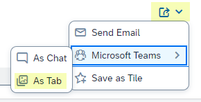

<!-- loio890fce16801640459e67ec64da4daa00 -->

# What's New in SAPUI5 1.114

With this release SAPUI5 is upgraded from version 1.113 to 1.114.

> ### Tip:  
> If you want to do a search across all versions of the What's New content, you can also find it in the [SAPUI5 What's New viewer](https://help.sap.com/whats-new/67f60363b57f4ac0b23efd17fa192d60).

****

<table>
<tr>
<th valign="top">

Version

</th>
<th valign="top">

Type

</th>
<th valign="top">

Category

</th>
<th valign="top">

Title

</th>
<th valign="top">

Description

</th>
<th valign="top">

Action

</th>
<th valign="top">

Available as of

</th>
</tr>
<tr>
<td valign="top">

1.114 

</td>
<td valign="top">

Changed 

</td>
<td valign="top">

Control 

</td>
<td valign="top">

**`sap.ui.integration.widgets.Card`** 

</td>
<td valign="top">

**`sap.ui.integration.widgets.Card`**

We have \(experimentally\) introduced a new type of message – card-blocking messages. The three available types `NoData`, `Error`, and `Information` are listed in the `sap.ui.integration.CardBlockingMessageType` enumeration.

List, Table, Object, and the other declarative card types automatically show a card-blocking message when there is no data or an error has occurred. Additionally, the developers of Component cards, or those using extensions, can use the `showBlockingMessage` and `hideBlockingMessage` methods to programmatically control the message. For more information, see the [CardBlockingMessageType](https://ui5.sap.com/#/api/sap.ui.integration.CardBlockingMessageType) enumeration, the [API Reference](https://ui5.sap.com/#/api/sap.ui.integration.widgets.Card), and the [Blocking Message](https://ui5.sap.com/test-resources/sap/ui/integration/demokit/cardExplorer/webapp/index.html#/explore/blockingMessage) and [No Data Message](https://ui5.sap.com/test-resources/sap/ui/integration/demokit/cardExplorer/webapp/index.html#/explore/component/noDataMessage) samples in the Card Explorer.

Changed•Control•Info Only•1.114

</td>
<td valign="top">

Info Only 

</td>
<td valign="top">

2023-05-18

</td>
</tr>
<tr>
<td valign="top">

1.114 

</td>
<td valign="top">

Deprecated 

</td>
<td valign="top">

Feature 

</td>
<td valign="top">

**Deprecations** 

</td>
<td valign="top">

**Deprecations**

There are currently no major deprecations. For a complete list of all deprecations, see [Deprecated APIs](https://ui5.sap.com/#/api/deprecated).

Deprecated•Feature•Info Only•1.114

</td>
<td valign="top">

Info Only 

</td>
<td valign="top">

2023-05-18

</td>
</tr>
<tr>
<td valign="top">

1.114 

</td>
<td valign="top">

Changed 

</td>
<td valign="top">

Control 

</td>
<td valign="top">

**`sap.ui.comp.smarttable.SmartTable`** 

</td>
<td valign="top">

**`sap.ui.comp.smarttable.SmartTable`**

-   We have introduced the `useColumnLabelsAsTooltips` property that allows you to automatically use a column label as a tooltip for a column. You can also use this property for custom columns. For more information, see the [API Reference](https://ui5.sap.com/#/api/sap.ui.comp.smarttable.SmartTable%23methods/getUseColumnLabelsAsTooltips).

-   We have provided a way to sort multiple properties of semantically connected fields. To enable this, we have added `additionalSortProperty` in the `p13nData`. The table will create a `QuickSortItem` for each listed property name. For more information, see [API Reference](https://ui5.sap.com/#/api/sap.ui.comp.smarttable.SmartTable%23faq) and see question 27.

-   We have added the `copyProvider` aggregation that provides generic copy and paste functions along with a *Copy* button in the toolbar of the table. To enable the copy and paste functions, the `CopyProvider` plugin is used. For more information, see the [API Reference](https://ui5.sap.com/#/api/sap.ui.comp.smarttable.SmartTable%23methods/getCopyProvider)  for the `copyProvider` aggregation, the [API Reference](https://ui5.sap.com/#/api/sap.m.plugins.CopyProvider) for the `CopyProvider` plugin, and the [Sample](https://ui5.sap.com/#/entity/sap.ui.comp.smarttable.SmartTable/sample/sap.ui.comp.sample.smarttable.smartTableWithCriticality).

-   To improve the user experience, we have removed the *Reset* button from the control’s personalization dialog when the dialog is opened from the column header menu or from a custom button in the table's toolbar. This change was needed because when you open the dialog from one of these places it opens only one panel \(for example, Columns, Sort, Group, or Filter\). However, the *Reset* button resets all the panels and not only the one that is opened, which was confusing for the user.

Changed•Control•Info Only•1.114

</td>
<td valign="top">

Info Only 

</td>
<td valign="top">

2023-05-18

</td>
</tr>
<tr>
<td valign="top">

1.114 

</td>
<td valign="top">

Changed 

</td>
<td valign="top">

SAP Fiori Elements 

</td>
<td valign="top">

**SAP Fiori elements for OData V2** 

</td>
<td valign="top">

**SAP Fiori elements for OData V2**

The following changes and new features are available for SAP Fiori elements for OData V2:

-   In draft-enabled applications, drafts are now saved after 20 seconds, thereby reducing the number of merge calls. For more information, see [Draft Handling](../06_SAP_Fiori_Elements/draft-handling-ed9aa41.md).

-   You now have an option to create cards for the *Insights* section of *My Home* in SAP S/4HANA Cloud from the list report and analytical list page apps. For more information, see [Creating Cards for the Insights Cards Section of My Home in SAP S/4HANA Cloud and My Home in SAP S/4HANA](../06_SAP_Fiori_Elements/creating-cards-for-the-insights-cards-section-of-my-home-in-sap-s-4hana-cloud-and-my-home-9b13559.md).

-   We've added another option to the *Share* menu button. When a user clicks the *Share* button and then the *Share Menu: Microsoft Teams* option, they can now also choose *As Tab*.

    

    For more information, see [The Share Functionality](../06_SAP_Fiori_Elements/the-share-functionality-022bf0d.md).

Changed•SAP Fiori Elements•Info Only•1.114

</td>
<td valign="top">

Info Only 

</td>
<td valign="top">

2023-05-18

</td>
</tr>
<tr>
<td valign="top">

1.114 

</td>
<td valign="top">

Changed 

</td>
<td valign="top">

SAP Fiori Elements 

</td>
<td valign="top">

**SAP Fiori elements for OData V4** 

</td>
<td valign="top">

**SAP Fiori elements for OData V4**

The following changes and new features are available for SAP Fiori elements for OData V4:

-   You can now freeze the first columns in grid and analytical tables so that they remain fixed when scrolling horizontally. For more information, see [Tables](../06_SAP_Fiori_Elements/tables-c0f6592.md).

-   Empty rows in object page tables can now contain disabled fields. For more information, see [Enabling Inline Creation Mode or Empty Row Mode for Table Entries](../06_SAP_Fiori_Elements/enabling-inline-creation-mode-or-empty-row-mode-for-table-entries-cfb04f0.md).

-   We now provide filtering by draft-related properties. For more information, see [Draft Handling](../06_SAP_Fiori_Elements/draft-handling-ed9aa41.md).

-   You can now disable the `AddCardToInsights` option in the manifest. For more information, see [Creating Cards for the Insights Cards Section of My Home in SAP S/4HANA Cloud and My Home in SAP S/4HANA](../06_SAP_Fiori_Elements/creating-cards-for-the-insights-cards-section-of-my-home-in-sap-s-4hana-cloud-and-my-home-9b13559.md).

-   You now have an option to create cards for the *Insights* section of *My Home* in SAP S/4HANA Cloud from the list report and analytical list page apps. For more information, see [Creating Cards for the Insights Cards Section of My Home in SAP S/4HANA Cloud and My Home in SAP S/4HANA](../06_SAP_Fiori_Elements/creating-cards-for-the-insights-cards-section-of-my-home-in-sap-s-4hana-cloud-and-my-home-9b13559.md).

-   We've added more keys that can be overridden by application developers using the custom i18n file approach. You can now override the following keys:

    -   `OBJECTPAGESTATE_ISSUE`

    -   `OBJECTPAGESTATE_ERROR`

    -   `OBJECTPAGESTATE_WARNING`

    -   `OBJECTPAGESTATE_INFORMATION`

    -   `M_ILLUSTRATEDMESSAGE_TITLE`

    -   `M_ILLUSTRATEDMESSAGE_DESCRIPTION`

    For more information, see [Localization of UI Texts](../06_SAP_Fiori_Elements/localization-of-ui-texts-b8cb649.md).

-   We've added another option to the *Share* menu button. When a user clicks the *Share* button and then the *Share Menu: Microsoft Teams* option, they can now also choose *As Tab*.

    

    For more information, see [The Share Functionality](../06_SAP_Fiori_Elements/the-share-functionality-022bf0d.md).

Changed•SAP Fiori Elements•Info Only•1.114

</td>
<td valign="top">

Info Only 

</td>
<td valign="top">

2023-05-18

</td>
</tr>
<tr>
<td valign="top">

1.114 

</td>
<td valign="top">

Changed 

</td>
<td valign="top">

Feature 

</td>
<td valign="top">

**FLP Time Zone Support in SAPUI5** 

</td>
<td valign="top">

**FLP Time Zone Support in SAPUI5**

We now enable the configuration of a time zone in SAPUI5. The configured time zone affects all applications. Using a time zone that is different from the time zone of a user's computer can break existing applications. Changing the time zone while using an application can cause unexpected side effects.

**Action:** Check and, if necessary, adapt your application code if you plan to use a configured time zone that is different from your browser's time zone.

For more information, see [Dates, Times, Timestamps, and Time Zones](../04_Essentials/dates-times-timestamps-and-time-zones-6c9e61d.md) and [Configuration Options and URL Parameters](../04_Essentials/configuration-options-and-url-parameters-91f2d03.md).

Changed•Feature•Required•1.114

</td>
<td valign="top">

Required 

</td>
<td valign="top">

2023-05-18

</td>
</tr>
<tr>
<td valign="top">

1.114 

</td>
<td valign="top">

Changed 

</td>
<td valign="top">

Control 

</td>
<td valign="top">

**`sap.m.SearchField`** 

</td>
<td valign="top">

**`sap.m.SearchField`**

When the user clicks the search button \(the magnifier icon\), the `search` event is triggered with a new `searchButtonPressed` parameter. This behavior enables developers to differentiate between the actual click on the search button and keystrokes, such as [Enter\] and [Esc\], which also trigger the `search` event.

For more information, see the [API Reference](https://ui5.sap.com/#/api/sap.m.SearchField%23events/search) and the [Sample](https://ui5.sap.com/#/entity/sap.m.SearchField/sample/sap.m.sample.SearchField).

Changed•Control•Info Only•1.114

</td>
<td valign="top">

Info Only 

</td>
<td valign="top">

2023-05-18

</td>
</tr>
<tr>
<td valign="top">

1.114 

</td>
<td valign="top">

Changed 

</td>
<td valign="top">

Control 

</td>
<td valign="top">

**`sap.ui.comp.smartfield.SmartField`** 

</td>
<td valign="top">

**`sap.ui.comp.smartfield.SmartField`**

Only for fields without a `ValueList` annotation, we allow users to enter text with a maximum number of characters that is specified in the `maxLength` property of the control. When a user pastes a longer text from the clipboard, the text will be clipped to the allowed `maxLength` value.

Changed•Control•Info Only•1.114

</td>
<td valign="top">

Info Only 

</td>
<td valign="top">

2023-05-18

</td>
</tr>
<tr>
<td valign="top">

1.114 

</td>
<td valign="top">

Changed 

</td>
<td valign="top">

Control 

</td>
<td valign="top">

**`sap.ui.comp.valuehelpdialog.ValueHelpDialog`** 

</td>
<td valign="top">

**`sap.ui.comp.valuehelpdialog.ValueHelpDialog`**

-   We have improved the accessibility of the control and the screen readers can now announce when users add or remove conditions in the *Define Conditions* tab. For more information, see the [Sample](https://ui5.sap.com/#/entity/sap.ui.comp.smartfilterbar.SmartFilterBar/sample/sap.ui.comp.sample.smartfilterbar.Basic).
-   We have added a new \(default\) menu in the column headers of the built-in table that now also allows quick sorting. Additionally, for columns of this table that show both ID and description, now we enable users to sort using either the ID or the description. For more information, see the [Sample](https://ui5.sap.com/#/entity/sap.ui.comp.smartfield.SmartField/sample/sap.ui.comp.sample.smartfield.TextInEditModeSource).

Changed•Control•Info Only•1.114

</td>
<td valign="top">

Info Only 

</td>
<td valign="top">

2023-05-18

</td>
</tr>
<tr>
<td valign="top">

1.114 

</td>
<td valign="top">

Changed 

</td>
<td valign="top">

Feature 

</td>
<td valign="top">

**Accessibility** 

</td>
<td valign="top">

**Accessibility**

We are now using JAWS 2023 as a reference testing environment in SAPUI5. For more information, see the *Assistive technologies reference testing environment for SAPUI5* SAP Note [2564165](https://me.sap.com/notes/2564165).

Changed•Feature•Info Only•1.114

</td>
<td valign="top">

Info Only 

</td>
<td valign="top">

2023-05-18

</td>
</tr>
</table>

**Related Information**  

[What's New in SAPUI5 1.129](what-s-new-in-sapui5-1-129-d22b8af.md "With this release SAPUI5 is upgraded from version 1.128 to 1.129.")

[What's New in SAPUI5 1.128](what-s-new-in-sapui5-1-128-1f76220.md "With this release SAPUI5 is upgraded from version 1.127 to 1.128.")

[What's New in SAPUI5 1.127](what-s-new-in-sapui5-1-127-e5e1317.md "With this release SAPUI5 is upgraded from version 1.126 to 1.127.")

[What's New in SAPUI5 1.126](what-s-new-in-sapui5-1-126-1d98116.md "With this release SAPUI5 is upgraded from version 1.125 to 1.126.")

[What's New in SAPUI5 1.125](what-s-new-in-sapui5-1-125-9d87044.md "With this release SAPUI5 is upgraded from version 1.124 to 1.125.")

[What's New in SAPUI5 1.124](what-s-new-in-sapui5-1-124-7f77c3f.md "With this release SAPUI5 is upgraded from version 1.123 to 1.124.")

[What's New in SAPUI5 1.123](what-s-new-in-sapui5-1-123-9d00ac7.md "With this release SAPUI5 is upgraded from version 1.122 to 1.123.")

[What's New in SAPUI5 1.122](what-s-new-in-sapui5-1-122-5d078da.md "With this release SAPUI5 is upgraded from version 1.121 to 1.122.")

[What's New in SAPUI5 1.121](what-s-new-in-sapui5-1-121-91a4a2f.md "With this release SAPUI5 is upgraded from version 1.120 to 1.121.")

[What's New in SAPUI5 1.120](what-s-new-in-sapui5-1-120-2359b63.md "With this release SAPUI5 is upgraded from version 1.119 to 1.120.")

[What's New in SAPUI5 1.119](what-s-new-in-sapui5-1-119-0b1903a.md "With this release SAPUI5 is upgraded from version 1.118 to 1.119.")

[What's New in SAPUI5 1.118](what-s-new-in-sapui5-1-118-3eecbde.md "With this release SAPUI5 is upgraded from version 1.117 to 1.118.")

[What's New in SAPUI5 1.117](what-s-new-in-sapui5-1-117-029d3b4.md "With this release SAPUI5 is upgraded from version 1.116 to 1.117.")

[What's New in SAPUI5 1.116](what-s-new-in-sapui5-1-116-ebd6f34.md "With this release SAPUI5 is upgraded from version 1.115 to 1.116.")

[What's New in SAPUI5 1.115](what-s-new-in-sapui5-1-115-409fde8.md "With this release SAPUI5 is upgraded from version 1.114 to 1.115.")

[What's New in SAPUI5 1.113](what-s-new-in-sapui5-1-113-a9553fe.md "With this release SAPUI5 is upgraded from version 1.112 to 1.113.")

[What's New in SAPUI5 1.112](what-s-new-in-sapui5-1-112-34afc69.md "With this release SAPUI5 is upgraded from version 1.111 to 1.112.")

[What's New in SAPUI5 1.111](what-s-new-in-sapui5-1-111-7a67837.md "With this release SAPUI5 is upgraded from version 1.110 to 1.111.")

[What's New in SAPUI5 1.110](what-s-new-in-sapui5-1-110-71a855c.md "With this release SAPUI5 is upgraded from version 1.109 to 1.110.")

[What's New in SAPUI5 1.109](what-s-new-in-sapui5-1-109-3264bd2.md "With this release SAPUI5 is upgraded from version 1.108 to 1.109.")

[What's New in SAPUI5 1.108](what-s-new-in-sapui5-1-108-66e33f0.md "With this release SAPUI5 is upgraded from version 1.107 to 1.108.")

[What's New in SAPUI5 1.107](what-s-new-in-sapui5-1-107-d4ff916.md "With this release SAPUI5 is upgraded from version 1.106 to 1.107.")

[What's New in SAPUI5 1.106](what-s-new-in-sapui5-1-106-5b497b0.md "With this release SAPUI5 is upgraded from version 1.105 to 1.106.")

[What's New in SAPUI5 1.105](what-s-new-in-sapui5-1-105-4d6c00e.md "With this release SAPUI5 is upgraded from version 1.104 to 1.105.")

[What's New in SAPUI5 1.104](what-s-new-in-sapui5-1-104-69e567c.md "With this release SAPUI5 is upgraded from version 1.103 to 1.104.")

[What's New in SAPUI5 1.103](what-s-new-in-sapui5-1-103-0e98c76.md "With this release SAPUI5 is upgraded from version 1.102 to 1.103.")

[What's New in SAPUI5 1.102](what-s-new-in-sapui5-1-102-f038c99.md "With this release SAPUI5 is upgraded from version 1.101 to 1.102.")

[What's New in SAPUI5 1.101](what-s-new-in-sapui5-1-101-7733b00.md "With this release SAPUI5 is upgraded from version 1.100 to 1.101.")

[What's New in SAPUI5 1.100](what-s-new-in-sapui5-1-100-27dec1d.md "With this release SAPUI5 is upgraded from version 1.99 to 1.100.")

[What's New in SAPUI5 1.99](what-s-new-in-sapui5-1-99-4f35848.md "With this release SAPUI5 is upgraded from version 1.98 to 1.99.")

[What's New in SAPUI5 1.98](what-s-new-in-sapui5-1-98-d9f16f2.md "With this release SAPUI5 is upgraded from version 1.97 to 1.98.")

[What's New in SAPUI5 1.97](what-s-new-in-sapui5-1-97-fa0e282.md "With this release SAPUI5 is upgraded from version 1.96 to 1.97.")

[What's New in SAPUI5 1.96](what-s-new-in-sapui5-1-96-7a9269f.md "With this release SAPUI5 is upgraded from version 1.95 to 1.96.")

[What's New in SAPUI5 1.95](what-s-new-in-sapui5-1-95-a1aea67.md "With this release SAPUI5 is upgraded from version 1.94 to 1.95.")

[What's New in SAPUI5 1.94](what-s-new-in-sapui5-1-94-c40f1e6.md "With this release SAPUI5 is upgraded from version 1.93 to 1.94.")

[What's New in SAPUI5 1.93](what-s-new-in-sapui5-1-93-f273340.md "With this release SAPUI5 is upgraded from version 1.92 to 1.93.")

[What's New in SAPUI5 1.92](what-s-new-in-sapui5-1-92-1ef345d.md "With this release SAPUI5 is upgraded from version 1.91 to 1.92.")

[What's New in SAPUI5 1.91](what-s-new-in-sapui5-1-91-0a2bd79.md "With this release SAPUI5 is upgraded from version 1.90 to 1.91.")

[What's New in SAPUI5 1.90](what-s-new-in-sapui5-1-90-91c10c2.md "With this release SAPUI5 is upgraded from version 1.89 to 1.90.")

[What's New in SAPUI5 1.89](what-s-new-in-sapui5-1-89-e56cddc.md "With this release SAPUI5 is upgraded from version 1.88 to 1.89.")

[What's New in SAPUI5 1.88](what-s-new-in-sapui5-1-88-e15a206.md "With this release SAPUI5 is upgraded from version 1.87 to 1.88.")

[What's New in SAPUI5 1.87](what-s-new-in-sapui5-1-87-b506da7.md "With this release SAPUI5 is upgraded from version 1.86 to 1.87.")

[What's New in SAPUI5 1.86](what-s-new-in-sapui5-1-86-4c1c959.md "With this release SAPUI5 is upgraded from version 1.85 to 1.86.")

[What's New in SAPUI5 1.85](what-s-new-in-sapui5-1-85-1d18eb5.md "With this release SAPUI5 is upgraded from version 1.84 to 1.85.")

[What's New in SAPUI5 1.84](what-s-new-in-sapui5-1-84-dc76640.md "With this release SAPUI5 is upgraded from version 1.82 to 1.84.")

[What's New in SAPUI5 1.82](what-s-new-in-sapui5-1-82-3a8dd13.md "With this release SAPUI5 is upgraded from version 1.81 to 1.82.")

[What's New in SAPUI5 1.81](what-s-new-in-sapui5-1-81-f5e2a21.md "With this release SAPUI5 is upgraded from version 1.80 to 1.81.")

[What's New in SAPUI5 1.80](what-s-new-in-sapui5-1-80-8cee506.md "With this release SAPUI5 is upgraded from version 1.79 to 1.80.")

[What's New in SAPUI5 1.79](what-s-new-in-sapui5-1-79-99c4cdc.md "With this release SAPUI5 is upgraded from version 1.78 to 1.79.")

[What's New in SAPUI5 1.78](what-s-new-in-sapui5-1-78-f09b63e.md "With this release SAPUI5 is upgraded from version 1.77 to 1.78.")

[What's New in SAPUI5 1.77](what-s-new-in-sapui5-1-77-c46b439.md "With this release SAPUI5 is upgraded from version 1.76 to 1.77.")

[What's New in SAPUI5 1.76](what-s-new-in-sapui5-1-76-aad03b5.md "With this release SAPUI5 is upgraded from version 1.75 to 1.76.")

[What's New in SAPUI5 1.75](what-s-new-in-sapui5-1-75-5cbb62d.md "With this release SAPUI5 is upgraded from version 1.74 to 1.75.")

[What's New in SAPUI5 1.74](what-s-new-in-sapui5-1-74-c22208a.md "With this release SAPUI5 is upgraded from version 1.73 to 1.74.")

[What's New in SAPUI5 1.73](what-s-new-in-sapui5-1-73-231dd13.md "With this release SAPUI5 is upgraded from version 1.72 to 1.73.")

[What's New in SAPUI5 1.72](what-s-new-in-sapui5-1-72-521cad9.md "With this release SAPUI5 is upgraded from version 1.71 to 1.72.")

[What's New in SAPUI5 1.71](what-s-new-in-sapui5-1-71-a93a6a3.md "With this release SAPUI5 is upgraded from version 1.70 to 1.71.")

[What's New in SAPUI5 1.70](what-s-new-in-sapui5-1-70-f073d69.md "With this release SAPUI5 is upgraded from version 1.69 to 1.70.")

[What's New in SAPUI5 1.69](what-s-new-in-sapui5-1-69-89a18bd.md "With this release SAPUI5 is upgraded from version 1.68 to 1.69.")

[What's New in SAPUI5 1.68](what-s-new-in-sapui5-1-68-f94bf93.md "With this release SAPUI5 is upgraded from version 1.67 to 1.68.")

[What's New in SAPUI5 1.67](what-s-new-in-sapui5-1-67-a6b1472.md "With this release SAPUI5 is upgraded from version 1.66 to 1.67.")

[What's New in SAPUI5 1.66](what-s-new-in-sapui5-1-66-c9896e9.md "With this release SAPUI5 is upgraded from version 1.65 to 1.66.")

[What's New in SAPUI5 1.65](what-s-new-in-sapui5-1-65-0f5acfd.md "With this release SAPUI5 is upgraded from version 1.64 to 1.65.")

[What's New in SAPUI5 1.64](what-s-new-in-sapui5-1-64-0e30822.md "With this release SAPUI5 is upgraded from version 1.63 to 1.64.")

[What's New in SAPUI5 1.63](what-s-new-in-sapui5-1-63-e8d9da7.md "With this release SAPUI5 is upgraded from version 1.62 to 1.63.")

[What's New in SAPUI5 1.62](what-s-new-in-sapui5-1-62-771f4d5.md "With this release SAPUI5 is upgraded from version 1.61 to 1.62.")

[What's New in SAPUI5 1.61](what-s-new-in-sapui5-1-61-d991552.md "With this release SAPUI5 is upgraded from version 1.60 to 1.61.")

[What's New in SAPUI5 1.60](what-s-new-in-sapui5-1-60-5a0e1f7.md "With this release SAPUI5 is upgraded from version 1.58 to 1.60.")

[What's New in SAPUI5 1.58](what-s-new-in-sapui5-1-58-7c927aa.md "With this release SAPUI5 is upgraded from version 1.56 to 1.58.")

[What's New in SAPUI5 1.56](what-s-new-in-sapui5-1-56-108b7fd.md "With this release SAPUI5 is upgraded from version 1.54 to 1.56.")

[What's New in SAPUI5 1.54](what-s-new-in-sapui5-1-54-c838330.md "With this release SAPUI5 is upgraded from version 1.52 to 1.54.")

[What's New in SAPUI5 1.52](what-s-new-in-sapui5-1-52-849e1b6.md "With this release SAPUI5 is upgraded from version 1.50 to 1.52.")

[What's New in SAPUI5 1.50](what-s-new-in-sapui5-1-50-759e9f3.md "With this release SAPUI5 is upgraded from version 1.48 to 1.50.")

[What's New in SAPUI5 1.48](what-s-new-in-sapui5-1-48-fa1efac.md "With this release SAPUI5 is upgraded from version 1.46 to 1.48.")

[What's New in SAPUI5 1.46](what-s-new-in-sapui5-1-46-6307539.md "With this release SAPUI5 is upgraded from version 1.44 to 1.46.")

[What's New in SAPUI5 1.44](what-s-new-in-sapui5-1-44-a0cb7a0.md "With this release SAPUI5 is upgraded from version 1.42 to 1.44.")

[What's New in SAPUI5 1.42](what-s-new-in-sapui5-1-42-468b05d.md "With this release SAPUI5 is upgraded from version 1.40 to 1.42.")

[What's New in SAPUI5 1.40](what-s-new-in-sapui5-1-40-fbab50e.md "With this release SAPUI5 is upgraded from version 1.38 to 1.40.")

[What's New in SAPUI5 1.38](what-s-new-in-sapui5-1-38-f218918.md "With this release SAPUI5 is upgraded from version 1.36 to 1.38.")

