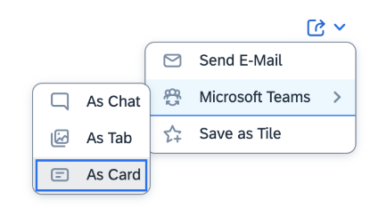
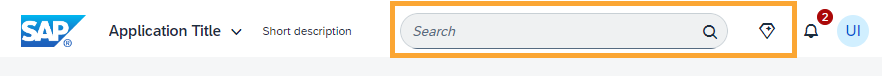

<!-- loio91a4a2f59e444ada8d003369a580f61d -->

# What's New in SAPUI5 1.121

With this release SAPUI5 is upgraded from version 1.120 to 1.121.

> ### Tip:  
> If you want to do a search across all versions of the What's New content, you can also find it in the [SAPUI5 What's New viewer](https://help.sap.com/whats-new/67f60363b57f4ac0b23efd17fa192d60).

****

<table>
<tr>
<th valign="top">

Version

</th>
<th valign="top">

Type

</th>
<th valign="top">

Category

</th>
<th valign="top">

Title

</th>
<th valign="top">

Description

</th>
<th valign="top">

Action

</th>
<th valign="top">

Available as of

</th>
</tr>
<tr>
<td valign="top">

1.121 

</td>
<td valign="top">

Changed 

</td>
<td valign="top">

Control 

</td>
<td valign="top">

**`sap.m.List`, `sap.m.Table`, `sap.m.Tree`** 

</td>
<td valign="top">

****`sap.m.List`, `sap.m.Table`, `sap.m.Tree`****

-   To visualize which scope is affected by the context menu actions \(a single row or all selected rows\) , we have enabled the new `ContextMenuSetting` plugin. For more information, see the [API Reference](https://ui5.sap.com/#/api/sap.m.plugins.ContextMenuSetting).

-   We have enabled the `rememberSelections` property that stores binding paths of selections after binding updates in OData V4. For more information, see the [API Reference](https://ui5.sap.com/#/api/sap.m.ListBase%23methods/getRememberSelections).

Changed•Control•Info Only•1.121

</td>
<td valign="top">

Info Only 

</td>
<td valign="top">

2024-02-22

</td>
</tr>
<tr>
<td valign="top">

1.121 

</td>
<td valign="top">

Changed 

</td>
<td valign="top">

Control 

</td>
<td valign="top">

**`sap.ui.table.AnalyticalTable`, `sap.ui.table.Table`, `sap.ui.table.TreeTable` ** 

</td>
<td valign="top">

**`sap.ui.table.AnalyticalTable`, `sap.ui.table.Table`, `sap.ui.table.TreeTable` **

-   To visualize which scope is affected by the context menu actions \(a single row or all selected rows\), we have enabled the new `ContextMenuSetting` plugin. For more information, see the [API Reference](https://ui5.sap.com/#/api/sap.m.plugins.ContextMenuSetting).

-   We have implemented the static `findOn` function in plugin classes that allow you to find all plugins used in a given control. For more information, see the [API Reference](https://ui5.sap.com/#/api/sap.ui.table.plugins.MultiSelectionPlugin%23methods/sap.ui.table.plugins.MultiSelectionPlugin.findOn).

Changed•Control•Info Only•1.121

</td>
<td valign="top">

Info Only 

</td>
<td valign="top">

2024-02-22

</td>
</tr>
<tr>
<td valign="top">

1.121 

</td>
<td valign="top">

Changed 

</td>
<td valign="top">

Feature 

</td>
<td valign="top">

**`sap.m.plugins.CopyProvider`** 

</td>
<td valign="top">

**`sap.m.plugins.CopyProvider`**

We have provided copy and paste functionality that allows users to copy data in plain `text` and `html` format using the `extractDataHandler` of `sap.m.plugins.CopyProvider`. This way users can, for example, copy data in various data formats from a table to a spreadsheet and vice versa. For more information, see the [API Reference](https://ui5.sap.com/#/api/sap.m.plugins.CopyProvider.extractDataHandler) and the [Sample](https://ui5.sap.com/#/entity/sap.m.Table/sample/sap.m.sample.TableCopy).

Changed•Feature•Info Only•1.121

</td>
<td valign="top">

Info Only 

</td>
<td valign="top">

2024-02-22

</td>
</tr>
<tr>
<td valign="top">

1.121 

</td>
<td valign="top">

Changed 

</td>
<td valign="top">

Control 

</td>
<td valign="top">

**`sap.ui.mdc.Table` \(experimental\)** 

</td>
<td valign="top">

**`sap.ui.mdc.Table` \(experimental\)**

-   In some simple scenarios, where the table is used to display information only \(read-only scenarios\), you might want to hide the toolbar of the table. To enable this, we have provided the `hideToolbar` property. See the documentation for restrictions related to this feature. For more information, see the [API Reference](https://ui5.sap.com/#/api/sap.ui.mdc.Table%23methods/getHideToolbar).

-   To visualize which scope is affected by the context menu actions \(a single row or all selected rows\) , we have enabled the new `ContextMenuSetting` plugin. For more information, see the [API Reference](https://ui5.sap.com/#/api/sap.m.plugins.ContextMenuSetting).

Changed•Control•Info Only•1.121

</td>
<td valign="top">

Info Only 

</td>
<td valign="top">

2024-02-22

</td>
</tr>
<tr>
<td valign="top">

1.121 

</td>
<td valign="top">

Changed 

</td>
<td valign="top">

Control 

</td>
<td valign="top">

**`sap.ui.mdc.Chart`, `sap.ui.mdc.FilterBar`, `sap.ui.mdc.Table` \(experimental\)** 

</td>
<td valign="top">

**`sap.ui.mdc.Chart`, `sap.ui.mdc.FilterBar`, `sap.ui.mdc.Table` \(experimental\)**

So that delegate metadata can be easily understood, we have changed the main identifier attribute of `propertyInfo` from `name` to `key`. For compatibility reasons, we ensure that applications can still use the legacy format. For more information, see the [API Reference](https://ui5.sap.com/#/api/sap.ui.mdc.util.PropertyInfo). 

Changed•Control•Info Only•1.121

</td>
<td valign="top">

Info Only 

</td>
<td valign="top">

2024-02-22

</td>
</tr>
<tr>
<td valign="top">

1.121 

</td>
<td valign="top">

Changed 

</td>
<td valign="top">

Feature 

</td>
<td valign="top">

**`sap.m.p13n.Engine`** 

</td>
<td valign="top">

**`sap.m.p13n.Engine`**

-   We have enhanced personalization with filtering options: A filter panel is now available in the `Engine`. We have also enabled the implementation of a `FilterController`. This implementation includes variants and can be used by any control. For more information, see the [API Reference](https://ui5.sap.com/#/api/sap.m.p13n.Engine) and the [Sample](https://ui5.sap.com/#/entity/sap.m.p13n.Engine/sample/sap.m.sample.p13n.EngineCustomFilters).

-   You can now use several selection controllers of the same type. For more information, see the [API Reference](https://ui5.sap.com/#/api/sap.m.p13n.Engine) and the [Sample](https://ui5.sap.com/#/entity/sap.m.p13n.Engine/sample/sap.m.sample.p13n.EngineMultipleController).

Changed•Feature•Info Only•1.121

</td>
<td valign="top">

Info Only 

</td>
<td valign="top">

2024-02-22

</td>
</tr>
<tr>
<td valign="top">

1.121 

</td>
<td valign="top">

Changed 

</td>
<td valign="top">

Control 

</td>
<td valign="top">

**`sap.ui.mdc.Field`, `sap.ui.mdc.FilterBar`, `sap.ui.mdc.ValueHelp` \(experimental\)** 

</td>
<td valign="top">

**`sap.ui.mdc.Field`, `sap.ui.mdc.FilterBar`, `sap.ui.mdc.ValueHelp` \(experimental\)**

You can now copy and paste content, such as a combination of key and description, from a table or any type of tabular format, into filter fields. Note that only the first column of the table will be taken into account.

Changed•Control•Info Only•1.121

</td>
<td valign="top">

Info Only 

</td>
<td valign="top">

2024-02-22

</td>
</tr>
<tr>
<td valign="top">

1.121 

</td>
<td valign="top">

Changed 

</td>
<td valign="top">

Control 

</td>
<td valign="top">

**`sap.ui.comp.filterbar.FilterBar`** 

</td>
<td valign="top">

**`sap.ui.comp.filterbar.FilterBar`**

We've introduced a new `headerLevel` property. It specifies the semantic level of the `header` text property. For more information, see the [API Reference](https://ui5.sap.com/#/api/sap.ui.comp.filterbar.FilterBar).

Changed•Control•Info Only•1.121

</td>
<td valign="top">

Info Only 

</td>
<td valign="top">

2024-02-22

</td>
</tr>
<tr>
<td valign="top">

1.121 

</td>
<td valign="top">

Changed 

</td>
<td valign="top">

Control 

</td>
<td valign="top">

**`sap.ui.comp.smarttable.SmartTable`** 

</td>
<td valign="top">

**`sap.ui.comp.smarttable.SmartTable`**

Until now, you could only filter the ID column of the smart table. Now, if a column has the `Common.Text` annotation or the `sap:text` OData V2 extension, and you open the filter dialog from the column header menu, you get filter fields for both the ID and description columns. For more information, see the [Sample](https://ui5.sap.com/#/entity/sap.ui.comp.smarttable.SmartTable/sample/sap.ui.comp.sample.smarttable).

Changed•Control•Info Only•1.121

</td>
<td valign="top">

Info Only 

</td>
<td valign="top">

2024-02-22

</td>
</tr>
<tr>
<td valign="top">

1.121 

</td>
<td valign="top">

Changed 

</td>
<td valign="top">

Control 

</td>
<td valign="top">

**`sap.ui.comp.valuehelpdialog.ValueHelpDialog`** 

</td>
<td valign="top">

**`sap.ui.comp.valuehelpdialog.ValueHelpDialog`**

`sap.ui.comp.smarttable.SmartTable` is now the table used by default in the value help dialog.

Changed•Control•Info Only•1.121

</td>
<td valign="top">

Info Only 

</td>
<td valign="top">

2024-02-22

</td>
</tr>
<tr>
<td valign="top">

1.121 

</td>
<td valign="top">

Changed 

</td>
<td valign="top">

Control 

</td>
<td valign="top">

**`sap.ui.comp.smartfield.SmartField`** 

</td>
<td valign="top">

**`sap.ui.comp.smartfield.SmartField`**

-   We've improved the error messages that you receive when searching for an ID in `sap.m.Input` and `sap.m.ComboBox` fields with the `textOnly` setting \(only the description is shown\). For more information, see the [API Reference](https://ui5.sap.com/#/api/sap.ui.comp.smartfield.SmartField).

-   The control now supports the `com.sap.vocabularies.UI.v1.Placeholder` annotation.

Changed•Control•Info Only•1.121

</td>
<td valign="top">

Info Only 

</td>
<td valign="top">

2024-02-22

</td>
</tr>
<tr>
<td valign="top">

1.121 

</td>
<td valign="top">

Changed 

</td>
<td valign="top">

Control 

</td>
<td valign="top">

**`sap.ui.comp.smartfilterbar.SmartFilterBar`** 

</td>
<td valign="top">

**`sap.ui.comp.smartfilterbar.SmartFilterBar`**

-   We've adapted the copy and paste function of the smart filter bar. Now, if the content of more than one column in a table is pasted into a filter field with multiple values, only the content of the first column is copied from the clipboard.

-   Until now, NUMC filters were not showing 0 as a value. Now, we have introduced the `<Empty>` operator for such fields. You can select the `<Empty>` or `!<Empty>` operator in the condition panel of the value help dialog that sends 0 as a value for the filter field. For more information, see the [API Reference](https://ui5.sap.com/#/api/sap.ui.comp.smartfilterbar.SmartFilterBar).

-   We've improved timestamp fields. Now, if you send a date and time in a filter query, it includes an interval based on the precision defined in the field and takes milliseconds into account.

-   Until now, the smart filter bar `navigationProperties` property only supported listing `navigationProperty` names separated by commas. Now, the support is enhanced to include the listing of separate filters from different navigation properties. For more information, see the [API Reference](https://ui5.sap.com/#/api/sap.ui.comp.smartfilterbar.SmartFilterBar).

-   We've enhanced the support for `OUT` and `InOut` parameters for `sap.m.DynamicDateRange`. Now, the `ValueList` annotation of a `String` field supports `ValueListParameterInOut` records with `LocalDataProperty` `sap.m.DynamicDateRange` \(interval\) as a source and `ValueListProperty sap.m.DatePicker` \(single\) as a destination.

Changed•Control•Info Only•1.121

</td>
<td valign="top">

Info Only 

</td>
<td valign="top">

2024-02-22

</td>
</tr>
<tr>
<td valign="top">

1.121 

</td>
<td valign="top">

Changed 

</td>
<td valign="top">

SAP Fiori Elements 

</td>
<td valign="top">

**SAP Fiori elements for OData V2 and SAP Fiori elements for OData V4** 

</td>
<td valign="top">

**SAP Fiori elements for OData V2 and SAP Fiori elements for OData V4**

The following changes and new features are available for SAP Fiori elements for OData V2 and SAP Fiori elements for OData V4:

-   The section or subsection title is now merged with the table or chart title if the section or subsection only has one table or chart control. For more information, see [Defining and Adapting Sections](../06_SAP_Fiori_Elements/defining-and-adapting-sections-facfea0.md).

-   We've added another option to the *Share* menu button that administrators can enable. When a user clicks the *Share* button and then the *Share Menu: Microsoft Teams* option, they can now also choose *As Card*.

    

    For more information, see [The Share Functionality](../06_SAP_Fiori_Elements/the-share-functionality-022bf0d.md).

Changed•SAP Fiori Elements•Info Only•1.121

</td>
<td valign="top">

Info Only 

</td>
<td valign="top">

2024-02-22

</td>
</tr>
<tr>
<td valign="top">

1.121 

</td>
<td valign="top">

Changed 

</td>
<td valign="top">

SAP Fiori Elements 

</td>
<td valign="top">

**SAP Fiori elements for OData V2** 

</td>
<td valign="top">

**SAP Fiori elements for OData V2**

The following changes and new features are available for SAP Fiori elements for OData V2:

-   Table types are now displayed on mobile devices. This means that there's no need to automatically switch to responsive tables when the app is launched on mobile devices. For more information, see [Tables](../06_SAP_Fiori_Elements/tables-c0f6592.md).

-   List report applications now support the creation of insights cards from responsive tables in multiview scenarios. For more information, see [Creating Cards for the Insights Section of My Home in SAP S/4HANA Cloud](../06_SAP_Fiori_Elements/creating-cards-for-the-insights-section-of-my-home-in-sap-s-4hana-cloud-9b13559.md)

-   You can now hide the section title in a custom section, and sections with reuse components, using the `setAsTitleOwner` extension API . For more information, see [Placing Reuse Component Instances on the Object Page](../06_SAP_Fiori_Elements/placing-reuse-component-instances-on-the-object-page-1ba7f88.md), [Adding a Section to an Object Page](../06_SAP_Fiori_Elements/adding-a-section-to-an-object-page-a357047.md).

-   You can now display a message strip with a custom message in the object page header. For more information, see [Extension Points for Object Page Header Facets](../06_SAP_Fiori_Elements/extension-points-for-object-page-header-facets-61cf0ee.md).

-   We've introduced the following keys that allow application developers to add a tooltip to the pagination buttons using the custom `i18n` file approach:

    -   `T_PAGINATOR_CONTROL_PAGINATOR_TOOLTIP_UP`
    -   `T_PAGINATOR_CONTROL_PAGINATOR_TOOLTIP_DOWN`

    For more information, see [Localization of UI Texts](../06_SAP_Fiori_Elements/localization-of-ui-texts-b8cb649.md).

-   You can now incorporate the column header in the column width calculation to avoid truncated column labels. For more information, see [Setting the Default Column Width](../06_SAP_Fiori_Elements/setting-the-default-column-width-a765253.md).

Changed•SAP Fiori Elements•Info Only•1.121

</td>
<td valign="top">

Info Only 

</td>
<td valign="top">

2024-02-22

</td>
</tr>
<tr>
<td valign="top">

1.121 

</td>
<td valign="top">

Changed 

</td>
<td valign="top">

SAP Fiori Elements 

</td>
<td valign="top">

**SAP Fiori elements for OData V4** 

</td>
<td valign="top">

**SAP Fiori elements for OData V4**

The following changes and new features are available for SAP Fiori elements for OData V4:

-   You can now control the visibility of the *Send E-mail* and *Share: Microsoft Teams* options displayed in the *Share* menu by configuring the manifest settings. For more information, see [The Share Functionality](../06_SAP_Fiori_Elements/the-share-functionality-022bf0d.md).

-   Information coming from a navigation entity that is associated with the control is no longer a part of the navigation context that is passed during external navigation. This reduces the overall load of information that needs to be passed. For more information, see [Navigation from an App \(Outbound Navigation\)](../06_SAP_Fiori_Elements/navigation-from-an-app-outbound-navigation-d782acf.md).

-   We now support the use of the `Common.IsNaturalPerson` annotation with an entity and other annotations such as `UI.IsImage` and `UI.IsImageUrl`. For more information, see [Enabling Stream Support](../06_SAP_Fiori_Elements/enabling-stream-support-b236d32.md).

-   You can now define and hide the table header using the `manifest.json`. For more information, see [Setting the Table Header](../06_SAP_Fiori_Elements/setting-the-table-header-f996207.md).

-   We now ensure that charts and analytical tables support the parameterized entity. For more information, see [Configuring Filter Bars](../06_SAP_Fiori_Elements/configuring-filter-bars-4bd7590.md).

-   You can now use the manifest setting `openInEditMode` to open an object page in edit mode. For more information, see [Navigation to an Object Page in Edit Mode](../06_SAP_Fiori_Elements/navigation-to-an-object-page-in-edit-mode-8665847.md).

-   The `Chart` building block now supports `getter` and `setter` methods to get and set the chart state using the `PresentationVariant` format. For more information, see [The Chart Building Block](../06_SAP_Fiori_Elements/the-chart-building-block-52d065a.md).

-   The `Table` building block now supports `getter` and `setter` methods to get and set the chart state using the `PresentationVariant` format. For more information, see [The Table Building Block](../06_SAP_Fiori_Elements/the-table-building-block-3801656.md).

-   The `Table` building block now supports analytical tables. For more information, see [The Table Building Block](../06_SAP_Fiori_Elements/the-table-building-block-3801656.md).

-   You can now enhance the request of the `Table` building block before rebinding it. For more information, see [Influencing the Request Dynamically](../06_SAP_Fiori_Elements/influencing-the-request-dynamically-2cc6c03.md).

-   You can now define a tooltip for custom columns in the manifest settings. For more information, see [Extension Points for Tables](../06_SAP_Fiori_Elements/extension-points-for-tables-d525522.md).

-   You can now use the `SelectionPresentationVariant` annotation in an object page table. For more information, see [Defining and Adapting Sections](../06_SAP_Fiori_Elements/defining-and-adapting-sections-facfea0.md).

-   Value help fields can now display the history of recently entered values. For more information, see [Enabling the History of Recently Entered Values](../06_SAP_Fiori_Elements/enabling-the-history-of-recently-entered-values-37dbf1f.md) .

Changed•SAP Fiori Elements•Info Only•1.121

</td>
<td valign="top">

Info Only 

</td>
<td valign="top">

2024-02-22

</td>
</tr>
<tr>
<td valign="top">

1.121 

</td>
<td valign="top">

Changed 

</td>
<td valign="top">

Control 

</td>
<td valign="top">

**Gantt Chart: Improved Time Zone Support** 

</td>
<td valign="top">

**Gantt Chart: Improved Time Zone Support**

The Gantt chart now provides improved support for time zones. This development offers seamless compatibility with SAP Fiori launchpad time zones as well as Gantt-chart-specific time zones, including support for daylight saving time shifts. In addition, applications can use any IANA time zone that is only applicable to the Gantt chart.

Changed•Control•Info Only•1.121

</td>
<td valign="top">

Info Only 

</td>
<td valign="top">

2024-02-22

</td>
</tr>
<tr>
<td valign="top">

1.121 

</td>
<td valign="top">

Changed 

</td>
<td valign="top">

Control 

</td>
<td valign="top">

**New Property: `isTrustedSource`** 

</td>
<td valign="top">

**New Property: `isTrustedSource`**

We’ve created the `isTrustedSource` property with the default value `false` to ensure PDF files are now always rendered as a link.

Application developers can set the value to `true` if they are certain the PDF content is based on app data that is known to not contain JavaScript. This property enhances the secure display of PDF files.

Changed•Control•Info Only•1.121

</td>
<td valign="top">

Info Only 

</td>
<td valign="top">

2024-02-22

</td>
</tr>
<tr>
<td valign="top">

1.121 

</td>
<td valign="top">

Changed 

</td>
<td valign="top">

Control 

</td>
<td valign="top">

**`illustratedMessage` Available as an Aggregation of `UploadSet`** 

</td>
<td valign="top">

****`illustratedMessage` Available as an Aggregation of `UploadSet`****

We've introduced the `illustratedMessage` as an aggregation of `UploadSet`. You can now customize `illustratedMessage` when there is no data in the `UploadSet`. A default `illustratedMessage` is retained if specific descriptions are not available.

As a part of this update, we have deprecated the `noDataText`, `noDataDescription`, and `noDataIllustrationType` properties. Simultaneously, we have introduced a new aggregation, `illustratedMessage` of type `sap.m.IllustratedMessage`. You can implement this by directly adding it as an aggregation within `UploadSet`.

For more information, see the [API Reference](https://ui5.sap.com/#/api/sap.m.upload.UploadSet).

Changed•Control•Info Only•1.121

</td>
<td valign="top">

Info Only 

</td>
<td valign="top">

2024-02-22

</td>
</tr>
<tr>
<td valign="top">

1.121 

</td>
<td valign="top">

Changed 

</td>
<td valign="top">

Control 

</td>
<td valign="top">

**`sap.m.IconTabFilter`** 

</td>
<td valign="top">

**`sap.m.IconTabFilter`**

We have introduced a new \(experimental\) `interactionMode` property that you can use to control the interaction behavior of the tab filters in relation with their nested tabs and the availability of their own content. For more information, see the [API Reference](https://ui5.sap.com/#/api/sap.m.IconTabFilter) and the [Sample](https://ui5.sap.com/#/entity/sap.tnt.ToolHeader/sample/sap.tnt.sample.ToolHeaderIconTabHeader).

Changed•Control•Info Only•1.121

</td>
<td valign="top">

Info Only 

</td>
<td valign="top">

2024-02-22

</td>
</tr>
<tr>
<td valign="top">

1.121 

</td>
<td valign="top">

Changed 

</td>
<td valign="top">

Control 

</td>
<td valign="top">

**`sap.m.Carousel`** 

</td>
<td valign="top">

**`sap.m.Carousel`**

Using the new `scrollMode` property, you can now allow users to browse through multiple carousel pages with one click. The available options are listed in the `sap.m.CarouselScrollMode` enum:

-   `SinglePage` \(default\) – the user can slide pages one by one. This was the behavior until now.
-   `VisiblePages` – when there are multiple visible pages in the carousel \(visiblePagesCount property has a value greater than one\), the user can slide them all with one click.

For more information, see the [Sample](https://ui5.sap.com/#/entity/sap.m.Carousel/sample/sap.m.sample.CarouselWithMorePages). 

Changed•Control•Info Only•1.121

</td>
<td valign="top">

Info Only 

</td>
<td valign="top">

2024-02-22

</td>
</tr>
<tr>
<td valign="top">

1.121 

</td>
<td valign="top">

Changed 

</td>
<td valign="top">

Control 

</td>
<td valign="top">

**`sap.tnt.SideNavigation`** 

</td>
<td valign="top">

**`sap.tnt.SideNavigation`**

We have made several design enhancements to the control. Additionally, using the new `sap.tnt.NavigationListGroup` control, you can now arrange some of the navigation items in a group. For more information, see the [NavigationListGroup API Reference](https://ui5.sap.com/#/api/sap.tnt.NavigationListGroup) and the [Sample](https://ui5.sap.com/#/entity/sap.tnt.SideNavigation/sample/sap.tnt.sample.SideNavigation).

Changed•Control•Info Only•1.121

</td>
<td valign="top">

Info Only 

</td>
<td valign="top">

2024-02-22

</td>
</tr>
<tr>
<td valign="top">

1.121 

</td>
<td valign="top">

Changed 

</td>
<td valign="top">

Control 

</td>
<td valign="top">

**`sap.ui.integration.widgets.Card`** 

</td>
<td valign="top">

**`sap.ui.integration.widgets.Card`**

-   We have \(experimentally\) added a new filter of type `sap.m.ComboBox`, which supports a two-column layout. For more information, see the [Combo Box Filter](https://ui5.sap.com/test-resources/sap/ui/integration/demokit/cardExplorer/webapp/index.html#/learn/filters/comboBox) section and [ComboBox](https://ui5.sap.com/test-resources/sap/ui/integration/demokit/cardExplorer/webapp/index.html#/explore/comboBoxFilter) sample in the Card Explorer.
-   We have \(experimentally\) introduced an additional option to define actions-strip buttons in a list item or in a footer. It allows you to dynamically set specific actions for each list item in the List card. They can now be defined with a template, and can be based on the fetched data from a back-end service. For more information, see the [Actions Strip](https://ui5.sap.com/test-resources/sap/ui/integration/demokit/cardExplorer/webapp/index.html#/learn/features/actionsStrip) section and [Dynamic Actions Strip](https://ui5.sap.com/test-resources/sap/ui/integration/demokit/cardExplorer/webapp/index.html#/explore/list/dynamicActionsStrip) sample in the Card Explorer.
-   We have \(experimentally\) added an option to set group labels for one or more actions-strip buttons. For more information, see the [Actions Strip](https://ui5.sap.com/test-resources/sap/ui/integration/demokit/cardExplorer/webapp/index.html#/learn/features/actionsStrip) section and [Actions Labels](https://ui5.sap.com/test-resources/sap/ui/integration/demokit/cardExplorer/webapp/index.html#/explore/list/actionsLabels) sample in the Card Explorer.
-   We have introduced a new `preferIcon` property for the actions-strip buttons. If set to `true`, the button in the visible area is displayed only as an icon. This feature saves space in the actions strip. For more information, see the [Actions Strip](https://ui5.sap.com/test-resources/sap/ui/integration/demokit/cardExplorer/webapp/index.html#/learn/features/actionsStrip) section in the Card Explorer.
-   The following features are no longer experimental:

    -   Search filter
    -   CSRF tokens \(with new binding syntax\)
    -   Actions strip
    -   Card footer

    For more information, see the [Learn](https://ui5.sap.com/test-resources/sap/ui/integration/demokit/cardExplorer/webapp/index.html#/learn/gettingStarted) section in the Card Explorer.

-   We have \(experimentally\) enabled the Object card to show an image with text overlay. There are multiple new properties available that you can use to control how the image is displayed and the overlay behavior of the texts. For more information, see the [Object Card](https://ui5.sap.com/test-resources/sap/ui/integration/demokit/cardExplorer/webapp/index.html#/learn/typesDeclarative/object) section and [Sample](https://ui5.sap.com/test-resources/sap/ui/integration/demokit/cardExplorer/webapp/index.html#/explore/object/objectCardWithImageWithOverlay) in the Card Explorer.

Changed•Control•Info Only•1.121

</td>
<td valign="top">

Info Only 

</td>
<td valign="top">

2024-02-22

</td>
</tr>
<tr>
<td valign="top">

1.121 

</td>
<td valign="top">

Changed 

</td>
<td valign="top">

Feature 

</td>
<td valign="top">

**Icon Explorer** 

</td>
<td valign="top">

**Icon Explorer**

We have added new icons to the SAP Fiori Tools icon font. Find the icon that fits your needs via the [Icon Explorer](https://ui5.sap.com/test-resources/sap/ui/integration/demokit/iconExplorer/webapp/index.html) tool.

Changed•Feature•Info Only•1.121

</td>
<td valign="top">

Info Only 

</td>
<td valign="top">

2024-02-22

</td>
</tr>
<tr>
<td valign="top">

1.121 

</td>
<td valign="top">

Changed 

</td>
<td valign="top">

Feature 

</td>
<td valign="top">

**TypeScript** 

</td>
<td valign="top">

**TypeScript**

-   We have added support for `abstract` classes \(SAPUI5 classes marked as `abstract` are now also marked as such in the type definitions\).
-   Constructors hidden in SAPUI5 via `@hideconstructor` are now protected in the type definitions.

Changed•Feature•Info Only•1.121

</td>
<td valign="top">

Info Only 

</td>
<td valign="top">

2024-02-22

</td>
</tr>
<tr>
<td valign="top">

1.121 

</td>
<td valign="top">

Changed 

</td>
<td valign="top">

Feature 

</td>
<td valign="top">

**Walkthrough Tutorial in TypeScript** 

</td>
<td valign="top">

**Walkthrough Tutorial in TypeScript**

A new tutorial is now available. This is the TypeScript version of our existing Walkthrough tutorial, offering you the same comprehensive tour of SAPUI5 but now in TypeScript.

For more information, see [Walkthrough Tutorial \(TypeScript\)](../03_Get-Started/walkthrough-tutorial-typescript-dad1905.md).

Changed•Feature•Info Only•1.121

</td>
<td valign="top">

Info Only 

</td>
<td valign="top">

2024-02-22

</td>
</tr>
<tr>
<td valign="top">

1.121 

</td>
<td valign="top">

Changed 

</td>
<td valign="top">

Feature 

</td>
<td valign="top">

**SAPUI5 OData V4 Model** 

</td>
<td valign="top">

**SAPUI5 OData V4 Model**

The new version of the SAPUI5 OData V4 model introduces the following features:

-   You can now use aliases for computed annotations in XML views. Use `template:require` or `<template:alias>` during templating and `core:require` in XML views for defining your aliases. Note that we no longer recommend using global names for computed annotations in XML views or during templating.

    For more information, see [Require Modules in XML View and Fragment](../04_Essentials/require-modules-in-xml-view-and-fragment-b11d853.md) and [Meta Model for OData V4](../04_Essentials/meta-model-for-odata-v4-7f29fb3.md).

-   You can now explicitly provide `$single` as a new group ID to`sap.ui.model.odata.v4.Context#delete`, `sap.ui.model.odata.v4.ODataModel#delete`, and `sap.ui.model.odata.v4.ODataContextBinding#execute`. Requests will then be sent as fast as with `$direct`, but they will be wrapped in a batch request as with `$auto`.

    For more information, see the API Reference for [`v4.Context#delete`](https://ui5.sap.com/#/api/sap.ui.model.odata.v4.Context%23methods/delete), [`v4.ODataModel#delete`](https://ui5.sap.com/#/api/sap.ui.model.odata.v4.ODataModel%23methods/delete), and [`v4.ODataContextBinding#execute`](https://ui5.sap.com/#/api/sap.ui.model.odata.v4.ODataContextBinding%23methods/execute).

Changed•Feature•Info Only•1.121

</td>
<td valign="top">

Info Only 

</td>
<td valign="top">

2024-02-22

</td>
</tr>
<tr>
<td valign="top">

1.121 

</td>
<td valign="top">

Changed 

</td>
<td valign="top">

Feature 

</td>
<td valign="top">

**Formatting** 

</td>
<td valign="top">

**Formatting**

We now support rounding of string-based values as used, for example, for `Edm.Decimal`.

Changed•Feature•Info Only•1.121

</td>
<td valign="top">

Info Only 

</td>
<td valign="top">

2024-02-22

</td>
</tr>
<tr>
<td valign="top">

1.121 

</td>
<td valign="top">

Changed 

</td>
<td valign="top">

Feature 

</td>
<td valign="top">

**Localization** 

</td>
<td valign="top">

**Localization**

We now use the localization content of the Unicode Common Locale Data Repository \(CLDR\) version 44.0.0.

Changed•Feature•Info Only•1.121

</td>
<td valign="top">

Info Only 

</td>
<td valign="top">

2024-02-22

</td>
</tr>
<tr>
<td valign="top">

1.121 

</td>
<td valign="top">

Changed 

</td>
<td valign="top">

Control 

</td>
<td valign="top">

**`sap.f.ShellBar`** 

</td>
<td valign="top">

**`sap.f.ShellBar`**

We have reworked the positioning and naming of the AI copilot Joule and the search field in the `sap.f.ShellBar` for size XXL.

Changed•Control•Info Only•1.121

</td>
<td valign="top">

Info Only 

</td>
<td valign="top">

2024-02-22

</td>
</tr>
<tr>
<td valign="top">

1.121 

</td>
<td valign="top">

Changed 

</td>
<td valign="top">

Control 

</td>
<td valign="top">

**`sap.m.IllustratedMessage`** 

</td>
<td valign="top">

**`sap.m.IllustratedMessage`**

We have introduced two new illustration types added to the default illustration set: `SignOut` and `NewMail`. For more information, see the [API Reference](https://ui5.sap.com/#/api/sap.m.IllustratedMessage).

Changed•Control•Info Only•1.121

</td>
<td valign="top">

Info Only 

</td>
<td valign="top">

2024-02-22

</td>
</tr>
<tr>
<td valign="top">

1.121 

</td>
<td valign="top">

Changed 

</td>
<td valign="top">

Control 

</td>
<td valign="top">

**`sap.m.CheckBox`** 

</td>
<td valign="top">

**`sap.m.CheckBox`**

We have implemented the new `required` property for better interaction with assistive technologies. Please note, you should only use this property when it isn't possible to establish a single relationship between the field and a label. For more information, see the [API Reference](https://ui5.sap.com/#/api/sap.m.CheckBox). 

Changed•Control•Info Only•1.121

</td>
<td valign="top">

Info Only 

</td>
<td valign="top">

2024-02-22

</td>
</tr>
<tr>
<td valign="top">

1.121 

</td>
<td valign="top">

Changed 

</td>
<td valign="top">

Control 

</td>
<td valign="top">

**`sap.ui.core.InvisibleMessage`** 

</td>
<td valign="top">

**`sap.ui.core.InvisibleMessage`**

The `sap.ui.core.InvisibleMessageMode` enum is no longer experimental. For more information, see the [API Reference](https://ui5.sap.com/#/api/sap.ui.core.InvisibleMessageMode).

Changed•Control•Info Only•1.121

</td>
<td valign="top">

Info Only 

</td>
<td valign="top">

2024-02-22

</td>
</tr>
<tr>
<td valign="top">

1.121 

</td>
<td valign="top">

Changed 

</td>
<td valign="top">

Control 

</td>
<td valign="top">

**`sap.m.Popover`, `sap.m.ResponsivePopover`** 

</td>
<td valign="top">

**`sap.m.Popover`, `sap.m.ResponsivePopover`**

The `resizable` property is no longer experimental. You can make your popovers dynamic and responsive by resizing them. For more information, see the [API Reference](https://ui5.sap.com/#/api/sap.m.Popover).

Changed•Control•Info Only•1.121

</td>
<td valign="top">

Info Only 

</td>
<td valign="top">

2024-02-22

</td>
</tr>
<tr>
<td valign="top">

1.121 

</td>
<td valign="top">

Changed 

</td>
<td valign="top">

Control 

</td>
<td valign="top">

**`sap.m.Input`, `sap.m.MultiInput`, `sap.m.ComboBox`, `sap.m.MultiComboBox`** 

</td>
<td valign="top">

**`sap.m.Input`, `sap.m.MultiInput`, `sap.m.ComboBox`, `sap.m.MultiComboBox`**

We have prevented the closing of the suggestions popover when pressing [Enter\] on a group header item.

Changed•Control•Info Only•1.121

</td>
<td valign="top">

Info Only 

</td>
<td valign="top">

2024-02-22

</td>
</tr>
<tr>
<td valign="top">

1.121 

</td>
<td valign="top">

Changed 

</td>
<td valign="top">

Control 

</td>
<td valign="top">

**`sap.m.Wizard`** 

</td>
<td valign="top">

**`sap.m.Wizard`**

-   We have added stable IDs to the list items in the `WizardProgressNavigator`.

-   The `sap.m.WizardRenderMode` property is no longer experimental. You can customize the rendering mode of the `sap.m.Wizard` control.

For more information, see the [API Reference](https://ui5.sap.com/#/api/sap.m.Wizard).

Changed•Control•Info Only•1.121

</td>
<td valign="top">

Info Only 

</td>
<td valign="top">

2024-02-22

</td>
</tr>
<tr>
<td valign="top">

1.121 

</td>
<td valign="top">

Changed 

</td>
<td valign="top">

Control 

</td>
<td valign="top">

**`sap.m.InputBase`** 

</td>
<td valign="top">

**`sap.m.InputBase`**

The `formattedValueStateText` aggregation is no longer experimental. You can manage formatted value state texts within input controls without worrying about future changes. For more information, see the [API Reference](https://ui5.sap.com/#/api/sap.m.InputBase).

Changed•Control•Info Only•1.121

</td>
<td valign="top">

Info Only 

</td>
<td valign="top">

2024-02-22

</td>
</tr>
<tr>
<td valign="top">

1.121 

</td>
<td valign="top">

Changed 

</td>
<td valign="top">

Control 

</td>
<td valign="top">

**`sap.m.PlanningCalendar`, `sap.m.SinglePlanningCalendar`, and `sap.ui.unified.Calendar`** 

</td>
<td valign="top">

**`sap.m.PlanningCalendar`, `sap.m.SinglePlanningCalendar`, and `sap.ui.unified.Calendar`**

We have added a new `Working` day type in the `sap.ui.unified.CalendarDayType` enum. Now you can set a weekend day as a working day when there is a work schedule that differs from the standard working-week days. For more information, see the [DateTypeRange API Reference](https://ui5.sap.com/#/api/sap.ui.unified.DateTypeRange) and the [Sample](https://ui5.sap.com/#/entity/sap.m.SinglePlanningCalendar/sample/sap.m.sample.SinglePlanningCalendarWithLegend).

Changed•Control•Info Only•1.121

</td>
<td valign="top">

Info Only 

</td>
<td valign="top">

2024-02-22

</td>
</tr>
<tr>
<td valign="top">

1.121 

</td>
<td valign="top">

Changed 

</td>
<td valign="top">

Control 

</td>
<td valign="top">

**`sap.m.PlanningCalendarRow`** 

</td>
<td valign="top">

**`sap.m.PlanningCalendarRow`**

We have introduced a new `rowHeaderDescription` property. As an application developer, you can use it to define the text that will be announced by screen readers when a user navigates to the row header. For more information, see the [API Reference](https://ui5.sap.com/#/api/sap.m.PlanningCalendarRow).

Changed•Control•Info Only•1.121

</td>
<td valign="top">

Info Only 

</td>
<td valign="top">

2024-02-22

</td>
</tr>
<tr>
<td valign="top">

1.121 

</td>
<td valign="top">

Changed 

</td>
<td valign="top">

Control 

</td>
<td valign="top">

**`sap.m.SinglePlanningCalendar`** 

</td>
<td valign="top">

**`sap.m.SinglePlanningCalendar`**

To improve the accessibility of the control, we have provided shorter and more user-friendly texts for screen-reader announcements of appointment durations. Now we use the full date format \(for example, “Thursday, August 17, 2023”\) instead of the short format \(“8/17/23”\). Additionally, now we use the shorter “From/To”, instead of “Start Time/End Time”.For more information, see the [Sample](https://ui5.sap.com/#/entity/sap.m.SinglePlanningCalendar/sample/sap.m.sample.SinglePlanningCalendar).

Changed•Control•Info Only•1.121

</td>
<td valign="top">

Info Only 

</td>
<td valign="top">

2024-02-22

</td>
</tr>
<tr>
<td valign="top">

1.121 

</td>
<td valign="top">

Changed 

</td>
<td valign="top">

Control 

</td>
<td valign="top">

**`sap.m.ViewSettingsDialog`** 

</td>
<td valign="top">

**`sap.m.ViewSettingsDialog`**

You can use the new wrapping property of the `sap.m.ViewSettingsItem` control to change the item’s title text behavior from truncate \(default\) to wrapping. For more information, see the [API Reference](https://ui5.sap.com/#/api/sap.m.ViewSettingsItem).

Changed•Control•Info Only•1.121

</td>
<td valign="top">

Info Only 

</td>
<td valign="top">

2024-02-22

</td>
</tr>
<tr>
<td valign="top">

1.121 

</td>
<td valign="top">

Changed 

</td>
<td valign="top">

Control 

</td>
<td valign="top">

**`sap.ui.layout.DynamicSideContent`** 

</td>
<td valign="top">

**`sap.ui.layout.DynamicSideContent`**

The default behavior of the control is to set the widths of the side content and the main content according to the screen size. Using the new `sideContentWidthM`, `sideContentWidthL`, and `sideContentWidthXL` properties you can now override the default values for M, L, and XL display breakpoints. For more information, see the [API Reference](https://ui5.sap.com/#/api/sap.ui.layout.DynamicSideContent).

Changed•Control•Info Only•1.121

</td>
<td valign="top">

Info Only 

</td>
<td valign="top">

2024-02-22

</td>
</tr>
<tr>
<td valign="top">

1.121 

</td>
<td valign="top">

Changed 

</td>
<td valign="top">

Feature 

</td>
<td valign="top">

**Spreadsheet Export** 

</td>
<td valign="top">

**Spreadsheet Export**

You can now export a table of type `TreeTable` to a PDF document in OData V4. The exported document will reflect the hierarchical structure of the tree table.

Changed•Feature•Info Only•1.121

</td>
<td valign="top">

Info Only 

</td>
<td valign="top">

2024-02-22

</td>
</tr>
<tr>
<td valign="top">

1.121 

</td>
<td valign="top">

Changed 

</td>
<td valign="top">

Control 

</td>
<td valign="top">

**`sap.ui.comp.smarttable.SmartTable`** 

</td>
<td valign="top">

**`sap.ui.comp.smarttable.SmartTable`**

-   If you want to hide a property from the table but not from the remaining UI \(for example, if you still want to filter for this property\), you can use the `com.sap.vocabularies.UI.v1.Hidden` annotation. For more information, see the [API Reference](https://ui5.sap.com/#/api/sap.m.p13n.Engine) and the [Sample](https://ui5.sap.com/#/entity/sap.ui.comp.smarttable.SmartTable/sample/sap.ui.comp.sample.smarttable).

-   To provide the reason why a variant has been applied, for example, for the update of the application status, we have introduced a new `variantContext` parameter for the `afterVariantApply` event. For more information, see the [API Reference](https://ui5.sap.com/#/api/sap.ui.comp.smarttable.SmartTable%23events/afterVariantApply).

Changed•Control•Info Only•1.121

</td>
<td valign="top">

Info Only 

</td>
<td valign="top">

2024-02-22

</td>
</tr>
</table>

