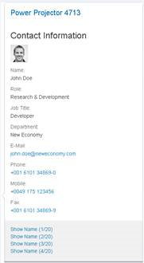
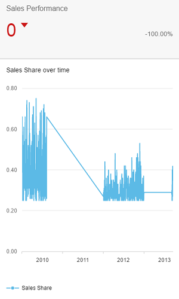

<!-- loiofbab50ef7e414b3e95a8c7a294540464 -->

# What's New in SAPUI5 1.40

With this release SAPUI5 is upgraded from version 1.38 to 1.40.

****

<table>
<tr>
<th valign="top">

Version

</th>
<th valign="top">

Type

</th>
<th valign="top">

Category

</th>
<th valign="top">

Title

</th>
<th valign="top">

Description

</th>
<th valign="top">

Action

</th>
<th valign="top">

Available as of

</th>
</tr>
<tr>
<td valign="top">

1.40 

</td>
<td valign="top">

New 

</td>
<td valign="top">

Announcement 

</td>
<td valign="top">

**New Belize Theme \(SAP Fiori 2.0 Design\)** 

</td>
<td valign="top">

**New Belize Theme \(SAP Fiori 2.0 Design\)**

The SAP Fiori 2.0 design is now supported and the corresponding theme **Belize** \(`sap_belize`\) has been introduced. The Belize theme replaces Blue Crystal \(`sap_bluecrystal`\) as the default theme. Blue Crystal is only supported until version 1.38.

> ### Caution:  
> The Belize theme does not support deprecated libraries such as `sap.ui.commons`, `sap.makit`, or `sap.ui.ux3` \(see [Deprecated Themes and Libraries](../02_Read-Me-First/deprecated-themes-and-libraries-a87ca84.md)\).
> 
> Custom themes based on `sap_bluecrystal` are no longer supported with 1.40 or higher. Furthermore, custom themes cannot be converted to Belize automatically, you will have to adapt them manually.
> 
> Belize does not support the same set of theme parameters as Blue Crystal. If you use custom themes or custom controls, check whether all parameters you use are still supported.

> ### Note:  
> Sorry! Many of the examples, tutorials, and screenshots in this documentation still use Blue Crystal \(`sap_bluecrystal`\). Since there are so many, we simply could not manage to update those. Please keep in mind that you should use Belize \(`sap_belize`\) instead.

New•Announcement•Info Only•1.40

</td>
<td valign="top">

Info Only

</td>
<td valign="top">

2016-08-24

</td>
</tr>
<tr>
<td valign="top">

1.40 

</td>
<td valign="top">

Deleted 

</td>
<td valign="top">

Announcement 

</td>
<td valign="top">

**Older jQuery Versions Removed** 

</td>
<td valign="top">

**Older jQuery Versions Removed**

As of this version, SAPUI5 only contains one version of jQuery \(the current version is 2.2.3\). This standard version is always used when no other jQuery version is included in the bootstrap of an app. If you need a specific jQuery version for your app, add and load it explicitly as described in [noJQuery Variant for Bootstrapping](../04_Essentials/nojquery-variant-for-bootstrapping-91f1dd0.md). Check the console for the related warning message if you are unsure which version you are using.

Deleted•Announcement•Info Only•1.40

</td>
<td valign="top">

Info Only 

</td>
<td valign="top">

2016-08-24

</td>
</tr>
<tr>
<td valign="top">

1.40 

</td>
<td valign="top">

New 

</td>
<td valign="top">

Feature 

</td>
<td valign="top">

**XML View Cache** 

</td>
<td valign="top">

**XML View Cache**

You can use a caching mechanism to speed up processing times of XML views that make heavy use of the preprocessor feature. To make sure that the cache always contains the latest view data, invalidate the cache whenever the data that is needed for preprocessing changes. When the cache is invalidated, all resources are processed again and the cache gets filled with new data. For more information, see [XML View Cache](../04_Essentials/xml-view-cache-3d85d5e.md).

Parts of this feature are currently still experimental! For more information, see [API Reference: `sap.ui.xmlview`](https://ui5.sap.com/#/api/sap.ui/methods/sap.ui.xmlview).

New•Feature•Info Only•1.40

</td>
<td valign="top">

Info Only 

</td>
<td valign="top">

2016-08-24

</td>
</tr>
<tr>
<td valign="top">

1.40 

</td>
<td valign="top">

New 

</td>
<td valign="top">

Control 

</td>
<td valign="top">

**Visual Interaction toolkit \(`sap.ui.vk` library\)** 

</td>
<td valign="top">

**Visual Interaction toolkit \(`sap.ui.vk` library\)**

New controls for the **Visual Interaction toolkit \(`sap.ui.vk` library\)**:

-   Redlining controls: A number of controls have been added to the `sap.ui.vk.library` which allow you to create and edit basic redlining in 2D images or 3D models. These controls are:

    -   `sap.ui.vk.RedlineDesign`

    -   `sap.ui.vk.RedlineElement`

    -   `sap.ui.vk.RedlineElementEllipse`

    -   `sap.ui.vk.RedlineElementFreehand`

    -   `sap.ui.vk.RedlineElementRectangle`

    -   `sap.ui.vk.RedlineSurface`

For more information, see the [API Reference](https://ui5.sap.com/#/api/sap.ui.vk).

-   `sap.ui.vk.DecryptionHandler`: This control handles the decryption of encrypted models using third-party decryption algorithms. For more information, see the [API Reference](https://ui5.sap.com/#/api/sap.ui.vk.DecryptionHandler) in the Demo Kit. 

New•Control•Info Only•1.40

</td>
<td valign="top">

Info Only 

</td>
<td valign="top">

2016-08-24

</td>
</tr>
<tr>
<td valign="top">

1.40 

</td>
<td valign="top">

Changed 

</td>
<td valign="top">

Feature 

</td>
<td valign="top">

**SAPUI5 OData V4 Model** 

</td>
<td valign="top">

**SAPUI5 OData V4 Model**

The second version of the SAPUI5 OData V4 model introduces the following features:

-   Server-side sorting and filtering integrated in the SAPUI5 programming model

-   Reset changes functionality for batch groups

-   List bindings and context bindings with relative paths can read their own data

-   Context objects as an API

-   Support for contained entities

> ### Restriction:  
> Due to the limited feature scope of this version of the SAPUI5 OData V4 model, check that all required features are in place before developing applications. Double check the detailed documentation of the features, as certain parts of a feature may be missing although you might expect these parts as given. While we aimed at being compatible with existing controls, some controls might not work due to small incompatibilities compared to `sap.ui.model.odata.(v2.)ODataModel`, or due to missing features in the model \(like tree binding\). The interface for applications has been changed for easier and more efficient use of the model. For a summary of these changes, see [Changes Compared to OData V2 Model](../04_Essentials/changes-compared-to-odata-v2-model-abd4d7c.md).

For more information, see [OData V4 Model](../04_Essentials/odata-v4-model-5de13cf.md), the [API Reference](https://ui5.sap.com/#/api/sap.ui.model.odata.v4), and the [Samples](https://ui5.sap.com/#/entity/sap.ui.model.odata.v4.ODataModel).

Changed•Feature•Info Only•1.40

</td>
<td valign="top">

Info Only 

</td>
<td valign="top">

2016-08-24

</td>
</tr>
<tr>
<td valign="top">

1.40 

</td>
<td valign="top">

Changed 

</td>
<td valign="top">

Control 

</td>
<td valign="top">

**`sap.m.GenericTile`** 

</td>
<td valign="top">

**`sap.m.GenericTile`**

The `GenericTile` control can be implemented as slide tile. The animated content of the slide tile now includes a navigation option to pause the slide show or to navigate forward or backward to the slide. For more information, see the [API Reference](https://ui5.sap.com/#/api/sap.m.GenericTile), and the [Sample](https://ui5.sap.com/#/entity/sap.m.SlideTile/sample/sap.m.sample.SlideTile).

Changed•Control•Info Only•1.40

</td>
<td valign="top">

Info Only 

</td>
<td valign="top">

2016-08-24

</td>
</tr>
<tr>
<td valign="top">

1.40 

</td>
<td valign="top">

Changed 

</td>
<td valign="top">

Control 

</td>
<td valign="top">

**`sap.m.IconTabHeaderMode`** 

</td>
<td valign="top">

**`sap.m.IconTabHeaderMode`**

A new `IconTabBar` property, `headerMode`, has been introduced. It accepts `sap.m.IconTabHeaderMode.Standard` and `sap.m.IconTabHeaderMode.Inline` values. Inline mode forces the tab text and item number to be on the same row. For more information, see the [API Reference](https://ui5.sap.com/#/api/sap.m.IconTabHeaderMode), and the [Sample](https://ui5.sap.com/#/entity/sap.m.IconTabBar/sample/sap.m.sample.IconTabBarInlineMode).

Changed•Control•Info Only•1.40

</td>
<td valign="top">

Info Only 

</td>
<td valign="top">

2016-08-24

</td>
</tr>
<tr>
<td valign="top">

1.40 

</td>
<td valign="top">

Changed 

</td>
<td valign="top">

Control 

</td>
<td valign="top">

**`sap.m.Page`** 

</td>
<td valign="top">

**`sap.m.Page`**

The `Page` control now offers a floating footer. This new feature helps unify the look-and-feel of page controls and also improves the visibility of the actions located in the footer. The floating footer can be switched on with the `toggleFooter` property. For more information, see the [API Reference](https://ui5.sap.com/#/api/sap.m.Page/methods/setFloatingFooter), and the [Sample](https://ui5.sap.com/#/entity/sap.m.Page/sample/sap.m.sample.PageFloatingFooter).

Changed•Control•Info Only•1.40

</td>
<td valign="top">

Info Only 

</td>
<td valign="top">

2016-08-24

</td>
</tr>
<tr>
<td valign="top">

1.40 

</td>
<td valign="top">

Changed 

</td>
<td valign="top">

Control 

</td>
<td valign="top">

**`sap.m.OverflowToolbar`** 

</td>
<td valign="top">

**`sap.m.OverflowToolbar`**

-   `sap.ui.comp.smartfield.SmartField` can now overflow to improve usability on smaller screens.

-   The overflow menu is now configurable to remain open if the selected element triggers `sap.m.ActionSheet` or `sap.m.Popover`.

Changed•Control•Info Only•1.40

</td>
<td valign="top">

Info Only 

</td>
<td valign="top">

2016-08-24

</td>
</tr>
<tr>
<td valign="top">

1.40 

</td>
<td valign="top">

Changed 

</td>
<td valign="top">

Control 

</td>
<td valign="top">

**`sap.m.RangeSlider`** 

</td>
<td valign="top">

**`sap.m.RangeSlider`**

-   The tooltips above the handles of the `RangeSlider` can be used to define values for the slider. This eases the interaction with the control and helps users to enter precise values. You can enable this by setting the `inputsAsTooltips` property. For more information, see the [API Reference](https://ui5.sap.com/#/api/sap.m.RangeSlider/methods/setInputsAsTooltips).

-   You can now move the entire selected range. Selecting and holding the range line moves the whole range. For more information, see the [Sample](https://ui5.sap.com/#/entity/sap.m.RangeSlider/sample/sap.m.sample.RangeSlider).

Changed•Control•Info Only•1.40

</td>
<td valign="top">

Info Only 

</td>
<td valign="top">

2016-08-24

</td>
</tr>
<tr>
<td valign="top">

1.40 

</td>
<td valign="top">

Changed 

</td>
<td valign="top">

Control 

</td>
<td valign="top">

**`sap.m.Text`** 

</td>
<td valign="top">

**`sap.m.Text`**

Line breaks \(`\r\n`, `\n\r`, `\r`, `\n`\) are always visualized now. You can disable this by setting the wrapping property to `false`. For more information, see the [API Reference](https://ui5.sap.com/#/api/sap.m.Text/methods/setWrapping).

Changed•Control•Info Only•1.40

</td>
<td valign="top">

Info Only 

</td>
<td valign="top">

2016-08-24

</td>
</tr>
<tr>
<td valign="top">

1.40 

</td>
<td valign="top">

Changed 

</td>
<td valign="top">

Control 

</td>
<td valign="top">

**`sap.m.TimePicker`** 

</td>
<td valign="top">

**`sap.m.TimePicker`**

The `TimePicker` control now has configurable step precision for minutes and seconds. For more information, see the [API Reference](https://ui5.sap.com/#/api/sap.m.TimePicker).

Changed•Control•Info Only•1.40

</td>
<td valign="top">

Info Only 

</td>
<td valign="top">

2016-08-24

</td>
</tr>
<tr>
<td valign="top">

1.40 

</td>
<td valign="top">

Changed 

</td>
<td valign="top">

Control 

</td>
<td valign="top">

**`sap.suite.ui.commons.ChartContainer`** 

</td>
<td valign="top">

**`sap.suite.ui.commons.ChartContainer`**

An application can set its own toolbar inside a `ChartContainer` control. If no custom toolbar has been configured, the control behaves as before and provides only the embedded buttons. If a custom toolbar has been configured, it is visible next to the embedded buttons that are still present and integrated using a placeholder. For more information, see the [API Reference](https://ui5.sap.com/#/api/sap.suite.ui.commons.ChartContainer) and the [Samples](https://ui5.sap.com/#/entity/sap.ui.comp.navpopover.SmartLink).

Changed•Control•Info Only•1.40

</td>
<td valign="top">

Info Only 

</td>
<td valign="top">

2016-08-24

</td>
</tr>
<tr>
<td valign="top">

1.40 

</td>
<td valign="top">

Changed 

</td>
<td valign="top">

Control 

</td>
<td valign="top">

**`sap.ui.comp.navpopover.NavigationPopover`** 

</td>
<td valign="top">

**`sap.ui.comp.navpopover.NavigationPopover`**

The `NavigationPopover` control has been redesigned and now has a fresh new look. The control now supports a responsive design and works on mobile devices. For more information, see the [API Reference](https://ui5.sap.com/#/api/sap.ui.comp.navpopover.SmartLink) and the [Samples](https://ui5.sap.com/#/entity/sap.ui.comp.navpopover.SmartLink).

Changed•Control•Info Only•1.40

</td>
<td valign="top">

Info Only 

</td>
<td valign="top">

2016-08-24

</td>
</tr>
<tr>
<td valign="top">

1.40 

</td>
<td valign="top">

Changed 

</td>
<td valign="top">

Control 

</td>
<td valign="top">

**`sap.ui.comp.navpopover.SmartLink`** 

</td>
<td valign="top">

**`sap.ui.comp.navpopover.SmartLink`**

A new property `contactAnnotationPath` allows you to show contact information in the popover of the `SmartLink` control if the OData service contains the `com.sap.vocabularies.Communication.v1.Contact` annotation.

Changed•Control•Info Only•1.40

</td>
<td valign="top">

Info Only 

</td>
<td valign="top">

2016-08-24

</td>
</tr>
<tr>
<td valign="top">

1.40 

</td>
<td valign="top">

Changed 

</td>
<td valign="top">

Control 

</td>
<td valign="top">

**`sap.ui.comp.smartchart.SmartChart`** 

</td>
<td valign="top">

**`sap.ui.comp.smartchart.SmartChart`**

The `SmartChart` control now provides a download function by offering the *Download Chart* button in the toolbar. This function is disabled by default and can be enabled by setting the `showDownloadButton` property to `true`. Clicking this button downloads a picture, in PNG format, of the section of the chart that is currently visible.

> ### Note:  
> In Microsoft Internet Explorer, only SVG formats can be downloaded. Here the user is notified in a notification bar at the bottom of the page that allows them to display or download the chart.

For more information, see , the [API Reference](https://ui5.sap.com/#/api/sap.ui.comp.smartchart.SmartChart). 

Changed•Control•Info Only•1.40

</td>
<td valign="top">

Info Only 

</td>
<td valign="top">

2016-08-24

</td>
</tr>
<tr>
<td valign="top">

1.40 

</td>
<td valign="top">

Changed 

</td>
<td valign="top">

Control 

</td>
<td valign="top">

**`sap.ui.comp.smartchart.SmartChart / sap.ui.comp.smarttable.SmartTable`** 

</td>
<td valign="top">

**`sap.ui.comp.smartchart.SmartChart / sap.ui.comp.smarttable.SmartTable`**

The `SmartChart` and `SmartTable` controls can now handle custom qualifiers for the `PresentationVariant` annotation and, if relevant, the `LineItem` annotation using `customData`.

Like before, the `SmartTable` control first checks for a `PresentationVariant` annotation or rather a default `LineItem` in the presentation variant visualizations, and, if none is found, it checks for a default `LineItem` annotation in the entity itself.

Changed•Control•Info Only•1.40

</td>
<td valign="top">

Info Only 

</td>
<td valign="top">

2016-08-24

</td>
</tr>
<tr>
<td valign="top">

1.40 

</td>
<td valign="top">

Changed 

</td>
<td valign="top">

Control 

</td>
<td valign="top">

**`sap.ui.core.format.NumberFormat`** 

</td>
<td valign="top">

**`sap.ui.core.format.NumberFormat`**

You can now use the `shortRefNumber` option to calculate all numbers in one screen, especially for charts, based on the same scaling factor. With the `showScale` option, you can show or hide the scaling factor in the formatted number. The scaling takes the current locale into account.For more information, see the [API Reference](https://ui5.sap.com/#/api/sap.ui.core.format.NumberFormat).

Changed•Control•Info Only•1.40

</td>
<td valign="top">

Info Only 

</td>
<td valign="top">

2016-08-24

</td>
</tr>
<tr>
<td valign="top">

1.40 

</td>
<td valign="top">

Changed 

</td>
<td valign="top">

Control 

</td>
<td valign="top">

**Visual Interaction toolkit \(`sap.ui.vk library`\)** 

</td>
<td valign="top">

**Visual Interaction toolkit \(`sap.ui.vk library`\)**

-   The library now includes support for the SAP 3D Visual Enterprise 9.0 VDS4 file format.

-   `sap.ui.vk.Loco`: `Loco` control has been updated to handle gestures for creating and editing redlining objects. For more information, see the [API Reference](https://ui5.sap.com/#/api/sap.ui.vk.Loco).

Changed•Control•Info Only•1.40

</td>
<td valign="top">

Info Only 

</td>
<td valign="top">

2016-08-24

</td>
</tr>
<tr>
<td valign="top">

1.40 

</td>
<td valign="top">

Changed 

</td>
<td valign="top">

SAP Fiori Elements 

</td>
<td valign="top">

**SAP Fiori Еlements** 

</td>
<td valign="top">

**SAP Fiori Еlements**

The smart templates \(list report and object page templates\) and overview pages will now be collectively known as SAP Fiori elements. The documentation has been updated to reflect this change, and the term smart templates is no longer used to refer to the list report and object page templates. Note that the tile in SAP Web IDE is currently still labeled *Smart Template Application*.

**List Report and Object Page**

-   **General Features**

    -   **External navigation**: You can now enable intent-based navigation from the create action in the list report and the edit action on the object page to a different app. This feature can be used to delegate these actions to another, for example non-SAP Fiori, app.

    -   **Belize theme**: The list report and object page now support the new Belize theme visual design for SAP Fiori apps.

    -   **Determining actions**: You can now add determining actions to the footer of the list report or object page views. Currently, two types of determining actions are supported:

        -   Actions that trigger a back-end call through the OData service

        -   Actions that trigger intent-based navigation

-   **List Report View**

    -   **Disable the delete action**: You can now enable or disable the delete action on the list report based on certain conditions specified in the back-end system. For example, you may wish to disable deletion for a sales order that has already been paid.

    -   **Improved error and message handling**: Various 5xx / 4xx HTTP error codes related to system unavailability, authorization, and authentication are now handled in the list report. Meaningful and appropriate error messages are displayed, enhancing the usability of the application.

    -   **Dynamic page**: The dynamic page with snapping header and floating tool bar is now available for the list report.

-   **Object Page View**

    -   **Hide the edit and delete actions**: You can now display or hide the edit action and delete action on the object page based on certain conditions that are specified in your back-end system. For example, you may wish to hide the *Edit* button for a sales order that has already been paid.

    -   **Micro chart**: You can now add micro charts to a facet within the header area in the object page. Currently, the object page template supports bullet and area micro charts.

    -   **Progress and rating indicator**: You can now add progress and rating indicators to a header facet on the object page.

**Overview Page**

Overview pages have been enhanced with the following features:

-   **View switch in analytic cards**: Multiple individual cards can now be combined and displayed within a single card via the view switch feature. The switch is enabled from a dropdown menu below the header area.

-   **Semantic coloring based on threshold values**: With this feature, column chart cards can be colored semantically based on threshold values. The threshold values come from data point annotation that is associated with the measure used in the analytic card.

-   You can now create the following cards:

    <table>
    <tr>
    <th valign="top">

    Time Series Chart Card
    
    </th>
    <th valign="top">

    Combination Chart Card
    
    </th>
    <th valign="top">

    Scatter Chart Card
    
    </th>
    </tr>
    <tr>
    <td valign="top">
    
    You can now create charts that use time as an axis category.
    
    </td>
    <td valign="top">
    
    With a combination chart card, you can display more than one measure; the first measure gets displayed in a column format and the subsequent measure is displayed as lines within the chart.
    
    </td>
    <td valign="top">
    
    With a scatter chart card, you can visualize the distribution of data points over two measures.
    
    </td>
    </tr>
    <tr>
    <td valign="top">
    
    
    
    </td>
    <td valign="top">
    
    
    
    </td>
    <td valign="top">
    
    
    
    </td>
    </tr>
    </table>
    
-   **Configuration chart navigation mode**: You can now configure the chart mode so that by clicking on a data point in the chart area of an analytic card you can see the name and value of the selected dimension.

-   **Chart title**: Use the annotation term `UI.Chart` to display a chart title within the chart area of an analytic card.

Changed•SAP Fiori Elements•Info Only•1.40

</td>
<td valign="top">

Info Only 

</td>
<td valign="top">

2016-08-24

</td>
</tr>
<tr>
<td valign="top">

1.40 

</td>
<td valign="top">

Changed 

</td>
<td valign="top">

Analysis Path Framework \(APF\) 

</td>
<td valign="top">

**Analysis Path Framework \(APF\)** 

</td>
<td valign="top">

**Analysis Path Framework \(APF\)**

**APF for SAP S/4HANA Cloud \(New\)**

The APF Configuration Modeler app, as well as the generic APF runtime app, are now also available for SAP S/4HANA Cloud. This includes transporting APF content using the Adaptation Transport Organizer \(ATO\).

**SAP Smart Business Design Time Integration in SAP S/4HANA \(New\)**

In SAP S/4HANA, APF is now available as a drill-down option in the SAP Smart Business KPI tile configuration. This helps to conveniently configure a KPI tile for an APF-based app. For more information, see [Configuring the SAP Smart Business KPI Tile](../07_APF/configuring-the-sap-smart-business-kpi-tile-374364e.md).

**Default Values in Filter Configuration \(Changed\)**

When you configure a filter, you can now specify that no values are selected by default at runtime. This option can improve the performance for filters that are optional, have a lot of values, and support multiple selections. For more information, see [Individually Configured Filters](../07_APF/individually-configured-filters-f8c73e1.md).

Changed•Analysis Path Framework \(APF\)•Info Only•1.40

</td>
<td valign="top">

Info Only 

</td>
<td valign="top">

2016-08-24

</td>
</tr>
<tr>
<td valign="top">

1.40 

</td>
<td valign="top">

Changed 

</td>
<td valign="top">

User Documentation 

</td>
<td valign="top">

**Documentation Structure** 

</td>
<td valign="top">

**Documentation Structure**

Since the *Control-specific Information* was not easy to find, we decided to move the content to the new section *More About Controls* on top level of the structure \(see [More About Controls](../10_More_About_Controls/more-about-controls-3ec6808.md)\).

The documentation for Analysis Path Framework that has been located at the end of the documentation structure can now be found under *Developing Apps with Analysis Path Framework \(APF\)* \(see [Developing Apps with Analysis Path Framework \(APF\)](../07_APF/developing-apps-with-analysis-path-framework-apf-1c457c5.md)\).

Changed•User Documentation•Info Only•1.40

</td>
<td valign="top">

Info Only 

</td>
<td valign="top">

2016-08-24

</td>
</tr>
</table>

**Related Information**  

[What's New in SAPUI5 1.120](what-s-new-in-sapui5-1-120-2359b63.md "With this release SAPUI5 is upgraded from version 1.119 to 1.120.")

[What's New in SAPUI5 1.119](what-s-new-in-sapui5-1-119-0b1903a.md "With this release SAPUI5 is upgraded from version 1.118 to 1.119.")

[What's New in SAPUI5 1.118](what-s-new-in-sapui5-1-118-3eecbde.md "With this release SAPUI5 is upgraded from version 1.117 to 1.118.")

[What's New in SAPUI5 1.117](what-s-new-in-sapui5-1-117-029d3b4.md "With this release SAPUI5 is upgraded from version 1.116 to 1.117.")

[What's New in SAPUI5 1.116](what-s-new-in-sapui5-1-116-ebd6f34.md "With this release SAPUI5 is upgraded from version 1.115 to 1.116.")

[What's New in SAPUI5 1.115](what-s-new-in-sapui5-1-115-409fde8.md "With this release SAPUI5 is upgraded from version 1.114 to 1.115.")

[What's New in SAPUI5 1.114](what-s-new-in-sapui5-1-114-890fce1.md "With this release SAPUI5 is upgraded from version 1.113 to 1.114.")

[What's New in SAPUI5 1.113](what-s-new-in-sapui5-1-113-a9553fe.md "With this release SAPUI5 is upgraded from version 1.112 to 1.113.")

[What's New in SAPUI5 1.112](what-s-new-in-sapui5-1-112-34afc69.md "With this release SAPUI5 is upgraded from version 1.111 to 1.112.")

[What's New in SAPUI5 1.111](what-s-new-in-sapui5-1-111-7a67837.md "With this release SAPUI5 is upgraded from version 1.110 to 1.111.")

[What's New in SAPUI5 1.110](what-s-new-in-sapui5-1-110-71a855c.md "With this release SAPUI5 is upgraded from version 1.109 to 1.110.")

[What's New in SAPUI5 1.109](what-s-new-in-sapui5-1-109-3264bd2.md "With this release SAPUI5 is upgraded from version 1.108 to 1.109.")

[What's New in SAPUI5 1.108](what-s-new-in-sapui5-1-108-66e33f0.md "With this release SAPUI5 is upgraded from version 1.107 to 1.108.")

[What's New in SAPUI5 1.107](what-s-new-in-sapui5-1-107-d4ff916.md "With this release SAPUI5 is upgraded from version 1.106 to 1.107.")

[What's New in SAPUI5 1.106](what-s-new-in-sapui5-1-106-5b497b0.md "With this release SAPUI5 is upgraded from version 1.105 to 1.106.")

[What's New in SAPUI5 1.105](what-s-new-in-sapui5-1-105-4d6c00e.md "With this release SAPUI5 is upgraded from version 1.104 to 1.105.")

[What's New in SAPUI5 1.104](what-s-new-in-sapui5-1-104-69e567c.md "With this release SAPUI5 is upgraded from version 1.103 to 1.104.")

[What's New in SAPUI5 1.103](what-s-new-in-sapui5-1-103-0e98c76.md "With this release SAPUI5 is upgraded from version 1.102 to 1.103.")

[What's New in SAPUI5 1.102](what-s-new-in-sapui5-1-102-f038c99.md "With this release SAPUI5 is upgraded from version 1.101 to 1.102.")

[What's New in SAPUI5 1.101](what-s-new-in-sapui5-1-101-7733b00.md "With this release SAPUI5 is upgraded from version 1.100 to 1.101.")

[What's New in SAPUI5 1.100](what-s-new-in-sapui5-1-100-27dec1d.md "With this release SAPUI5 is upgraded from version 1.99 to 1.100.")

[What's New in SAPUI5 1.99](what-s-new-in-sapui5-1-99-4f35848.md "With this release SAPUI5 is upgraded from version 1.98 to 1.99.")

[What's New in SAPUI5 1.98](what-s-new-in-sapui5-1-98-d9f16f2.md "With this release SAPUI5 is upgraded from version 1.97 to 1.98.")

[What's New in SAPUI5 1.97](what-s-new-in-sapui5-1-97-fa0e282.md "With this release SAPUI5 is upgraded from version 1.96 to 1.97.")

[What's New in SAPUI5 1.96](what-s-new-in-sapui5-1-96-7a9269f.md "With this release SAPUI5 is upgraded from version 1.95 to 1.96.")

[What's New in SAPUI5 1.95](what-s-new-in-sapui5-1-95-a1aea67.md "With this release SAPUI5 is upgraded from version 1.94 to 1.95.")

[What's New in SAPUI5 1.94](what-s-new-in-sapui5-1-94-c40f1e6.md "With this release SAPUI5 is upgraded from version 1.93 to 1.94.")

[What's New in SAPUI5 1.93](what-s-new-in-sapui5-1-93-f273340.md "With this release SAPUI5 is upgraded from version 1.92 to 1.93.")

[What's New in SAPUI5 1.92](what-s-new-in-sapui5-1-92-1ef345d.md "With this release SAPUI5 is upgraded from version 1.91 to 1.92.")

[What's New in SAPUI5 1.91](what-s-new-in-sapui5-1-91-0a2bd79.md "With this release SAPUI5 is upgraded from version 1.90 to 1.91.")

[What's New in SAPUI5 1.90](what-s-new-in-sapui5-1-90-91c10c2.md "With this release SAPUI5 is upgraded from version 1.89 to 1.90.")

[What's New in SAPUI5 1.89](what-s-new-in-sapui5-1-89-e56cddc.md "With this release SAPUI5 is upgraded from version 1.88 to 1.89.")

[What's New in SAPUI5 1.88](what-s-new-in-sapui5-1-88-e15a206.md "With this release SAPUI5 is upgraded from version 1.87 to 1.88.")

[What's New in SAPUI5 1.87](what-s-new-in-sapui5-1-87-b506da7.md "With this release SAPUI5 is upgraded from version 1.86 to 1.87.")

[What's New in SAPUI5 1.86](what-s-new-in-sapui5-1-86-4c1c959.md "With this release SAPUI5 is upgraded from version 1.85 to 1.86.")

[What's New in SAPUI5 1.85](what-s-new-in-sapui5-1-85-1d18eb5.md "With this release SAPUI5 is upgraded from version 1.84 to 1.85.")

[What's New in SAPUI5 1.84](what-s-new-in-sapui5-1-84-dc76640.md "With this release SAPUI5 is upgraded from version 1.82 to 1.84.")

[What's New in SAPUI5 1.82](what-s-new-in-sapui5-1-82-3a8dd13.md "With this release SAPUI5 is upgraded from version 1.81 to 1.82.")

[What's New in SAPUI5 1.81](what-s-new-in-sapui5-1-81-f5e2a21.md "With this release SAPUI5 is upgraded from version 1.80 to 1.81.")

[What's New in SAPUI5 1.80](what-s-new-in-sapui5-1-80-8cee506.md "With this release SAPUI5 is upgraded from version 1.79 to 1.80.")

[What's New in SAPUI5 1.79](what-s-new-in-sapui5-1-79-99c4cdc.md "With this release SAPUI5 is upgraded from version 1.78 to 1.79.")

[What's New in SAPUI5 1.78](what-s-new-in-sapui5-1-78-f09b63e.md "With this release SAPUI5 is upgraded from version 1.77 to 1.78.")

[What's New in SAPUI5 1.77](what-s-new-in-sapui5-1-77-c46b439.md "With this release SAPUI5 is upgraded from version 1.76 to 1.77.")

[What's New in SAPUI5 1.76](what-s-new-in-sapui5-1-76-aad03b5.md "With this release SAPUI5 is upgraded from version 1.75 to 1.76.")

[What's New in SAPUI5 1.75](what-s-new-in-sapui5-1-75-5cbb62d.md "With this release SAPUI5 is upgraded from version 1.74 to 1.75.")

[What's New in SAPUI5 1.74](what-s-new-in-sapui5-1-74-c22208a.md "With this release SAPUI5 is upgraded from version 1.73 to 1.74.")

[What's New in SAPUI5 1.73](what-s-new-in-sapui5-1-73-231dd13.md "With this release SAPUI5 is upgraded from version 1.72 to 1.73.")

[What's New in SAPUI5 1.72](what-s-new-in-sapui5-1-72-521cad9.md "With this release SAPUI5 is upgraded from version 1.71 to 1.72.")

[What's New in SAPUI5 1.71](what-s-new-in-sapui5-1-71-a93a6a3.md "With this release SAPUI5 is upgraded from version 1.70 to 1.71.")

[What's New in SAPUI5 1.70](what-s-new-in-sapui5-1-70-f073d69.md "With this release SAPUI5 is upgraded from version 1.69 to 1.70.")

[What's New in SAPUI5 1.69](what-s-new-in-sapui5-1-69-89a18bd.md "With this release SAPUI5 is upgraded from version 1.68 to 1.69.")

[What's New in SAPUI5 1.68](what-s-new-in-sapui5-1-68-f94bf93.md "With this release SAPUI5 is upgraded from version 1.67 to 1.68.")

[What's New in SAPUI5 1.67](what-s-new-in-sapui5-1-67-a6b1472.md "With this release SAPUI5 is upgraded from version 1.66 to 1.67.")

[What's New in SAPUI5 1.66](what-s-new-in-sapui5-1-66-c9896e9.md "With this release SAPUI5 is upgraded from version 1.65 to 1.66.")

[What's New in SAPUI5 1.65](what-s-new-in-sapui5-1-65-0f5acfd.md "With this release SAPUI5 is upgraded from version 1.64 to 1.65.")

[What's New in SAPUI5 1.64](what-s-new-in-sapui5-1-64-0e30822.md "With this release SAPUI5 is upgraded from version 1.63 to 1.64.")

[What's New in SAPUI5 1.63](what-s-new-in-sapui5-1-63-e8d9da7.md "With this release SAPUI5 is upgraded from version 1.62 to 1.63.")

[What's New in SAPUI5 1.62](what-s-new-in-sapui5-1-62-771f4d5.md "With this release SAPUI5 is upgraded from version 1.61 to 1.62.")

[What's New in SAPUI5 1.61](what-s-new-in-sapui5-1-61-d991552.md "With this release SAPUI5 is upgraded from version 1.60 to 1.61.")

[What's New in SAPUI5 1.60](what-s-new-in-sapui5-1-60-5a0e1f7.md "With this release SAPUI5 is upgraded from version 1.58 to 1.60.")

[What's New in SAPUI5 1.58](what-s-new-in-sapui5-1-58-7c927aa.md "With this release SAPUI5 is upgraded from version 1.56 to 1.58.")

[What's New in SAPUI5 1.56](what-s-new-in-sapui5-1-56-108b7fd.md "With this release SAPUI5 is upgraded from version 1.54 to 1.56.")

[What's New in SAPUI5 1.54](what-s-new-in-sapui5-1-54-c838330.md "With this release SAPUI5 is upgraded from version 1.52 to 1.54.")

[What's New in SAPUI5 1.52](what-s-new-in-sapui5-1-52-849e1b6.md "With this release SAPUI5 is upgraded from version 1.50 to 1.52.")

[What's New in SAPUI5 1.50](what-s-new-in-sapui5-1-50-759e9f3.md "With this release SAPUI5 is upgraded from version 1.48 to 1.50.")

[What's New in SAPUI5 1.48](what-s-new-in-sapui5-1-48-fa1efac.md "With this release SAPUI5 is upgraded from version 1.46 to 1.48.")

[What's New in SAPUI5 1.46](what-s-new-in-sapui5-1-46-6307539.md "With this release SAPUI5 is upgraded from version 1.44 to 1.46.")

[What's New in SAPUI5 1.44](what-s-new-in-sapui5-1-44-a0cb7a0.md "With this release SAPUI5 is upgraded from version 1.42 to 1.44.")

[What's New in SAPUI5 1.42](what-s-new-in-sapui5-1-42-468b05d.md "With this release SAPUI5 is upgraded from version 1.40 to 1.42.")

[What's New in SAPUI5 1.38](what-s-new-in-sapui5-1-38-f218918.md "With this release SAPUI5 is upgraded from version 1.36 to 1.38.")

