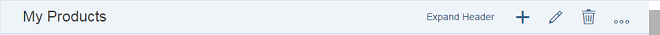
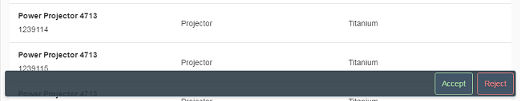
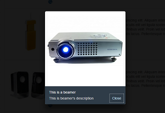
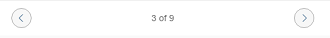
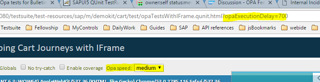

<!-- loio468b05d592344ed5bcbf62c9bace2d6c -->

# What's New in SAPUI5 1.42

With this release SAPUI5 is upgraded from version 1.40 to 1.42.

****


<table>
<tr>
<th valign="top">

Version

</th>
<th valign="top">

Type

</th>
<th valign="top">

Category

</th>
<th valign="top">

Title

</th>
<th valign="top">

Description

</th>
<th valign="top">

Action

</th>
<th valign="top">

Available as of

</th>
</tr>
<tr>
<td valign="top">

1.42 

</td>
<td valign="top">

New 

</td>
<td valign="top">

Control 

</td>
<td valign="top">

**`sap.f.DynamicPage`** 

</td>
<td valign="top">

**`sap.f.DynamicPage`**

This control is an SAP Fiori 2.0 control, designed to support the basic SAP Fiori 2.0 floorplans. You can use this control as a basic layout for an app. It consists of a title, a header, content area, and a floating footer. It offers dynamic behavior when scrolling, where part of the header snaps to the title. It offers additional capabilities, such as expanding or snapping the header when clicking on the title, pinning or unpinning the header so that it always stays expanded, and more.

  
  
**Expanded Mode**


  
  
**Collapsed Mode**



There is an option for displaying a footer as a toolbar with additional actions. The footer is also known as a “floating footer”, as it appears to float above the content of the page. The benefit of the new footer look-and-feel is that it is easily recognized by the end user.



For more information, see the [API Reference](https://ui5.sap.com/#/api/sap.f.DynamicPage) and the [Samples](https://ui5.sap.com/#/entity/sap.f.DynamicPage).

<sub>New•Control•Info Only•1.42</sub>

</td>
<td valign="top">

Info Only

</td>
<td valign="top">

2016-11-11

</td>
</tr>
<tr>
<td valign="top">

1.42 

</td>
<td valign="top">

New 

</td>
<td valign="top">

Announcement 

</td>
<td valign="top">

**Acceleration of SAPUI5 Cloud Deployment** 

</td>
<td valign="top">

**Acceleration of SAPUI5 Cloud Deployment**

We now deploy new versions of SAPUI5 earlier to `https://ui5.sap.com/`. As soon as a new minor version is released, it will also be available there. Check the version overview at [https://ui5.sap.com/versionoverview.html](https://ui5.sap.com/versionoverview.html). To access a specific version, for example, in SAP Web IDE, add the version number to the URL, for example, `https://ui5.sap.com/1.40.11/`. For more information, see [Variant for Bootstrapping from Content Delivery Network](../04_Essentials/variant-for-bootstrapping-from-content-delivery-network-2d3eb2f.md).

> ### Note:  
> The default version \(under `https://ui5.sap.com/`\) will always be the SAPUI5 version that is included in the SAP Business Technology Platform. This may not be the latest version!

<sub>New•Announcement•Info Only•1.42</sub>

</td>
<td valign="top">

Info Only 

</td>
<td valign="top">

2016-11-11

</td>
</tr>
<tr>
<td valign="top">

1.42 

</td>
<td valign="top">

New 

</td>
<td valign="top">

Control 

</td>
<td valign="top">

**`sap.m.LightBox`** 

</td>
<td valign="top">

**`sap.m.LightBox`**

The `LightBox` control is used to display an image in its original size. When the user clicks on a thumbnail, a `LightBox` containing the image opens in a new popup. The popup also contains a title and subtitle. For more information, see the [API Reference](https://ui5.sap.com/#/api/sap.m.LightBox) and the [Samples](https://ui5.sap.com/#/entity/sap.m.LightBox).



<sub>New•Control•Info Only•1.42</sub>

</td>
<td valign="top">

Info Only 

</td>
<td valign="top">

2016-11-11

</td>
</tr>
<tr>
<td valign="top">

1.42 

</td>
<td valign="top">

New 

</td>
<td valign="top">

Control 

</td>
<td valign="top">

**`sap.m.Tree`** 

</td>
<td valign="top">

**`sap.m.Tree`**

The `Tree` control provides a tree structure for displaying data in a hierarchy. Since it extends `sap.m.ListBase`, it provides many of the same features already known from `sap.m.List`. For more information, see the [API Reference](https://ui5.sap.com/#/api/sap.m.Tree) and the [Samples](https://ui5.sap.com/#/entity/sap.m.Tree).

<sub>New•Control•Info Only•1.42</sub>

</td>
<td valign="top">

Info Only 

</td>
<td valign="top">

2016-11-11

</td>
</tr>
<tr>
<td valign="top">

1.42 

</td>
<td valign="top">

New 

</td>
<td valign="top">

Control 

</td>
<td valign="top">

**`sap.ui.comp.smartmicrochart.SmartRadialMicroChart`** 

</td>
<td valign="top">

**`sap.ui.comp.smartmicrochart.SmartRadialMicroChart`**

The `SmartRadialMicroChart` control has been added to the `SmartMicroChart` container in `sap.ui.comp` library. The control analyzes the metadata document of an OData service for the specified entity set and renders the respective `RadialMicroChart` control for its visualization. As in other `SmartMicroCharts`, the `SmartRadialMicroChart` control uses the OData metadata annotations to determine the binding paths and values inside the chart. For more information, see the [API Reference](https://ui5.sap.com/#/api/sap.ui.comp.smartmicrochart.SmartRadialMicroChart) and the [Samples](https://ui5.sap.com/#/entity/sap.ui.comp.smartmicrochart.SmartRadialMicroChart).

<sub>New•Control•Info Only•1.42</sub>

</td>
<td valign="top">

Info Only 

</td>
<td valign="top">

2016-11-11

</td>
</tr>
<tr>
<td valign="top">

1.42 

</td>
<td valign="top">

Changed 

</td>
<td valign="top">

Control 

</td>
<td valign="top">

**`sap.m.Carousel`** 

</td>
<td valign="top">

**`sap.m.Carousel`**

The `Carousel` control has two enhancements.

-   The enumeration `CarouselArrowsPlacement` determines where the arrows will be placed \(on the sides of the content or on the sides of the page indicator\).

-   The page indicator now shows numbers instead of bullets, when the number of items in the `Carousel` is above nine.




For more information, see the [API Reference](https://ui5.sap.com/#/api/sap.m.Carousel/methods/getArrowsPlacement) and the [Sample](https://ui5.sap.com/#/entity/sap.m.Carousel/sample/sap.m.sample.CarouselWithDisplayOptions).

<sub>Changed•Control•Info Only•1.42</sub>

</td>
<td valign="top">

Info Only 

</td>
<td valign="top">

2016-11-11

</td>
</tr>
<tr>
<td valign="top">

1.42 

</td>
<td valign="top">

Changed 

</td>
<td valign="top">

Control 

</td>
<td valign="top">

**`sap.m.Combobox`** 

</td>
<td valign="top">

**`sap.m.Combobox`**

The `Combobox` control now automatically scrolls to the selected element, so that the user sees the element selected in the initial dropdown box, which may not be visible in large dropdown boxes.

<sub>Changed•Control•Info Only•1.42</sub>

</td>
<td valign="top">

Info Only 

</td>
<td valign="top">

2016-11-11

</td>
</tr>
<tr>
<td valign="top">

1.42 

</td>
<td valign="top">

Changed 

</td>
<td valign="top">

Control 

</td>
<td valign="top">

**`sap.m.FeedListItem`** 

</td>
<td valign="top">

**`sap.m.FeedListItem`**

The `FeedListItem` control now incorporates the `sap.m.FormattedText` control that allows HTML-formatted text to be displayed. For more information, see the [API Reference](https://ui5.sap.com/#/api/sap.m.FeedListItem) and the [Samples](https://ui5.sap.com/#/entity/sap.m.FeedListItem).

<sub>Changed•Control•Info Only•1.42</sub>

</td>
<td valign="top">

Info Only 

</td>
<td valign="top">

2016-11-11

</td>
</tr>
<tr>
<td valign="top">

1.42 

</td>
<td valign="top">

Changed 

</td>
<td valign="top">

Control 

</td>
<td valign="top">

**`sap.m.FlexBox`** 

</td>
<td valign="top">

**`sap.m.FlexBox`**

The render type `Bare` has been added to the `FlexBox` control. It allows flex items to be rendered without a wrapping HTML tag. For more information, see the [API Reference](https://ui5.sap.com/#/api/sap.m.FlexRendertype) and the [Sample](https://ui5.sap.com/#/entity/sap.m.FlexBox/sample/sap.m.sample.FlexBoxRenderType).

<sub>Changed•Control•Info Only•1.42</sub>

</td>
<td valign="top">

Info Only 

</td>
<td valign="top">

2016-11-11

</td>
</tr>
<tr>
<td valign="top">

1.42 

</td>
<td valign="top">

Changed 

</td>
<td valign="top">

Control 

</td>
<td valign="top">

**`sap.m.IconTabBar`** 

</td>
<td valign="top">

**`sap.m.IconTabBar`**

The `IconTabBar` control has two enhancements:

-   `headerMode` has a new value called `Inline`. This mode displays the text and the count in one row.

-   `showOverflowSelectList` can be enabled when you have a large number of tabs and cannot display them all at once. When this property is set, all tabs that cannot be shown are added to an overflow list.


For more information, see the API Reference for [sap.m.IconTabHeaderMode](https://ui5.sap.com/#/api/sap.m.IconTabHeaderMode) and [sap.m.IconTabBar.getShowOverflowSelectList](https://ui5.sap.com/#/api/sap.m.IconTabBar/methods/getShowOverflowSelectList), and the samples [Overflow Select List](https://ui5.sap.com/#/entity/sap.m.IconTabBar/sample/sap.m.sample.IconTabBarOverflowSelectList) and [Inline Mode](https://ui5.sap.com/#/entity/sap.m.IconTabBar/sample/sap.m.sample.IconTabBarInlineMode).

<sub>Changed•Control•Info Only•1.42</sub>

</td>
<td valign="top">

Info Only 

</td>
<td valign="top">

2016-11-11

</td>
</tr>
<tr>
<td valign="top">

1.42 

</td>
<td valign="top">

Changed 

</td>
<td valign="top">

Control 

</td>
<td valign="top">

**`sap.m.MultiComboBox`** 

</td>
<td valign="top">

**`sap.m.MultiComboBox`**

We have implemented touch support on mobile devices for the `MultiComboBox` control. The behavior of the control is now aligned with other similar controls such as `Select` and `ComboBox`.

<sub>Changed•Control•Info Only•1.42</sub>

</td>
<td valign="top">

Info Only 

</td>
<td valign="top">

2016-11-11

</td>
</tr>
<tr>
<td valign="top">

1.42 

</td>
<td valign="top">

Changed 

</td>
<td valign="top">

Control 

</td>
<td valign="top">

**`sap.m.Slider / sap.m.RangeSlider`** 

</td>
<td valign="top">

**`sap.m.Slider / sap.m.RangeSlider`**

These controls have two new properties:

-   `inputsAsTooltips` adds an input field above the slider handle. This enables users to directly enter the desired `Slider` value.

-   `showAdvancedTooltip` when enabled, the handle will always display the slider value as a tooltip.


For more information, see the [API Reference](https://ui5.sap.com/#/api/sap.m.Slider/methods/getInputsAsTooltips) and the [Sample](https://ui5.sap.com/#/entity/sap.m.Slider/sample/sap.m.sample.Slider).

<sub>Changed•Control•Info Only•1.42</sub>

</td>
<td valign="top">

Info Only 

</td>
<td valign="top">

2016-11-11

</td>
</tr>
<tr>
<td valign="top">

1.42 

</td>
<td valign="top">

Changed 

</td>
<td valign="top">

Control 

</td>
<td valign="top">

**`sap.m.ObjectListItem / sap.m.ObjectHeader`** 

</td>
<td valign="top">

**`sap.m.ObjectListItem / sap.m.ObjectHeader`**

These controls can now display all markers of type `sap.m.ObjectMarker` with the use of a new `marker` aggregation. The possible values are `Flagged`, `Favorite`, `Locked`, `Draft`, and `Unsaved`. For more information, see the API Reference for [sap.m.ObjectListItem](https://ui5.sap.com/#/api/sap.m.ObjectListItem) and [sap.m.ObjectHeader](https://ui5.sap.com/#/api/sap.m.ObjectHeader), and the samples [Object List Item - Markers Aggregation](https://ui5.sap.com/#/entity/sap.m.ObjectListItem/sample/sap.m.sample.ObjectListItemMarkers) and [Object Header - Markers Aggregation](https://ui5.sap.com/#/entity/sap.m.ObjectHeader/sample/sap.m.sample.ObjectHeaderMarkers).

<sub>Changed•Control•Info Only•1.42</sub>

</td>
<td valign="top">

Info Only 

</td>
<td valign="top">

2016-11-11

</td>
</tr>
<tr>
<td valign="top">

1.42 

</td>
<td valign="top">

Changed 

</td>
<td valign="top">

Control 

</td>
<td valign="top">

**`sap.m.ObjectMarker`** 

</td>
<td valign="top">

With the use of a new `additionalInfo` property, you can now add descriptive text next to the displayed marker, for example *Locked by User*. For more information, see [API Reference](https://ui5.sap.com/#/api/sap.m.ObjectMarker).

<sub>Changed•Control•Info Only•1.42</sub>

</td>
<td valign="top">

Info Only 

</td>
<td valign="top">

2016-11-11

</td>
</tr>
<tr>
<td valign="top">

1.42 

</td>
<td valign="top">

Changed 

</td>
<td valign="top">

Control 

</td>
<td valign="top">

**`sap.m.UploadCollection`** 

</td>
<td valign="top">

**`sap.m.UploadCollection`**

The `UploadCollection` control has the following new properties:

-   `uploadButtonInvisible`: With this new property, you can make the *Upload* button invisible in your application if you want to prevent the user from uploading a file, either in the instant upload or in the upload pending scenario of the `UploadCollection` control.

-   `terminationEnabled`: With this new property, you can make the *Terminate Upload* button invisible in your application if you want to prevent the user from terminating an instant upload in the `UploadCollection` control.


For more information, see the [API Reference](https://ui5.sap.com/#/api/sap.m.UploadCollection) and the [Samples](https://ui5.sap.com/#/entity/sap.m.UploadCollection).

<sub>Changed•Control•Info Only•1.42</sub>

</td>
<td valign="top">

Info Only 

</td>
<td valign="top">

2016-11-11

</td>
</tr>
<tr>
<td valign="top">

1.42 

</td>
<td valign="top">

Changed 

</td>
<td valign="top">

Control 

</td>
<td valign="top">

**`sap.m.ViewSettingsDialog`** 

</td>
<td valign="top">

**`sap.m.ViewSettingsDialog`**

You can now customize the search behavior in the filter details page with the use of the new property `filterSearchOperator` with the possible values `Contains`, `Equals`, and `Starts With`. There is also a new method `setFilterSearchCallback` that can set a custom filter callback if the predefined filters are not sufficient. For more information, see the [API Reference](https://ui5.sap.com/#/api/sap.m.ViewSettingsDialog) and the [Sample](https://ui5.sap.com/#/entity/sap.m.ViewSettingsDialog/sample/sap.m.sample.ViewSettingsDialogCustomFilterDetails).

<sub>Changed•Control•Info Only•1.42</sub>

</td>
<td valign="top">

Info Only 

</td>
<td valign="top">

2016-11-11

</td>
</tr>
<tr>
<td valign="top">

1.42 

</td>
<td valign="top">

Changed 

</td>
<td valign="top">

Control 

</td>
<td valign="top">

**`sap.suite.ui.commons.ProcessFlow`** 

</td>
<td valign="top">

**`sap.suite.ui.commons.ProcessFlow`**

In the `ProcessFlow` control, the new status `Critical` has been implemented. This status can be used when a critical issue occurrsed in the current process. The new status that fulfills this condition is called `Critical` and it is associated with the process flow node. For more information, see the [API Reference](https://ui5.sap.com/#/api/sap.suite.ui.commons.ProcessFlowNodeState) and the [Sample](https://ui5.sap.com/#/entity/sap.suite.ui.commons.ProcessFlow/sample/sap.suite.ui.commons.sample.ProcessFlow).

<sub>Changed•Control•Info Only•1.42</sub>

</td>
<td valign="top">

Info Only 

</td>
<td valign="top">

2016-11-11

</td>
</tr>
<tr>
<td valign="top">

1.42 

</td>
<td valign="top">

Changed 

</td>
<td valign="top">

Control 

</td>
<td valign="top">

**`sap.suite.ui.microchart`** 

</td>
<td valign="top">

**`sap.suite.ui.microchart`**

Tooltip enhancement for all controls in the **`sap.suite.ui.microchart`** library: To get the tooltip to also be visible when micro charts are created from template methods, retrieving and displaying the tooltip is now independent from the method in which the micro chart was created. For more information, see the [API Reference](https://ui5.sap.com/#/api/sap.ui.comp.smartmicrochart.SmartMicroChart) and the [Samples](https://ui5.sap.com/#/entity/sap.ui.comp.smartmicrochart.SmartMicroChart).

<sub>Changed•Control•Info Only•1.42</sub>

</td>
<td valign="top">

Info Only 

</td>
<td valign="top">

2016-11-11

</td>
</tr>
<tr>
<td valign="top">

1.42 

</td>
<td valign="top">

Changed 

</td>
<td valign="top">

Control 

</td>
<td valign="top">

**`sap.suite.ui.microchart.ComparisonMicroChart`** 

</td>
<td valign="top">

**`sap.suite.ui.microchart.ComparisonMicroChart`**

You can now set minimum and maximum values for the `ComparisonMicroChart` control. By setting these values, an application can define a fixed size for the measurement scale to get an optimized representation of the compared values. For more information, see the [API Reference](https://ui5.sap.com/#/api/sap.suite.ui.microchart.ComparisonMicroChartMinMax) and the [Sample](https://ui5.sap.com/#/entity/sap.suite.ui.microchart.ComparisonMicroChart/sample/sap.suite.ui.microchart.sample.ComparisonMicroChartMinMax).

<sub>Changed•Control•Info Only•1.42</sub>

</td>
<td valign="top">

Info Only 

</td>
<td valign="top">

2016-11-11

</td>
</tr>
<tr>
<td valign="top">

1.42 

</td>
<td valign="top">

Changed 

</td>
<td valign="top">

Control 

</td>
<td valign="top">

**`sap.ui.comp.smartfield.SmartField`** 

</td>
<td valign="top">

**`sap.ui.comp.smartfield.SmartField`**

For improved performance, you can now use the `fetchValueListReadOnly` property if you want to prevent the value help from being requested for a read-only `SmartField` control. To use this property, you have to maintain the `com.sap.vocabularies.Common.v1.Text` annotation . For more information, see [sap.ui.comp](../10_More_About_Controls/sap-ui-comp-0cbbeba.md), the [API Reference](https://ui5.sap.com/#/api/sap.ui.comp.smartfield.SmartField), and the [Samples](https://ui5.sap.com/#/entity/sap.ui.comp.smartfield.SmartField).

<sub>Changed•Control•Info Only•1.42</sub>

</td>
<td valign="top">

Info Only 

</td>
<td valign="top">

2016-11-11

</td>
</tr>
<tr>
<td valign="top">

1.42 

</td>
<td valign="top">

Changed 

</td>
<td valign="top">

Control 

</td>
<td valign="top">

**`sap.ui.comp.smartmicrochart.SmartMicroChart`** 

</td>
<td valign="top">

**`sap.ui.comp.smartmicrochart.SmartMicroChart`**

The qualifier for the `UI.Chart` annotation term has been added to the `SmartMicroChart` control to support multiple `UI.Chart` annotations for an OData service. Depending on the qualifiers, you can now separate these multiple annotations and handle the different OData annotations in this control.

<sub>Changed•Control•Info Only•1.42</sub>

</td>
<td valign="top">

Info Only 

</td>
<td valign="top">

2016-11-11

</td>
</tr>
<tr>
<td valign="top">

1.42 

</td>
<td valign="top">

Changed 

</td>
<td valign="top">

Control 

</td>
<td valign="top">

**`sap.ui.layout.BlockLayout`** 

</td>
<td valign="top">

**`sap.ui.layout.BlockLayout`**

The `BlockLayout` control has been updated to comply to the new SAP Fiori 2.0 design. The color schemes for `Mixed`, `Bright`, and `Accent` have been updated to the new design. For more information, see the [Sample](https://ui5.sap.com/#/entity/sap.ui.layout.BlockLayout/sample/sap.ui.layout.sample.BlockLayoutDefault).

<sub>Changed•Control•Info Only•1.42</sub>

</td>
<td valign="top">

Info Only 

</td>
<td valign="top">

2016-11-11

</td>
</tr>
<tr>
<td valign="top">

1.42 

</td>
<td valign="top">

Changed 

</td>
<td valign="top">

Control 

</td>
<td valign="top">

**Visual Interaction toolkit \(`sap.ui.vk` library\)** 

</td>
<td valign="top">

**Visual Interaction toolkit \(`sap.ui.vk` library\)**

Improved controls for the **Visual Interaction toolkit \(`sap.ui.vk` library\)**:

-   The library now includes initial support for "Smart 2D" files \(2D VDS models\).

-   Redlining controls were improved for redlining drawing and rendering. For more information, see [API Reference: `sap.ui.vk`](https://ui5.sap.com/#/api/sap.ui.vk). 

-   `sap.ui.vk.Loco`: The `Loco` control has been updated to improve the handling of redlining gestures. For more information, see [API Reference: `sap.ui.vk.Loco`](https://ui5.sap.com/#/api/sap.ui.vk.Loco).


<sub>Changed•Control•Info Only•1.42</sub>

</td>
<td valign="top">

Info Only 

</td>
<td valign="top">

2016-11-11

</td>
</tr>
<tr>
<td valign="top">

1.42 

</td>
<td valign="top">

Changed 

</td>
<td valign="top">

Control 

</td>
<td valign="top">

**`sap.uxap.ObjectPageLayout`** 

</td>
<td valign="top">

**`sap.uxap.ObjectPageLayout`**

You can set the footer with the footer aggregation and toggle its visibility using the `showFooter` property. The footer is slightly transparent, showing the underlying content and is used to provide additional actions. This aligns the `Object Page` control with the SAP Fiori 2.0 design concepts. For more information, see the [API Reference](https://ui5.sap.com/#/api/sap.uxap.ObjectPageLayout/methods/getFooter) and the [Sample](https://ui5.sap.com/#/entity/sap.uxap.ObjectPageLayout/sample/sap.uxap.sample.ObjectPageOnJSON).

<sub>Changed•Control•Info Only•1.42</sub>

</td>
<td valign="top">

Info Only 

</td>
<td valign="top">

2016-11-11

</td>
</tr>
<tr>
<td valign="top">

1.42 

</td>
<td valign="top">

Changed 

</td>
<td valign="top">

Feature 

</td>
<td valign="top">

**Behavior-Driven Development with Gherkin** 

</td>
<td valign="top">

**Behavior-Driven Development with Gherkin**

SAPUI5 now supports behavior-driven development \(BDD\) with Gherkin. Gherkin allows you to write feature files that get translated into executable regression tests. So you can keep your documentation and specification in sync with the actual implementation in your application. It integrates seamlessly with OPA5 and you can completely reuse your OPA and page objects. You only need to translate an OPA journey to a feature file. For more information, see [Behavior-driven Development with Gherkin](../04_Essentials/behavior-driven-development-with-gherkin-45ac9f1.md), the [API Reference](https://ui5.sap.com/#/api/sap.ui.test.gherkin), and the [Samples](https://ui5.sap.com/#/entity/sap.ui.test.gherkin). 

<sub>Changed•Control•Info Only•1.42</sub>

</td>
<td valign="top">

Info Only 

</td>
<td valign="top">

2016-11-11

</td>
</tr>
<tr>
<td valign="top">

1.42 

</td>
<td valign="top">

Changed 

</td>
<td valign="top">

Feature 

</td>
<td valign="top">

**Enhancements for the SAP Fiori 2.0 Design** 

</td>
<td valign="top">

**Enhancements for the SAP Fiori 2.0 Design**

-   New theme *Belize Deep*: The SAP Fiori 2.0 design now supports a new dark flavor of the Belize theme, called Belize Deep. It can be enabled with parameter `sap_belize_plus`.

-   New library `sap.f`: This library contains new controls built especially for SAP Fiori 2.0, for example`sap.m.DynamicPage`.

-   Floating footer toolbar: The `sap.uxap.ObjectPageLayout` and `sap.m.Page` controls are enhanced with the new floating footer. The new `sap.f.DynamicPage` control comes with this feature by default.


<sub>Changed•Feature•Info Only•1.42</sub>

</td>
<td valign="top">

Info Only 

</td>
<td valign="top">

2016-11-11

</td>
</tr>
<tr>
<td valign="top">

1.42 

</td>
<td valign="top">

Changed 

</td>
<td valign="top">

Feature 

</td>
<td valign="top">

**SAPUI5 OData V4 Model** 

</td>
<td valign="top">

**SAPUI5 OData V4 Model**

The new version of the SAPUI5 OData V4 model introduces the following features:

-   Deleting entries

-   Loading annotation files


> ### Restriction:  
> Due to the limited feature scope of this version of the SAPUI5 OData V4 model, check that all required features are in place before developing applications. Double check the detailed documentation of the features, as certain parts of a feature may be missing although you might expect these parts as given. While we aimed at being compatible with existing controls, some controls might not work due to small incompatibilities compared to `sap.ui.model.odata.(v2.)ODataModel`, or due to missing features in the model \(like tree binding\). The interface for applications has been changed for easier and more efficient use of the model. For a summary of these changes, see [Changes Compared to OData V2 Model](../04_Essentials/changes-compared-to-odata-v2-model-abd4d7c.md).

For more information, see [OData V4 Model](../04_Essentials/odata-v4-model-5de13cf.md), the [API Reference](https://ui5.sap.com/#/api/sap.ui.model.odata.v4), and the [Samples](https://ui5.sap.com/#/entity/sap.ui.model.odata.v4.ODataModel).

<sub>Changed•Feature•Info Only•1.42</sub>

</td>
<td valign="top">

Info Only 

</td>
<td valign="top">

2016-11-11

</td>
</tr>
<tr>
<td valign="top">

1.42 

</td>
<td valign="top">

Changed 

</td>
<td valign="top">

Feature 

</td>
<td valign="top">

**One Page Acceptance Tests \(OPA5\)** 

</td>
<td valign="top">

**One Page Acceptance Tests \(OPA5\)**

-   `waitFor` statements in actions and automatic waiting: When writing custom actions you can now add `waitFor` statements inside the `action` and they will be executed before the `success` callback. This allows you to have complex reuse actions that interact with multiple controls.

    There is a new entry `autoWait` in the `sap.ui.test.Opa.config`.

    ```
    Opa5.extendConfig({
            autoWait: true
        });
    
    ```

    If it is set to `true`, every `waitFor` statement will execute extra checks before executing an `action` or `success` to see if the UI is in a stable state. For example, there is automatic waiting for `XMLHttpRequests` \(request to your server\). OPA will not continue before those requests are done. It also works with a mock server that has a delay. For more information, see [API Reference: `sap.ui.test.Opa5.waitFor`](https://ui5.sap.com/#/api/sap.ui.test.Opa5/methods/waitFor).

-   New matcher `sap.ui.test.matchers.I18NText`: The `I18NText` matcher checks if a control property has the same value as a text from an i18n file. It also checks that the key is in the property file. This allows you to catch all your typos and make your tests independent from the browsers language. For more information, see the [API Reference](https://ui5.sap.com/#/api/sap.ui.test.matchers.I18NText) and the [Samples](https://ui5.sap.com/#/entity/sap.ui.test.matchers.I18NText).

-   Improved troubleshooting: When OPA encounters a timeout, it collects the most recent logs logged under the `sap.ui.test` namespace and puts it in the test's failure message. All parameters of the `waitFor` method are now validated up front to immediately cause the test to fail if there is a typo.

-   Slowing down the execution: You can now use the new URL parameter `paExecutionDelay` to pass on `myOpaTest.qunit.html?opaExecutionDelay=700` to every OPA test. This means there will be a pause for 700 milliseconds before a new `waitFor` statement is executed. It helps when troubleshooting or if you want to watch OPA clicking through your application because it might be too fast to follow. There is also a dropdown list with three predefined values in your QUnit site.

    


<sub>Changed•Feature•Info Only•1.42</sub>

</td>
<td valign="top">

Info Only 

</td>
<td valign="top">

2016-11-11

</td>
</tr>
<tr>
<td valign="top">

1.42 

</td>
<td valign="top">

Changed 

</td>
<td valign="top">

Feature 

</td>
<td valign="top">

**Navigation and Routing** 

</td>
<td valign="top">

**Navigation and Routing**

You can now use the `title` property for targets and a `titleTarget` for routes in the routing configuration to change the displayed title of an app. For more information, see [Using the title Property in Targets](../04_Essentials/using-the-title-property-in-targets-1238d70.md).

<sub>Changed•Feature•Info Only•1.42</sub>

</td>
<td valign="top">

Info Only 

</td>
<td valign="top">

2016-11-11

</td>
</tr>
<tr>
<td valign="top">

1.42 

</td>
<td valign="top">

Changed 

</td>
<td valign="top">

Feature 

</td>
<td valign="top">

**New Icons** 

</td>
<td valign="top">

**New Icons**

We have 10 new icons - check out the [Icon Explorer](https://ui5.sap.com/test-resources/sap/m/demokit/iconExplorer/webapp/index.html) in the Demo Kit for details.

<sub>Changed•Feature•Info Only•1.42</sub>

</td>
<td valign="top">

Info Only 

</td>
<td valign="top">

2016-11-11

</td>
</tr>
<tr>
<td valign="top">

1.42 

</td>
<td valign="top">

Changed 

</td>
<td valign="top">

SAP Fiori Elements 

</td>
<td valign="top">

**SAP Fiori Elements** 

</td>
<td valign="top">

**SAP Fiori Elements**

**List Report and Object Page**

General Features:

-   Performance improvements

    Various changes were implemented to improve the overall performance of applications using the templates for the list report and object page.

-   Action control

    You can now control the display of actions. Based on a condition specified in the back-end system, actions can be hidden on the page header level, hidden for inline actions within a table, and disabled when in the toolbar of a table.

    In addition, you can now specify that a user must select at least one item before a particular action is enabled. This functionality is available for actions that trigger a back-end call through the OData service \(function import\).

-   Extension points for custom actions

    You can now use extension points to add custom actions to the list report and the object page.

-   Extension points for determining actions

    You can now use extension points to add a determining action button to the footer of the list report and the object page.

    The following extension points are available for determining actions:

    -   List report: `<Project Name>.ext.controller.ListReportExtension`

    -   Object page: `<Project Name>.ext.controller.DetailsExtension`


-   Smart micro charts in tables

    You can now add a `SmartMicroChart` control to a column within a `SmartTable` control in both the list report and the object page. For example, you may wish to show sales data in chart form for each product in the list report.

-   Enhanced message and error handling

    Message and error handling has been enhanced to improve the usability of the application. A message popover now opens automatically if errors are present when a user saves.


Object Page View

-   Hide or show the `create` action for related entities \(with creatable-path annotation\)

    You can now hide or show the `create` action for entities related to the selected object \(entity\) based on certain conditions set up in your back-end system. For example, you may wish to prevent users from adding a product description after the product has been archived.

-   Actions in smart chart toolbar

    You can now add action buttons to the toolbar of a smart chart on the object page. These actions can be of a type in which a call to the back end is triggered \(`UI.DataFieldForAction`\), or intent-based navigation to another page \(`UI.DataFieldForIntentBasedNavigation`\). For example, you may wish to add a link to an app that is related to the data set shown in the table.


**Overview Page**

Overview pages have been enhanced with the following features:

-   **Changes in stack cards**: With this enhancement, the number of stack cards you can display in an overview page is no longer limited to just 20. We've also added a *View All* link to enable the easy viewing of all the cards stacked. The header for `category` has now been replaced and instead you can now enter a title and description of the card. Also, the place holder of the card has changed and the stack card title can now include a link.

-   **Formatting numbers, date, or time**: Instead of having values rounded up to the next whole integer, the value parameter now supports two decimal points behind the value separator. For dates, you can also enable or disable the relative date format. Timestamp information has also been removed from the card.

-   **Card layout**: To enhance user experience, we've changed the look and feel of the basic card layout by adding a new target parameter to the card itself.


<sub>Changed•SAP Fiori Elements•Info Only•1.42</sub>

</td>
<td valign="top">

Info Only 

</td>
<td valign="top">

2016-11-11

</td>
</tr>
<tr>
<td valign="top">

1.42 

</td>
<td valign="top">

Deprecated 

</td>
<td valign="top">

Control 

</td>
<td valign="top">

**`sap.suite.ui.commons`** 

</td>
<td valign="top">

**`sap.suite.ui.commons`**

The `HeaderCell` and `HeaderCellItem` controls have been deprecated with this release in `sap.suite.ui.commons` library. Please use other container controls instead \(such as `sap.m.VBox` or `sap.m.HBox`\).

<sub>Deprecated•Control•Info Only•1.42</sub>

</td>
<td valign="top">

Info Only 

</td>
<td valign="top">

2016-11-11

</td>
</tr>
<tr>
<td valign="top">

1.42 

</td>
<td valign="top">

Deprecated 

</td>
<td valign="top">

Control 

</td>
<td valign="top">

**`sap.ui.comp.navpopover.SemanticObjectController`** 

</td>
<td valign="top">

**`sap.ui.comp.navpopover.SemanticObjectController`**

The `prefetchNavigationTargets` property and the `prefetchDone` event of `sap.ui.comp.navpopover.SemanticObjectController`, which is used in the `sap.ui.comp.navpopover.SmartLink` control, have been deprecated since the navigation target behavior for the `SmartLink` control has been changed to improve performance.

<sub>Deprecated•Control•Info Only•1.42</sub>

</td>
<td valign="top">

Info Only 

</td>
<td valign="top">

2016-11-11

</td>
</tr>
<tr>
<td valign="top">

1.42 

</td>
<td valign="top">

Changed 

</td>
<td valign="top">

User Documentation 

</td>
<td valign="top">

**QUnit Testing Documentation** 

</td>
<td valign="top">

**QUnit Testing Documentation**

The documentation for QUnit testing has been updated and aligned with the new QUnit 2.0 API. All code samples have been replaced to match the new syntax: [Unit Testing with QUnit](../04_Essentials/unit-testing-with-qunit-09d145c.md).

We have updated the following tutorials:

-   [Data Binding Tutorial](../03_Get-Started/data-binding-tutorial-e531093.md)

-   [Walkthrough Tutorial \(JavaScript\)](../03_Get-Started/walkthrough-tutorial-javascript-3da5f4b.md)


<sub>Changed•User Documentation•Info Only•1.42</sub>

</td>
<td valign="top">

Info Only 

</td>
<td valign="top">

2016-11-11

</td>
</tr>
</table>

**Related Information**  


[What's New in SAPUI5 1.124](what-s-new-in-sapui5-1-124-7f77c3f.md "With this release SAPUI5 is upgraded from version 1.123 to 1.124.")

[What's New in SAPUI5 1.123](what-s-new-in-sapui5-1-123-9d00ac7.md "With this release SAPUI5 is upgraded from version 1.122 to 1.123.")

[What's New in SAPUI5 1.122](what-s-new-in-sapui5-1-122-5d078da.md "With this release SAPUI5 is upgraded from version 1.121 to 1.122.")

[What's New in SAPUI5 1.121](what-s-new-in-sapui5-1-121-91a4a2f.md "With this release SAPUI5 is upgraded from version 1.120 to 1.121.")

[What's New in SAPUI5 1.120](what-s-new-in-sapui5-1-120-2359b63.md "With this release SAPUI5 is upgraded from version 1.119 to 1.120.")

[What's New in SAPUI5 1.119](what-s-new-in-sapui5-1-119-0b1903a.md "With this release SAPUI5 is upgraded from version 1.118 to 1.119.")

[What's New in SAPUI5 1.118](what-s-new-in-sapui5-1-118-3eecbde.md "With this release SAPUI5 is upgraded from version 1.117 to 1.118.")

[What's New in SAPUI5 1.117](what-s-new-in-sapui5-1-117-029d3b4.md "With this release SAPUI5 is upgraded from version 1.116 to 1.117.")

[What's New in SAPUI5 1.116](what-s-new-in-sapui5-1-116-ebd6f34.md "With this release SAPUI5 is upgraded from version 1.115 to 1.116.")

[What's New in SAPUI5 1.115](what-s-new-in-sapui5-1-115-409fde8.md "With this release SAPUI5 is upgraded from version 1.114 to 1.115.")

[What's New in SAPUI5 1.114](what-s-new-in-sapui5-1-114-890fce1.md "With this release SAPUI5 is upgraded from version 1.113 to 1.114.")

[What's New in SAPUI5 1.113](what-s-new-in-sapui5-1-113-a9553fe.md "With this release SAPUI5 is upgraded from version 1.112 to 1.113.")

[What's New in SAPUI5 1.112](what-s-new-in-sapui5-1-112-34afc69.md "With this release SAPUI5 is upgraded from version 1.111 to 1.112.")

[What's New in SAPUI5 1.111](what-s-new-in-sapui5-1-111-7a67837.md "With this release SAPUI5 is upgraded from version 1.110 to 1.111.")

[What's New in SAPUI5 1.110](what-s-new-in-sapui5-1-110-71a855c.md "With this release SAPUI5 is upgraded from version 1.109 to 1.110.")

[What's New in SAPUI5 1.109](what-s-new-in-sapui5-1-109-3264bd2.md "With this release SAPUI5 is upgraded from version 1.108 to 1.109.")

[What's New in SAPUI5 1.108](what-s-new-in-sapui5-1-108-66e33f0.md "With this release SAPUI5 is upgraded from version 1.107 to 1.108.")

[What's New in SAPUI5 1.107](what-s-new-in-sapui5-1-107-d4ff916.md "With this release SAPUI5 is upgraded from version 1.106 to 1.107.")

[What's New in SAPUI5 1.106](what-s-new-in-sapui5-1-106-5b497b0.md "With this release SAPUI5 is upgraded from version 1.105 to 1.106.")

[What's New in SAPUI5 1.105](what-s-new-in-sapui5-1-105-4d6c00e.md "With this release SAPUI5 is upgraded from version 1.104 to 1.105.")

[What's New in SAPUI5 1.104](what-s-new-in-sapui5-1-104-69e567c.md "With this release SAPUI5 is upgraded from version 1.103 to 1.104.")

[What's New in SAPUI5 1.103](what-s-new-in-sapui5-1-103-0e98c76.md "With this release SAPUI5 is upgraded from version 1.102 to 1.103.")

[What's New in SAPUI5 1.102](what-s-new-in-sapui5-1-102-f038c99.md "With this release SAPUI5 is upgraded from version 1.101 to 1.102.")

[What's New in SAPUI5 1.101](what-s-new-in-sapui5-1-101-7733b00.md "With this release SAPUI5 is upgraded from version 1.100 to 1.101.")

[What's New in SAPUI5 1.100](what-s-new-in-sapui5-1-100-27dec1d.md "With this release SAPUI5 is upgraded from version 1.99 to 1.100.")

[What's New in SAPUI5 1.99](what-s-new-in-sapui5-1-99-4f35848.md "With this release SAPUI5 is upgraded from version 1.98 to 1.99.")

[What's New in SAPUI5 1.98](what-s-new-in-sapui5-1-98-d9f16f2.md "With this release SAPUI5 is upgraded from version 1.97 to 1.98.")

[What's New in SAPUI5 1.97](what-s-new-in-sapui5-1-97-fa0e282.md "With this release SAPUI5 is upgraded from version 1.96 to 1.97.")

[What's New in SAPUI5 1.96](what-s-new-in-sapui5-1-96-7a9269f.md "With this release SAPUI5 is upgraded from version 1.95 to 1.96.")

[What's New in SAPUI5 1.95](what-s-new-in-sapui5-1-95-a1aea67.md "With this release SAPUI5 is upgraded from version 1.94 to 1.95.")

[What's New in SAPUI5 1.94](what-s-new-in-sapui5-1-94-c40f1e6.md "With this release SAPUI5 is upgraded from version 1.93 to 1.94.")

[What's New in SAPUI5 1.93](what-s-new-in-sapui5-1-93-f273340.md "With this release SAPUI5 is upgraded from version 1.92 to 1.93.")

[What's New in SAPUI5 1.92](what-s-new-in-sapui5-1-92-1ef345d.md "With this release SAPUI5 is upgraded from version 1.91 to 1.92.")

[What's New in SAPUI5 1.91](what-s-new-in-sapui5-1-91-0a2bd79.md "With this release SAPUI5 is upgraded from version 1.90 to 1.91.")

[What's New in SAPUI5 1.90](what-s-new-in-sapui5-1-90-91c10c2.md "With this release SAPUI5 is upgraded from version 1.89 to 1.90.")

[What's New in SAPUI5 1.89](what-s-new-in-sapui5-1-89-e56cddc.md "With this release SAPUI5 is upgraded from version 1.88 to 1.89.")

[What's New in SAPUI5 1.88](what-s-new-in-sapui5-1-88-e15a206.md "With this release SAPUI5 is upgraded from version 1.87 to 1.88.")

[What's New in SAPUI5 1.87](what-s-new-in-sapui5-1-87-b506da7.md "With this release SAPUI5 is upgraded from version 1.86 to 1.87.")

[What's New in SAPUI5 1.86](what-s-new-in-sapui5-1-86-4c1c959.md "With this release SAPUI5 is upgraded from version 1.85 to 1.86.")

[What's New in SAPUI5 1.85](what-s-new-in-sapui5-1-85-1d18eb5.md "With this release SAPUI5 is upgraded from version 1.84 to 1.85.")

[What's New in SAPUI5 1.84](what-s-new-in-sapui5-1-84-dc76640.md "With this release SAPUI5 is upgraded from version 1.82 to 1.84.")

[What's New in SAPUI5 1.82](what-s-new-in-sapui5-1-82-3a8dd13.md "With this release SAPUI5 is upgraded from version 1.81 to 1.82.")

[What's New in SAPUI5 1.81](what-s-new-in-sapui5-1-81-f5e2a21.md "With this release SAPUI5 is upgraded from version 1.80 to 1.81.")

[What's New in SAPUI5 1.80](what-s-new-in-sapui5-1-80-8cee506.md "With this release SAPUI5 is upgraded from version 1.79 to 1.80.")

[What's New in SAPUI5 1.79](what-s-new-in-sapui5-1-79-99c4cdc.md "With this release SAPUI5 is upgraded from version 1.78 to 1.79.")

[What's New in SAPUI5 1.78](what-s-new-in-sapui5-1-78-f09b63e.md "With this release SAPUI5 is upgraded from version 1.77 to 1.78.")

[What's New in SAPUI5 1.77](what-s-new-in-sapui5-1-77-c46b439.md "With this release SAPUI5 is upgraded from version 1.76 to 1.77.")

[What's New in SAPUI5 1.76](what-s-new-in-sapui5-1-76-aad03b5.md "With this release SAPUI5 is upgraded from version 1.75 to 1.76.")

[What's New in SAPUI5 1.75](what-s-new-in-sapui5-1-75-5cbb62d.md "With this release SAPUI5 is upgraded from version 1.74 to 1.75.")

[What's New in SAPUI5 1.74](what-s-new-in-sapui5-1-74-c22208a.md "With this release SAPUI5 is upgraded from version 1.73 to 1.74.")

[What's New in SAPUI5 1.73](what-s-new-in-sapui5-1-73-231dd13.md "With this release SAPUI5 is upgraded from version 1.72 to 1.73.")

[What's New in SAPUI5 1.72](what-s-new-in-sapui5-1-72-521cad9.md "With this release SAPUI5 is upgraded from version 1.71 to 1.72.")

[What's New in SAPUI5 1.71](what-s-new-in-sapui5-1-71-a93a6a3.md "With this release SAPUI5 is upgraded from version 1.70 to 1.71.")

[What's New in SAPUI5 1.70](what-s-new-in-sapui5-1-70-f073d69.md "With this release SAPUI5 is upgraded from version 1.69 to 1.70.")

[What's New in SAPUI5 1.69](what-s-new-in-sapui5-1-69-89a18bd.md "With this release SAPUI5 is upgraded from version 1.68 to 1.69.")

[What's New in SAPUI5 1.68](what-s-new-in-sapui5-1-68-f94bf93.md "With this release SAPUI5 is upgraded from version 1.67 to 1.68.")

[What's New in SAPUI5 1.67](what-s-new-in-sapui5-1-67-a6b1472.md "With this release SAPUI5 is upgraded from version 1.66 to 1.67.")

[What's New in SAPUI5 1.66](what-s-new-in-sapui5-1-66-c9896e9.md "With this release SAPUI5 is upgraded from version 1.65 to 1.66.")

[What's New in SAPUI5 1.65](what-s-new-in-sapui5-1-65-0f5acfd.md "With this release SAPUI5 is upgraded from version 1.64 to 1.65.")

[What's New in SAPUI5 1.64](what-s-new-in-sapui5-1-64-0e30822.md "With this release SAPUI5 is upgraded from version 1.63 to 1.64.")

[What's New in SAPUI5 1.63](what-s-new-in-sapui5-1-63-e8d9da7.md "With this release SAPUI5 is upgraded from version 1.62 to 1.63.")

[What's New in SAPUI5 1.62](what-s-new-in-sapui5-1-62-771f4d5.md "With this release SAPUI5 is upgraded from version 1.61 to 1.62.")

[What's New in SAPUI5 1.61](what-s-new-in-sapui5-1-61-d991552.md "With this release SAPUI5 is upgraded from version 1.60 to 1.61.")

[What's New in SAPUI5 1.60](what-s-new-in-sapui5-1-60-5a0e1f7.md "With this release SAPUI5 is upgraded from version 1.58 to 1.60.")

[What's New in SAPUI5 1.58](what-s-new-in-sapui5-1-58-7c927aa.md "With this release SAPUI5 is upgraded from version 1.56 to 1.58.")

[What's New in SAPUI5 1.56](what-s-new-in-sapui5-1-56-108b7fd.md "With this release SAPUI5 is upgraded from version 1.54 to 1.56.")

[What's New in SAPUI5 1.54](what-s-new-in-sapui5-1-54-c838330.md "With this release SAPUI5 is upgraded from version 1.52 to 1.54.")

[What's New in SAPUI5 1.52](what-s-new-in-sapui5-1-52-849e1b6.md "With this release SAPUI5 is upgraded from version 1.50 to 1.52.")

[What's New in SAPUI5 1.50](what-s-new-in-sapui5-1-50-759e9f3.md "With this release SAPUI5 is upgraded from version 1.48 to 1.50.")

[What's New in SAPUI5 1.48](what-s-new-in-sapui5-1-48-fa1efac.md "With this release SAPUI5 is upgraded from version 1.46 to 1.48.")

[What's New in SAPUI5 1.46](what-s-new-in-sapui5-1-46-6307539.md "With this release SAPUI5 is upgraded from version 1.44 to 1.46.")

[What's New in SAPUI5 1.44](what-s-new-in-sapui5-1-44-a0cb7a0.md "With this release SAPUI5 is upgraded from version 1.42 to 1.44.")

[What's New in SAPUI5 1.40](what-s-new-in-sapui5-1-40-fbab50e.md "With this release SAPUI5 is upgraded from version 1.38 to 1.40.")

[What's New in SAPUI5 1.38](what-s-new-in-sapui5-1-38-f218918.md "With this release SAPUI5 is upgraded from version 1.36 to 1.38.")

