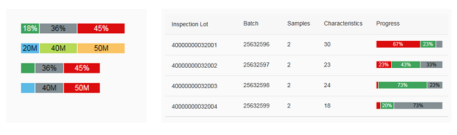
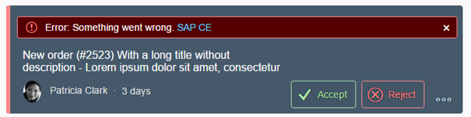
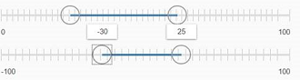

<!-- loioa0cb7a06b6784df892eef427e4714351 -->

# What's New in SAPUI5 1.44

With this release SAPUI5 is upgraded from version 1.42 to 1.44.

****

<table>
<tr>
<th valign="top">

Version

</th>
<th valign="top">

Type

</th>
<th valign="top">

Category

</th>
<th valign="top">

Title

</th>
<th valign="top">

Description

</th>
<th valign="top">

Action

</th>
<th valign="top">

Available as of

</th>
</tr>
<tr>
<td valign="top">

1.44 

</td>
<td valign="top">

Changed 

</td>
<td valign="top">

Feature 

</td>
<td valign="top">

**Navigation and Routing** 

</td>
<td valign="top">

**Navigation and Routing**

In the routing configuration, you can now define a `homeRoute` for the generic home page of the app. This is always the first history entry when a user navigates to a view of the app via deep link navigation. For more information, see [Routing Configuration](../04_Essentials/routing-configuration-9023130.md).

Changed•Feature•Info Only•1.44

</td>
<td valign="top">

Info Only

</td>
<td valign="top">

2017-01-19

</td>
</tr>
<tr>
<td valign="top">

1.44 

</td>
<td valign="top">

New 

</td>
<td valign="top">

Control 

</td>
<td valign="top">

**`sap.suite.ui.microchart.StackedBarMicroChart`** 

</td>
<td valign="top">

**`sap.suite.ui.microchart.StackedBarMicroChart`**

This control shows a progress chart that displays overall progress but also a summary of the items. You can have different value colors, for example, for accepted, rejected, and open items. For more information, see the [API Reference](https://ui5.sap.com/#/api/sap.suite.ui.microchart.StackedBarMicroChart) and the [Samples](https://ui5.sap.com/#/entity/sap.suite.ui.microchart.StackedBarMicroChart).

New•Control•Info Only•1.44

</td>
<td valign="top">

Info Only 

</td>
<td valign="top">

2017-01-19

</td>
</tr>
<tr>
<td valign="top">

1.44 

</td>
<td valign="top">

Changed 

</td>
<td valign="top">

Feature 

</td>
<td valign="top">

**Formatting and Parsing of Week Info for All Calendar Types** 

</td>
<td valign="top">

**Formatting and Parsing of Week Info for All Calendar Types**

The calculation of calendar weeks is now based on minimal days in first week coming from Unicode Common Locale Data Repository \(CLDR\) data.

Changed•Feature•Info Only•1.44

</td>
<td valign="top">

Info Only 

</td>
<td valign="top">

2017-01-19

</td>
</tr>
<tr>
<td valign="top">

1.44 

</td>
<td valign="top">

Changed 

</td>
<td valign="top">

Feature 

</td>
<td valign="top">

**SAPUI5 OData V4 Model** 

</td>
<td valign="top">

**SAPUI5 OData V4 Model**

The new version of the SAPUI5 OData V4 model introduces the following features:

-   Creating entities

-   Initial version of the V4 AnnotationHelper \(`sap.ui.model.odata.v4.AnnotationHelper`\)

-   Computed annotations in XML Templating with OData V4

-   Forwarding the `$apply` binding parameter

> ### Caution:  
> **Incompatibility Due to Bug Fix**
> 
> The following bug has been reported: If you call the [sap.ui.model.odata.v4.Context\#getObject\(\)](https://ui5.sap.com/#/api/sap.ui.model.odata.v4.Context/methods/getObject) or the [sap.ui.model.odata.v4.Context\#requestObject\(\)](https://ui5.sap.com/#/api/sap.ui.model.odata.v4.Context/methods/requestObject) methods without a parameter, the expected and documented behavior is that the same result is returned as if the parameter `sPath=""` had been specified. Due to the bug, however, the return value wraps the expected output which can then only be accessed via `.value[0]`, for example `oContext.getObject().value[0]`.
> 
> **If you have used this workaround, your application will break starting with SAPUI5 version 1.44.7.**
> 
> **Solution**: If your application needs to run with both, the fixed and unfixed versions of SAPUI5, specify the `sPath=""` parameter, for example `oContext.getObject("")`. If your application runs on SAPUI5 1.44.7 or higher, you do **not** need to specify the `sPath` parameter. In both cases, you **must not** use the workaround with `.value[0]` any longer.

> ### Restriction:  
> Due to the limited feature scope of this version of the SAPUI5 OData V4 model, check that all required features are in place before developing applications. Check the detailed documentation of the features, as certain parts of a feature may be missing. While we aim to be compatible with existing controls, some controls might not work due to small incompatibilities compared to `sap.ui.model.odata.(v2.)ODataModel`, or due to missing features in the model \(such as tree binding\). This also applies to Smart Controls \(`sap.ui.comp` library\) and SAP Fiori Elements that do not support the SAPUI5 OData V4 model, as well as controls such as `TreeTable` and `AnalyticalTable` which are not supported together with the SAPUI5 OData V4 model. The interface for applications has been changed for easier and more efficient use of the model. For a summary of these changes, see [Changes Compared to OData V2 Model](../04_Essentials/changes-compared-to-odata-v2-model-abd4d7c.md).

For more information, see [OData V4 Model](../04_Essentials/odata-v4-model-5de13cf.md), the [API Reference](https://ui5.sap.com/#/api/sap.ui.model.odata.v4), and the [Samples](https://ui5.sap.com/#/entity/sap.ui.model.odata.v4.ODataModel).

Changed•Feature•Info Only•1.44

</td>
<td valign="top">

Info Only 

</td>
<td valign="top">

2017-01-19

</td>
</tr>
<tr>
<td valign="top">

1.44 

</td>
<td valign="top">

Changed 

</td>
<td valign="top">

Feature 

</td>
<td valign="top">

**OData V2 Model** 

</td>
<td valign="top">

**OData V2 Model**

For OData V2 models, the V2 annotation `‘sap:visible=”false”’` is now also converted to V4 annotation `‘"com.sap.vocabularies.UI.v1.Hidden" : { "Bool" : "true" }’`. The old V4 annotation `‘"com.sap.vocabularies.Common.v1.FieldControl": { "EnumMember" : "com.sap.vocabularies.Common.v1.FieldControlType/Hidden" }’` has been deprecated. For more information, see [Meta Model for OData V2](../04_Essentials/odata-v2-model-6c47b2b.md#loio341823349ed04df1813197f2a0d71db2) and the [API Reference](https://ui5.sap.com/#/api/sap.ui.model.odata.ODataMetaModel).

Changed•Feature•Info Only•1.44

</td>
<td valign="top">

Info Only 

</td>
<td valign="top">

2017-01-19

</td>
</tr>
<tr>
<td valign="top">

1.44 

</td>
<td valign="top">

Changed 

</td>
<td valign="top">

Feature 

</td>
<td valign="top">

**One Page Acceptance Tests \(OPA5\)** 

</td>
<td valign="top">

**One Page Acceptance Tests \(OPA5\)**

You can now check for empty aggregations in your OPA test with the `AggregationEmpty` matcher. For more information, see the [API Reference](https://ui5.sap.com/#/api/sap.ui.test.matchers.AggregationEmpty).

Changed•Feature•Info Only•1.44

</td>
<td valign="top">

Info Only 

</td>
<td valign="top">

2017-01-19

</td>
</tr>
<tr>
<td valign="top">

1.44 

</td>
<td valign="top">

Changed 

</td>
<td valign="top">

Control 

</td>
<td valign="top">

**`sap.f.DynamicPage`** 

</td>
<td valign="top">

**`sap.f.DynamicPage`**

Using the new property `toggleHeaderOnTitleClick`, you can now disable the feature to expand and collapse the `DynamicPageHeader` with a title click . The default value for this property is set to `true` so that any existing apps using the `DynamicPage` control are not affected. For more information, see the [API Reference](https://ui5.sap.com/#/api/sap.f.DynamicPage).

Changed•Control•Info Only•1.44

</td>
<td valign="top">

Info Only 

</td>
<td valign="top">

2017-01-19

</td>
</tr>
<tr>
<td valign="top">

1.44 

</td>
<td valign="top">

Changed 

</td>
<td valign="top">

Control 

</td>
<td valign="top">

**`sap.m.Dialog`** 

</td>
<td valign="top">

**`sap.m.Dialog`**

We have enabled custom handling for the *Close* button. App developers can check for unsaved changes and prevent the dialog from being closed. This is done with the new property `escapeHandler` of type function. For more information, see the [API Reference](https://ui5.sap.com/#/api/sap.m.Dialog/methods/getEscapeHandler) and the [Sample](https://ui5.sap.com/#/entity/sap.m.Dialog/sample/sap.m.sample.Dialog).

Changed•Control•Info Only•1.44

</td>
<td valign="top">

Info Only 

</td>
<td valign="top">

2017-01-19

</td>
</tr>
<tr>
<td valign="top">

1.44 

</td>
<td valign="top">

Changed 

</td>
<td valign="top">

Control 

</td>
<td valign="top">

**`sap.m.GenericTile`** 

</td>
<td valign="top">

**`sap.m.GenericTile`**

With the new `LineMode`, you can switch the visualization of the Generic Tile on a web page or on the SAP Fiori launchpad from the rectangular format to an in-line format. This reduces the space that is used. You perform the switch by changing the value of the `mode` property, but keeping all other settings as already set. After the switch, the control's ID and contents stay the same; only the header and subheader are rendered. For more information, see the [API Reference](https://ui5.sap.com/#/api/sap.m.GenericTileMode) and the [Sample](https://ui5.sap.com/#/entity/sap.m.GenericTile/sample/sap.m.sample.GenericTileLineMode).

Changed•Control•Info Only•1.44

</td>
<td valign="top">

Info Only 

</td>
<td valign="top">

2017-01-19

</td>
</tr>
<tr>
<td valign="top">

1.44 

</td>
<td valign="top">

Changed 

</td>
<td valign="top">

Control 

</td>
<td valign="top">

**`sap.m.HeaderContainer`** 

</td>
<td valign="top">

**`sap.m.HeaderContainer`**

The `HeaderContainer` control has been moved from the `sap.suite.ui.commons` library to the `sap.m` library, to improve control consumption. The visual design of the control has been updated to SAP Fiori 2.0 and to the Belize theme. In addition, the API has been reworked to get a clear naming of properties, aggregations, events, and API descriptions. For more information, see the [API Reference](https://ui5.sap.com/#/api/sap.m.HeaderContainer) and the [Samples](https://ui5.sap.com/#/entity/sap.m.HeaderContainer).

Changed•Control•Info Only•1.44

</td>
<td valign="top">

Info Only 

</td>
<td valign="top">

2017-01-19

</td>
</tr>
<tr>
<td valign="top">

1.44 

</td>
<td valign="top">

Changed 

</td>
<td valign="top">

Control 

</td>
<td valign="top">

**`sap.m.IconTabBar`** 

</td>
<td valign="top">

**`sap.m.IconTabBar`**

-   We have implemented drag and drop of tabs on desktop devices. Clicking and holding a tab lets you change its position in on the tab bar. The functionality is enabled with the `enableTabReordering` property.

-   We have added a new property, `headerBackgroundDesign`, to change the header background and thus align with the new visual design. Possible values are `Solid`, `Transparent`, and `Translucent`.

For more information, see the [API Reference](https://ui5.sap.com/#/api/sap.m.IconTabBar/methods/getEnableTabReordering) and the samples [Tabs Drag and Drop](https://ui5.sap.com/#/entity/sap.m.IconTabBar/sample/sap.m.sample.IconTabBarDragDrop) and [Background Design](https://ui5.sap.com/#/entity/sap.m.IconTabBar/sample/sap.m.sample.IconTabBarBackgroundDesign). 

Changed•Control•Info Only•1.44

</td>
<td valign="top">

Info Only 

</td>
<td valign="top">

2017-01-19

</td>
</tr>
<tr>
<td valign="top">

1.44 

</td>
<td valign="top">

Changed 

</td>
<td valign="top">

Control 

</td>
<td valign="top">

**`sap.m.List / sap.m.Table`** 

</td>
<td valign="top">

**`sap.m.List / sap.m.Table`**

You can now highlight items, for example to indicate an error. For more information, see the [API Reference](https://ui5.sap.com/#/api/sap.m.ListItemBase).

Changed•Control•Info Only•1.44

</td>
<td valign="top">

Info Only 

</td>
<td valign="top">

2017-01-19

</td>
</tr>
<tr>
<td valign="top">

1.44 

</td>
<td valign="top">

Changed 

</td>
<td valign="top">

Control 

</td>
<td valign="top">

**`sap.m.NotificationListItem / sap.m.NotificationListGroup`** 

</td>
<td valign="top">

**`sap.m.NotificationListItem / sap.m.NotificationListGroup`**

We have implemented several new features:

-   New aggregation \(`processingMessage`\) to provide a `sap.m.MessageStrip` notification within a `NotificationListItem`

    

-   Notification list items are highlighted on mouse-over as with list items.

-   We have added an event to trigger when the `NotificationListGroup` is expanded or collapsed. The event is called `onCollapse`.

For more information, see the samples [Notification List Item](https://ui5.sap.com/#/entity/sap.m.NotificationListItem/sample/sap.m.sample.NotificationListItem) and [Notification List Group with Max Number of Notifications Reached](https://ui5.sap.com/#/entity/sap.m.NotificationListGroup/sample/sap.m.sample.MaxNumberOfNotificationsReached). 

Changed•Control•Info Only•1.44

</td>
<td valign="top">

Info Only 

</td>
<td valign="top">

2017-01-19

</td>
</tr>
<tr>
<td valign="top">

1.44 

</td>
<td valign="top">

Changed 

</td>
<td valign="top">

Control 

</td>
<td valign="top">

**`sap.m.PlanningCalendar`** 

</td>
<td valign="top">

**`sap.m.PlanningCalendar`**

A new `week` view is now available for the `PlanningCalendar` control. It displays a full calendar week that always starts from the first day of the week \(locale-dependent\) for the corresponding calendar types \(Gregorian, Islamic, Japanese\). For more information, see the [API Reference](https://ui5.sap.com/#/api/sap.m.PlanningCalendar) and the [Sample](https://ui5.sap.com/#/entity/sap.m.PlanningCalendar/sample/sap.m.sample.PlanningCalendar).

Changed•Control•Info Only•1.44

</td>
<td valign="top">

Info Only 

</td>
<td valign="top">

2017-01-19

</td>
</tr>
<tr>
<td valign="top">

1.44 

</td>
<td valign="top">

Changed 

</td>
<td valign="top">

Control 

</td>
<td valign="top">

**`sap.m.Slider / sap.m.RangeSlider`** 

</td>
<td valign="top">

**`sap.m.Slider / sap.m.RangeSlider`**

We have implemented responsive tickmarks for the slider controls. The tickmarks are enabled with the `enableTickmarks` property. The number of visible tickmarks depends on the step size and the slider minimum and maximum values. For more information, see the [API Reference](https://ui5.sap.com/#/api/sap.m.Slider/methods/getEnableTickmarks) and the [Sample](https://ui5.sap.com/#/entity/sap.m.Slider/sample/sap.m.sample.Slider).

Changed•Control•Info Only•1.44

</td>
<td valign="top">

Info Only 

</td>
<td valign="top">

2017-01-19

</td>
</tr>
<tr>
<td valign="top">

1.44 

</td>
<td valign="top">

Changed 

</td>
<td valign="top">

Control 

</td>
<td valign="top">

**`sap.m.UploadCollection`** 

</td>
<td valign="top">

**`sap.m.UploadCollection`**

The sorting and filtering feature has been enhanced. You can now also display the *Filtered by* information in the info toolbar in the `UploadCollection` control. For more information, see the [API Reference](https://ui5.sap.com/#/api/sap.m.UploadCollection) and the [Sample](https://ui5.sap.com/#/entity/sap.m.UploadCollection/sample/sap.m.sample.UploadCollectionSortingFiltering).

Changed•Control•Info Only•1.44

</td>
<td valign="top">

Info Only 

</td>
<td valign="top">

2017-01-19

</td>
</tr>
<tr>
<td valign="top">

1.44 

</td>
<td valign="top">

Changed 

</td>
<td valign="top">

Control 

</td>
<td valign="top">

**`sap.suite.ui.commons.ProcessFlow`** 

</td>
<td valign="top">

**`sap.suite.ui.commons.ProcessFlow`**

In some scenarios, the process flow graph occupies more space on the screen than necessary. To avoid display issues, especially on devices with small screens, we improved the layout to optimize the use of the available space. For more information, see the [API Reference](https://ui5.sap.com/#/api/sap.suite.ui.commons.ProcessFlow) and the [Sample](https://ui5.sap.com/#/entity/sap.suite.ui.commons.ProcessFlow/sample/sap.suite.ui.commons.sample.ProcessFlowMultipleRootNodes).

Changed•Control•Info Only•1.44

</td>
<td valign="top">

Info Only 

</td>
<td valign="top">

2017-01-19

</td>
</tr>
<tr>
<td valign="top">

1.44 

</td>
<td valign="top">

Changed 

</td>
<td valign="top">

Control 

</td>
<td valign="top">

**`sap.suite.ui.microchart.RadialMicroChart`** 

</td>
<td valign="top">

**`sap.suite.ui.microchart.RadialMicroChart`**

The `RadialMicroChart` control is rendered responsive. This means that the size of the control adapts automatically to the size of the surrounding container. By adding the size property to the control, the Radial Micro Chart can now also be rendered in fixed sizes that are available in `sap.m.Size`. You can choose the sizes `S`, `M`, `L`, `Auto`, and `Responsive`. For more information, see the [API Reference](https://ui5.sap.com/#/api/sap.suite.ui.microchart.RadialMicroChart) and the [Sample](https://ui5.sap.com/#/entity/sap.suite.ui.microchart.RadialMicroChart/sample/sap.suite.ui.microchart.sample.RadialMicroChart).

Changed•Control•Info Only•1.44

</td>
<td valign="top">

Info Only 

</td>
<td valign="top">

2017-01-19

</td>
</tr>
<tr>
<td valign="top">

1.44 

</td>
<td valign="top">

Changed 

</td>
<td valign="top">

Control 

</td>
<td valign="top">

**`sap.ui.comp.navpopover.SmartLink`** 

</td>
<td valign="top">

**`sap.ui.comp.navpopover.SmartLink`**

You can now personalize the cross-application links on the popover by selecting *Define Links*. For more information, see [Smart Link](../10_More_About_Controls/smart-link-f638884.md) and the [Sample](https://ui5.sap.com/#/entity/sap.ui.comp.navpopover.SmartLink/sample/sap.ui.comp.sample.smartlink.example_08).

Changed•Control•Info Only•1.44

</td>
<td valign="top">

Info Only 

</td>
<td valign="top">

2017-01-19

</td>
</tr>
<tr>
<td valign="top">

1.44 

</td>
<td valign="top">

Changed 

</td>
<td valign="top">

Control 

</td>
<td valign="top">

**`sap.ui.comp.smartmicrochart`** 

</td>
<td valign="top">

**`sap.ui.comp.smartmicrochart`**

Some Smart Micro Chart controls, such as the `SmartBulletMicroChart` and the `SmartAreaMicroChart`, display numeric values at various places in their charts. To harmonize the format in which Smart Micro Charts present their numeric labels, the control now uses the `sap.ui.core.format.NumberFormat` to display numbers in a short format. For more information, see the [API Reference](https://ui5.sap.com/#/api/sap.ui.comp.smartmicrochart) and the [Samples](https://ui5.sap.com/#/entity/sap.ui.comp.smartmicrochart.SmartAreaMicroChart).

Changed•Control•Info Only•1.44

</td>
<td valign="top">

Info Only 

</td>
<td valign="top">

2017-01-19

</td>
</tr>
<tr>
<td valign="top">

1.44 

</td>
<td valign="top">

Changed 

</td>
<td valign="top">

Control 

</td>
<td valign="top">

**`sap.ui.comp.smartmicrohart.SmartAreaMicroChart`** 

</td>
<td valign="top">

**`sap.ui.comp.smartmicrohart.SmartAreaMicroChart`**

The labels at the top and bottom of the chart can now also be displayed with the visual chart. The labels themselves, as well as the color of the labels can be controlled using annotations. For more information, see the [API Reference](https://ui5.sap.com/#/api/sap.ui.comp.smartmicrochart.SmartAreaMicroChart) and the [Sample](https://ui5.sap.com/#/entity/sap.ui.comp.smartmicrochart.SmartAreaMicroChart/sample/sap.ui.comp.sample.smartmicrochart.SmartAreaMicroChart).

Changed•Control•Info Only•1.44

</td>
<td valign="top">

Info Only 

</td>
<td valign="top">

2017-01-19

</td>
</tr>
<tr>
<td valign="top">

1.44 

</td>
<td valign="top">

Changed 

</td>
<td valign="top">

Control 

</td>
<td valign="top">

**`sap.ui.table.*`** 

</td>
<td valign="top">

**`sap.ui.table.*`**

-   The sizing behavior of columns is now more predictable, especially when the user manually resizes columns. Columns now have a fixed minimum width.

-   Keyboard handling has been optimized for navigation as well as editing scenarios.

-   The default row height when using controls from the `sap.ui.commons` library is now the same as the general default. For more information, see [Content Densities](../04_Essentials/content-densities-e54f729.md).

Changed•Control•Info Only•1.44

</td>
<td valign="top">

Info Only 

</td>
<td valign="top">

2017-01-19

</td>
</tr>
<tr>
<td valign="top">

1.44 

</td>
<td valign="top">

Changed 

</td>
<td valign="top">

Control 

</td>
<td valign="top">

**`sap.ui.vbm.GeoMap`** 

</td>
<td valign="top">

**`sap.ui.vbm.GeoMap`**

A new method called `getClusteredSpots` has been added to the `sap.ui.vbm.GeoMap` control. This method provides easy access to spot instances in a cluster container. For more information, see the [API Reference](https://ui5.sap.com/#/api/sap.ui.vbm.GeoMap).

Changed•Control•Info Only•1.44

</td>
<td valign="top">

Info Only 

</td>
<td valign="top">

2017-01-19

</td>
</tr>
<tr>
<td valign="top">

1.44 

</td>
<td valign="top">

Changed 

</td>
<td valign="top">

Control 

</td>
<td valign="top">

**`sap.ui.vk`** 

</td>
<td valign="top">

**`sap.ui.vk`**

A number of controls in the `sap.ui.vk` library have been updated to improve the behavior of hotspots in VDS-based Smart 2D files. For more information, see the [API Reference](https://ui5.sap.com/#/api/sap.ui.vk.NodeHierarchy).

Changed•Control•Info Only•1.44

</td>
<td valign="top">

Info Only 

</td>
<td valign="top">

2017-01-19

</td>
</tr>
<tr>
<td valign="top">

1.44 

</td>
<td valign="top">

Changed 

</td>
<td valign="top">

SAP Fiori Elements 

</td>
<td valign="top">

**SAP Fiori Elements** 

</td>
<td valign="top">

**SAP Fiori Elements**

**List Report and Object Page**

-   **General Features**

    -   Control display of custom actions added through extension points

        You can now control the display of actions implemented using extension points. Actions in the list report or in tables on the object page can be enabled or disabled through the `requiresSelection` or `applicablePath` properties, and actions in the header or footer of the object page can be hidden or displayed through the `applicablePath` property.

-   **Object Page View**

    -   Enable or disable the *Delete* action in tables on object pages

        Using the `deletable-path` annotation, you can now enable or disable the *Delete* button in the toolbar of tables on the object page, based on certain conditions set up in your back-end system.

    -   Display of actions in smart chart toolbar

        You can now control the display of actions in the toolbar of a `SmartChart` control on your object page. In `UI.DataFieldForAction`-based actions, you use the applicable-path setting; for `UI.DataFieldForIntentBasedNavigation`-based actions, you use the `RequiresContext` property to control whether a user must make a selection to enable an action.

-   **List Report View**

    -   Enhanced draft status information

        In the list report, the messages for the draft statuses `Locked` and `Unsaved Changes` have been enhanced to indicate the user who is editing the object.

    -   Conditional external navigations

        A new extension point in the list report controller allows you to implement dynamic navigation to an external application based on a property value.

**Overview Page**

Overview pages have been enhanced with the following features:

-   Overview pages now support the `SelectionPresentationVariant` annotation that provides a combination of capabilities from `SelectionVariant` and `PresentationVariant`. For more information, see [Annotations Used in Overview Pages](../06_SAP_Fiori_Elements/annotations-used-in-overview-pages-65731e6.md).

-   New *Link List Card* that provides a list of links with a title, picture, icon, or subtitle. For more information, see [Link List Cards](../06_SAP_Fiori_Elements/link-list-cards-0326f91.md).

-   The `Smart Comparison Micro Chart` replaces the progress indicator chart on the list card, to display both positive and negative values in the same chart. For more information, see [List Cards](../06_SAP_Fiori_Elements/list-cards-56f39e0.md).

-   With the flexible table card, you can now display three data fields or data points, or a combination of both, in the columns. For more information, see [Table Cards](../06_SAP_Fiori_Elements/table-cards-167bf7c.md).

Changed•SAP Fiori Elements•Info Only•1.44

</td>
<td valign="top">

Info Only 

</td>
<td valign="top">

2017-01-19

</td>
</tr>
<tr>
<td valign="top">

1.44 

</td>
<td valign="top">

Changed 

</td>
<td valign="top">

User Documentation 

</td>
<td valign="top">

**Testing Tutorial** 

</td>
<td valign="top">

**Testing Tutorial**

The **Testing** tutorial has been enhanced with two additional steps. For more information, see [Testing Tutorial](../03_Get-Started/testing-tutorial-291c912.md).

Changed•User Documentation•Info Only•1.44

</td>
<td valign="top">

Info Only 

</td>
<td valign="top">

2017-01-19

</td>
</tr>
<tr>
<td valign="top">

1.44 

</td>
<td valign="top">

New 

</td>
<td valign="top">

Feature 

</td>
<td valign="top">

**Demo Kit Improvements** 

</td>
<td valign="top">

**Demo Kit Improvements**

The Demo Kit now has the following new features:

-   Several improvements are now available in the *Samples*:

    -   The Belize Deep theme can now be switched from the *Settings* menu.

    -   You can now copy the code from the code section of each control sample on a Combi device and paste it outside the *Samples*.

    -   *Deprecated Since* information is now available in the API descriptions so that it is easier to identify the version when deprecation took place.

    -   Downloaded samples that contain external \(utility\) resources can now be easily imported with less additional effort, for example, into SAP Web IDE 

-   The search feature in the *Icon Explorer* has been improved to find icons not only by name but also by metadata keywords.

Changed•Feature•Info Only•1.44

</td>
<td valign="top">

Info Only 

</td>
<td valign="top">

2017-01-19

</td>
</tr>
</table>

**Related Information**  

[What's New in SAPUI5 1.123](what-s-new-in-sapui5-1-123-9d00ac7.md "With this release SAPUI5 is upgraded from version 1.122 to 1.123.")

[What's New in SAPUI5 1.122](what-s-new-in-sapui5-1-122-5d078da.md "With this release SAPUI5 is upgraded from version 1.121 to 1.122.")

[What's New in SAPUI5 1.121](what-s-new-in-sapui5-1-121-91a4a2f.md "With this release SAPUI5 is upgraded from version 1.120 to 1.121.")

[What's New in SAPUI5 1.120](what-s-new-in-sapui5-1-120-2359b63.md "With this release SAPUI5 is upgraded from version 1.119 to 1.120.")

[What's New in SAPUI5 1.119](what-s-new-in-sapui5-1-119-0b1903a.md "With this release SAPUI5 is upgraded from version 1.118 to 1.119.")

[What's New in SAPUI5 1.118](what-s-new-in-sapui5-1-118-3eecbde.md "With this release SAPUI5 is upgraded from version 1.117 to 1.118.")

[What's New in SAPUI5 1.117](what-s-new-in-sapui5-1-117-029d3b4.md "With this release SAPUI5 is upgraded from version 1.116 to 1.117.")

[What's New in SAPUI5 1.116](what-s-new-in-sapui5-1-116-ebd6f34.md "With this release SAPUI5 is upgraded from version 1.115 to 1.116.")

[What's New in SAPUI5 1.115](what-s-new-in-sapui5-1-115-409fde8.md "With this release SAPUI5 is upgraded from version 1.114 to 1.115.")

[What's New in SAPUI5 1.114](what-s-new-in-sapui5-1-114-890fce1.md "With this release SAPUI5 is upgraded from version 1.113 to 1.114.")

[What's New in SAPUI5 1.113](what-s-new-in-sapui5-1-113-a9553fe.md "With this release SAPUI5 is upgraded from version 1.112 to 1.113.")

[What's New in SAPUI5 1.112](what-s-new-in-sapui5-1-112-34afc69.md "With this release SAPUI5 is upgraded from version 1.111 to 1.112.")

[What's New in SAPUI5 1.111](what-s-new-in-sapui5-1-111-7a67837.md "With this release SAPUI5 is upgraded from version 1.110 to 1.111.")

[What's New in SAPUI5 1.110](what-s-new-in-sapui5-1-110-71a855c.md "With this release SAPUI5 is upgraded from version 1.109 to 1.110.")

[What's New in SAPUI5 1.109](what-s-new-in-sapui5-1-109-3264bd2.md "With this release SAPUI5 is upgraded from version 1.108 to 1.109.")

[What's New in SAPUI5 1.108](what-s-new-in-sapui5-1-108-66e33f0.md "With this release SAPUI5 is upgraded from version 1.107 to 1.108.")

[What's New in SAPUI5 1.107](what-s-new-in-sapui5-1-107-d4ff916.md "With this release SAPUI5 is upgraded from version 1.106 to 1.107.")

[What's New in SAPUI5 1.106](what-s-new-in-sapui5-1-106-5b497b0.md "With this release SAPUI5 is upgraded from version 1.105 to 1.106.")

[What's New in SAPUI5 1.105](what-s-new-in-sapui5-1-105-4d6c00e.md "With this release SAPUI5 is upgraded from version 1.104 to 1.105.")

[What's New in SAPUI5 1.104](what-s-new-in-sapui5-1-104-69e567c.md "With this release SAPUI5 is upgraded from version 1.103 to 1.104.")

[What's New in SAPUI5 1.103](what-s-new-in-sapui5-1-103-0e98c76.md "With this release SAPUI5 is upgraded from version 1.102 to 1.103.")

[What's New in SAPUI5 1.102](what-s-new-in-sapui5-1-102-f038c99.md "With this release SAPUI5 is upgraded from version 1.101 to 1.102.")

[What's New in SAPUI5 1.101](what-s-new-in-sapui5-1-101-7733b00.md "With this release SAPUI5 is upgraded from version 1.100 to 1.101.")

[What's New in SAPUI5 1.100](what-s-new-in-sapui5-1-100-27dec1d.md "With this release SAPUI5 is upgraded from version 1.99 to 1.100.")

[What's New in SAPUI5 1.99](what-s-new-in-sapui5-1-99-4f35848.md "With this release SAPUI5 is upgraded from version 1.98 to 1.99.")

[What's New in SAPUI5 1.98](what-s-new-in-sapui5-1-98-d9f16f2.md "With this release SAPUI5 is upgraded from version 1.97 to 1.98.")

[What's New in SAPUI5 1.97](what-s-new-in-sapui5-1-97-fa0e282.md "With this release SAPUI5 is upgraded from version 1.96 to 1.97.")

[What's New in SAPUI5 1.96](what-s-new-in-sapui5-1-96-7a9269f.md "With this release SAPUI5 is upgraded from version 1.95 to 1.96.")

[What's New in SAPUI5 1.95](what-s-new-in-sapui5-1-95-a1aea67.md "With this release SAPUI5 is upgraded from version 1.94 to 1.95.")

[What's New in SAPUI5 1.94](what-s-new-in-sapui5-1-94-c40f1e6.md "With this release SAPUI5 is upgraded from version 1.93 to 1.94.")

[What's New in SAPUI5 1.93](what-s-new-in-sapui5-1-93-f273340.md "With this release SAPUI5 is upgraded from version 1.92 to 1.93.")

[What's New in SAPUI5 1.92](what-s-new-in-sapui5-1-92-1ef345d.md "With this release SAPUI5 is upgraded from version 1.91 to 1.92.")

[What's New in SAPUI5 1.91](what-s-new-in-sapui5-1-91-0a2bd79.md "With this release SAPUI5 is upgraded from version 1.90 to 1.91.")

[What's New in SAPUI5 1.90](what-s-new-in-sapui5-1-90-91c10c2.md "With this release SAPUI5 is upgraded from version 1.89 to 1.90.")

[What's New in SAPUI5 1.89](what-s-new-in-sapui5-1-89-e56cddc.md "With this release SAPUI5 is upgraded from version 1.88 to 1.89.")

[What's New in SAPUI5 1.88](what-s-new-in-sapui5-1-88-e15a206.md "With this release SAPUI5 is upgraded from version 1.87 to 1.88.")

[What's New in SAPUI5 1.87](what-s-new-in-sapui5-1-87-b506da7.md "With this release SAPUI5 is upgraded from version 1.86 to 1.87.")

[What's New in SAPUI5 1.86](what-s-new-in-sapui5-1-86-4c1c959.md "With this release SAPUI5 is upgraded from version 1.85 to 1.86.")

[What's New in SAPUI5 1.85](what-s-new-in-sapui5-1-85-1d18eb5.md "With this release SAPUI5 is upgraded from version 1.84 to 1.85.")

[What's New in SAPUI5 1.84](what-s-new-in-sapui5-1-84-dc76640.md "With this release SAPUI5 is upgraded from version 1.82 to 1.84.")

[What's New in SAPUI5 1.82](what-s-new-in-sapui5-1-82-3a8dd13.md "With this release SAPUI5 is upgraded from version 1.81 to 1.82.")

[What's New in SAPUI5 1.81](what-s-new-in-sapui5-1-81-f5e2a21.md "With this release SAPUI5 is upgraded from version 1.80 to 1.81.")

[What's New in SAPUI5 1.80](what-s-new-in-sapui5-1-80-8cee506.md "With this release SAPUI5 is upgraded from version 1.79 to 1.80.")

[What's New in SAPUI5 1.79](what-s-new-in-sapui5-1-79-99c4cdc.md "With this release SAPUI5 is upgraded from version 1.78 to 1.79.")

[What's New in SAPUI5 1.78](what-s-new-in-sapui5-1-78-f09b63e.md "With this release SAPUI5 is upgraded from version 1.77 to 1.78.")

[What's New in SAPUI5 1.77](what-s-new-in-sapui5-1-77-c46b439.md "With this release SAPUI5 is upgraded from version 1.76 to 1.77.")

[What's New in SAPUI5 1.76](what-s-new-in-sapui5-1-76-aad03b5.md "With this release SAPUI5 is upgraded from version 1.75 to 1.76.")

[What's New in SAPUI5 1.75](what-s-new-in-sapui5-1-75-5cbb62d.md "With this release SAPUI5 is upgraded from version 1.74 to 1.75.")

[What's New in SAPUI5 1.74](what-s-new-in-sapui5-1-74-c22208a.md "With this release SAPUI5 is upgraded from version 1.73 to 1.74.")

[What's New in SAPUI5 1.73](what-s-new-in-sapui5-1-73-231dd13.md "With this release SAPUI5 is upgraded from version 1.72 to 1.73.")

[What's New in SAPUI5 1.72](what-s-new-in-sapui5-1-72-521cad9.md "With this release SAPUI5 is upgraded from version 1.71 to 1.72.")

[What's New in SAPUI5 1.71](what-s-new-in-sapui5-1-71-a93a6a3.md "With this release SAPUI5 is upgraded from version 1.70 to 1.71.")

[What's New in SAPUI5 1.70](what-s-new-in-sapui5-1-70-f073d69.md "With this release SAPUI5 is upgraded from version 1.69 to 1.70.")

[What's New in SAPUI5 1.69](what-s-new-in-sapui5-1-69-89a18bd.md "With this release SAPUI5 is upgraded from version 1.68 to 1.69.")

[What's New in SAPUI5 1.68](what-s-new-in-sapui5-1-68-f94bf93.md "With this release SAPUI5 is upgraded from version 1.67 to 1.68.")

[What's New in SAPUI5 1.67](what-s-new-in-sapui5-1-67-a6b1472.md "With this release SAPUI5 is upgraded from version 1.66 to 1.67.")

[What's New in SAPUI5 1.66](what-s-new-in-sapui5-1-66-c9896e9.md "With this release SAPUI5 is upgraded from version 1.65 to 1.66.")

[What's New in SAPUI5 1.65](what-s-new-in-sapui5-1-65-0f5acfd.md "With this release SAPUI5 is upgraded from version 1.64 to 1.65.")

[What's New in SAPUI5 1.64](what-s-new-in-sapui5-1-64-0e30822.md "With this release SAPUI5 is upgraded from version 1.63 to 1.64.")

[What's New in SAPUI5 1.63](what-s-new-in-sapui5-1-63-e8d9da7.md "With this release SAPUI5 is upgraded from version 1.62 to 1.63.")

[What's New in SAPUI5 1.62](what-s-new-in-sapui5-1-62-771f4d5.md "With this release SAPUI5 is upgraded from version 1.61 to 1.62.")

[What's New in SAPUI5 1.61](what-s-new-in-sapui5-1-61-d991552.md "With this release SAPUI5 is upgraded from version 1.60 to 1.61.")

[What's New in SAPUI5 1.60](what-s-new-in-sapui5-1-60-5a0e1f7.md "With this release SAPUI5 is upgraded from version 1.58 to 1.60.")

[What's New in SAPUI5 1.58](what-s-new-in-sapui5-1-58-7c927aa.md "With this release SAPUI5 is upgraded from version 1.56 to 1.58.")

[What's New in SAPUI5 1.56](what-s-new-in-sapui5-1-56-108b7fd.md "With this release SAPUI5 is upgraded from version 1.54 to 1.56.")

[What's New in SAPUI5 1.54](what-s-new-in-sapui5-1-54-c838330.md "With this release SAPUI5 is upgraded from version 1.52 to 1.54.")

[What's New in SAPUI5 1.52](what-s-new-in-sapui5-1-52-849e1b6.md "With this release SAPUI5 is upgraded from version 1.50 to 1.52.")

[What's New in SAPUI5 1.50](what-s-new-in-sapui5-1-50-759e9f3.md "With this release SAPUI5 is upgraded from version 1.48 to 1.50.")

[What's New in SAPUI5 1.48](what-s-new-in-sapui5-1-48-fa1efac.md "With this release SAPUI5 is upgraded from version 1.46 to 1.48.")

[What's New in SAPUI5 1.46](what-s-new-in-sapui5-1-46-6307539.md "With this release SAPUI5 is upgraded from version 1.44 to 1.46.")

[What's New in SAPUI5 1.42](what-s-new-in-sapui5-1-42-468b05d.md "With this release SAPUI5 is upgraded from version 1.40 to 1.42.")

[What's New in SAPUI5 1.40](what-s-new-in-sapui5-1-40-fbab50e.md "With this release SAPUI5 is upgraded from version 1.38 to 1.40.")

[What's New in SAPUI5 1.38](what-s-new-in-sapui5-1-38-f218918.md "With this release SAPUI5 is upgraded from version 1.36 to 1.38.")

