<!-- loio6307539826e946eda7b619f2e679569a -->

# What's New in SAPUI5 1.46

With this release SAPUI5 is upgraded from version 1.44 to 1.46.

****

<table>
<tr>
<th valign="top">

Version

</th>
<th valign="top">

Type

</th>
<th valign="top">

Category

</th>
<th valign="top">

Title

</th>
<th valign="top">

Description

</th>
<th valign="top">

Action

</th>
<th valign="top">

Available as of

</th>
</tr>
<tr>
<td valign="top">

1.46 

</td>
<td valign="top">

New 

</td>
<td valign="top">

Feature 

</td>
<td valign="top">

**New Themes** 

</td>
<td valign="top">

**New Themes**

The High Contrast White \(HCW\) and High Contrast Black \(HCB\) themes \(`sap_belize_hcw` / `sap_belize_hcb`\) are now delivered with all SAP Fiori-related libraries. They offer a better visual experience for people with visual impairments. For more information, see [Accessibility](../04_Essentials/accessibility-322f55d.md).

New•Feature•Info Only•1.46

</td>
<td valign="top">

Info Only

</td>
<td valign="top">

2017-05-04

</td>
</tr>
<tr>
<td valign="top">

1.46 

</td>
<td valign="top">

New 

</td>
<td valign="top">

Feature 

</td>
<td valign="top">

**Support for Persian Calendar** 

</td>
<td valign="top">

**Support for Persian Calendar**

All our controls now support the Persian calendar. The Persian calendar is also sometimes referred to as "Solar Hijri", "Iranian" or "Farsi" calendar.

The Persian calendar year begins around March 21st of each Gregorian year and ends at around March 20th of the following year. To convert the Persian calendar years into the equivalent Gregorian year, add 621 or 622 years to the Persian calendar year depending on whether the Persian calendar year has begun or not.

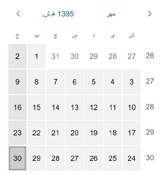

New•Feature•Info Only•1.46

</td>
<td valign="top">

Info Only 

</td>
<td valign="top">

2017-05-04

</td>
</tr>
<tr>
<td valign="top">

1.46 

</td>
<td valign="top">

New 

</td>
<td valign="top">

Control 

</td>
<td valign="top">

**`sap.f.Avatar`** 

</td>
<td valign="top">

**`sap.f.Avatar`**

**`sap.f.Avatar`** is an SAP Fiori 2.0 image-like control that has different display options for representing images, initials, and icons. It allows the usage of different content, shapes, and sizes depending on the use case.

There are several predefined sizes, as well as an option to set a custom size.

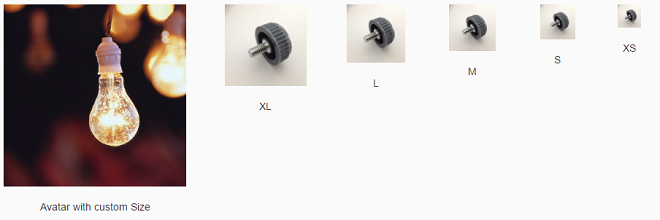

For more information, see the [API Reference](https://ui5.sap.com/#/api/sap.f.Avatar) and the [Sample](https://ui5.sap.com/#/entity/sap.m.Avatar/sample/sap.m.sample.Avatar).

New•Control•Info Only•1.46

</td>
<td valign="top">

Info Only 

</td>
<td valign="top">

2017-05-04

</td>
</tr>
<tr>
<td valign="top">

1.46 

</td>
<td valign="top">

New 

</td>
<td valign="top">

Control 

</td>
<td valign="top">

**`sap.f.FlexibleColumnLayout`** 

</td>
<td valign="top">

**`sap.f.FlexibleColumnLayout`**

This control represents the new SAP Fiori 2.0 base layout for an app. It implements the master-detail-detail paradigm by displaying up to three pages in separate columns. The columns are referred to as `Begin`, `Mid`, and `End`, and their width is variable depending on the current layout.

There are several possible layouts that can be changed with the control's API, and also by the user with navigation arrows.

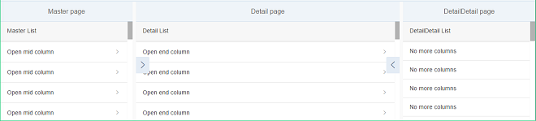

For more information, see [Building an App with the Flexible Column Layout and Related Classes](../10_More_About_Controls/building-an-app-with-the-flexible-column-layout-and-related-classes-59a0e11.md), the [API Reference](https://ui5.sap.com/#/api/sap.f.FlexibleColumnLayout), and the [Sample](https://ui5.sap.com/#/entity/sap.f.FlexibleColumnLayout/sample/sap.f.sample.FlexibleColumnLayoutSimple).

New•Control•Info Only•1.46

</td>
<td valign="top">

Info Only 

</td>
<td valign="top">

2017-05-04

</td>
</tr>
<tr>
<td valign="top">

1.46 

</td>
<td valign="top">

New 

</td>
<td valign="top">

Control 

</td>
<td valign="top">

**`sap.f.semantic.SemanticPage`** 

</td>
<td valign="top">

**`sap.f.semantic.SemanticPage`**

This new SAP Fiori 2.0 control represents an enhanced `sap.f.DynamicPage` that contains controls with semantic-specific meaning. You can set different actions using the available aggregations, and the `sap.f.semantic.SemanticPage` will automatically position them in dedicated sections of the title or the footer of the page, facilitating the implementation of the SAP Fiori 2.0 design guidelines.

  
  
**Different types of actions in the title positioned in a predefined order**

  
  
**Different types of actions in the footer’s right and left areas, positioned in a predefined order**

For more information, see the [API Reference](https://ui5.sap.com/#/api/sap.f.semantic.SemanticPage) and the [Sample](https://ui5.sap.com/#/entity/sap.f.semantic.SemanticPage/sample/sap.f.sample.SemanticPageFreeStyle).

New•Control•Info Only•1.46

</td>
<td valign="top">

Info Only 

</td>
<td valign="top">

2017-05-04

</td>
</tr>
<tr>
<td valign="top">

1.46 

</td>
<td valign="top">

New 

</td>
<td valign="top">

Control 

</td>
<td valign="top">

**`sap.suite.ui.microchcart` library** 

</td>
<td valign="top">

**`sap.suite.ui.microchcart` library**

The following new, interactive charts are available and have been designed especially for analytical applications:

-   The `sap.suite.ui.microchcart.InteractiveDonutChart` control visualizes the data \(only positive values\) as segments of a donut and provides the corresponding details as a legend in the control. You can interact with both the legend and the donut for selection actions that are synchronized between the legend and the donut.

    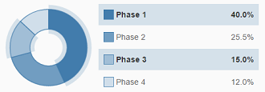

    For more information, see the [API Reference](https://ui5.sap.com/#/api/sap.suite.ui.microchart.InteractiveDonutChart) and the [Sample](https://ui5.sap.com/#/entity/sap.suite.ui.microchart.InteractiveDonutChart/sample/sap.suite.ui.microchart.sample.InteractiveDonutChart).

-   The `sap.suite.ui.microchcart.InteractiveBarChart` control visualizes the data as horizontal bars upon which the user can interact for actions based on the selection. The data can be displayed as a positive or negative value with a divider for separating these values.

    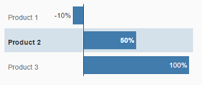

    For more information, see the [API Reference](https://ui5.sap.com/#/api/sap.suite.ui.microchart.InteractiveBarChart) and the [Sample](https://ui5.sap.com/#/entity/sap.suite.ui.microchart.InteractiveBarChart/sample/sap.suite.ui.microchart.sample.InteractiveBarChart).

-   The `sap.suite.ui.microchcart.InteractiveLineChart` control visualizes the data with connected points of a continuous set of dates or events with which the user can interact and trigger selection actions. The data can be displayed as a positive or negative value or both. The divider for separating these values changes respective to the values.

    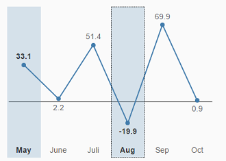

    For more information, see the [API Reference](https://ui5.sap.com/#/api/sap.suite.ui.microchart.InteractiveLineChart) and the [Sample](https://ui5.sap.com/#/entity/sap.suite.ui.microchart.InteractiveLineChart/sample/sap.suite.ui.microchart.sample.InteractiveLineChart).

New•Control•Info Only•1.46

</td>
<td valign="top">

Info Only 

</td>
<td valign="top">

2017-05-04

</td>
</tr>
<tr>
<td valign="top">

1.46 

</td>
<td valign="top">

New 

</td>
<td valign="top">

Control 

</td>
<td valign="top">

**`sap.ui.codeeditor.CodeEditor`** 

</td>
<td valign="top">

**`sap.ui.codeeditor.CodeEditor`**

You can use this control to visualize source code of various types, with syntax highlighting and line numbers, in edit and read-only mode, for example, in scenarios where you want the user to inspect and edit source code. The `CodeEditor` is a wrapper control for the open-source *Ace* code editor \(see [https://ace.c9.io](https://ace.c9.io)\). For more information, see the [API Reference](https://ui5.sap.com/#/api/sap.ui.codeeditor.CodeEditor) and the [Sample](https://ui5.sap.com/#/entity/sap.ui.codeeditor.CodeEditor/sample/sap.ui.codeeditor.sample.CodeEditor).

New•Control•Info Only•1.46

</td>
<td valign="top">

Info Only 

</td>
<td valign="top">

2017-05-04

</td>
</tr>
<tr>
<td valign="top">

1.46 

</td>
<td valign="top">

Changed 

</td>
<td valign="top">

Feature 

</td>
<td valign="top">

**SAPUI5 OData V4 Model** 

</td>
<td valign="top">

**SAPUI5 OData V4 Model**

The new version of the SAPUI5 OData V4 model now supports the following features:

-   Changing query options on `sap.ui.model.odata.v4.ODataListBinding` and `sap.ui.model.odata.v4.ODataContextBinding`

-   Requesting `$count` system query option on `sap.ui.model.odata.v4.ODataListBinding`

-   Accessing value lists

-   Forwarding the `$search` system query option

-   Branching from OData V4 model into metadata using the hash \(`#`\) character \(see [sap.ui.model.odata.v4.Context\#getObject\(\)](https://ui5.sap.com/#/api/sap.ui.model.odata.v4.ODataModel/methods/createBindingContext)\) in `template:with`

> ### Caution:  
> **Incompatibility Due to Bug Fix**
> 
> The following bug has been reported: If you call the [sap.ui.model.odata.v4.Context\#getObject\(\)](https://ui5.sap.com/#/api/sap.ui.model.odata.v4.Context/methods/getObject) or the [sap.ui.model.odata.v4.Context\#requestObject\(\)](https://ui5.sap.com/#/api/sap.ui.model.odata.v4.Context/methods/requestObject) methods without a parameter, the expected and documented behavior is that the same result is returned as if the parameter `sPath=""` had been specified. Due to the bug, however, the return value wraps the expected output that can then only be accessed via `.value[0]`, for example `oContext.getObject().value[0]`.
> 
> **If you have used this workaround, your application will break starting with SAPUI5 version 1.44.7.**
> 
> **Solution**: If your application needs to run with both the fixed and unfixed versions of SAPUI5, specify the `sPath=""` parameter, for `sPath` parameter. In both cases, you **must not** use the workaround with `.value[0]` any longer.

> ### Restriction:  
> Due to the limited feature scope of this version of the SAPUI5 OData V4 model, check that all required features are in place before developing applications. Check the detailed documentation of the features, as certain parts of a feature may be missing. While we aim to be compatible with existing controls, some controls might not work due to small incompatibilities compared to `sap.ui.model.odata.(v2.)ODataModel`, or due to missing features in the model \(such as tree binding\). This also applies to Smart Controls \(`sap.ui.comp` library\) and SAP Fiori Elements that do not support the SAPUI5 OData V4 model, as well as controls such as `TreeTable` and `AnalyticalTable`, which are not supported together with the SAPUI5 OData V4 model. The interface for applications has been changed for easier and more efficient use of the model. For a summary of these changes, see [Changes Compared to OData V2 Model](../04_Essentials/changes-compared-to-odata-v2-model-abd4d7c.md).

For more information, see [OData V4 Model](../04_Essentials/odata-v4-model-5de13cf.md), the [API Reference](https://ui5.sap.com/#/api/sap.ui.model.odata.v4), and the [sample](https://ui5.sap.com/#/entity/sap.ui.model.odata.v4.ODataModel).

Changed•Feature•Info Only•1.46

</td>
<td valign="top">

Info Only 

</td>
<td valign="top">

2017-05-04

</td>
</tr>
<tr>
<td valign="top">

1.46 

</td>
<td valign="top">

Changed 

</td>
<td valign="top">

Feature 

</td>
<td valign="top">

**OData V2 Model** 

</td>
<td valign="top">

**OData V2 Model**

For OData V2 models, the V2 annotation `sap:aggregation-role=”dimension”` is now converted into V4 annotation `"com.sap.vocabularies.Analytics.v1.Dimension" : { "Bool" : "true" }`.

V2 annotation `sap:aggregation-role="measure"` is now converted into V4 annotation `"com.sap.vocabularies.Analytics.v1.Measure" : { "Bool" : "true" }`.

For more information, see [Meta Model for OData V2](../04_Essentials/odata-v2-model-6c47b2b.md#loio341823349ed04df1813197f2a0d71db2) and the [API Reference](https://ui5.sap.com/#/api/sap.ui.model.odata.ODataMetaModel).

Changed•Feature•Info Only•1.46

</td>
<td valign="top">

Info Only 

</td>
<td valign="top">

2017-05-04

</td>
</tr>
<tr>
<td valign="top">

1.46 

</td>
<td valign="top">

Changed 

</td>
<td valign="top">

Feature 

</td>
<td valign="top">

**One Page Acceptance Tests \(OPA5\)** 

</td>
<td valign="top">

**One Page Acceptance Tests \(OPA5\)**

The new `LabelFor` matcher checks if a given control is associated with the `sap.m.Label` control by their `labelFor` property. You can use it when searching by the text property or by the `i18n` key of the `sap.m.Label` control. For more information, see [Cookbook for OPA5](../04_Essentials/cookbook-for-opa5-ce4b180.md), the [API Reference](https://ui5.sap.com/#/api/sap.ui.test.matchers.LabelFor), and the [Sample](https://ui5.sap.com/#/entity/sap.ui.test.matchers/sample/sap.ui.core.sample.matcher.LabelFor).

Changed•Feature•Info Only•1.46

</td>
<td valign="top">

Info Only 

</td>
<td valign="top">

2017-05-04

</td>
</tr>
<tr>
<td valign="top">

1.46 

</td>
<td valign="top">

Changed 

</td>
<td valign="top">

Feature 

</td>
<td valign="top">

**UI Adaptation at Runtime \(RTA\): SAP Fiori 2.0 design** 

</td>
<td valign="top">

**UI Adaptation at Runtime \(RTA\): SAP Fiori 2.0 design**

RTA with the SAP Fiori 2.0 design provides a fresh look and better user experience for key users when adapting the UI. For more information, see [SAPUI5 Flexibility: Enable Your App for UI Adaptation](../05_Developing_Apps/sapui5-flexibility-enable-your-app-for-ui-adaptation-f1430c0.md).

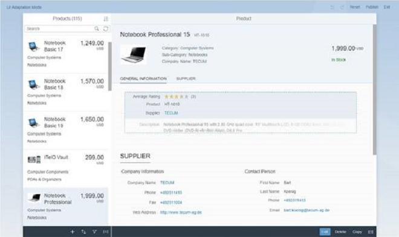

Changed•Feature•Info Only•1.46

</td>
<td valign="top">

Info Only 

</td>
<td valign="top">

2017-05-04

</td>
</tr>
<tr>
<td valign="top">

1.46 

</td>
<td valign="top">

Changed 

</td>
<td valign="top">

Control 

</td>
<td valign="top">

**`sap.gantt`** 

</td>
<td valign="top">

**`sap.gantt`**

-   **Timeline Zooming with Mouse Wheel**: When you hover the mouse over a specific location in the chart area, you can scroll the mouse wheel while holding the [Ctrl\] + [Shift\]  keys to zoom in and out using the mouse pointer location as the zoom center.

-   **Zoom Strategies Enhanced**: The zoom strategies have been enhanced to allow for flexible zooming control. The interface includes a base class of `AxisTimeStrategyBase` and three default implementations. For more information, see the [API Reference](https://ui5.sap.com/#/api/sap.gantt.axistime.AxisTimeStrategyBase) and the [Sample](https://ui5.sap.com/#/entity/sap.gantt.GanttChartContainer/sample/sap.gantt.sample.BasicGanttChart).

-   **Automatic Scrolling**: When you drag a shape near the border of the Gantt chart, the timeline automatically scrolls to follow the shape position. The scrolling works both horizontally and vertically.

Changed•Control•Info Only•1.46

</td>
<td valign="top">

Info Only 

</td>
<td valign="top">

2017-05-04

</td>
</tr>
<tr>
<td valign="top">

1.46 

</td>
<td valign="top">

Changed 

</td>
<td valign="top">

Control 

</td>
<td valign="top">

**`sap.m.ComboBox`** 

</td>
<td valign="top">

**`sap.m.ComboBox`**

-   The value state error message is now visible above all list items in the dropdown list of the `sap.m.ComboBox`. This improves the usability on mobile devices \(tablets and phones\).

-   When the `ComboBox` displays two columns \(for example, key and value\), you can search and filter for matching strings in both columns. This is enabled with the `filterSecondaryValues` property. For more information, see the [API Reference](https://ui5.sap.com/#/api/sap.m.ComboBox/methods/getFilterSecondaryValues) and the [Sample](https://ui5.sap.com/#/entity/sap.m.ComboBox/sample/sap.m.sample.ComboBoxSearchBoth).

Changed•Control•Info Only•1.46

</td>
<td valign="top">

Info Only 

</td>
<td valign="top">

2017-05-04

</td>
</tr>
<tr>
<td valign="top">

1.46 

</td>
<td valign="top">

Changed 

</td>
<td valign="top">

Control 

</td>
<td valign="top">

**`sap.m.DatePicker`** 

</td>
<td valign="top">

**`sap.m.DatePicker`**

We have introduced a new `navigate` event. While navigating in the calendar popup of the `sap.m.DatePicker`, you can now receive an event containing the first and the last dates that are currently visible. You can use this information for lazy loading of special dates. For more information, see the [API Reference](https://ui5.sap.com/#/api/sap.m.DatePicker/events/navigate).

Changed•Control•Info Only•1.46

</td>
<td valign="top">

Info Only 

</td>
<td valign="top">

2017-05-04

</td>
</tr>
<tr>
<td valign="top">

1.46 

</td>
<td valign="top">

Changed 

</td>
<td valign="top">

Control 

</td>
<td valign="top">

**`sap.m.GenericTile`** 

</td>
<td valign="top">

**`sap.m.GenericTile`**

The new `Actions` `scope` property was added to provide an editing option for the `GenericTile` control when included on a Web page, for example, on the SAP Fiori launchpad. It is aligned explicitly with the interaction design of the SAP Fiori launchpad’s *Edit* mode. Both the `sap.m.GenericTile` and `sap.m.SlideTile` controls have been extended with this feature. You use the new `scope` property to switch the visual representation of the `GenericTile` or `SlideTile` on a Web page from the `Display` scope to the `Actions` scope. For more information, see the [API Reference](https://ui5.sap.com/#/api/sap.m.GenericTile) and the [Sample](https://ui5.sap.com/#/entity/sap.m.GenericTile/sample/sap.m.sample.GenericTileLineMode).

Changed•Control•Info Only•1.46

</td>
<td valign="top">

Info Only 

</td>
<td valign="top">

2017-05-04

</td>
</tr>
<tr>
<td valign="top">

1.46 

</td>
<td valign="top">

Changed 

</td>
<td valign="top">

Control 

</td>
<td valign="top">

**`sap.m.Input`** 

</td>
<td valign="top">

**`sap.m.Input`**

**`sap.m.Input`** and all inheriting controls now allow filtering and searching in two or more columns. Matching is done only on the initial character and the matching sequence is displayed in bold in the suggestion list.

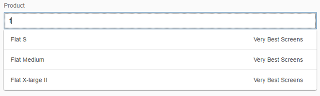

For more information, see the [Sample](https://ui5.sap.com/#/entity/sap.m.Input/sample/sap.m.sample.InputAssistedTwoValues).

Changed•Control•Info Only•1.46

</td>
<td valign="top">

Info Only 

</td>
<td valign="top">

2017-05-04

</td>
</tr>
<tr>
<td valign="top">

1.46 

</td>
<td valign="top">

Changed 

</td>
<td valign="top">

Control 

</td>
<td valign="top">

**`sap.m.MessageBox`** 

</td>
<td valign="top">

**`sap.m.MessageBox`**

**`sap.m.MessageBox`** can now hold and display formatted text \(`sap.m.FormattedText`\) and JSON content. This allows you to display message boxes with complex content. For more information, see the [Sample](https://ui5.sap.com/#/entity/sap.m.MessageBox/sample/sap.m.sample.MessageBoxInfo).

Changed•Control•Info Only•1.46

</td>
<td valign="top">

Info Only 

</td>
<td valign="top">

2017-05-04

</td>
</tr>
<tr>
<td valign="top">

1.46 

</td>
<td valign="top">

Changed 

</td>
<td valign="top">

Control 

</td>
<td valign="top">

**`sap.m.MultiComboBox`** 

</td>
<td valign="top">

**`sap.m.MultiComboBox`**

The delay for text validation in the `sap.m.MultiComboBox` has been changed in order to react correctly to special inputs in non-Latin languages \(for example, Chinese\).

Changed•Control•Info Only•1.46

</td>
<td valign="top">

Info Only 

</td>
<td valign="top">

2017-05-04

</td>
</tr>
<tr>
<td valign="top">

1.46 

</td>
<td valign="top">

Changed 

</td>
<td valign="top">

Control 

</td>
<td valign="top">

**`sap.m.MultiInput`** 

</td>
<td valign="top">

**`sap.m.MultiInput`**

**`sap.m.MultiInput`** has been refactored to improve performance and accessibility. The `tokenChange()` event is deprecated and replaced with the new `tokenUpdate()`. For more information, see the [API Reference](https://ui5.sap.com/#/api/sap.m.MultiInput/events/tokenUpdate).

Changed•Control•Info Only•1.46

</td>
<td valign="top">

Info Only 

</td>
<td valign="top">

2017-05-04

</td>
</tr>
<tr>
<td valign="top">

1.46 

</td>
<td valign="top">

Changed 

</td>
<td valign="top">

Control 

</td>
<td valign="top">

**`sap.m.NotificationListItem / sap.m.NotificationListGroup`** 

</td>
<td valign="top">

**`sap.m.NotificationListItem / sap.m.NotificationListGroup`**

We have implemented several new features:

-   When the maximum number of notifications is reached, a message is shown on the bottom of the `NotificationListGroup` notifying the user about additional notifications that are hidden.

    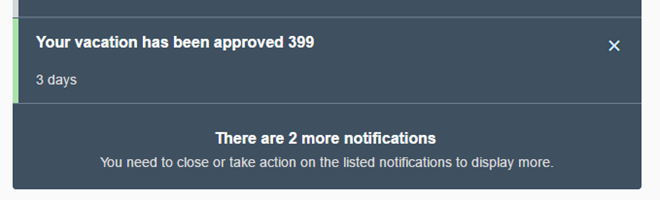

-   Action buttons have been moved from the footer of the `NotificationListItem` to the header to improve usability.

    

For more information, see the samples [Notification List Item](https://ui5.sap.com/#/entity/sap.m.NotificationListItem/sample/sap.m.sample.NotificationListItem) and [Notification List Group with Max Number of Notifications Reached](https://ui5.sap.com/#/entity/sap.m.NotificationListGroup/sample/sap.m.sample.MaxNumberOfNotificationsReached). 

Changed•Control•Info Only•1.46

</td>
<td valign="top">

Info Only 

</td>
<td valign="top">

2017-05-04

</td>
</tr>
<tr>
<td valign="top">

1.46 

</td>
<td valign="top">

Changed 

</td>
<td valign="top">

Control 

</td>
<td valign="top">

**`sap.m.PlanningCalendar`** 

</td>
<td valign="top">

**`sap.m.PlanningCalendar`**

We have introduced a new `rowHeaderClick` event. You can now receive an event when a row header of the `sap.m.PlanningCalendar` is clicked. For more information, see the [API Reference](https://ui5.sap.com/#/api/sap.m.PlanningCalendar/events/rowHeaderClick).

Changed•Control•Info Only•1.46

</td>
<td valign="top">

Info Only 

</td>
<td valign="top">

2017-05-04

</td>
</tr>
<tr>
<td valign="top">

1.46 

</td>
<td valign="top">

Changed 

</td>
<td valign="top">

Control 

</td>
<td valign="top">

**`sap.m.QuickView / sap.m.QuickViewCard`** 

</td>
<td valign="top">

**`sap.m.QuickView / sap.m.QuickViewCard`**

**`sap.m.QuickView`** and **`sap.m.QuickViewCard`** have a new parameter called `navOrigin` that improves the navigation when you use data binding. The new parameter is set in the `navigate` and `afterNavigate` events and holds a link to the originating card. For more information, see the [API Reference](https://ui5.sap.com/#/api/sap.m.QuickViewBase/events/afterNavigate).

Changed•Control•Info Only•1.46

</td>
<td valign="top">

Info Only 

</td>
<td valign="top">

2017-05-04

</td>
</tr>
<tr>
<td valign="top">

1.46 

</td>
<td valign="top">

Changed 

</td>
<td valign="top">

Control 

</td>
<td valign="top">

**`sap.m.Slider / sap.m.RangeSlider`** 

</td>
<td valign="top">

**`sap.m.Slider / sap.m.RangeSlider`**

**`sap.m.Slider`** and **`sap.m.RangeSlider`** can display labels for tick marks. The labels are defined and represented as a `sap.m.ResponsiveScale`, which is logically decoupled from the slider. For more information, see the [API Reference](https://ui5.sap.com/#/api/sap.m.ResponsiveScale) and the [Sample](https://ui5.sap.com/#/entity/sap.m.Slider/sample/sap.m.sample.Slider).

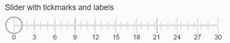

Changed•Control•Info Only•1.46

</td>
<td valign="top">

Info Only 

</td>
<td valign="top">

2017-05-04

</td>
</tr>
<tr>
<td valign="top">

1.46 

</td>
<td valign="top">

Changed 

</td>
<td valign="top">

Control 

</td>
<td valign="top">

**`sap.m.Table`** 

</td>
<td valign="top">

**`sap.m.Table`**

Screen reader support for `sap.m.Table` has been improved. For more information, see the [API Reference](https://ui5.sap.com/#/api/sap.m.Table).

Changed•Control•Info Only•1.46

</td>
<td valign="top">

Info Only 

</td>
<td valign="top">

2017-05-04

</td>
</tr>
<tr>
<td valign="top">

1.46 

</td>
<td valign="top">

Changed 

</td>
<td valign="top">

Control 

</td>
<td valign="top">

**`sap.m.UploadCollection`** 

</td>
<td valign="top">

**`sap.m.UploadCollection`**

To add an item to the upload list, you can also use drag & drop on your desktop or tablet. This feature is available in both the *Instant Upload* and *Upload Pending* scenarios. For more information, see the [API Reference](https://ui5.sap.com/#/api/sap.m.UploadCollection) and the [Samples](https://ui5.sap.com/#/entity/sap.m.UploadCollection).

Changed•Control•Info Only•1.46

</td>
<td valign="top">

Info Only 

</td>
<td valign="top">

2017-05-04

</td>
</tr>
<tr>
<td valign="top">

1.46 

</td>
<td valign="top">

Changed 

</td>
<td valign="top">

Control 

</td>
<td valign="top">

**`sap.suite.ui.commons.Timeline`** 

</td>
<td valign="top">

**`sap.suite.ui.commons.Timeline`**

-   With the new `groupByType` property, you can group timeline posts by a time period. This includes grouping posts by year, quarter, month, week, or day. You can also specify a custom grouping function using the `setCustomGrouping` method.

-   Using the `lazyLoading` property, you can set the timeline to load new posts automatically as the user scrolls along the timeline axis.

For more information, see the [API Reference](https://ui5.sap.com/#/api/sap.suite.ui.commons.Timeline) and the [Samples](https://ui5.sap.com/#/entity/sap.suite.ui.commons.Timeline). 

Changed•Control•Info Only•1.46

</td>
<td valign="top">

Info Only 

</td>
<td valign="top">

2017-05-04

</td>
</tr>
<tr>
<td valign="top">

1.46 

</td>
<td valign="top">

Changed 

</td>
<td valign="top">

Control 

</td>
<td valign="top">

**`sap.ui.comp` \(smart controls\)** 

</td>
<td valign="top">

**`sap.ui.comp` \(smart controls\)**

The samples in the Demo Kit have been enhanced for the `SmartField`, `SmartLink` , and `FilterBar` controls.

Changed•Control•Info Only•1.46

</td>
<td valign="top">

Info Only 

</td>
<td valign="top">

2017-05-04

</td>
</tr>
<tr>
<td valign="top">

1.46 

</td>
<td valign="top">

Changed 

</td>
<td valign="top">

Control 

</td>
<td valign="top">

**`sap.ui.comp.smartfield.SmartField`** 

</td>
<td valign="top">

**`sap.ui.comp.smartfield.SmartField`**

-   Numeric values for annotation `sap:display-format` or `com.sap.vocabularies.Common.v1.IsDigitSequence` \(v4 annotation\) are now displayed without leading zeros, if the annotation is of type `string` and `sap:display-format="NonNegative"`.

-   Email, phone number, and URL annotations are now supported \(`com.sap.vocabularies.Communication.v1.IsEmailAddress`, `com.sap.vocabularies.Communication.v1.IsPhoneNumber`, `Org.OData.Core.V1.IsUrl`\). If you choose the relevant link for each of these annotations, it takes you directly to the required application , for example, the email application on your device for the email annotation.

-   `com.sap.vocabularies.Common.v1.ValueListWithFixedValues` is now supported \(v4 annotation\) and replaces the existing v2 annotation `sap:value-list="fixed-values"`.

For more information, see the [API Reference](https://ui5.sap.com/#/api/sap.ui.comp.smartfield.SmartField) and the [Samples](https://ui5.sap.com/#/entity/sap.ui.comp.smartfield.SmartField/samples).

Changed•Control•Info Only•1.46

</td>
<td valign="top">

Info Only 

</td>
<td valign="top">

2017-05-04

</td>
</tr>
<tr>
<td valign="top">

1.46 

</td>
<td valign="top">

Changed 

</td>
<td valign="top">

Control 

</td>
<td valign="top">

**`sap.ui.comp.SmartFilterBar`** 

</td>
<td valign="top">

**`sap.ui.comp.SmartFilterBar`**

`DateRangeType` now allows for a more sophisticated handling of dates by providing a popover for the field with additional functions, such as a typeahead feature.

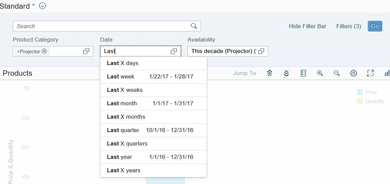

For more information, see the [API Reference](https://ui5.sap.com/#/api/sap.ui.comp.smartfilterbar.SmartFilterBar) and the [Samples](https://ui5.sap.com/#/entity/sap.ui.comp.smartcontrols).

Changed•Control•Info Only•1.46

</td>
<td valign="top">

Info Only 

</td>
<td valign="top">

2017-05-04

</td>
</tr>
<tr>
<td valign="top">

1.46 

</td>
<td valign="top">

Changed 

</td>
<td valign="top">

Control 

</td>
<td valign="top">

**`sap.ui.comp.SmartLink`** 

</td>
<td valign="top">

**`sap.ui.comp.SmartLink`**

You can now restore the previous state of a list of selected links under *Define Links*. For more information, see the [API Reference](https://ui5.sap.com/#/api/sap.ui.comp.navpopover.SmartLink) and the [Sample](https://ui5.sap.com/#/entity/sap.ui.comp.navpopover.SmartLink/sample/sap.ui.comp.sample.smartlink.example_08). 

Changed•Control•Info Only•1.46

</td>
<td valign="top">

Info Only 

</td>
<td valign="top">

2017-05-04

</td>
</tr>
<tr>
<td valign="top">

1.46 

</td>
<td valign="top">

Changed 

</td>
<td valign="top">

Control 

</td>
<td valign="top">

**`sap.ui.comp.smarttable.SmartTable`** 

</td>
<td valign="top">

**`sap.ui.comp.smarttable.SmartTable`**

You can now highlight items, for example to indicate an error. For more information, see the [API Reference](https://ui5.sap.com/#/api/sap.ui.comp.smarttable.SmartTable).

Changed•Control•Info Only•1.46

</td>
<td valign="top">

Info Only 

</td>
<td valign="top">

2017-05-04

</td>
</tr>
<tr>
<td valign="top">

1.46 

</td>
<td valign="top">

Changed 

</td>
<td valign="top">

Control 

</td>
<td valign="top">

**`sap.ui.layout.form.Form`** 

</td>
<td valign="top">

**`sap.ui.layout.form.Form`**

The samples in the Demo Kit have been improved.

Changed•Control•Info Only•1.46

</td>
<td valign="top">

Info Only 

</td>
<td valign="top">

2017-05-04

</td>
</tr>
<tr>
<td valign="top">

1.46 

</td>
<td valign="top">

Changed 

</td>
<td valign="top">

Control 

</td>
<td valign="top">

**`sap.ui.table.*`** 

</td>
<td valign="top">

**`sap.ui.table.*`**

-   Keyboard navigation has been enhanced for *Edit* mode.

-   You can now define row-specific actions, such as navigation. The actions remain available on the right even when you scroll horizontally.

For more information, see the [API Reference](https://ui5.sap.com/#/api/sap.ui.Table) and the [Sample](https://ui5.sap.com/#/entity/sap.ui.table.Table/sample/sap.ui.table.sample.RowAction). 

Changed•Control•Info Only•1.46

</td>
<td valign="top">

Info Only 

</td>
<td valign="top">

2017-05-04

</td>
</tr>
<tr>
<td valign="top">

1.46 

</td>
<td valign="top">

Changed 

</td>
<td valign="top">

SAP Fiori Elements 

</td>
<td valign="top">

**SAP Fiori Elements** 

</td>
<td valign="top">

**SAP Fiori Elements**

**List Report and Object Page**

General Features:

-   Direct links from fields

    Using the `DataFieldWithIntentBasedNavigation` annotation, fields can now link directly to a specific action of a semantic object instead of using the smart link popup. For more information, see [Configuring External Navigation](../06_SAP_Fiori_Elements/configuring-external-navigation-1d4a0f9.md).

-   Navigation targets

    Table toolbar actions for intent-based navigation are now displayed or hidden based on the availability of the navigation target on the current platform.

-   Navigation at row level

    In grid and analytical tables, users can now navigate to the object page, at row level. The *Show Detail* button has been removed for these tables. For more information, see [Tables](../06_SAP_Fiori_Elements/tables-c0f6592.md).

Object Page View:

-   Performance optimization for side effects

    Previously, if no side effect annotation was specified, the whole object page was refreshed upon a change. Now, if there is no side effect annotation, the page is not refreshed automatically. This system behavior optimizes performance. For backward compatibility reasons, you have to enable the new system behavior in the application descriptor. For more information, see [Using Global Side Effects](../06_SAP_Fiori_Elements/using-global-side-effects-955ae31.md).

-   Form actions

    You can now add form actions to toolbars in object page facets. The following actions are supported:

    -   `DateFieldForActions`

    -   `DateFieldForIntentBasedNavigation`

    -   Custom actions using an extension point

    For more information, see [Adding Action Buttons to Forms in Sections](../06_SAP_Fiori_Elements/adding-action-buttons-to-forms-in-sections-e64efda.md) and [Adding Custom Actions Using Extension Points](../06_SAP_Fiori_Elements/adding-custom-actions-using-extension-points-7619517.md).

-   Contact information

    Quickviews with contact details can now also be displayed in forms and tables. For more information, see [Form Facet](../06_SAP_Fiori_Elements/form-facet-ff0ae0b.md).

-   Create and edit mode usability

    In create and edit draft mode, subitem object pages contain an *Apply* action in the footer. This action concludes the current create or edit activity, saves the draft, and navigates one step up in the object hierarchy. For more information, see [Draft Handling](../06_SAP_Fiori_Elements/draft-handling-ed9aa41.md).

List Report View:

-   Tree table

    You can now use tree tables in the list report page. Note that you can use this table type only in apps for ready-only scenarios. For more information, see [Tables](../06_SAP_Fiori_Elements/tables-c0f6592.md).

**Overview Pages \(OVP\)**

Overview pages have been enhanced with the following features:

-   **Custom Breakout Filters**

    You can now use custom breakout filters to add custom filters of your choice. You can also define custom controls for implementing custom filters. For more information, see [Configuring the Global Filter](../06_SAP_Fiori_Elements/configuring-the-global-filter-73d9693.md).

-   **Passing Sorting Parameters from OVP to an SAP Fiori Elements App**

    You can now pass sort order parameters when you navigate from OVP to an external SAP Fiori elements application. For more information, see [Configuring Sort Properties](../06_SAP_Fiori_Elements/configuring-sort-properties-41af842.md).

-   **Link List Card Enhancement**

    The *Link List* card has been enhanced to align with other overview page cards. It now supports qualifiers in annotations and global filter usage for dynamic data. For more information, see [Link List Cards](../06_SAP_Fiori_Elements/link-list-cards-0326f91.md).

-   **UI Enhancements**

    -   Page loading error messages overlay the entire overview page and appear as a full page message.

    -   The smart filter bar is aligned to match the width of cards.

    -   The content area in list cards and bar chart list cards is now flexible and responsive.

    -   The text area truncates based on the length of the values.

    -   Support for Belize theme for overview page applications. Using the SAP UI theme designer you can customize your application styles.

Changed•SAP Fiori Elements•Info Only•1.46

</td>
<td valign="top">

Info Only 

</td>
<td valign="top">

2017-05-04

</td>
</tr>
<tr>
<td valign="top">

1.46 

</td>
<td valign="top">

Changed 

</td>
<td valign="top">

Feature 

</td>
<td valign="top">

**Demo Kit Improvements** 

</td>
<td valign="top">

**Demo Kit Improvements**

-   You can now switch the *Samples* to the new *High Contrast White* theme from the *Settings* menu.

-   We reworked the landing page for the *Demo Apps* in the Demo Kit. It now features and highlights demo apps in multiple categories, and tests and related documentation chapters are now linked. Check it out at [Demo Apps](https://ui5.sap.com/#demoapps).

-   New and reworked demo apps:

    -   *Browse Orders*: A new master-detail app with features for browsing orders

        

    -   *RTA \(FLP\)*: UI Adaptation at Runtime \(RTA\) with SAP Fiori 2.0 design with SAP Fiori launchpad features

        For more information, see [SAPUI5 Flexibility: Enable Your App for UI Adaptation](../05_Developing_Apps/sapui5-flexibility-enable-your-app-for-ui-adaptation-f1430c0.md).

        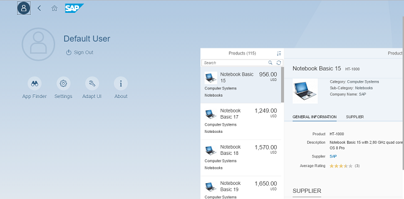

    -   *Shop Administrator*: The tool page demo app has been completely renovated and now showcases a shop administration scenario with controls from the `sap.tnt`, `sap.ui.layout`, and `sap.suite.ui` library.

        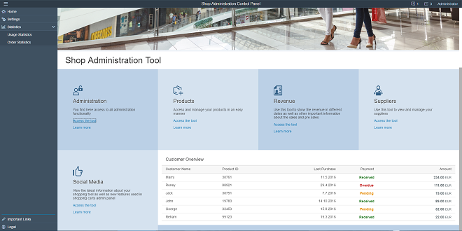

Changed•Feature•Info Only•1.46

</td>
<td valign="top">

Info Only 

</td>
<td valign="top">

2017-05-04

</td>
</tr>
</table>

**Related Information**  

[What's New in SAPUI5 1.132](what-s-new-in-sapui5-1-132-bd2e61f.md "With this release SAPUI5 is upgraded from version 1.131 to 1.132.")

[What's New in SAPUI5 1.131](what-s-new-in-sapui5-1-131-7d24d94.md "With this release SAPUI5 is upgraded from version 1.130 to 1.131.")

[What's New in SAPUI5 1.130](what-s-new-in-sapui5-1-130-85609d4.md "With this release SAPUI5 is upgraded from version 1.129 to 1.130.")

[What's New in SAPUI5 1.129](what-s-new-in-sapui5-1-129-d22b8af.md "With this release SAPUI5 is upgraded from version 1.128 to 1.129.")

[What's New in SAPUI5 1.128](what-s-new-in-sapui5-1-128-1f76220.md "With this release SAPUI5 is upgraded from version 1.127 to 1.128.")

[What's New in SAPUI5 1.127](what-s-new-in-sapui5-1-127-e5e1317.md "With this release SAPUI5 is upgraded from version 1.126 to 1.127.")

[What's New in SAPUI5 1.126](what-s-new-in-sapui5-1-126-1d98116.md "With this release SAPUI5 is upgraded from version 1.125 to 1.126.")

[What's New in SAPUI5 1.125](what-s-new-in-sapui5-1-125-9d87044.md "With this release SAPUI5 is upgraded from version 1.124 to 1.125.")

[What's New in SAPUI5 1.124](what-s-new-in-sapui5-1-124-7f77c3f.md "With this release SAPUI5 is upgraded from version 1.123 to 1.124.")

[What's New in SAPUI5 1.123](what-s-new-in-sapui5-1-123-9d00ac7.md "With this release SAPUI5 is upgraded from version 1.122 to 1.123.")

[What's New in SAPUI5 1.122](what-s-new-in-sapui5-1-122-5d078da.md "With this release SAPUI5 is upgraded from version 1.121 to 1.122.")

[What's New in SAPUI5 1.121](what-s-new-in-sapui5-1-121-91a4a2f.md "With this release SAPUI5 is upgraded from version 1.120 to 1.121.")

[What's New in SAPUI5 1.120](what-s-new-in-sapui5-1-120-2359b63.md "With this release SAPUI5 is upgraded from version 1.119 to 1.120.")

[What's New in SAPUI5 1.119](what-s-new-in-sapui5-1-119-0b1903a.md "With this release SAPUI5 is upgraded from version 1.118 to 1.119.")

[What's New in SAPUI5 1.118](what-s-new-in-sapui5-1-118-3eecbde.md "With this release SAPUI5 is upgraded from version 1.117 to 1.118.")

[What's New in SAPUI5 1.117](what-s-new-in-sapui5-1-117-029d3b4.md "With this release SAPUI5 is upgraded from version 1.116 to 1.117.")

[What's New in SAPUI5 1.116](what-s-new-in-sapui5-1-116-ebd6f34.md "With this release SAPUI5 is upgraded from version 1.115 to 1.116.")

[What's New in SAPUI5 1.115](what-s-new-in-sapui5-1-115-409fde8.md "With this release SAPUI5 is upgraded from version 1.114 to 1.115.")

[What's New in SAPUI5 1.114](what-s-new-in-sapui5-1-114-890fce1.md "With this release SAPUI5 is upgraded from version 1.113 to 1.114.")

[What's New in SAPUI5 1.113](what-s-new-in-sapui5-1-113-a9553fe.md "With this release SAPUI5 is upgraded from version 1.112 to 1.113.")

[What's New in SAPUI5 1.112](what-s-new-in-sapui5-1-112-34afc69.md "With this release SAPUI5 is upgraded from version 1.111 to 1.112.")

[What's New in SAPUI5 1.111](what-s-new-in-sapui5-1-111-7a67837.md "With this release SAPUI5 is upgraded from version 1.110 to 1.111.")

[What's New in SAPUI5 1.110](what-s-new-in-sapui5-1-110-71a855c.md "With this release SAPUI5 is upgraded from version 1.109 to 1.110.")

[What's New in SAPUI5 1.109](what-s-new-in-sapui5-1-109-3264bd2.md "With this release SAPUI5 is upgraded from version 1.108 to 1.109.")

[What's New in SAPUI5 1.108](what-s-new-in-sapui5-1-108-66e33f0.md "With this release SAPUI5 is upgraded from version 1.107 to 1.108.")

[What's New in SAPUI5 1.107](what-s-new-in-sapui5-1-107-d4ff916.md "With this release SAPUI5 is upgraded from version 1.106 to 1.107.")

[What's New in SAPUI5 1.106](what-s-new-in-sapui5-1-106-5b497b0.md "With this release SAPUI5 is upgraded from version 1.105 to 1.106.")

[What's New in SAPUI5 1.105](what-s-new-in-sapui5-1-105-4d6c00e.md "With this release SAPUI5 is upgraded from version 1.104 to 1.105.")

[What's New in SAPUI5 1.104](what-s-new-in-sapui5-1-104-69e567c.md "With this release SAPUI5 is upgraded from version 1.103 to 1.104.")

[What's New in SAPUI5 1.103](what-s-new-in-sapui5-1-103-0e98c76.md "With this release SAPUI5 is upgraded from version 1.102 to 1.103.")

[What's New in SAPUI5 1.102](what-s-new-in-sapui5-1-102-f038c99.md "With this release SAPUI5 is upgraded from version 1.101 to 1.102.")

[What's New in SAPUI5 1.101](what-s-new-in-sapui5-1-101-7733b00.md "With this release SAPUI5 is upgraded from version 1.100 to 1.101.")

[What's New in SAPUI5 1.100](what-s-new-in-sapui5-1-100-27dec1d.md "With this release SAPUI5 is upgraded from version 1.99 to 1.100.")

[What's New in SAPUI5 1.99](what-s-new-in-sapui5-1-99-4f35848.md "With this release SAPUI5 is upgraded from version 1.98 to 1.99.")

[What's New in SAPUI5 1.98](what-s-new-in-sapui5-1-98-d9f16f2.md "With this release SAPUI5 is upgraded from version 1.97 to 1.98.")

[What's New in SAPUI5 1.97](what-s-new-in-sapui5-1-97-fa0e282.md "With this release SAPUI5 is upgraded from version 1.96 to 1.97.")

[What's New in SAPUI5 1.96](what-s-new-in-sapui5-1-96-7a9269f.md "With this release SAPUI5 is upgraded from version 1.95 to 1.96.")

[What's New in SAPUI5 1.95](what-s-new-in-sapui5-1-95-a1aea67.md "With this release SAPUI5 is upgraded from version 1.94 to 1.95.")

[What's New in SAPUI5 1.94](what-s-new-in-sapui5-1-94-c40f1e6.md "With this release SAPUI5 is upgraded from version 1.93 to 1.94.")

[What's New in SAPUI5 1.93](what-s-new-in-sapui5-1-93-f273340.md "With this release SAPUI5 is upgraded from version 1.92 to 1.93.")

[What's New in SAPUI5 1.92](what-s-new-in-sapui5-1-92-1ef345d.md "With this release SAPUI5 is upgraded from version 1.91 to 1.92.")

[What's New in SAPUI5 1.91](what-s-new-in-sapui5-1-91-0a2bd79.md "With this release SAPUI5 is upgraded from version 1.90 to 1.91.")

[What's New in SAPUI5 1.90](what-s-new-in-sapui5-1-90-91c10c2.md "With this release SAPUI5 is upgraded from version 1.89 to 1.90.")

[What's New in SAPUI5 1.89](what-s-new-in-sapui5-1-89-e56cddc.md "With this release SAPUI5 is upgraded from version 1.88 to 1.89.")

[What's New in SAPUI5 1.88](what-s-new-in-sapui5-1-88-e15a206.md "With this release SAPUI5 is upgraded from version 1.87 to 1.88.")

[What's New in SAPUI5 1.87](what-s-new-in-sapui5-1-87-b506da7.md "With this release SAPUI5 is upgraded from version 1.86 to 1.87.")

[What's New in SAPUI5 1.86](what-s-new-in-sapui5-1-86-4c1c959.md "With this release SAPUI5 is upgraded from version 1.85 to 1.86.")

[What's New in SAPUI5 1.85](what-s-new-in-sapui5-1-85-1d18eb5.md "With this release SAPUI5 is upgraded from version 1.84 to 1.85.")

[What's New in SAPUI5 1.84](what-s-new-in-sapui5-1-84-dc76640.md "With this release SAPUI5 is upgraded from version 1.82 to 1.84.")

[What's New in SAPUI5 1.82](what-s-new-in-sapui5-1-82-3a8dd13.md "With this release SAPUI5 is upgraded from version 1.81 to 1.82.")

[What's New in SAPUI5 1.81](what-s-new-in-sapui5-1-81-f5e2a21.md "With this release SAPUI5 is upgraded from version 1.80 to 1.81.")

[What's New in SAPUI5 1.80](what-s-new-in-sapui5-1-80-8cee506.md "With this release SAPUI5 is upgraded from version 1.79 to 1.80.")

[What's New in SAPUI5 1.79](what-s-new-in-sapui5-1-79-99c4cdc.md "With this release SAPUI5 is upgraded from version 1.78 to 1.79.")

[What's New in SAPUI5 1.78](what-s-new-in-sapui5-1-78-f09b63e.md "With this release SAPUI5 is upgraded from version 1.77 to 1.78.")

[What's New in SAPUI5 1.77](what-s-new-in-sapui5-1-77-c46b439.md "With this release SAPUI5 is upgraded from version 1.76 to 1.77.")

[What's New in SAPUI5 1.76](what-s-new-in-sapui5-1-76-aad03b5.md "With this release SAPUI5 is upgraded from version 1.75 to 1.76.")

[What's New in SAPUI5 1.75](what-s-new-in-sapui5-1-75-5cbb62d.md "With this release SAPUI5 is upgraded from version 1.74 to 1.75.")

[What's New in SAPUI5 1.74](what-s-new-in-sapui5-1-74-c22208a.md "With this release SAPUI5 is upgraded from version 1.73 to 1.74.")

[What's New in SAPUI5 1.73](what-s-new-in-sapui5-1-73-231dd13.md "With this release SAPUI5 is upgraded from version 1.72 to 1.73.")

[What's New in SAPUI5 1.72](what-s-new-in-sapui5-1-72-521cad9.md "With this release SAPUI5 is upgraded from version 1.71 to 1.72.")

[What's New in SAPUI5 1.71](what-s-new-in-sapui5-1-71-a93a6a3.md "With this release SAPUI5 is upgraded from version 1.70 to 1.71.")

[What's New in SAPUI5 1.70](what-s-new-in-sapui5-1-70-f073d69.md "With this release SAPUI5 is upgraded from version 1.69 to 1.70.")

[What's New in SAPUI5 1.69](what-s-new-in-sapui5-1-69-89a18bd.md "With this release SAPUI5 is upgraded from version 1.68 to 1.69.")

[What's New in SAPUI5 1.68](what-s-new-in-sapui5-1-68-f94bf93.md "With this release SAPUI5 is upgraded from version 1.67 to 1.68.")

[What's New in SAPUI5 1.67](what-s-new-in-sapui5-1-67-a6b1472.md "With this release SAPUI5 is upgraded from version 1.66 to 1.67.")

[What's New in SAPUI5 1.66](what-s-new-in-sapui5-1-66-c9896e9.md "With this release SAPUI5 is upgraded from version 1.65 to 1.66.")

[What's New in SAPUI5 1.65](what-s-new-in-sapui5-1-65-0f5acfd.md "With this release SAPUI5 is upgraded from version 1.64 to 1.65.")

[What's New in SAPUI5 1.64](what-s-new-in-sapui5-1-64-0e30822.md "With this release SAPUI5 is upgraded from version 1.63 to 1.64.")

[What's New in SAPUI5 1.63](what-s-new-in-sapui5-1-63-e8d9da7.md "With this release SAPUI5 is upgraded from version 1.62 to 1.63.")

[What's New in SAPUI5 1.62](what-s-new-in-sapui5-1-62-771f4d5.md "With this release SAPUI5 is upgraded from version 1.61 to 1.62.")

[What's New in SAPUI5 1.61](what-s-new-in-sapui5-1-61-d991552.md "With this release SAPUI5 is upgraded from version 1.60 to 1.61.")

[What's New in SAPUI5 1.60](what-s-new-in-sapui5-1-60-5a0e1f7.md "With this release SAPUI5 is upgraded from version 1.58 to 1.60.")

[What's New in SAPUI5 1.58](what-s-new-in-sapui5-1-58-7c927aa.md "With this release SAPUI5 is upgraded from version 1.56 to 1.58.")

[What's New in SAPUI5 1.56](what-s-new-in-sapui5-1-56-108b7fd.md "With this release SAPUI5 is upgraded from version 1.54 to 1.56.")

[What's New in SAPUI5 1.54](what-s-new-in-sapui5-1-54-c838330.md "With this release SAPUI5 is upgraded from version 1.52 to 1.54.")

[What's New in SAPUI5 1.52](what-s-new-in-sapui5-1-52-849e1b6.md "With this release SAPUI5 is upgraded from version 1.50 to 1.52.")

[What's New in SAPUI5 1.50](what-s-new-in-sapui5-1-50-759e9f3.md "With this release SAPUI5 is upgraded from version 1.48 to 1.50.")

[What's New in SAPUI5 1.48](what-s-new-in-sapui5-1-48-fa1efac.md "With this release SAPUI5 is upgraded from version 1.46 to 1.48.")

[What's New in SAPUI5 1.44](what-s-new-in-sapui5-1-44-a0cb7a0.md "With this release SAPUI5 is upgraded from version 1.42 to 1.44.")

[What's New in SAPUI5 1.42](what-s-new-in-sapui5-1-42-468b05d.md "With this release SAPUI5 is upgraded from version 1.40 to 1.42.")

[What's New in SAPUI5 1.40](what-s-new-in-sapui5-1-40-fbab50e.md "With this release SAPUI5 is upgraded from version 1.38 to 1.40.")

[What's New in SAPUI5 1.38](what-s-new-in-sapui5-1-38-f218918.md "With this release SAPUI5 is upgraded from version 1.36 to 1.38.")

