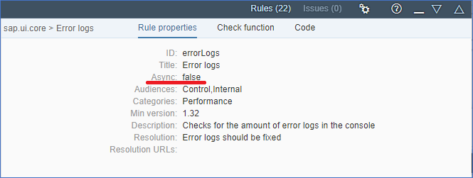
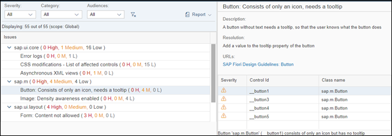

<!-- loioa09dd79a24c041d288402768558a1d1a -->

# What's New in SAPUI5 1.52

With this release, SAPUI5 is upgraded from version 1.50 to 1.52.


<a name="loioa09dd79a24c041d288402768558a1d1a__section_rgc_dhg_x1b"/>

## Improved Features


### OData V2 Model

You can now optimize dependent bindings in OData V2 models. The OData V2 model now supports a `preliminaryContext` flag. When set to `true`, the OData model can bundle the OData calls for dependent bindings into fewer `$batch` requests. Two bindings are considered dependent if one cannot be resolved without the other being resolved first. For example, a relative binding cannot be resolved without a resolved absolute binding.


### SAPUI5 OData V4 Model

The new version of the SAPUI5 The OData V4 model has the following features:

-   Handling of `Edm.Stream` in read-only mode

-   Possibility to declare several batch groups as `$auto` or `$direct`

-   Enhancements to the adapter to use the V4 model with an OData V2 service: handling of simple `$filter` expressions


> ### Caution:  
> **Incompatibility Due to a Bug Fix**
> 
> If you call the [sap.ui.model.odata.v4.Context\#getObject\(\)](https://ui5.sap.com/#/api/sap.ui.model.odata.v4.Context/methods/getObject) or the [sap.ui.model.odata.v4.Context\#requestObject\(\)](https://ui5.sap.com/#/api/sap.ui.model.odata.v4.Context/methods/requestObject) methods without a parameter, the expected and documented behavior is that the same result is returned as if the parameter `sPath=""` had been specified. However, due to a bug, the return value wraps the expected output and can only be accessed using `.value[0]`, for example `oContext.getObject().value[0]`.
> 
> **If you have used this workaround, your application will break as of SAPUI5 version 1.44.7.**
> 
> **Solution**: If your application needs to run with both the fixed and unfixed versions of SAPUI5, specify the `sPath=""` parameter, for the `sPath` parameter. In both cases, you **must not** use the `.value[0]`workaround any more.

> ### Restriction:  
> Due to the limited feature scope of this version of the SAPUI5 OData V4 model, check that all required features are in place before developing applications. Check the detailed documentation of the features, as certain parts of a feature may be missing. While we aim to be compatible with existing controls, some controls might not work due to small incompatibilities compared to `sap.ui.model.odata.(v2.)ODataModel`, or due to missing features in the model \(such as tree binding\). This also applies to Smart Controls \(`sap.ui.comp` library\) and SAP Fiori elements that do not support the SAPUI5 OData V4 model, as well as controls such as `TreeTable` and `AnalyticalTable`, which are not supported together with the SAPUI5 OData V4 model. The interface for applications has been changed for easier and more efficient use of the model. For a summary of these changes, see [Changes Compared to OData V2 Model](../04_Essentials/changes-compared-to-odata-v2-model-abd4d7c.md).

For more information, see [OData V4 Model](../04_Essentials/odata-v4-model-5de13cf.md), the [API Reference](https://ui5.sap.com/#/api/sap.ui.model.odata.v4), and the [sample](https://ui5.sap.com/#/entity/sap.ui.model.odata.v4.ODataModel) in the Demo Kit.


### Support Assistant

Support Assistant has been enhanced with the following features:

  

-   Additional rule property *Async*

    The default value of this property is `false`. If you set it to `true`, a resolve function is passed as a parameter of the check function to allow you to resolve the asynchronous operation. Call `fnResolve` to indicate that the asynchronous check function has finished. The asynchronous function waits 10 seconds before it times out.

-   New options to check the location from which Support Assistant has been loaded:

    -   When you click the *Settings* button in the Support Assistant toolbar, you can see the URL at the bottom of the dialog box. A *Copy* button next to the URL allows you to copy the location to the clipboard.

    -   In the *Technical Information* section of the report.


-   Displaying issues and their severity

    After an analysis run, you can see how many issues of each severity have been reported for each library. This information is also available for the individual rules. In the *Details* section for each rule, you can see a severity icon for each issue generated by that rule.

      


### Spreadsheet Export

`sap.ui.export`: This library provides APIs for exporting a client-side spreadsheet using an XLSX file format. The API has been enhanced and now supports additional types of formatting \(for example, Boolean values and units of measures\). For more information, see the [API Reference](https://ui5.sap.com/#/api/sap.ui.export.Spreadsheet) and the [Samples](https://ui5.sap.com/#/entity/sap.ui.export.Spreadsheet).


<a name="loioa09dd79a24c041d288402768558a1d1a__section_sgc_dhg_x1b"/>

## Improved Controls

-   `sap.f.DynamicPage`:
    -   Additional visual indicators \(arrow buttons\) are now available. They are positioned either below the header \(when the header is expanded\) or below the title \(when the header is collapsed\). The expanded/collapsed state of the header can be toggled by clicking on the title or the arrow buttons. Both areas get a darker color when hovering over them. For more information, see the [sample](https://ui5.sap.com/#/sample/sap.f.sample.DynamicPageFreeStyle/preview).

    -   A new area, designated for breadcrumb navigation, has been introduced at the top-left area of the title of the page. It is enabled with the new `breadcrumbs` aggregation \(type `sap.m.IBreadcrumbs`\) that belongs to `sap.f.DynamicPageTitle`. For more information, see the [API Reference](https://ui5.sap.com/#/api/sap.f.DynamicPageTitle) and the [sample](https://ui5.sap.com/#/sample/sap.f.sample.DynamicPageFreeStyle/preview).

    -   The `sap.f.DynamicPageTitle` has a new `navigationActions` aggregation, which is meant for buttons with navigation semantics, such as *Close*, *Full screen*, and *Exit full screen*. For more information, see the [API Reference](https://ui5.sap.com/#/api/sap.f.DynamicPageTitle) and the [sample](https://ui5.sap.com/#/sample/sap.f.sample.DynamicPageFreeStyle/preview).

    -   The `sap.f.DynamicPageTitle` has two new aggregations: `expandedHeading` and `snappedHeading`. They enable the app to display different content in the heading for the expanded and collapsed states of the header. The previous `heading` aggregation is not deprecated and works as a replacement for the new ones. For more information, see the [API Reference](https://ui5.sap.com/#/api/sap.f.DynamicPageTitle).


-   `sap.f.semantic.SemanticPage`:
    -   The control has a new `titleContent` aggregation and `titlePrimaryArea` property. The aggregation allows you as an app developer to place content in the middle of the title area, displayed in both expanded and collapsed \(snapped\) states of the header. The property determines which of the title areas \(`Begin`, `Middle`\) is primary \(shrinking at a lower rate, remaining visible as long as it can\). For more information, see the [API Reference](https://ui5.sap.com/#/api/sap.f.semantic.SemanticPage) and the [sample](https://ui5.sap.com/#/sample/sap.f.sample.SemanticPageFreeStyle/preview).

    -   The new `navigationActions` aggregation that belongs to the `sap.f.DynamicPageTitle` is now utilized when using the `closeAction`, `fullScreenAction`, and `exitFullScreenAction` aggregations of the `SemanticPage`. The content added in the aggregations is automatically positioned in the title in an ordered way. For more information, see the [API Reference](https://ui5.sap.com/#/api/sap.f.DynamicPageTitle).


-   `sap.m.CheckBox`: A new `useEntireWidth` Boolean property determines whether the value set for the `width` property applies to the whole control or to the control label only. For more information, see the [API Reference](https://ui5.sap.com/#/api/sap.m.CheckBox).

-   `sap.m.DateRangeSelection`: The binding is improved and the control now supports date intervals. For more information, see the [API Reference](https://ui5.sap.com/#/api/sap.m.DateRangeSelection).

-   `sap.m.FeedListItem` provides new actions for defining additional features. You can find the features in an `sap.m.ActionSheet` when you press the *Action* button. For more information, see the [API Reference](https://ui5.sap.com/#/api/sap.m.FeedListItemAction).

-   `sap.m.MessagePage`: A new `iconAlt` property has been introduced. It enables the setting of an `alt` attribute for the icon displayed on the `sap.m.MessagePage`. For more information, see the [API Reference](https://ui5.sap.com/#/api/sap.m.MessagePage).

-   `sap.m.MessageView` has new default behavior and a new property. These changes aim to save space on the screen and hide unnecessary controls.

    -   If only one item is available, the details page for the first item is used as the initial page after opening a `MessagePopover` or rendering a `MessageView`.

    -   If there are messages of only one type, the filtering options in the header will be hidden.

    -   A new `showDetailsPageHeader` Boolean property for hiding the details page header has been introduced. When set to `false`, no header will be displayed in the details section of the message.


    For more information, see the [Sample](https://ui5.sap.com/#/sample/sap.m.sample.MessageViewInsideDialog/preview). 

-   `sap.m.OverflowToolbar`: Until now, controls needed to be whitelisted in a central helper class to be allowed to move to the overflow menu. With the addition of the new `sap.m.IOverflowToolbarContent` interface, each control can now provide this data on its own, without needing to be whitelisted. For more information, see the [API Reference](https://ui5.sap.com/#/api/sap.m.IOverflowToolbarContent).

-   `sap.m.PlanningCalendar`: There is a new `showWeekNumbers` property that enables the display of the calendar week numbers. They are available for the *Days*, *1 Week*, and *1 Month* views of the `sap.m.PlanningCalendar`. For more information, see the [API Reference](https://ui5.sap.com/#/api/sap.m.PlanningCalendar) and the [sample](https://ui5.sap.com/#/sample/sap.m.sample.PlanningCalendar/preview).

-   `sap.m.QuickView` has new default behavior. When the *QuickView* is only one page, and when no header is set, the header is no longer rendered. For more information, see the [Sample](https://ui5.sap.com/#/sample/sap.m.sample.QuickView/preview).

-   `sap.m.RatingIndicator` has a new `editable` property. When set to `true`, the control can be edited and you can rate using the icons. When set to `false`, the rating indicator is presented in a non-interactive mode and can be used, for example, to visualize an aggregated rating score.

-   `sap.m.SegmentedButton`: After the `buttons` aggregation was deprecated in version 1.28, both the `select` event and `selectedButton` association are no longer useful for the recommended `items` aggregation. For this reason, the `select` event and `selectedButton` association are deprecated as of version 1.52 and are replaced by new ones - the `selectionChange` event and the `selectedItem` association. For more information, see the [API Reference](https://ui5.sap.com/#/api/sap.m.SegmentedButton) and the [sample](https://ui5.sap.com/#/sample/sap.m.sample.SegmentedButton/preview).

-   `sap.m.Table` and `sap.ui.table.Table`: Alternate row styling is now supported with the new `alternateRowColors` property. For more information, see the [API Reference](https://ui5.sap.com/#/api/sap.m.Table/overview) and the [Sample](https://ui5.sap.com/#/sample/sap.m.sample.TableAlternateRowColors/preview) for `sap.m.Table` and the [API Reference](https://ui5.sap.com/#/api/sap.ui.table.Table/overview) and the [Sample](https://ui5.sap.com/#/sample/sap.m.sample.TableAlternateRowColors/preview) for `sap.ui.table.Table`. 

-   `sap.m.Table`: A new `popinLayout` property has been added that defines the layout for pop-in rows. For more information, see the [API Reference](https://ui5.sap.com/#/api/sap.m.Table/controlProperties) and the [Sample](https://ui5.sap.com/#/sample/sap.m.sample.Table/preview).

-   `sap.m.Text` has a new `renderWhitespace` property. It specifies the rendering of whitespace characters \(`“ “`\) and tabs \(`\t`\) inside the control. The default value is `false`. If set to `true`, the browser preserves whitespace characters and tabs. Line breaks \(`\r\n`, `\n\r`, `\r`, `\n`\) are always visualized unless the `wrapping` property is set to `false`. For more information, see the [API Reference](https://ui5.sap.com/#/api/sap.m.Text) and the [Samples](https://ui5.sap.com/#/sample/sap.m.sample.TextRenderWhitespace/preview).

-   `sap.m.Title` has a new `wrapping` property. It determines if the title will be wrapped. The default value is `false`. If set to `true`, the entire title is wrapped. You should only activate the wrapping if the surrounding container allows flexible heights. For more information, see the [API Reference](https://ui5.sap.com/#/api/sap.m.Title/methods/setWrapping) and the [Samples](https://ui5.sap.com/#/sample/sap.m.sample.TitleWrapping/preview).

-   `sap.rules.ui.RuleBuilder`:

    -   This control now enables business users to create a text rule, which has a condition part \(`IF, ELSEIF`\) and result parts \(`THEN, ELSE`\) with the auto-suggest and validation services.

    -   The refresh data object feature reads the attributes of the data object and automatically fetches the predefined result attributes when any property \(`add`, `edit`, `delete`\) of an attribute is changed in the decision table.

    -   Different data objects can be selected as a result attribute in the settings of both the decision table and text rule. The attributes of the selected data objects are used in the predefined results table. The access mode is set according to the initial settings provided for the selected data object.


    For more information, see [Rule Builder Control](../03_Get-Started/rule-builder-control-67fcb30.md), the [API Reference](https://ui5.sap.com/#/api/sap.rules.ui.RuleBuilder), and the [Samples](https://ui5.sap.com/#/entity/sap.rules.ui.RuleBuilder).

-   `sap.tnt.NavigationList` and `sap.tnt.SideNavigation` have a new `selectedItem` association. It allows you to specify which `NavigationListItem` will be selected when you load the page and enables you to change the selected *Menu* item using the code. For more information, see the [API Reference](https://ui5.sap.com/#/api/sap.tnt.SideNavigation) and the [Samples](https://ui5.sap.com/#/sample/sap.tnt.sample.SideNavigation/preview).

-   `sap.tnt.NavigationListItem` has a new `visible` property. It allows you to choose if a `NavigationListItem` will be rendered in the `NavigationList` or not. By default it is set to `true`. For more information, see the [API Reference](https://ui5.sap.com/#/api/sap.tnt.NavigationListItem) and the [Samples](https://ui5.sap.com/#/sample/sap.tnt.sample.NavigationList/preview).

-   `sap.ui.comp.smartchart.SmartChart`: The `SmartChart` control now fires an event when dimensions, measures, and data points change. For more information, see the [API Reference](https://ui5.sap.com/#/api/sap.ui.comp.smartchart.SmartChart) .
-   `sap.ui.comp.smartfield.SmartField`: The `SmartField` control now also supports the `Text` and `TextArrangement` annotations in edit mode if the new property `textArrangementInEditMode` has been set to `true`. This way a description can be shown next to a value of a field. For more information, see the [API Reference](https://ui5.sap.com/#/api/sap.ui.comp.smartfield.SmartField).
-   `sap.ui.comp.smartfilterbar.SmartFilterBar`: The `SmartFilterBar` control now only evaluates navigation properties that are provided in the `navigationProperties` property if the `useProvidedNavigationProperties` property has been set to `true`. None of the other associations are displayed in the *Adapt Filters* dialog box as filters. For more information, see the [API Reference](https://ui5.sap.com/#/api/sap.ui.comp.smartfilterbar.SmartFilterBar/methods/getUseProvidedNavigationProperties).
-   `sap.ui.comp.smarttable.SmartTable`:

    -   Experimental support for the client-side spreadsheet export with the `sap.ui.export` library has become productive. The default of the `exportType` property has been changed from `sap.ui.comp.smarttable.ExportType.GW` to `sap.ui.comp.smarttable.ExportType.UI5Client`. For more information, see the [API Reference for `sap.ui.comp.smarttable.ExportType`](https://ui5.sap.com/#/api/sap.ui.comp.smarttable.ExportType), the [API Reference for the related `exportType` property](https://ui5.sap.com/#/api/sap.ui.comp.smarttable.SmartTable/controlProperties) and the related [beforeExport](https://ui5.sap.com/#/api/sap.ui.comp.smarttable.SmartTable/events/beforeExport) event along with the [Samples](https://ui5.sap.com/#/entity/sap.ui.comp.smarttable.SmartTable).

    -   A new event `dataRequested` has been added for data requested after binding. For more information, see the [API Reference](https://ui5.sap.com/#/api/sap.ui.comp.smarttable.SmartTable/events/dataRequested).


-   `sap.ui.comp.smartvariants.SmartVariantManagement`: To improve usability, the term „variant“ has been replaced by „view.“ In addition, a few other UI terms have been changed in the *Manage Variants* and *Save Variant* dialog boxes, which have also been adapted with the new term. For more information, see the [Sample](https://ui5.sap.com/#/sample/sap.ui.comp.tutorial.smartControls.07/preview).
-   `sap.ui.comp.variants.VariantManagement`: The look and feel of the `VariantManagement` control on mobile devices has been improved: For example, a user can now select actions, such as *Save*, directly from the footer area. For more information, see the [API Reference](https://ui5.sap.com/#/api/sap.ui.comp.variants.VariantManagement).
-   `sap.ui.richtexteditor.RichTextEditor` now supports formatting functionality by adding the `styleselect` or `formatselect` button group for both toolbars \(TinyMCE or SAPUI5\). Available formatting options are `heading 1` to `heading 6` and `paragraph`. These changes won't affect applications already using an `sap.ui.richtexteditor.RichTextEditor` with an added `styleselect` or `formatselect` option.

-   `sap.ui.table.Table`: You can now use drag and drop for table rows with aggregation `dragDropConfig`. For more information, see the [API Reference for the `dragDropConfig` aggregation](https://ui5.sap.com/#/api/sap.ui.table.Table/aggregations), the [API Reference for `sap.ui.core.dnd`](https://ui5.sap.com/#/api/sap.ui.core.dnd), the [Sample for `TreeTable`](https://ui5.sap.com/#/sample/sap.ui.table.sample.TreeTable.HierarchyMaintenanceJSONTreeBinding/preview) and the [Sample for `Table`](https://ui5.sap.com/#/sample/sap.ui.table.sample.DnD/preview).

-   `sap.ui.unified.FileUploader`:
    -   A new `valueStateText` property has been introduced to enable the display of custom messages when a `valueState` is set. For more information, see the [API Reference](https://ui5.sap.com/#/api/sap.ui.unified.FileUploader).

    -   The new `xhrSettings` aggregation allows app developers to specify settings for the internally used `XMLHttpRequest` object when uploading files with `sendXHR=true`. Currently the only supported setting is `withCredentials`. For more information, see the [API Reference](https://ui5.sap.com/#/api/sap.ui.unified.FileUploader).

    -   A new `sap.ui.unified.IProcessableBlobs` interface has been implemented and `sap.ui.unified.FileUploader` has been updated to use it. It facilitates the implementation of custom controls that extend the `sap.ui.unified.FileUploader`, for example, to modify the files before they get uploaded. To enable the feature, you need to set the `bPreProcessFiles` parameter of the `upload` method to `true`. As a result, the method becomes asynchronous. For more information, see the [API Reference](https://ui5.sap.com/#/api/sap.ui.unified.IProcessableBlobs).


-   `sap.uxap.ObjectPageLayout` now contains a new type of header. The new header is flexible and dynamic as opposed to the classic header that has a specific and predefined layout. To implement the new dynamic header, the app should provide an instance of the new `sap.uxap.ObjectPageDynamicHeaderTitle` control as the value of the `headerTitle` aggregation.

    With the new dynamic header the following features are available:

    -   General-purpose aggregations instead of semantic properties that allow you to build a custom header layout

    -   An arrow button displayed below the header content and visual indicators when hovering over the title and the arrow button

    -   The title and the arrow button can be clicked to expand or collapse the header

    -   A pin button allowing the header to remain expanded when scrolling the page or clicking/tapping the title

    -   `sap.m.OverflowToolbar` is used internally to implement the `actions` aggregation, enabling its features, such as the priority and grouping of the actions.


    For more information, see [Object Page Headers](../10_More_About_Controls/object-page-headers-d2ef009.md), the [API Reference](https://ui5.sap.com/#/api/sap.uxap.ObjectPageDynamicHeaderTitle), and the [sample](https://ui5.sap.com/#/sample/sap.uxap.sample.ObjectPageWithDynamicHeader/preview).


<a name="loioa09dd79a24c041d288402768558a1d1a__section_zdf_pcm_4bb"/>

## Demo Kit Improvements

A big thank you to everyone who sent us valuable feedback from many different channels. We are working hard to implement your suggestions.

With this version, we have improved the performance of the Demo Kit app, enhanced link handling and scrolling, improved quality, solved many issues, and added several new features:


### General

-   Compact display mode is always used so that white space is utilized better for all devices.

-   Link processing is improved and links can be opened in a new browser tab.

-   Performance is improved for initial loading, deep linking, and the *API Reference*.

-   Busy indicators are added.

-   The error pages are improved and new ones are added.

-   Global search: Clicking the magnifier icon puts the focus on the search field.

-   Visualization of search results on small screens is improved.


### Documentation

-   The root level node of the documentation tree is removed to improve usability.

-   The documentation can be downloaded in PDF format from the *Download* button on the landing page of the *Documentation* section.


### API Reference

White spaces are decreased, contrast between the background and the tables is increased, and the structure of the content is improved.

-   The URL hash \(\#\) is updated when selecting sections and subsections and while scrolling through the page sections.

-   Thrown exceptions are displayed.

-   The following information is displayed in the header:

    -   Cross links to *Documentation* are added.

    -   Abstract classes are displayed in front of the class name.

    -   Known direct subclasses and known direct implementations are displayed. If there is more than one instance, they are visualized in a popover.

    -   Class visibility information is added.

    -   Library information for a certain namespace is added.


### Samples

-   The cross-links between *Samples* and *API Reference* are more prominent.
-   *About* sections with descriptions are added for the tutorial samples.


### Tools

We added a new *Tools* section in the main navigation after the *Demo Apps* section. It contains documentation and quick navigation to different SAPUI5 tools, such as SAP Web IDE, UI5 Inspector, the icon explorer, the theme parameter toolbox, UI theme designer, and Build.

> ### Note:  
> The icon explorer and the theme parameter toolbox were moved from *Demo Apps* to the *Tools* section.


<a name="loioa09dd79a24c041d288402768558a1d1a__section_vgc_dhg_x1b"/>

## Documentation and Templates

Check out the following new and updated documentation topics:

-   [Test Automation](../04_Essentials/test-automation-ae44824.md#loioae448243822448d8ba04b4784f4b09a0) that describes the setup for automated testing with *Karma*

-   [Continuous Integration: Ensure Code Quality](../05_Developing_Apps/continuous-integration-ensure-code-quality-fe7a158.md)

-   [Performance: Speed Up Your App](../05_Developing_Apps/performance-speed-up-your-app-408b40e.md)


Our tutorials and templates have been updated according to the latest practices:


<table>
<tr>
<th valign="top">

Change


</th>
<th valign="top">

Why?


</th>
</tr>
<tr>
<td valign="top">

IDs added:

-   Component ID in all HTML pages that instantiate a UI component manually

    ```
    new ComponentContainer({
       height : "100%",
       name : "sap.ui.demo.worklist",
       settings : {
          id : "worklist"
       }
    })
    
    ```

-   IDs for targets in the routing configuration in the `manifest.json` descriptor file


</td>
<td valign="top">

Unique IDs are necessary for many tools and testing scenarios. If there is no ID specified for an object, it gets a generated ID.

For components, this can be confusing in scenarios in which more than one component is being used.

For target IDs, this leads to unpredictable view IDs as the views are generated by the router in the sequence in which they are called.


</td>
</tr>
<tr>
<td valign="top">

Asynchronous processing added:

-   In the routing configuration in the `manifest.json` descriptor files

-   Loading of the `rootView` in the `manifest.json` descriptor files

-   Loading of the `rootView` in the `Component.js` files

    ```
    rootView : {
                    viewName: "sap.m.sample.ActionListItem.List",
                    type: "XML",
                    async: true,
                    id: "app"
    }
    
    ```


</td>
<td valign="top">

Asynchronous loading of views \(or any resources\) can be faster in modern browsers. The browser can load resources in parallel without freezing the UI. So this may improve the performance and user experience.

> ### Note:  
> There are rules in the support assistant that check for asynchronous loading.


</td>
</tr>
<tr>
<td valign="top">

 `getView().byId` replaced by `byId` on all controller files


</td>
<td valign="top">

It is shorter, hence easier to read and type. It even makes writing some unit tests easier because developers do not need to “stub” the `getView()` method.


</td>
</tr>
<tr>
<td valign="top">

Namespace of the Walkthrough tutorial renamed from `wt` to `walkthrough` 


</td>
<td valign="top">

Long namespaces can make resource paths pretty long, so this is easier to understand.


</td>
</tr>
</table>


<a name="loioa09dd79a24c041d288402768558a1d1a__section_tgc_dhg_x1b"/>

## SAP Fiori Elements


### List Report and Object Page

List report and object page have the following new and enhanced features:

**General Features**

-   The quick views that are displayed when you click a smart link can be enhanced with contact data. For more information, see [Enabling Quick Views for Link Navigation](../06_SAP_Fiori_Elements/enabling-quick-views-for-link-navigation-307ced1.md).

-   In inbound navigation, you can now use URL parameters to prefill specific fields. For more information, see [Configuring External Navigation](../06_SAP_Fiori_Elements/configuring-external-navigation-1d4a0f9.md).

-   The messaging concept has been optimized: If a user selects multiple items in a table, and triggers an action that is relevant only to some of them, the action is performed. A message is displayed before or after the action takes place, telling the user that the action applies only to a specific number of items. The result is summarized according to error severity and displayed to the user as a reference.


**List Report View**

-   When defining multiple views for a table and displaying them in multiple table mode, you can now also display charts in addition to tables. For more information, see [Multiple Views on List Report Tables](../06_SAP_Fiori_Elements/multiple-views-on-list-report-tables-a37df40.md).

-   When displaying images in tables, you can use the `Common.Text` annotation to provide textual information about the image, for example, for accessibility purposes. This text is not visible on the UI but can be read by screen readers. For more information, see [Displaying Images in Tables](../06_SAP_Fiori_Elements/displaying-images-in-tables-492bc79.md).

-   You can highlight line items in tables, based on their criticality. Newly created line items are always highlighted in blue. After saving the line item, this color is replaced by the color for the criticality of the line item. For more information, see [Highlighting Line Items Based on Criticality](../06_SAP_Fiori_Elements/highlighting-line-items-based-on-criticality-0d501b1.md).


**Object Page View**

-   You can now link entities within an app. This allows to navigate between the entities within the application. You can use app-internal linking in the object header, in sections, and tables. For more information, see [Configuring Internal Navigation](../06_SAP_Fiori_Elements/configuring-internal-navigation-2c65f07.md).

-   In draft scenarios, the system displays warning messages during the save process, for example, if fields have not been filled consistently or if entries are missing.

    You can now enable a confirmation popup that displays all warning messages, asking users if they want to save the data. For more information, see [Confirmation Popups](../06_SAP_Fiori_Elements/confirmation-popups-9a53662.md).

-   In draft scenarios, when saving or activating the draft record, the user stays on the object page. You can now add a *Save and Close* button to the object page to enable users to navigate directly back to the list report. For more information, see [Confirmation Popups](../06_SAP_Fiori_Elements/confirmation-popups-9a53662.md).

-   To add a new line to an editable table, users can now use the keyboard shortcut  [Ctrl\] + [\+\] + [Enter\] .


### Analytical List Page

The analytical list page has the following enhanced features:

-   You can now configure the smart table column cells to display additional information in the quick view card.

    For more information, see [Configuring the Table-Only View as the Default Option](../06_SAP_Fiori_Elements/configuring-the-table-only-view-as-the-default-option-d074e26.md).

-   In the KPI card:

    -   You can now navigate from an analytical list page to a local object page or sub-object page.

    -   Users can now select a chart context and include it in the navigation context.


-   Use the property `sap:value-list=fixed-values` to display visual filter values in a dropdown list. This allow users to select or deselect values that are not shown on the chart.

    For more information, see [Visual Filters](../06_SAP_Fiori_Elements/visual-filters-1714720.md).

-   You can now render a chart based on a specific `PresentationVariant` annotation by defining it using the new app-descriptor setting `chartPresentationQualifier`.

    For more information, see [Configuring the Chart-Only View as the Default Option](../06_SAP_Fiori_Elements/configuring-the-chart-only-view-as-the-default-option-8e6e885.md).


### Overview Page

The overview page has the following enhanced features:

-   Users can now resize the card area in the resizable card layout. This provides more flexibility and interactivity in the application.

    For more information, see [Descriptor Configuration for the Overview Page](../06_SAP_Fiori_Elements/descriptor-configuration-for-the-overview-page-f194b41.md).

-   Table card status fields are aligned to the SAP Fiori standards. The table card now lets you:

    -   Change the formatting of text

    -   Add quickview information as a smart link popover


    For more information, see [Table Cards](../06_SAP_Fiori_Elements/table-cards-167bf7c.md).

-   Analytical card supports:

    -   Waterfall chart type that lets you analyze cumulative values \(initial to final\) by representing the accumulation of successive values.

    -   Time series dimension in line, bubble, column, and combination chart types. The representation of time-based dimensions is much cleaner and more responsive to the card size changes. In the line chart type the first dimension must be a date and the second can be a color dimension.

        For more information, see [Analytical Cards](../06_SAP_Fiori_Elements/analytical-cards-d7b0b42.md).


<a name="loioa09dd79a24c041d288402768558a1d1a__section_ugc_dhg_x1b"/>

## Analysis Path Framework \(APF\)

APF has the following new features:

-   In an APF runtime application, you can now see which filters are applied to a particular analysis step. A new button is available in the chart toolbar, which opens a popup providing information about filters set in previous analysis steps. If filter mapping has been applied, you are informed about the mapped filter property. In addition, if a previous step has filters that do not affect the current analysis step, you are also informed about this.

    For more information, see [The Step Toolbar](../07_APF/the-step-toolbar-89db7d5.md).

-   In an APF runtime application, you can now download data from a table representation as a Microsoft Excel file. When the active analysis step is a table representation, an *Export to Excel* button is available, which downloads the data that is available on the front end. A counter shows the number of data records that are already on the front end and the total number of data records. To ensure that you download all data records, you can use the new *Load All* button.

    For more information, see [The Step Toolbar](../07_APF/the-step-toolbar-89db7d5.md).


APF has the following enhanced features:

-   When configuring a navigation target in the APF Configuration Modeler, you can now define that all single value filters and parameters of the context should also be exposed as URL parameters. By default, the context is handed over using an app state container only. Exposing the context as URL parameters is useful, for example, if the navigation target cannot consume a context from the app state or if the intent of the navigation target has mandatory parameters that must be provided as URL parameters.

    For more information, see [Creating Navigation Targets](../07_APF/creating-navigation-targets-d5762bc.md).

-   For the `selectable` property of an analysis step, you can now define whether the key, the text, or both are display at runtime. This takes effect in the selection information popup showing which elements are selected in the current analysis step as well as in the filter information popup showing the filters that affect the current analysis step.

    For more information, see [Creating Steps](../07_APF/creating-steps-9b35f53.md).


**Related Information**  


[What's New in SAPUI5 1.107](what-s-new-in-sapui5-1-107-b88b40e.md "With this release SAPUI5 is upgraded from version 1.106 to 1.107.")

[What's New in SAPUI5 1.106](what-s-new-in-sapui5-1-106-c70bb90.md "With this release SAPUI5 is upgraded from version 1.105 to 1.106.")

[What's New in SAPUI5 1.105](what-s-new-in-sapui5-1-105-5567dcc.md "With this release SAPUI5 is upgraded from version 1.104 to 1.105.")

[What's New in SAPUI5 1.104](what-s-new-in-sapui5-1-104-f01ebd4.md "With this release SAPUI5 is upgraded from version 1.103 to 1.104.")

[What's New in SAPUI5 1.103](what-s-new-in-sapui5-1-103-7534ae8.md "With this release SAPUI5 is upgraded from version 1.102 to 1.103.")

[What's New in SAPUI5 1.102](what-s-new-in-sapui5-1-102-b530db3.md "With this release SAPUI5 is upgraded from version 1.101 to 1.102.")

[What's New in SAPUI5 1.101](what-s-new-in-sapui5-1-101-5a18410.md "With this release SAPUI5 is upgraded from version 1.100 to 1.101.")

[What's New in SAPUI5 1.100](what-s-new-in-sapui5-1-100-5deb78f.md "With this release SAPUI5 is upgraded from version 1.99 to 1.100.")

[What's New in SAPUI5 1.99](what-s-new-in-sapui5-1-99-5e35c25.md "With this release SAPUI5 is upgraded from version 1.98 to 1.99.")

[What's New in SAPUI5 1.98](what-s-new-in-sapui5-1-98-7aacb4e.md "With this release SAPUI5 is upgraded from version 1.97 to 1.98.")

[What's New in SAPUI5 1.97](what-s-new-in-sapui5-1-97-f21858f.md "With this release SAPUI5 is upgraded from version 1.96 to 1.97.")

[What's New in SAPUI5 1.96](what-s-new-in-sapui5-1-96-b39a11b.md "With this release SAPUI5 is upgraded from version 1.95 to 1.96.")

[What's New in SAPUI5 1.95](what-s-new-in-sapui5-1-95-1b09465.md "With this release SAPUI5 is upgraded from version 1.94 to 1.95.")

[What's New in SAPUI5 1.94](what-s-new-in-sapui5-1-94-2d6ffdd.md "With this release SAPUI5 is upgraded from version 1.93 to 1.94.")

[What's New in SAPUI5 1.93](what-s-new-in-sapui5-1-93-e9c8356.md "With this release SAPUI5 is upgraded from version 1.92 to 1.93.")

[What's New in SAPUI5 1.92](what-s-new-in-sapui5-1-92-1492551.md "With this release SAPUI5 is upgraded from version 1.91 to 1.92.")

[What's New in SAPUI5 1.91](what-s-new-in-sapui5-1-91-75777da.md "With this release SAPUI5 is upgraded from version 1.90 to 1.91.")

[What's New in SAPUI5 1.90](what-s-new-in-sapui5-1-90-b475202.md "With this release SAPUI5 is upgraded from version 1.89 to 1.90.")

[What's New in SAPUI5 1.89](what-s-new-in-sapui5-1-89-0805036.md "With this release SAPUI5 is upgraded from version 1.88 to 1.89.")

[What's New in SAPUI5 1.88](what-s-new-in-sapui5-1-88-bda141b.md "With this release SAPUI5 is upgraded from version 1.87 to 1.88.")

[What's New in SAPUI5 1.87](what-s-new-in-sapui5-1-87-e315108.md "With this release SAPUI5 is upgraded from version 1.86 to 1.87.")

[What's New in SAPUI5 1.86](what-s-new-in-sapui5-1-86-067e2fb.md "With this release SAPUI5 is upgraded from version 1.85 to 1.86.")

[What's New in SAPUI5 1.85](what-s-new-in-sapui5-1-85-eeb5bd9.md "With this release SAPUI5 is upgraded from version 1.84 to 1.85.")

[What's New in SAPUI5 1.84](what-s-new-in-sapui5-1-84-ccf76b7.md "With this release SAPUI5 is upgraded from version 1.82 to 1.84.")

[What's New in SAPUI5 1.82](what-s-new-in-sapui5-1-82-f081cf0.md "With this release SAPUI5 is upgraded from version 1.81 to 1.82.")

[What's New in SAPUI5 1.81](what-s-new-in-sapui5-1-81-f71563c.md "With this release SAPUI5 is upgraded from version 1.80 to 1.81.")

[What's New in SAPUI5 1.80](what-s-new-in-sapui5-1-80-3294c68.md "With this release SAPUI5 is upgraded from version 1.79 to 1.80.")

[What's New in SAPUI5 1.79](what-s-new-in-sapui5-1-79-edf8e35.md "With this release SAPUI5 is upgraded from version 1.78 to 1.79.")

[What's New in SAPUI5 1.78](what-s-new-in-sapui5-1-78-d176be3.md "With this release SAPUI5 is upgraded from version 1.77 to 1.78.")

[What's New in SAPUI5 1.77](what-s-new-in-sapui5-1-77-2ec6b6b.md "With this release SAPUI5 is upgraded from version 1.76 to 1.77.")

[What's New in SAPUI5 1.76](what-s-new-in-sapui5-1-76-b9b0a3f.md "With this release SAPUI5 is upgraded from version 1.75 to 1.76.")

[What's New in SAPUI5 1.75](what-s-new-in-sapui5-1-75-dc3d3ce.md "With this release SAPUI5 is upgraded from version 1.74 to 1.75.")

[What's New in SAPUI5 1.74](what-s-new-in-sapui5-1-74-21fc6cb.md "With this release SAPUI5 is upgraded from version 1.73 to 1.74.")

[What's New in SAPUI5 1.73](what-s-new-in-sapui5-1-73-7b82664.md "With this release SAPUI5 is upgraded from version 1.72 to 1.73.")

[What's New in SAPUI5 1.72](what-s-new-in-sapui5-1-72-25e5326.md "With this release SAPUI5 is upgraded from version 1.71 to 1.72.")

[What's New in SAPUI5 1.71](what-s-new-in-sapui5-1-71-609fd01.md "With this release SAPUI5 is upgraded from version 1.70 to 1.71.")

[What's New in SAPUI5 1.70](what-s-new-in-sapui5-1-70-4e89fee.md "With this release SAPUI5 is upgraded from version 1.69 to 1.70.")

[What's New in SAPUI5 1.69](what-s-new-in-sapui5-1-69-41203fd.md "With this release SAPUI5 is upgraded from version 1.68 to 1.69.")

[What's New in SAPUI5 1.68](what-s-new-in-sapui5-1-68-5531aef.md "With this release SAPUI5 is upgraded from version 1.67 to 1.68.")

[What's New in SAPUI5 1.67](what-s-new-in-sapui5-1-67-0968958.md "With this release SAPUI5 is upgraded from version 1.66 to 1.67.")

[What's New in SAPUI5 1.66](what-s-new-in-sapui5-1-66-ebe7fda.md "With this release SAPUI5 is upgraded from version 1.65 to 1.66.")

[What's New in SAPUI5 1.65](what-s-new-in-sapui5-1-65-9d2b189.md "With this release SAPUI5 is upgraded from version 1.64 to 1.65.")

[What's New in SAPUI5 1.64](what-s-new-in-sapui5-1-64-1975e30.md "With this release SAPUI5 is upgraded from version 1.63 to 1.64.")

[What's New in SAPUI5 1.63](what-s-new-in-sapui5-1-63-77e1dcc.md "With this release SAPUI5 is upgraded from version 1.62 to 1.63.")

[What's New in SAPUI5 1.62](what-s-new-in-sapui5-1-62-27eea38.md "With this release SAPUI5 is upgraded from version 1.61 to 1.62.")

[What's New in SAPUI5 1.61](what-s-new-in-sapui5-1-61-de4d50b.md "With this release SAPUI5 is upgraded from version 1.60 to 1.61.")

[What's New in SAPUI5 1.60](what-s-new-in-sapui5-1-60-2a70354.md "With this release SAPUI5 is upgraded from version 1.58 to 1.60.")

[What's New in SAPUI5 1.58](what-s-new-in-sapui5-1-58-b28edde.md "With this release, SAPUI5 is upgraded from version 1.56 to 1.58.")

[What's New in SAPUI5 1.56](what-s-new-in-sapui5-1-56-53b4b5e.md "With this release, SAPUI5 is upgraded from version 1.54 to 1.56.")

[What's New in SAPUI5 1.54](what-s-new-in-sapui5-1-54-f29023e.md "With this release, SAPUI5 is upgraded from version 1.52 to 1.54.")

[What's New in SAPUI5 1.50](what-s-new-in-sapui5-1-50-a844984.md "With this release, SAPUI5 is upgraded from version 1.48 to 1.50.")

[What's New in SAPUI5 1.48](what-s-new-in-sapui5-1-48-2818f80.md "With this release, SAPUI5 is upgraded from version 1.46 to 1.48.")

[What's New in SAPUI5 1.46](what-s-new-in-sapui5-1-46-4cf0986.md "With this release, SAPUI5 is upgraded from version 1.44 to 1.46.")

[What's New in SAPUI5 1.44](what-s-new-in-sapui5-1-44-05ce1dc.md "With this release, SAPUI5 is upgraded from version 1.42 to 1.44.")

[What's New in SAPUI5 1.42](what-s-new-in-sapui5-1-42-4768f1a.md "With this release, SAPUI5 is upgraded from version 1.40 to 1.42.")

[What's New in SAPUI5 1.40](what-s-new-in-sapui5-1-40-e659bd2.md "With this release, SAPUI5 is upgraded from version 1.38 to 1.40.")

[What's New in SAPUI5 1.38](what-s-new-in-sapui5-1-38-6a875f9.md#loio6a875f998994489483e8085705347d72 "With this release, SAPUI5 is upgraded from version 1.36 to 1.38.")

