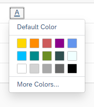
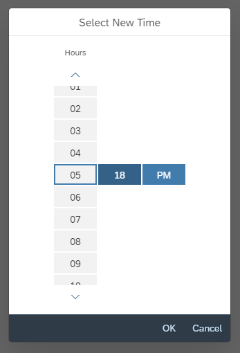
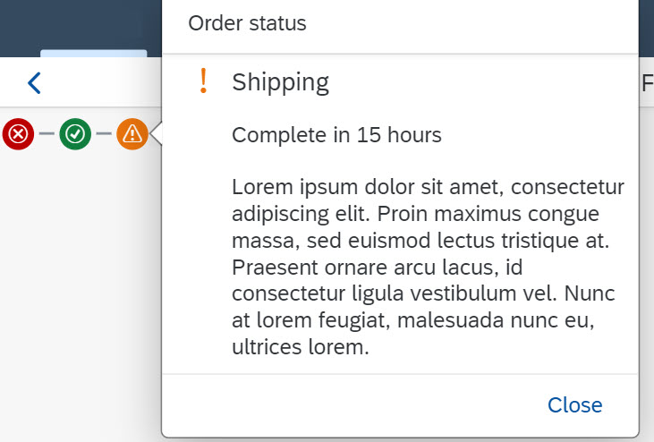
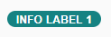
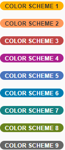
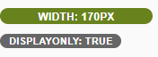
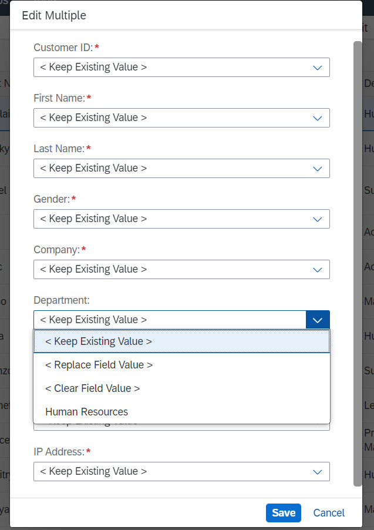
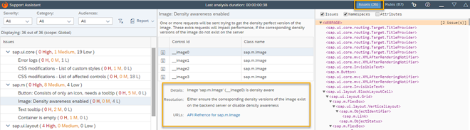
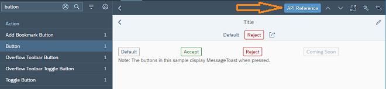
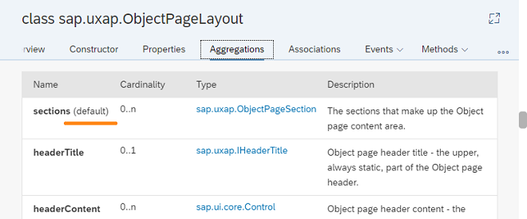

<!-- loioc838330d188c4019826a0a50d7d32db1 -->

# What's New in SAPUI5 1.54

With this release SAPUI5 is upgraded from version 1.52 to 1.54.

** **


<table>
<tr>
<th valign="top">

Version


</th>
<th valign="top">

Type


</th>
<th valign="top">

Category


</th>
<th valign="top">

Title


</th>
<th valign="top">

Description


</th>
<th valign="top">

Action


</th>
<th valign="top">

Available as of


</th>
</tr>
<tr>
<td valign="top">

 1.54 


</td>
<td valign="top">

 New 


</td>
<td valign="top">

 Control 


</td>
<td valign="top">

 **`sap.m.ColorPalette`** 


</td>
<td valign="top">

**`sap.m.ColorPalette`**

Provides the user with a palette containing up to 15 predefined web-standard colors, such as, Gold, Dark Magenta, and White. You can enable a *Default Color* button with a specified default color visible for the user. If the predefined set of colors is not sufficient, you can enable a *More Colors* button that opens `sap.ui.unified.ColorPicker`. For more information, see the [API Reference](https://ui5.sap.com/#/api/sap.m.ColorPalette) and the [Samples](https://ui5.sap.com/#/entity/sap.m.ColorPalette).



<sub>New•Control•Info Only•1.54</sub>


</td>
<td valign="top">

 Info Only


</td>
<td valign="top">

2018-04-26


</td>
</tr>
<tr>
<td valign="top">

 1.54 


</td>
<td valign="top">

 New 


</td>
<td valign="top">

 Feature 


</td>
<td valign="top">

 **OData service `/UI5/ABAP_REPOSITORY_SRV`** 


</td>
<td valign="top">

**OData service `/UI5/ABAP_REPOSITORY_SRV`**

The OData service `/UI5/ABAP_REPOSITORY_SRV` is now available for loading SAPUI5 apps, components, or libraries into an SAPUI5 ABAP repository located on an SAP NetWeaver Application Server ABAP system for deployment and delivery. The service uploads the underlying files that are collected in a zip file. This can be of interest for SAPUI5 development teams that operate a continuous integration build with a build server, for example Jenkins, and manage their development in a version control system, for example, Git.

For more information, see [Using an OData Service to Load Data to the SAPUI5 ABAP Repository](../05_Developing_Apps/using-an-odata-service-to-load-data-to-the-sapui5-abap-repository-a883327.md).

<sub>New•Feature•Info Only•1.54</sub>


</td>
<td valign="top">

 Info Only 


</td>
<td valign="top">

2018-04-26


</td>
</tr>
<tr>
<td valign="top">

 1.54 


</td>
<td valign="top">

 New 


</td>
<td valign="top">

 Control 


</td>
<td valign="top">

 **`sap.m.TimePickerSliders`** 


</td>
<td valign="top">

**`sap.m.TimePickerSliders`**

Enables the user to choose time, in different formats, from the available lists in the sliders. The control can be used inside any container. For more information, see the [API Reference](https://ui5.sap.com/#/api/sap.m.TimePickerSliders) and the [Samples](https://ui5.sap.com/#/entity/sap.m.TimePickerSliders).



<sub>New•Control•Info Only•1.54</sub>


</td>
<td valign="top">

 Info Only 


</td>
<td valign="top">

2018-04-26


</td>
</tr>
<tr>
<td valign="top">

 1.54 


</td>
<td valign="top">

 New 


</td>
<td valign="top">

 Control 


</td>
<td valign="top">

 **`sap.suite.ui.commons.MicroProcessFlow`** 


</td>
<td valign="top">

**`sap.suite.ui.commons.MicroProcessFlow`**

Enables you to embed process flow indicators into other controls, such as headers, lists, and tables. This control acts as a generic container with process flow nodes laid out linearly along the horizontal axis. By default, the process flow nodes appear as circular icons that use semantic colors and provide click events. The default nodes can be replaced by other SAPUI5 controls, such as micro charts, status indicators, buttons, and labels.

For more information, see [Micro Process Flow](../10_More_About_Controls/micro-process-flow-28977b2.md), the [API Reference](https://ui5.sap.com/#/api/sap.suite.ui.commons.MicroProcessFlow) and the [Samples](https://ui5.sap.com/#/entity/sap.suite.ui.commons.MicroProcessFlow).

  

<sub>New•Control•Info Only•1.54</sub>


</td>
<td valign="top">

 Info Only 


</td>
<td valign="top">

2018-04-26


</td>
</tr>
<tr>
<td valign="top">

 1.54 


</td>
<td valign="top">

 New 


</td>
<td valign="top">

 Control 


</td>
<td valign="top">

 **`sap.tnt.InfoLabel`** 


</td>
<td valign="top">

**`sap.tnt.InfoLabel`**

Small non-interactive control whose purpose is to attract attention to a certain piece of information such as a state, quantity, condition. The control is vertically aligned with the SAPUI5 `Input` and `Button` control families.

`InfoLabel` has a `renderMode` property with the values `loose` and `narrow` that specify the side paddings. By default, the padding is loose, but for numeric text values, use narrow paddings.

  

  

The background and text color combinations are predefined. You can choose from 9 color schemes where the text content and choice of color depend on your preferences. The `colorScheme` property also accepts a digit as a value.

  

The size of the `InfoLabel` control adjusts to fit other controls, such as non-editable forms or tables, when the `displayOnly` property is set to `true`.

  

For more information, see the [API Reference](https://ui5.sap.com/#/api/sap.tnt.InfoLabel) and the [Samples](https://ui5.sap.com/#/entity/sap.tnt.InfoLabel).

<sub>New•Control•Info Only•1.54</sub>


</td>
<td valign="top">

 Info Only 


</td>
<td valign="top">

2018-04-26


</td>
</tr>
<tr>
<td valign="top">

 1.54 


</td>
<td valign="top">

 New 


</td>
<td valign="top">

 Control 


</td>
<td valign="top">

 **`sap.ui.comp.smartmultiedit`** 


</td>
<td valign="top">

**`sap.ui.comp.smartmultiedit`**

Enables the users to perform mass changes on multiple homogeneous objects. When you pass a set of such objects to the `SmartMultiEdit` control, it provides a customizable list of object attributes. Each attribute value can be changed, cleared, or kept as it is. The control provides value helpers, formatting, and validation, based on the data types of individual object attributes. For more information, see [Smart Multi Edit](../10_More_About_Controls/smart-multi-edit-0907251.md), the [API Reference](https://ui5.sap.com/#/api/sap.ui.comp.smartmultiedit.Field) and the [Samples](https://ui5.sap.com/#/entity/sap.ui.comp.smartmultiedit.Container).

  

<sub>New•Control•Info Only•1.54</sub>


</td>
<td valign="top">

 Info Only 


</td>
<td valign="top">

2018-04-26


</td>
</tr>
<tr>
<td valign="top">

 1.54 


</td>
<td valign="top">

 Changed 


</td>
<td valign="top">

 Feature 


</td>
<td valign="top">

 **Initialization Module for Bootstrap** 


</td>
<td valign="top">

**Initialization Module for Bootstrap**

You can now specify an initialization module that is loaded and executed after the initialization of the core with the configuration parameter `onInit` like this:.

```html
<script src="/sapui5/resources/sap-ui-core.js" 
	id="sap-ui-bootstrap"
	data-sap-ui-libs="sap.m" 
	data-sap-ui-oninit="module:sap/app/App"
	data-sap-ui-resourceroots='{"sap.app": "my/local/path"}'

	data-sap-ui-theme="sap_belize"></script>

```

For more information, see [Configuration Options and URL Parameters](../04_Essentials/configuration-options-and-url-parameters-91f2d03.md).

<sub>Changed•Feature•Info Only•1.54</sub>


</td>
<td valign="top">

 Info Only 


</td>
<td valign="top">

2018-04-26


</td>
</tr>
<tr>
<td valign="top">

 1.54 


</td>
<td valign="top">

 Changed 


</td>
<td valign="top">

 Feature 


</td>
<td valign="top">

 **`manifest` Property for Component Containers** 


</td>
<td valign="top">

**`manifest` Property for Component Containers**

You can now also use the "Manifest First" mechanism for component containers. For more information, see [Using and Nesting Components](../04_Essentials/using-and-nesting-components-346599f.md).

<sub>Changed•Feature•Info Only•1.54</sub>


</td>
<td valign="top">

 Info Only 


</td>
<td valign="top">

2018-04-26


</td>
</tr>
<tr>
<td valign="top">

 1.54 


</td>
<td valign="top">

 Changed 


</td>
<td valign="top">

 Feature 


</td>
<td valign="top">

 **SAPUI5 OData V4 Model** 


</td>
<td valign="top">

**SAPUI5 OData V4 Model**

The new version of the SAPUI5 OData V4 model has the following features:

-   Enhancements to the adapter to use the V4 model with an OData V2 service:

    -   Handling of complex filters with `and`, `or`, `not`, brackets, and frequently used functions including `contains`.

    -   Support for bound operations by evaluating the V2 annotation `sap:action-for`.

    -   Additional annotation conversions and warnings \(in the console\) for V2 annotations that are not converted.


-   Suspend and resume absolute context and list bindings. A suspended binding will not send requests to the backend.

-   Possibility to refresh a single row in an absolute list binding.

-   Support of bound functions.

-   Newly created entities in an absolute list binding are refreshed/reread automatically after the successful post to the server.

-   It is now possible to request the `x-csrf` token and the root metadata document earlier. This is controlled by model parameter [`earlyRequests`](https://ui5.sap.com/#/api/sap.ui.model.odata.v4.ODataModel/constructor).

    > ### Note:  
    > The default value of `earlyRequests` is **false** and this default may change in the future.

-   Action advertisements can be accessed in bindings by specifying `#<namespace>.<action>` 

    > ### Note:  
    > The previous method for metadata access is still available, but we recommend using a double hash \(\#\#\) syntax instead.


> ### Restriction:  
> Due to the limited feature scope of this version of the SAPUI5 OData V4 model, check that all required features are in place before developing applications. Check the detailed documentation of the features, as certain parts of a feature may be missing. While we aim to be compatible with existing controls, some controls might not work due to small incompatibilities compared to `sap.ui.model.odata.(v2.)ODataModel`, or due to missing features in the model \(such as tree binding\). This also applies to smart controls \(`sap.ui.comp` library\) and SAP Fiori elements that do not support the SAPUI5 OData V4 model, as well as controls such as `TreeTable` and `AnalyticalTable`, which are not supported together with the SAPUI5 OData V4 model. The interface for applications has been changed for easier and more efficient use of the model. For a summary of these changes, see [Changes Compared to OData V2 Model](../04_Essentials/changes-compared-to-odata-v2-model-abd4d7c.md).

For more information, see [OData V4 Model](../04_Essentials/odata-v4-model-5de13cf.md), the [API Reference](https://ui5.sap.com/#/api/sap.ui.model.odata.v4), and the [Sample](https://ui5.sap.com/#/entity/sap.ui.model.odata.v4.ODataModel) in the Demo Kit.

<sub>Changed•Feature•Info Only•1.54</sub>


</td>
<td valign="top">

 Info Only 


</td>
<td valign="top">

2018-04-26


</td>
</tr>
<tr>
<td valign="top">

 1.54 


</td>
<td valign="top">

 Changed 


</td>
<td valign="top">

 Feature 


</td>
<td valign="top">

 **Default Font** 


</td>
<td valign="top">

**Default Font**

A new default font, the 72 font family that offers some legibility and accessibility enhancements, has been implemented.

> ### Note:  
> Make sure the settings in your application are correct and comply with the new font, for example, texts are placed correctly and fonts are used consistently.

<sub>Changed•Feature•Info Only•1.54</sub>


</td>
<td valign="top">

 Info Only 


</td>
<td valign="top">

2018-04-26


</td>
</tr>
<tr>
<td valign="top">

 1.54 


</td>
<td valign="top">

 Changed 


</td>
<td valign="top">

 Feature 


</td>
<td valign="top">

 **Spreadsheet Export** 


</td>
<td valign="top">

**Spreadsheet Export**

A new worksheet is available for exported spreadsheets in the `sap.ui.export` library that provides additional context information, such as administrative information like the server. For more information, see the [API Reference for `metaSheetName`](https://ui5.sap.com/#/api/sap.ui.export.Spreadsheet) and the [Sample](https://ui5.sap.com/#/sample/sap.ui.comp.sample.smarttable.mtableCustom/preview).

<sub>Changed•Feature•Info Only•1.54</sub>


</td>
<td valign="top">

 Info Only 


</td>
<td valign="top">

2018-04-26


</td>
</tr>
<tr>
<td valign="top">

 1.54 


</td>
<td valign="top">

 Changed 


</td>
<td valign="top">

 Feature 


</td>
<td valign="top">

 **Support Assistant Performance and Usability Improvements** 


</td>
<td valign="top">

**Support Assistant Performance and Usability Improvements**

There are several improvements in the Support Assistant tool:

-   Better initial loading performance - now each library should have a `.supportrc` file in its root folder. The purpose of this file is to serve as a metadata container to be used by the Support Assistant ruleset loader module.

    For more information, see [Create a Ruleset for a Library](../04_Essentials/create-a-ruleset-for-a-library-b5a5135.md).

-   Improved perceived UI performance during initial tool loading – achieved by early and dynamic rendering of the most important UI elements and introducing a progress bar in the main screen of the Support Assistant.

-   Improved usability:

    -   The selection of rules to run an analysis has been improved. Now, selecting a library selects all the rules it contains.

    -   The *Issues* and *Rules* buttons are now highlighted to show the user which view is active at the moment.

    -   The issue details in the *Issues* view have been moved from the top to the bottom of the window for better usability.


 

<sub>Changed•Feature•Info Only•1.54</sub>


</td>
<td valign="top">

 Info Only 


</td>
<td valign="top">

2018-04-26


</td>
</tr>
<tr>
<td valign="top">

 1.54 


</td>
<td valign="top">

 Changed 


</td>
<td valign="top">

 Feature 


</td>
<td valign="top">

 **UI5 Inspector Updated** 


</td>
<td valign="top">

**UI5 Inspector Updated**

A new minor version 0.9.4 of the UI5 Inspector is available in the Chrome Web Store with some code adjustments and the new SAPUI5 logo.

<sub>Changed•Feature•Info Only•1.54</sub>


</td>
<td valign="top">

 Info Only 


</td>
<td valign="top">

2018-04-26


</td>
</tr>
<tr>
<td valign="top">

 1.54 


</td>
<td valign="top">

 Changed 


</td>
<td valign="top">

 Control 


</td>
<td valign="top">

 **`sap.f.DynamicPage`** 


</td>
<td valign="top">

**`sap.f.DynamicPage`**

-   A new `areaShrinkRatio` property is now available for the `sap.f.DynamicPageTitle` class. The property assigns shrinking ratios to the three areas in the `sap.f.DynamicPageTitle` \(Heading, Content, and Actions\). The greater value a section has the faster it shrinks when the screen size is reduced. For more information, see the [API Reference](https://ui5.sap.com/#/api/sap.f.DynamicPageTitle/controlProperties).

-   A new `stateChange` event is introduced for the `sap.f.DynamicPageTitle` class. The event is fired when the state of the title \(expanded or collapsed\) is toggled by user interaction \(by clicking/tapping on the title, by using the expand/collapse button, or by scrolling down the `sap.f.DynamicPage` content\). For more information, see the [API Reference](https://ui5.sap.com/#/api/sap.f.DynamicPageTitle/events/stateChange).


<sub>Changed•Control•Info Only•1.54</sub>


</td>
<td valign="top">

 Info Only 


</td>
<td valign="top">

2018-04-26


</td>
</tr>
<tr>
<td valign="top">

 1.54 


</td>
<td valign="top">

 Changed 


</td>
<td valign="top">

 Control 


</td>
<td valign="top">

 **`sap.f.FlexibleColumnLayout`** 


</td>
<td valign="top">

**`sap.f.FlexibleColumnLayout`**

A new `backgroundDesign` property is added that specifies the background color of the content. The visualization of the different options depends on the used theme. For more information, see the [API Reference](https://ui5.sap.com/#/api/sap.f.FlexibleColumnLayout/controlProperties).

<sub>Changed•Control•Info Only•1.54</sub>


</td>
<td valign="top">

 Info Only 


</td>
<td valign="top">

2018-04-26


</td>
</tr>
<tr>
<td valign="top">

 1.54 


</td>
<td valign="top">

 Changed 


</td>
<td valign="top">

 Control 


</td>
<td valign="top">

 **Context Menu** 


</td>
<td valign="top">

**Context Menu**

`sap.m library` for `List`/`ListBase`, `Table`, `Tree` controls and tables in `sap.ui.table`: You can now use the context menu for these controls. For more information, see the [API Reference for the `contextMenu` aggregation](https://ui5.sap.com/#/api/sap.ui.table.Table/aggregations), the [API Reference for the `beforeOpenContextMenu` event](https://ui5.sap.com/#/api/sap.ui.table.Table/events/beforeOpenContextMenu) and the [Sample for `sap.ui.Table`](https://ui5.sap.com/#/sample/sap.ui.table.sample.Menus/preview) \(and the same for `ListBase`\), the [Sample for `sap.m.Table`](https://ui5.sap.com/#/sample/sap.m.sample.TableDnD/preview), and the [Sample for `List`](https://ui5.sap.com/#/sample/sap.m.sample.ListGrouping/preview).

<sub>Changed•Control•Info Only•1.54</sub>


</td>
<td valign="top">

 Info Only 


</td>
<td valign="top">

2018-04-26


</td>
</tr>
<tr>
<td valign="top">

 1.54 


</td>
<td valign="top">

 Changed 


</td>
<td valign="top">

 Control 


</td>
<td valign="top">

 **Drag and Drop** 


</td>
<td valign="top">

**Drag and Drop**

`sap.m library` for `List`, `Table`, `Tree` controls: You can now use drag and drop for these controls with aggregation `dragDropConfig`. For more information, see the [API Reference for the `dragDropConfig` aggregation](https://ui5.sap.com/#/api/sap.m.ListBase/aggregations.html), the [Sample for `Table`](https://ui5.sap.com/#/sample/sap.m.sample.TableDnD/preview), and the [Sample for `Tree`](https://ui5.sap.com/#/sample/sap.m.sample.TreeDnD/preview).

<sub>Changed•Control•Info Only•1.54</sub>


</td>
<td valign="top">

 Info Only 


</td>
<td valign="top">

2018-04-26


</td>
</tr>
<tr>
<td valign="top">

 1.54 


</td>
<td valign="top">

 Changed 


</td>
<td valign="top">

 Control 


</td>
<td valign="top">

 **`sap.m.CheckBox`** 


</td>
<td valign="top">

**`sap.m.CheckBox`**

-   A new `wrapping` property is now available that determines whether the text in the control's label is wrapped. When set to `false` \(default\), the label's text is truncated with an ellipsis at the end.

-   A new `displayOnly` property is added that enables visually distinguishable rendering of the control in gray. When set to `true`, the control becomes non-focusable and is not part of the tab chain. The `displayOnly` state is intended to be used in form controls only, and it is different from the read-only state.


For more information, see the [API Reference](https://ui5.sap.com/#/api/sap.m.CheckBox/controlProperties) and the [Sample](https://ui5.sap.com/#/sample/sap.m.sample.CheckBox/preview).

<sub>Changed•Control•Info Only•1.54</sub>


</td>
<td valign="top">

 Info Only 


</td>
<td valign="top">

2018-04-26


</td>
</tr>
<tr>
<td valign="top">

 1.54 


</td>
<td valign="top">

 Changed 


</td>
<td valign="top">

 Control 


</td>
<td valign="top">

 **`sap.m.DateTimeField`** 


</td>
<td valign="top">

**`sap.m.DateTimeField`**

With the new `initialFocusedDateValue` property, you can now set a JavaScript `Date` object to define the initially focused date/time when a picker popup is opened. This can be used in the context of `sap.m.TimePicker`, `sap.m.DatePicker`, or `sap.m.DateTimePicker` and it only takes into account the time part, the date part, or both parts of the JavaScript `Date` object, respectively. For more information, see the [API Reference](https://ui5.sap.com/#/api/sap.m.DateTimeField).

<sub>Changed•Control•Info Only•1.54</sub>


</td>
<td valign="top">

 Info Only 


</td>
<td valign="top">

2018-04-26


</td>
</tr>
<tr>
<td valign="top">

 1.54 


</td>
<td valign="top">

 Changed 


</td>
<td valign="top">

 Control 


</td>
<td valign="top">

 **`sap.m.IconTabBar`** 


</td>
<td valign="top">

**`sap.m.IconTabBar`**

-   Updated drag and drop feature for visible tab areas - the drag and drop feature has a new visual indication, including a drop area indicator and a ghost element. The keyboard handling is also updated.

-   Implemented drag and drop in the overflow area of `IconTabBar` – the drag and drop feature is added in the overflow list of `sap.m.IconTabBar`. Rearranging tabs using the keyboard is also enabled in the overflow.

    For more information, see the [API Reference](https://ui5.sap.com/#/api/sap.m.IconTabHeader) and the [Sample](https://ui5.sap.com/#/sample/sap.m.sample.IconTabBarDragDrop/preview).


<sub>Changed•Control•Info Only•1.54</sub>


</td>
<td valign="top">

 Info Only 


</td>
<td valign="top">

2018-04-26


</td>
</tr>
<tr>
<td valign="top">

 1.54 


</td>
<td valign="top">

 Changed 


</td>
<td valign="top">

 Control 


</td>
<td valign="top">

 **`sap.m.Label`** 


</td>
<td valign="top">

**`sap.m.Label`**

A new `vAlign` property has been added. It specifies the vertical alignment of `sap.m.Label`. To preserve the current behavior of the control, the default value of the property is `inherit`. From now on, app developers can set vertical alignment of `sap.m.Label` with the `vAlign` property using its get/set method, which accepts values from the `sap.ui.core.VerticalAlign` interface. For more information, see the [API Reference](https://ui5.sap.com/#/api/sap.m.Label).

<sub>Changed•Control•Info Only•1.54</sub>


</td>
<td valign="top">

 Info Only 


</td>
<td valign="top">

2018-04-26


</td>
</tr>
<tr>
<td valign="top">

 1.54 


</td>
<td valign="top">

 Changed 


</td>
<td valign="top">

 Control 


</td>
<td valign="top">

 **`sap.m.Link`** 


</td>
<td valign="top">

**`sap.m.Link`**

A new `validateUrl` property has been added that defines whether the link target URI should be validated. If validation fails, the value of the `href` property will still be set, but it will not be applied to the DOM tree. For more information, see the [API Reference](https://ui5.sap.com/#/api/sap.m.Link/controlProperties).

<sub>Changed•Control•Info Only•1.54</sub>


</td>
<td valign="top">

 Info Only 


</td>
<td valign="top">

2018-04-26


</td>
</tr>
<tr>
<td valign="top">

 1.54 


</td>
<td valign="top">

 Changed 


</td>
<td valign="top">

 Control 


</td>
<td valign="top">

 **`sap.m.MessagePage`** 


</td>
<td valign="top">

**`sap.m.MessagePage`**

-   With the new `enableFormattedText` Boolean property, you can now enable the text that is set in the `description` property to be rendered as HTML. The new property takes effect only when the `customDescription` aggregation is not set.For a list of supported HTML tags, see the [API Reference](https://ui5.sap.com/#/api/sap.m.FormattedText) for `sap.m.FormattedText`.

-   A new `buttons` aggregation is implemented that allows you to add buttons \(of type `sap.m.Button`\) to the `sap.m.MessagePage`. The buttons are centered under the description of the `MessagePage`. If more buttons are added, and enough space is available , they will be rendered on two or more lines.


For more information, see the [API Reference](https://ui5.sap.com/#/api/sap.m.MessagePage) and the [Sample](https://ui5.sap.com/#/sample/sap.m.sample.MessagePageWithButtons/preview).

<sub>Changed•Control•Info Only•1.54</sub>


</td>
<td valign="top">

 Info Only 


</td>
<td valign="top">

2018-04-26


</td>
</tr>
<tr>
<td valign="top">

 1.54 


</td>
<td valign="top">

 Changed 


</td>
<td valign="top">

 Control 


</td>
<td valign="top">

 **`sap.m.ObjectStatus`** 


</td>
<td valign="top">

**`sap.m.ObjectStatus`**

The control now has the option to have an active icon and text so the user can click/tap on them. To do this, set the new `active` property to `true`. There is also a new `press` event that fires when the user clicks/taps on active text/icon. For more information, see the [API Reference](https://ui5.sap.com/#/api/sap.m.ObjectStatus) and the [Sample](https://ui5.sap.com/#/sample/sap.m.sample.ObjectStatus/preview).

<sub>Changed•Control•Info Only•1.54</sub>


</td>
<td valign="top">

 Info Only 


</td>
<td valign="top">

2018-04-26


</td>
</tr>
<tr>
<td valign="top">

 1.54 


</td>
<td valign="top">

 Changed 


</td>
<td valign="top">

 Control 


</td>
<td valign="top">

 **`sap.m.OverflowToolbar`** 


</td>
<td valign="top">

**`sap.m.OverflowToolbar`**

The `sap.m.Label` control is now added to the list of controls that can be moved to the overflow area of `sap.m.OverflowToolbar`.

<sub>Changed•Control•Info Only•1.54</sub>


</td>
<td valign="top">

 Info Only 


</td>
<td valign="top">

2018-04-26


</td>
</tr>
<tr>
<td valign="top">

 1.54 


</td>
<td valign="top">

 Changed 


</td>
<td valign="top">

 Control 


</td>
<td valign="top">

 **`sap.m.PlanningCalendar`**:


</td>
<td valign="top">

**`sap.m.PlanningCalendar`**

-   A new `getSelectedAppointments` method is implemented which holds the IDs of the selected appointments. If no appointments are selected, an empty array is returned. This is an addition to the `appointmentSelect` event and its `appointment` parameter where you can listen for the value of the `selected` property. For more information, see the [API Reference](https://ui5.sap.com/#/api/sap.m.PlanningCalendar/methods/getSelectedAppointments) and the [Sample](https://ui5.sap.com/#/sample/sap.m.sample.PlanningCalendar/preview).

-   The control now provides the possibility for the user to drag and drop appointments in one `PlanningCalendarRow`. You can enable this behavior with the `enableAppointmentDragAndDrop` Boolean property. When an appointment is dropped over a drop target area, an `appointmentDrop` event is fired. For more information, see the [API Reference](https://ui5.sap.com/#/api/sap.m.PlanningCalendarRow) and the [Sample](https://ui5.sap.com/#/sample/sap.m.sample.PlanningCalendarDnD/preview).

-   For large screens, the date navigation arrows are now displayed closer to the date picker button to improve the experience of date navigation in the `sap.m.PlanningCalendar`.

-   With the use of the new `stickyHeader` property, you can now enable the header area to remain visible \(fixed on top\) when the rest of the content is scrolled out of view. For more information, see the [API Reference](https://ui5.sap.com/#/api/sap.m.PlanningCalendar) and the [Sample](https://ui5.sap.com/#/sample/sap.m.sample.PlanningCalendarWithStickyHeader/preview).

    > ### Restriction:  
    > There is limited browser support, hence the `stickyHeader` API is in experimental state. This API should not be used in a production environment.

-   Until now, the appointments in `sap.m.PlanningCalendar` were sorted vertically according to their duration with the longer ones being on top. With the introduction of the new API method `setCustomAppointmentsSorterCallback`, you can now sort the appointments in a custom way. For more information, see the [API Reference](https://ui5.sap.com/#/api/sap.m.PlanningCalendar) and the [Sample](https://ui5.sap.com/#/sample/sap.m.sample.PlanningCalendarOneLine/preview).


<sub>Changed•Control•Info Only•1.54</sub>


</td>
<td valign="top">

 Info Only 


</td>
<td valign="top">

2018-04-26


</td>
</tr>
<tr>
<td valign="top">

 1.54 


</td>
<td valign="top">

 Changed 


</td>
<td valign="top">

 Control 


</td>
<td valign="top">

 **`sap.m.StepInput`** 


</td>
<td valign="top">

**`sap.m.StepInput`**

-   You can now add a description and align the text with the use of the new properties: `description`, `fieldWidth`, and `textAlign`. With the `description` property, you can display text after the input field. The `fieldWidth` property specifies how much of the available space is taken from the field and how much from the description \(equal by default\). The `textAlign` property enables you to choose how the numbers in the input field are aligned. For more information, see the [API Reference](https://ui5.sap.com/#/api/sap.m.StepInput/controlProperties).

-   The control now increases the speed in which the value changes when the user presses and holds the increase or decrease buttons.

-   With the new `stepMode` property, you can now decide which calculation method to use for the `value` when the user chooses the increase/decrease buttons. The `AdditionAndSubtraction` type simply adds/subtracts the current `step` to/from the `value`, while the `Multiple` type increases/decreases the `value` to the closest number that is divisible by the `step`. For more information, see the [API Reference](https://ui5.sap.com/#/api/sap.m.StepInput) and the [Sample](https://ui5.sap.com/#/sample/sap.m.sample.StepInput/preview).


<sub>Changed•Control•Info Only•1.54</sub>


</td>
<td valign="top">

 Info Only 


</td>
<td valign="top">

2018-04-26


</td>
</tr>
<tr>
<td valign="top">

 1.54 


</td>
<td valign="top">

 Changed 


</td>
<td valign="top">

 Control 


</td>
<td valign="top">

 **`sap.m.TimePicker`** 


</td>
<td valign="top">

**`sap.m.TimePicker`**

-   You can now set not only a `00:00` time value but also `24:00` if you need the time to represent the end of the day. To enable this option, set the new `support2400` Boolean property to `true`. For more information, see the [API Reference](https://ui5.sap.com/#/api/sap.m.TimePicker) and the [Sample](https://ui5.sap.com/#/sample/sap.m.sample.TimePicker/preview).

-   With the use of the new `maskMode` property, you can now disable the assistance that is provided for the `sap.m.TimePicker` input. This enables variable length time formats, for example AM/PM formats in different languages. For more information, see the [API Reference](https://ui5.sap.com/#/api/sap.m.TimePicker).


<sub>Changed•Control•Info Only•1.54</sub>


</td>
<td valign="top">

 Info Only 


</td>
<td valign="top">

2018-04-26


</td>
</tr>
<tr>
<td valign="top">

 1.54 


</td>
<td valign="top">

 Changed 


</td>
<td valign="top">

 Control 


</td>
<td valign="top">

 **`sap.m.Toolbar`** 


</td>
<td valign="top">

**`sap.m.Toolbar`**

A new `style` property has been added that defines the visual style of the `sap.m.Toolbar`. The available styles are theme-dependent and can differ based on the currently used theme. For more information, see the [API Reference](https://ui5.sap.com/#/api/sap.m.Toolbar/controlProperties) and the [Sample](https://ui5.sap.com/#/sample/sap.m.sample.ToolbarDesign/preview).

<sub>Changed•Control•Info Only•1.54</sub>


</td>
<td valign="top">

 Info Only 


</td>
<td valign="top">

2018-04-26


</td>
</tr>
<tr>
<td valign="top">

 1.54 


</td>
<td valign="top">

 Changed 


</td>
<td valign="top">

 Control 


</td>
<td valign="top">

 **`sap.m.WizardStep`** 


</td>
<td valign="top">

**`sap.m.WizardStep`**

A new Boolean property called `optional` has been added. When set to `true`, it marks a step with the text “Optional” under the step’s title. The new property only affects the visual appearance of the step and does not provide any behavioral changes to the control. For more information, see the [API Reference](https://ui5.sap.com/#/api/sap.m.WizardStep).


</td>
<td valign="top">

 Info Only 


</td>
<td valign="top">

2018-04-26


</td>
</tr>
<tr>
<td valign="top">

 1.54 


</td>
<td valign="top">

 Changed 


</td>
<td valign="top">

 Control 


</td>
<td valign="top">

 **`sap.ui.comp`** 


</td>
<td valign="top">

**`sap.ui.comp`**

**`sap.ui.comp`** library for `SmartChart`, `SmartFilterBar`, `SmartField` controls: The `com.sap.vocabularies.Common.v1.IsCalendarDate` annotation is now supported. For more information, see the [API Reference](https://ui5.sap.com/#/api/sap.ui.comp.smartfield.SmartField/annotations/IsCalendarDate).

<sub>Changed•Control•Info Only•1.54</sub>


</td>
<td valign="top">

 Info Only 


</td>
<td valign="top">

2018-04-26


</td>
</tr>
<tr>
<td valign="top">

 1.54 


</td>
<td valign="top">

 Changed 


</td>
<td valign="top">

 Control 


</td>
<td valign="top">

 **`sap.ui.comp.smartchart.SmartChart`** 


</td>
<td valign="top">

**`sap.ui.comp.smartchart.SmartChart`**

-   To improve the responsive behavior of the `SmartChart` control on mobile devices, the UI elements on the toolbar have been rearranged.

-   The new lightweight sample for the `SmartChart` control shows how the control can be used in a simplified way. The toolbar now only includes the title and the possibility to navigate to the related semantic object. For more information, see the [Sample](https://ui5.sap.com/#/sample/sap.ui.comp.sample.smartchart.lightweight/preview).


<sub>Changed•Control•Info Only•1.54</sub>


</td>
<td valign="top">

 Info Only 


</td>
<td valign="top">

2018-04-26


</td>
</tr>
<tr>
<td valign="top">

 1.54 


</td>
<td valign="top">

 Changed 


</td>
<td valign="top">

 Control 


</td>
<td valign="top">

 **`sap.ui.comp.smartfilterbar.SmartFilterBar`** 


</td>
<td valign="top">

**`sap.ui.comp.smartfilterbar.SmartFilterBar`**

-   In addition to the filters of the bound entity set, the `SmartFilterBar` control now displays parameters of an annotated parameter entity set also for non-aggregating OData services.

-   The `Edm.DateTimeOffset` data type for OData services is now supported. For more information, see the [API Reference](https://ui5.sap.com/#/api/sap.ui.comp.smartfilterbar.SmartFilterBar/annotations/summary).


<sub>Changed•Control•Info Only•1.54</sub>


</td>
<td valign="top">

 Info Only 


</td>
<td valign="top">

2018-04-26


</td>
</tr>
<tr>
<td valign="top">

 1.54 


</td>
<td valign="top">

 Changed 


</td>
<td valign="top">

 Control 


</td>
<td valign="top">

 **`sap.ui.comp.navpopover.SmartLink`** 


</td>
<td valign="top">

**`sap.ui.comp.navpopover.SmartLink`**

The contact information for the `SmartLink` control can now also display address information. For more information, see the [Sample](https://ui5.sap.com/#/sample/sap.ui.comp.sample.smartlink.example_08/preview). 

<sub>Changed•Control•Info Only•1.54</sub>


</td>
<td valign="top">

 Info Only 


</td>
<td valign="top">

2018-04-26


</td>
</tr>
<tr>
<td valign="top">

 1.54 


</td>
<td valign="top">

 Changed 


</td>
<td valign="top">

 Control 


</td>
<td valign="top">

 **`sap.ui.comp.smartform.SmartForm`** 


</td>
<td valign="top">

**`sap.ui.comp.smartform.SmartForm`**

Labels in form controls are now wrapped automatically using the `wrapping` property of `sap.m.label`. This prevents long labels from being cut off.

<sub>Changed•Control•Info Only•1.54</sub>


</td>
<td valign="top">

 Info Only 


</td>
<td valign="top">

2018-04-26


</td>
</tr>
<tr>
<td valign="top">

 1.54 


</td>
<td valign="top">

 Changed 


</td>
<td valign="top">

 Control 


</td>
<td valign="top">

 **`sap.ui.comp.smarttable.SmartTable`** 


</td>
<td valign="top">

**`sap.ui.comp.smarttable.SmartTable`**

`SmartTable` now supports the `CriticalityType` annotation \(for tables of type `sap.ui.table`\) and the `TextArrangement` annotation \(for `AnalyticalTable`\). For more information, see the [API Reference for `CriticalityType`](https://ui5.sap.com/#/api/sap.ui.comp.smarttable.SmartTable/annotations/CriticalityType), the [API Reference for `TextArrangement`](https://ui5.sap.com/#/api/sap.ui.comp.smarttable.SmartTable/annotations/TextArrangement), and the [Sample](https://ui5.sap.com/#/sample/sap.ui.comp.sample.smarttable.smartMTableWithCriticality/preview).

<sub>Changed•Control•Info Only•1.54</sub>


</td>
<td valign="top">

 Info Only 


</td>
<td valign="top">

2018-04-26


</td>
</tr>
<tr>
<td valign="top">

 1.54 


</td>
<td valign="top">

 Changed 


</td>
<td valign="top">

 Control 


</td>
<td valign="top">

 **`sap.ui.layout.form.Form`** 


</td>
<td valign="top">

**`sap.ui.layout.form.Form`**

Labels in form controls are now wrapped automatically using the `wrapping` property of `sap.m.label`. This prevents long labels from being cut off. For more information, see the [Sample](https://ui5.sap.com/#/sample/sap.ui.layout.sample.Form354wide/preview).

<sub>Changed•Control•Info Only•1.54</sub>


</td>
<td valign="top">

 Info Only 


</td>
<td valign="top">

2018-04-26


</td>
</tr>
<tr>
<td valign="top">

 1.54 


</td>
<td valign="top">

 Changed 


</td>
<td valign="top">

 Control 


</td>
<td valign="top">

 **`sap.ui.richtexteditor.RichTextEditor`** 


</td>
<td valign="top">

**`sap.ui.richtexteditor.RichTextEditor`**

-   The `RichTextEditor` now supports editing inserted links and images. If the `showGroupLink` or `showGroupInsert` are visible in the custom header, they will display three buttons - one for creating/editing a link, one for unlinking and one for creating/editing an image. Clicking on *Insert/Edit Link* without a selected item will create a new link or image. Clicking on the buttons while an object \(image or text\) is selected in the editor allows you to edit the properties of the selected object. If text is selected, it will be automatically entered as link text.

-   The `RichTextEditor` now provides an option for customizing the position of the button groups in the custom toolbar. This can be done by supplying a value for the new `customToolbarPriority` property of the button group. The property accepts positive numeric values. The groups in the toolbar are placed in ascending order respective to their `customToolbarPriority` values.

-   The color selection mechanism of the `RichTextEditor` is enhanced by using the newly introduced `sap.m.ColorPalette` control. It provides a default set of colors, an option for adding custom colors by selecting *More Colors…*, and the possibility to revert the color changes back to default by selecting *Default Color*. Once selected, the color can be easily applied to other elements.


<sub>Changed•Control•Info Only•1.54</sub>


</td>
<td valign="top">

 Info Only 


</td>
<td valign="top">

2018-04-26


</td>
</tr>
<tr>
<td valign="top">

 1.54 


</td>
<td valign="top">

 Changed 


</td>
<td valign="top">

 Control 


</td>
<td valign="top">

 **`sap.ui.table.TreeTable`** 


</td>
<td valign="top">

**`sap.ui.table.TreeTable`**

You can now expand and collapse multiple rows at once. For more information, see the [API Reference for `expand`](https://ui5.sap.com/#/api/sap.ui.table.TreeTable/methods/expand) and the [API Reference for `collapse`](https://ui5.sap.com/#/api/sap.ui.table.TreeTable/methods/collapse) and the [Sample](https://ui5.sap.com/#/sample/sap.ui.table.sample.TreeTable.JSONTreeBinding/preview).

<sub>Changed•Control•Info Only•1.54</sub>


</td>
<td valign="top">

 Info Only 


</td>
<td valign="top">

2018-04-26


</td>
</tr>
<tr>
<td valign="top">

 1.54 


</td>
<td valign="top">

 Changed 


</td>
<td valign="top">

 Control 


</td>
<td valign="top">

 **`sap.ui.unified.CalendarLegend`** 


</td>
<td valign="top">

**`sap.ui.unified.CalendarLegend`**

With the use of the new `standardItems` property, you now have the option to configure which of the standard items related to the calendar days \(`today`, `selected`, `working`, and `non-working`\) to display. For more information, see the [API Reference](https://ui5.sap.com/#/api/sap.ui.unified.CalendarLegend) and the [Sample](https://ui5.sap.com/#/sample/sap.ui.unified.sample.CalendarSpecialDaysLegend/preview).

<sub>Changed•Control•Info Only•1.54</sub>


</td>
<td valign="top">

 Info Only 


</td>
<td valign="top">

2018-04-26


</td>
</tr>
<tr>
<td valign="top">

 1.54 


</td>
<td valign="top">

 Changed 


</td>
<td valign="top">

 Control 


</td>
<td valign="top">

 **`sap.ui.unified.Currency`** 


</td>
<td valign="top">

**`sap.ui.unified.Currency`**

The new `stringValue` property enables you to display very large numbers \(16+ characters\) without losing precision. For more information, see the [API Reference](https://ui5.sap.com/#/api/sap.ui.unified.Currency) and the [Sample](https://ui5.sap.com/#/sample/sap.ui.unified.sample.Currency/preview).

<sub>Changed•Control•Info Only•1.54</sub>


</td>
<td valign="top">

 Info Only 


</td>
<td valign="top">

2018-04-26


</td>
</tr>
<tr>
<td valign="top">

 1.54 


</td>
<td valign="top">

 Changed 


</td>
<td valign="top">

 SAP Fiori Elements 


</td>
<td valign="top">

 **SAP Fiori Elements** 


</td>
<td valign="top">

**SAP Fiori Elements**

**List Report and Object Page**

List report and object page have the following new and enhanced features:

**General Features**

-   You can prefill fields with values when creating an entity. Two options are available:

    -   Creation via cross-app navigation

    -   Passing values entered by the user into the filter bar using an extension point


    For more information, see [Prefilling Fields When Creating a New Entity](../06_SAP_Fiori_Elements/prefilling-fields-when-creating-a-new-entity-11ff444.md) and [Prefilling Fields When Creating a New Entity Using an Extension Point](../06_SAP_Fiori_Elements/prefilling-fields-when-creating-a-new-entity-using-an-extension-point-189e2d8.md).

-   Using the `securedExecution` method from the `ExtensionAPI` you can add and display custom messages. You can now define a custom title for the message popup, which is displayed if transient messages come from the backend. For more information, see [Adding Custom Messages](../06_SAP_Fiori_Elements/adding-custom-messages-5a9a2a0.md).

-   You can implement inner app state handling for custom UI elements. For more information, see [Custom State Handling for Extended Apps](../06_SAP_Fiori_Elements/custom-state-handling-for-extended-apps-89fa878.md).

-   In SAP Web IDE, the wizard to create new projects has been enhanced. In the *Template Customization* step, you can now choose an additional OData sub-navigation target. You can also decide whether your app is to include smart variant management and / or flexible column layout.

-   In SAP Web IDE, the wizard to create extensions has been enhanced. You can now use the wizard to create the following:

    -   Table column extensions in the list report

    -   Table column and form extensions on the object page

    -   Extensions in the header area of the object page


    For more information, see [Extending SAP Fiori Elements-Based Apps](../06_SAP_Fiori_Elements/extending-sap-fiori-elements-based-apps-358cf25.md).


**Object Page View**

-   Single selection in object page tables is enabled by default. You can enable multi-select for your object page tables, if required.

-   You can hide features on the object page using the `UI.Hidden` annotation. For more information, see [Hiding Features Using the UI.Hidden Annotation](../06_SAP_Fiori_Elements/hiding-features-using-the-ui-hidden-annotation-ca00ee4.md).
-   If you need to add additional information to object page sections that is not available with annotations, you can use extension points to adding dynamic side content to object page sections. For more information, see [Adding Dynamic Side Content to Object Page Sections](../06_SAP_Fiori_Elements/adding-dynamic-side-content-to-object-page-sections-8e01a46.md).
-   When a user deletes a line in a table on the object page, a confirmation dialog box is displayed. You can adapt the displayed default texts for every table. For more information, see [Adapting Texts for Confirmation Dialog Box When Deleting Lines in a Table](../06_SAP_Fiori_Elements/adapting-texts-for-confirmation-dialog-box-when-deleting-lines-in-a-table-0d1fbf4.md).


**Worklist**

Worklist variants can now be shared, and control-level variants can be enabled in the worklist. For more information, see [Worklist](../06_SAP_Fiori_Elements/worklist-d1d588f.md).

**Analytical List Page**

Analytical list page has the following new and enhanced features:

-   Applications can configure filterable Key Performance Indicator \(KPI\) tags to react to filter bar changes. For more information, see [Creating Key Performance Indicator Tags](../06_SAP_Fiori_Elements/creating-key-performance-indicator-tags-d80a360.md).

-   The global and filterable KPIs can now display KPI tag values with a unit of measure. For more information, see [Creating Key Performance Indicator Tags](../06_SAP_Fiori_Elements/creating-key-performance-indicator-tags-d80a360.md).

-   In the `SmartTable` control you can now add semantic row level coloring of records. For more information, see [Configuring the Table-Only View as the Default Option](../06_SAP_Fiori_Elements/configuring-the-table-only-view-as-the-default-option-d074e26.md).

-   The SAP Web IDE template extension wizard lets you add custom filters and actions. For more information, see [Further Post-Generation Steps](../06_SAP_Fiori_Elements/further-post-generation-steps-3fad794.md).

-   Applications can now implement `onListNavigationExtension` to configure different targets for each row in the table. For more information, see [Smart Table Extensions](../06_SAP_Fiori_Elements/smart-table-extensions-4117ef9.md).


**Overview Page**

Overview Page has the following new and enhanced features:

-   Support for navigation breakouts \(extension points\) that let you configure multiple navigation targets from different areas of a card \(different targets from different line items\).

-   Link list card supports:

    -   Quick view to show contact annotation information

    -   `SmartLink` control to show semantic object information


    For more information, see [Link List Cards](../06_SAP_Fiori_Elements/link-list-cards-0326f91.md).

-   List card supports all the data points with `CriticalityCalculation` and is colored based on the corresponding property. For more information, see [List Cards](../06_SAP_Fiori_Elements/list-cards-56f39e0.md).

-   Column stacked chart supports semantic coloring of the bars based on the user's choice of colors. For more information, see [Chart Cards Used in Overview Pages](../06_SAP_Fiori_Elements/chart-cards-used-in-overview-pages-68e62ad.md).

-   Analytic cards now support units of measure in chart title. For more information, see [Analytical Cards](../06_SAP_Fiori_Elements/analytical-cards-d7b0b42.md).


<sub>Changed•SAP Fiori Elements•Info Only•1.54</sub>


</td>
<td valign="top">

 Info Only 


</td>
<td valign="top">

2018-04-26


</td>
</tr>
<tr>
<td valign="top">

 1.54 


</td>
<td valign="top">

 Changed 


</td>
<td valign="top">

 Analysis Path Framework \(APF\) 


</td>
<td valign="top">

 **Analysis Path Framework \(APF\)** 


</td>
<td valign="top">

**Analysis Path Framework \(APF\)**

APF has the following enhanced features:

-   The donut chart has been added to the predefined representation types shipped with APF.

    For more information, see [Predefined Representation Types](../07_APF/predefined-representation-types-74db7d5.md).

-   In an APF runtime application, the option to download data as a Microsoft Excel file is now also available in the alternative list view of any chart.

    For more information, see [The Step Toolbar](../07_APF/the-step-toolbar-89db7d5.md).

-   The representation configuration now has mandatory fields that must be filled to avoid errors at runtime.

    For more information, see [Creating Representations](../07_APF/creating-representations-41e2803.md).


<sub>Changed•Analysis Path Framework \(APF\)•Info Only•1.54</sub>


</td>
<td valign="top">

 Info Only 


</td>
<td valign="top">

2018-04-26


</td>
</tr>
<tr>
<td valign="top">

 1.54 


</td>
<td valign="top">

 Changed 


</td>
<td valign="top">

 User Documentation 


</td>
<td valign="top">

 **Documentation Updates** 


</td>
<td valign="top">

**Documentation Updates**

-   We have a new tutorial: [OData V4](../03_Get-Started/odata-v4-bcdbde6.md).

-   We have reworked the [Data Binding](../04_Essentials/data-binding-68b9644.md) section under *Essentials*.

-   We received feedback that many examples throughout the documentation were outdated and still used the old OData model, the deprecated `sap.ui.commons` library, or used the deprecated `jQuery.sap.require` syntax. We are currently working on updating all the occurrences, and you may already notice that we have made a big step forward in this version. Nevertheless, there will still be topics we could not yet update - please be patient and allow us some more time to finish this task.


<sub>Changed•User Documentation•Info Only•1.54</sub>


</td>
<td valign="top">

 Info Only 


</td>
<td valign="top">

2018-04-26


</td>
</tr>
<tr>
<td valign="top">

 1.54 


</td>
<td valign="top">

 New 


</td>
<td valign="top">

 Feature 


</td>
<td valign="top">

 **Demo Kit Improvements** 


</td>
<td valign="top">

**Demo Kit Improvements**

-   Information about downloading SAPUI5 can now be accessed easily through the new *Download* button on the home page:

    

-   A new *API Reference* button is now available when a sample page is loaded. It links directly to the control's API information:

    

-   In the *API Reference*, information is now available if an aggregation is used by default:

    

-   Browser back button functionality is available for the *API Reference* as the navigation steps are now persisted in the browser history.

-   Performance improvements: We have enabled lazy loading for the methods in the *API Reference* and implemented other various optimizations. The performance of the app has improved as a result.


<sub>Changed•Feature•Info Only•1.54</sub>


</td>
<td valign="top">

 Info Only 


</td>
<td valign="top">

2018-04-26


</td>
</tr>
</table>

**Related Information**  


[What's New in SAPUI5 1.110](what-s-new-in-sapui5-1-110-71a855c.md "With this release SAPUI5 is upgraded from version 1.109 to 1.110.")

[What's New in SAPUI5 1.109](what-s-new-in-sapui5-1-109-3264bd2.md "With this release SAPUI5 is upgraded from version 1.108 to 1.109.")

[What's New in SAPUI5 1.108](what-s-new-in-sapui5-1-108-66e33f0.md "With this release SAPUI5 is upgraded from version 1.107 to 1.108.")

[What's New in SAPUI5 1.107](what-s-new-in-sapui5-1-107-d4ff916.md "With this release SAPUI5 is upgraded from version 1.106 to 1.107.")

[What's New in SAPUI5 1.106](what-s-new-in-sapui5-1-106-5b497b0.md "With this release SAPUI5 is upgraded from version 1.105 to 1.106.")

[What's New in SAPUI5 1.105](what-s-new-in-sapui5-1-105-4d6c00e.md "With this release SAPUI5 is upgraded from version 1.104 to 1.105.")

[What's New in SAPUI5 1.104](what-s-new-in-sapui5-1-104-69e567c.md "With this release SAPUI5 is upgraded from version 1.103 to 1.104.")

[What's New in SAPUI5 1.103](what-s-new-in-sapui5-1-103-0e98c76.md "With this release SAPUI5 is upgraded from version 1.102 to 1.103.")

[What's New in SAPUI5 1.102](what-s-new-in-sapui5-1-102-f038c99.md "With this release SAPUI5 is upgraded from version 1.101 to 1.102.")

[What's New in SAPUI5 1.101](what-s-new-in-sapui5-1-101-7733b00.md "With this release SAPUI5 is upgraded from version 1.100 to 1.101.")

[What's New in SAPUI5 1.100](what-s-new-in-sapui5-1-100-27dec1d.md "With this release SAPUI5 is upgraded from version 1.99 to 1.100.")

[What's New in SAPUI5 1.99](what-s-new-in-sapui5-1-99-4f35848.md "With this release SAPUI5 is upgraded from version 1.98 to 1.99.")

[What's New in SAPUI5 1.98](what-s-new-in-sapui5-1-98-d9f16f2.md "With this release SAPUI5 is upgraded from version 1.97 to 1.98.")

[What's New in SAPUI5 1.97](what-s-new-in-sapui5-1-97-fa0e282.md "With this release SAPUI5 is upgraded from version 1.96 to 1.97.")

[What's New in SAPUI5 1.96](what-s-new-in-sapui5-1-96-7a9269f.md "With this release SAPUI5 is upgraded from version 1.95 to 1.96.")

[What's New in SAPUI5 1.95](what-s-new-in-sapui5-1-95-a1aea67.md "With this release SAPUI5 is upgraded from version 1.94 to 1.95.")

[What's New in SAPUI5 1.94](what-s-new-in-sapui5-1-94-c40f1e6.md "With this release SAPUI5 is upgraded from version 1.93 to 1.94.")

[What's New in SAPUI5 1.93](what-s-new-in-sapui5-1-93-f273340.md "With this release SAPUI5 is upgraded from version 1.92 to 1.93.")

[What's New in SAPUI5 1.92](what-s-new-in-sapui5-1-92-1ef345d.md "With this release SAPUI5 is upgraded from version 1.91 to 1.92.")

[What's New in SAPUI5 1.91](what-s-new-in-sapui5-1-91-0a2bd79.md "With this release SAPUI5 is upgraded from version 1.90 to 1.91.")

[What's New in SAPUI5 1.90](what-s-new-in-sapui5-1-90-91c10c2.md "With this release SAPUI5 is upgraded from version 1.89 to 1.90.")

[What's New in SAPUI5 1.89](what-s-new-in-sapui5-1-89-e56cddc.md "With this release SAPUI5 is upgraded from version 1.88 to 1.89.")

[What's New in SAPUI5 1.88](what-s-new-in-sapui5-1-88-e15a206.md "With this release SAPUI5 is upgraded from version 1.87 to 1.88.")

[What's New in SAPUI5 1.87](what-s-new-in-sapui5-1-87-b506da7.md "With this release SAPUI5 is upgraded from version 1.86 to 1.87.")

[What's New in SAPUI5 1.86](what-s-new-in-sapui5-1-86-4c1c959.md "With this release SAPUI5 is upgraded from version 1.85 to 1.86.")

[What's New in SAPUI5 1.85](what-s-new-in-sapui5-1-85-1d18eb5.md "With this release SAPUI5 is upgraded from version 1.84 to 1.85.")

[What's New in SAPUI5 1.84](what-s-new-in-sapui5-1-84-dc76640.md "With this release SAPUI5 is upgraded from version 1.82 to 1.84.")

[What's New in SAPUI5 1.82](what-s-new-in-sapui5-1-82-3a8dd13.md "With this release SAPUI5 is upgraded from version 1.81 to 1.82.")

[What's New in SAPUI5 1.81](what-s-new-in-sapui5-1-81-f5e2a21.md "With this release SAPUI5 is upgraded from version 1.80 to 1.81.")

[What's New in SAPUI5 1.80](what-s-new-in-sapui5-1-80-8cee506.md "With this release SAPUI5 is upgraded from version 1.79 to 1.80.")

[What's New in SAPUI5 1.79](what-s-new-in-sapui5-1-79-99c4cdc.md "With this release SAPUI5 is upgraded from version 1.78 to 1.79.")

[What's New in SAPUI5 1.78](what-s-new-in-sapui5-1-78-f09b63e.md "With this release SAPUI5 is upgraded from version 1.77 to 1.78.")

[What's New in SAPUI5 1.77](what-s-new-in-sapui5-1-77-c46b439.md "With this release SAPUI5 is upgraded from version 1.76 to 1.77.")

[What's New in SAPUI5 1.76](what-s-new-in-sapui5-1-76-aad03b5.md "With this release SAPUI5 is upgraded from version 1.75 to 1.76.")

[What's New in SAPUI5 1.75](what-s-new-in-sapui5-1-75-5cbb62d.md "With this release SAPUI5 is upgraded from version 1.74 to 1.75.")

[What's New in SAPUI5 1.74](what-s-new-in-sapui5-1-74-c22208a.md "With this release SAPUI5 is upgraded from version 1.73 to 1.74.")

[What's New in SAPUI5 1.73](what-s-new-in-sapui5-1-73-231dd13.md "With this release SAPUI5 is upgraded from version 1.72 to 1.73.")

[What's New in SAPUI5 1.72](what-s-new-in-sapui5-1-72-521cad9.md "With this release SAPUI5 is upgraded from version 1.71 to 1.72.")

[What's New in SAPUI5 1.71](what-s-new-in-sapui5-1-71-a93a6a3.md "With this release SAPUI5 is upgraded from version 1.70 to 1.71.")

[What's New in SAPUI5 1.70](what-s-new-in-sapui5-1-70-f073d69.md "With this release SAPUI5 is upgraded from version 1.69 to 1.70.")

[What's New in SAPUI5 1.69](what-s-new-in-sapui5-1-69-89a18bd.md "With this release SAPUI5 is upgraded from version 1.68 to 1.69.")

[What's New in SAPUI5 1.68](what-s-new-in-sapui5-1-68-f94bf93.md "With this release SAPUI5 is upgraded from version 1.67 to 1.68.")

[What's New in SAPUI5 1.67](what-s-new-in-sapui5-1-67-a6b1472.md "With this release SAPUI5 is upgraded from version 1.66 to 1.67.")

[What's New in SAPUI5 1.66](what-s-new-in-sapui5-1-66-c9896e9.md "With this release SAPUI5 is upgraded from version 1.65 to 1.66.")

[What's New in SAPUI5 1.65](what-s-new-in-sapui5-1-65-0f5acfd.md "With this release SAPUI5 is upgraded from version 1.64 to 1.65.")

[What's New in SAPUI5 1.64](what-s-new-in-sapui5-1-64-0e30822.md "With this release SAPUI5 is upgraded from version 1.63 to 1.64.")

[What's New in SAPUI5 1.63](what-s-new-in-sapui5-1-63-e8d9da7.md "With this release SAPUI5 is upgraded from version 1.62 to 1.63.")

[What's New in SAPUI5 1.62](what-s-new-in-sapui5-1-62-771f4d5.md "With this release SAPUI5 is upgraded from version 1.61 to 1.62.")

[What's New in SAPUI5 1.61](what-s-new-in-sapui5-1-61-d991552.md "With this release SAPUI5 is upgraded from version 1.60 to 1.61.")

[What's New in SAPUI5 1.60](what-s-new-in-sapui5-1-60-5a0e1f7.md "With this release SAPUI5 is upgraded from version 1.58 to 1.60.")

[What's New in SAPUI5 1.58](what-s-new-in-sapui5-1-58-7c927aa.md "With this release SAPUI5 is upgraded from version 1.56 to 1.58.")

[What's New in SAPUI5 1.56](what-s-new-in-sapui5-1-56-108b7fd.md "With this release SAPUI5 is upgraded from version 1.54 to 1.56.")

[What's New in SAPUI5 1.52](what-s-new-in-sapui5-1-52-849e1b6.md "With this release SAPUI5 is upgraded from version 1.50 to 1.52.")

[What's New in SAPUI5 1.50](what-s-new-in-sapui5-1-50-759e9f3.md "With this release SAPUI5 is upgraded from version 1.48 to 1.50.")

[What's New in SAPUI5 1.48](what-s-new-in-sapui5-1-48-fa1efac.md "With this release SAPUI5 is upgraded from version 1.46 to 1.48.")

[What's New in SAPUI5 1.46](what-s-new-in-sapui5-1-46-6307539.md "With this release SAPUI5 is upgraded from version 1.44 to 1.46.")

[What's New in SAPUI5 1.44](what-s-new-in-sapui5-1-44-a0cb7a0.md "With this release SAPUI5 is upgraded from version 1.42 to 1.44.")

[What's New in SAPUI5 1.42](what-s-new-in-sapui5-1-42-468b05d.md "With this release SAPUI5 is upgraded from version 1.40 to 1.42.")

[What's New in SAPUI5 1.40](what-s-new-in-sapui5-1-40-fbab50e.md "With this release SAPUI5 is upgraded from version 1.38 to 1.40.")

[What's New in SAPUI5 1.38](what-s-new-in-sapui5-1-38-f218918.md "With this release SAPUI5 is upgraded from version 1.36 to 1.38.")

