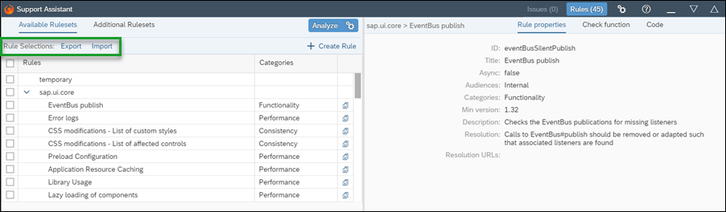
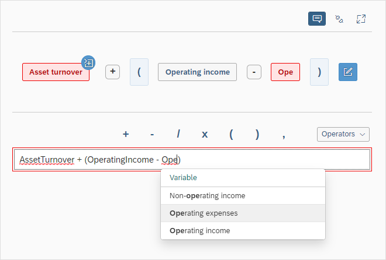
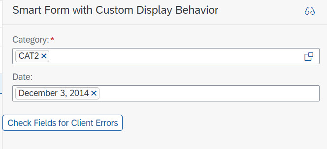
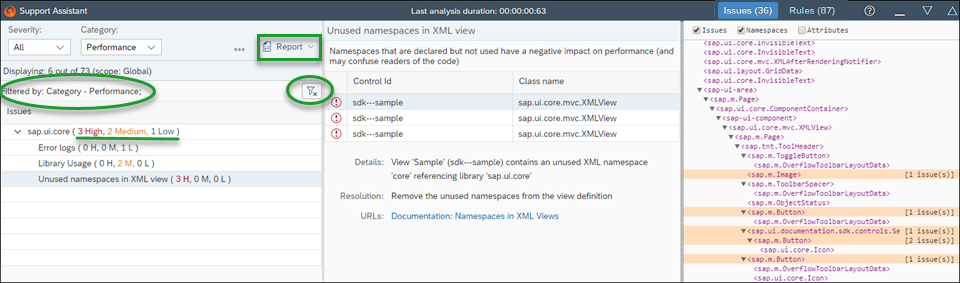
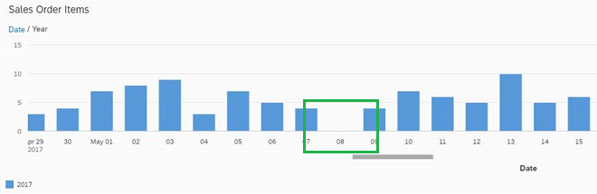
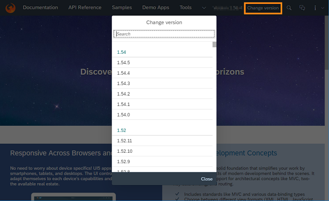
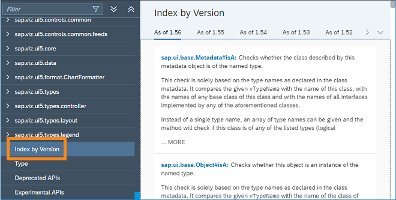

<!-- loio108b7fde0df740258e8dc93f4f857eb5 -->

# What's New in SAPUI5 1.56

With this release SAPUI5 is upgraded from version 1.54 to 1.56.

****


<table>
<tr>
<th valign="top">

Version

</th>
<th valign="top">

Type

</th>
<th valign="top">

Category

</th>
<th valign="top">

Title

</th>
<th valign="top">

Description

</th>
<th valign="top">

Action

</th>
<th valign="top">

Available as of

</th>
</tr>
<tr>
<td valign="top">

1.56 

</td>
<td valign="top">

New 

</td>
<td valign="top">

Feature 

</td>
<td valign="top">

**New Event Handler Parameter Syntax** 

</td>
<td valign="top">

**New Event Handler Parameter Syntax**

When event handlers are assigned to control events in XML views, you can now also specify parameters which can be passed to the event handler. The parameters can be static values as well as bindings and even expressions. This feature helps to reduce controller code and avoid unnecessary controller methods, and separates the controller logic from the retrieval of the required input values.

```xml
<Button text="Add Product" press=".modifyList('add ', ${products>unitPrice})"/>
```

For more information, see [Handling Events in XML Views](../04_Essentials/handling-events-in-xml-views-b0fb4de.md).

<sub>New•Feature•Info Only•1.56</sub>

</td>
<td valign="top">

Info Only

</td>
<td valign="top">

2018-08-02

</td>
</tr>
<tr>
<td valign="top">

1.56

</td>
<td valign="top">

New 

</td>
<td valign="top">

Feature 

</td>
<td valign="top">

**XML Composite Control** 

</td>
<td valign="top">

**XML Composite Control**

A new type of composite control, the XML composite control, is now available. It let's you build more flexible controls that contain separate XML and JavaScript parts. For more information, see the [API Reference](https://ui5.sap.com/#/api/sap.ui.core.XMLComposite) and the [Samples](https://ui5.sap.com/#/entity/sap.ui.core.XMLComposite). 

<sub>New•Feature•Info Only•1.56</sub>

</td>
<td valign="top">

Info Only 

</td>
<td valign="top">

2018-08-02

</td>
</tr>
<tr>
<td valign="top">

1.56

</td>
<td valign="top">

New 

</td>
<td valign="top">

Feature 

</td>
<td valign="top">

**Support Assistant** 

</td>
<td valign="top">

**Support Assistant**

The Support Assistant now allows you to import and export your rule selection. This helps you when you want to perform more than one analysis with the same subset of selected rules. The selection is exported as a `.json` file with a title and description of your choice. You can then import this file and load it whenever you want to execute the same rules in another analysis.



For more information, see [Rules Management](../04_Essentials/rules-management-3fc864a.md).

<sub>New•Feature•Info Only•1.56</sub>

</td>
<td valign="top">

Info Only 

</td>
<td valign="top">

2018-08-02

</td>
</tr>
<tr>
<td valign="top">

1.56

</td>
<td valign="top">

New 

</td>
<td valign="top">

Control 

</td>
<td valign="top">

**`sap.suite.ui.commons.CalculationBuilder`** 

</td>
<td valign="top">

**`sap.suite.ui.commons.CalculationBuilder`**

Enables you to perform arithmetic calculations on constants and variables, using standard arithmetic operators and the most common logical operators and functions. You can customize the sets of variables and functions that are visible in the calculation builder and introduce your own custom functions, as needed. Arithmetic expressions can be entered using a touch-friendly visual editor or a textual editor that provides autocomplete suggestions for variables and checks the expression syntax as you type.

For more information, see [Calculation Builder](../10_More_About_Controls/calculation-builder-1db5047.md), the [API Reference](https://ui5.sap.com/#/api/sap.suite.ui.commons.CalculationBuilder) and the [Samples](https://ui5.sap.com/#/entity/sap.suite.ui.commons.CalculationBuilder).



<sub>New•Control•Info Only•1.56</sub>

</td>
<td valign="top">

Info Only 

</td>
<td valign="top">

2018-08-02

</td>
</tr>
<tr>
<td valign="top">

1.56

</td>
<td valign="top">

New 

</td>
<td valign="top">

Control 

</td>
<td valign="top">

**`sap.ui.comp.smartmultiinput.SmartMultiInput`** 

</td>
<td valign="top">

**`sap.ui.comp.smartmultiinput.SmartMultiInput`**

Acts as a wrapper control for `sap.ui.comp.smartfield.SmartField` and supports the same settings and annotations. It interprets OData metadata to create a multi-input field or a multi-input combobox, similar to `sap.m.MultiInput` and `sap.m.MultiComboBox`, but with added annotation capabilities. Thanks to the annotation support, smart multi-input fields and comboboxes can be embedded into other smart controls, such as `sap.ui.comp.smartform.SmartForm`.

For more information, see [Smart Multi Input](../10_More_About_Controls/smart-multi-input-5644169.md), the [API Reference](https://ui5.sap.com/#/api/sap.ui.comp.smartmultiinput.SmartMultiInput) and the [Samples](https://ui5.sap.com/#/entity/sap.ui.comp.smartmultiinput.SmartMultiInput).



<sub>New•Control•Info Only•1.56</sub>

</td>
<td valign="top">

Info Only 

</td>
<td valign="top">

2018-08-02

</td>
</tr>
<tr>
<td valign="top">

1.56

</td>
<td valign="top">

Changed 

</td>
<td valign="top">

Feature 

</td>
<td valign="top">

**SAPUI5 OData V4 Model** 

</td>
<td valign="top">

**SAPUI5 OData V4 Model**

The new version of the SAPUI5 OData V4 model has the following features:

-   Binding parameter `$$ownRequest` to enforce that a binding sends its own requests.

-   Binding parameter `$$aggregation` to display aggregated data.

    > ### Note:  
    > This feature is still a work in progress. So far it supports displaying a flat list of aggregated data or grouping by one groupable property without being able to expand.

-   The refresh of a single row in an absolute list binding can now also take filters into account .

-   When executing a deferred bound operation, the result of the promise returned by `v4.ODataContextBinding#execute` is the context representing the data of the bound operation response if certain conditions are fulfilled. For more information check the API for <code><a href="https://ui5.sap.com/#/api/sap.ui.model.odata.v4.ODataContextBinding/methods/execute"><code>ODataContextBinding#execute</code></a></code>.


> ### Restriction:  
> Due to the limited feature scope of this version of the SAPUI5 OData V4 model, check that all required features are in place before developing applications. Check the detailed documentation of the features, as certain parts of a feature may be missing. While we aim to be compatible with existing controls, some controls might not work due to small incompatibilities compared to `sap.ui.model.odata.(v2.)ODataModel`, or due to missing features in the model \(such as tree binding\). This also applies to smart controls \(`sap.ui.comp` library\) and SAP Fiori elements that do not support the SAPUI5 OData V4 model, as well as controls such as `TreeTable` and `AnalyticalTable`, which are not supported together with the SAPUI5 OData V4 model. The interface for applications has been changed for easier and more efficient use of the model. For a summary of these changes, see [Changes Compared to OData V2 Model](../04_Essentials/changes-compared-to-odata-v2-model-abd4d7c.md).

For more information, see [OData V4 Model](../04_Essentials/odata-v4-model-5de13cf.md), the [API Reference](https://ui5.sap.com/#/api/sap.ui.model.odata.v4), and the [Sample](https://ui5.sap.com/#/entity/sap.ui.model.odata.v4.ODataModel) in the Demo Kit.

<sub>Changed•Feature•Info Only•1.56</sub>

</td>
<td valign="top">

Info Only 

</td>
<td valign="top">

2018-08-02

</td>
</tr>
<tr>
<td valign="top">

1.56

</td>
<td valign="top">

Changed 

</td>
<td valign="top">

Feature 

</td>
<td valign="top">

**Support Assistant** 

</td>
<td valign="top">

**Support Assistant**

-   `sap.ui.support.ExecutionScope.getElements` has a new parameter `cloned`. It allows users of the Support Assistant to filter out elements that are clones of list bindings. Now the results will include only the representative clone. For more information, see the [API Reference](https://ui5.sap.com/#/api/sap.ui.support.ExecutionScope/methods/Summary).

-   A *Filter* view showing the currently applied filter has been added to the *Issues* view of the Support Assistant. The *Clear Filtering* button \(\) has moved to the *Filter* view. It is active only when there is a filter selected.

-   An explanatory note has been added to the *Additional Rulesets* view under the header to give more clarity about the function of these rulesets and why they are in a separate tab.

-   The *Report* button is now fixed to the panel to be always visible and not to get into the overflow.

-   The font sizes are aligned across all three views for consistency.

-   In the *Issues* view the number of issues is only highlighted when there are issues of medium and high severity. This improvement helps to easily see the distribution of the issues by severity.




<sub>Changed•Feature•Info Only•1.56</sub>

</td>
<td valign="top">

Info Only 

</td>
<td valign="top">

2018-08-02

</td>
</tr>
<tr>
<td valign="top">

1.56

</td>
<td valign="top">

Changed 

</td>
<td valign="top">

Feature 

</td>
<td valign="top">

**Spreadsheet Export** 

</td>
<td valign="top">

**Spreadsheet Export**

Hierarchical structures, such as the `Tree` table, are now enabled in the exported file in the `sap.ui.export` library based on the hierarchy level information provided. For more information, see the [API Reference](https://ui5.sap.com/#/api/sap.ui.export.Spreadsheet/constructor) \(under `workbook.hierarchyLevel`\) and the [Sample](https://ui5.sap.com/#/sample/sap.ui.export.sample.table/preview).

<sub>Changed•Feature•Info Only•1.56</sub>

</td>
<td valign="top">

Info Only 

</td>
<td valign="top">

2018-08-02

</td>
</tr>
<tr>
<td valign="top">

1.56

</td>
<td valign="top">

Changed 

</td>
<td valign="top">

Feature 

</td>
<td valign="top">

**Drag and Drop** 

</td>
<td valign="top">

**Drag and Drop**

Configuration for dragging has been separated from the one for dropping. This allows you to also perform drag-and-drop operations, for example, from one view to another.

For more information, see the [API Reference for `DragInfo`](https://ui5.sap.com/#/api/sap.ui.core.dnd.DragInfo), the [API Reference for `DropInfo`](https://ui5.sap.com/#/api/sap.ui.core.dnd.DropInfo), and the [Sample](https://ui5.sap.com/#/sample/sap.m.sample.TableDnD/preview).

<sub>Changed•Feature•Info Only•1.56</sub>

</td>
<td valign="top">

Info Only 

</td>
<td valign="top">

2018-08-02

</td>
</tr>
<tr>
<td valign="top">

1.56

</td>
<td valign="top">

Changed 

</td>
<td valign="top">

Feature 

</td>
<td valign="top">

**Drag and Drop: General Support \(experimental\)** 

</td>
<td valign="top">

**Drag and Drop: General Support \(experimental\)**

Drag and drop has been enabled for **all** controls \(with the new `dragDropConfig` aggregation\) in `sap.ui.core.Element`.

> ### Restriction:  
> This function is not intended for production use except for the controls for which drag and drop has already been enabled in previous versions \(for example, for tables and lists\).

For more information, see the [API Reference](https://ui5.sap.com/#/api/sap.ui.core.Element/aggregations) \(`dragDropConfig` aggregation\).

<sub>Changed•Feature•Info Only•1.56</sub>

</td>
<td valign="top">

Info Only 

</td>
<td valign="top">

2018-08-02

</td>
</tr>
<tr>
<td valign="top">

1.56

</td>
<td valign="top">

Changed 

</td>
<td valign="top">

Control 

</td>
<td valign="top">

**`sap.f.DynamicPageHeader`** 

</td>
<td valign="top">

**`sap.f.DynamicPageHeader`**

For more information, see the [Sample](https://ui5.sap.com/#/sample/sap.f.sample.DynamicPageFreeStyle/preview).

> ### Note:  
> The above functionality and visual appearance is also maintained when using the dynamic header of the `sap.uxap.ObjectPage` control.

<sub>Changed•Control•Info Only•1.56</sub>

</td>
<td valign="top">

Info Only 

</td>
<td valign="top">

2018-08-02

</td>
</tr>
<tr>
<td valign="top">

1.56

</td>
<td valign="top">

Changed 

</td>
<td valign="top">

Control 

</td>
<td valign="top">

**`sap.gantt`** 

</td>
<td valign="top">

**`sap.gantt`**

When you click the *Bird Eye* button, the Gantt chart intelligently uses the best zoom rate to display shapes in all the rows, visible rows, or a specific row.The expand/collapse arrow and the pin/unpin buttons now have a new visual design. They are centered at the bottom header border next to each other. The interaction behavior is improved and you can now collapse a pinned header with a title tap or click or by choosing the expand/collapse arrow. This means that the pinned state now prevents the header from collapsing only when the user is scrolling the page.

<sub>Changed•Control•Info Only•1.56</sub>

</td>
<td valign="top">

Info Only 

</td>
<td valign="top">

2018-08-02

</td>
</tr>
<tr>
<td valign="top">

1.56

</td>
<td valign="top">

Changed 

</td>
<td valign="top">

Control 

</td>
<td valign="top">

**`sap.m.DateTimePicker`** 

</td>
<td valign="top">

**`sap.m.DateTimePicker`**

Two new properties are added to the control - `minutesStep` and `secondsStep`. They allow configuring the value step for the minutes and seconds sliders. For example, if you need the values for the minutes inside the slider to be multiples of 5, you can use the option - `minutesStep:5`. For more information, see the [API Reference](https://ui5.sap.com/#/api/sap.m.DateTimePicker) and the [Sample](https://ui5.sap.com/#/sample/sap.m.sample.DateTimePicker/preview). 

<sub>Changed•Control•Info Only•1.56</sub>

</td>
<td valign="top">

Info Only 

</td>
<td valign="top">

2018-08-02

</td>
</tr>
<tr>
<td valign="top">

1.56

</td>
<td valign="top">

Changed 

</td>
<td valign="top">

Control 

</td>
<td valign="top">

**`sap.m.IconTabBar`** 

</td>
<td valign="top">

**`sap.m.IconTabBar`**

-   Drag and drop between the header and the overflow list is now possible. When you hover over the overflow button with a dragged element, an overflow list opens and you can drag an item from the header to the list. For more information, see the [API Reference](https://ui5.sap.com/#/api/sap.m.IconTabHeader) and the [Sample](https://ui5.sap.com/#/sample/sap.m.sample.IconTabBarDragDrop/preview).

-   A new `TabDensityMode` property is introduced in both `sap.m.IconTabBar` and `sap.m.IconTabHeader`. The property allows both the Tab Bar and the Header to change their density within different controls. For more information, see the [API Reference](https://ui5.sap.com/#/api/sap.m.IconTabBar) and the [Sample](https://ui5.sap.com/#/sample/sap.m.sample.IconTabBarTabDensityMode/preview).


<sub>Changed•Control•Info Only•1.56</sub>

</td>
<td valign="top">

Info Only 

</td>
<td valign="top">

2018-08-02

</td>
</tr>
<tr>
<td valign="top">

1.56

</td>
<td valign="top">

Changed 

</td>
<td valign="top">

Control 

</td>
<td valign="top">

**`sap.m.List`** 

</td>
<td valign="top">

The expand/collapse arrow and the pin/unpin buttons now have a new visual design. They are

**`sap.m.List`**

The `columns` aggregation was deprecated in version 1.16 and has now been removed. Use the `sap.m.Table` control instead.

<sub>Changed•Control•Info Only•1.56</sub>

</td>
<td valign="top">

Info Only 

</td>
<td valign="top">

2018-08-02

</td>
</tr>
<tr>
<td valign="top">

1.56

</td>
<td valign="top">

Changed 

</td>
<td valign="top">

Control 

</td>
<td valign="top">

**`sap.m.MenuButton`** 

</td>
<td valign="top">

**`sap.m.MenuButton`**

The control now has a new `menuPosition` property. It specifies the position of the popup menu with enlisted options. By default, the menu opens at the bottom left side of the control but if there is not enough space in the current window, it tries to open on the opposite side. For more information, see the [API Reference](https://ui5.sap.com/#/api/sap.m.MenuButton) and the [Sample](https://ui5.sap.com/#/sample/sap.m.sample.MenuButton/preview).

<sub>Changed•Control•Info Only•1.56</sub>

</td>
<td valign="top">

Info Only 

</td>
<td valign="top">

2018-08-02

</td>
</tr>
<tr>
<td valign="top">

1.56

</td>
<td valign="top">

Changed 

</td>
<td valign="top">

Control 

</td>
<td valign="top">

**`sap.m.PlanningCalendar`** 

</td>
<td valign="top">

**`sap.m.PlanningCalendar`**

-   The new `appointmentDragEnter` event allows appointments to be dragged and dropped between calendar rows. By default, when the `enableAppointmentDragAndDrop` property is enabled, appointments can be dragged only within their original `PlanningCalendarRow`. When `enableAppointmentsDragAndDrop` is set to true, attaching the event handler to the `appointmentDragEnter` event can change the default behavior and allow appointments to be dragged on the same row and between calendar rows.

-   Appointments can now be created in one `PlanningCalendarRow` by dragging with the mouse on an empty cell. This behavior is enabled with the `enableAppointmentCreate` boolean property. When creating is finished, an `appointmentCreate` event is fired.

-   The new `enableAppointmentResize` boolean property provides the possibility to resize appointments in one `PlanningCalendarRow`. When resizing is finished, an `appointmentResize` event is fired.

-   A new functionality to copy appointments by dragging them is added on the `PlanningCalendarRow` level. When you press [Ctrl\]/[Cmd\] while dragging an appointment, dropping it will create a copy.For more information, see the [API Reference](https://ui5.sap.com/#/api/sap.m.PlanningCalendarRow) and the [Sample](https://ui5.sap.com/#/sample/sap.m.sample.PlanningCalendarDnD/preview).


<sub>Changed•Control•Info Only•1.56</sub>

</td>
<td valign="top">

Info Only 

</td>
<td valign="top">

2018-08-02

</td>
</tr>
<tr>
<td valign="top">

1.56

</td>
<td valign="top">

Changed 

</td>
<td valign="top">

Control 

</td>
<td valign="top">

**`sap.m.PlanningCalendarRow`** 

</td>
<td valign="top">

**`sap.m.PlanningCalendarRow`**

The new `specialDates` aggregation allows you to mark special days on a row level. The aggregation is of type `sap.ui.unified.DayTypeRange` but you can set a specific type to the corresponding date.For more information, see the [API Reference](https://ui5.sap.com/#/api/sap.m.PlanningCalendarRow/aggregations) and the [Sample](https://ui5.sap.com/#/sample/sap.m.sample.PlanningCalendarWithLegend/preview).

<sub>Changed•Control•Info Only•1.56</sub>

</td>
<td valign="top">

Info Only 

</td>
<td valign="top">

2018-08-02

</td>
</tr>
<tr>
<td valign="top">

1.56

</td>
<td valign="top">

Changed 

</td>
<td valign="top">

Control 

</td>
<td valign="top">

**`sap.m.SelectDialog`** 

</td>
<td valign="top">

**`sap.m.SelectDialog`**

With the new `growing` property, you can control the progressive loading of bound items. By default, it is set to `true` which means that features like the number of selected items in the info bar and search \(if present\) will work only for the currently loaded items. To make sure that all items in the table are loaded at once, and the above features work properly, you should set the growing property to `false`.

> ### Note:  
> The growing functionality cannot be used together with two-way binding.

For more information, see the [API Reference](https://ui5.sap.com/#/api/sap.m.SelectDialog/controlProperties).

<sub>Changed•Control•Info Only•1.56</sub>

</td>
<td valign="top">

Info Only 

</td>
<td valign="top">

2018-08-02

</td>
</tr>
<tr>
<td valign="top">

1.56

</td>
<td valign="top">

Changed 

</td>
<td valign="top">

Control 

</td>
<td valign="top">

**`sap.m.Slider/sap.m.RangeSlider`** 

</td>
<td valign="top">

**`sap.m.Slider/sap.m.RangeSlider`**

-   You can create a custom scale \(for example, with dates\) for the sliders. To do this, you need to add custom scale and implement the `Iscale` interface.

-   You can create a custom tooltip, by extending the class `sap.m.SliderTooltipBase` and overriding some methods. If you want to define your own content for the tooltip, you should override just the `renderTooltipContent` method.


For more information, see [Sliders](../10_More_About_Controls/sliders-84ec82e.md) and the [API Reference](https://ui5.sap.com/#/api/sap.m.Slider/controlProperties).

<sub>Changed•Control•Info Only•1.56</sub>

</td>
<td valign="top">

Info Only 

</td>
<td valign="top">

2018-08-02

</td>
</tr>
<tr>
<td valign="top">

1.56

</td>
<td valign="top">

Changed 

</td>
<td valign="top">

Control 

</td>
<td valign="top">

**`sap.m.Table`** 

</td>
<td valign="top">

**`sap.m.Table`**

-   The new `sticky` property enables the column headers, infobar, and toolbar to remain in a fixed position at the top of the page during vertical scrolling.

    > ### Note:  
    > The API has changed slightly compared to the experimental API provided in version 1.54.

    For more information, see the [API Reference](https://ui5.sap.com/#/api/sap.m.Table/methods/getSticky) and the [Sample](https://ui5.sap.com/#/sample/sap.ui.comp.sample.smarttable.mtableSticky/preview).

-   The `popinLayout` property is now also supported for Microsoft Edge \(version 16 and higher\). For more information, see the [API Reference](https://ui5.sap.com/#/api/sap.m.Table/controlProperties) and the [Sample](https://ui5.sap.com/#/sample/sap.m.sample.Table/preview).

<sub>Changed•Control•Info Only•1.56</sub>

</td>
<td valign="top">

Info Only 

</td>
<td valign="top">

2018-08-02

</td>
</tr>
<tr>
<td valign="top">

1.56

</td>
<td valign="top">

Changed 

</td>
<td valign="top">

Control 

</td>
<td valign="top">

**`sap.m.TableSelectDialog`** 

</td>
<td valign="top">

**`sap.m.TableSelectDialog`**

-   A new property `growing` is added to the control. It determines the progressive loading. When set to `true`, the features *Selected Count* in `Info bar`, *Search*, and *Select/Deselect All*, if present, will work only for the currently loaded items. To ensure that all items in the table are loaded and these features work as expected, you need to set the property to `false`.

    > ### Note:  
    > The growing functionality cannot be used together with two-way binding.

    For more information, see the [API Reference](https://ui5.sap.com/#/api/sap.m.TableSelectDialog) and the [Sample](https://ui5.sap.com/#/sample/sap.m.sample.TableSelectDialogGrowing/preview). 

-   The control now has a *Reset* button which allows you to clear the selection you have made in your Table Select dialog with one click. The button is enabled only when you make a selection. Otherwise, it is grayed out. For more information, see the [API Reference](https://ui5.sap.com/#/api/sap.m.TableSelectDialog) and the [Sample](https://ui5.sap.com/#/sample/sap.m.sample.TableSelectDialog/preview).


<sub>Changed•Control•Info Only•1.56</sub>

</td>
<td valign="top">

Info Only 

</td>
<td valign="top">

2018-08-02

</td>
</tr>
<tr>
<td valign="top">

1.56

</td>
<td valign="top">

Changed 

</td>
<td valign="top">

Control 

</td>
<td valign="top">

**`sap.m.Tree`** 

</td>
<td valign="top">

**`sap.m.Tree`**

You can now expand and collapse multiple rows at once by using the related methods. For more information, see the [API Reference for the `expand` method](https://ui5.sap.com/#/api/sap.m.Tree/methods/expand), the [API Reference for the `collapse` method](https://ui5.sap.com/#/api/sap.m.Tree/methods/collapse), and the [Sample](https://ui5.sap.com/#/sample/sap.m.sample.TreeExpandMulti/preview).

<sub>Changed•Control•Info Only•1.56</sub>

</td>
<td valign="top">

Info Only 

</td>
<td valign="top">

2018-08-02

</td>
</tr>
<tr>
<td valign="top">

1.56

</td>
<td valign="top">

Changed 

</td>
<td valign="top">

Control 

</td>
<td valign="top">

**`sap.ui.comp.smartchart.SmartChart`** 

</td>
<td valign="top">

**`sap.ui.comp.smartchart.SmartChart`**

The representation of date and time has been improved: For example, if a time line is shown on the x-axis of a column chart, each day is displayed on the axis, with no column for days with no available data.



<sub>Changed•Control•Info Only•1.56</sub>

</td>
<td valign="top">

Info Only 

</td>
<td valign="top">

2018-08-02

</td>
</tr>
<tr>
<td valign="top">

1.56

</td>
<td valign="top">

Changed 

</td>
<td valign="top">

Control 

</td>
<td valign="top">

**`sap.ui.comp.smarttable.SmartTable`** 

</td>
<td valign="top">

**`sap.ui.comp.smarttable.SmartTable`**

-   The new `placeToolbarInTable` property now places the toolbar into the corresponding aggregations of the relevant inner table instead of putting the toolbar next to it.

    This property is needed to support the sticky feature of the `sap.m.Table` also within the `SmartTable` control. For more information, see the [API Reference](https://ui5.sap.com/#/api/sap.ui.comp.smarttable.SmartTable/controlProperties) and the [Sample](https://ui5.sap.com/#/sample/sap.ui.comp.sample.smarttable.mtableSticky/preview).

-   An export of hierarchical data is automatically supported if a spreadsheet export is done for `TreeTable`.

<sub>Changed•Control•Info Only•1.56</sub>

</td>
<td valign="top">

Info Only 

</td>
<td valign="top">

2018-08-02

</td>
</tr>
<tr>
<td valign="top">

1.56

</td>
<td valign="top">

Changed 

</td>
<td valign="top">

Control 

</td>
<td valign="top">

**`sap.ui.core.ScrollBar`** 

</td>
<td valign="top">

**`sap.ui.core.ScrollBar`**

The control has been deprecated. For more information, see the [API Reference](https://ui5.sap.com/#/api/sap.ui.core.ScrollBar).

<sub>Changed•Control•Info Only•1.56</sub>

</td>
<td valign="top">

Info Only 

</td>
<td valign="top">

2018-08-02

</td>
</tr>
<tr>
<td valign="top">

1.56

</td>
<td valign="top">

Changed 

</td>
<td valign="top">

Control 

</td>
<td valign="top">

**`sap.ui.layout.BlockLayout`** 

</td>
<td valign="top">

**`sap.ui.layout.BlockLayout`**

The new `titleLink` aggregation allows the replacement of the title of a `BlockLayout` cell with a link using the `sap.m.Link` control. For more information, see the [API Reference](https://ui5.sap.com/#/api/sap.ui.layout.BlockLayout) and the [Sample](https://ui5.sap.com/#/sample/sap.ui.layout.sample.BlockLayoutLinkTitle/preview).

<sub>Changed•Control•Info Only•1.56</sub>

</td>
<td valign="top">

Info Only 

</td>
<td valign="top">

2018-08-02

</td>
</tr>
<tr>
<td valign="top">

1.56

</td>
<td valign="top">

Changed 

</td>
<td valign="top">

Control 

</td>
<td valign="top">

**`sap.ui.layout`** 

</td>
<td valign="top">

**`sap.ui.layout`**

**`sap.ui.layout`** library for `form.Form`, `form.SimpleForm` controls, and the `sap.ui.comp.smartform.SmartForm` control: Usability of the form controls has been improved: The form content is arranged in a flexible, horizontal way depending on the number of columns so the user doesn’t have to scroll unnecessarily, and no vertical space is wasted. A new layout `ColumnLayout` has been created for that purpose. For more information, see the [API Reference](https://ui5.sap.com/#/api/sap.ui.layout.form.ColumnLayout) and the [Sample](https://ui5.sap.com/#/sample/sap.ui.layout.sample.Form_Column_threeGroups234/preview). 

<sub>Changed•Control•Info Only•1.56</sub>

</td>
<td valign="top">

Info Only 

</td>
<td valign="top">

2018-08-02

</td>
</tr>
<tr>
<td valign="top">

1.56

</td>
<td valign="top">

Changed 

</td>
<td valign="top">

Control 

</td>
<td valign="top">

**`sap.ui.unified.Calendar`** 

</td>
<td valign="top">

**`sap.ui.unified.Calendar`**

With the introduction of the `weekNumberSelect` event, the week numbers in Gregorian calendars have become interactive. The event indicates when you have clicked on a week number. Keep in mind that for the event to work, the `intervalSelection` property must be set to `true`. For more information, see the [API Reference](https://ui5.sap.com/#/api/sap.ui.unified.Calendar) and the [Sample](https://ui5.sap.com/#/sample/sap.ui.unified.sample.CalendarSingleIntervalSelection/preview).

<sub>Changed•Control•Info Only•1.56</sub>

</td>
<td valign="top">

Info Only 

</td>
<td valign="top">

2018-08-02

</td>
</tr>
<tr>
<td valign="top">

1.56

</td>
<td valign="top">

Changed 

</td>
<td valign="top">

Control 

</td>
<td valign="top">

**`sap.uxap.ObjectPageDynamicHeaderTitle`** 

</td>
<td valign="top">

**`sap.uxap.ObjectPageDynamicHeaderTitle`**

UI Adaptation is enabled for the control and the following actions are possible:

-   *Move*, *Split*, and *Combine* action buttons

-   *Move* items defined in the `snappedContent` and `expandedContent` aggregations

-   *Remove* and *Reveal* the whole control


For more information, see the [Sample](https://ui5.sap.com/#/sample/sap.uxap.sample.ObjectPageDynamicHeader/preview) and turn on the UI Adaptation using the wrench key button.

<sub>Changed•Control•Info Only•1.56</sub>

</td>
<td valign="top">

Info Only 

</td>
<td valign="top">

2018-08-02

</td>
</tr>
<tr>
<td valign="top">

1.56

</td>
<td valign="top">

Changed 

</td>
<td valign="top">

Control 

</td>
<td valign="top">

**`sap.uxap.ObjectPageHeader`** 

</td>
<td valign="top">

**`sap.uxap.ObjectPageHeader`**

The new `titleSelectorTooltip` aggregation now enables you to set a custom tooltip for the `titleSelector` button of the `sap.uxap.ObjectPageHeader`.For more information, see the [API Reference](https://ui5.sap.com/#/api/sap.uxap.ObjectPageHeader/aggregations).

<sub>Changed•Control•Info Only•1.56</sub>

</td>
<td valign="top">

Info Only 

</td>
<td valign="top">

2018-08-02

</td>
</tr>
<tr>
<td valign="top">

1.56

</td>
<td valign="top">

Changed 

</td>
<td valign="top">

SAP Fiori Elements 

</td>
<td valign="top">

**SAP Fiori Elements** 

</td>
<td valign="top">

**SAP Fiori Elements**

**General Features**

SAP Fiori elements have the following new enhanced features that apply to several floorplans:

-   For list report and analytical list page, you can now extend the bookmark function to save static tiles to the SAP Fiori launchpad. For more information, see [Extending the Bookmark Function to Save Static Tiles to the SAP Fiori Launchpad](../06_SAP_Fiori_Elements/extending-the-bookmark-function-to-save-static-tiles-to-the-sap-fiori-launchpad-7e34ea9.md).

**List Report and Object Page**

List report and object page have the following new and enhanced features:

**General Features**

-   The default title *<Unnamed Object\>* is shown in list reports and object pages for unnamed entities. You can now add more specific default titles for list reports and object pages. For more information, see [Changing Default Titles of New and Unnamed Objects](../06_SAP_Fiori_Elements/changing-default-titles-of-new-and-unnamed-objects-63946c0.md).

-   A new system behavior for handling inconsistent input is now available: Before a business object can be saved by the user, the system displays a message prompting the users to solve these errors. After all errors have been solved, the business object can be saved. For more information, see [Handling Inconsistent Input](../06_SAP_Fiori_Elements/handling-inconsistent-input-486e5b5.md).

-   You can use extension points to adapt the text of the *Delete* dialog box that is displayed when you delete list report items, the entire object page content, or an item from a table on an object page. For more information, see

    -   [Adapting Texts in the Delete Dialog Box Using Extensions \(List Report\)](../06_SAP_Fiori_Elements/adapting-texts-in-the-delete-dialog-box-using-extensions-list-report-25885b6.md)

    -   [Adapting Texts in the Delete Dialog Box \(Object Page Header\)](../06_SAP_Fiori_Elements/adapting-texts-in-the-delete-dialog-box-object-page-header-1fd8e52.md)

    -   [Adapting Texts in the Delete Dialog Box \(Object Page with Nested Smart Table\)](../06_SAP_Fiori_Elements/adapting-texts-in-the-delete-dialog-box-object-page-with-nested-smart-table-b95adf3.md)


**List Report View**

-   The feature "Multiple Views on a List Report Table" has been enhanced to now also support different entity sets. On each tab, you can now display data for different entity sets, for example, a sales order or a supplier. To do so, add the entity set to the corresponding tab in the manifest. For more information, see [Defining Multiple Views on a List Report with Different Entity Sets and Table Settings](../06_SAP_Fiori_Elements/defining-multiple-views-on-a-list-report-with-different-entity-sets-and-table-settings-b6b59e4.md).

-   Sticky table headers are now available by default in list reports.

-   In list reports with page variants, you can now enable filtering in table columns. For more information, see [Managing Variants](../06_SAP_Fiori_Elements/managing-variants-8ce658e.md).


**Object Page View**

-   New extension points are available for subsections. For more information, see [Extension Points for Subsections on the Object Page](../06_SAP_Fiori_Elements/extension-points-for-subsections-on-the-object-page-ce8d468.md).

**Analytical List Page**

Analytical list page supports:

-   Displaying default records on visual filter chart. For more information, see [Visual Filters](../06_SAP_Fiori_Elements/visual-filters-1714720.md).

-   Filtering option in smart tables. For more information, see [Configuring the Table-Only View as the Default Option](../06_SAP_Fiori_Elements/configuring-the-table-only-view-as-the-default-option-d074e26.md).

-   Lazy loading of visual filters when compact filter is set as the default filter mode. For more information, see [Visual Filters](../06_SAP_Fiori_Elements/visual-filters-1714720.md).

-   `DataFieldWithIntentBasedNavigation` annotation that lets you link content in the smart table area. For more information, see [Configuring the Table-Only View as the Default Option](../06_SAP_Fiori_Elements/configuring-the-table-only-view-as-the-default-option-d074e26.md).

-   Key performance indicator annotation for creating KPI tags and KPI cards. For more information, see [Configuring the Title Area](../06_SAP_Fiori_Elements/configuring-the-title-area-ebdb5da.md).


**Overview Page**

Global filter now lets you configure:

-   Custom actions. For more information, see [Custom Actions](../06_SAP_Fiori_Elements/custom-actions-02fb273.md).

-   Search function. For more information, see [Configuring the Global Filter](../06_SAP_Fiori_Elements/configuring-the-global-filter-73d9693.md).


<sub>Changed•SAP Fiori Elements•Info Only•1.56</sub>

</td>
<td valign="top">

Info Only 

</td>
<td valign="top">

2018-08-02

</td>
</tr>
<tr>
<td valign="top">

1.56

</td>
<td valign="top">

Changed 

</td>
<td valign="top">

Analysis Path Framework \(APF\) 

</td>
<td valign="top">

**Analysis Path Framework \(APF\)** 

</td>
<td valign="top">

**Analysis Path Framework \(APF\)**

APF has the following enhanced features:

-   The following chart types have been added to the predefined representation types shipped with APF:

    -   Combined column line chart

    -   Combined stacked column line chart

    -   Combined column line chart with two vertical axes

    -   Combined stacked column line chart with two vertical axes


    For more information, see [Predefined Representation Types](../07_APF/predefined-representation-types-74db7d5.md).

-   In SAP S/4HANA, the generic runtime application for APF now offers in-app help, which you can display to get context-sensitive user assistance for individual fields on the UI.


<sub>Changed•Analysis Path Framework \(APF\)•Info Only•1.56</sub>

</td>
<td valign="top">

Info Only 

</td>
<td valign="top">

2018-08-02

</td>
</tr>
<tr>
<td valign="top">

1.56

</td>
<td valign="top">

New 

</td>
<td valign="top">

User Documentation 

</td>
<td valign="top">

**New Tutorial** 

</td>
<td valign="top">

**New Tutorial**

We have a new tutorial: [Flexible Column Layout App Tutorial](../03_Get-Started/flexible-column-layout-app-tutorial-c4de2df.md). In this tutorial, we showcase how to structure your SAPUI5 app using the layout patterns that comply with the latest SAP Fiori design guidelines.

<sub>Changed•User Documentation•Info Only•1.56</sub>

</td>
<td valign="top">

Info Only 

</td>
<td valign="top">

2018-08-02

</td>
</tr>
<tr>
<td valign="top">

1.56

</td>
<td valign="top">

New 

</td>
<td valign="top">

Feature 

</td>
<td valign="top">

**Demo Kit Improvements** 

</td>
<td valign="top">

**Demo Kit Improvements**

-   We've added a *Change version* button in the Demo Kit's toolbar that enables you to easily switch the app to a different SAPUI5 version.

    

-   In the *API Reference*, at the bottom of the API tree you can now find an *Index by Version* page that displays all APIs grouped by the release version they were first introduced in. Each release version is displayed as a separate tab.

    

    For more information, see *API Reference*: [Index by Version](https://ui5.sap.com/#/api/since).


<sub>New•Feature•Info Only•1.56</sub>

</td>
<td valign="top">

Info Only 

</td>
<td valign="top">

2018-08-02

</td>
</tr>
</table>

**Related Information**  


[What's New in SAPUI5 1.119](what-s-new-in-sapui5-1-119-0b1903a.md "With this release SAPUI5 is upgraded from version 1.118 to 1.119.")

[What's New in SAPUI5 1.118](what-s-new-in-sapui5-1-118-3eecbde.md "With this release SAPUI5 is upgraded from version 1.117 to 1.118.")

[What's New in SAPUI5 1.117](what-s-new-in-sapui5-1-117-029d3b4.md "With this release SAPUI5 is upgraded from version 1.116 to 1.117.")

[What's New in SAPUI5 1.116](what-s-new-in-sapui5-1-116-ebd6f34.md "With this release SAPUI5 is upgraded from version 1.115 to 1.116.")

[What's New in SAPUI5 1.115](what-s-new-in-sapui5-1-115-409fde8.md "With this release SAPUI5 is upgraded from version 1.114 to 1.115.")

[What's New in SAPUI5 1.114](what-s-new-in-sapui5-1-114-890fce1.md "With this release SAPUI5 is upgraded from version 1.113 to 1.114.")

[What's New in SAPUI5 1.113](what-s-new-in-sapui5-1-113-a9553fe.md "With this release SAPUI5 is upgraded from version 1.112 to 1.113.")

[What's New in SAPUI5 1.112](what-s-new-in-sapui5-1-112-34afc69.md "With this release SAPUI5 is upgraded from version 1.111 to 1.112.")

[What's New in SAPUI5 1.111](what-s-new-in-sapui5-1-111-7a67837.md "With this release SAPUI5 is upgraded from version 1.110 to 1.111.")

[What's New in SAPUI5 1.110](what-s-new-in-sapui5-1-110-71a855c.md "With this release SAPUI5 is upgraded from version 1.109 to 1.110.")

[What's New in SAPUI5 1.109](what-s-new-in-sapui5-1-109-3264bd2.md "With this release SAPUI5 is upgraded from version 1.108 to 1.109.")

[What's New in SAPUI5 1.108](what-s-new-in-sapui5-1-108-66e33f0.md "With this release SAPUI5 is upgraded from version 1.107 to 1.108.")

[What's New in SAPUI5 1.107](what-s-new-in-sapui5-1-107-d4ff916.md "With this release SAPUI5 is upgraded from version 1.106 to 1.107.")

[What's New in SAPUI5 1.106](what-s-new-in-sapui5-1-106-5b497b0.md "With this release SAPUI5 is upgraded from version 1.105 to 1.106.")

[What's New in SAPUI5 1.105](what-s-new-in-sapui5-1-105-4d6c00e.md "With this release SAPUI5 is upgraded from version 1.104 to 1.105.")

[What's New in SAPUI5 1.104](what-s-new-in-sapui5-1-104-69e567c.md "With this release SAPUI5 is upgraded from version 1.103 to 1.104.")

[What's New in SAPUI5 1.103](what-s-new-in-sapui5-1-103-0e98c76.md "With this release SAPUI5 is upgraded from version 1.102 to 1.103.")

[What's New in SAPUI5 1.102](what-s-new-in-sapui5-1-102-f038c99.md "With this release SAPUI5 is upgraded from version 1.101 to 1.102.")

[What's New in SAPUI5 1.101](what-s-new-in-sapui5-1-101-7733b00.md "With this release SAPUI5 is upgraded from version 1.100 to 1.101.")

[What's New in SAPUI5 1.100](what-s-new-in-sapui5-1-100-27dec1d.md "With this release SAPUI5 is upgraded from version 1.99 to 1.100.")

[What's New in SAPUI5 1.99](what-s-new-in-sapui5-1-99-4f35848.md "With this release SAPUI5 is upgraded from version 1.98 to 1.99.")

[What's New in SAPUI5 1.98](what-s-new-in-sapui5-1-98-d9f16f2.md "With this release SAPUI5 is upgraded from version 1.97 to 1.98.")

[What's New in SAPUI5 1.97](what-s-new-in-sapui5-1-97-fa0e282.md "With this release SAPUI5 is upgraded from version 1.96 to 1.97.")

[What's New in SAPUI5 1.96](what-s-new-in-sapui5-1-96-7a9269f.md "With this release SAPUI5 is upgraded from version 1.95 to 1.96.")

[What's New in SAPUI5 1.95](what-s-new-in-sapui5-1-95-a1aea67.md "With this release SAPUI5 is upgraded from version 1.94 to 1.95.")

[What's New in SAPUI5 1.94](what-s-new-in-sapui5-1-94-c40f1e6.md "With this release SAPUI5 is upgraded from version 1.93 to 1.94.")

[What's New in SAPUI5 1.93](what-s-new-in-sapui5-1-93-f273340.md "With this release SAPUI5 is upgraded from version 1.92 to 1.93.")

[What's New in SAPUI5 1.92](what-s-new-in-sapui5-1-92-1ef345d.md "With this release SAPUI5 is upgraded from version 1.91 to 1.92.")

[What's New in SAPUI5 1.91](what-s-new-in-sapui5-1-91-0a2bd79.md "With this release SAPUI5 is upgraded from version 1.90 to 1.91.")

[What's New in SAPUI5 1.90](what-s-new-in-sapui5-1-90-91c10c2.md "With this release SAPUI5 is upgraded from version 1.89 to 1.90.")

[What's New in SAPUI5 1.89](what-s-new-in-sapui5-1-89-e56cddc.md "With this release SAPUI5 is upgraded from version 1.88 to 1.89.")

[What's New in SAPUI5 1.88](what-s-new-in-sapui5-1-88-e15a206.md "With this release SAPUI5 is upgraded from version 1.87 to 1.88.")

[What's New in SAPUI5 1.87](what-s-new-in-sapui5-1-87-b506da7.md "With this release SAPUI5 is upgraded from version 1.86 to 1.87.")

[What's New in SAPUI5 1.86](what-s-new-in-sapui5-1-86-4c1c959.md "With this release SAPUI5 is upgraded from version 1.85 to 1.86.")

[What's New in SAPUI5 1.85](what-s-new-in-sapui5-1-85-1d18eb5.md "With this release SAPUI5 is upgraded from version 1.84 to 1.85.")

[What's New in SAPUI5 1.84](what-s-new-in-sapui5-1-84-dc76640.md "With this release SAPUI5 is upgraded from version 1.82 to 1.84.")

[What's New in SAPUI5 1.82](what-s-new-in-sapui5-1-82-3a8dd13.md "With this release SAPUI5 is upgraded from version 1.81 to 1.82.")

[What's New in SAPUI5 1.81](what-s-new-in-sapui5-1-81-f5e2a21.md "With this release SAPUI5 is upgraded from version 1.80 to 1.81.")

[What's New in SAPUI5 1.80](what-s-new-in-sapui5-1-80-8cee506.md "With this release SAPUI5 is upgraded from version 1.79 to 1.80.")

[What's New in SAPUI5 1.79](what-s-new-in-sapui5-1-79-99c4cdc.md "With this release SAPUI5 is upgraded from version 1.78 to 1.79.")

[What's New in SAPUI5 1.78](what-s-new-in-sapui5-1-78-f09b63e.md "With this release SAPUI5 is upgraded from version 1.77 to 1.78.")

[What's New in SAPUI5 1.77](what-s-new-in-sapui5-1-77-c46b439.md "With this release SAPUI5 is upgraded from version 1.76 to 1.77.")

[What's New in SAPUI5 1.76](what-s-new-in-sapui5-1-76-aad03b5.md "With this release SAPUI5 is upgraded from version 1.75 to 1.76.")

[What's New in SAPUI5 1.75](what-s-new-in-sapui5-1-75-5cbb62d.md "With this release SAPUI5 is upgraded from version 1.74 to 1.75.")

[What's New in SAPUI5 1.74](what-s-new-in-sapui5-1-74-c22208a.md "With this release SAPUI5 is upgraded from version 1.73 to 1.74.")

[What's New in SAPUI5 1.73](what-s-new-in-sapui5-1-73-231dd13.md "With this release SAPUI5 is upgraded from version 1.72 to 1.73.")

[What's New in SAPUI5 1.72](what-s-new-in-sapui5-1-72-521cad9.md "With this release SAPUI5 is upgraded from version 1.71 to 1.72.")

[What's New in SAPUI5 1.71](what-s-new-in-sapui5-1-71-a93a6a3.md "With this release SAPUI5 is upgraded from version 1.70 to 1.71.")

[What's New in SAPUI5 1.70](what-s-new-in-sapui5-1-70-f073d69.md "With this release SAPUI5 is upgraded from version 1.69 to 1.70.")

[What's New in SAPUI5 1.69](what-s-new-in-sapui5-1-69-89a18bd.md "With this release SAPUI5 is upgraded from version 1.68 to 1.69.")

[What's New in SAPUI5 1.68](what-s-new-in-sapui5-1-68-f94bf93.md "With this release SAPUI5 is upgraded from version 1.67 to 1.68.")

[What's New in SAPUI5 1.67](what-s-new-in-sapui5-1-67-a6b1472.md "With this release SAPUI5 is upgraded from version 1.66 to 1.67.")

[What's New in SAPUI5 1.66](what-s-new-in-sapui5-1-66-c9896e9.md "With this release SAPUI5 is upgraded from version 1.65 to 1.66.")

[What's New in SAPUI5 1.65](what-s-new-in-sapui5-1-65-0f5acfd.md "With this release SAPUI5 is upgraded from version 1.64 to 1.65.")

[What's New in SAPUI5 1.64](what-s-new-in-sapui5-1-64-0e30822.md "With this release SAPUI5 is upgraded from version 1.63 to 1.64.")

[What's New in SAPUI5 1.63](what-s-new-in-sapui5-1-63-e8d9da7.md "With this release SAPUI5 is upgraded from version 1.62 to 1.63.")

[What's New in SAPUI5 1.62](what-s-new-in-sapui5-1-62-771f4d5.md "With this release SAPUI5 is upgraded from version 1.61 to 1.62.")

[What's New in SAPUI5 1.61](what-s-new-in-sapui5-1-61-d991552.md "With this release SAPUI5 is upgraded from version 1.60 to 1.61.")

[What's New in SAPUI5 1.60](what-s-new-in-sapui5-1-60-5a0e1f7.md "With this release SAPUI5 is upgraded from version 1.58 to 1.60.")

[What's New in SAPUI5 1.58](what-s-new-in-sapui5-1-58-7c927aa.md "With this release SAPUI5 is upgraded from version 1.56 to 1.58.")

[What's New in SAPUI5 1.54](what-s-new-in-sapui5-1-54-c838330.md "With this release SAPUI5 is upgraded from version 1.52 to 1.54.")

[What's New in SAPUI5 1.52](what-s-new-in-sapui5-1-52-849e1b6.md "With this release SAPUI5 is upgraded from version 1.50 to 1.52.")

[What's New in SAPUI5 1.50](what-s-new-in-sapui5-1-50-759e9f3.md "With this release SAPUI5 is upgraded from version 1.48 to 1.50.")

[What's New in SAPUI5 1.48](what-s-new-in-sapui5-1-48-fa1efac.md "With this release SAPUI5 is upgraded from version 1.46 to 1.48.")

[What's New in SAPUI5 1.46](what-s-new-in-sapui5-1-46-6307539.md "With this release SAPUI5 is upgraded from version 1.44 to 1.46.")

[What's New in SAPUI5 1.44](what-s-new-in-sapui5-1-44-a0cb7a0.md "With this release SAPUI5 is upgraded from version 1.42 to 1.44.")

[What's New in SAPUI5 1.42](what-s-new-in-sapui5-1-42-468b05d.md "With this release SAPUI5 is upgraded from version 1.40 to 1.42.")

[What's New in SAPUI5 1.40](what-s-new-in-sapui5-1-40-fbab50e.md "With this release SAPUI5 is upgraded from version 1.38 to 1.40.")

[What's New in SAPUI5 1.38](what-s-new-in-sapui5-1-38-f218918.md "With this release SAPUI5 is upgraded from version 1.36 to 1.38.")

