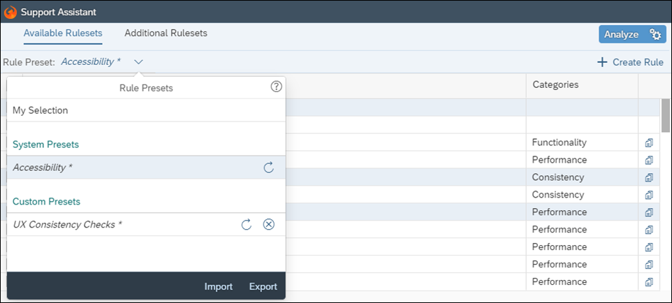
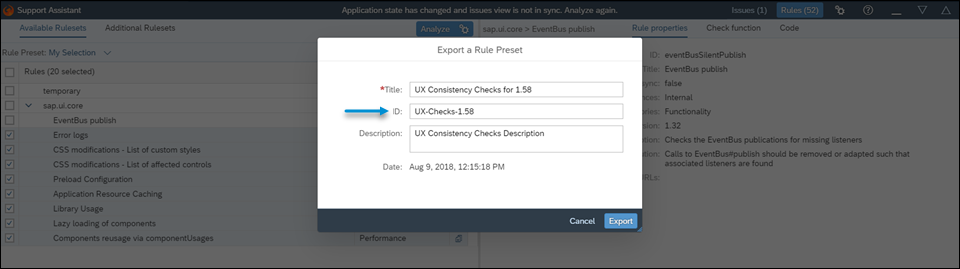
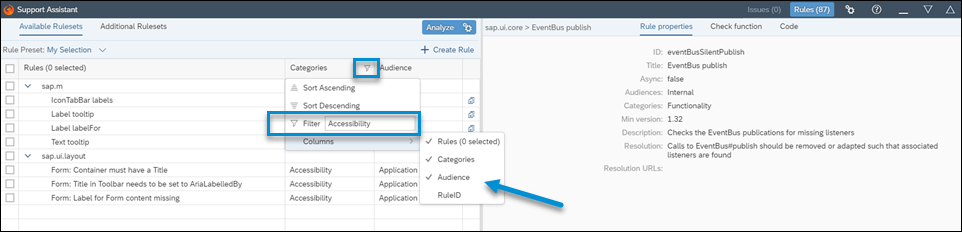
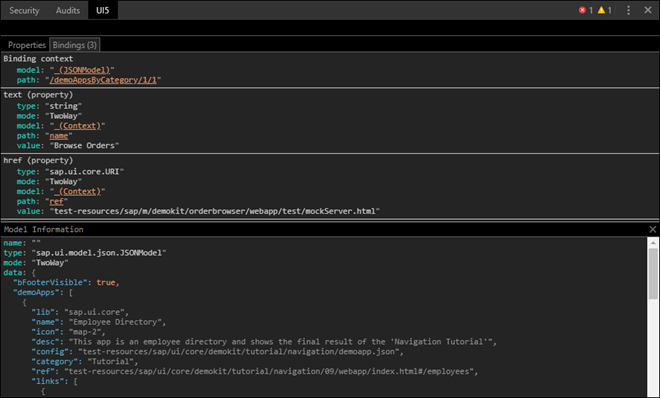
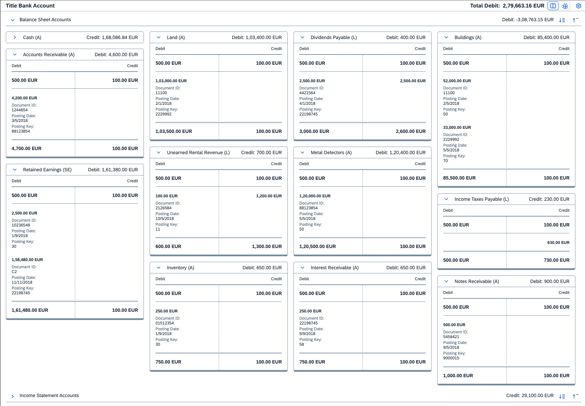
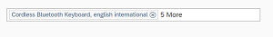
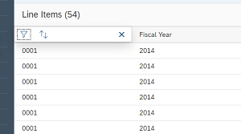
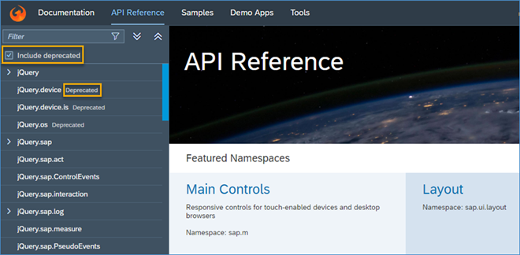

<!-- loio7c927aa3669249aeb1c2375907c048b6 -->

# What's New in SAPUI5 1.58

With this release SAPUI5 is upgraded from version 1.56 to 1.58.

****

<table>
<tr>
<th valign="top">

Version

</th>
<th valign="top">

Type

</th>
<th valign="top">

Category

</th>
<th valign="top">

Title

</th>
<th valign="top">

Description

</th>
<th valign="top">

Action

</th>
<th valign="top">

Available as of

</th>
</tr>
<tr>
<td valign="top">

1.58 

</td>
<td valign="top">

New 

</td>
<td valign="top">

Feature 

</td>
<td valign="top">

**Support Assistant** 

</td>
<td valign="top">

**Support Assistant**

**Rule Presets**

-   A **rule preset management***My Selection*.

    

    > ### Note:  
    > To make sure that your last selection remains available for future use, choose *I agree to use local storage persistency* in the Support Assistant Settings menu.

-   An **ID field** has been added to the *Export a Rule Preset* dialog. The ID is a string of alphanumeric symbols added manually by the user when creating a rule preset. It is useful in case you want to collect data and generate reports on specific rule preset executions within your organization.

    

    For more information, see [Rules Management](../04_Essentials/rules-management-3fc864a.md).

**Rules View Personalization**

The Support Assistant now allows you to personalize the *Rules View* by:

-   Choosing which columns to be visible and which to remain hidden feature has been introduced. It allows you to import, export, and switch between multiple user-defined subsets of preselected rules. You can see all imported rule presets in a dropdown menu and easily switch between them. Your current selection of rules is saved in

-   Sorting the information within a column or filtering it by keyword. To access these options, click on a column header. A dropdown menu opens from which you can choose the desired action.

For more information, see [Rules Management](../04_Essentials/rules-management-3fc864a.md).

New•Feature•Info Only•1.58

</td>
<td valign="top">

Info Only

</td>
<td valign="top">

2018-10-25

</td>
</tr>
<tr>
<td valign="top">

1.58 

</td>
<td valign="top">

New 

</td>
<td valign="top">

Feature 

</td>
<td valign="top">

**UI5 Inspector** 

</td>
<td valign="top">

**UI5 Inspector**

The latest version 0.9.5 of the UI5 Inspector includes two main features:

-   feature hasNow it supports a dark theme, for when you use Google Development Tools in dark mode.

-   In previous versions, the UI5 Inspector did not properly display composite binding structures. Now it shows all parts of the bindings on the *Bindings* tab, including individual models, paths, and values. Clicking on the model link displays the whole model with all values.

    

For more information, see [UI5 Inspector](../04_Essentials/ui5-inspector-b24e724.md).

New•Feature•Info Only•1.58

</td>
<td valign="top">

Info Only 

</td>
<td valign="top">

2018-10-25

</td>
</tr>
<tr>
<td valign="top">

1.58 

</td>
<td valign="top">

New 

</td>
<td valign="top">

Control 

</td>
<td valign="top">

**`sap.suite.ui.commons.TAccount`** 

</td>
<td valign="top">

**`sap.suite.ui.commons.TAccount`**

A control that can be used to display individual line items from one or more accounting documents affecting several general ledger accounts. In T accounts, the line items are entered in two columns, debit and credit, and the account name is placed above those columns, resulting in a T-shaped structure. T accounts can be grouped based on their type or a common attribute, such as balance sheet T accounts and income statement T accounts. A T-account group is displayed as a collapsible panel that provides additional information, such as the total balance of all accounts in the group. On top of the T-account groups, you can add a toolbar that shows total balance across all accounts included in the control and provides additional actions and details.

For more information, see [T Account](../10_More_About_Controls/t-account-fe6792f.md), the [API Reference](https://ui5.sap.com/#/api/sap.suite.ui.commons.TAccount), and the [Samples](https://ui5.sap.com/#/entity/sap.suite.ui.commons.TAccount).

New•Control•Info Only•1.58

</td>
<td valign="top">

Info Only 

</td>
<td valign="top">

2018-10-25

</td>
</tr>
<tr>
<td valign="top">

1.58 

</td>
<td valign="top">

Changed 

</td>
<td valign="top">

Feature 

</td>
<td valign="top">

**Flexibility Panel in the Diagnostics Window** 

</td>
<td valign="top">

**Flexibility Panel in the Diagnostics Window**

The *Flexibility* panel in the *Diagnostics* window now provides better ways to analyze changes. The new *UI Flexibility Diagnostics* application visualizes dependencies between changes, and you can quickly spot which changes have been applied by checking the color of icons that represent the changes.

For more information, see [Diagnostics](../04_Essentials/diagnostics-6ec18e8.md#loio6ec18e80b0ce47f290bc2645b0cc86e6).

Changed•Feature•Info Only•1.58

</td>
<td valign="top">

Info Only 

</td>
<td valign="top">

2018-10-25

</td>
</tr>
<tr>
<td valign="top">

1.58 

</td>
<td valign="top">

Changed 

</td>
<td valign="top">

Feature 

</td>
<td valign="top">

**SAPUI5 OData V4 Model** 

</td>
<td valign="top">

**SAPUI5 OData V4 Model**

The new version of the SAPUI5 OData V4 model introduces the following features:

-   Messages sent in the `sap-messages` header are evaluated by the model and transmitted to the message model.

-   Messages sent in the data response of success responses are processed by the OData V4 model and forwarded to the message model. The message property needs to have the documented structure and its existence needs to be communicated using the dedicated metadata annotation `com.sap.vocabularies.Common.v1.Messages`. For more information, see [OData V2 Messages](../04_Essentials/odata-v2-messages-81c735e.md).

-   Batch groups whose names start with `$auto.` are handled like the predefined group `$auto`.

-   Exclude filters `NB` \(not between\), `NotContains`, `NotEndsWith`, and `NotStartsWith` are supported.

> ### Restriction:  
> Due to the limited feature scope of this version of the SAPUI5 OData V4 model, check that all required features are in place before developing applications. Check the detailed documentation of the features, as certain parts of a feature may be missing. While we aim to be compatible with existing controls, some controls might not work due to small incompatibilities compared to `sap.ui.model.odata.(v2.)ODataModel`, or due to missing features in the model \(such as tree binding\). This also applies to smart controls \(`sap.ui.comp` library\) and SAP Fiori elements that do not support the SAPUI5 OData V4 model, as well as controls such as `TreeTable` and `AnalyticalTable`, which are not supported together with the SAPUI5 OData V4 model. The interface for applications has been changed for easier and more efficient use of the model. For a summary of these changes, see [Changes Compared to OData V2 Model](../04_Essentials/changes-compared-to-odata-v2-model-abd4d7c.md).

For more information, see [OData V4 Model](../04_Essentials/odata-v4-model-5de13cf.md), the [API Reference](https://ui5.sap.com/#/api/sap.ui.model.odata.v4), and the [Samples](https://ui5.sap.com/#/entity/sap.ui.model.odata.v4.ODataModel).

Changed•Feature•Info Only•1.58

</td>
<td valign="top">

Info Only 

</td>
<td valign="top">

2018-10-25

</td>
</tr>
<tr>
<td valign="top">

1.58 

</td>
<td valign="top">

Changed 

</td>
<td valign="top">

Feature 

</td>
<td valign="top">

**Spreadsheet Export** 

</td>
<td valign="top">

**Spreadsheet Export**

A new enumeration type is now available. It allows you to apply simple formatting to statuses, based for example, on a value mapping, such as *1* for *New*, *2* for *In Process*, and *3* for *Completed*.

For more information, see the [API Reference](https://ui5.sap.com/#/api/sap.ui.export.Spreadsheet/overview) and the [Sample](https://ui5.sap.com/#/sample/sap.ui.export.sample.formatting/preview).

Changed•Feature•Info Only•1.58

</td>
<td valign="top">

Info Only 

</td>
<td valign="top">

2018-10-25

</td>
</tr>
<tr>
<td valign="top">

1.58 

</td>
<td valign="top">

Changed 

</td>
<td valign="top">

Feature 

</td>
<td valign="top">

**XML Templating: No Preloading Required for Asynchronous Views** 

</td>
<td valign="top">

**XML Templating: No Preloading Required for Asynchronous Views**

With the new version of XML templating, preloading of OData V4 metadata is no longer required if the view is asynchronous.

For more information, see the [API Reference: `sap.ui.core.util.XMLPreprocessor`](https://ui5.sap.com/#/api/sap.ui.core.util.XMLPreprocessor) and the [API Reference: `sap.ui.core.mvc.XMLView`](https://ui5.sap.com/#/api/sap.ui.core.mvc.XMLView).

Changed•Feature•Info Only•1.58

</td>
<td valign="top">

Info Only 

</td>
<td valign="top">

2018-10-25

</td>
</tr>
<tr>
<td valign="top">

1.58 

</td>
<td valign="top">

Changed 

</td>
<td valign="top">

Control 

</td>
<td valign="top">

**`sap.f.DynamicPage`** 

</td>
<td valign="top">

**`sap.f.DynamicPage`**

-   You can now use the `sapUiContentPadding`, `sapUiNoContentPadding`, and `sapUiResponsiveContentPadding` CSS classes to adjust the content padding of the `DynamicPage` control.For more information, see [Using Container Content Padding CSS Classes](../04_Essentials/using-container-content-padding-css-classes-c71f6df.md) and the [API Reference](https://ui5.sap.com/#/api/sap.f.DynamicPage/aggregations). 

-   The `sap.f.DynamicPageHeader` and `sap.f.DynamicPageTitle` classes now introduce a new `backgroundDesign` property which has three background options - `Solid`, `Transparent`, or `Translucent`. For the new property to be supported correctly when using the dynamic header in `sap.uxap.ObjectPageLayout`, a new `backgroundDesignAnchorBar` property is added to `sap.uxap.ObjectPageLayout`, which is used to control the background color of the `sap.uxap.AnchorBar` through its own newly added `backgroundDesign` property.For more information, see the *API Reference* for [`sap.f.DynamicPageHeader`](https://ui5.sap.com/#/api/sap.f.DynamicPageHeader), [`sap.f.DynamicPageTitle`](https://ui5.sap.com/#/api/sap.f.DynamicPageTitle), [`sap.uxap.ObjectPageLayout`](https://ui5.sap.com/#/api/sap.uxap.ObjectPageLayout), and [`sap.uxap.AnchorBar`](https://ui5.sap.com/#/api/sap.uxap.AnchorBar).

Changed•Control•Info Only•1.58

</td>
<td valign="top">

Info Only 

</td>
<td valign="top">

2018-10-25

</td>
</tr>
<tr>
<td valign="top">

1.58 

</td>
<td valign="top">

Changed 

</td>
<td valign="top">

Control 

</td>
<td valign="top">

**`sap.f.FlexibleColumnLayout`** 

</td>
<td valign="top">

**`sap.f.FlexibleColumnLayout`**

The control now supports reveal effect animation to ensure smooth performance when a new column is opened or column width is changed.For more information, see the [Samples](https://ui5.sap.com/#/entity/sap.f.FlexibleColumnLayout).

Changed•Control•Info Only•1.58

</td>
<td valign="top">

Info Only 

</td>
<td valign="top">

2018-10-25

</td>
</tr>
<tr>
<td valign="top">

1.58 

</td>
<td valign="top">

Changed 

</td>
<td valign="top">

Control 

</td>
<td valign="top">

**`sap.f.semantic.SemanticPage`** 

</td>
<td valign="top">

**`sap.f.semantic.SemanticPage`**

-   The `titleExpandedHeading` and `titleSnappedHeading` aggregations are now available for the `sap.f.semantic.SemanticPage` class, and you can display different content in the expanded and collapsed states of the page header.For more information, see the [API Reference](https://ui5.sap.com/#/api/sap.f.semantic.SemanticPage/aggregations).

-   The `areaShrinkRatio` property is now available for the `sap.f.semantic.SemanticPage` class. The property assigns shrinking ratios to the title areas \(Heading, Content, Actions\) of the `SemanticPage`. The greater value a section has, the faster it shrinks when the screen size is reduced.For more information, see the [API Reference](https://ui5.sap.com/#/api/sap.f.semantic.SemanticPage/controlProperties).

-   With the use of the new `sapFSemanticPageAlignContent` CSS class, you can now vertically align the content in the `SemanticPage` header and page content areas.

Changed•Control•Info Only•1.58

</td>
<td valign="top">

Info Only 

</td>
<td valign="top">

2018-10-25

</td>
</tr>
<tr>
<td valign="top">

1.58 

</td>
<td valign="top">

Changed 

</td>
<td valign="top">

Control 

</td>
<td valign="top">

**`sap.m.App`** 

</td>
<td valign="top">

**`sap.m.App`**

The `mobileWebAppCapable` property is now available. It determines whether the `sap.m.App` is displayed without an address bar when opened from an exported home screen icon on a mobile device.For more information, see the [API Reference](https://ui5.sap.com/#/api/sap.m.App/controlProperties).

Changed•Control•Info Only•1.58

</td>
<td valign="top">

Info Only 

</td>
<td valign="top">

2018-10-25

</td>
</tr>
<tr>
<td valign="top">

1.58 

</td>
<td valign="top">

Changed 

</td>
<td valign="top">

Control 

</td>
<td valign="top">

**`sap.m.CheckBox`** 

</td>
<td valign="top">

**`sap.m.CheckBox`**

The new `partiallySelected` property now allows the `CheckBox` control to be rendered as partially selected.For more information, see the [API Reference](https://ui5.sap.com/#/api/sap.m.CheckBox/controlProperties) and the [Sample](https://ui5.sap.com/#/sample/sap.m.sample.CheckBoxTriState/preview).

Changed•Control•Info Only•1.58

</td>
<td valign="top">

Info Only 

</td>
<td valign="top">

2018-10-25

</td>
</tr>
<tr>
<td valign="top">

1.58 

</td>
<td valign="top">

Changed 

</td>
<td valign="top">

Control 

</td>
<td valign="top">

**`sap.m.ColorPalette`** 

</td>
<td valign="top">

**`sap.m.ColorPalette`**

-   The tooltips of the predefined colors have been formatted in order to be more easily recognizable by users. Now they start with a capital letter, and there are intervals between the words, for example "indianred" has been changed to "Indian Red". For more information, see the [Sample](https://ui5.sap.com/#/sample/sap.m.sample.ColorPalette/preview).

-   The keyboard navigation has been improved by implementing a more intuitive use of the [Up\], [Down\], [Home\], and [End\] keys. In terms of navigation, the color swatch items are treated as columns. For example, if the focus is on the first or on the last item, pressing [Up\] or [Down\] will move the focus respectively to the *Default Color* or *More Colors* button. [Home\] moves the focus to the first color in the row, to the first color in the container, or to the *Default Color* button. [End\] moves the focus to the last color in the row, to the last color in the container, or to the *More Colors* button. For more information, see the [Sample](https://ui5.sap.com/#/sample/sap.m.sample.ColorPalettePopover/preview).

Changed•Control•Info Only•1.58

</td>
<td valign="top">

Info Only 

</td>
<td valign="top">

2018-10-25

</td>
</tr>
<tr>
<td valign="top">

1.58 

</td>
<td valign="top">

Changed 

</td>
<td valign="top">

Control 

</td>
<td valign="top">

**`sap.m.DateTimePicker`** 

</td>
<td valign="top">

**`sap.m.DateTimePicker`**

The Time Picker is now vertically aligned with the Calendar for better user experience. For more information, see the [Sample](https://ui5.sap.com/#/sample/sap.m.sample.DateTimePicker/preview).

Changed•Control•Info Only•1.58

</td>
<td valign="top">

Info Only 

</td>
<td valign="top">

2018-10-25

</td>
</tr>
<tr>
<td valign="top">

1.58 

</td>
<td valign="top">

Changed 

</td>
<td valign="top">

Control 

</td>
<td valign="top">

**`sap.m.List/sap.m.Tree`** 

</td>
<td valign="top">

**`sap.m.List/sap.m.Tree`**

The new `sticky` property is now also available for these controls \(in `sap.m.ListBase`\). It enables the column headers, infobar, and toolbar to remain in a fixed position at the top of the page during vertical scrolling. For more information, see the [API Reference](https://ui5.sap.com/#/api/sap.m.ListBase/controlProperties) for the `sticky` property and the [`ListToolbar` Sample](https://ui5.sap.com/#/sample/sap.m.sample.ListToolbar/preview) as well as the [`TreeExpandMulti` Sample](https://ui5.sap.com/#/sample/sap.m.sample.TreeExpandMulti/preview).

> ### Note:  
> The `sticky` property is not supported in all browsers. For more information about browser limitations, see the [API Reference: `sap.m.ListBase`](https://ui5.sap.com/#/api/sap.m.ListBase).

Changed•Control•Info Only•1.58

</td>
<td valign="top">

Info Only 

</td>
<td valign="top">

2018-10-25

</td>
</tr>
<tr>
<td valign="top">

1.58 

</td>
<td valign="top">

Changed 

</td>
<td valign="top">

Control 

</td>
<td valign="top">

**`sap.m.MessagePopover/sap.m.MessageView`** 

</td>
<td valign="top">

**`sap.m.MessagePopover/sap.m.MessageView`**

The `sap.m.MessageItems` that are aggregated in these controls have a new property - `activeTitle`. If set to `true`, the item’s title will be rendered as a link. Then, an event handler function should be provided for the `activeTitlePress` event, which is an event fired by the control when an active item title is pressed. This allows application developers to link a message in the control to the originating UI element in the application and, for example, automatically scroll to it. For more information, see the [Sample](https://ui5.sap.com/#/sample/sap.m.sample.MessagePopoverMessageHandling/preview).

Changed•Control•Info Only•1.58

</td>
<td valign="top">

Info Only 

</td>
<td valign="top">

2018-10-25

</td>
</tr>
<tr>
<td valign="top">

1.58 

</td>
<td valign="top">

Changed 

</td>
<td valign="top">

Control 

</td>
<td valign="top">

**`sap.m.MultiComboBox`** 

</td>
<td valign="top">

**`sap.m.MultiComboBox`**

The autocomplete functionality is available in the `sap.m.MultiComboBox` control. By default, the autocomplete option works with the "**starts with**" logic for every word in the list item, regardless of the filtering of the items. If a matching item is already selected, it will not trigger the autocomplete.

Changed•Control•Info Only•1.58

</td>
<td valign="top">

Info Only 

</td>
<td valign="top">

2018-10-25

</td>
</tr>
<tr>
<td valign="top">

1.58 

</td>
<td valign="top">

Changed 

</td>
<td valign="top">

Control 

</td>
<td valign="top">

**`sap.m.MultiComboBox/sap.m.ComboBox`** 

</td>
<td valign="top">

**`sap.m.MultiComboBox/sap.m.ComboBox`**

The default filtering function has been changed from "**starts with**" to "**starts with per term**". You can also use a custom filtering function by providing it to the `setFilterFunction` method. In this case, the highlighting will also switch back to the default "**starts with per term**".

Changed•Control•Info Only•1.58

</td>
<td valign="top">

Info Only 

</td>
<td valign="top">

2018-10-25

</td>
</tr>
<tr>
<td valign="top">

1.58 

</td>
<td valign="top">

Changed 

</td>
<td valign="top">

Control 

</td>
<td valign="top">

**`sap.m.MultiComboBox/sap.m.MultiInput`** 

</td>
<td valign="top">

**`sap.m.MultiComboBox/sap.m.MultiInput`**

All overflowing tokens are now available in a separate popover indicated with an *N-more* label, which serves as an opening trigger. This behavior is used to replace the multi-line mode for both controls, which is now deprecated.

Changed•Control•Info Only•1.58

</td>
<td valign="top">

Info Only 

</td>
<td valign="top">

2018-10-25

</td>
</tr>
<tr>
<td valign="top">

1.58 

</td>
<td valign="top">

Changed 

</td>
<td valign="top">

Control 

</td>
<td valign="top">

**`sap.m.OverflowToolbar`** 

</td>
<td valign="top">

**`sap.m.OverflowToolbar`**

Shrinking of controls is now enabled. For the new functionality to work, each control should have the `OverflowToolbarLayoutData` with the `shrinkable` property set to `true` and a specified `minWidth`. This way the control will first shrink to `minWidth` and then, if there is still not enough place, it will move to the overflow area.For more information, see the [Sample](https://ui5.sap.com/#/sample/sap.m.sample.OverflowToolbarSimple/preview).

Changed•Control•Info Only•1.58

</td>
<td valign="top">

Info Only 

</td>
<td valign="top">

2018-10-25

</td>
</tr>
<tr>
<td valign="top">

1.58 

</td>
<td valign="top">

Changed 

</td>
<td valign="top">

Control 

</td>
<td valign="top">

**`sap.m.P13nFilterPanel`** 

</td>
<td valign="top">

**`sap.m.P13nFilterPanel`**

You can now search for an empty string in the filter conditions of the personalization dialog and in the conditions of the `ValueHelpDialog` and the `SmartFilterBar` controls of the `sap.ui.comp` library. For example, you can search for all sales orders that do not contain supplier information by choosing *empty* from the dropdown menu. For more information, see the [Sample](https://ui5.sap.com/#/sample/sap.ui.comp.sample.smartfilterbar.example1/preview).

Changed•Control•Info Only•1.58

</td>
<td valign="top">

Info Only 

</td>
<td valign="top">

2018-10-25

</td>
</tr>
<tr>
<td valign="top">

1.58 

</td>
<td valign="top">

Changed 

</td>
<td valign="top">

Control 

</td>
<td valign="top">

**`sap.m.PlanningCalendar`** 

</td>
<td valign="top">

**`sap.m.PlanningCalendar`**

The background color of the week numbers has been updated to more clearly display which parts of the date navigation of the Planning Calendar are clickable.

Changed•Control•Info Only•1.58

</td>
<td valign="top">

Info Only 

</td>
<td valign="top">

2018-10-25

</td>
</tr>
<tr>
<td valign="top">

1.58 

</td>
<td valign="top">

Changed 

</td>
<td valign="top">

Control 

</td>
<td valign="top">

**`sap.m.SelectDialog`** 

</td>
<td valign="top">

**`sap.m.SelectDialog`**

A *Clear* button has been added to allow you to clear your selection with one click. The button is always positioned at the top right-hand corner of the `sap.m.SelectDialog`. Its visibility is handled by the `showClearButton` property. By default, the property is set to `false`, and the button is not visible.

Changed•Control•Info Only•1.58

</td>
<td valign="top">

Info Only 

</td>
<td valign="top">

2018-10-25

</td>
</tr>
<tr>
<td valign="top">

1.58 

</td>
<td valign="top">

Changed 

</td>
<td valign="top">

Control 

</td>
<td valign="top">

**`sap.m.TableSelectDialog`** 

</td>
<td valign="top">

**`sap.m.TableSelectDialog`**

-   The column headers and the info toolbar are now sticky, which means that they remain fixed on top when scrolling. For more information, see the [API Reference](https://ui5.sap.com/#/api/sap.m.TableSelectDialog) and the [Sample](https://ui5.sap.com/#/sample/sap.m.sample.TableSelectDialog/preview).

    > ### Note:  
    > The `sticky` property is not supported in all browsers. For more information about browser limitations, see the [API Reference: `sap.m.ListBase`](https://ui5.sap.com/#/api/sap.m.ListBase).

-   The *Reset* button is replaced by a *Clear* button. The name has been changed to reflect better the functionality of the button which is to clear a selection made in the Table Select Dialog. The control also has a new `showClearButton` property that allows you to choose whether you want the button to be visible or not. Its default value is `false`. To display the button, set the property to `true`. For more information, see the [API Reference](https://ui5.sap.com/#/api/sap.m.TableSelectDialog) and the [Sample](https://ui5.sap.com/#/sample/sap.m.sample.TableSelectDialog/preview).

Changed•Control•Info Only•1.58

</td>
<td valign="top">

Info Only 

</td>
<td valign="top">

2018-10-25

</td>
</tr>
<tr>
<td valign="top">

1.58 

</td>
<td valign="top">

Changed 

</td>
<td valign="top">

Control 

</td>
<td valign="top">

**`sap.m.TimePicker`** 

</td>
<td valign="top">

**`sap.m.TimePicker`**

The sliders are now vertically centered for better user experience. For more information, see the [Sample](https://ui5.sap.com/#/sample/sap.m.sample.TimePicker/preview).

Changed•Control•Info Only•1.58

</td>
<td valign="top">

Info Only 

</td>
<td valign="top">

2018-10-25

</td>
</tr>
<tr>
<td valign="top">

1.58 

</td>
<td valign="top">

Changed 

</td>
<td valign="top">

Control 

</td>
<td valign="top">

**`sap.ui.comp.navpopover.SmartLink`** 

</td>
<td valign="top">

**`sap.ui.comp.navpopover.SmartLink`**

You can now always access additional content that is shown as a link, even if the intents of the semantic object are not available. Applications can enable this feature using the event handler to allow access to information that is essential for a business process. For more information, see the [Sample](https://ui5.sap.com/#/sample/sap.ui.comp.sample.smartlink.example_05/preview).

Changed•Control•Info Only•1.58

</td>
<td valign="top">

Info Only 

</td>
<td valign="top">

2018-10-25

</td>
</tr>
<tr>
<td valign="top">

1.58 

</td>
<td valign="top">

Changed 

</td>
<td valign="top">

Control 

</td>
<td valign="top">

**`sap.ui.comp.smartfield.SmartField`** 

</td>
<td valign="top">

**`sap.ui.comp.smartfield.SmartField`**

The `ValueListWithFixedValues` annotation now supports numeric values.

Changed•Control•Info Only•1.58

</td>
<td valign="top">

Info Only 

</td>
<td valign="top">

2018-10-25

</td>
</tr>
<tr>
<td valign="top">

1.58 

</td>
<td valign="top">

Changed 

</td>
<td valign="top">

Control 

</td>
<td valign="top">

**`sap.ui.comp.smarttable.SmartTable`** 

</td>
<td valign="top">

**`sap.ui.comp.smarttable.SmartTable`**

Sorting and filtering has now been enabled in the column header menus \(if the `SmartTable` control is used in combination with `sap.m.table`\). To use these functions, you have to set the `useTablePersonalisation` property to `true`. For more information, see the [Sample](https://ui5.sap.com/#/sample/sap.ui.comp.sample.smarttable.mtableCustom/preview).

Changed•Control•Info Only•1.58

</td>
<td valign="top">

Info Only 

</td>
<td valign="top">

2018-10-25

</td>
</tr>
<tr>
<td valign="top">

1.58 

</td>
<td valign="top">

Changed 

</td>
<td valign="top">

Control 

</td>
<td valign="top">

**`sap.ui.comp.smartvariants.SmartVariantManagement`** 

</td>
<td valign="top">

**`sap.ui.comp.smartvariants.SmartVariantManagement`**

You can now use a setting in the SAPUI5 flexibility services that determines whether variants can be shared by all users \(default\) or key users only. For more information, see [2658662](https://me.sap.com/notes/2658662).

Changed•Control•Info Only•1.58

</td>
<td valign="top">

Info Only 

</td>
<td valign="top">

2018-10-25

</td>
</tr>
<tr>
<td valign="top">

1.58 

</td>
<td valign="top">

Changed 

</td>
<td valign="top">

Control 

</td>
<td valign="top">

**`sap.ui.layout.form`** 

</td>
<td valign="top">

**`sap.ui.layout.form`**

You can now use the `Switch` control in all the forms that are editable. For more information, see the [API Reference](https://ui5.sap.com/#/api/sap.m.Switch).

Changed•Control•Info Only•1.58

</td>
<td valign="top">

Info Only 

</td>
<td valign="top">

2018-10-25

</td>
</tr>
<tr>
<td valign="top">

1.58 

</td>
<td valign="top">

Changed 

</td>
<td valign="top">

Control 

</td>
<td valign="top">

**`sap.ui.model.base.ManagedObjectModel`** 

</td>
<td valign="top">

**`sap.ui.model.base.ManagedObjectModel`**

You can now use the model for data binding to the properties and aggregations of your managed objects,especially your controls. For more information, see the [API Reference](https://ui5.sap.com/#/api/sap.ui.model.base.ManagedObjectModel).

Changed•Control•Info Only•1.58

</td>
<td valign="top">

Info Only 

</td>
<td valign="top">

2018-10-25

</td>
</tr>
<tr>
<td valign="top">

1.58 

</td>
<td valign="top">

Changed 

</td>
<td valign="top">

Control 

</td>
<td valign="top">

**`sap.ui.unified.Calendar`** 

</td>
<td valign="top">

**`sap.ui.unified.Calendar`**

-   Colors are adjusted to make a clearer distinction between working and nonworking days in `sap.ui.unified.Calendar` and in `sap.ui.unified.CalendarLegend`. For more information, see the [Sample](https://ui5.sap.com/#/sample/sap.ui.unified.sample.CalendarSpecialDaysLegend/preview).

-   A newly introduced sample demonstrates the recommended usage of the deselection logic when the calendar is in single selection mode. The implementation of this logic allows the app to support deselection of dates so that the user can deselect a previously selected date. For more information, see the [Sample](https://ui5.sap.com/#/sample/sap.ui.unified.sample.CalendarDateDeselection/preview).

-   A new `weekNumberSelect` event is introduced which allows you to select a complete week by clicking on the week number. This function works for Gregorian calendars only and if `intervalSelection` is set to `true`. For more information, see the [API Reference](https://ui5.sap.com/#/api/sap.ui.unified.Calendar) and the [Sample](https://ui5.sap.com/#/sample/sap.ui.unified.sample.CalendarSingleIntervalSelection/preview).

Changed•Control•Info Only•1.58

</td>
<td valign="top">

Info Only 

</td>
<td valign="top">

2018-10-25

</td>
</tr>
<tr>
<td valign="top">

1.58 

</td>
<td valign="top">

Changed 

</td>
<td valign="top">

Control 

</td>
<td valign="top">

**`sap.ui.unified.ColorPicker`** 

</td>
<td valign="top">

**`sap.ui.unified.ColorPicker`**

The new `displayMode` property determines how the control will be displayed. There are three display options - `default`, `large`, and `simplified`. For more information, see the [Sample](https://ui5.sap.com/#/sample/sap.ui.unified.sample.ColorPicker/preview). 

Changed•Control•Info Only•1.58

</td>
<td valign="top">

Info Only 

</td>
<td valign="top">

2018-10-25

</td>
</tr>
<tr>
<td valign="top">

1.58 

</td>
<td valign="top">

Changed 

</td>
<td valign="top">

Control 

</td>
<td valign="top">

**`sap.uxap.ObjectPageLayout`** 

</td>
<td valign="top">

**`sap.uxap.ObjectPageLayout`**

-   The `sap.uxap.AnchorBar` has new functionality for submenu navigation. When activating an anchor/button from the main navigation, it now scrolls directly to the corresponding section.

-   UI Adaptation is enabled for the `sap.uxap.ObjectPageHeaderActionButton` control with the possible actions *Hide*, *Reveal*, and *Rename*.For more information, see the [Sample](https://ui5.sap.com/#/sample/sap.uxap.sample.ObjectPageHeaderActionButtons/preview) and activate UI Adaptation using the wrench key button.

-   The `sap.f.DynamicPageHeader` and `sap.f.DynamicPageTitle` classes now introduce a new `backgroundDesign` property which has three options - `Solid`, `Transparent`, or `Translucent` background. For the new property to be supported correctly when using the dynamic header in `sap.uxap.ObjectPageLayout`, a new `backgroundDesignAnchorBar` property is added to `sap.uxap.ObjectPageLayout`, which is used to control the background color of the `sap.uxap.AnchorBar` through its own newly added `backgroundDesign` property.For more information, see the *API Reference* for [`sap.f.DynamicPageHeader`](https://ui5.sap.com/#/api/sap.f.DynamicPageHeader), [`sap.f.DynamicPageTitle`](https://ui5.sap.com/#/api/sap.f.DynamicPageTitle), [`sap.uxap.ObjectPageLayout`](https://ui5.sap.com/#/api/sap.uxap.ObjectPageLayout), and [`sap.uxap.AnchorBar`](https://ui5.sap.com/#/api/sap.uxap.AnchorBar).

Changed•Control•Info Only•1.58

</td>
<td valign="top">

Info Only 

</td>
<td valign="top">

2018-10-25

</td>
</tr>
<tr>
<td valign="top">

1.58 

</td>
<td valign="top">

Changed 

</td>
<td valign="top">

SAP Fiori Elements 

</td>
<td valign="top">

**SAP Fiori Elements** 

</td>
<td valign="top">

**SAP Fiori Elements**

**General Features**

SAP Fiori elements have the following new enhanced features that apply to several floorplans:

The new extension method `modifyStartupExtension` is available. It can be used for the following purposes:

-   Modifying selection variants: You can modify the filter context while navigating from the SAP Fiori launchpad or from another application to the list report, the overview page, or the analytical list page.

-   Choosing a particular tab dynamically when starting a multitab list report application

For more information, see [Modifying Startup Parameters Using an Extension](../06_SAP_Fiori_Elements/modifying-startup-parameters-using-an-extension-4564eed.md).

**List Report and Object Page**

List report and object page have the following new and enhanced features:

**General Features**

You can add multiple IDs, descriptions, and action buttons to one column in a responsive table.

For more information, see [Adding Multiple Fields to One Column in Responsive Tables](../06_SAP_Fiori_Elements/adding-multiple-fields-to-one-column-in-responsive-tables-d318e42.md).

**List Report View**

The sticky toolbar is now enabled by default in list reports. It is visible even when users scroll through the content of a table.

**Object Page View**

-   For fields where users can enter more than one value, the `SmartMultiInput` control is rendered on the object page if specific conditions are met. For more information, see [Using the Multi-Input Field on the Object Page](../06_SAP_Fiori_Elements/using-the-multi-input-field-on-the-object-page-04ff5b1.md).

-   You can now add titles to tables on the object page. For more information, see [Adding Titles to Object Page Tables](../06_SAP_Fiori_Elements/adding-titles-to-object-page-tables-d9a4539.md).

-   The new `SmartForm` control is enabled per default on the object page. This improves the look and feel of the app as the content of a form is now distributed more evenly. For more information, see the [API Reference: `SmartForm`](https://ui5.sap.com/#/api/sap.ui.comp.smartform.SmartForm) and [Extension Points for Forms on the Object Page](../06_SAP_Fiori_Elements/extension-points-for-forms-on-the-object-page-4e49753.md).

**Analytical List Page**

Visual filters now support date-based single selection fields in Universal Time Coordinated \(UTC\) format. The date selection field appears on the visual filter for fields annotated as `sap:filter-restriction=”single-value"`. For more information, see [Visual Filters](../06_SAP_Fiori_Elements/visual-filters-1714720.md).

**Overview Page**

Overview page has the following new and enhanced features:

-   You can now disable navigation from the analytical list card header area by setting the descriptor property `"navigation": "noHeaderNav"`. For more information, see [Descriptor Configuration for the Overview Page](../06_SAP_Fiori_Elements/descriptor-configuration-for-the-overview-page-f194b41.md).

-   Analytical card now supports a new dual combination chart type that lets you clearly view individual data points for a particular dimension. The chart contains two axis values with a line chart representing the multiple measures. For more information, see [Chart Cards Used in Overview Pages](../06_SAP_Fiori_Elements/chart-cards-used-in-overview-pages-68e62ad.md).

-   A new user role is added \(key user\) to perform UI adaptation at runtime. For more information, see [Key User Capabilities](../06_SAP_Fiori_Elements/key-user-capabilities-4966938.md).

Changed•SAP Fiori Elements•Info Only•1.58

</td>
<td valign="top">

Info Only 

</td>
<td valign="top">

2018-10-25

</td>
</tr>
<tr>
<td valign="top">

1.58 

</td>
<td valign="top">

Changed 

</td>
<td valign="top">

User Documentation 

</td>
<td valign="top">

**New QUnit/OPA Testing Recommendations** 

</td>
<td valign="top">

**New QUnit/OPA Testing Recommendations**

We have updated our recommendations for QUnit and OPA tests in the *Walkthrough* tutorial, the *Testing* tutorial, and in the *Demo Apps*. The tests are now in line with the latest best practices for the unit/integration test setup and no longer use synchronous APIs. For more information, see the following sections in our *Walkthrough* tutorial:

-   [Step 27: Unit Test with QUnit](../03_Get-Started/step-27-unit-test-with-qunit-e1ce1de.md)

-   [Step 28: Integration Test with OPA](../03_Get-Started/step-28-integration-test-with-opa-9bf4dce.md)

Changed•User Documentation•Info Only•1.58

</td>
<td valign="top">

Info Only 

</td>
<td valign="top">

2018-10-25

</td>
</tr>
<tr>
<td valign="top">

1.58 

</td>
<td valign="top">

Changed 

</td>
<td valign="top">

User Documentation 

</td>
<td valign="top">

**Alignment with SAP Fiori 2.0 Design Concepts** 

</td>
<td valign="top">

**Alignment with SAP Fiori 2.0 Design Concepts**

We have updated our *Master-Detail* template as well as our *Browse Orders* demo app. They now adhere to the SAP Fiori 2.0 guidelines and use the flexible column layout \(`sap.f.FlexibleColumnLayout`\) instead of the split app pattern. For more information, see:

-   [Developing Apps with SAP Fiori Tools](../05_Developing_Apps/developing-apps-with-sap-fiori-tools-a460a73.md)

-   [Browse Orders Demo App](https://ui5.sap.com/test-resources/sap/m/demokit/orderbrowser/webapp/test/mockServer.html)

Changed•User Documentation•Info Only•1.58

</td>
<td valign="top">

Info Only 

</td>
<td valign="top">

2018-10-25

</td>
</tr>
<tr>
<td valign="top">

1.58 

</td>
<td valign="top">

New 

</td>
<td valign="top">

Feature 

</td>
<td valign="top">

**Demo Kit Improvements** 

</td>
<td valign="top">

**Demo Kit Improvements**

Until now the *API Reference* tree displayed by default all APIs including deprecated ones. Now we've added an *Include deprecated* checkbox above the tree that allows you to choose whether to see the full list. If it's selected, the deprecated items are displayed in the tree with the label *Deprecated* so you can easily identify them without opening each class.

New•Feature•Info Only•1.58

</td>
<td valign="top">

Info Only 

</td>
<td valign="top">

2018-10-25

</td>
</tr>
</table>

**Related Information**  

[What's New in SAPUI5 1.134](what-s-new-in-sapui5-1-134-c512d71.md "With this release SAPUI5 is upgraded from version 1.133 to 1.134.")

[What's New in SAPUI5 1.133](what-s-new-in-sapui5-1-133-86d7605.md "With this release SAPUI5 is upgraded from version 1.132 to 1.133.")

[What's New in SAPUI5 1.132](what-s-new-in-sapui5-1-132-bd2e61f.md "With this release SAPUI5 is upgraded from version 1.131 to 1.132.")

[What's New in SAPUI5 1.131](what-s-new-in-sapui5-1-131-7d24d94.md "With this release SAPUI5 is upgraded from version 1.130 to 1.131.")

[What's New in SAPUI5 1.130](what-s-new-in-sapui5-1-130-85609d4.md "With this release SAPUI5 is upgraded from version 1.129 to 1.130.")

[What's New in SAPUI5 1.129](what-s-new-in-sapui5-1-129-d22b8af.md "With this release SAPUI5 is upgraded from version 1.128 to 1.129.")

[What's New in SAPUI5 1.128](what-s-new-in-sapui5-1-128-1f76220.md "With this release SAPUI5 is upgraded from version 1.127 to 1.128.")

[What's New in SAPUI5 1.127](what-s-new-in-sapui5-1-127-e5e1317.md "With this release SAPUI5 is upgraded from version 1.126 to 1.127.")

[What's New in SAPUI5 1.126](what-s-new-in-sapui5-1-126-1d98116.md "With this release SAPUI5 is upgraded from version 1.125 to 1.126.")

[What's New in SAPUI5 1.125](what-s-new-in-sapui5-1-125-9d87044.md "With this release SAPUI5 is upgraded from version 1.124 to 1.125.")

[What's New in SAPUI5 1.124](what-s-new-in-sapui5-1-124-7f77c3f.md "With this release SAPUI5 is upgraded from version 1.123 to 1.124.")

[What's New in SAPUI5 1.123](what-s-new-in-sapui5-1-123-9d00ac7.md "With this release SAPUI5 is upgraded from version 1.122 to 1.123.")

[What's New in SAPUI5 1.122](what-s-new-in-sapui5-1-122-5d078da.md "With this release SAPUI5 is upgraded from version 1.121 to 1.122.")

[What's New in SAPUI5 1.121](what-s-new-in-sapui5-1-121-91a4a2f.md "With this release SAPUI5 is upgraded from version 1.120 to 1.121.")

[What's New in SAPUI5 1.120](what-s-new-in-sapui5-1-120-2359b63.md "With this release SAPUI5 is upgraded from version 1.119 to 1.120.")

[What's New in SAPUI5 1.119](what-s-new-in-sapui5-1-119-0b1903a.md "With this release SAPUI5 is upgraded from version 1.118 to 1.119.")

[What's New in SAPUI5 1.118](what-s-new-in-sapui5-1-118-3eecbde.md "With this release SAPUI5 is upgraded from version 1.117 to 1.118.")

[What's New in SAPUI5 1.117](what-s-new-in-sapui5-1-117-029d3b4.md "With this release SAPUI5 is upgraded from version 1.116 to 1.117.")

[What's New in SAPUI5 1.116](what-s-new-in-sapui5-1-116-ebd6f34.md "With this release SAPUI5 is upgraded from version 1.115 to 1.116.")

[What's New in SAPUI5 1.115](what-s-new-in-sapui5-1-115-409fde8.md "With this release SAPUI5 is upgraded from version 1.114 to 1.115.")

[What's New in SAPUI5 1.114](what-s-new-in-sapui5-1-114-890fce1.md "With this release SAPUI5 is upgraded from version 1.113 to 1.114.")

[What's New in SAPUI5 1.113](what-s-new-in-sapui5-1-113-a9553fe.md "With this release SAPUI5 is upgraded from version 1.112 to 1.113.")

[What's New in SAPUI5 1.112](what-s-new-in-sapui5-1-112-34afc69.md "With this release SAPUI5 is upgraded from version 1.111 to 1.112.")

[What's New in SAPUI5 1.111](what-s-new-in-sapui5-1-111-7a67837.md "With this release SAPUI5 is upgraded from version 1.110 to 1.111.")

[What's New in SAPUI5 1.110](what-s-new-in-sapui5-1-110-71a855c.md "With this release SAPUI5 is upgraded from version 1.109 to 1.110.")

[What's New in SAPUI5 1.109](what-s-new-in-sapui5-1-109-3264bd2.md "With this release SAPUI5 is upgraded from version 1.108 to 1.109.")

[What's New in SAPUI5 1.108](what-s-new-in-sapui5-1-108-66e33f0.md "With this release SAPUI5 is upgraded from version 1.107 to 1.108.")

[What's New in SAPUI5 1.107](what-s-new-in-sapui5-1-107-d4ff916.md "With this release SAPUI5 is upgraded from version 1.106 to 1.107.")

[What's New in SAPUI5 1.106](what-s-new-in-sapui5-1-106-5b497b0.md "With this release SAPUI5 is upgraded from version 1.105 to 1.106.")

[What's New in SAPUI5 1.105](what-s-new-in-sapui5-1-105-4d6c00e.md "With this release SAPUI5 is upgraded from version 1.104 to 1.105.")

[What's New in SAPUI5 1.104](what-s-new-in-sapui5-1-104-69e567c.md "With this release SAPUI5 is upgraded from version 1.103 to 1.104.")

[What's New in SAPUI5 1.103](what-s-new-in-sapui5-1-103-0e98c76.md "With this release SAPUI5 is upgraded from version 1.102 to 1.103.")

[What's New in SAPUI5 1.102](what-s-new-in-sapui5-1-102-f038c99.md "With this release SAPUI5 is upgraded from version 1.101 to 1.102.")

[What's New in SAPUI5 1.101](what-s-new-in-sapui5-1-101-7733b00.md "With this release SAPUI5 is upgraded from version 1.100 to 1.101.")

[What's New in SAPUI5 1.100](what-s-new-in-sapui5-1-100-27dec1d.md "With this release SAPUI5 is upgraded from version 1.99 to 1.100.")

[What's New in SAPUI5 1.99](what-s-new-in-sapui5-1-99-4f35848.md "With this release SAPUI5 is upgraded from version 1.98 to 1.99.")

[What's New in SAPUI5 1.98](what-s-new-in-sapui5-1-98-d9f16f2.md "With this release SAPUI5 is upgraded from version 1.97 to 1.98.")

[What's New in SAPUI5 1.97](what-s-new-in-sapui5-1-97-fa0e282.md "With this release SAPUI5 is upgraded from version 1.96 to 1.97.")

[What's New in SAPUI5 1.96](what-s-new-in-sapui5-1-96-7a9269f.md "With this release SAPUI5 is upgraded from version 1.95 to 1.96.")

[What's New in SAPUI5 1.95](what-s-new-in-sapui5-1-95-a1aea67.md "With this release SAPUI5 is upgraded from version 1.94 to 1.95.")

[What's New in SAPUI5 1.94](what-s-new-in-sapui5-1-94-c40f1e6.md "With this release SAPUI5 is upgraded from version 1.93 to 1.94.")

[What's New in SAPUI5 1.93](what-s-new-in-sapui5-1-93-f273340.md "With this release SAPUI5 is upgraded from version 1.92 to 1.93.")

[What's New in SAPUI5 1.92](what-s-new-in-sapui5-1-92-1ef345d.md "With this release SAPUI5 is upgraded from version 1.91 to 1.92.")

[What's New in SAPUI5 1.91](what-s-new-in-sapui5-1-91-0a2bd79.md "With this release SAPUI5 is upgraded from version 1.90 to 1.91.")

[What's New in SAPUI5 1.90](what-s-new-in-sapui5-1-90-91c10c2.md "With this release SAPUI5 is upgraded from version 1.89 to 1.90.")

[What's New in SAPUI5 1.89](what-s-new-in-sapui5-1-89-e56cddc.md "With this release SAPUI5 is upgraded from version 1.88 to 1.89.")

[What's New in SAPUI5 1.88](what-s-new-in-sapui5-1-88-e15a206.md "With this release SAPUI5 is upgraded from version 1.87 to 1.88.")

[What's New in SAPUI5 1.87](what-s-new-in-sapui5-1-87-b506da7.md "With this release SAPUI5 is upgraded from version 1.86 to 1.87.")

[What's New in SAPUI5 1.86](what-s-new-in-sapui5-1-86-4c1c959.md "With this release SAPUI5 is upgraded from version 1.85 to 1.86.")

[What's New in SAPUI5 1.85](what-s-new-in-sapui5-1-85-1d18eb5.md "With this release SAPUI5 is upgraded from version 1.84 to 1.85.")

[What's New in SAPUI5 1.84](what-s-new-in-sapui5-1-84-dc76640.md "With this release SAPUI5 is upgraded from version 1.82 to 1.84.")

[What's New in SAPUI5 1.82](what-s-new-in-sapui5-1-82-3a8dd13.md "With this release SAPUI5 is upgraded from version 1.81 to 1.82.")

[What's New in SAPUI5 1.81](what-s-new-in-sapui5-1-81-f5e2a21.md "With this release SAPUI5 is upgraded from version 1.80 to 1.81.")

[What's New in SAPUI5 1.80](what-s-new-in-sapui5-1-80-8cee506.md "With this release SAPUI5 is upgraded from version 1.79 to 1.80.")

[What's New in SAPUI5 1.79](what-s-new-in-sapui5-1-79-99c4cdc.md "With this release SAPUI5 is upgraded from version 1.78 to 1.79.")

[What's New in SAPUI5 1.78](what-s-new-in-sapui5-1-78-f09b63e.md "With this release SAPUI5 is upgraded from version 1.77 to 1.78.")

[What's New in SAPUI5 1.77](what-s-new-in-sapui5-1-77-c46b439.md "With this release SAPUI5 is upgraded from version 1.76 to 1.77.")

[What's New in SAPUI5 1.76](what-s-new-in-sapui5-1-76-aad03b5.md "With this release SAPUI5 is upgraded from version 1.75 to 1.76.")

[What's New in SAPUI5 1.75](what-s-new-in-sapui5-1-75-5cbb62d.md "With this release SAPUI5 is upgraded from version 1.74 to 1.75.")

[What's New in SAPUI5 1.74](what-s-new-in-sapui5-1-74-c22208a.md "With this release SAPUI5 is upgraded from version 1.73 to 1.74.")

[What's New in SAPUI5 1.73](what-s-new-in-sapui5-1-73-231dd13.md "With this release SAPUI5 is upgraded from version 1.72 to 1.73.")

[What's New in SAPUI5 1.72](what-s-new-in-sapui5-1-72-521cad9.md "With this release SAPUI5 is upgraded from version 1.71 to 1.72.")

[What's New in SAPUI5 1.71](what-s-new-in-sapui5-1-71-a93a6a3.md "With this release SAPUI5 is upgraded from version 1.70 to 1.71.")

[What's New in SAPUI5 1.70](what-s-new-in-sapui5-1-70-f073d69.md "With this release SAPUI5 is upgraded from version 1.69 to 1.70.")

[What's New in SAPUI5 1.69](what-s-new-in-sapui5-1-69-89a18bd.md "With this release SAPUI5 is upgraded from version 1.68 to 1.69.")

[What's New in SAPUI5 1.68](what-s-new-in-sapui5-1-68-f94bf93.md "With this release SAPUI5 is upgraded from version 1.67 to 1.68.")

[What's New in SAPUI5 1.67](what-s-new-in-sapui5-1-67-a6b1472.md "With this release SAPUI5 is upgraded from version 1.66 to 1.67.")

[What's New in SAPUI5 1.66](what-s-new-in-sapui5-1-66-c9896e9.md "With this release SAPUI5 is upgraded from version 1.65 to 1.66.")

[What's New in SAPUI5 1.65](what-s-new-in-sapui5-1-65-0f5acfd.md "With this release SAPUI5 is upgraded from version 1.64 to 1.65.")

[What's New in SAPUI5 1.64](what-s-new-in-sapui5-1-64-0e30822.md "With this release SAPUI5 is upgraded from version 1.63 to 1.64.")

[What's New in SAPUI5 1.63](what-s-new-in-sapui5-1-63-e8d9da7.md "With this release SAPUI5 is upgraded from version 1.62 to 1.63.")

[What's New in SAPUI5 1.62](what-s-new-in-sapui5-1-62-771f4d5.md "With this release SAPUI5 is upgraded from version 1.61 to 1.62.")

[What's New in SAPUI5 1.61](what-s-new-in-sapui5-1-61-d991552.md "With this release SAPUI5 is upgraded from version 1.60 to 1.61.")

[What's New in SAPUI5 1.60](what-s-new-in-sapui5-1-60-5a0e1f7.md "With this release SAPUI5 is upgraded from version 1.58 to 1.60.")

[What's New in SAPUI5 1.56](what-s-new-in-sapui5-1-56-108b7fd.md "With this release SAPUI5 is upgraded from version 1.54 to 1.56.")

[What's New in SAPUI5 1.54](what-s-new-in-sapui5-1-54-c838330.md "With this release SAPUI5 is upgraded from version 1.52 to 1.54.")

[What's New in SAPUI5 1.52](what-s-new-in-sapui5-1-52-849e1b6.md "With this release SAPUI5 is upgraded from version 1.50 to 1.52.")

[What's New in SAPUI5 1.50](what-s-new-in-sapui5-1-50-759e9f3.md "With this release SAPUI5 is upgraded from version 1.48 to 1.50.")

[What's New in SAPUI5 1.48](what-s-new-in-sapui5-1-48-fa1efac.md "With this release SAPUI5 is upgraded from version 1.46 to 1.48.")

[What's New in SAPUI5 1.46](what-s-new-in-sapui5-1-46-6307539.md "With this release SAPUI5 is upgraded from version 1.44 to 1.46.")

[What's New in SAPUI5 1.44](what-s-new-in-sapui5-1-44-a0cb7a0.md "With this release SAPUI5 is upgraded from version 1.42 to 1.44.")

[What's New in SAPUI5 1.42](what-s-new-in-sapui5-1-42-468b05d.md "With this release SAPUI5 is upgraded from version 1.40 to 1.42.")

[What's New in SAPUI5 1.40](what-s-new-in-sapui5-1-40-fbab50e.md "With this release SAPUI5 is upgraded from version 1.38 to 1.40.")

[What's New in SAPUI5 1.38](what-s-new-in-sapui5-1-38-f218918.md "With this release SAPUI5 is upgraded from version 1.36 to 1.38.")

