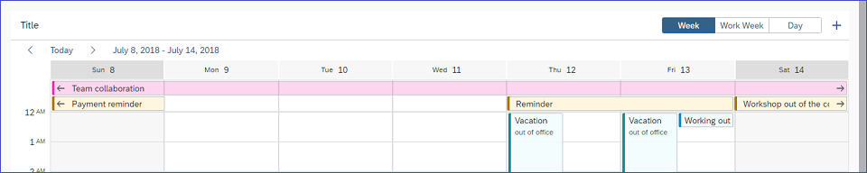
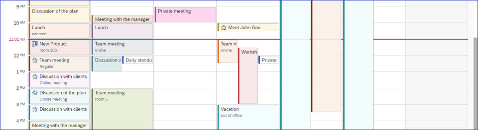

<!-- loiod9915520aee34b7b83dd2cd85f4db007 -->

# What's New in SAPUI5 1.61

With this release SAPUI5 is upgraded from version 1.60 to 1.61.

****

<table>
<tr>
<th valign="top">

Version

</th>
<th valign="top">

Type

</th>
<th valign="top">

Category

</th>
<th valign="top">

Title

</th>
<th valign="top">

Description

</th>
<th valign="top">

Action

</th>
<th valign="top">

Available as of

</th>
</tr>
<tr>
<td valign="top">

1.61 

</td>
<td valign="top">

New 

</td>
<td valign="top">

Feature 

</td>
<td valign="top">

**Enabling Applications to Comply with the Content Security Policy \(CSP\)** 

</td>
<td valign="top">

**Enabling Applications to Comply with the Content Security Policy \(CSP\)**

The SAPUI5 framework now allows you to run applications in an environment in which CSP has been enabled. Inline scripts are not required anymore, but you must still allow `eval()` for SAPUI5 to run. For details about the supported policies, and for recommendations on writing CSP-compliant applications, see [Content Security Policy](../05_Developing_Apps/content-security-policy-fe1a6db.md).

> ### Note:  
> An application needs to be prepared to the used policy to run in a CSP-enabled environment.

New•Feature•Info Only•1.61

</td>
<td valign="top">

Info Only

</td>
<td valign="top">

2018-12-20

</td>
</tr>
<tr>
<td valign="top">

1.61 

</td>
<td valign="top">

New 

</td>
<td valign="top">

Control 

</td>
<td valign="top">

<code><b><code>sap.m.SinglePlanningCalendar</code></b></code> 

</td>
<td valign="top">

<code><b><code>sap.m.SinglePlanningCalendar</code></b></code>

The `sap.m.SinglePlanningCalendar` is a new control designed to display the schedule of a single resource. It can display three types of time intervals - a single day, a work week, or a full week. You can add custom actions to facilitate the interaction with the control.

  
  
**SinglePlanningCalendar Header Area**

  
  
**SinglePlanningCalendar Meetings**

For more information, see the [API Reference](https://ui5.sap.com/#/api/sap.m.SinglePlanningCalendar) and the [Samples](https://ui5.sap.com/#/entity/sap.m.SinglePlanningCalendar).

New•Control•Info Only•1.61

</td>
<td valign="top">

Info Only 

</td>
<td valign="top">

2018-12-20

</td>
</tr>
<tr>
<td valign="top">

1.61 

</td>
<td valign="top">

Changed 

</td>
<td valign="top">

Feature 

</td>
<td valign="top">

**SAPUI5 OData V4 Model** 

</td>
<td valign="top">

**SAPUI5 OData V4 Model**

The new version of the SAPUI5 OData V4 model introduces the following features:

-   `sap.ui.model.odata.v4.Context#refresh` is supported for the bound context and the return value context of `sap.ui.model.odata.v4.ODataContextBinding`.

-   You can now use `sap.ui.model.odata.v4.Context#requestSideEffects` to load side effects when implicit loading is switched off via the binding-specific parameter `$$patchWithoutSideEffects`. This method must only be called on the bound context of a context binding, or on the return value context of an operation binding. With SAPUI5 1.61, there is only basic support for :n navigations, that is, the complete context is refreshed.

-   For the calculation of the path for reading data, relative bindings use the path of the context instead of the canonical path. The creation of a new entity uses the deep path as well. Use the `$$canonicalPath` binding-specific parameter to switch to the old behavior.

Note that we have introduced this change to support message processing.

> ### Restriction:  
> Due to the limited feature scope of this version of the SAPUI5 OData V4 model, check that all required features are in place before developing applications. Check the detailed documentation of the features, as certain parts of a feature may be missing. While we aim to be compatible with existing controls, some controls might not work due to small incompatibilities compared to `sap.ui.model.odata.(v2.)ODataModel`, or due to missing features in the model \(such as tree binding\). This also applies to smart controls \(`sap.ui.comp` library\) and SAP Fiori elements that do not support the SAPUI5 OData V4 model, as well as controls such as `TreeTable` and `AnalyticalTable`, which are not supported together with the SAPUI5 OData V4 model. The interface for applications has been changed for easier and more efficient use of the model. For a summary of these changes, see [Changes Compared to OData V2 Model](../04_Essentials/changes-compared-to-odata-v2-model-abd4d7c.md).

Changed•Feature•Info Only•1.61

</td>
<td valign="top">

Info Only 

</td>
<td valign="top">

2018-12-20

</td>
</tr>
<tr>
<td valign="top">

1.61 

</td>
<td valign="top">

Changed 

</td>
<td valign="top">

Control 

</td>
<td valign="top">

**`sap.f.DynamicPage`/`sap.f.semantic.SemanticPage`** 

</td>
<td valign="top">

**`sap.f.DynamicPage`/`sap.f.semantic.SemanticPage`**

-   With the use of the new accessibility `landmarkInfo` aggregation, you can now set custom accessibility roles and labels for the different sections of the pages.For more information, see the [API Reference](https://ui5.sap.com/#/api/sap.f.DynamicPageAccessibleLandmarkInfo).

-   We have enabled the controls to be a droppable area. For more information, see [Drag and Drop](../04_Essentials/drag-and-drop-3ddb6cd.md).

Changed•Control•Info Only•1.61

</td>
<td valign="top">

Info Only 

</td>
<td valign="top">

2018-12-20

</td>
</tr>
<tr>
<td valign="top">

1.61 

</td>
<td valign="top">

Changed 

</td>
<td valign="top">

Control 

</td>
<td valign="top">

**`sap.f.GridList`** 

</td>
<td valign="top">

**`sap.f.GridList`**

We have implemented a regressive enhancement \(polyfill\) that enables the `sap.f.GridList` layout to work with Microsoft Internet Explorer 11. For more information, see the [Sample](https://ui5.sap.com/#/sample/sap.f.sample.GridListBoxContainer/preview).

Changed•Control•Info Only•1.61

</td>
<td valign="top">

Info Only 

</td>
<td valign="top">

2018-12-20

</td>
</tr>
<tr>
<td valign="top">

1.61 

</td>
<td valign="top">

Changed 

</td>
<td valign="top">

Control 

</td>
<td valign="top">

**`sap.m.Input`** 

</td>
<td valign="top">

**`sap.m.Input`**

Тhe **`sap.m.Input`** control now has autocomplete functionality which is enabled when the `showSuggestion` Boolean property is set to `true` \(default\). As the user types in the input field, the first matching item from the suggestions list gets highlighted. Matching text is based on the beginning of the first word entered in the input field. An autocompleted value can be accepted by pressing [Enter\]. For more information, see the [API Reference](https://ui5.sap.com/#/api/sap.m.Input) and the [Samples](https://ui5.sap.com/#/entity/sap.m.Input).

Changed•Control•Info Only•1.61

</td>
<td valign="top">

Info Only 

</td>
<td valign="top">

2018-12-20

</td>
</tr>
<tr>
<td valign="top">

1.61 

</td>
<td valign="top">

Changed 

</td>
<td valign="top">

Control 

</td>
<td valign="top">

**`sap.m.Label`** 

</td>
<td valign="top">

**`sap.m.Label`**

We have changed the color for labels whose `displayOnly` property is set to `true`. The new color results in \#666 for the Belize theme and \#ddd for the Belize Deep theme. With this change, the color contrast ratio returns to the standard requirement, and the `displayOnly` label is visually indistinguishable from the normal label. For more information, see the [API Reference](https://ui5.sap.com/#/api/sap.m.Label) and the [Samples](https://ui5.sap.com/#/entity/sap.m.Label).

Changed•Control•Info Only•1.61

</td>
<td valign="top">

Info Only 

</td>
<td valign="top">

2018-12-20

</td>
</tr>
<tr>
<td valign="top">

1.61 

</td>
<td valign="top">

Changed 

</td>
<td valign="top">

Control 

</td>
<td valign="top">

**`sap.m.ObjectHeader`** 

</td>
<td valign="top">

**`sap.m.ObjectHeader`**

Тhe `sap.m.ObjectHeader` control now supports circle-shaped images with the use of the new `imageShape` property. For more information, see the [API Reference](https://ui5.sap.com/#/api/sap.m.ObjectHeader) and the [Samples](https://ui5.sap.com/#/entity/sap.m.ObjectHeader).

Changed•Control•Info Only•1.61

</td>
<td valign="top">

Info Only 

</td>
<td valign="top">

2018-12-20

</td>
</tr>
<tr>
<td valign="top">

1.61 

</td>
<td valign="top">

Changed 

</td>
<td valign="top">

Control 

</td>
<td valign="top">

**`sap.m.Select`/`sap.m.SelectList`** 

</td>
<td valign="top">

**`sap.m.Select`/`sap.m.SelectList`**

The `sap.m.Select` and `sap.m.SelectList` controls can now display icons before the text. You can set the icons through the `icon` property of each `sap.ui.core.ListItem` used in `sap.m.SelectList` or `sap.m.Select`.For more information, see [Sample: sap.m.Select](https://ui5.sap.com/#/sample/sap.m.sample.SelectWithIcons/preview) and [Sample: sap.m.SelectList](https://ui5.sap.com/#/sample/sap.m.sample.SelectListWithIcons/preview).

Changed•Control•Info Only•1.61

</td>
<td valign="top">

Info Only 

</td>
<td valign="top">

2018-12-20

</td>
</tr>
<tr>
<td valign="top">

1.61 

</td>
<td valign="top">

Changed 

</td>
<td valign="top">

Control 

</td>
<td valign="top">

**`sap.m.semantic.DetailPage`/`sap.m.semantic.SemanticPage`** 

</td>
<td valign="top">

**`sap.m.semantic.DetailPage`/`sap.m.semantic.SemanticPage`**

We have enabled the controls to be a droppable area. For more information, see [Drag and Drop](../04_Essentials/drag-and-drop-3ddb6cd.md).

Changed•Control•Info Only•1.61

</td>
<td valign="top">

Info Only 

</td>
<td valign="top">

2018-12-20

</td>
</tr>
<tr>
<td valign="top">

1.61 

</td>
<td valign="top">

Changed 

</td>
<td valign="top">

Control 

</td>
<td valign="top">

**`sap.m.Table`** 

</td>
<td valign="top">

**`sap.m.Table`**

The `sortIndicator` property, which indicates that a column is sorted, is now available in `sap.m.Column`. The column displays the appropriate icon and also shows the sort order in the column. For more information, see the [API Reference](https://ui5.sap.com/#/api/sap.m.Column/controlProperties) for the `SortIndicator` property.

Changed•Control•Info Only•1.61

</td>
<td valign="top">

Info Only 

</td>
<td valign="top">

2018-12-20

</td>
</tr>
<tr>
<td valign="top">

1.61 

</td>
<td valign="top">

Changed 

</td>
<td valign="top">

Control 

</td>
<td valign="top">

**`sap.ui.comp.smartchart.SmartChart`** 

</td>
<td valign="top">

**`sap.ui.comp.smartchart.SmartChart`**

The control now supports the `com.sap.vocabularies.UI.v1.ValueCriticality` annotation, which shows data points in the chart in colors based on the criticality of the dimension values. For more information, see the [Sample](https://ui5.sap.com/#/sample/sap.ui.comp.sample.smartchart.semanticDimensionColoring/preview).

Changed•Control•Info Only•1.61

</td>
<td valign="top">

Info Only 

</td>
<td valign="top">

2018-12-20

</td>
</tr>
<tr>
<td valign="top">

1.61 

</td>
<td valign="top">

Changed 

</td>
<td valign="top">

Control 

</td>
<td valign="top">

**`sap.ui.comp.smarttable.SmartTable`** 

</td>
<td valign="top">

**`sap.ui.comp.smarttable.SmartTable`**

To make descriptions more readable, column widths are now automatically adjusted for text arrangements of type `TextFirst` \(shows a description followed by the ID\), and `TextOnly` \(shows the description only\). The column width is maximized in these cases, and the column does not have to be resized. For more information, see the [API Reference](https://ui5.sap.com/#/api/sap.ui.comp.smarttable.SmartTable/annotations/TextArrangement) and the [Sample](https://ui5.sap.com/#/sample/sap.ui.comp.sample.smarttable/preview).

Changed•Control•Info Only•1.61

</td>
<td valign="top">

Info Only 

</td>
<td valign="top">

2018-12-20

</td>
</tr>
<tr>
<td valign="top">

1.61 

</td>
<td valign="top">

Changed 

</td>
<td valign="top">

Control 

</td>
<td valign="top">

**`sap.ui.layout.cssgrid.CSSGrid`** 

</td>
<td valign="top">

**`sap.ui.layout.cssgrid.CSSGrid`**

We have added new samples to demonstrate different use cases. For more information, see the [Samples](https://ui5.sap.com/#/entity/sap.ui.layout.cssgrid.CSSGrid).

Changed•Control•Info Only•1.61

</td>
<td valign="top">

Info Only 

</td>
<td valign="top">

2018-12-20

</td>
</tr>
<tr>
<td valign="top">

1.61 

</td>
<td valign="top">

Changed 

</td>
<td valign="top">

Control 

</td>
<td valign="top">

**`sap.ui.unified.Calendar`** 

</td>
<td valign="top">

**`sap.ui.unified.Calendar`**

The `sap.ui.unified.Calendar` control now has aligned keyboard navigation when used in a single interval selection mode. This means that if the user has selected the start date but has not yet selected the end date, all dates between the start date and the date the mouse is currently hovering over will be highlighted to indicate that they will be part of the selected interval.

Changed•Control•Info Only•1.61

</td>
<td valign="top">

Info Only 

</td>
<td valign="top">

2018-12-20

</td>
</tr>
<tr>
<td valign="top">

1.61 

</td>
<td valign="top">

Changed 

</td>
<td valign="top">

Control 

</td>
<td valign="top">

**`sap.uxap.ObjectPageLayout`** 

</td>
<td valign="top">

**`sap.uxap.ObjectPageLayout`**

-   You can now enable the subsections of `sap.uxap.ObjectPageLayout` to expand to the full height of the sections container. To do this, add the `sapUxAPObjectPageSubSectionFitContainer` CSS class to the `sap.uxap.ObjectPageSubSection` to make it auto-expandable.

-   With the use of the new accessibility `landmarkInfo` aggregation, you can now set custom accessibility roles and labels for the different sections of the page.For more information, see the [API Reference](https://ui5.sap.com/#/api/sap.uxap.ObjectPageAccessibleLandmarkInfo).

-   We have enabled the control to be a droppable area. For more information, see [Drag and Drop](../04_Essentials/drag-and-drop-3ddb6cd.md).

-   We have changed the default layout of `Form`/`SimpleForm` in `ObjectPageSubSection` from `ResponsiveGridLayout` to `ColumnLayout`.For more information, see [API Reference](https://ui5.sap.com/#/api/sap.ui.layout.form.ColumnLayout) and the [Sample](https://ui5.sap.com/#/sample/sap.uxap.sample.ObjectPageFormLayout/preview).

Changed•Control•Info Only•1.61

</td>
<td valign="top">

Info Only 

</td>
<td valign="top">

2018-12-20

</td>
</tr>
<tr>
<td valign="top">

1.61 

</td>
<td valign="top">

Changed 

</td>
<td valign="top">

SAP Fiori Elements 

</td>
<td valign="top">

**SAP Fiori Elements** 

</td>
<td valign="top">

**SAP Fiori Elements**

**List Report and Object Page**

The list report has these new features:

-   By default, the analytical, grid, and tree tables in list reports use up all of the table container's space on the page. If you don't want the tables to use the entire space, you can set the `fitContent` property to `false`.

The object page has these new features:

-   Based on the default sort order, each new row is placed at the top of the table. You can disable this default sort order in the manifest.json and enter your own sorting logic. For more information, see [Enabling Inline Creation Mode or Empty Row Mode for Table Entries](../06_SAP_Fiori_Elements/enabling-inline-creation-mode-or-empty-row-mode-for-table-entries-cfb04f0.md).

-   Users can now toggle between the active and draft versions of the records in draft-enabled applications by using *Display Active Version* / *Continue Editing*.

**Overview Page**

The overview page has these new features or enhancements:

-   The Others sector of the donut chart in the analytical card type lets you pass filter conditions other than the dimensions shown on the donut chart. For example, in a donut chart with sectors A, B, C, and Others, navigation from Others sector leads to a filter condition excluding A, B, and C. For more information, see [Chart Cards Used in Overview Pages](../06_SAP_Fiori_Elements/chart-cards-used-in-overview-pages-68e62ad.md)

-   You can assign specific colours to the sectors within the donut chart. Each color can be associated with a particular dimension value. For more information, see [Chart Cards Used in Overview Pages](../06_SAP_Fiori_Elements/chart-cards-used-in-overview-pages-68e62ad.md)

-   You can expand or collapse the smart filter bar by using the new `bHeaderExpanded` descriptor configuration property. For more information, see [Descriptor Configuration for the Overview Page](../06_SAP_Fiori_Elements/descriptor-configuration-for-the-overview-page-f194b41.md)

Changed•SAP Fiori Elements•Info Only•1.61

</td>
<td valign="top">

Info Only 

</td>
<td valign="top">

2018-12-20

</td>
</tr>
<tr>
<td valign="top">

1.61 

</td>
<td valign="top">

Changed 

</td>
<td valign="top">

User Documentation 

</td>
<td valign="top">

**Demo Apps/Tutorials** 

</td>
<td valign="top">

**Demo Apps/Tutorials**

We have adapted all demo apps and tutorials to the latest UI5 evolution recommendations and concepts, including:

-   Adapting to the modular core
-   Loading all resources asynchronously
-   Replacing deprecated APIs
-   Updating automated testing recommendations
-   Removing inline scripts in HTML pages

Some of these concepts use new APIs that have been available since SAPUI5 release 1.60.

Changed•User Documentation•Info Only•1.61

</td>
<td valign="top">

Info Only 

</td>
<td valign="top">

2018-12-20

</td>
</tr>
<tr>
<td valign="top">

1.61 

</td>
<td valign="top">

Changed 

</td>
<td valign="top">

User Documentation 

</td>
<td valign="top">

**New Quick Start Tutorial** 

</td>
<td valign="top">

**New Quick Start Tutorial**

We have replaced the Hello World! tutorial with a new Quick Start tutorial that showcases the key features of SAPUI5 in three simple steps. For more information, see [Quick Start Tutorial](../03_Get-Started/quick-start-tutorial-592f36f.md).

Changed•User Documentation•Info Only•1.61

</td>
<td valign="top">

Info Only 

</td>
<td valign="top">

2018-12-20

</td>
</tr>
<tr>
<td valign="top">

1.61 

</td>
<td valign="top">

Changed 

</td>
<td valign="top">

Feature 

</td>
<td valign="top">

**Demo Kit Tools Page** 

</td>
<td valign="top">

**Demo Kit Tools Page**

We have updated the *Tools* page and added two more blocks about the *Support Assistant* tool and resources for the alpha release of the *UI5 Build and Development Tooling*. For more information, visit the *Tools* section in Demo Kit.

Changed•Feature•Info Only•1.61

</td>
<td valign="top">

Info Only 

</td>
<td valign="top">

2018-12-20

</td>
</tr>
</table>

**Related Information**  

[What's New in SAPUI5 1.115](what-s-new-in-sapui5-1-115-409fde8.md "With this release SAPUI5 is upgraded from version 1.114 to 1.115.")

[What's New in SAPUI5 1.114](what-s-new-in-sapui5-1-114-890fce1.md "With this release SAPUI5 is upgraded from version 1.113 to 1.114.")

[What's New in SAPUI5 1.113](what-s-new-in-sapui5-1-113-a9553fe.md "With this release SAPUI5 is upgraded from version 1.112 to 1.113.")

[What's New in SAPUI5 1.112](what-s-new-in-sapui5-1-112-34afc69.md "With this release SAPUI5 is upgraded from version 1.111 to 1.112.")

[What's New in SAPUI5 1.111](what-s-new-in-sapui5-1-111-7a67837.md "With this release SAPUI5 is upgraded from version 1.110 to 1.111.")

[What's New in SAPUI5 1.110](what-s-new-in-sapui5-1-110-71a855c.md "With this release SAPUI5 is upgraded from version 1.109 to 1.110.")

[What's New in SAPUI5 1.109](what-s-new-in-sapui5-1-109-3264bd2.md "With this release SAPUI5 is upgraded from version 1.108 to 1.109.")

[What's New in SAPUI5 1.108](what-s-new-in-sapui5-1-108-66e33f0.md "With this release SAPUI5 is upgraded from version 1.107 to 1.108.")

[What's New in SAPUI5 1.107](what-s-new-in-sapui5-1-107-d4ff916.md "With this release SAPUI5 is upgraded from version 1.106 to 1.107.")

[What's New in SAPUI5 1.106](what-s-new-in-sapui5-1-106-5b497b0.md "With this release SAPUI5 is upgraded from version 1.105 to 1.106.")

[What's New in SAPUI5 1.105](what-s-new-in-sapui5-1-105-4d6c00e.md "With this release SAPUI5 is upgraded from version 1.104 to 1.105.")

[What's New in SAPUI5 1.104](what-s-new-in-sapui5-1-104-69e567c.md "With this release SAPUI5 is upgraded from version 1.103 to 1.104.")

[What's New in SAPUI5 1.103](what-s-new-in-sapui5-1-103-0e98c76.md "With this release SAPUI5 is upgraded from version 1.102 to 1.103.")

[What's New in SAPUI5 1.102](what-s-new-in-sapui5-1-102-f038c99.md "With this release SAPUI5 is upgraded from version 1.101 to 1.102.")

[What's New in SAPUI5 1.101](what-s-new-in-sapui5-1-101-7733b00.md "With this release SAPUI5 is upgraded from version 1.100 to 1.101.")

[What's New in SAPUI5 1.100](what-s-new-in-sapui5-1-100-27dec1d.md "With this release SAPUI5 is upgraded from version 1.99 to 1.100.")

[What's New in SAPUI5 1.99](what-s-new-in-sapui5-1-99-4f35848.md "With this release SAPUI5 is upgraded from version 1.98 to 1.99.")

[What's New in SAPUI5 1.98](what-s-new-in-sapui5-1-98-d9f16f2.md "With this release SAPUI5 is upgraded from version 1.97 to 1.98.")

[What's New in SAPUI5 1.97](what-s-new-in-sapui5-1-97-fa0e282.md "With this release SAPUI5 is upgraded from version 1.96 to 1.97.")

[What's New in SAPUI5 1.96](what-s-new-in-sapui5-1-96-7a9269f.md "With this release SAPUI5 is upgraded from version 1.95 to 1.96.")

[What's New in SAPUI5 1.95](what-s-new-in-sapui5-1-95-a1aea67.md "With this release SAPUI5 is upgraded from version 1.94 to 1.95.")

[What's New in SAPUI5 1.94](what-s-new-in-sapui5-1-94-c40f1e6.md "With this release SAPUI5 is upgraded from version 1.93 to 1.94.")

[What's New in SAPUI5 1.93](what-s-new-in-sapui5-1-93-f273340.md "With this release SAPUI5 is upgraded from version 1.92 to 1.93.")

[What's New in SAPUI5 1.92](what-s-new-in-sapui5-1-92-1ef345d.md "With this release SAPUI5 is upgraded from version 1.91 to 1.92.")

[What's New in SAPUI5 1.91](what-s-new-in-sapui5-1-91-0a2bd79.md "With this release SAPUI5 is upgraded from version 1.90 to 1.91.")

[What's New in SAPUI5 1.90](what-s-new-in-sapui5-1-90-91c10c2.md "With this release SAPUI5 is upgraded from version 1.89 to 1.90.")

[What's New in SAPUI5 1.89](what-s-new-in-sapui5-1-89-e56cddc.md "With this release SAPUI5 is upgraded from version 1.88 to 1.89.")

[What's New in SAPUI5 1.88](what-s-new-in-sapui5-1-88-e15a206.md "With this release SAPUI5 is upgraded from version 1.87 to 1.88.")

[What's New in SAPUI5 1.87](what-s-new-in-sapui5-1-87-b506da7.md "With this release SAPUI5 is upgraded from version 1.86 to 1.87.")

[What's New in SAPUI5 1.86](what-s-new-in-sapui5-1-86-4c1c959.md "With this release SAPUI5 is upgraded from version 1.85 to 1.86.")

[What's New in SAPUI5 1.85](what-s-new-in-sapui5-1-85-1d18eb5.md "With this release SAPUI5 is upgraded from version 1.84 to 1.85.")

[What's New in SAPUI5 1.84](what-s-new-in-sapui5-1-84-dc76640.md "With this release SAPUI5 is upgraded from version 1.82 to 1.84.")

[What's New in SAPUI5 1.82](what-s-new-in-sapui5-1-82-3a8dd13.md "With this release SAPUI5 is upgraded from version 1.81 to 1.82.")

[What's New in SAPUI5 1.81](what-s-new-in-sapui5-1-81-f5e2a21.md "With this release SAPUI5 is upgraded from version 1.80 to 1.81.")

[What's New in SAPUI5 1.80](what-s-new-in-sapui5-1-80-8cee506.md "With this release SAPUI5 is upgraded from version 1.79 to 1.80.")

[What's New in SAPUI5 1.79](what-s-new-in-sapui5-1-79-99c4cdc.md "With this release SAPUI5 is upgraded from version 1.78 to 1.79.")

[What's New in SAPUI5 1.78](what-s-new-in-sapui5-1-78-f09b63e.md "With this release SAPUI5 is upgraded from version 1.77 to 1.78.")

[What's New in SAPUI5 1.77](what-s-new-in-sapui5-1-77-c46b439.md "With this release SAPUI5 is upgraded from version 1.76 to 1.77.")

[What's New in SAPUI5 1.76](what-s-new-in-sapui5-1-76-aad03b5.md "With this release SAPUI5 is upgraded from version 1.75 to 1.76.")

[What's New in SAPUI5 1.75](what-s-new-in-sapui5-1-75-5cbb62d.md "With this release SAPUI5 is upgraded from version 1.74 to 1.75.")

[What's New in SAPUI5 1.74](what-s-new-in-sapui5-1-74-c22208a.md "With this release SAPUI5 is upgraded from version 1.73 to 1.74.")

[What's New in SAPUI5 1.73](what-s-new-in-sapui5-1-73-231dd13.md "With this release SAPUI5 is upgraded from version 1.72 to 1.73.")

[What's New in SAPUI5 1.72](what-s-new-in-sapui5-1-72-521cad9.md "With this release SAPUI5 is upgraded from version 1.71 to 1.72.")

[What's New in SAPUI5 1.71](what-s-new-in-sapui5-1-71-a93a6a3.md "With this release SAPUI5 is upgraded from version 1.70 to 1.71.")

[What's New in SAPUI5 1.70](what-s-new-in-sapui5-1-70-f073d69.md "With this release SAPUI5 is upgraded from version 1.69 to 1.70.")

[What's New in SAPUI5 1.69](what-s-new-in-sapui5-1-69-89a18bd.md "With this release SAPUI5 is upgraded from version 1.68 to 1.69.")

[What's New in SAPUI5 1.68](what-s-new-in-sapui5-1-68-f94bf93.md "With this release SAPUI5 is upgraded from version 1.67 to 1.68.")

[What's New in SAPUI5 1.67](what-s-new-in-sapui5-1-67-a6b1472.md "With this release SAPUI5 is upgraded from version 1.66 to 1.67.")

[What's New in SAPUI5 1.66](what-s-new-in-sapui5-1-66-c9896e9.md "With this release SAPUI5 is upgraded from version 1.65 to 1.66.")

[What's New in SAPUI5 1.65](what-s-new-in-sapui5-1-65-0f5acfd.md "With this release SAPUI5 is upgraded from version 1.64 to 1.65.")

[What's New in SAPUI5 1.64](what-s-new-in-sapui5-1-64-0e30822.md "With this release SAPUI5 is upgraded from version 1.63 to 1.64.")

[What's New in SAPUI5 1.63](what-s-new-in-sapui5-1-63-e8d9da7.md "With this release SAPUI5 is upgraded from version 1.62 to 1.63.")

[What's New in SAPUI5 1.62](what-s-new-in-sapui5-1-62-771f4d5.md "With this release SAPUI5 is upgraded from version 1.61 to 1.62.")

[What's New in SAPUI5 1.60](what-s-new-in-sapui5-1-60-5a0e1f7.md "With this release SAPUI5 is upgraded from version 1.58 to 1.60.")

[What's New in SAPUI5 1.58](what-s-new-in-sapui5-1-58-7c927aa.md "With this release SAPUI5 is upgraded from version 1.56 to 1.58.")

[What's New in SAPUI5 1.56](what-s-new-in-sapui5-1-56-108b7fd.md "With this release SAPUI5 is upgraded from version 1.54 to 1.56.")

[What's New in SAPUI5 1.54](what-s-new-in-sapui5-1-54-c838330.md "With this release SAPUI5 is upgraded from version 1.52 to 1.54.")

[What's New in SAPUI5 1.52](what-s-new-in-sapui5-1-52-849e1b6.md "With this release SAPUI5 is upgraded from version 1.50 to 1.52.")

[What's New in SAPUI5 1.50](what-s-new-in-sapui5-1-50-759e9f3.md "With this release SAPUI5 is upgraded from version 1.48 to 1.50.")

[What's New in SAPUI5 1.48](what-s-new-in-sapui5-1-48-fa1efac.md "With this release SAPUI5 is upgraded from version 1.46 to 1.48.")

[What's New in SAPUI5 1.46](what-s-new-in-sapui5-1-46-6307539.md "With this release SAPUI5 is upgraded from version 1.44 to 1.46.")

[What's New in SAPUI5 1.44](what-s-new-in-sapui5-1-44-a0cb7a0.md "With this release SAPUI5 is upgraded from version 1.42 to 1.44.")

[What's New in SAPUI5 1.42](what-s-new-in-sapui5-1-42-468b05d.md "With this release SAPUI5 is upgraded from version 1.40 to 1.42.")

[What's New in SAPUI5 1.40](what-s-new-in-sapui5-1-40-fbab50e.md "With this release SAPUI5 is upgraded from version 1.38 to 1.40.")

[What's New in SAPUI5 1.38](what-s-new-in-sapui5-1-38-f218918.md "With this release SAPUI5 is upgraded from version 1.36 to 1.38.")

