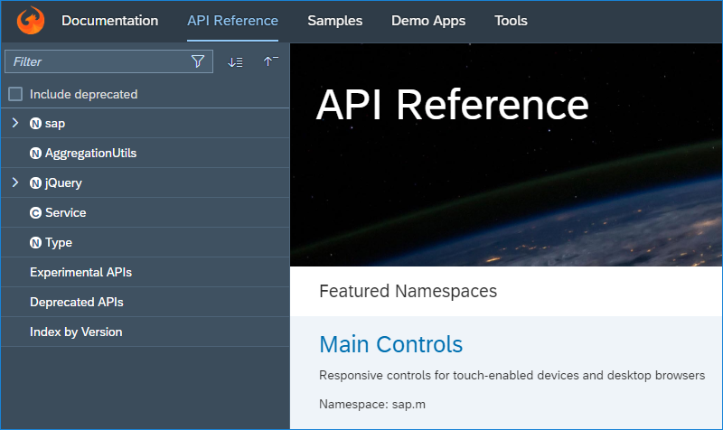

<!-- loio77e1dcc27c494d60ba0a03759b706e89 -->

# What's New in SAPUI5 1.63

With this release SAPUI5 is upgraded from version 1.62 to 1.63.

<a name="loio77e1dcc27c494d60ba0a03759b706e89__section_yxw_pxt_zcb"/>

## New Features

<table>
<tr>
<td valign="top">

**Custom Currencies**

Comprehensive support for formatting and parsing currencies has been part of SAPUI5 for a long time. We now extended the handling of custom currencies, so that you can also specify custom currencies per currency `NumberFormat` instance.

For more information, see [Currency Formatting](../04_Essentials/currency-formatting-e978728.md).

</td>
</tr>
<tr>
<td valign="top">

**UI5 Web Components**

UI5 Web Components are a set of reusable UI elements, which can be used for your static websites or web apps with a minimal footprint. They bring the relevant SAPUI5 qualities and latest SAP Fiori user experience to the HTML level and enable you to build a complete, enterprise-ready, and responsive web app, even if you're already using a different web framework.

UI5 Web Components are not built on top of SAPUI5 and are not its successor. They are lightweight and independent UI elements, offered complementary to the framework.

For more information, see the [UI5 Web Components](https://sap.github.io/ui5-webcomponents/) home page, the [GitHub Project](https://github.com/SAP/ui5-webcomponents), and the [blog post](https://blogs.sap.com/2019/02/11/ui5-web-components-the-beta-is-there/).

</td>
</tr>
</table>

<a name="loio77e1dcc27c494d60ba0a03759b706e89__section_bkm_s15_zcb"/>

## New Controls

<table>
<tr>
<td valign="top">

**`sap.f.ShellBar` \(Experimental\)**

We have implemented a new `sap.f.ShellBar` control, which is used as the uppermost section \(shell\) of the app. The control is fully responsive and adaptive, and corresponds to the latest SAP Fiori Design Guidelines.

  

For more information, see the [API Reference](https://ui5.sap.com/#/api/sap.f.ShellBar) and the [Samples](https://ui5.sap.com/#/entity/sap.f.ShellBar).

</td>
</tr>
<tr>
<td valign="top">

**`sap.m.upload.UploadSet`**

`UploadSet` is a new control that enables users to upload one or multiple files from their computer, tablet, or phone and to attach them to your application. This control builds on the `sap.m.UploadCollection` control, providing better handling of headers and requests, unified behavior of instant and deferred uploads, as well as improved progress indication.

For more information, see the [API Reference](https://ui5.sap.com/#/api/sap.m.upload.UploadSet) and the [Samples](https://ui5.sap.com/#/entity/sap.m.upload.UploadSet).

</td>
</tr>
</table>

<a name="loio77e1dcc27c494d60ba0a03759b706e89__section_qwl_pb5_zcb"/>

## Improved Features

<table>
<tr>
<td valign="top">

**SAPUI5 OData V4 Model**

The new version of the SAPUI5 OData V4 model introduces the following features:

-   The new types `sap.ui.model.odata.type.Unit` and `sap.ui.model.odata.type.Currency`: The new types use the unit or currency customizing as provided by the back end in a special code list. For more information, see [Currency and Unit Customizing in OData V4](../04_Essentials/currency-and-unit-customizing-in-odata-v4-4d1b9d4.md).

-   The method `sap.ui.model.odata.v4.AnnotationHelper.format`: This method can be used instead of `v4.AnnotationHelper.value` to generate bindings with type information and constraints. It also includes `$Path` in the result. To avoid the inclusion of `$Path`, resolve `$path` with the `sap.ui.mode.odata.v4.AnnotationHelper.resolve$Path` method. To create composite bindings with the new `sap.ui.model.odata.type.Unit` and `sap.ui.model.odata.type.Currency` types, use `sap.ui.model.odata.v4.AnnotationHelper.format`. For more information, see [Meta Model for OData V4](../04_Essentials/meta-model-for-odata-v4-7f29fb3.md).

-   The binding parameter `$$patchWithoutSideEffects`: The parameter was introduced with SAPUI5 1.60 and can now be used for `sap.ui.model.odata.v4.ODataListBindings`. The parameter is now also inherited to dependent bindings to avoid inconsistent behavior that was caused by the missing inheritance.

> ### Restriction:  
> Due to the limited feature scope of this version of the SAPUI5 OData V4 model, check that all required features are in place before developing applications. Check the detailed documentation of the features, as certain parts of a feature may be missing. While we aim to be compatible with existing controls, some controls might not work due to small incompatibilities compared to `sap.ui.model.odata.(v2.)ODataModel`, or due to missing features in the model \(such as tree binding\). This also applies to smart controls \(`sap.ui.comp` library\) and SAP Fiori elements that do not support the SAPUI5 OData V4 model, as well as controls such as `TreeTable` and `AnalyticalTable`, which are not supported together with the SAPUI5 OData V4 model. The interface for applications has been changed for easier and more efficient use of the model. For a summary of these changes, see [Changes Compared to OData V2 Model](../04_Essentials/changes-compared-to-odata-v2-model-abd4d7c.md).

For more information, see [OData V4 Model](../04_Essentials/odata-v4-model-5de13cf.md), the [API Reference](https://ui5.sap.com/#/api/sap.ui.model.odata.v4), and the [Samples](https://ui5.sap.com/#/entity/sap.ui.model.odata.v4.ODataModel).

</td>
</tr>
</table>

<a name="loio77e1dcc27c494d60ba0a03759b706e89__section_rqn_wd5_zcb"/>

## Improved Controls

<table>
<tr>
<td valign="top">

**`sap.f.Avatar`**

We have introduced a fallback image behavior that handles situations when the provided image source path leads to a non-existing image. If the `initials` property is set, `Avatar` displays the set value, otherwise a default icon markup is displayed.For more information, see the [Sample](https://ui5.sap.com/#/sample/sap.f.sample.Avatar/preview).

</td>
</tr>
<tr>
<td valign="top">

**`sap.f.DynamicPage`**

We have implemented the option to provide a simple, single-line title that takes less space on smaller phone screens when the `DynamicPageHeader` is collapsed \(snapped\). You can enable it with the use of the new `snappedTitleOnMobile` aggregation.For more information, see the [API Reference](https://ui5.sap.com/#/api/sap.f.DynamicPageTitle) and the [Sample](https://ui5.sap.com/#/sample/sap.f.sample.DynamicPageFreeStyle/preview).

</td>
</tr>
<tr>
<td valign="top">

**`sap.f.semantic.SemanticPage`**

We have implemented the option to provide a simple, single-line title that takes less space on smaller phone screens when the `SemanticPage` header is collapsed \(snapped\). You can enable it with the use of the new `titleSnappedOnMobile` aggregation.For more information, see the [API Reference](https://ui5.sap.com/#/api/sap.f.semantic.SemanticPage) and the [Sample](https://ui5.sap.com/#/sample/sap.f.sample.SemanticPageFreeStyle/preview).

</td>
</tr>
<tr>
<td valign="top">

**`sap.m.ObjectNumber`**, **`sap.m.ObjectStatus`**

You can now display both controls with a large font size, thus meeting the SAP Fiori Design Guidelines for displaying facets in the `ObjectPageHeader`. To use the larger font size, add the newly introduced CSS classes to the controls. For more information, see the *API Reference* \([`sap.m.ObjectNumber`](https://ui5.sap.com/#/api/sap.m.ObjectNumber), [`sap.m.ObjectStatus`](https://ui5.sap.com/#/api/sap.m.ObjectStatus)\), and the *Samples* \([`sap.m.ObjectNumber`](https://ui5.sap.com/#/entity/sap.m.ObjectNumber), [`sap.m.ObjectStatus`](https://ui5.sap.com/#/entity/sap.m.ObjectStatus)\).

</td>
</tr>
<tr>
<td valign="top">

**`sap.m.Select`**

To ensure that the value states are displayed in all situations and devices, the control is now enabled to display the text set in the `valueStateText` property when the dropdown is opened.For more information, see the [Sample](https://ui5.sap.com/#/sample/sap.m.sample.SelectValueState/preview).

</td>
</tr>
<tr>
<td valign="top">

**`sap.suite.ui.microchart.BulletMicroChart`**

Bullet micro charts can now be used in delta mode with actual values.

For more information, see the [API Reference](https://ui5.sap.com/#/api/sap.suite.ui.microchart.BulletMicroChart) and the [Samples](https://ui5.sap.com/#/entity/sap.suite.ui.microchart.BulletMicroChart).

</td>
</tr>
<tr>
<td valign="top">

**`sap.suite.ui.microchart.ColumnMicroChart`**

In addition to top and bottom axis labels, column micro charts now support top and bottom column labels.

For more information, see the [API Reference](https://ui5.sap.com/#/api/sap.suite.ui.microchart.ColumnMicroChart) and the [Samples](https://ui5.sap.com/#/entity/sap.suite.ui.microchart.ColumnMicroChart).

</td>
</tr>
<tr>
<td valign="top">

**`sap.suite.ui.microchart.LineMicroChart`**

Line micro charts can now display multiple lines and optional threshold value labels.

For more information, see the [API Reference](https://ui5.sap.com/#/api/sap.suite.ui.microchart.LineMicroChart) and the [Samples](https://ui5.sap.com/#/entity/sap.suite.ui.microchart.LineMicroChart).

</td>
</tr>
<tr>
<td valign="top">

**`sap.suite.ui.microchart`**

Micro charts are now fully responsive and can adapt to a variety of parent container sizes, ranging from 64 px wide by 18 px high up to 320 px wide by 94 px high. This new responsive design allows you to embed micro charts in rows of a grid table \(`sap.ui.table.Table`\) and other controls. You can also assign custom tooltips to micro charts using expression binding.

For each micro chart, a smart micro chart is now available that can be bound to OData metadata.

For more information, see the [API Reference](https://ui5.sap.com/#/api/sap.suite.ui.microchart) and the Samples for individual micro charts.

</td>
</tr>
<tr>
<td valign="top">

**`sap.ui.layout.cssgrid.CSSGrid`**

You can now set the `CSSGrid` breakpoints \(large, medium, or small\) to depend on the size of the parent container rather than the device screen size \(media query\). To enable the feature, use the new `containerQuery` property in the `GridResponsiveLayout` class. For more information, see the [API Reference](https://ui5.sap.com/#/api/sap.ui.layout.cssgrid.GridResponsiveLayout) and the [Sample](https://ui5.sap.com/#/sample/sap.ui.layout.sample.GridResponsiveness/preview).

</td>
</tr>
</table>

<a name="loio77e1dcc27c494d60ba0a03759b706e89__section_g3r_bf5_zcb"/>

## SAP Fiori Elements

<table>
<tr>
<td valign="top">

**List Report and Object Page**

General features:

You can now enable buttons to toggle between the draft and the saved version of records via a setting in the manifest.json. For more information, see [Toggling Between Draft and Saved Values](../06_SAP_Fiori_Elements/toggling-between-draft-and-saved-values-fd3950a.md). The standard button to toggle between the active and draft versions of the records in draft-enabled applications \(*Display Active Version* / *Continue Editing*\) has been removed.

The object page has these new features:

-   Using extension points, you can now add multiple custom sections. For more information, see [Extension Points for Sections on the Object Page](../06_SAP_Fiori_Elements/extension-points-for-sections-on-the-object-page-92ad996.md).
-   You can now add segmented buttons to tables on the object page to provide multiple views in a single table of the object page. For more information, see [Adding Segmented Buttons to a Table Toolbar](../06_SAP_Fiori_Elements/adding-segmented-buttons-to-a-table-toolbar-5532c89.md).

-   You have now additional options to place reuse components on the object page. For more information, see [Placing Reuse Component Instances on the Object Page](../06_SAP_Fiori_Elements/placing-reuse-component-instances-on-the-object-page-1ba7f88.md).

**Overview Page**

The overview page has these new features or enhancements:

-   Use [CTRL\][Click\] to open target apps in a new tab.
-   Extend view switch to react based on filter conditions or custom configuration. For more information, see [Custom View Switch](../06_SAP_Fiori_Elements/custom-view-switch-ecd9f10.md).

**Analytical List Page**

The analytical list page has these new features or enhancements:

-   You can now configure the table columns to display multiple field types for semantically connected fields. For more information, see [Configuring the Table-Only View as the Default Option](../06_SAP_Fiori_Elements/configuring-the-table-only-view-as-the-default-option-d074e26.md).
-   Using `onBeforeRebindVisualFilterExtension` controller you can group visual filter calls in one batch call. For more information, see [Visual Filters](../06_SAP_Fiori_Elements/visual-filters-1714720.md).

</td>
</tr>
</table>

<a name="loio77e1dcc27c494d60ba0a03759b706e89__section_r5v_3h5_zcb"/>

## Demo Kit Improvements

<table>
<tr>
<td valign="top">

**API Reference Tree**

We have improved the *API Reference* tree to use proper nesting of the SAPUI5 symbols based on a strict hierarchical structure. Fewer elements are now displayed on the root level, thus improving the user experience and shortening the time the user spends trying to find a specific symbol in the tree structure.

  

</td>
</tr>
</table>

**Parent topic:** [Previous Versions](previous-versions-6660a59.md "")

**Related Information**  

[What's New in SAPUI5 1.105](what-s-new-in-sapui5-1-105-5567dcc.md "With this release SAPUI5 is upgraded from version 1.104 to 1.105.")

[What's New in SAPUI5 1.104](what-s-new-in-sapui5-1-104-f01ebd4.md "With this release SAPUI5 is upgraded from version 1.103 to 1.104.")

[What's New in SAPUI5 1.103](what-s-new-in-sapui5-1-103-7534ae8.md "With this release SAPUI5 is upgraded from version 1.102 to 1.103.")

[What's New in SAPUI5 1.102](what-s-new-in-sapui5-1-102-b530db3.md "With this release SAPUI5 is upgraded from version 1.101 to 1.102.")

[What's New in SAPUI5 1.101](what-s-new-in-sapui5-1-101-5a18410.md "With this release SAPUI5 is upgraded from version 1.100 to 1.101.")

[What's New in SAPUI5 1.100](what-s-new-in-sapui5-1-100-5deb78f.md "With this release SAPUI5 is upgraded from version 1.99 to 1.100.")

[What's New in SAPUI5 1.99](what-s-new-in-sapui5-1-99-5e35c25.md "With this release SAPUI5 is upgraded from version 1.98 to 1.99.")

[What's New in SAPUI5 1.98](what-s-new-in-sapui5-1-98-7aacb4e.md "With this release SAPUI5 is upgraded from version 1.97 to 1.98.")

[What's New in SAPUI5 1.97](what-s-new-in-sapui5-1-97-f21858f.md "With this release SAPUI5 is upgraded from version 1.96 to 1.97.")

[What's New in SAPUI5 1.96](what-s-new-in-sapui5-1-96-b39a11b.md "With this release SAPUI5 is upgraded from version 1.95 to 1.96.")

[What's New in SAPUI5 1.95](what-s-new-in-sapui5-1-95-1b09465.md "With this release SAPUI5 is upgraded from version 1.94 to 1.95.")

[What's New in SAPUI5 1.94](what-s-new-in-sapui5-1-94-2d6ffdd.md "With this release SAPUI5 is upgraded from version 1.93 to 1.94.")

[What's New in SAPUI5 1.93](what-s-new-in-sapui5-1-93-e9c8356.md "With this release SAPUI5 is upgraded from version 1.92 to 1.93.")

[What's New in SAPUI5 1.92](what-s-new-in-sapui5-1-92-1492551.md "With this release SAPUI5 is upgraded from version 1.91 to 1.92.")

[What's New in SAPUI5 1.91](what-s-new-in-sapui5-1-91-75777da.md "With this release SAPUI5 is upgraded from version 1.90 to 1.91.")

[What's New in SAPUI5 1.90](what-s-new-in-sapui5-1-90-b475202.md "With this release SAPUI5 is upgraded from version 1.89 to 1.90.")

[What's New in SAPUI5 1.89](what-s-new-in-sapui5-1-89-0805036.md "With this release SAPUI5 is upgraded from version 1.88 to 1.89.")

[What's New in SAPUI5 1.88](what-s-new-in-sapui5-1-88-bda141b.md "With this release SAPUI5 is upgraded from version 1.87 to 1.88.")

[What's New in SAPUI5 1.87](what-s-new-in-sapui5-1-87-e315108.md "With this release SAPUI5 is upgraded from version 1.86 to 1.87.")

[What's New in SAPUI5 1.86](what-s-new-in-sapui5-1-86-067e2fb.md "With this release SAPUI5 is upgraded from version 1.85 to 1.86.")

[What's New in SAPUI5 1.85](what-s-new-in-sapui5-1-85-eeb5bd9.md "With this release SAPUI5 is upgraded from version 1.84 to 1.85.")

[What's New in SAPUI5 1.84](what-s-new-in-sapui5-1-84-ccf76b7.md "With this release SAPUI5 is upgraded from version 1.82 to 1.84.")

[What's New in SAPUI5 1.82](what-s-new-in-sapui5-1-82-f081cf0.md "With this release SAPUI5 is upgraded from version 1.81 to 1.82.")

[What's New in SAPUI5 1.81](what-s-new-in-sapui5-1-81-f71563c.md "With this release SAPUI5 is upgraded from version 1.80 to 1.81.")

[What's New in SAPUI5 1.80](what-s-new-in-sapui5-1-80-3294c68.md "With this release SAPUI5 is upgraded from version 1.79 to 1.80.")

[What's New in SAPUI5 1.79](what-s-new-in-sapui5-1-79-edf8e35.md "With this release SAPUI5 is upgraded from version 1.78 to 1.79.")

[What's New in SAPUI5 1.78](what-s-new-in-sapui5-1-78-d176be3.md "With this release SAPUI5 is upgraded from version 1.77 to 1.78.")

[What's New in SAPUI5 1.77](what-s-new-in-sapui5-1-77-2ec6b6b.md "With this release SAPUI5 is upgraded from version 1.76 to 1.77.")

[What's New in SAPUI5 1.76](what-s-new-in-sapui5-1-76-b9b0a3f.md "With this release SAPUI5 is upgraded from version 1.75 to 1.76.")

[What's New in SAPUI5 1.75](what-s-new-in-sapui5-1-75-dc3d3ce.md "With this release SAPUI5 is upgraded from version 1.74 to 1.75.")

[What's New in SAPUI5 1.74](what-s-new-in-sapui5-1-74-21fc6cb.md "With this release SAPUI5 is upgraded from version 1.73 to 1.74.")

[What's New in SAPUI5 1.73](what-s-new-in-sapui5-1-73-7b82664.md "With this release SAPUI5 is upgraded from version 1.72 to 1.73.")

[What's New in SAPUI5 1.72](what-s-new-in-sapui5-1-72-25e5326.md "With this release SAPUI5 is upgraded from version 1.71 to 1.72.")

[What's New in SAPUI5 1.71](what-s-new-in-sapui5-1-71-609fd01.md "With this release SAPUI5 is upgraded from version 1.70 to 1.71.")

[What's New in SAPUI5 1.70](what-s-new-in-sapui5-1-70-4e89fee.md "With this release SAPUI5 is upgraded from version 1.69 to 1.70.")

[What's New in SAPUI5 1.69](what-s-new-in-sapui5-1-69-41203fd.md "With this release SAPUI5 is upgraded from version 1.68 to 1.69.")

[What's New in SAPUI5 1.68](what-s-new-in-sapui5-1-68-5531aef.md "With this release SAPUI5 is upgraded from version 1.67 to 1.68.")

[What's New in SAPUI5 1.67](what-s-new-in-sapui5-1-67-0968958.md "With this release SAPUI5 is upgraded from version 1.66 to 1.67.")

[What's New in SAPUI5 1.66](what-s-new-in-sapui5-1-66-ebe7fda.md "With this release SAPUI5 is upgraded from version 1.65 to 1.66.")

[What's New in SAPUI5 1.65](what-s-new-in-sapui5-1-65-9d2b189.md "With this release SAPUI5 is upgraded from version 1.64 to 1.65.")

[What's New in SAPUI5 1.64](what-s-new-in-sapui5-1-64-1975e30.md "With this release SAPUI5 is upgraded from version 1.63 to 1.64.")

[What's New in SAPUI5 1.62](what-s-new-in-sapui5-1-62-27eea38.md "With this release SAPUI5 is upgraded from version 1.61 to 1.62.")

[What's New in SAPUI5 1.61](what-s-new-in-sapui5-1-61-de4d50b.md "With this release SAPUI5 is upgraded from version 1.60 to 1.61.")

[What's New in SAPUI5 1.60](what-s-new-in-sapui5-1-60-2a70354.md "With this release SAPUI5 is upgraded from version 1.58 to 1.60.")

[What's New in SAPUI5 1.58](what-s-new-in-sapui5-1-58-b28edde.md "With this release, SAPUI5 is upgraded from version 1.56 to 1.58.")

[What's New in SAPUI5 1.56](what-s-new-in-sapui5-1-56-53b4b5e.md "With this release, SAPUI5 is upgraded from version 1.54 to 1.56.")

[What's New in SAPUI5 1.54](what-s-new-in-sapui5-1-54-f29023e.md "With this release, SAPUI5 is upgraded from version 1.52 to 1.54.")

[What's New in SAPUI5 1.52](what-s-new-in-sapui5-1-52-a09dd79.md "With this release, SAPUI5 is upgraded from version 1.50 to 1.52.")

[What's New in SAPUI5 1.50](what-s-new-in-sapui5-1-50-a844984.md "With this release, SAPUI5 is upgraded from version 1.48 to 1.50.")

[What's New in SAPUI5 1.48](what-s-new-in-sapui5-1-48-2818f80.md "With this release, SAPUI5 is upgraded from version 1.46 to 1.48.")

[What's New in SAPUI5 1.46](what-s-new-in-sapui5-1-46-4cf0986.md "With this release, SAPUI5 is upgraded from version 1.44 to 1.46.")

[What's New in SAPUI5 1.44](what-s-new-in-sapui5-1-44-05ce1dc.md "With this release, SAPUI5 is upgraded from version 1.42 to 1.44.")

[What's New in SAPUI5 1.42](what-s-new-in-sapui5-1-42-4768f1a.md "With this release, SAPUI5 is upgraded from version 1.40 to 1.42.")

[What's New in SAPUI5 1.40](what-s-new-in-sapui5-1-40-e659bd2.md "With this release, SAPUI5 is upgraded from version 1.38 to 1.40.")

[What's New in SAPUI5 1.38](what-s-new-in-sapui5-1-38-6a875f9.md#loio6a875f998994489483e8085705347d72 "With this release, SAPUI5 is upgraded from version 1.36 to 1.38.")

