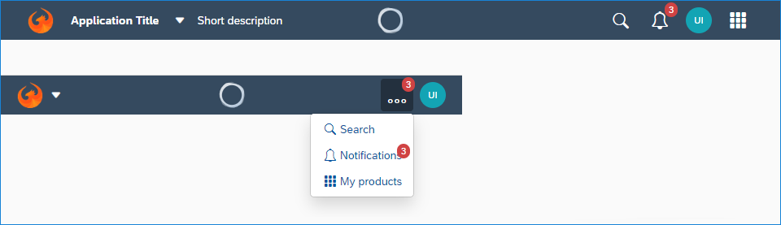
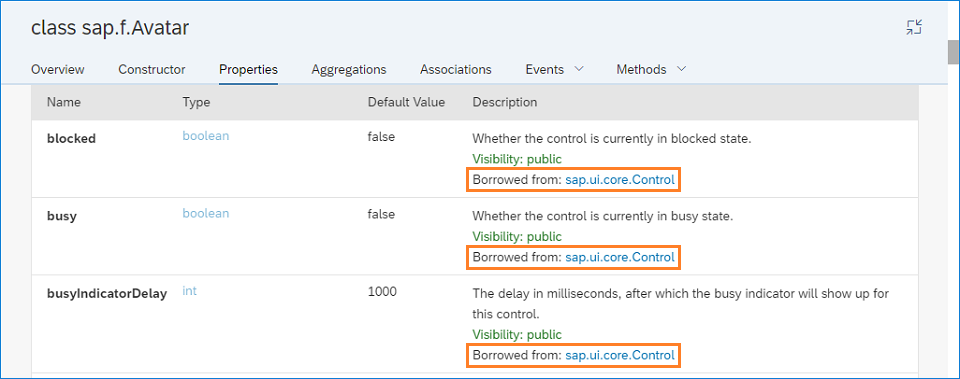

<!-- loio1975e304ab924fb3b799240fdd9fe59b -->

# What's New in SAPUI5 1.64

With this release SAPUI5 is upgraded from version 1.63 to 1.64.

<a name="loio1975e304ab924fb3b799240fdd9fe59b__section_yxw_pxt_zcb"/>

## New Features

<table>
<tr>
<td valign="top">

**Rule Builder: AST based DMN SFEEL**

The rule builder now supports a new expression language: AST based DMN SFEEL. DMN SFEEL is an improvised approach to modeling business decision logic. It can be used both in text rules as well as in decision tables.

For more information, see [Rule Builder Control](../03_Get-Started/rule-builder-control-67fcb30.md).

</td>
</tr>
</table>

<a name="loio1975e304ab924fb3b799240fdd9fe59b__section_bkm_s15_zcb"/>

## New Controls

<table>
<tr>
<td valign="top">

**`sap.f.Card`**

The new `sap.f.Card` control complies with the visual design of the Integration Card \(`sap.ui.integration.widgets.Card`\). In contrast to the Integration Card, `sap.f.Card` provides more freedom in choosing the structure and the controls you can include, so that you can compose the card content area according to your needs. It enables you to decide and compose the card content area according to your needs.

The `sap.f.Card` consists of three elements: a container with background color and rounded corners, a header, and content areas.

  

For more information, see [Cards](../10_More_About_Controls/cards-5b46b03.md), the [API Reference](https://ui5.sap.com/#/api/sap.f.Card) and the [Sample](https://ui5.sap.com/#/entity/sap.f.Card/sample/sap.f.sample.Card).

</td>
</tr>
</table>

<a name="loio1975e304ab924fb3b799240fdd9fe59b__section_qwl_pb5_zcb"/>

## Improved Features

<table>
<tr>
<td valign="top">

**Key User Adaptation: Restricting Adaptation for Certain Controls**

It is now possible to exclude certain controls from key user adaptation \(formerly known as **UI adaptation at runtime**\) by adding instance-specific design time metadata:

-   `not-removable` prevents controls from being removed.
-   `not-adaptable` prevents controls from being changed.

For more information, see [SAPUI5 Flexibility: Enable Your App for UI Adaptation](../05_Developing_Apps/sapui5-flexibility-enable-your-app-for-ui-adaptation-f1430c0.md).

</td>
</tr>
<tr>
<td valign="top">

**SAPUI5 Flexibility: New `flexEnabled` Flag**

The `flexEnabled` flag in the `sap.ui5` section of the `manifest.json` indicates whether the application supports key user adaptation and developer adaptation. If you set the flag, it's also possible to check via SAP Web IDE if your control IDs are stable.

For more information, see [SAPUI5 Flexibility: Enable Your App for UI Adaptation](../05_Developing_Apps/sapui5-flexibility-enable-your-app-for-ui-adaptation-f1430c0.md).

</td>
</tr>
<tr>
<td valign="top">

**SAPUI5 Flexibility: Simplified Terminology**

We have improved and simplified the terminology for certain core terms in the area of SAPUI5 flexibility. Here's what has changed:

<table>
<tr>
<th valign="top">

Old

</th>
<th valign="top">

New

</th>
<th valign="top">

Explanation

</th>
</tr>
<tr>
<td valign="top">

SAPUI5 flexibility services

</td>
<td valign="top">

SAPUI5 flexibility

</td>
<td valign="top">

Collection of features that allow upgrade-safe and modification-free UI changes of SAPUI5 apps on different levels

</td>
</tr>
<tr>
<td valign="top">

UI adaptation at runtime \(RTA\)

</td>
<td valign="top">

key user adaptation

</td>
<td valign="top">

Key users \(business experts with special permissions\) can adapt the UI of an SAPUI5 app that is running in the SAP Fiori launchpad for other users by means of intuitive WYSIWYG functions.

</td>
</tr>
<tr>
<td valign="top">

UI adaptation at design time \(DTA\)

</td>
<td valign="top">

developer adaptation

</td>
<td valign="top">

Developers can adapt SAPUI5 apps via the SAPUI5 Visual Editor in SAP Web IDE.

</td>
</tr>
</table>

For more information on the features of SAPUI5 flexibility, see [SAPUI5 Flexibility: Adapting UIs Made Easy](../04_Essentials/sapui5-flexibility-adapting-uis-made-easy-a8e55aa.md).

</td>
</tr>
<tr>
<td valign="top">

**SAPUI5 OData V4 Model**

With the new version of the SAPUI5 OData V4 model, the number of decimal places of entered numbers is checked against the unit or the currency customizing when using the `sap.ui.model.odata.type.Unit` and `sap.ui.model.odata.type.Currency` types that were introduced with SAPUI5 1.63.

> ### Restriction:  
> Due to the limited feature scope of this version of the SAPUI5 OData V4 model, check that all required features are in place before developing applications. Check the detailed documentation of the features, as certain parts of a feature may be missing. While we aim to be compatible with existing controls, some controls might not work due to small incompatibilities compared to `sap.ui.model.odata.(v2.)ODataModel`, or due to missing features in the model \(such as tree binding\). This also applies to smart controls \(`sap.ui.comp` library\) and SAP Fiori elements that do not support the SAPUI5 OData V4 model, as well as controls such as `TreeTable` and `AnalyticalTable`, which are not supported together with the SAPUI5 OData V4 model. The interface for applications has been changed for easier and more efficient use of the model. For a summary of these changes, see [Changes Compared to OData V2 Model](../04_Essentials/changes-compared-to-odata-v2-model-abd4d7c.md).

For more information, see [OData V4 Model](../04_Essentials/odata-v4-model-5de13cf.md), the [API Reference](https://ui5.sap.com/#/api/sap.ui.model.odata.v4), and the [Samples](https://ui5.sap.com/#/entity/sap.ui.model.odata.v4.ODataModel).

</td>
</tr>
</table>

<a name="loio1975e304ab924fb3b799240fdd9fe59b__section_rqn_wd5_zcb"/>

## Improved Controls

<table>
<tr>
<td valign="top">

**`sap.f.DynamicPage`**

We have redesigned the content area of the `DynamicPageTitle` control so that the width of the `expandedContent` and `snappedContent` aggregations no longer depends on the width of the `heading` aggregation. Both `expandedContent` and `snappedContent` aggregations can now take the whole width of the `DynamicPageTitle` and are displayed below the heading and content areas.For more information, see the [Sample](https://ui5.sap.com/#/entity/sap.f.DynamicPage/sample/sap.f.sample.DynamicPageFreeStyle).

</td>
</tr>
<tr>
<td valign="top">

**`sap.f.ShellBar` \(Experimental\)**

We have implemented an additional element that visualizes the number of notifications for the app \(`notificationsNumber` property\). It is displayed at the top right corner of the notifications button. When the resize breakpoint is hit and the notifications button enters the overflow area of the `OverflowToolbar`, the element is displayed at the top right corner of both the `OverflowToolbarButton` and the overflow area notification button.

  

For more information, see the [API Reference](https://ui5.sap.com/#/api/sap.f.ShellBar) and the [Sample](https://ui5.sap.com/#/entity/sap.f.ShellBar/sample/sap.f.sample.ShellBar).

</td>
</tr>
<tr>
<td valign="top">

**`sap.m.ComboBox`**

We have introduced grouping in the suggestions list of `sap.m.ComboBox`. This feature allows you to group items by certain characteristics, and to display a header. New group can be created in two ways:

-   If data binding is used, grouping is defined on the sorter in data binding.
-   Alternatively, you can add a group header programmatically as an instance of `sap.ui.core.SeparatorItem` with a text property by adding it to the items aggregation of the `sap.m.ComboBox` control. This transforms the `sap.ui.core.SeparatorItem` internally to `sap.m.GroupHeaderListItem`, and uses the text value as the header of the group.

In case a `sap.ui.core.SeparatorItem` without a defined text property is inserted in the aggregation items, the ComboBox will display only a horizontal separator without any text. For more information, see the [API Reference](https://ui5.sap.com/#/api/sap.m.ComboBox) and the [Sample](https://ui5.sap.com/#/entity/sap.m.ComboBox/sample/sap.m.sample.ComboBoxGrouping).

</td>
</tr>
<tr>
<td valign="top">

**`sap.m.DatePicker`**

With the new `isValidValue` function, you can receive information on the validity of the latest value provided in `sap.m.DatePicker`, not only on change but at any time, so that you can act upon an incorrectly entered date.For more information, see the [API Reference](https://ui5.sap.com/#/api/sap.m.DatePicker) and the [Sample](https://ui5.sap.com/#/entity/sap.m.DatePicker/sample/sap.m.sample.DatePicker).

</td>
</tr>
<tr>
<td valign="top">

**`sap.m.Input`**, **`sap.m.ComboBoxBase`** **\(Experimental\)**

We have introduced a new experimental method `showItems(fnFilter)`. It enables you to open a popup with suggestion items for the `sap.m.Input`, `sap.m.ComboBox`, and `sap.m.MultiComboBox` controls, and to filter the available items based on custom criteria. For more information, see the API Reference \([`sap.m.Input`](https://ui5.sap.com/#/api/sap.m.Input/methods/showItems), [`sap.m.ComboBoxBase`](https://ui5.sap.com/#/api/sap.m.ComboBoxBase/methods/showItems)\).

</td>
</tr>
<tr>
<td valign="top">

**`sap.m.Input`**, **`sap.m.MultiInput`**

We have introduced grouping for the suggestions of `sap.m.Input` and `sap.m.MultiInput`. This feature allows you to easily group items visually by separating the different groups via a distinguishable group header item. The functionality is available for inputs that use list suggestions and table suggestions. For more information, see the samples \( [`sap.m.Input`](https://ui5.sap.com/#/entity/sap.m.Input/sample/sap.m.sample.InputGrouping), [`sap.m.MultiInput`](https://ui5.sap.com/#/entity/sap.m.MultiInput/sample/sap.m.sample.MultiInputGrouping)\).

</td>
</tr>
<tr>
<td valign="top">

**`sap.m.SinglePlanningCalendar`**

-   We have introduced a new all-day logic that checks whether an appointment starts at 00:00 and ends at 00:00 on any day in the future.

-   We have introduced a cozy form factor, which provides larger interactive user interface elements. This facilitates your work with the control on mobile devices.

For more information, see the [API Reference](https://ui5.sap.com/#/api/sap.m.SinglePlanningCalendar) and the [Sample](https://ui5.sap.com/#/entity/sap.m.SinglePlanningCalendar/sample/sap.m.sample.SinglePlanningCalendar).

</td>
</tr>
<tr>
<td valign="top">

**`sap.ui.integration.widgets.Card`**

-   We have introduced a new `Object` card type, which displays the basic details for an object, such as a person or a sales order.For more information, see [Cards](../10_More_About_Controls/cards-5b46b03.md) and the [Sample](https://ui5.sap.com/#/entity/sap.ui.integration.widgets.Card/sample/sap.ui.integration.sample.ObjectCard).

-   We have introduced a new `Timeline` card type, which displays time-related content.For more information, see [Cards](../10_More_About_Controls/cards-5b46b03.md) and the [Sample](https://ui5.sap.com/#/entity/sap.ui.integration.widgets.Card/sample/sap.ui.integration.sample.TimelineCard).

</td>
</tr>
<tr>
<td valign="top">

**`sap.uxap.ObjectPageLayout`**

We have implemented the option to provide a simple, single-line title that takes up less space on smaller phone screens when the dynamic header of the `ObjectPageLayout` control is collapsed \(snapped\). You can enable it via the `snappedTitleOnMobile` aggregation.For more information, see the [API Reference](https://ui5.sap.com/#/api/sap.uxap.ObjectPageDynamicHeaderTitle) and the [Sample](https://ui5.sap.com/#/entity/sap.uxap.ObjectPageLayout/sample/sap.uxap.sample.ObjectPageDynamicHeader).

</td>
</tr>
</table>

<a name="loio1975e304ab924fb3b799240fdd9fe59b__section_g3r_bf5_zcb"/>

## SAP Fiori Elements

<table>
<tr>
<td valign="top">

**Analytical List Page**

You can pass the variant ID as a URL parameter while navigating from an application to the analytical list page. For more information, see [Managing Variants](../06_SAP_Fiori_Elements/managing-variants-8ce658e.md).

</td>
</tr>
</table>

<a name="loio1975e304ab924fb3b799240fdd9fe59b__section_r5v_3h5_zcb"/>

## Demo Kit Improvements

<table>
<tr>
<td valign="top">

**API Reference**

-   The API Reference documentation for non-class entities now displays the `@see` and `@example` tags of their JSDocs.For a preview of an `@see` tag, see the [`sap.ui.core.LabelEnablement`](https://ui5.sap.com/#/api/sap.ui.core.LabelEnablement) namespace. For a preview of an `@example` tag, see the [`sap/base/util/merge`](https://ui5.sap.com/#/api/module%3Asap%2Fbase%2Futil%2Fmerge) function.

-   Based on your feedback, we have improved the API Reference documentation to include the borrowed *Properties*, *Aggregations*, and *Associations* in the respective sections. All the inherited entries are marked with a *Borrowed from:* label in the *Description* column with a link to the corresponding class.

      

</td>
</tr>
</table>

**Parent topic:** [Previous Versions](previous-versions-6660a59.md "")

**Related Information**  

[What's New in SAPUI5 1.105](what-s-new-in-sapui5-1-105-5567dcc.md "With this release SAPUI5 is upgraded from version 1.104 to 1.105.")

[What's New in SAPUI5 1.104](what-s-new-in-sapui5-1-104-f01ebd4.md "With this release SAPUI5 is upgraded from version 1.103 to 1.104.")

[What's New in SAPUI5 1.103](what-s-new-in-sapui5-1-103-7534ae8.md "With this release SAPUI5 is upgraded from version 1.102 to 1.103.")

[What's New in SAPUI5 1.102](what-s-new-in-sapui5-1-102-b530db3.md "With this release SAPUI5 is upgraded from version 1.101 to 1.102.")

[What's New in SAPUI5 1.101](what-s-new-in-sapui5-1-101-5a18410.md "With this release SAPUI5 is upgraded from version 1.100 to 1.101.")

[What's New in SAPUI5 1.100](what-s-new-in-sapui5-1-100-5deb78f.md "With this release SAPUI5 is upgraded from version 1.99 to 1.100.")

[What's New in SAPUI5 1.99](what-s-new-in-sapui5-1-99-5e35c25.md "With this release SAPUI5 is upgraded from version 1.98 to 1.99.")

[What's New in SAPUI5 1.98](what-s-new-in-sapui5-1-98-7aacb4e.md "With this release SAPUI5 is upgraded from version 1.97 to 1.98.")

[What's New in SAPUI5 1.97](what-s-new-in-sapui5-1-97-f21858f.md "With this release SAPUI5 is upgraded from version 1.96 to 1.97.")

[What's New in SAPUI5 1.96](what-s-new-in-sapui5-1-96-b39a11b.md "With this release SAPUI5 is upgraded from version 1.95 to 1.96.")

[What's New in SAPUI5 1.95](what-s-new-in-sapui5-1-95-1b09465.md "With this release SAPUI5 is upgraded from version 1.94 to 1.95.")

[What's New in SAPUI5 1.94](what-s-new-in-sapui5-1-94-2d6ffdd.md "With this release SAPUI5 is upgraded from version 1.93 to 1.94.")

[What's New in SAPUI5 1.93](what-s-new-in-sapui5-1-93-e9c8356.md "With this release SAPUI5 is upgraded from version 1.92 to 1.93.")

[What's New in SAPUI5 1.92](what-s-new-in-sapui5-1-92-1492551.md "With this release SAPUI5 is upgraded from version 1.91 to 1.92.")

[What's New in SAPUI5 1.91](what-s-new-in-sapui5-1-91-75777da.md "With this release SAPUI5 is upgraded from version 1.90 to 1.91.")

[What's New in SAPUI5 1.90](what-s-new-in-sapui5-1-90-b475202.md "With this release SAPUI5 is upgraded from version 1.89 to 1.90.")

[What's New in SAPUI5 1.89](what-s-new-in-sapui5-1-89-0805036.md "With this release SAPUI5 is upgraded from version 1.88 to 1.89.")

[What's New in SAPUI5 1.88](what-s-new-in-sapui5-1-88-bda141b.md "With this release SAPUI5 is upgraded from version 1.87 to 1.88.")

[What's New in SAPUI5 1.87](what-s-new-in-sapui5-1-87-e315108.md "With this release SAPUI5 is upgraded from version 1.86 to 1.87.")

[What's New in SAPUI5 1.86](what-s-new-in-sapui5-1-86-067e2fb.md "With this release SAPUI5 is upgraded from version 1.85 to 1.86.")

[What's New in SAPUI5 1.85](what-s-new-in-sapui5-1-85-eeb5bd9.md "With this release SAPUI5 is upgraded from version 1.84 to 1.85.")

[What's New in SAPUI5 1.84](what-s-new-in-sapui5-1-84-ccf76b7.md "With this release SAPUI5 is upgraded from version 1.82 to 1.84.")

[What's New in SAPUI5 1.82](what-s-new-in-sapui5-1-82-f081cf0.md "With this release SAPUI5 is upgraded from version 1.81 to 1.82.")

[What's New in SAPUI5 1.81](what-s-new-in-sapui5-1-81-f71563c.md "With this release SAPUI5 is upgraded from version 1.80 to 1.81.")

[What's New in SAPUI5 1.80](what-s-new-in-sapui5-1-80-3294c68.md "With this release SAPUI5 is upgraded from version 1.79 to 1.80.")

[What's New in SAPUI5 1.79](what-s-new-in-sapui5-1-79-edf8e35.md "With this release SAPUI5 is upgraded from version 1.78 to 1.79.")

[What's New in SAPUI5 1.78](what-s-new-in-sapui5-1-78-d176be3.md "With this release SAPUI5 is upgraded from version 1.77 to 1.78.")

[What's New in SAPUI5 1.77](what-s-new-in-sapui5-1-77-2ec6b6b.md "With this release SAPUI5 is upgraded from version 1.76 to 1.77.")

[What's New in SAPUI5 1.76](what-s-new-in-sapui5-1-76-b9b0a3f.md "With this release SAPUI5 is upgraded from version 1.75 to 1.76.")

[What's New in SAPUI5 1.75](what-s-new-in-sapui5-1-75-dc3d3ce.md "With this release SAPUI5 is upgraded from version 1.74 to 1.75.")

[What's New in SAPUI5 1.74](what-s-new-in-sapui5-1-74-21fc6cb.md "With this release SAPUI5 is upgraded from version 1.73 to 1.74.")

[What's New in SAPUI5 1.73](what-s-new-in-sapui5-1-73-7b82664.md "With this release SAPUI5 is upgraded from version 1.72 to 1.73.")

[What's New in SAPUI5 1.72](what-s-new-in-sapui5-1-72-25e5326.md "With this release SAPUI5 is upgraded from version 1.71 to 1.72.")

[What's New in SAPUI5 1.71](what-s-new-in-sapui5-1-71-609fd01.md "With this release SAPUI5 is upgraded from version 1.70 to 1.71.")

[What's New in SAPUI5 1.70](what-s-new-in-sapui5-1-70-4e89fee.md "With this release SAPUI5 is upgraded from version 1.69 to 1.70.")

[What's New in SAPUI5 1.69](what-s-new-in-sapui5-1-69-41203fd.md "With this release SAPUI5 is upgraded from version 1.68 to 1.69.")

[What's New in SAPUI5 1.68](what-s-new-in-sapui5-1-68-5531aef.md "With this release SAPUI5 is upgraded from version 1.67 to 1.68.")

[What's New in SAPUI5 1.67](what-s-new-in-sapui5-1-67-0968958.md "With this release SAPUI5 is upgraded from version 1.66 to 1.67.")

[What's New in SAPUI5 1.66](what-s-new-in-sapui5-1-66-ebe7fda.md "With this release SAPUI5 is upgraded from version 1.65 to 1.66.")

[What's New in SAPUI5 1.65](what-s-new-in-sapui5-1-65-9d2b189.md "With this release SAPUI5 is upgraded from version 1.64 to 1.65.")

[What's New in SAPUI5 1.63](what-s-new-in-sapui5-1-63-77e1dcc.md "With this release SAPUI5 is upgraded from version 1.62 to 1.63.")

[What's New in SAPUI5 1.62](what-s-new-in-sapui5-1-62-27eea38.md "With this release SAPUI5 is upgraded from version 1.61 to 1.62.")

[What's New in SAPUI5 1.61](what-s-new-in-sapui5-1-61-de4d50b.md "With this release SAPUI5 is upgraded from version 1.60 to 1.61.")

[What's New in SAPUI5 1.60](what-s-new-in-sapui5-1-60-2a70354.md "With this release SAPUI5 is upgraded from version 1.58 to 1.60.")

[What's New in SAPUI5 1.58](what-s-new-in-sapui5-1-58-b28edde.md "With this release, SAPUI5 is upgraded from version 1.56 to 1.58.")

[What's New in SAPUI5 1.56](what-s-new-in-sapui5-1-56-53b4b5e.md "With this release, SAPUI5 is upgraded from version 1.54 to 1.56.")

[What's New in SAPUI5 1.54](what-s-new-in-sapui5-1-54-f29023e.md "With this release, SAPUI5 is upgraded from version 1.52 to 1.54.")

[What's New in SAPUI5 1.52](what-s-new-in-sapui5-1-52-a09dd79.md "With this release, SAPUI5 is upgraded from version 1.50 to 1.52.")

[What's New in SAPUI5 1.50](what-s-new-in-sapui5-1-50-a844984.md "With this release, SAPUI5 is upgraded from version 1.48 to 1.50.")

[What's New in SAPUI5 1.48](what-s-new-in-sapui5-1-48-2818f80.md "With this release, SAPUI5 is upgraded from version 1.46 to 1.48.")

[What's New in SAPUI5 1.46](what-s-new-in-sapui5-1-46-4cf0986.md "With this release, SAPUI5 is upgraded from version 1.44 to 1.46.")

[What's New in SAPUI5 1.44](what-s-new-in-sapui5-1-44-05ce1dc.md "With this release, SAPUI5 is upgraded from version 1.42 to 1.44.")

[What's New in SAPUI5 1.42](what-s-new-in-sapui5-1-42-4768f1a.md "With this release, SAPUI5 is upgraded from version 1.40 to 1.42.")

[What's New in SAPUI5 1.40](what-s-new-in-sapui5-1-40-e659bd2.md "With this release, SAPUI5 is upgraded from version 1.38 to 1.40.")

[What's New in SAPUI5 1.38](what-s-new-in-sapui5-1-38-6a875f9.md#loio6a875f998994489483e8085705347d72 "With this release, SAPUI5 is upgraded from version 1.36 to 1.38.")

