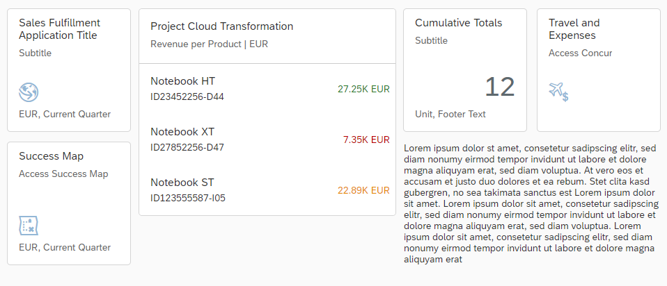
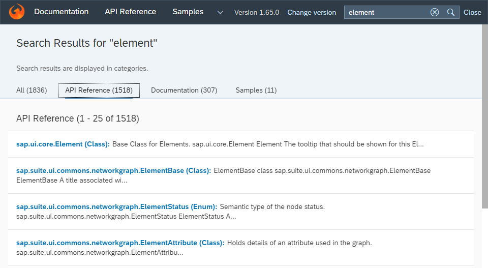

<!-- loio9d2b1897722a4e99b60580fb09aa35e0 -->

# What's New in SAPUI5 1.65

With this release SAPUI5 is upgraded from version 1.64 to 1.65.

<a name="loio9d2b1897722a4e99b60580fb09aa35e0__section_yxw_pxt_zcb"/>

## New Features

<table>
<tr>
<td valign="top">

**New Theme Available for SAP Fiori 3 User Experience **

The SAP Fiori 3 user experience is now supported. A new theme with *SAP Quartz Light* as the default appearance \(theme ID `sap_fiori_3`\) has been introduced. The theme is provided as an additional theme in SAPUI5.

For more information, see [Supported Combinations of Themes and Libraries](../02_Read-Me-First/supported-combinations-of-themes-and-libraries-38ff8c2.md).

</td>
</tr>
</table>

<a name="loio9d2b1897722a4e99b60580fb09aa35e0__section_bkm_s15_zcb"/>

## New Controls

<table>
<tr>
<td valign="top">

**`sap.f.GridContainer (Experimental)`**

The new `GridContainer` control allows you to align tiles, cards, and other controls in configuration, such as an overview page. It relies on a regular grid mesh constructed of rows with the same height and columns with the same width. Each item can be configured to span a different number of rows and columns inside that mesh. `GridContainer` automatically calculates how many rows an item needs, based on the height of the item.

  

For more information, see [sap.f.GridContainer](../10_More_About_Controls/sap-f-gridcontainer-cca5ee5.md), the [API Reference](https://ui5.sap.com/#/api/sap.f.GridContainer), and the [Sample](https://ui5.sap.com/#/entity/sap.f.GridContainer/sample/sap.f.sample.GridContainer).

</td>
</tr>
</table>

<a name="loio9d2b1897722a4e99b60580fb09aa35e0__section_qwl_pb5_zcb"/>

## Improved Features

<table>
<tr>
<td valign="top">

**SAPUI5 OData V4 Model**

The new version of the SAPUI5 OData V4 model introduces the following features:

-   You can now create more than one transient entity in a list binding without refreshing the list binding, see `sap.ui.model.odata.v4.ODataListBinding` in the API Reference.

-   It is now ensured that created and persisted records are shown only once in the list, and that `$count` reflects the number of records shown in the table. Duplicates are avoided by filtering out created and persisted records using system query option `$filter`.

-   You can use `@$ui5.context.isTransient` in expression bindings to find out whether context is transient, see `sap.ui.model.odata.v4.Context.isTransient` in the API Reference.

> ### Restriction:  
> Due to the limited feature scope of this version of the SAPUI5 OData V4 model, check that all required features are in place before developing applications. Check the detailed documentation of the features, as certain parts of a feature may be missing. While we aim to be compatible with existing controls, some controls might not work due to small incompatibilities compared to `sap.ui.model.odata.(v2.)ODataModel`, or due to missing features in the model \(such as tree binding\). This also applies to smart controls \(`sap.ui.comp` library\) and SAP Fiori elements that do not support the SAPUI5 OData V4 model, as well as controls such as `TreeTable` and `AnalyticalTable`, which are not supported together with the SAPUI5 OData V4 model. The interface for applications has been changed for easier and more efficient use of the model. For a summary of these changes, see [Changes Compared to OData V2 Model](../04_Essentials/changes-compared-to-odata-v2-model-abd4d7c.md).

For more information, see [OData V4 Model](../04_Essentials/odata-v4-model-5de13cf.md), the [API Reference](https://ui5.sap.com/#/api/sap.ui.model.odata.v4), and the [Samples](https://ui5.sap.com/#/entity/sap.ui.model.odata.v4.ODataModel).

</td>
</tr>
<tr>
<td valign="top">

**Spreadsheet Export**

Currency values and numbers, that cannot be represented in the spreadsheet file in the format as defined by the *IEEE \(Institute of Electrical and Electronics Engineers\)* in standard 754-2008 \(standard for floating-point arithmetic\) because they are too large, now automatically use the `BigNumber` data type as a fallback option.

For more information, see [Spreadsheet Export](../04_Essentials/spreadsheet-export-2691788.md) and the [API Reference](https://ui5.sap.com/#/api/sap.ui.export). 

</td>
</tr>
<tr>
<td valign="top">

**Test Automation**

The setup for Karma-based test automation has been improved significantly: The corresponding plugin has been completely reworked and renamed to `karma-ui5`.

For more information, see [Installing Karma for Automated Testing](../04_Essentials/test-automation-ae44824.md#loioa182676ed3714bd5b4f011eb29076f6c) and [karma-ui5 on Github](https://help.sap.com/viewer/disclaimer-for-links?q=https%3A%2F%2Fgithub.com%2FSAP%2Fkarma-openui5).

</td>
</tr>
</table>

<a name="loio9d2b1897722a4e99b60580fb09aa35e0__section_rqn_wd5_zcb"/>

## Improved Controls

<table>
<tr>
<td valign="top">

**`sap.f.Avatar`**

With the new `fallbackIcon` property, you can define a fallback icon to be displayed if the image `src` is incorrect and no `initials` are set. If `fallbackIcon` is not set, a default fallback icon is displayed depending on the value of the `displayShape` property.For more information, see the [API Reference](https://ui5.sap.com/#/api/sap.f.Avatar) and the [Sample](https://ui5.sap.com/#/entity/sap.f.Avatar/sample/sap.f.sample.Avatar).

</td>
</tr>
<tr>
<td valign="top">

**`sap.f.DynamicPage`**

-   We have implemented a new sticky subheader in the `DynamicPage` control. It is positioned below the `DynamicPageHeader` and is always visible \(sticks to the `DynamicPageTitle` when the header is collapsed\). You can implement the subheader with the new `stickySubheader` association, which accepts controls that implement the `sap.f.IDynamicPageStickyContent` interface.For more information, see the [API Reference](https://ui5.sap.com/#/api/sap.f.DynamicPage) and the [Sample](https://ui5.sap.com/#/entity/sap.f.DynamicPage/sample/sap.f.sample.DynamicPageWithStickySubheader).

-   We have improved the visual design of the content set in the `snappedContent` and `expandedContent` aggregations of `sap.f.DynamicPageTitle`. The width of the content set in these aggregations and the `heading` aggregation are no longer dependent.For more information, see the [Sample](https://ui5.sap.com/#/entity/sap.f.DynamicPage/sample/sap.f.sample.DynamicPageFreeStyle).

</td>
</tr>
<tr>
<td valign="top">

**`sap.f.ShellBar`**

The control is no longer experimental. To comply with the latest UX guidelines, its child controls have a predefined semantic order and are displayed in their cozy content density mode with dark visual design.For more information, see the [API Reference](https://ui5.sap.com/#/api/sap.f.ShellBar) and the [Sample](https://ui5.sap.com/#/entity/sap.f.ShellBar/sample/sap.f.sample.ShellBar).

</td>
</tr>
<tr>
<td valign="top">

**`sap.m.Select`**

We have improved the `sap.m.Select` control to display the text set in the `valueStateText` property on multiple lines when the dropdown list is opened. The implementation ensures that the value state text is displayed even though it is longer than the width of the `sap.m.Select` container.For more information, see the [API Reference](https://ui5.sap.com/#/api/sap.m.Select) and the [Sample](https://ui5.sap.com/#/entity/sap.m.Select/sample/sap.m.sample.SelectValueState).

</td>
</tr>
<tr>
<td valign="top">

**`sap.m.SinglePlanningCalendar`**

-   You can now change the start and end date of appointments by selecting and dragging their top or bottom end and dropping it on the desired time interval. Use the new `enableAppointmentsResize` property to enable the feature.

-   You can now create appointments by clicking and dragging. Select a start \(or end\) time interval in an empty cell, start dragging up \(or down\) over the time intervals to determine the desired time interval. Use the new `enableAppointmentsCreate` property to enable the feature.

-   We have improved the visual design of appointments that are shorter than 30 minutes. The color bar at the left border of appointments now has variable height to represent the time interval accurately. For appointments that are 30 minutes or longer, it fills 100% of the height.

-   You can now focus on individual cells in the `SinglePlanningCalendar` and navigate between them using the keyboard. When pressing the [Space\] or [Enter\] key on a focused cell, the new `cellPress` event is fired, which can be used for creating an appointment.

-   We have improved the visual design of the control by adding a shadow effect below the sticky header so that it is easier for the user to recognize the line between the fixed header and the scrollable content.

For more information, see the [API Reference](https://ui5.sap.com/#/api/sap.m.SinglePlanningCalendar) and the [Samples](https://ui5.sap.com/#/entity/sap.m.SinglePlanningCalendar).

</td>
</tr>
<tr>
<td valign="top">

**`sap.m.ToolbarSeparator`**

We have enabled the control to move to the overflow area of `sap.m.OverflowToolbar` where it changes its layout from vertical to horizontal. If the control happens to be the first or the last item of the overflow area, it is not displayed.For more information, see the [Sample](https://ui5.sap.com/#/entity/sap.m.OverflowToolbar/sample/sap.m.sample.OverflowToolbarSimple).

</td>
</tr>
<tr>
<td valign="top">

**`sap.ui.comp.smarttable.SmartTable`**

The control now supports the `com.sap.vocabularies.UI.v1.DataFieldDefault` annotation. You can use it to define a criticality or a label for a column that is initially not visible.

For more information, see the [API Reference](https://ui5.sap.com/#/api/sap.ui.comp.smarttable.SmartTable) for the annotations and the [Sample](https://ui5.sap.com/#/entity/sap.ui.comp.smarttable.SmartTable/sample/sap.ui.comp.sample.smarttable.smartTableWithCriticality).

</td>
</tr>
<tr>
<td valign="top">

**`sap.ui.core.hyphenation.Hyphenation`**

We have changed the `leftmin` and `rightmin` properties for all languages, with the default value of 3 characters. `leftmin` defines the minimum of characters to remain on the previous line, and `rightmin` defines the minimum of characters to move to the new line.For more information, see [Hyphenation for Text Controls](../10_More_About_Controls/hyphenation-for-text-controls-6322164.md) and the [API Reference](https://ui5.sap.com/#/api/sap.ui.core.hyphenation.Hyphenation). 

</td>
</tr>
<tr>
<td valign="top">

**`sap.ui.integration.widgets.Card`**

-   We have introduced a new `Table` card type, that displays a set of items in a table format. Table cards use the responsive UI5 control `sap.m.Table`.

-   We have introduced a new experimental card type - `Component` card. It is used to display multiple controls. The `Component` card is used as a custom approach for use cases that do not fit in other card types and structures. The content area of the unstructured content card can be moved to the top.

    > ### Note:  
    > In contrast to the other integration card types, the structure and behavior of the `Component` card are custom-definable and follow the established SAPUI5 Component model. For more information, see [Components](../04_Essentials/components-958ead5.md).

For more information, see [Cards](../10_More_About_Controls/cards-5b46b03.md), the [API Reference](https://ui5.sap.com//#/api/sap.ui.integration.widgets.Card), and the [Samples](https://ui5.sap.com/#/entity/sap.ui.integration.widgets.Card).

</td>
</tr>
<tr>
<td valign="top">

**`sap.uxap.ObjectPageHeader`**

-   We have improved the visual appearance of the image placed in `ObjectPageHeader` to be identical with the styling of the `sap.f.Avatar` control.For more information, see the [Sample](https://ui5.sap.com/#/entity/sap.uxap.ObjectPageLayout/sample/sap.uxap.sample.ObjectPageDynamicHeader).

-   When the user presses an action from the overflow area, a dialog should open and the action sheet should close. To notify the app developer that the action is in the overflow area, we now pass an additional `bInOverflow` parameter along with the `press` event of the control set in the `actions` aggregation of the `sap.uxap.ObjectPageHeader`.For more information, see the [API Reference](https://ui5.sap.com/#/api/sap.uxap.ObjectPageHeader).

</td>
</tr>
</table>

<a name="loio9d2b1897722a4e99b60580fb09aa35e0__section_g3r_bf5_zcb"/>

## SAP Fiori Elements

<table>
<tr>
<td valign="top">

**List Report**

You can pass the variant ID as a URL parameter while navigating from an analytical list page application to the list report and vice versa. For more information, see [Managing Variants](../06_SAP_Fiori_Elements/managing-variants-8ce658e.md).

**Analytical List Page**

If there are measures with negative values, you can now enable the visual filter donut chart type to display an overlay message. For more information, see [Visual Filters](../06_SAP_Fiori_Elements/visual-filters-1714720.md).

</td>
</tr>
</table>

<a name="loio9d2b1897722a4e99b60580fb09aa35e0__section_z2h_fh5_zcb"/>

## Documentation and Training

<table>
<tr>
<td valign="top">

**New openSAP Course: Evolved Web Apps with SAPUI5**

We have launched a new openSAP course on how to develop professional web apps with UI5. Key highlights:

-   Evolved best practices and recommendations for app developers
-   New UI5 innovations \(drag and drop, OData V4, XML composites\)
-   Developer productivity tools and features in SAP Web IDE
-   Optimizing apps with the UI5 Tooling
-   Configuring apps for SAP Fiori elements and SAP Fiori launchpad
-   Adapting apps with SAPUI5 flexibility

The key concepts shown in this course apply to both, SAPUI5 and OpenUI5. The course is aimed at intermediate to advanced developers but is also suitable for ambitious UI5 beginners. Participation is free of charge.

For more information and to enroll, see [https://open.sap.com/courses/ui52](https://open.sap.com/courses/ui52).

  

</td>
</tr>
</table>

<a name="loio9d2b1897722a4e99b60580fb09aa35e0__section_r5v_3h5_zcb"/>

## Demo Kit Improvements

<table>
<tr>
<td valign="top">

**Demo Kit Search**

We have improved the global search capabilities in the Demo Kit app by migrating to a client-side search based on Elasticlunr.js.

  

</td>
</tr>
</table>

**Related Information**  

[What's New in SAPUI5 1.108](what-s-new-in-sapui5-1-108-799291a.md "With this release SAPUI5 is upgraded from version 1.107 to 1.108.")

[What's New in SAPUI5 1.107](what-s-new-in-sapui5-1-107-b88b40e.md "With this release SAPUI5 is upgraded from version 1.106 to 1.107.")

[What's New in SAPUI5 1.106](what-s-new-in-sapui5-1-106-c70bb90.md "With this release SAPUI5 is upgraded from version 1.105 to 1.106.")

[What's New in SAPUI5 1.105](what-s-new-in-sapui5-1-105-5567dcc.md "With this release SAPUI5 is upgraded from version 1.104 to 1.105.")

[What's New in SAPUI5 1.104](what-s-new-in-sapui5-1-104-f01ebd4.md "With this release SAPUI5 is upgraded from version 1.103 to 1.104.")

[What's New in SAPUI5 1.103](what-s-new-in-sapui5-1-103-7534ae8.md "With this release SAPUI5 is upgraded from version 1.102 to 1.103.")

[What's New in SAPUI5 1.102](what-s-new-in-sapui5-1-102-b530db3.md "With this release SAPUI5 is upgraded from version 1.101 to 1.102.")

[What's New in SAPUI5 1.101](what-s-new-in-sapui5-1-101-5a18410.md "With this release SAPUI5 is upgraded from version 1.100 to 1.101.")

[What's New in SAPUI5 1.100](what-s-new-in-sapui5-1-100-5deb78f.md "With this release SAPUI5 is upgraded from version 1.99 to 1.100.")

[What's New in SAPUI5 1.99](what-s-new-in-sapui5-1-99-5e35c25.md "With this release SAPUI5 is upgraded from version 1.98 to 1.99.")

[What's New in SAPUI5 1.98](what-s-new-in-sapui5-1-98-7aacb4e.md "With this release SAPUI5 is upgraded from version 1.97 to 1.98.")

[What's New in SAPUI5 1.97](what-s-new-in-sapui5-1-97-f21858f.md "With this release SAPUI5 is upgraded from version 1.96 to 1.97.")

[What's New in SAPUI5 1.96](what-s-new-in-sapui5-1-96-b39a11b.md "With this release SAPUI5 is upgraded from version 1.95 to 1.96.")

[What's New in SAPUI5 1.95](what-s-new-in-sapui5-1-95-1b09465.md "With this release SAPUI5 is upgraded from version 1.94 to 1.95.")

[What's New in SAPUI5 1.94](what-s-new-in-sapui5-1-94-2d6ffdd.md "With this release SAPUI5 is upgraded from version 1.93 to 1.94.")

[What's New in SAPUI5 1.93](what-s-new-in-sapui5-1-93-e9c8356.md "With this release SAPUI5 is upgraded from version 1.92 to 1.93.")

[What's New in SAPUI5 1.92](what-s-new-in-sapui5-1-92-1492551.md "With this release SAPUI5 is upgraded from version 1.91 to 1.92.")

[What's New in SAPUI5 1.91](what-s-new-in-sapui5-1-91-75777da.md "With this release SAPUI5 is upgraded from version 1.90 to 1.91.")

[What's New in SAPUI5 1.90](what-s-new-in-sapui5-1-90-b475202.md "With this release SAPUI5 is upgraded from version 1.89 to 1.90.")

[What's New in SAPUI5 1.89](what-s-new-in-sapui5-1-89-0805036.md "With this release SAPUI5 is upgraded from version 1.88 to 1.89.")

[What's New in SAPUI5 1.88](what-s-new-in-sapui5-1-88-bda141b.md "With this release SAPUI5 is upgraded from version 1.87 to 1.88.")

[What's New in SAPUI5 1.87](what-s-new-in-sapui5-1-87-e315108.md "With this release SAPUI5 is upgraded from version 1.86 to 1.87.")

[What's New in SAPUI5 1.86](what-s-new-in-sapui5-1-86-067e2fb.md "With this release SAPUI5 is upgraded from version 1.85 to 1.86.")

[What's New in SAPUI5 1.85](what-s-new-in-sapui5-1-85-eeb5bd9.md "With this release SAPUI5 is upgraded from version 1.84 to 1.85.")

[What's New in SAPUI5 1.84](what-s-new-in-sapui5-1-84-ccf76b7.md "With this release SAPUI5 is upgraded from version 1.82 to 1.84.")

[What's New in SAPUI5 1.82](what-s-new-in-sapui5-1-82-f081cf0.md "With this release SAPUI5 is upgraded from version 1.81 to 1.82.")

[What's New in SAPUI5 1.81](what-s-new-in-sapui5-1-81-f71563c.md "With this release SAPUI5 is upgraded from version 1.80 to 1.81.")

[What's New in SAPUI5 1.80](what-s-new-in-sapui5-1-80-3294c68.md "With this release SAPUI5 is upgraded from version 1.79 to 1.80.")

[What's New in SAPUI5 1.79](what-s-new-in-sapui5-1-79-edf8e35.md "With this release SAPUI5 is upgraded from version 1.78 to 1.79.")

[What's New in SAPUI5 1.78](what-s-new-in-sapui5-1-78-d176be3.md "With this release SAPUI5 is upgraded from version 1.77 to 1.78.")

[What's New in SAPUI5 1.77](what-s-new-in-sapui5-1-77-2ec6b6b.md "With this release SAPUI5 is upgraded from version 1.76 to 1.77.")

[What's New in SAPUI5 1.76](what-s-new-in-sapui5-1-76-b9b0a3f.md "With this release SAPUI5 is upgraded from version 1.75 to 1.76.")

[What's New in SAPUI5 1.75](what-s-new-in-sapui5-1-75-dc3d3ce.md "With this release SAPUI5 is upgraded from version 1.74 to 1.75.")

[What's New in SAPUI5 1.74](what-s-new-in-sapui5-1-74-21fc6cb.md "With this release SAPUI5 is upgraded from version 1.73 to 1.74.")

[What's New in SAPUI5 1.73](what-s-new-in-sapui5-1-73-7b82664.md "With this release SAPUI5 is upgraded from version 1.72 to 1.73.")

[What's New in SAPUI5 1.72](what-s-new-in-sapui5-1-72-25e5326.md "With this release SAPUI5 is upgraded from version 1.71 to 1.72.")

[What's New in SAPUI5 1.71](what-s-new-in-sapui5-1-71-609fd01.md "With this release SAPUI5 is upgraded from version 1.70 to 1.71.")

[What's New in SAPUI5 1.70](what-s-new-in-sapui5-1-70-4e89fee.md "With this release SAPUI5 is upgraded from version 1.69 to 1.70.")

[What's New in SAPUI5 1.69](what-s-new-in-sapui5-1-69-41203fd.md "With this release SAPUI5 is upgraded from version 1.68 to 1.69.")

[What's New in SAPUI5 1.68](what-s-new-in-sapui5-1-68-5531aef.md "With this release SAPUI5 is upgraded from version 1.67 to 1.68.")

[What's New in SAPUI5 1.67](what-s-new-in-sapui5-1-67-0968958.md "With this release SAPUI5 is upgraded from version 1.66 to 1.67.")

[What's New in SAPUI5 1.66](what-s-new-in-sapui5-1-66-ebe7fda.md "With this release SAPUI5 is upgraded from version 1.65 to 1.66.")

[What's New in SAPUI5 1.64](what-s-new-in-sapui5-1-64-1975e30.md "With this release SAPUI5 is upgraded from version 1.63 to 1.64.")

[What's New in SAPUI5 1.63](what-s-new-in-sapui5-1-63-77e1dcc.md "With this release SAPUI5 is upgraded from version 1.62 to 1.63.")

[What's New in SAPUI5 1.62](what-s-new-in-sapui5-1-62-27eea38.md "With this release SAPUI5 is upgraded from version 1.61 to 1.62.")

[What's New in SAPUI5 1.61](what-s-new-in-sapui5-1-61-de4d50b.md "With this release SAPUI5 is upgraded from version 1.60 to 1.61.")

[What's New in SAPUI5 1.60](what-s-new-in-sapui5-1-60-2a70354.md "With this release SAPUI5 is upgraded from version 1.58 to 1.60.")

[What's New in SAPUI5 1.58](what-s-new-in-sapui5-1-58-b28edde.md "With this release, SAPUI5 is upgraded from version 1.56 to 1.58.")

[What's New in SAPUI5 1.56](what-s-new-in-sapui5-1-56-53b4b5e.md "With this release, SAPUI5 is upgraded from version 1.54 to 1.56.")

[What's New in SAPUI5 1.54](what-s-new-in-sapui5-1-54-f29023e.md "With this release, SAPUI5 is upgraded from version 1.52 to 1.54.")

[What's New in SAPUI5 1.52](what-s-new-in-sapui5-1-52-a09dd79.md "With this release, SAPUI5 is upgraded from version 1.50 to 1.52.")

[What's New in SAPUI5 1.50](what-s-new-in-sapui5-1-50-a844984.md "With this release, SAPUI5 is upgraded from version 1.48 to 1.50.")

[What's New in SAPUI5 1.48](what-s-new-in-sapui5-1-48-2818f80.md "With this release, SAPUI5 is upgraded from version 1.46 to 1.48.")

[What's New in SAPUI5 1.46](what-s-new-in-sapui5-1-46-4cf0986.md "With this release, SAPUI5 is upgraded from version 1.44 to 1.46.")

[What's New in SAPUI5 1.44](what-s-new-in-sapui5-1-44-05ce1dc.md "With this release, SAPUI5 is upgraded from version 1.42 to 1.44.")

[What's New in SAPUI5 1.42](what-s-new-in-sapui5-1-42-4768f1a.md "With this release, SAPUI5 is upgraded from version 1.40 to 1.42.")

[What's New in SAPUI5 1.40](what-s-new-in-sapui5-1-40-e659bd2.md "With this release, SAPUI5 is upgraded from version 1.38 to 1.40.")

[What's New in SAPUI5 1.38](what-s-new-in-sapui5-1-38-6a875f9.md#loio6a875f998994489483e8085705347d72 "With this release, SAPUI5 is upgraded from version 1.36 to 1.38.")

