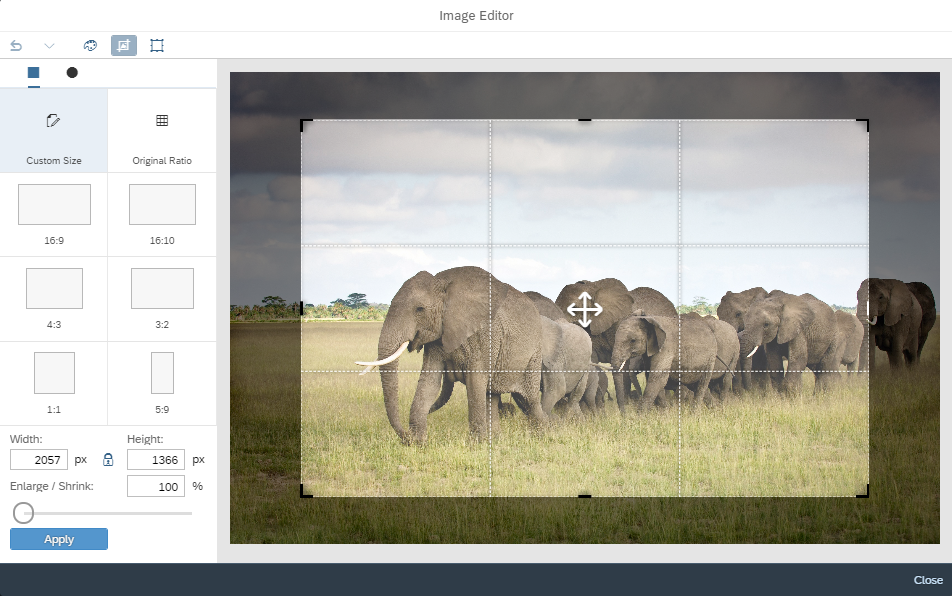

<!-- loioc9896e9fefee401fbdb3fbef8e06f733 -->

# What's New in SAPUI5 1.66

With this release SAPUI5 is upgraded from version 1.65 to 1.66.

** **

<table>
<tr>
<th valign="top">

Version

</th>
<th valign="top">

Type

</th>
<th valign="top">

Category

</th>
<th valign="top">

Title

</th>
<th valign="top">

Description

</th>
<th valign="top">

Action

</th>
<th valign="top">

Available as of

</th>
</tr>
<tr>
<td valign="top">

 1.66 

</td>
<td valign="top">

 Changed 

</td>
<td valign="top">

 Feature 

</td>
<td valign="top">

 **SAPUI5 OData V4 Model** 

</td>
<td valign="top">

**SAPUI5 OData V4 Model**

The new version of the SAPUI5 OData V4 model introduces the following features:

-   New events `createSent` and `createCompleted` on `v4.ODataListBinding`: These events are sent when a POST request for creating an entity is sent to the backend, and when it is completed. Note that the created promise of the new context is only resolved when the POST was successful.

-   `bAtEnd` parameter for the `v4.ODataListBinding.create` method: If this parameter is set, the new entity is added at the end of the list. Note that you must determine the length of the list using `$count`.

-   Format option `emptyString` defaults to 0 for `odata.type.Currency` and `odata.type.Unit`.

-   `v4.Context.requestSideEffects` can also be called on a context of a list binding representing a single entity and the header context of a list binding. For the latter, side effects are loaded for the whole binding.

-   Processing the ETag from the response header.

> ### Restriction:  
> Due to the limited feature scope of this version of the SAPUI5 OData V4 model, check that all required features are in place before developing applications. Check the detailed documentation of the features, as certain parts of a feature may be missing. While we aim to be compatible with existing controls, some controls might not work due to small incompatibilities compared to `sap.ui.model.odata.(v2.)ODataModel`, or due to missing features in the model \(such as tree binding\). This also applies to smart controls \(`sap.ui.comp` library\) and SAP Fiori elements that do not support the SAPUI5 OData V4 model, as well as controls such as `TreeTable` and `AnalyticalTable`, which are not supported together with the SAPUI5 OData V4 model. The interface for applications has been changed for easier and more efficient use of the model. For a summary of these changes, see [Changes Compared to OData V2 Model](../04_Essentials/changes-compared-to-odata-v2-model-abd4d7c.md).

For more information, see [OData V4 Model](../04_Essentials/odata-v4-model-5de13cf.md), the [API Reference](https://ui5.sap.com/#/api/sap.ui.model.odata.v4), and the [Samples](https://ui5.sap.com/#/entity/sap.ui.model.odata.v4.ODataModel).

Changed•Feature•Info Only•1.66

</td>
<td valign="top">

Info Only

</td>
<td valign="top">

2019-05-22

</td>
</tr>
<tr>
<td valign="top">

 1.66 

</td>
<td valign="top">

 New 

</td>
<td valign="top">

 Control 

</td>
<td valign="top">

 **`sap.suite.ui.commons.imageeditor`** 

</td>
<td valign="top">

**`sap.suite.ui.commons.imageeditor`**

The new `ImageEditor` control enables your users to edit images right inside your applications. It allows your users to resize images to preset or custom dimensions, crop images to rectangular, circular, or oval shapes, rotate and flip images, and apply widely used filters and effects. Available filters and effects include: brightness, contrast, saturation, grayscale, sepia, and invert colors.

The control's functionality is also exposed through an API and can be triggered programmatically.

For more information, see the [API Reference](https://ui5.sap.com/#/api/sap.suite.ui.commons.imageeditor) and the [samples](https://ui5.sap.com/#/entity/sap.suite.ui.commons.imageeditor).

New•Control•Info Only•1.66

</td>
<td valign="top">

 Info Only 

</td>
<td valign="top">

2019-05-22

</td>
</tr>
<tr>
<td valign="top">

 1.66 

</td>
<td valign="top">

 Changed 

</td>
<td valign="top">

 Feature 

</td>
<td valign="top">

 **Support for New Era in the Japanese Calendar** 

</td>
<td valign="top">

**Support for New Era in the Japanese Calendar**

Starting May 1, 2019, SAPUI5 supports a new era in the Japanese calendar, due to the imperial transition.

Changed•Feature•Info Only•1.66

</td>
<td valign="top">

 Info Only 

</td>
<td valign="top">

2019-05-22

</td>
</tr>
<tr>
<td valign="top">

 1.66 

</td>
<td valign="top">

 Changed 

</td>
<td valign="top">

 Control 

</td>
<td valign="top">

 **`sap.f.GridContainer` \(Experimental\)** 

</td>
<td valign="top">

**`sap.f.GridContainer` \(Experimental\)**

We have introduced three new properties:

-   `containerQuery` allows you to derive the layout breakpoints either based on the container surrounding the `sap.f.GridContainer` or the device screen size.

-   `allowDenseFill` is an experimental property that allows you to try out a denser arrangement of the grid items. Smaller items will take up all the available space, ignoring their order.

-    `inlineBlockLayout` is an experimental property. It allows you to arrange the items in rows with the height equal to the highest item in the row.

For more information, see [sap.f.GridContainer](../10_More_About_Controls/sap-f-gridcontainer-cca5ee5.md) and the [API Reference](https://ui5.sap.com/#/api/sap.f.GridContainer).

Changed•Control•Info Only•1.66

</td>
<td valign="top">

 Info Only 

</td>
<td valign="top">

2019-05-22

</td>
</tr>
<tr>
<td valign="top">

 1.66 

</td>
<td valign="top">

 Changed 

</td>
<td valign="top">

 Control 

</td>
<td valign="top">

 **`sap.gantt.simple`** 

</td>
<td valign="top">

**`sap.gantt.simple`**

Gantt chart 2.0 can now be exported to PDF. You can export the entire chart as a single-page document or spread the chart across multiple pages, depending on the media type that you choose.

For more information, see the [API Reference](https://ui5.sap.com/#/api/sap.gantt.simple.GanttPrinting).

Changed•Control•Info Only•1.66

</td>
<td valign="top">

 Info Only 

</td>
<td valign="top">

2019-05-22

</td>
</tr>
<tr>
<td valign="top">

 1.66 

</td>
<td valign="top">

 Changed 

</td>
<td valign="top">

 Control 

</td>
<td valign="top">

 **`sap.m.ComboBox / sap.m.MultiComboBox`** 

</td>
<td valign="top">

**`sap.m.ComboBox / sap.m.MultiComboBox`**

The options list used in these controls is now instantiated lazily. The list is created primarily based on user interaction. As a result of the change, the initialization time of the controls has decreased significantly. For more information, see the samples \([`sap.m.ComboBox`](https://ui5.sap.com/#/entity/sap.m.ComboBox), [`sap.m.MultiComboBox`](https://ui5.sap.com/#/entity/sap.m.MultiComboBox)\). 

Changed•Control•Info Only•1.66

</td>
<td valign="top">

 Info Only 

</td>
<td valign="top">

2019-05-22

</td>
</tr>
<tr>
<td valign="top">

 1.66 

</td>
<td valign="top">

 Changed 

</td>
<td valign="top">

 Control 

</td>
<td valign="top">

 **`sap.m.DateRangeSelection`** 

</td>
<td valign="top">

**`sap.m.DateRangeSelection`**

You can now change the date range value using keyboard combinations without opening the calendar. When the cursor is on the start date \(before the delimiter\), we change the start date and when it is on the end date \(after the delimiter\), we change the end date.

-   [PgUp\]/[PgDn\] - increments/decrements the date

-    [Shift\] + [PgUp\] / [Shift\] + [PgDn\]  - increments/decrements the month

-    [Ctrl\] + [Shift\] + [PgUp\] / [Ctrl\] + [Shift\] + [PgDn\]  - increments/decrements the year

For more information, see the [Sample](https://ui5.sap.com/#/entity/sap.m.DateRangeSelection/sample/sap.m.sample.DateRangeSelection).

Changed•Control•Info Only•1.66

</td>
<td valign="top">

 Info Only 

</td>
<td valign="top">

2019-05-22

</td>
</tr>
<tr>
<td valign="top">

 1.66 

</td>
<td valign="top">

 Changed 

</td>
<td valign="top">

 Control 

</td>
<td valign="top">

 **`sap.m.Input`** 

</td>
<td valign="top">

**`sap.m.Input`**

We have adjusted the value state text for the `sap.m.Input` control. The value state text is now shown in the suggestion popover container when the `sap.m.Input` control has suggestions.For more information, see the [API Reference](https://ui5.sap.com/#/api/sap.m.Input) and the [Samples](https://ui5.sap.com/#/entity/sap.m.Input).

Changed•Control•Info Only•1.66

</td>
<td valign="top">

 Info Only 

</td>
<td valign="top">

2019-05-22

</td>
</tr>
<tr>
<td valign="top">

 1.66 

</td>
<td valign="top">

 Changed 

</td>
<td valign="top">

 Control 

</td>
<td valign="top">

 **`sap.m.ObjectStatus`** 

</td>
<td valign="top">

**`sap.m.ObjectStatus`**

You can now switch the background and text colors using the new `inverted` property.For more information, see the [API Reference](https://ui5.sap.com/#/api/sap.m.ObjectStatus).

Changed•Control•Info Only•1.66

</td>
<td valign="top">

 Info Only 

</td>
<td valign="top">

2019-05-22

</td>
</tr>
<tr>
<td valign="top">

 1.66 

</td>
<td valign="top">

 Changed 

</td>
<td valign="top">

 Control 

</td>
<td valign="top">

 **`sap.m.Select`** 

</td>
<td valign="top">

**`sap.m.Select`**

To be better aligned with the other input controls, we have implemented a new `editable` property for the `sap.m.Select` control. If `editable` is set to `false`, the interaction with the control is disabled but remains focusable, and its background color and borders are changed to indicate that it's read-only.For more information, see the [API Reference](https://ui5.sap.com/#/api/sap.m.Select) and the [Sample](https://ui5.sap.com/#/entity/sap.m.Select/sample/sap.m.sample.Select).

Changed•Control•Info Only•1.66

</td>
<td valign="top">

 Info Only 

</td>
<td valign="top">

2019-05-22

</td>
</tr>
<tr>
<td valign="top">

 1.66 

</td>
<td valign="top">

 Changed 

</td>
<td valign="top">

 Control 

</td>
<td valign="top">

 **`sap.m.SinglePlanningCalendar`** 

</td>
<td valign="top">

**`sap.m.SinglePlanningCalendar`**

-   You can now include custom views to display different numbers of columns in the grid area of the control, for example, you can show only the first 10 days of each month. To create custom views, extend the `sap.m.SinglePlanningCalendarView` basic view class.For more information, see the [API Reference](https://ui5.sap.com/#/api/sap.m.SinglePlanningCalendar) and the [Sample](https://ui5.sap.com/#/entity/sap.m.SinglePlanningCalendar/sample/sap.m.sample.SinglePlanningCalendarWithCustomViews).

-   We have implemented a new `specialDates` aggregation, that allows you to define special dates for the control. They are visualized as a color bar in the header below the respective dates. In addition, you can add the assigned special dates to the associated `sap.m.PlanningCalendarLegend`.For more information, see the [API Reference](https://ui5.sap.com/#/api/sap.m.SinglePlanningCalendar) and the [Sample](https://ui5.sap.com/#/entity/sap.m.SinglePlanningCalendar/sample/sap.m.sample.SinglePlanningCalendarWithLegend).

-   The control can now display longer titles and texts of appointments on multiple lines depending on the length of the appointment.For more information, see the [Sample](https://ui5.sap.com/#/entity/sap.m.SinglePlanningCalendar/sample/sap.m.sample.SinglePlanningCalendarWithCustomViews).

-   We added an arrow indicator to improve the visual design of appointments which are not marked as *All-day* but do continue outside of the visible area.

Changed•Control•Info Only•1.66

</td>
<td valign="top">

 Info Only 

</td>
<td valign="top">

2019-05-22

</td>
</tr>
<tr>
<td valign="top">

 1.66 

</td>
<td valign="top">

 Changed 

</td>
<td valign="top">

 Control 

</td>
<td valign="top">

 **`sap.ui.comp.smartchart.SmartChart`** 

</td>
<td valign="top">

**`sap.ui.comp.smartchart.SmartChart`**

We have introduced the `initialized` event to enable asynchronous processing for the `SmartChart` control. This event replaces the `initialise` event. For more information, see the [API Reference](https://ui5.sap.com/#/api/sap.ui.comp.smartchart.SmartChart) for the related events.

Changed•Control•Info Only•1.66

</td>
<td valign="top">

 Info Only 

</td>
<td valign="top">

2019-05-22

</td>
</tr>
<tr>
<td valign="top">

 1.66 

</td>
<td valign="top">

 Changed 

</td>
<td valign="top">

 Control 

</td>
<td valign="top">

 **`sap.ui.comp.smarttable.SmartTable`** 

</td>
<td valign="top">

**`sap.ui.comp.smarttable.SmartTable`**

-   Responsive tables now use the `wrappingType` property of the `sap.m.Text` control for hyphenation in header texts with multiple lines when the control is in wrapping mode. For more information, see [Hyphenation for Text Controls](../10_More_About_Controls/hyphenation-for-text-controls-6322164.md) and the [API Reference](https://ui5.sap.com/#/api/sap.m.Text).

-   Some of the calendar and fiscal annotations of the `com.sap.vocabularies.Common.v1` vocabulary now right align the table columns. For more information, see the [API Reference](https://ui5.sap.com/#/api/sap.ui.comp.smarttable.SmartTable) for the `IsCalendarDate` annotation and the [Sample](https://ui5.sap.com/#/entity/sap.ui.comp.smarttable.SmartTable/sample/sap.ui.comp.sample.smarttable).

Changed•Control•Info Only•1.66

</td>
<td valign="top">

 Info Only 

</td>
<td valign="top">

2019-05-22

</td>
</tr>
<tr>
<td valign="top">

 1.66 

</td>
<td valign="top">

 Changed 

</td>
<td valign="top">

 SAP Fiori Elements 

</td>
<td valign="top">

 **SAP Fiori Elements** 

</td>
<td valign="top">

**SAP Fiori Elements**

**General Features**

SAP Fiori 3 user experience is now enabled for all SAP Fiori elements-based applications by default.

**Object Page**

The `InsertRestriction` property can now be passed as a property for the navigation leading to the sub-entity. For more information, see [Defining and Adapting Sections](../06_SAP_Fiori_Elements/defining-and-adapting-sections-facfea0.md).

Changed•SAP Fiori Elements•Info Only•1.66

</td>
<td valign="top">

 Info Only 

</td>
<td valign="top">

2019-05-22

</td>
</tr>
<tr>
<td valign="top">

 1.66 

</td>
<td valign="top">

 Changed 

</td>
<td valign="top">

 User Documentation 

</td>
<td valign="top">

 **OData V2 Messaging Documentation** 

</td>
<td valign="top">

**OData V2 Messaging Documentation**

The OData V2 Messaging documentation has been enhanced and improved. See [Error, Warning, and Info Messages](../04_Essentials/error-warning-and-info-messages-62b1481.md).

Changed•Control•Info Only•1.66

</td>
<td valign="top">

 Info Only 

</td>
<td valign="top">

2019-05-22

</td>
</tr>
</table>

**Related Information**  

[What's New in SAPUI5 1.110](what-s-new-in-sapui5-1-110-71a855c.md "With this release SAPUI5 is upgraded from version 1.109 to 1.110.")

[What's New in SAPUI5 1.109](what-s-new-in-sapui5-1-109-3264bd2.md "With this release SAPUI5 is upgraded from version 1.108 to 1.109.")

[What's New in SAPUI5 1.108](what-s-new-in-sapui5-1-108-66e33f0.md "With this release SAPUI5 is upgraded from version 1.107 to 1.108.")

[What's New in SAPUI5 1.107](what-s-new-in-sapui5-1-107-d4ff916.md "With this release SAPUI5 is upgraded from version 1.106 to 1.107.")

[What's New in SAPUI5 1.106](what-s-new-in-sapui5-1-106-5b497b0.md "With this release SAPUI5 is upgraded from version 1.105 to 1.106.")

[What's New in SAPUI5 1.105](what-s-new-in-sapui5-1-105-4d6c00e.md "With this release SAPUI5 is upgraded from version 1.104 to 1.105.")

[What's New in SAPUI5 1.104](what-s-new-in-sapui5-1-104-69e567c.md "With this release SAPUI5 is upgraded from version 1.103 to 1.104.")

[What's New in SAPUI5 1.103](what-s-new-in-sapui5-1-103-0e98c76.md "With this release SAPUI5 is upgraded from version 1.102 to 1.103.")

[What's New in SAPUI5 1.102](what-s-new-in-sapui5-1-102-f038c99.md "With this release SAPUI5 is upgraded from version 1.101 to 1.102.")

[What's New in SAPUI5 1.101](what-s-new-in-sapui5-1-101-7733b00.md "With this release SAPUI5 is upgraded from version 1.100 to 1.101.")

[What's New in SAPUI5 1.100](what-s-new-in-sapui5-1-100-27dec1d.md "With this release SAPUI5 is upgraded from version 1.99 to 1.100.")

[What's New in SAPUI5 1.99](what-s-new-in-sapui5-1-99-4f35848.md "With this release SAPUI5 is upgraded from version 1.98 to 1.99.")

[What's New in SAPUI5 1.98](what-s-new-in-sapui5-1-98-d9f16f2.md "With this release SAPUI5 is upgraded from version 1.97 to 1.98.")

[What's New in SAPUI5 1.97](what-s-new-in-sapui5-1-97-fa0e282.md "With this release SAPUI5 is upgraded from version 1.96 to 1.97.")

[What's New in SAPUI5 1.96](what-s-new-in-sapui5-1-96-7a9269f.md "With this release SAPUI5 is upgraded from version 1.95 to 1.96.")

[What's New in SAPUI5 1.95](what-s-new-in-sapui5-1-95-a1aea67.md "With this release SAPUI5 is upgraded from version 1.94 to 1.95.")

[What's New in SAPUI5 1.94](what-s-new-in-sapui5-1-94-c40f1e6.md "With this release SAPUI5 is upgraded from version 1.93 to 1.94.")

[What's New in SAPUI5 1.93](what-s-new-in-sapui5-1-93-f273340.md "With this release SAPUI5 is upgraded from version 1.92 to 1.93.")

[What's New in SAPUI5 1.92](what-s-new-in-sapui5-1-92-1ef345d.md "With this release SAPUI5 is upgraded from version 1.91 to 1.92.")

[What's New in SAPUI5 1.91](what-s-new-in-sapui5-1-91-0a2bd79.md "With this release SAPUI5 is upgraded from version 1.90 to 1.91.")

[What's New in SAPUI5 1.90](what-s-new-in-sapui5-1-90-91c10c2.md "With this release SAPUI5 is upgraded from version 1.89 to 1.90.")

[What's New in SAPUI5 1.89](what-s-new-in-sapui5-1-89-e56cddc.md "With this release SAPUI5 is upgraded from version 1.88 to 1.89.")

[What's New in SAPUI5 1.88](what-s-new-in-sapui5-1-88-e15a206.md "With this release SAPUI5 is upgraded from version 1.87 to 1.88.")

[What's New in SAPUI5 1.87](what-s-new-in-sapui5-1-87-b506da7.md "With this release SAPUI5 is upgraded from version 1.86 to 1.87.")

[What's New in SAPUI5 1.86](what-s-new-in-sapui5-1-86-4c1c959.md "With this release SAPUI5 is upgraded from version 1.85 to 1.86.")

[What's New in SAPUI5 1.85](what-s-new-in-sapui5-1-85-1d18eb5.md "With this release SAPUI5 is upgraded from version 1.84 to 1.85.")

[What's New in SAPUI5 1.84](what-s-new-in-sapui5-1-84-dc76640.md "With this release SAPUI5 is upgraded from version 1.82 to 1.84.")

[What's New in SAPUI5 1.82](what-s-new-in-sapui5-1-82-3a8dd13.md "With this release SAPUI5 is upgraded from version 1.81 to 1.82.")

[What's New in SAPUI5 1.81](what-s-new-in-sapui5-1-81-f5e2a21.md "With this release SAPUI5 is upgraded from version 1.80 to 1.81.")

[What's New in SAPUI5 1.80](what-s-new-in-sapui5-1-80-8cee506.md "With this release SAPUI5 is upgraded from version 1.79 to 1.80.")

[What's New in SAPUI5 1.79](what-s-new-in-sapui5-1-79-99c4cdc.md "With this release SAPUI5 is upgraded from version 1.78 to 1.79.")

[What's New in SAPUI5 1.78](what-s-new-in-sapui5-1-78-f09b63e.md "With this release SAPUI5 is upgraded from version 1.77 to 1.78.")

[What's New in SAPUI5 1.77](what-s-new-in-sapui5-1-77-c46b439.md "With this release SAPUI5 is upgraded from version 1.76 to 1.77.")

[What's New in SAPUI5 1.76](what-s-new-in-sapui5-1-76-aad03b5.md "With this release SAPUI5 is upgraded from version 1.75 to 1.76.")

[What's New in SAPUI5 1.75](what-s-new-in-sapui5-1-75-5cbb62d.md "With this release SAPUI5 is upgraded from version 1.74 to 1.75.")

[What's New in SAPUI5 1.74](what-s-new-in-sapui5-1-74-c22208a.md "With this release SAPUI5 is upgraded from version 1.73 to 1.74.")

[What's New in SAPUI5 1.73](what-s-new-in-sapui5-1-73-231dd13.md "With this release SAPUI5 is upgraded from version 1.72 to 1.73.")

[What's New in SAPUI5 1.72](what-s-new-in-sapui5-1-72-521cad9.md "With this release SAPUI5 is upgraded from version 1.71 to 1.72.")

[What's New in SAPUI5 1.71](what-s-new-in-sapui5-1-71-a93a6a3.md "With this release SAPUI5 is upgraded from version 1.70 to 1.71.")

[What's New in SAPUI5 1.70](what-s-new-in-sapui5-1-70-f073d69.md "With this release SAPUI5 is upgraded from version 1.69 to 1.70.")

[What's New in SAPUI5 1.69](what-s-new-in-sapui5-1-69-89a18bd.md "With this release SAPUI5 is upgraded from version 1.68 to 1.69.")

[What's New in SAPUI5 1.68](what-s-new-in-sapui5-1-68-f94bf93.md "With this release SAPUI5 is upgraded from version 1.67 to 1.68.")

[What's New in SAPUI5 1.67](what-s-new-in-sapui5-1-67-a6b1472.md "With this release SAPUI5 is upgraded from version 1.66 to 1.67.")

[What's New in SAPUI5 1.65](what-s-new-in-sapui5-1-65-0f5acfd.md "With this release SAPUI5 is upgraded from version 1.64 to 1.65.")

[What's New in SAPUI5 1.64](what-s-new-in-sapui5-1-64-0e30822.md "With this release SAPUI5 is upgraded from version 1.63 to 1.64.")

[What's New in SAPUI5 1.63](what-s-new-in-sapui5-1-63-e8d9da7.md "With this release SAPUI5 is upgraded from version 1.62 to 1.63.")

[What's New in SAPUI5 1.62](what-s-new-in-sapui5-1-62-771f4d5.md "With this release SAPUI5 is upgraded from version 1.61 to 1.62.")

[What's New in SAPUI5 1.61](what-s-new-in-sapui5-1-61-d991552.md "With this release SAPUI5 is upgraded from version 1.60 to 1.61.")

[What's New in SAPUI5 1.60](what-s-new-in-sapui5-1-60-5a0e1f7.md "With this release SAPUI5 is upgraded from version 1.58 to 1.60.")

[What's New in SAPUI5 1.58](what-s-new-in-sapui5-1-58-7c927aa.md "With this release SAPUI5 is upgraded from version 1.56 to 1.58.")

[What's New in SAPUI5 1.56](what-s-new-in-sapui5-1-56-108b7fd.md "With this release SAPUI5 is upgraded from version 1.54 to 1.56.")

[What's New in SAPUI5 1.54](what-s-new-in-sapui5-1-54-c838330.md "With this release SAPUI5 is upgraded from version 1.52 to 1.54.")

[What's New in SAPUI5 1.52](what-s-new-in-sapui5-1-52-849e1b6.md "With this release SAPUI5 is upgraded from version 1.50 to 1.52.")

[What's New in SAPUI5 1.50](what-s-new-in-sapui5-1-50-759e9f3.md "With this release SAPUI5 is upgraded from version 1.48 to 1.50.")

[What's New in SAPUI5 1.48](what-s-new-in-sapui5-1-48-fa1efac.md "With this release SAPUI5 is upgraded from version 1.46 to 1.48.")

[What's New in SAPUI5 1.46](what-s-new-in-sapui5-1-46-6307539.md "With this release SAPUI5 is upgraded from version 1.44 to 1.46.")

[What's New in SAPUI5 1.44](what-s-new-in-sapui5-1-44-a0cb7a0.md "With this release SAPUI5 is upgraded from version 1.42 to 1.44.")

[What's New in SAPUI5 1.42](what-s-new-in-sapui5-1-42-468b05d.md "With this release SAPUI5 is upgraded from version 1.40 to 1.42.")

[What's New in SAPUI5 1.40](what-s-new-in-sapui5-1-40-fbab50e.md "With this release SAPUI5 is upgraded from version 1.38 to 1.40.")

[What's New in SAPUI5 1.38](what-s-new-in-sapui5-1-38-f218918.md "With this release SAPUI5 is upgraded from version 1.36 to 1.38.")

