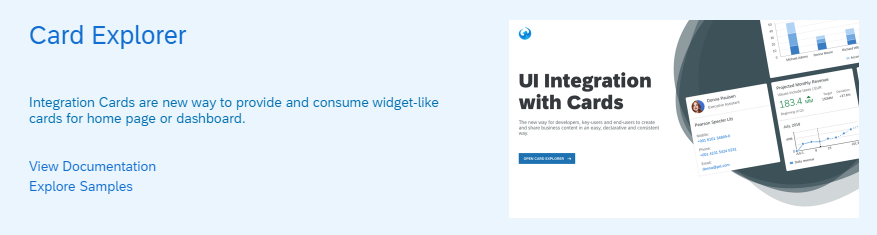

<!-- loio5531aef1adc8462392a5b8fe1178606e -->

# What's New in SAPUI5 1.68

With this release SAPUI5 is upgraded from version 1.67 to 1.68.

<a name="loio5531aef1adc8462392a5b8fe1178606e__section_yxw_pxt_zcb"/>

## New Features

<table>
<tr>
<td valign="top">

**Format Option `parseKeepsEmptyString`**

The format option `parseKeepsEmptyString` for `sap.ui.model.odata.type.String` is now available. This format option is set to `true` by `sap.ui.model.odata.v4.AnnotationHelper.format`, this means, the changed behavior applies automatically if templating is used with `v4.AnnotationHelper.format`.

</td>
</tr>
<tr>
<td valign="top">

**New Semantic Rendering With `RenderManager`**

The `RenderManager` class provides a new way of semantic rendering for controls. It allows for an easier and more efficient type of rendering by updating only the required parts of the DOM structure and no longer requires any plain JavaScript updates in the custom setters of the controls.

To enable this type of rendering, set the `apiVersion` property of the control renderer to *2*.

For more information, see the [API Reference](https://ui5.sap.com/#/api/sap.ui.core.RenderManager).

</td>
</tr>
<tr>
<td valign="top">

<code><b>sap.ui.integration.widgets.Card</b></code>

Using our newly developed tool - Card Explorer - you can explore and learn more about the UI Integration Cards. You can find the Card Explorer in the tool section of the Demo Kit. 

 For more information, see [Card Explorer](https://ui5.sap.com/test-resources/sap/ui/integration/demokit/cardExplorer/index.html).

</td>
</tr>
</table>

<a name="loio5531aef1adc8462392a5b8fe1178606e__section_qwl_pb5_zcb"/>

## Improved Features

<table>
<tr>
<td valign="top">

**SAPUI5 OData V4 Model**

The new version of the SAPUI5 OData V4 model introduces the following features:

-   Overloads of bound functions are now supported if the same function name is used for different binding parameter types.

-   The original error or unbound message is now available as `technicalDetails.originalMessage` in the Message in the message model. This can be used to transport additional information.

-   It is now possible to use `auto-$expand/$select` with value help models by setting parameter `bAutoExpandSelect` of method `requestValueListInfo` of the `v4.ODataPropertyBinding` or the `v4.ODataMetaModel` respectively.

> ### Restriction:  
> Due to the limited feature scope of this version of the SAPUI5 OData V4 model, check that all required features are in place before developing freestyle and Fiori elements applications. Double check the detailed documentation of the features, as certain parts of a feature may be missing. While we aim to be compatible with existing controls, some controls might not work due to small incompatibilities compared to `sap.ui.model.odata.(v2.)ODataModel`, or due to missing features in the model \(such as tree binding\). This also applies to smart controls \(`sap.ui.comp` library\) that do not support the SAPUI5 OData V4 model, as well as controls such as `TreeTable` and `AnalyticalTable`, which are not supported together with the SAPUI5 OData V4 model. The interface for applications has been changed for easier and more efficient use of the model. For a summary of these changes, see [Changes Compared to OData V2 Model](../04_Essentials/changes-compared-to-odata-v2-model-abd4d7c.md).

For more information, see [OData V4 Model](../04_Essentials/odata-v4-model-5de13cf.md), the [API Reference](https://ui5.sap.com/#/api/sap.ui.model.odata.v4), and the [Samples](https://ui5.sap.com/#/entity/sap.ui.model.odata.v4.ODataModel).

</td>
</tr>
<tr>
<td valign="top">

**Text Wrapping for Spreadsheet Export**

If you set the new `wrap` property to `true`, the content of columns of type *text* in exported tables is automatically wrapped within a cell. If wrapping is enabled like this, line breaks within cells are transformed in compliance with the Office Open XML requirements. For more information, see [Spreadsheet Export](../04_Essentials/spreadsheet-export-2691788.md), the [API Reference](https://ui5.sap.com/#/api/sap.ui.export.Spreadsheet/overview), and the [Sample](https://ui5.sap.com/#/entity/sap.ui.export.Spreadsheet/sample/sap.ui.export.sample.formatting).

</td>
</tr>
</table>

<a name="loio5531aef1adc8462392a5b8fe1178606e__section_rqn_wd5_zcb"/>

## Improved Controls

<table>
<tr>
<td valign="top">

**`sap.f.DynamicPage`**

You can now change the background color of the `DynamicPage` control by using the new `backgroundDesign` property.For more information, see the [API Reference](https://ui5.sap.com/#/api/sap.f.DynamicPage).

</td>
</tr>
<tr>
<td valign="top">

**`sap.f.GridContainer` \(Experimental\)**

We have enhanced the drag and drop functionality. With the new version, we introduced a drop indicator that mimics the size of the dragged item and shows the potential drop position inside the grid. The indicator pushes away other grid items, showing the correct arrangement calculated by the grid’s auto-placement algorithm. The API for the enhanced drag and drop is consistent with the default drag and drop API. This allows you to configure complex behavior.

For more information, see the [API Reference](https://ui5.sap.com/#/api/sap.f.GridContainer) and the [Sample](https://ui5.sap.com/#/entity/sap.f.GridContainer/sample/sap.f.sample.GridContainerDragAndDrop).

</td>
</tr>
<tr>
<td valign="top">

**`sap.m.DatePicker`**

The options displayed in the picker now depend on the display format. For example, if the set `displayFormat` is `MM-y` or `yyyy`, the picker directly displays years with months or only years and the user no longer needs to select a specific day.For more information, see the [Sample](https://ui5.sap.com/#/entity/sap.m.DatePicker/sample/sap.m.sample.DatePicker).

</td>
</tr>
<tr>
<td valign="top">

**`sap.m.SelectDialog`, `sap.m.TableSelectDialog`**

Application developers can now customize the text of the confirmation button for the controls. If no specific value is set, the text of the button is set to `Select`. For more information, see the API Reference \([sap.m.SelectDialog](https://ui5.sap.com/#/api/sap.m.SelectDialog), [sap.m.TableSelectDialog](https://ui5.sap.com/#/api/sap.m.TableSelectDialog)\).

</td>
</tr>
<tr>
<td valign="top">

**`sap.m.SelectDialog`**

We have introduced a new API method called `clearSelection` that allows removing all selections from the `sap.m.SelectDialog` and its internally used list \(`sap.m.List`\). For more information, see the [API Reference](https://ui5.sap.com/#/api/sap.m.SelectDialog) and the [Samples](https://ui5.sap.com/#/entity/sap.m.SelectDialog).

</td>
</tr>
<tr>
<td valign="top">

**`sap.ui.comp.smartvariants.SmartVariantManagement`**

The `SmartVariantManagement` control now supports asynchronous `fetchVariant` calls by returning a `Promise` object. If the `Promise` object is recognized, the control is temporarily disabled to prevent any further user interaction until `Promise` is resolved. This way, hosting apps can request an inner-app state and get a response **before** a variant is saved with the `save` event.

This behavior is supported for page variants and control variants \(for example, variant management within the `SmartTable` control\).

</td>
</tr>
</table>

<a name="loio5531aef1adc8462392a5b8fe1178606e__section_g3r_bf5_zcb"/>

## SAP Fiori Elements

<table>
<tr>
<td valign="top">

**List Report and Object Page**

You can now implement context-independent actions that call OData `FunctionImports` that do not require a context. That means, they do not expose a `“sap:action-for”` annotation. For more information, see [Actions](../06_SAP_Fiori_Elements/actions-cbf16c5.md).

**Object Page**

-   Users can now navigate between subobjects in edit mode. This is possible in draft and in non-draft apps.

-   Improved message handling: If there are any back end messages after activation, they will override the standard success message shown in applications.

**Analytical List Page**

ALP supports the use of avatars.

**Overview Page**

OVP supports the use of images, icons, and avatars.

For more information, see [Using Images, Initials, and Icons](../06_SAP_Fiori_Elements/using-images-initials-and-icons-5760b63.md).

</td>
</tr>
</table>

<a name="loio5531aef1adc8462392a5b8fe1178606e__section_r5v_3h5_zcb"/>

## Demo Kit Improvements

<table>
<tr>
<td valign="top">

**API Reference**

To improve the visualization of borrowed *Properties*, *Aggregations*, and *Associations*, we added a checkbox that enables you to switch them on and off. Initially, the borrowed entities aren't displayed.

  

</td>
</tr>
<tr>
<td valign="top">

**Web Page Title**

The web page title is now updated dynamically to reflect the currently open tab. The differentiation is between the main pages of the Demo Kit app – *Documentation*, *API Reference*, *Samples*, *Demo Apps*, and *Tools*.

</td>
</tr>
</table>

**Related Information**  

[What's New in SAPUI5 1.106](what-s-new-in-sapui5-1-106-c70bb90.md "With this release SAPUI5 is upgraded from version 1.105 to 1.106.")

[What's New in SAPUI5 1.105](what-s-new-in-sapui5-1-105-5567dcc.md "With this release SAPUI5 is upgraded from version 1.104 to 1.105.")

[What's New in SAPUI5 1.104](what-s-new-in-sapui5-1-104-f01ebd4.md "With this release SAPUI5 is upgraded from version 1.103 to 1.104.")

[What's New in SAPUI5 1.103](what-s-new-in-sapui5-1-103-7534ae8.md "With this release SAPUI5 is upgraded from version 1.102 to 1.103.")

[What's New in SAPUI5 1.102](what-s-new-in-sapui5-1-102-b530db3.md "With this release SAPUI5 is upgraded from version 1.101 to 1.102.")

[What's New in SAPUI5 1.101](what-s-new-in-sapui5-1-101-5a18410.md "With this release SAPUI5 is upgraded from version 1.100 to 1.101.")

[What's New in SAPUI5 1.100](what-s-new-in-sapui5-1-100-5deb78f.md "With this release SAPUI5 is upgraded from version 1.99 to 1.100.")

[What's New in SAPUI5 1.99](what-s-new-in-sapui5-1-99-5e35c25.md "With this release SAPUI5 is upgraded from version 1.98 to 1.99.")

[What's New in SAPUI5 1.98](what-s-new-in-sapui5-1-98-7aacb4e.md "With this release SAPUI5 is upgraded from version 1.97 to 1.98.")

[What's New in SAPUI5 1.97](what-s-new-in-sapui5-1-97-f21858f.md "With this release SAPUI5 is upgraded from version 1.96 to 1.97.")

[What's New in SAPUI5 1.96](what-s-new-in-sapui5-1-96-b39a11b.md "With this release SAPUI5 is upgraded from version 1.95 to 1.96.")

[What's New in SAPUI5 1.95](what-s-new-in-sapui5-1-95-1b09465.md "With this release SAPUI5 is upgraded from version 1.94 to 1.95.")

[What's New in SAPUI5 1.94](what-s-new-in-sapui5-1-94-2d6ffdd.md "With this release SAPUI5 is upgraded from version 1.93 to 1.94.")

[What's New in SAPUI5 1.93](what-s-new-in-sapui5-1-93-e9c8356.md "With this release SAPUI5 is upgraded from version 1.92 to 1.93.")

[What's New in SAPUI5 1.92](what-s-new-in-sapui5-1-92-1492551.md "With this release SAPUI5 is upgraded from version 1.91 to 1.92.")

[What's New in SAPUI5 1.91](what-s-new-in-sapui5-1-91-75777da.md "With this release SAPUI5 is upgraded from version 1.90 to 1.91.")

[What's New in SAPUI5 1.90](what-s-new-in-sapui5-1-90-b475202.md "With this release SAPUI5 is upgraded from version 1.89 to 1.90.")

[What's New in SAPUI5 1.89](what-s-new-in-sapui5-1-89-0805036.md "With this release SAPUI5 is upgraded from version 1.88 to 1.89.")

[What's New in SAPUI5 1.88](what-s-new-in-sapui5-1-88-bda141b.md "With this release SAPUI5 is upgraded from version 1.87 to 1.88.")

[What's New in SAPUI5 1.87](what-s-new-in-sapui5-1-87-e315108.md "With this release SAPUI5 is upgraded from version 1.86 to 1.87.")

[What's New in SAPUI5 1.86](what-s-new-in-sapui5-1-86-067e2fb.md "With this release SAPUI5 is upgraded from version 1.85 to 1.86.")

[What's New in SAPUI5 1.85](what-s-new-in-sapui5-1-85-eeb5bd9.md "With this release SAPUI5 is upgraded from version 1.84 to 1.85.")

[What's New in SAPUI5 1.84](what-s-new-in-sapui5-1-84-ccf76b7.md "With this release SAPUI5 is upgraded from version 1.82 to 1.84.")

[What's New in SAPUI5 1.82](what-s-new-in-sapui5-1-82-f081cf0.md "With this release SAPUI5 is upgraded from version 1.81 to 1.82.")

[What's New in SAPUI5 1.81](what-s-new-in-sapui5-1-81-f71563c.md "With this release SAPUI5 is upgraded from version 1.80 to 1.81.")

[What's New in SAPUI5 1.80](what-s-new-in-sapui5-1-80-3294c68.md "With this release SAPUI5 is upgraded from version 1.79 to 1.80.")

[What's New in SAPUI5 1.79](what-s-new-in-sapui5-1-79-edf8e35.md "With this release SAPUI5 is upgraded from version 1.78 to 1.79.")

[What's New in SAPUI5 1.78](what-s-new-in-sapui5-1-78-d176be3.md "With this release SAPUI5 is upgraded from version 1.77 to 1.78.")

[What's New in SAPUI5 1.77](what-s-new-in-sapui5-1-77-2ec6b6b.md "With this release SAPUI5 is upgraded from version 1.76 to 1.77.")

[What's New in SAPUI5 1.76](what-s-new-in-sapui5-1-76-b9b0a3f.md "With this release SAPUI5 is upgraded from version 1.75 to 1.76.")

[What's New in SAPUI5 1.75](what-s-new-in-sapui5-1-75-dc3d3ce.md "With this release SAPUI5 is upgraded from version 1.74 to 1.75.")

[What's New in SAPUI5 1.74](what-s-new-in-sapui5-1-74-21fc6cb.md "With this release SAPUI5 is upgraded from version 1.73 to 1.74.")

[What's New in SAPUI5 1.73](what-s-new-in-sapui5-1-73-7b82664.md "With this release SAPUI5 is upgraded from version 1.72 to 1.73.")

[What's New in SAPUI5 1.72](what-s-new-in-sapui5-1-72-25e5326.md "With this release SAPUI5 is upgraded from version 1.71 to 1.72.")

[What's New in SAPUI5 1.71](what-s-new-in-sapui5-1-71-609fd01.md "With this release SAPUI5 is upgraded from version 1.70 to 1.71.")

[What's New in SAPUI5 1.70](what-s-new-in-sapui5-1-70-4e89fee.md "With this release SAPUI5 is upgraded from version 1.69 to 1.70.")

[What's New in SAPUI5 1.69](what-s-new-in-sapui5-1-69-41203fd.md "With this release SAPUI5 is upgraded from version 1.68 to 1.69.")

[What's New in SAPUI5 1.67](what-s-new-in-sapui5-1-67-0968958.md "With this release SAPUI5 is upgraded from version 1.66 to 1.67.")

[What's New in SAPUI5 1.66](what-s-new-in-sapui5-1-66-ebe7fda.md "With this release SAPUI5 is upgraded from version 1.65 to 1.66.")

[What's New in SAPUI5 1.65](what-s-new-in-sapui5-1-65-9d2b189.md "With this release SAPUI5 is upgraded from version 1.64 to 1.65.")

[What's New in SAPUI5 1.64](what-s-new-in-sapui5-1-64-1975e30.md "With this release SAPUI5 is upgraded from version 1.63 to 1.64.")

[What's New in SAPUI5 1.63](what-s-new-in-sapui5-1-63-77e1dcc.md "With this release SAPUI5 is upgraded from version 1.62 to 1.63.")

[What's New in SAPUI5 1.62](what-s-new-in-sapui5-1-62-27eea38.md "With this release SAPUI5 is upgraded from version 1.61 to 1.62.")

[What's New in SAPUI5 1.61](what-s-new-in-sapui5-1-61-de4d50b.md "With this release SAPUI5 is upgraded from version 1.60 to 1.61.")

[What's New in SAPUI5 1.60](what-s-new-in-sapui5-1-60-2a70354.md "With this release SAPUI5 is upgraded from version 1.58 to 1.60.")

[What's New in SAPUI5 1.58](what-s-new-in-sapui5-1-58-b28edde.md "With this release, SAPUI5 is upgraded from version 1.56 to 1.58.")

[What's New in SAPUI5 1.56](what-s-new-in-sapui5-1-56-53b4b5e.md "With this release, SAPUI5 is upgraded from version 1.54 to 1.56.")

[What's New in SAPUI5 1.54](what-s-new-in-sapui5-1-54-f29023e.md "With this release, SAPUI5 is upgraded from version 1.52 to 1.54.")

[What's New in SAPUI5 1.52](what-s-new-in-sapui5-1-52-a09dd79.md "With this release, SAPUI5 is upgraded from version 1.50 to 1.52.")

[What's New in SAPUI5 1.50](what-s-new-in-sapui5-1-50-a844984.md "With this release, SAPUI5 is upgraded from version 1.48 to 1.50.")

[What's New in SAPUI5 1.48](what-s-new-in-sapui5-1-48-2818f80.md "With this release, SAPUI5 is upgraded from version 1.46 to 1.48.")

[What's New in SAPUI5 1.46](what-s-new-in-sapui5-1-46-4cf0986.md "With this release, SAPUI5 is upgraded from version 1.44 to 1.46.")

[What's New in SAPUI5 1.44](what-s-new-in-sapui5-1-44-05ce1dc.md "With this release, SAPUI5 is upgraded from version 1.42 to 1.44.")

[What's New in SAPUI5 1.42](what-s-new-in-sapui5-1-42-4768f1a.md "With this release, SAPUI5 is upgraded from version 1.40 to 1.42.")

[What's New in SAPUI5 1.40](what-s-new-in-sapui5-1-40-e659bd2.md "With this release, SAPUI5 is upgraded from version 1.38 to 1.40.")

[What's New in SAPUI5 1.38](what-s-new-in-sapui5-1-38-6a875f9.md#loio6a875f998994489483e8085705347d72 "With this release, SAPUI5 is upgraded from version 1.36 to 1.38.")

