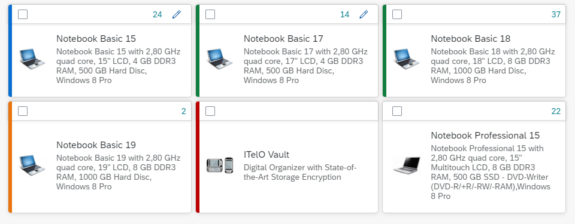
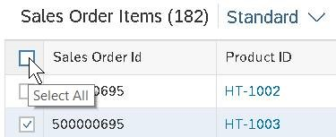
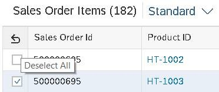

<!-- loio4e89fee547a24385826cddcfdf4df238 -->

# What's New in SAPUI5 1.70

With this release SAPUI5 is upgraded from version 1.69 to 1.70.

<a name="loio4e89fee547a24385826cddcfdf4df238__section_yxw_pxt_zcb"/>

## New Features

<table>
<tr>
<td valign="top">

**Rule Builder Control**

You can model a text rule to perform operations on data objects or attributes in expression language 2.0. For more information, see **Operations** in [Features](../03_Get-Started/features-e603588.md).

</td>
</tr>
</table>

<a name="loio4e89fee547a24385826cddcfdf4df238__section_bkm_s15_zcb"/>

## New Controls

<table>
<tr>
<td valign="top">

<code><b>sap.f.GridListItem</b></code>

We have introduced a new control `GridListItem` to be used in the default `items` aggregation of `sap.f.GridList`. It consists of a header toolbar and content.

  

Note that even though the `content` aggregation can be used for any control, complex responsive layout controls, such as `Table` and `Form`, should not be used.

For more information, see the [API Reference](https://ui5.sap.com/#/api/sap.f.GridListItem) and the [Sample](https://ui5.sap.com/#/entity/sap.f.GridList/sample/sap.f.sample.GridListModes).

</td>
</tr>
</table>

<a name="loio4e89fee547a24385826cddcfdf4df238__section_qwl_pb5_zcb"/>

## Improved Features

<table>
<tr>
<td valign="top">

**SAPUI5 OData V4 Model**

The new version of the SAPUI5 OData V4 model introduces the following features:

-   The `sap.ui.model.odata.v4.ODataListBinding.requestContexts` method is available for requesting and accessing a collection in controller code through list bindings.

> ### Restriction:  
> Due to the limited feature scope of this version of the SAPUI5 OData V4 model, check that all required features are in place before developing freestyle and SAP Fiori elements applications. Double-check the detailed documentation of the features, as certain parts of a feature may be missing. While we aim to be compatible with existing controls, some controls might not work due to small incompatibilities compared to `sap.ui.model.odata.(v2.)ODataModel`, or due to missing features in the model \(such as tree binding\). This also applies to smart controls \(`sap.ui.comp` library\) that do not support the SAPUI5 OData V4 model, as well as controls such as `TreeTable` and `AnalyticalTable`, which are not supported in combination with the SAPUI5 OData V4 model. The interface for applications has been changed for easier and more efficient use of the model. For a summary of these changes, see [Changes Compared to OData V2 Model](../04_Essentials/changes-compared-to-odata-v2-model-abd4d7c.md).

For more information, see [OData V4 Model](../04_Essentials/odata-v4-model-5de13cf.md), the [API Reference](https://ui5.sap.com/#/api/sap.ui.model.odata.v4), and the [Samples](https://ui5.sap.com/#/entity/sap.ui.model.odata.v4.ODataModel).

</td>
</tr>
</table>

<a name="loio4e89fee547a24385826cddcfdf4df238__section_rqn_wd5_zcb"/>

## Improved Controls

<table>
<tr>
<td valign="top">

<code><b>sap.f.GridContainer</b></code>

We have polished the code, added right-to-left \(RTL\) support, and implemented a polyfill for Microsoft Internet Explorer 11 and Microsoft Edge browsers.For more information, see the [API Reference](https://ui5.sap.com/#/api/sap.f.GridContainer) and the [Sample](https://ui5.sap.com/#/entity/sap.f.GridContainer/sample/sap.f.sample.GridContainerDragAndDrop).

</td>
</tr>
<tr>
<td valign="top">

<code><b>sap.m.ColorPalette</b></code>

With the new `displayMode` enum property of `sap.m.ColorPalettePopover`, you can now control which variant of `sap.m.ColorPicker` is visualized when the *More colors...* button is pressed.For more information, see the [API Reference](https://ui5.sap.com/#/api/sap.m.ColorPalettePopover) and the [Sample](https://ui5.sap.com/#/entity/sap.m.ColorPalette/sample/sap.m.sample.ColorPalettePopover).

</td>
</tr>
<tr>
<td valign="top">

<code><b>sap.m.DatePicker</b></code>

We have introduced a more intuitive way for users to confirm date selection. Setting the new `showFooter` property enables a footer with *OK* and *Cancel* buttons for the user to confirm or cancel the date selection. When `showFooter` is set to `true`, the picker no longer closes when a day is selected and there's no need to reopen the picker to select the month or year.For more information, see the [API Reference](https://ui5.sap.com/#/api/sap.m.DatePicker) and the [Sample](https://ui5.sap.com/#/entity/sap.m.DatePicker/sample/sap.m.sample.DatePicker).

</td>
</tr>
<tr>
<td valign="top">

<code><b>sap.m.SelectDialog</b></code>

-   We have introduced a new `clearButtonPressed` parameter for the `search` event of the control. The parameter is set to `true` when the *Clear* button of the search field is pressed.

-   We have introduced the `resizable` and `draggable` properties for the control. If the `resizable` property is set to `true`, `SelectDialog` has a resize handler in its bottom-right corner. If the `draggable` property is set to `true`, the control can be dragged by its header. Both properties are available in desktop mode only.

For more information, see the [API Reference](https://ui5.sap.com/#/api/sap.m.SelectDialog) and the [Samples](https://ui5.sap.com/#/entity/sap.m.SelectDialog).

</td>
</tr>
<tr>
<td valign="top">

<code><b>sap.m.SinglePlanningCalendar</b></code>

We have introduced support for indicating working hours in the `sap.m.SinglePlanningCalendar` control. Additionally, app developers can now show or hide the rest of the hours in the day. The `startHour` and `endHour` properties define the starting and ending hours of the working day, and these are indicated visually on the screen. The `fullDay` property contains a boolean flag, which determines whether nonworking hours are aslo displayed.For more information, see the [API Reference](https://ui5.sap.com/#/api/sap.m.SinglePlanningCalendar) and the [Sample](https://ui5.sap.com/#/entity/sap.m.SinglePlanningCalendar/sample/sap.m.sample.SinglePlanningCalendarWithLegend).

</td>
</tr>
<tr>
<td valign="top">

<code><b>sap.m.TableSelectDialog</b></code>

We have extended the `search` event of the control with a new `clearButtonPressed` parameter. The value of this parameter is set to `true` when the event is fired by pressing the *Clear* button and to `false`, when the *Search* button is pressed.For more information, see the [API Reference](https://ui5.sap.com/#/api/sap.m.TableSelectDialog) and the [Samples](https://ui5.sap.com/#/entity/sap.m.TableSelectDialog).

</td>
</tr>
<tr>
<td valign="top">

**`sap.ui.comp.smarttable.SmartTable`**

The new `useInfoToolbar` property allows you to show the filters that have been defined for columns in the table personalization dialog in a separate info toolbar. This feature is enabled by default. For more information, see [Smart Table](../10_More_About_Controls/smart-table-bed8274.md), the [API Reference](https://ui5.sap.com/#/api/sap.ui.comp.smarttable.SmartTable), and the [Sample](https://ui5.sap.com/#/entity/sap.ui.comp.smarttable.SmartTable/sample/sap.ui.comp.sample.smarttable.smartMTableWithCriticality).

</td>
</tr>
<tr>
<td valign="top">

**`sap.ui.table.AnalyticalTable`**

When you group columns in an analytical table, you can now select *Expand All* in the context menu to expand all nodes. Also, you can now expand individual nodes via the context menu by selecting *Expand Level*. For more information, see the [API Reference](https://ui5.sap.com/#/api/sap.ui.table.AnalyticalTable/methods/expandAll).

</td>
</tr>
<tr>
<td valign="top">

<code><b>sap.ui.unified.Calendar</b></code>

We have improved the navigation in the multiple months view for `sap.ui.unified.Calendar`. When you navigate to the next/previous months, the displayed calendar view is now with one month increments/decrements, instead of two. Note that this behaviour comes out of the box without setting any properties.For more information, see the [API Reference](https://ui5.sap.com/#/api/sap.ui.unified.Calendar) and the [Sample](https://ui5.sap.com/#/entity/sap.ui.unified.Calendar/sample/sap.ui.unified.sample.CalendarMultipleMonth).

</td>
</tr>
</table>

<a name="loio4e89fee547a24385826cddcfdf4df238__section_g3r_bf5_zcb"/>

## SAP Fiori Elements

<table>
<tr>
<td valign="top">

**List Report and Object Page**

General features:

-   You can now use the `MultiSelectionPlugin` in tables. For more information, see [Enabling Multiple Selection in Tables](../06_SAP_Fiori_Elements/enabling-multiple-selection-in-tables-116b5d8.md).

    > ### Note:  
    > This feature results in new table selection behavior for multi-select enabled tables \(`GridTable`, `AnalyticalTable`, `TreeTable`\). Choosing the *Select All* checkbox for these tables resulted in performance issues. A real select all to the backend system was executed that, depending on the service, number of entries, hardware of the client device, and more aspects, took very long and sometimes resulted in a timeout. Therefore, the *Select All* checkbox is replaced by the *Deselect All* arrow with SAPUI5 1.69 for tables on list pages from the list report and analytical list page and with SAPUI5 1.70 for tables on any kind of SAP Fiori elements object page. The `selectAll` parameter was introduced to get the *Select All* checkbox back on the UI.

      
      
    **Select All Checkbox**

      

      
      
    **Deselect All Arrow**

      

The object page has these new features:

-   In addition to the smart area micro chart and the smart bullet micro chart, you can now use the following micro charts within the object page header:

    -   Smart radial micro chart

    -   Smart column micro chart

    -   Smart line micro chart

    -   Smart harvey micro chart

    -   Smart stacked bar micro chart

    For more information, see [Micro Chart Facet](../06_SAP_Fiori_Elements/micro-chart-facet-e219fd0.md).

-   A *Paste* button is available in the table toolbar if copying and pasting from Microsoft Excel is supported. For more information, see [Copying and Pasting from Spreadsheet Applications to Tables](../06_SAP_Fiori_Elements/copying-and-pasting-from-spreadsheet-applications-to-tables-f6a8fd2.md).

**Overview Page**

The overview page has these new features or enhancements:

-   The date fields are now right-aligned for table cards. For more information, see [Table Cards](../06_SAP_Fiori_Elements/table-cards-167bf7c.md).

-   The mandatory fields in the smart filter bar are now highlighted and an error message is displayed only after triggering the search by clicking Go. Previously, the error would be displayed without triggering the search.

</td>
</tr>
</table>

**Related Information**  

[What's New in SAPUI5 1.106](what-s-new-in-sapui5-1-106-c70bb90.md "With this release SAPUI5 is upgraded from version 1.105 to 1.106.")

[What's New in SAPUI5 1.105](what-s-new-in-sapui5-1-105-5567dcc.md "With this release SAPUI5 is upgraded from version 1.104 to 1.105.")

[What's New in SAPUI5 1.104](what-s-new-in-sapui5-1-104-f01ebd4.md "With this release SAPUI5 is upgraded from version 1.103 to 1.104.")

[What's New in SAPUI5 1.103](what-s-new-in-sapui5-1-103-7534ae8.md "With this release SAPUI5 is upgraded from version 1.102 to 1.103.")

[What's New in SAPUI5 1.102](what-s-new-in-sapui5-1-102-b530db3.md "With this release SAPUI5 is upgraded from version 1.101 to 1.102.")

[What's New in SAPUI5 1.101](what-s-new-in-sapui5-1-101-5a18410.md "With this release SAPUI5 is upgraded from version 1.100 to 1.101.")

[What's New in SAPUI5 1.100](what-s-new-in-sapui5-1-100-5deb78f.md "With this release SAPUI5 is upgraded from version 1.99 to 1.100.")

[What's New in SAPUI5 1.99](what-s-new-in-sapui5-1-99-5e35c25.md "With this release SAPUI5 is upgraded from version 1.98 to 1.99.")

[What's New in SAPUI5 1.98](what-s-new-in-sapui5-1-98-7aacb4e.md "With this release SAPUI5 is upgraded from version 1.97 to 1.98.")

[What's New in SAPUI5 1.97](what-s-new-in-sapui5-1-97-f21858f.md "With this release SAPUI5 is upgraded from version 1.96 to 1.97.")

[What's New in SAPUI5 1.96](what-s-new-in-sapui5-1-96-b39a11b.md "With this release SAPUI5 is upgraded from version 1.95 to 1.96.")

[What's New in SAPUI5 1.95](what-s-new-in-sapui5-1-95-1b09465.md "With this release SAPUI5 is upgraded from version 1.94 to 1.95.")

[What's New in SAPUI5 1.94](what-s-new-in-sapui5-1-94-2d6ffdd.md "With this release SAPUI5 is upgraded from version 1.93 to 1.94.")

[What's New in SAPUI5 1.93](what-s-new-in-sapui5-1-93-e9c8356.md "With this release SAPUI5 is upgraded from version 1.92 to 1.93.")

[What's New in SAPUI5 1.92](what-s-new-in-sapui5-1-92-1492551.md "With this release SAPUI5 is upgraded from version 1.91 to 1.92.")

[What's New in SAPUI5 1.91](what-s-new-in-sapui5-1-91-75777da.md "With this release SAPUI5 is upgraded from version 1.90 to 1.91.")

[What's New in SAPUI5 1.90](what-s-new-in-sapui5-1-90-b475202.md "With this release SAPUI5 is upgraded from version 1.89 to 1.90.")

[What's New in SAPUI5 1.89](what-s-new-in-sapui5-1-89-0805036.md "With this release SAPUI5 is upgraded from version 1.88 to 1.89.")

[What's New in SAPUI5 1.88](what-s-new-in-sapui5-1-88-bda141b.md "With this release SAPUI5 is upgraded from version 1.87 to 1.88.")

[What's New in SAPUI5 1.87](what-s-new-in-sapui5-1-87-e315108.md "With this release SAPUI5 is upgraded from version 1.86 to 1.87.")

[What's New in SAPUI5 1.86](what-s-new-in-sapui5-1-86-067e2fb.md "With this release SAPUI5 is upgraded from version 1.85 to 1.86.")

[What's New in SAPUI5 1.85](what-s-new-in-sapui5-1-85-eeb5bd9.md "With this release SAPUI5 is upgraded from version 1.84 to 1.85.")

[What's New in SAPUI5 1.84](what-s-new-in-sapui5-1-84-ccf76b7.md "With this release SAPUI5 is upgraded from version 1.82 to 1.84.")

[What's New in SAPUI5 1.82](what-s-new-in-sapui5-1-82-f081cf0.md "With this release SAPUI5 is upgraded from version 1.81 to 1.82.")

[What's New in SAPUI5 1.81](what-s-new-in-sapui5-1-81-f71563c.md "With this release SAPUI5 is upgraded from version 1.80 to 1.81.")

[What's New in SAPUI5 1.80](what-s-new-in-sapui5-1-80-3294c68.md "With this release SAPUI5 is upgraded from version 1.79 to 1.80.")

[What's New in SAPUI5 1.79](what-s-new-in-sapui5-1-79-edf8e35.md "With this release SAPUI5 is upgraded from version 1.78 to 1.79.")

[What's New in SAPUI5 1.78](what-s-new-in-sapui5-1-78-d176be3.md "With this release SAPUI5 is upgraded from version 1.77 to 1.78.")

[What's New in SAPUI5 1.77](what-s-new-in-sapui5-1-77-2ec6b6b.md "With this release SAPUI5 is upgraded from version 1.76 to 1.77.")

[What's New in SAPUI5 1.76](what-s-new-in-sapui5-1-76-b9b0a3f.md "With this release SAPUI5 is upgraded from version 1.75 to 1.76.")

[What's New in SAPUI5 1.75](what-s-new-in-sapui5-1-75-dc3d3ce.md "With this release SAPUI5 is upgraded from version 1.74 to 1.75.")

[What's New in SAPUI5 1.74](what-s-new-in-sapui5-1-74-21fc6cb.md "With this release SAPUI5 is upgraded from version 1.73 to 1.74.")

[What's New in SAPUI5 1.73](what-s-new-in-sapui5-1-73-7b82664.md "With this release SAPUI5 is upgraded from version 1.72 to 1.73.")

[What's New in SAPUI5 1.72](what-s-new-in-sapui5-1-72-25e5326.md "With this release SAPUI5 is upgraded from version 1.71 to 1.72.")

[What's New in SAPUI5 1.71](what-s-new-in-sapui5-1-71-609fd01.md "With this release SAPUI5 is upgraded from version 1.70 to 1.71.")

[What's New in SAPUI5 1.69](what-s-new-in-sapui5-1-69-41203fd.md "With this release SAPUI5 is upgraded from version 1.68 to 1.69.")

[What's New in SAPUI5 1.68](what-s-new-in-sapui5-1-68-5531aef.md "With this release SAPUI5 is upgraded from version 1.67 to 1.68.")

[What's New in SAPUI5 1.67](what-s-new-in-sapui5-1-67-0968958.md "With this release SAPUI5 is upgraded from version 1.66 to 1.67.")

[What's New in SAPUI5 1.66](what-s-new-in-sapui5-1-66-ebe7fda.md "With this release SAPUI5 is upgraded from version 1.65 to 1.66.")

[What's New in SAPUI5 1.65](what-s-new-in-sapui5-1-65-9d2b189.md "With this release SAPUI5 is upgraded from version 1.64 to 1.65.")

[What's New in SAPUI5 1.64](what-s-new-in-sapui5-1-64-1975e30.md "With this release SAPUI5 is upgraded from version 1.63 to 1.64.")

[What's New in SAPUI5 1.63](what-s-new-in-sapui5-1-63-77e1dcc.md "With this release SAPUI5 is upgraded from version 1.62 to 1.63.")

[What's New in SAPUI5 1.62](what-s-new-in-sapui5-1-62-27eea38.md "With this release SAPUI5 is upgraded from version 1.61 to 1.62.")

[What's New in SAPUI5 1.61](what-s-new-in-sapui5-1-61-de4d50b.md "With this release SAPUI5 is upgraded from version 1.60 to 1.61.")

[What's New in SAPUI5 1.60](what-s-new-in-sapui5-1-60-2a70354.md "With this release SAPUI5 is upgraded from version 1.58 to 1.60.")

[What's New in SAPUI5 1.58](what-s-new-in-sapui5-1-58-b28edde.md "With this release, SAPUI5 is upgraded from version 1.56 to 1.58.")

[What's New in SAPUI5 1.56](what-s-new-in-sapui5-1-56-53b4b5e.md "With this release, SAPUI5 is upgraded from version 1.54 to 1.56.")

[What's New in SAPUI5 1.54](what-s-new-in-sapui5-1-54-f29023e.md "With this release, SAPUI5 is upgraded from version 1.52 to 1.54.")

[What's New in SAPUI5 1.52](what-s-new-in-sapui5-1-52-a09dd79.md "With this release, SAPUI5 is upgraded from version 1.50 to 1.52.")

[What's New in SAPUI5 1.50](what-s-new-in-sapui5-1-50-a844984.md "With this release, SAPUI5 is upgraded from version 1.48 to 1.50.")

[What's New in SAPUI5 1.48](what-s-new-in-sapui5-1-48-2818f80.md "With this release, SAPUI5 is upgraded from version 1.46 to 1.48.")

[What's New in SAPUI5 1.46](what-s-new-in-sapui5-1-46-4cf0986.md "With this release, SAPUI5 is upgraded from version 1.44 to 1.46.")

[What's New in SAPUI5 1.44](what-s-new-in-sapui5-1-44-05ce1dc.md "With this release, SAPUI5 is upgraded from version 1.42 to 1.44.")

[What's New in SAPUI5 1.42](what-s-new-in-sapui5-1-42-4768f1a.md "With this release, SAPUI5 is upgraded from version 1.40 to 1.42.")

[What's New in SAPUI5 1.40](what-s-new-in-sapui5-1-40-e659bd2.md "With this release, SAPUI5 is upgraded from version 1.38 to 1.40.")

[What's New in SAPUI5 1.38](what-s-new-in-sapui5-1-38-6a875f9.md#loio6a875f998994489483e8085705347d72 "With this release, SAPUI5 is upgraded from version 1.36 to 1.38.")

