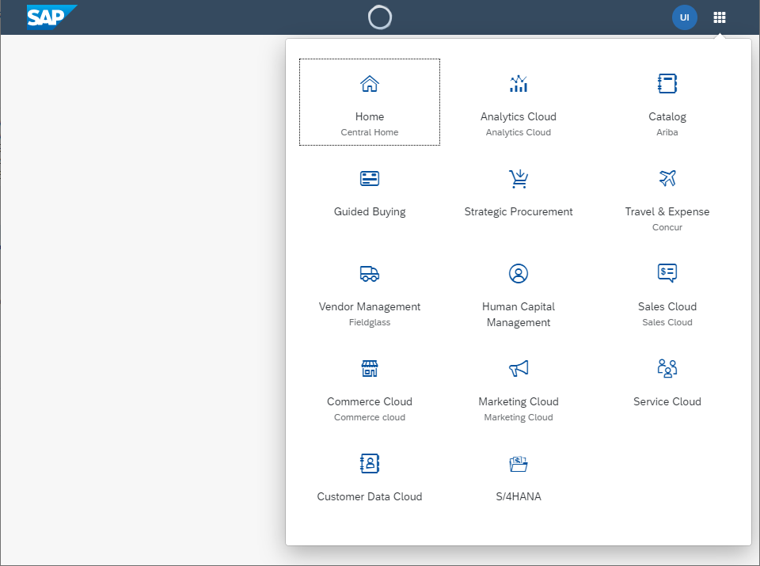

<!-- loio25e532617b7f4b9bad842757324151ed -->

# What's New in SAPUI5 1.72

With this release SAPUI5 is upgraded from version 1.71 to 1.72.

<a name="loio25e532617b7f4b9bad842757324151ed__section_yxw_pxt_zcb"/>

## New Features

<table>
<tr>
<td valign="top">

**New Theme Available for SAP Fiori 3 User Experience \(Experimental\)** 

To further support the SAP Fiori 3 user experience, a new theme has been introduced: *SAP Quartz Dark* \(theme ID: `sap_fiori_3_dark`\). The theme is provided as an additional theme in SAPUI5.

> ### Note:  
> This theme will have the status 'experimental' until testing is complete.

</td>
</tr>
<tr>
<td valign="top">

**Responsive Paddings Enablement**

We have introduced the `sap.ui.core.util.ResponsivePaddingsEnablement` utility for applying responsive paddings over separate parts of the controls, when using the SAP Quartz themes. The breakpoints and layout paddings can now be determined by the container's width, and not by the screen size. We have introduced responsive paddings to the `sap.m.Page`,`sap.m.Popover`, and `sap.m.Wizard` controls.

For more information, see [Enabling Responsive Paddings According to the Control Width](../04_Essentials/enabling-responsive-paddings-according-to-the-control-width-3b718b5.md).

</td>
</tr>
</table>

<a name="loio25e532617b7f4b9bad842757324151ed__section_bkm_s15_zcb"/>

## New Controls

<table>
<tr>
<td valign="top">

**`sap.f.ProductSwitch` \(Experimental\)**

The new layout control is a single-level navigation menu that offers access to the entry pages of products. Its items can be configured with an image/icon, title, subtitle, and navigation target.

For more information, see the [API Reference](https://ui5.sap.com/#/api/sap.f.ProductSwitch) and the [Samples](https://ui5.sap.com/#/entity/sap.f.ProductSwitch).

</td>
</tr>
</table>

<a name="loio25e532617b7f4b9bad842757324151ed__section_qwl_pb5_zcb"/>

## Improved Features

<table>
<tr>
<td valign="top">

**Navigation in Nested Components**

The navigation in nested components has been enhanced with additional information that can now be passed in optional parameters of the `navTo` method of `sap.ui.core.routing.Router`. This additional information enables the routers in nested components to show the targets which are configured to one specific route.

For more information, see [`sap.ui.core.routing.Router.navTo`](https://ui5.sap.com/#/api/sap.ui.core.routing.Router/methods/navTo) in the API Reference and [Navigate with Nested Components](../04_Essentials/navigate-with-nested-components-8e9d6e4.md).

</td>
</tr>
<tr>
<td valign="top">

**SAPUI5 OData V4 Model**

The new version of the SAPUI5 OData V4 model introduces the following features:

-   Server-driven paging is now supported unless the server-driven paging takes place in a collection requested with `$expand`.

-   The `resetChanges` method on bindings returns a promise which is resolved without a defined result as soon as all changes in the binding itself and all dependent bindings are canceled.

> ### Restriction:  
> Due to the limited feature scope of this version of the SAPUI5 OData V4 model, check that all required features are in place before developing freestyle and SAP Fiori elements applications. Double-check the detailed documentation of the features, as certain parts of a feature may be missing. While we aim to be compatible with existing controls, some controls might not work due to small incompatibilities compared to `sap.ui.model.odata.(v2.)ODataModel`, or due to missing features in the model \(such as tree binding\). This also applies to smart controls \(`sap.ui.comp` library\) that do not support the SAPUI5 OData V4 model, as well as controls such as `TreeTable` and `AnalyticalTable`, which are not supported in combination with the SAPUI5 OData V4 model. The interface for applications has been changed for easier and more efficient use of the model. For a summary of these changes, see [Changes Compared to OData V2 Model](../04_Essentials/changes-compared-to-odata-v2-model-abd4d7c.md).

For more information, see [OData V4 Model](../04_Essentials/odata-v4-model-5de13cf.md), the [API Reference](https://ui5.sap.com/#/api/sap.ui.model.odata.v4), and the [Samples](https://ui5.sap.com/#/entity/sap.ui.model.odata.v4.ODataModel).

</td>
</tr>
<tr>
<td valign="top">

**Title Alignment Changes for SAP Quartz Themes**

A new title alignment has been introduced for the SAP Quartz themes. The title of the affected control is aligned to the start position \(left or right depending on the text directionality\).

Affected Controls:

-   `sap.m.BusyDialog`
-   `sap.m.Dialog`
-   `sap.m.MessageBox`
-   `sap.m.Page`
-   `sap.m.Popover`
-   `sap.m.ResponsivePopover`
-   `sap.m.SelectDialog`
-   `sap.m.TableSelectDialog`
-   `sap.m.ViewSettingsDialog`

</td>
</tr>
</table>

<a name="loio25e532617b7f4b9bad842757324151ed__section_rqn_wd5_zcb"/>

## Improved Controls

<table>
<tr>
<td valign="top">

**`sap.f.Avatar`**

We have added more options in the `sap.f.AvatarColor` enum for the background color of the `sap.f.Avatar`: `Transparent`, `TileIcon`, and `Placeholder`. To set them, use the `backgroundColor` property.For more information, see the [Sample](https://ui5.sap.com/#/entity/sap.f.Avatar/sample/sap.f.sample.Avatar).

</td>
</tr>
<tr>
<td valign="top">

**`sap.f.FlexibleColumnLayoutSemanticHelper`**

Some methods in the helper class rely on the internal `sap.f.FlexibleColumnLayout` reference to be rendered. To facilitate their use, we have implemented two new public methods: `whenDOMReady` and `isDOMReady`. Additionally, two more abstract methods were implemented that internally wrap `isDOMReady` and `whenDOMReady`, which provide means for other similar methods to be combined, if necessary.For more information, see the [API Reference](https://ui5.sap.com/#/api/sap.f.FlexibleColumnLayoutSemanticHelper).

</td>
</tr>
<tr>
<td valign="top">

<code><b>sap.m.ActionSheet</b></code>

We have extended the `afterClose` event, to provide context information that indicates the trigger of closing the control - whether it closes with a selection, or it is dismissed. For more information, see the [API Reference](https://ui5.sap.com/#/api/sap.m.ActionSheet). 

</td>
</tr>
<tr>
<td valign="top">

**`sap.m.ComboBox`**, **`sap.m.MultiComboBox`**, **`sap.m.Input`**, **`sap.m.MultiInput`**

We have improved the controls to display the text set in the `valueStateText` property on multiple lines. This ensures that the value state text is displayed even when it is longer than the width of the control's container. For more information, see the [`sap.m.ComboBox` Sample](https://ui5.sap.com/#/entity/sap.m.ComboBox/sample/sap.m.sample.ComboBoxValueState). 

</td>
</tr>
<tr>
<td valign="top">

**`sap.m.DateRangeSelection`**

We have introduced an optional footer with *OK* and *Cancel* buttons, to provide an alternative way for users to confirm the date range selection. For more information, see the [API Reference](https://ui5.sap.com/#/api/sap.m.DateRangeSelection).

</td>
</tr>
<tr>
<td valign="top">

**`sap.m.List`, `sap.m.Table`, `sap.m.Tree`**

-   A new parameter for the direction of the `swipe` event is now available for both left-to-right \(LTR\) and right-to-left \(RTL\) scenarios. This parameter can be used in an app for approvals, for example, where a manager wants to accept or reject leave requests using the swipe function on a mobile device or touch screen. For more information, see the [API Reference](https://ui5.sap.com/#/api/sap.m.SwipeDirection) for `SwipeDirection`, the [API Reference](https://ui5.sap.com/#/api/sap.m.ListBase/events/swipe) for `swipe`, and the [Sample](https://ui5.sap.com/#/entity/sap.m.List/sample/sap.m.sample.ListSwipe).

-   A new `navigated` property is now available: After a user has displayed the details of an item, a navigation indicator at the end of the corresponding row indicates that the user has already viewed the details. For more information, see the [API Reference](https://ui5.sap.com/#/api/sap.m.ListItemBase), the [Sample](https://ui5.sap.com/#/entity/sap.m.StandardListItem) for lists, and the [Sample](https://ui5.sap.com/#/entity/sap.m.Table) for tables.

</td>
</tr>
<tr>
<td valign="top">

**`sap.m.SinglePlanningCalendar`**

The `appointmentSelect` event was also provided for the appointments in the Month view, fired when an appointment is selected. For more information, see the [API Reference](https://ui5.sap.com/#/api/sap.m.SinglePlanningCalendar).

</td>
</tr>
<tr>
<td valign="top">

**`sap.m.Table`**

If applications configure a responsive table that contains only one column in such a way that all columns are moved to the pop-in or hidden on smaller screens, this setting is now ignored to ensure that there is at least one column visible in the tabular layout. For more information, see the [API Reference](https://ui5.sap.com/#/api/sap.m.Table).

</td>
</tr>
<tr>
<td valign="top">

**`sap.m.ViewSettingsDialog`**

The *Reset* button is now fully available for all the tabs in this control.

-   For built-in tabs \(Sort, Group, and Filter\), the initial state of the Sort and Group settings is stored upon first opening. If changed, this state can be restored later using the *Reset* button and Filter tab selection is removed. If no changes have been made, the *Reset* button remains inactive.
-   For custom tabs \(or custom and built-in tabs together\), developers can use the `Reset` event. The *Reset* button is in an active state, no matter if changes are made or not.

For more information, see the [API Reference](https://ui5.sap.com/#/api/sap.m.ViewSettingsDialog).

</td>
</tr>
<tr>
<td valign="top">

<code><b>sap.m.Wizard</b></code>

We have added a new `backgroundDesign` property. It can change the background color of the content and accepts values from `sap.m.PageBackgroundDesign`. For more information, see the [Sample](https://ui5.sap.com/#/entity/sap.m.Wizard/sample/sap.m.sample.WizardCurrentStep). 

</td>
</tr>
<tr>
<td valign="top">

**`sap.ui.comp.smarttable.SmartTable`**

We have introduced new key combinations that you can use for opening the table personalization settings and for opening the *Export As* dialog for the spreadsheet export. For more information, see the FAQ under [Smart Table](../10_More_About_Controls/smart-table-bed8274.md) and the [Sample](https://ui5.sap.com/#/entity/sap.ui.comp.smarttable.SmartTable/sample/sap.ui.comp.sample.smarttable).

</td>
</tr>
<tr>
<td valign="top">

**`sap.ui.integration.widgets.Card`**

-   The predefined parameter `LOCALE` is now available, and developers can use it in data-request URL queries.
-   New `manifestReady` event has been introduced in an experimental state. It is fired after the manifest is loaded.
-   The `Refresh` method is now available in experimental state when consuming `sap.ui.integration.widgets.Card` as custom HTML element.

For more information, see [Card Explorer](https://ui5.sap.com/test-resources/sap/ui/integration/demokit/cardExplorer/index.html).

</td>
</tr>
<tr>
<td valign="top">

**`sap.ui.table.AnalyticalTable`, `sap.ui.table.Table`, `sap.ui.table.TreeTable`**

-   You can now select rows using key combinations \(select one row:  [SHIFT\] + [SPACE\] , select multiple rows:  [SHIFT\] + [UP\]  and  [SHIFT\] + [DOWN\] \). For more information, see the [Sample](https://ui5.sap.com/#/entity/sap.ui.table.Table/sample/sap.ui.table.sample.Selection).

-   A new `navigated` property is now available for rows with row actions: After a user has displayed the details of an item, a navigation indicator at the end of the corresponding row indicates that the user has already viewed the details. For more information, see the [API Reference](https://ui5.sap.com/#/api/sap.ui.table.RowSettings) and the [Sample](https://ui5.sap.com/#/entity/sap.ui.table.Table/sample/sap.ui.table.sample.RowAction).

</td>
</tr>
<tr>
<td valign="top">

**`sap.ui.unified.FileUploader`**

The new `fileEmpty` event was introduced, fired when uploading an empty file. For more information, see the [API Reference](https://ui5.sap.com/#/api/sap.m.sap.ui.unified.FileUploader).

</td>
</tr>
<tr>
<td valign="top">

**`sap.uxap.BlockBase`**

You can now subscribe to the new `viewInit` event that is fired when the asynchronously created internal view is available.For more information, see the [API Reference](https://ui5.sap.com/#/api/sap.uxap.BlockBase).

</td>
</tr>
</table>

<a name="loio25e532617b7f4b9bad842757324151ed__section_g3r_bf5_zcb"/>

## SAP Fiori Elements

<table>
<tr>
<td valign="top">

**General Features**

SAP Fiori elements now provides keyboard shortcuts for basic operations. For more information, see [Keyboard Shortcuts](../06_SAP_Fiori_Elements/keyboard-shortcuts-0cd318c.md).

**List Report and Object Page**

The object page has the following new features:

-   Messages in the message popover are now grouped according to the respective sections.

-   When creating and saving non-draft records, users stay on the object page by default. To allow users to navigate directly back to the list report, you can set the `navToListOnSave` flag to `true` in the `manifest.json`. For more information, see [Save and Navigation Options on the Object Page](../06_SAP_Fiori_Elements/save-and-navigation-options-on-the-object-page-55d81bc.md).

-   When a user navigates to the object page in display mode, the focus is now on the first emphasized action button. In create mode, the focus is now on the first editable element.

**Analytical List Page**

`Edm.String` and `sap:semantics="yearmonth"` as well as `Edm.String` and `sap:semantics="year"` are now supported in the visual filter in date-based, single selection fields in the Universal Time Coordinated \(UTC\) format. For more information, see [Visual Filter Setup](../06_SAP_Fiori_Elements/visual-filters-1714720.md).

</td>
</tr>
</table>

**Related Information**  

[What's New in SAPUI5 1.107](what-s-new-in-sapui5-1-107-b88b40e.md "With this release SAPUI5 is upgraded from version 1.106 to 1.107.")

[What's New in SAPUI5 1.106](what-s-new-in-sapui5-1-106-c70bb90.md "With this release SAPUI5 is upgraded from version 1.105 to 1.106.")

[What's New in SAPUI5 1.105](what-s-new-in-sapui5-1-105-5567dcc.md "With this release SAPUI5 is upgraded from version 1.104 to 1.105.")

[What's New in SAPUI5 1.104](what-s-new-in-sapui5-1-104-f01ebd4.md "With this release SAPUI5 is upgraded from version 1.103 to 1.104.")

[What's New in SAPUI5 1.103](what-s-new-in-sapui5-1-103-7534ae8.md "With this release SAPUI5 is upgraded from version 1.102 to 1.103.")

[What's New in SAPUI5 1.102](what-s-new-in-sapui5-1-102-b530db3.md "With this release SAPUI5 is upgraded from version 1.101 to 1.102.")

[What's New in SAPUI5 1.101](what-s-new-in-sapui5-1-101-5a18410.md "With this release SAPUI5 is upgraded from version 1.100 to 1.101.")

[What's New in SAPUI5 1.100](what-s-new-in-sapui5-1-100-5deb78f.md "With this release SAPUI5 is upgraded from version 1.99 to 1.100.")

[What's New in SAPUI5 1.99](what-s-new-in-sapui5-1-99-5e35c25.md "With this release SAPUI5 is upgraded from version 1.98 to 1.99.")

[What's New in SAPUI5 1.98](what-s-new-in-sapui5-1-98-7aacb4e.md "With this release SAPUI5 is upgraded from version 1.97 to 1.98.")

[What's New in SAPUI5 1.97](what-s-new-in-sapui5-1-97-f21858f.md "With this release SAPUI5 is upgraded from version 1.96 to 1.97.")

[What's New in SAPUI5 1.96](what-s-new-in-sapui5-1-96-b39a11b.md "With this release SAPUI5 is upgraded from version 1.95 to 1.96.")

[What's New in SAPUI5 1.95](what-s-new-in-sapui5-1-95-1b09465.md "With this release SAPUI5 is upgraded from version 1.94 to 1.95.")

[What's New in SAPUI5 1.94](what-s-new-in-sapui5-1-94-2d6ffdd.md "With this release SAPUI5 is upgraded from version 1.93 to 1.94.")

[What's New in SAPUI5 1.93](what-s-new-in-sapui5-1-93-e9c8356.md "With this release SAPUI5 is upgraded from version 1.92 to 1.93.")

[What's New in SAPUI5 1.92](what-s-new-in-sapui5-1-92-1492551.md "With this release SAPUI5 is upgraded from version 1.91 to 1.92.")

[What's New in SAPUI5 1.91](what-s-new-in-sapui5-1-91-75777da.md "With this release SAPUI5 is upgraded from version 1.90 to 1.91.")

[What's New in SAPUI5 1.90](what-s-new-in-sapui5-1-90-b475202.md "With this release SAPUI5 is upgraded from version 1.89 to 1.90.")

[What's New in SAPUI5 1.89](what-s-new-in-sapui5-1-89-0805036.md "With this release SAPUI5 is upgraded from version 1.88 to 1.89.")

[What's New in SAPUI5 1.88](what-s-new-in-sapui5-1-88-bda141b.md "With this release SAPUI5 is upgraded from version 1.87 to 1.88.")

[What's New in SAPUI5 1.87](what-s-new-in-sapui5-1-87-e315108.md "With this release SAPUI5 is upgraded from version 1.86 to 1.87.")

[What's New in SAPUI5 1.86](what-s-new-in-sapui5-1-86-067e2fb.md "With this release SAPUI5 is upgraded from version 1.85 to 1.86.")

[What's New in SAPUI5 1.85](what-s-new-in-sapui5-1-85-eeb5bd9.md "With this release SAPUI5 is upgraded from version 1.84 to 1.85.")

[What's New in SAPUI5 1.84](what-s-new-in-sapui5-1-84-ccf76b7.md "With this release SAPUI5 is upgraded from version 1.82 to 1.84.")

[What's New in SAPUI5 1.82](what-s-new-in-sapui5-1-82-f081cf0.md "With this release SAPUI5 is upgraded from version 1.81 to 1.82.")

[What's New in SAPUI5 1.81](what-s-new-in-sapui5-1-81-f71563c.md "With this release SAPUI5 is upgraded from version 1.80 to 1.81.")

[What's New in SAPUI5 1.80](what-s-new-in-sapui5-1-80-3294c68.md "With this release SAPUI5 is upgraded from version 1.79 to 1.80.")

[What's New in SAPUI5 1.79](what-s-new-in-sapui5-1-79-edf8e35.md "With this release SAPUI5 is upgraded from version 1.78 to 1.79.")

[What's New in SAPUI5 1.78](what-s-new-in-sapui5-1-78-d176be3.md "With this release SAPUI5 is upgraded from version 1.77 to 1.78.")

[What's New in SAPUI5 1.77](what-s-new-in-sapui5-1-77-2ec6b6b.md "With this release SAPUI5 is upgraded from version 1.76 to 1.77.")

[What's New in SAPUI5 1.76](what-s-new-in-sapui5-1-76-b9b0a3f.md "With this release SAPUI5 is upgraded from version 1.75 to 1.76.")

[What's New in SAPUI5 1.75](what-s-new-in-sapui5-1-75-dc3d3ce.md "With this release SAPUI5 is upgraded from version 1.74 to 1.75.")

[What's New in SAPUI5 1.74](what-s-new-in-sapui5-1-74-21fc6cb.md "With this release SAPUI5 is upgraded from version 1.73 to 1.74.")

[What's New in SAPUI5 1.73](what-s-new-in-sapui5-1-73-7b82664.md "With this release SAPUI5 is upgraded from version 1.72 to 1.73.")

[What's New in SAPUI5 1.71](what-s-new-in-sapui5-1-71-609fd01.md "With this release SAPUI5 is upgraded from version 1.70 to 1.71.")

[What's New in SAPUI5 1.70](what-s-new-in-sapui5-1-70-4e89fee.md "With this release SAPUI5 is upgraded from version 1.69 to 1.70.")

[What's New in SAPUI5 1.69](what-s-new-in-sapui5-1-69-41203fd.md "With this release SAPUI5 is upgraded from version 1.68 to 1.69.")

[What's New in SAPUI5 1.68](what-s-new-in-sapui5-1-68-5531aef.md "With this release SAPUI5 is upgraded from version 1.67 to 1.68.")

[What's New in SAPUI5 1.67](what-s-new-in-sapui5-1-67-0968958.md "With this release SAPUI5 is upgraded from version 1.66 to 1.67.")

[What's New in SAPUI5 1.66](what-s-new-in-sapui5-1-66-ebe7fda.md "With this release SAPUI5 is upgraded from version 1.65 to 1.66.")

[What's New in SAPUI5 1.65](what-s-new-in-sapui5-1-65-9d2b189.md "With this release SAPUI5 is upgraded from version 1.64 to 1.65.")

[What's New in SAPUI5 1.64](what-s-new-in-sapui5-1-64-1975e30.md "With this release SAPUI5 is upgraded from version 1.63 to 1.64.")

[What's New in SAPUI5 1.63](what-s-new-in-sapui5-1-63-77e1dcc.md "With this release SAPUI5 is upgraded from version 1.62 to 1.63.")

[What's New in SAPUI5 1.62](what-s-new-in-sapui5-1-62-27eea38.md "With this release SAPUI5 is upgraded from version 1.61 to 1.62.")

[What's New in SAPUI5 1.61](what-s-new-in-sapui5-1-61-de4d50b.md "With this release SAPUI5 is upgraded from version 1.60 to 1.61.")

[What's New in SAPUI5 1.60](what-s-new-in-sapui5-1-60-2a70354.md "With this release SAPUI5 is upgraded from version 1.58 to 1.60.")

[What's New in SAPUI5 1.58](what-s-new-in-sapui5-1-58-b28edde.md "With this release, SAPUI5 is upgraded from version 1.56 to 1.58.")

[What's New in SAPUI5 1.56](what-s-new-in-sapui5-1-56-53b4b5e.md "With this release, SAPUI5 is upgraded from version 1.54 to 1.56.")

[What's New in SAPUI5 1.54](what-s-new-in-sapui5-1-54-f29023e.md "With this release, SAPUI5 is upgraded from version 1.52 to 1.54.")

[What's New in SAPUI5 1.52](what-s-new-in-sapui5-1-52-a09dd79.md "With this release, SAPUI5 is upgraded from version 1.50 to 1.52.")

[What's New in SAPUI5 1.50](what-s-new-in-sapui5-1-50-a844984.md "With this release, SAPUI5 is upgraded from version 1.48 to 1.50.")

[What's New in SAPUI5 1.48](what-s-new-in-sapui5-1-48-2818f80.md "With this release, SAPUI5 is upgraded from version 1.46 to 1.48.")

[What's New in SAPUI5 1.46](what-s-new-in-sapui5-1-46-4cf0986.md "With this release, SAPUI5 is upgraded from version 1.44 to 1.46.")

[What's New in SAPUI5 1.44](what-s-new-in-sapui5-1-44-05ce1dc.md "With this release, SAPUI5 is upgraded from version 1.42 to 1.44.")

[What's New in SAPUI5 1.42](what-s-new-in-sapui5-1-42-4768f1a.md "With this release, SAPUI5 is upgraded from version 1.40 to 1.42.")

[What's New in SAPUI5 1.40](what-s-new-in-sapui5-1-40-e659bd2.md "With this release, SAPUI5 is upgraded from version 1.38 to 1.40.")

[What's New in SAPUI5 1.38](what-s-new-in-sapui5-1-38-6a875f9.md#loio6a875f998994489483e8085705347d72 "With this release, SAPUI5 is upgraded from version 1.36 to 1.38.")

