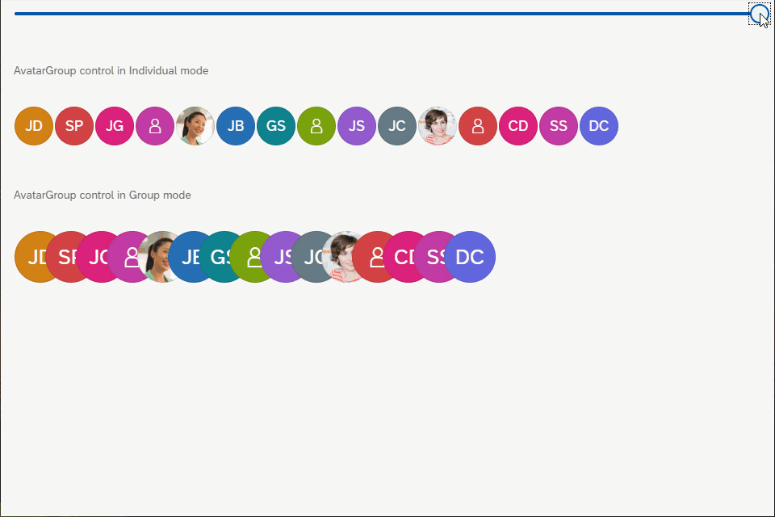

<!-- loio231dd13787ca4d5c8fd976b0f2fbe82b -->

# What's New in SAPUI5 1.73

With this release SAPUI5 is upgraded from version 1.72 to 1.73.

****

<table>
<tr>
<th valign="top">

Version

</th>
<th valign="top">

Type

</th>
<th valign="top">

Category

</th>
<th valign="top">

Title

</th>
<th valign="top">

Description

</th>
<th valign="top">

Action

</th>
<th valign="top">

Available as of

</th>
</tr>
<tr>
<td valign="top">

1.73 

</td>
<td valign="top">

New 

</td>
<td valign="top">

Control 

</td>
<td valign="top">

**`sap.f.AvatarGroup` \(Experimental\)** 

</td>
<td valign="top">

**`sap.f.AvatarGroup` \(Experimental\)**

`AvatarGroup` is used to display a group of related avatars, arranged horizontally. The control allows you to display the avatars in different sizes, depending on your use case. Two group types are available: `Group` and `Individual`.

For more information, see the [API Reference](https://ui5.sap.com/#/api/sap.f.AvatarGroup) and the [Samples](https://ui5.sap.com/#/entity/sap.f.AvatarGroup).

New•Control•Info Only•1.73

</td>
<td valign="top">

Info Only

</td>
<td valign="top">

2019-12-05

</td>
</tr>
<tr>
<td valign="top">

1.73 

</td>
<td valign="top">

Deprecated 

</td>
<td valign="top">

Feature 

</td>
<td valign="top">

**Alternatives for the SAPUI5 Tools for Eclipse** 

</td>
<td valign="top">

**Alternatives for the SAPUI5 Tools for Eclipse**

As we have announced with SAPUI5 version 1.71, the SAPUI5 Tools for Eclipse are no longer updated. We have removed the corresponding documentation from the SAPUI5 documentation with version 1.73. To find out more about recommended alternatives, please read our blog post: [SAPUI5 Tools for Eclipse - Now Is the Time to Look for Alternatives](https://blogs.sap.com/sapui5-tools-for-eclipse-now-is-the-time-to-look-for-alternatives/).

Deprecated•Feature•Info Only•1.73

</td>
<td valign="top">

Info Only 

</td>
<td valign="top">

2019-12-05

</td>
</tr>
<tr>
<td valign="top">

1.73 

</td>
<td valign="top">

Changed 

</td>
<td valign="top">

Feature 

</td>
<td valign="top">

**Export Functions** 

</td>
<td valign="top">

**Export Functions**

The `sap.ui.core.util.Export` class has been deprecated. To use export functions, `sap.ui.export.Spreadsheet` is available.

For more information, see [Spreadsheet Export](../04_Essentials/spreadsheet-export-2691788.md), the [API Reference](https://ui5.sap.com/#/api/sap.ui.export.Spreadsheet), and the [Samples](https://ui5.sap.com/#/entity/sap.ui.export.Spreadsheet).

Changed•Feature•Info Only•1.73

</td>
<td valign="top">

Info Only 

</td>
<td valign="top">

2019-12-05

</td>
</tr>
<tr>
<td valign="top">

1.73 

</td>
<td valign="top">

Changed 

</td>
<td valign="top">

Feature 

</td>
<td valign="top">

**SAPUI5 OData V4 Model** 

</td>
<td valign="top">

**SAPUI5 OData V4 Model**

The new version of the SAPUI5 OData V4 model introduces the following features:

-   Binding of operation parameters as described in [OData Operations](../04_Essentials/odata-operations-b54f789.md) in the SAPUI5 documentation.

-   Methods for finding bindings that have become public:

    -   `sap.ui.model.odata.v4.ODataModel#getAllBindings`
    -   `sap.ui.model.Binding#getPath` 
    -   `sap.ui.model.Binding#getContext`
    -   `sap.ui.model.Binding#getModel`

> ### Restriction:  
> Due to the limited feature scope of this version of the SAPUI5 OData V4 model, check that all required features are in place before developing applications. Double-check the detailed documentation of the features, as certain parts of a feature may be missing. While we aim to be compatible with existing controls, some controls might not work due to small incompatibilities compared to `sap.ui.model.odata.(v2.)ODataModel`, or due to missing features in the model \(such as tree binding\). This also applies to smart controls \(`sap.ui.comp` library\) that do not support the SAPUI5 OData V4 model, as well as controls such as `TreeTable` and `AnalyticalTable`, which are not supported in combination with the SAPUI5 OData V4 model. The interface for applications has been changed for easier and more efficient use of the model. For a summary of these changes, see [Changes Compared to OData V2 Model](../04_Essentials/changes-compared-to-odata-v2-model-abd4d7c.md).

For more information, see [OData V4 Model](../04_Essentials/odata-v4-model-5de13cf.md), the [API Reference](https://ui5.sap.com/#/api/sap.ui.model.odata.v4), and the [Samples](https://ui5.sap.com/#/entity/sap.ui.model.odata.v4.ODataModel).

Changed•Feature•Info Only•1.73

</td>
<td valign="top">

Info Only 

</td>
<td valign="top">

2019-12-05

</td>
</tr>
<tr>
<td valign="top">

1.73 

</td>
<td valign="top">

Changed 

</td>
<td valign="top">

Control 

</td>
<td valign="top">

**`sap.f.semantic.SemanticPage`** 

</td>
<td valign="top">

**`sap.f.semantic.SemanticPage`**

The `fitContent` property of the `sap.f.DynamicPage` control is now also exposed in `sap.f.semantic.SemanticPage`. It's used to optimize the responsiveness and behavior of the control and we recommend using this property when displaying content of adaptive controls that stretch to fill the available space.For more information, see the [API Reference](https://ui5.sap.com/#/api/sap.f.semantic.SemanticPage).

Changed•Control•Info Only•1.73

</td>
<td valign="top">

Info Only 

</td>
<td valign="top">

2019-12-05

</td>
</tr>
<tr>
<td valign="top">

1.73 

</td>
<td valign="top">

Changed 

</td>
<td valign="top">

Control 

</td>
<td valign="top">

**`sap.m.Button`** 

</td>
<td valign="top">

**`sap.m.Button`**

Four new button types were introduced in the `sap.m.ButtonType` enum. Designed as message triggering buttons, use them to open `sap.m.MessagePopover`. Each button type has a dedicated meaning.

-   Critical
-   Negative
-   Success
-   Neutral

For more information, see the [API Reference](https://ui5.sap.com/#/api/sap.m.ButtonType).

Changed•Control•Info Only•1.73

</td>
<td valign="top">

Info Only 

</td>
<td valign="top">

2019-12-05

</td>
</tr>
<tr>
<td valign="top">

1.73 

</td>
<td valign="top">

Changed 

</td>
<td valign="top">

Control 

</td>
<td valign="top">

**`sap.m.ComboBox`, `sap.m.MultiComboBox`** 

</td>
<td valign="top">

**`sap.m.ComboBox`, `sap.m.MultiComboBox`**

We have updated the behavior of the `showItems` method. When the control's picker is opened, the dropdown arrow is not in pressed state, as it was previously. Now, pressing the dropdown arrow for the first time opens the control's picker with all items, and with the second press the picker is closed. For more information, see the [API Reference](https://ui5.sap.com/#/api/sap.m.ComboBoxBase).

Changed•Control•Info Only•1.73

</td>
<td valign="top">

Info Only 

</td>
<td valign="top">

2019-12-05

</td>
</tr>
<tr>
<td valign="top">

1.73 

</td>
<td valign="top">

Changed 

</td>
<td valign="top">

Control 

</td>
<td valign="top">

**`sap.m.Dialog`** 

</td>
<td valign="top">

**`sap.m.Dialog`**

We have enabled responsive padding support. Application developers can now configure `sap.m.Dialog` and enable its responsive padding in the SAP Fiori 3 themes.

For more information, see [Enabling Responsive Paddings According to the Control Width](../04_Essentials/enabling-responsive-paddings-according-to-the-control-width-3b718b5.md).

Changed•Control•Info Only•1.73

</td>
<td valign="top">

Info Only 

</td>
<td valign="top">

2019-12-05

</td>
</tr>
<tr>
<td valign="top">

1.73 

</td>
<td valign="top">

Changed 

</td>
<td valign="top">

Control 

</td>
<td valign="top">

**`sap.m.Input`** 

</td>
<td valign="top">

**`sap.m.Input`**

A `change` event is now fired when the browser autofill fills an input.

> ### Note:  
> If `showValueHelp` or `showSuggestion` are set to `true`, the native browser autofill will not fire a `change` event.

For more information, see the [API Reference](https://ui5.sap.com/#/api/sap.m.Input). 

Changed•Control•Info Only•1.73

</td>
<td valign="top">

Info Only 

</td>
<td valign="top">

2019-12-05

</td>
</tr>
<tr>
<td valign="top">

1.73 

</td>
<td valign="top">

Changed 

</td>
<td valign="top">

Control 

</td>
<td valign="top">

**`sap.m.Label`** 

</td>
<td valign="top">

**`sap.m.Label`**

A visual change was introduced for the `sap.m.Label` control to align it with SAP Fiori Design Guidelines. The asterisk is now positioned on the right side of the text. For more information, see the [API Reference](https://ui5.sap.com/#/api/sap.m.Label) and the [Sample](https://ui5.sap.com/#/entity/sap.m.Label/sample/sap.m.sample.Label).

Changed•Control•Info Only•1.73

</td>
<td valign="top">

Info Only 

</td>
<td valign="top">

2019-12-05

</td>
</tr>
<tr>
<td valign="top">

1.73 

</td>
<td valign="top">

Changed 

</td>
<td valign="top">

Control 

</td>
<td valign="top">

**`sap.m.list`, `sap.m.StandardListItem`** 

</td>
<td valign="top">

**`sap.m.list`, `sap.m.StandardListItem`**

The usability of the additional information text and its combination with title and description has been improved for these controls. The information text is no longer truncated if it is shorter than or equal to the character limit predefined by the control. For more information, see the [Card Explorer](https://ui5.sap.com/test-resources/sap/ui/integration/demokit/cardExplorer/webapp/index.html#/explore/list/numeric).

Changed•Control•Info Only•1.73

</td>
<td valign="top">

Info Only 

</td>
<td valign="top">

2019-12-05

</td>
</tr>
<tr>
<td valign="top">

1.73 

</td>
<td valign="top">

Changed 

</td>
<td valign="top">

Control 

</td>
<td valign="top">

**`sap.m.MessagePopover`** 

</td>
<td valign="top">

**`sap.m.MessagePopover`**

We have exposed the `groupItems` property and `navigateBack` function as APIs in the control. Using the `navigateBack` function you can navigate back to the list page, and with the `groupItems` property you can configure whether or not items should be grouped. For more information, see the [API Reference](https://ui5.sap.com/#/api/sap.m.MessagePopover). 

Changed•Control•Info Only•1.73

</td>
<td valign="top">

Info Only 

</td>
<td valign="top">

2019-12-05

</td>
</tr>
<tr>
<td valign="top">

1.73 

</td>
<td valign="top">

Changed 

</td>
<td valign="top">

Control 

</td>
<td valign="top">

**`sap.m.NotificationListItem`, `sap.m.NotificationListGroup`** 

</td>
<td valign="top">

**`sap.m.NotificationListItem`, `sap.m.NotificationListGroup`**

We have redesigned the notifications, and now they are lighter, easy to use, and aligned with the SAP Fiori 3 user experience. The changes include:

-   The priority of the notifications is now visualized with a status icon.
-   Action buttons in the `sap.m.OverflowToolbar` could now be hidden.
-   Collapse/expand functionality of the `sap.m.NotificationListGroup` is implemented with an arrow button instead of text.
-   For the `sap.m.NotificationListGroup`, we have enabled an item counter, which represents the count of currently loaded items inside this group. It can be visible or hidden using the new `showItemsCounter` property.
-   The new `authorInitials` property is now introduced for `sap.m.NotificationListItem`. It is visualized as an avatar, and used as a fallback when the `authorPicture` is not provided. The background color of the avatar is chosen randomly.

For more information, see the [API Reference](https://ui5.sap.com/#/api/sap.m.NotificationListGroup) and the [Samples](https://ui5.sap.com/#/entity/sap.m.NotificationListGroup). 

Changed•Control•Info Only•1.73

</td>
<td valign="top">

Info Only 

</td>
<td valign="top">

2019-12-05

</td>
</tr>
<tr>
<td valign="top">

1.73 

</td>
<td valign="top">

Changed 

</td>
<td valign="top">

Control 

</td>
<td valign="top">

**`sap.m.NumericContent`** 

</td>
<td valign="top">

**`sap.m.NumericContent`**

A new `adaptiveFontSize` property is now introduced to meet different country/locale requirements according to the Unicode Common Locale Data Repository \(CLDR\). For more information, see the [API Reference](https://ui5.sap.com/#/api/sap.m.NumericContent) and [CLDR](http://cldr.unicode.org/).

Changed•Control•Info Only•1.73

</td>
<td valign="top">

Info Only 

</td>
<td valign="top">

2019-12-05

</td>
</tr>
<tr>
<td valign="top">

1.73 

</td>
<td valign="top">

Changed 

</td>
<td valign="top">

Control 

</td>
<td valign="top">

**`sap.m.PlanningCalendar`** 

</td>
<td valign="top">

**`sap.m.PlanningCalendar`**

We have added a new `headerId` parameter to the `rowHeaderClick` event, which enables developers to directly access row header by ID.

> ### Note:  
> Do not use this feature for `PlanningCalendar`’s `rowHeader` modification.

For more information, see the [API Reference](https://ui5.sap.com/#/api/sap.m.PlanningCalendar).

Changed•Control•Info Only•1.73

</td>
<td valign="top">

Info Only 

</td>
<td valign="top">

2019-12-05

</td>
</tr>
<tr>
<td valign="top">

1.73 

</td>
<td valign="top">

Changed 

</td>
<td valign="top">

Control 

</td>
<td valign="top">

**`sap.m.ProgressIndicator`** 

</td>
<td valign="top">

**`sap.m.ProgressIndicator`**

With the new `displayAnimation` property, you can now determine whether a percentage change is displayed with or without animation.For more information, see the [API Reference](https://ui5.sap.com/#/api/sap.m.ProgressIndicator) and the [Sample](https://ui5.sap.com/#/entity/sap.m.ProgressIndicator/sample/sap.m.sample.ProgressIndicator).

Changed•Control•Info Only•1.73

</td>
<td valign="top">

Info Only 

</td>
<td valign="top">

2019-12-05

</td>
</tr>
<tr>
<td valign="top">

1.73 

</td>
<td valign="top">

Changed 

</td>
<td valign="top">

Control 

</td>
<td valign="top">

**`sap.ui.comp.SmartField`, `sap.ui.comp.SmartFilterBar`, `sap.ui.comp.SmartTable`** 

</td>
<td valign="top">

**`sap.ui.comp.SmartField`, `sap.ui.comp.SmartFilterBar`, `sap.ui.comp.SmartTable`**

You can now search for empty strings for dates of type `Edm.DateTime`, `Edm.DateTimeOffset`, and `StringDate`, for example, in the value help or the personalization dialog.

Changed•Control•Info Only•1.73

</td>
<td valign="top">

Info Only 

</td>
<td valign="top">

2019-12-05

</td>
</tr>
<tr>
<td valign="top">

1.73 

</td>
<td valign="top">

Changed 

</td>
<td valign="top">

Control 

</td>
<td valign="top">

**`sap.ui.integration.widgets.Card`** 

</td>
<td valign="top">

**`sap.ui.integration.widgets.Card`**

-   We have improved the support for the relative date ranges. This allows the card developers to use date ranges, such as `lastYear` or `nextQuarter` inside the card's manifest. Such automatically calculated date ranges can be used in data requests or other card attributes. For more information, see [Integration Card Date Range Handling](https://ui5.sap.com/test-resources/sap/ui/integration/demokit/cardExplorer/webapp/index.html#/learn/featureDateRangeHandling) in the Card Explorer.
-   We have added a new `format` namespace to hold formatters used in expression bindings, and added a predefined `date` formatter method to it. For more information, see the [Sample](https://ui5.sap.com/test-resources/sap/ui/integration/demokit/cardExplorer/webapp/index.html#/explore/dateAndTime) in the Card Explorer.
-   The custom HTML element to consume cards on any web page is refactored. Now, height and width are specified in the standard CSS syntax and no longer as separate tag attributes. For more information, see the [Sample](https://ui5.sap.com/test-resources/sap/ui/integration/demokit/cardExplorer/webapp/index.html#/explore/htmlConsumption) in the Card Explorer.

Changed•Control•Info Only•1.73

</td>
<td valign="top">

Info Only 

</td>
<td valign="top">

2019-12-05

</td>
</tr>
<tr>
<td valign="top">

1.73 

</td>
<td valign="top">

Changed 

</td>
<td valign="top">

Control 

</td>
<td valign="top">

**`sap.ui.layout.cssgrid.ResponsiveColumnLayout`** 

</td>
<td valign="top">

**`sap.ui.layout.cssgrid.ResponsiveColumnLayout`**

This control now also supports Microsoft Internet Explorer 11, due to the implemented polyfill. For more information, see the [API Reference](https://ui5.sap.com/#/api/sap.ui.layout.cssgrid.CSSGrid) and the [Sample](https://ui5.sap.com/#/entity/sap.ui.layout.cssgrid.CSSGrid/sample/sap.ui.layout.sample.GridResponsiveColumnLayout).

Changed•Control•Info Only•1.73

</td>
<td valign="top">

Info Only 

</td>
<td valign="top">

2019-12-05

</td>
</tr>
<tr>
<td valign="top">

1.73 

</td>
<td valign="top">

Changed 

</td>
<td valign="top">

Control 

</td>
<td valign="top">

**`sap.ui.table.AnalyticalTable`, `sap.ui.table.Table`, `sap.ui.table.TreeTable`** 

</td>
<td valign="top">

**`sap.ui.table.AnalyticalTable`, `sap.ui.table.Table`, `sap.ui.table.TreeTable`**

The `navigated` property that was introduced in version 1.72 is now also available for these controls \(if no row actions are available\). The property shows a navigation indicator at the end of a row to indicate that the user has either already navigated to further details or can navigate to further details from the item, depending on the application use case. For more information, see the [API Reference](https://ui5.sap.com/#/api/sap.ui.table.RowSettings) and the [Sample](https://ui5.sap.com/#/entity/sap.ui.table.Table/sample/sap.ui.table.sample.RowAction).

Changed•Control•Info Only•1.73

</td>
<td valign="top">

Info Only 

</td>
<td valign="top">

2019-12-05

</td>
</tr>
<tr>
<td valign="top">

1.73 

</td>
<td valign="top">

Changed 

</td>
<td valign="top">

Control 

</td>
<td valign="top">

**`sap.uxap.ObjectPageHeader`** 

</td>
<td valign="top">

**`sap.uxap.ObjectPageHeader`**

With the new `objectImageBackgroundColor` property, you can now determine the background color of the icon or the image placeholder used in the `sap.uxap.ObjectPageHeader`.For more information, see the [API Reference](https://ui5.sap.com/#/api/sap.uxap.ObjectPageHeader) and the [Sample](https://ui5.sap.com/#/entity/sap.uxap.ObjectPageLayout/sample/sap.uxap.sample.ObjectPageHeaderContentPriorities).

Changed•Control•Info Only•1.73

</td>
<td valign="top">

Info Only 

</td>
<td valign="top">

2019-12-05

</td>
</tr>
<tr>
<td valign="top">

1.73 

</td>
<td valign="top">

Changed 

</td>
<td valign="top">

Control 

</td>
<td valign="top">

**`sap.uxap.ObjectPageLayout`** 

</td>
<td valign="top">

**`sap.uxap.ObjectPageLayout`**

With the new `sectionChange` event, you can identify when the page is scrolled to a specific section. The `section` and `subSection` event parameters are provided when the event is fired.For more information, see the [API Reference](https://ui5.sap.com/#/api/sap.uxap.ObjectPageLayout).

Changed•Control•Info Only•1.73

</td>
<td valign="top">

Info Only 

</td>
<td valign="top">

2019-12-05

</td>
</tr>
<tr>
<td valign="top">

1.73 

</td>
<td valign="top">

New 

</td>
<td valign="top">

Feature 

</td>
<td valign="top">

**Demo Kit Search Highlighting** 

</td>
<td valign="top">

**Demo Kit Search Highlighting**

You can now easily find the results you're interested in with the new search highlighting functionality that we implemented for the *Search Results* page and the *API Reference* tree filter.

New•Feature•Info Only•1.73

</td>
<td valign="top">

Info Only 

</td>
<td valign="top">

2019-12-05

</td>
</tr>
</table>

**Related Information**  

[What's New in SAPUI5 1.130](what-s-new-in-sapui5-1-130-85609d4.md "With this release SAPUI5 is upgraded from version 1.129 to 1.130.")

[What's New in SAPUI5 1.129](what-s-new-in-sapui5-1-129-d22b8af.md "With this release SAPUI5 is upgraded from version 1.128 to 1.129.")

[What's New in SAPUI5 1.128](what-s-new-in-sapui5-1-128-1f76220.md "With this release SAPUI5 is upgraded from version 1.127 to 1.128.")

[What's New in SAPUI5 1.127](what-s-new-in-sapui5-1-127-e5e1317.md "With this release SAPUI5 is upgraded from version 1.126 to 1.127.")

[What's New in SAPUI5 1.126](what-s-new-in-sapui5-1-126-1d98116.md "With this release SAPUI5 is upgraded from version 1.125 to 1.126.")

[What's New in SAPUI5 1.125](what-s-new-in-sapui5-1-125-9d87044.md "With this release SAPUI5 is upgraded from version 1.124 to 1.125.")

[What's New in SAPUI5 1.124](what-s-new-in-sapui5-1-124-7f77c3f.md "With this release SAPUI5 is upgraded from version 1.123 to 1.124.")

[What's New in SAPUI5 1.123](what-s-new-in-sapui5-1-123-9d00ac7.md "With this release SAPUI5 is upgraded from version 1.122 to 1.123.")

[What's New in SAPUI5 1.122](what-s-new-in-sapui5-1-122-5d078da.md "With this release SAPUI5 is upgraded from version 1.121 to 1.122.")

[What's New in SAPUI5 1.121](what-s-new-in-sapui5-1-121-91a4a2f.md "With this release SAPUI5 is upgraded from version 1.120 to 1.121.")

[What's New in SAPUI5 1.120](what-s-new-in-sapui5-1-120-2359b63.md "With this release SAPUI5 is upgraded from version 1.119 to 1.120.")

[What's New in SAPUI5 1.119](what-s-new-in-sapui5-1-119-0b1903a.md "With this release SAPUI5 is upgraded from version 1.118 to 1.119.")

[What's New in SAPUI5 1.118](what-s-new-in-sapui5-1-118-3eecbde.md "With this release SAPUI5 is upgraded from version 1.117 to 1.118.")

[What's New in SAPUI5 1.117](what-s-new-in-sapui5-1-117-029d3b4.md "With this release SAPUI5 is upgraded from version 1.116 to 1.117.")

[What's New in SAPUI5 1.116](what-s-new-in-sapui5-1-116-ebd6f34.md "With this release SAPUI5 is upgraded from version 1.115 to 1.116.")

[What's New in SAPUI5 1.115](what-s-new-in-sapui5-1-115-409fde8.md "With this release SAPUI5 is upgraded from version 1.114 to 1.115.")

[What's New in SAPUI5 1.114](what-s-new-in-sapui5-1-114-890fce1.md "With this release SAPUI5 is upgraded from version 1.113 to 1.114.")

[What's New in SAPUI5 1.113](what-s-new-in-sapui5-1-113-a9553fe.md "With this release SAPUI5 is upgraded from version 1.112 to 1.113.")

[What's New in SAPUI5 1.112](what-s-new-in-sapui5-1-112-34afc69.md "With this release SAPUI5 is upgraded from version 1.111 to 1.112.")

[What's New in SAPUI5 1.111](what-s-new-in-sapui5-1-111-7a67837.md "With this release SAPUI5 is upgraded from version 1.110 to 1.111.")

[What's New in SAPUI5 1.110](what-s-new-in-sapui5-1-110-71a855c.md "With this release SAPUI5 is upgraded from version 1.109 to 1.110.")

[What's New in SAPUI5 1.109](what-s-new-in-sapui5-1-109-3264bd2.md "With this release SAPUI5 is upgraded from version 1.108 to 1.109.")

[What's New in SAPUI5 1.108](what-s-new-in-sapui5-1-108-66e33f0.md "With this release SAPUI5 is upgraded from version 1.107 to 1.108.")

[What's New in SAPUI5 1.107](what-s-new-in-sapui5-1-107-d4ff916.md "With this release SAPUI5 is upgraded from version 1.106 to 1.107.")

[What's New in SAPUI5 1.106](what-s-new-in-sapui5-1-106-5b497b0.md "With this release SAPUI5 is upgraded from version 1.105 to 1.106.")

[What's New in SAPUI5 1.105](what-s-new-in-sapui5-1-105-4d6c00e.md "With this release SAPUI5 is upgraded from version 1.104 to 1.105.")

[What's New in SAPUI5 1.104](what-s-new-in-sapui5-1-104-69e567c.md "With this release SAPUI5 is upgraded from version 1.103 to 1.104.")

[What's New in SAPUI5 1.103](what-s-new-in-sapui5-1-103-0e98c76.md "With this release SAPUI5 is upgraded from version 1.102 to 1.103.")

[What's New in SAPUI5 1.102](what-s-new-in-sapui5-1-102-f038c99.md "With this release SAPUI5 is upgraded from version 1.101 to 1.102.")

[What's New in SAPUI5 1.101](what-s-new-in-sapui5-1-101-7733b00.md "With this release SAPUI5 is upgraded from version 1.100 to 1.101.")

[What's New in SAPUI5 1.100](what-s-new-in-sapui5-1-100-27dec1d.md "With this release SAPUI5 is upgraded from version 1.99 to 1.100.")

[What's New in SAPUI5 1.99](what-s-new-in-sapui5-1-99-4f35848.md "With this release SAPUI5 is upgraded from version 1.98 to 1.99.")

[What's New in SAPUI5 1.98](what-s-new-in-sapui5-1-98-d9f16f2.md "With this release SAPUI5 is upgraded from version 1.97 to 1.98.")

[What's New in SAPUI5 1.97](what-s-new-in-sapui5-1-97-fa0e282.md "With this release SAPUI5 is upgraded from version 1.96 to 1.97.")

[What's New in SAPUI5 1.96](what-s-new-in-sapui5-1-96-7a9269f.md "With this release SAPUI5 is upgraded from version 1.95 to 1.96.")

[What's New in SAPUI5 1.95](what-s-new-in-sapui5-1-95-a1aea67.md "With this release SAPUI5 is upgraded from version 1.94 to 1.95.")

[What's New in SAPUI5 1.94](what-s-new-in-sapui5-1-94-c40f1e6.md "With this release SAPUI5 is upgraded from version 1.93 to 1.94.")

[What's New in SAPUI5 1.93](what-s-new-in-sapui5-1-93-f273340.md "With this release SAPUI5 is upgraded from version 1.92 to 1.93.")

[What's New in SAPUI5 1.92](what-s-new-in-sapui5-1-92-1ef345d.md "With this release SAPUI5 is upgraded from version 1.91 to 1.92.")

[What's New in SAPUI5 1.91](what-s-new-in-sapui5-1-91-0a2bd79.md "With this release SAPUI5 is upgraded from version 1.90 to 1.91.")

[What's New in SAPUI5 1.90](what-s-new-in-sapui5-1-90-91c10c2.md "With this release SAPUI5 is upgraded from version 1.89 to 1.90.")

[What's New in SAPUI5 1.89](what-s-new-in-sapui5-1-89-e56cddc.md "With this release SAPUI5 is upgraded from version 1.88 to 1.89.")

[What's New in SAPUI5 1.88](what-s-new-in-sapui5-1-88-e15a206.md "With this release SAPUI5 is upgraded from version 1.87 to 1.88.")

[What's New in SAPUI5 1.87](what-s-new-in-sapui5-1-87-b506da7.md "With this release SAPUI5 is upgraded from version 1.86 to 1.87.")

[What's New in SAPUI5 1.86](what-s-new-in-sapui5-1-86-4c1c959.md "With this release SAPUI5 is upgraded from version 1.85 to 1.86.")

[What's New in SAPUI5 1.85](what-s-new-in-sapui5-1-85-1d18eb5.md "With this release SAPUI5 is upgraded from version 1.84 to 1.85.")

[What's New in SAPUI5 1.84](what-s-new-in-sapui5-1-84-dc76640.md "With this release SAPUI5 is upgraded from version 1.82 to 1.84.")

[What's New in SAPUI5 1.82](what-s-new-in-sapui5-1-82-3a8dd13.md "With this release SAPUI5 is upgraded from version 1.81 to 1.82.")

[What's New in SAPUI5 1.81](what-s-new-in-sapui5-1-81-f5e2a21.md "With this release SAPUI5 is upgraded from version 1.80 to 1.81.")

[What's New in SAPUI5 1.80](what-s-new-in-sapui5-1-80-8cee506.md "With this release SAPUI5 is upgraded from version 1.79 to 1.80.")

[What's New in SAPUI5 1.79](what-s-new-in-sapui5-1-79-99c4cdc.md "With this release SAPUI5 is upgraded from version 1.78 to 1.79.")

[What's New in SAPUI5 1.78](what-s-new-in-sapui5-1-78-f09b63e.md "With this release SAPUI5 is upgraded from version 1.77 to 1.78.")

[What's New in SAPUI5 1.77](what-s-new-in-sapui5-1-77-c46b439.md "With this release SAPUI5 is upgraded from version 1.76 to 1.77.")

[What's New in SAPUI5 1.76](what-s-new-in-sapui5-1-76-aad03b5.md "With this release SAPUI5 is upgraded from version 1.75 to 1.76.")

[What's New in SAPUI5 1.75](what-s-new-in-sapui5-1-75-5cbb62d.md "With this release SAPUI5 is upgraded from version 1.74 to 1.75.")

[What's New in SAPUI5 1.74](what-s-new-in-sapui5-1-74-c22208a.md "With this release SAPUI5 is upgraded from version 1.73 to 1.74.")

[What's New in SAPUI5 1.72](what-s-new-in-sapui5-1-72-521cad9.md "With this release SAPUI5 is upgraded from version 1.71 to 1.72.")

[What's New in SAPUI5 1.71](what-s-new-in-sapui5-1-71-a93a6a3.md "With this release SAPUI5 is upgraded from version 1.70 to 1.71.")

[What's New in SAPUI5 1.70](what-s-new-in-sapui5-1-70-f073d69.md "With this release SAPUI5 is upgraded from version 1.69 to 1.70.")

[What's New in SAPUI5 1.69](what-s-new-in-sapui5-1-69-89a18bd.md "With this release SAPUI5 is upgraded from version 1.68 to 1.69.")

[What's New in SAPUI5 1.68](what-s-new-in-sapui5-1-68-f94bf93.md "With this release SAPUI5 is upgraded from version 1.67 to 1.68.")

[What's New in SAPUI5 1.67](what-s-new-in-sapui5-1-67-a6b1472.md "With this release SAPUI5 is upgraded from version 1.66 to 1.67.")

[What's New in SAPUI5 1.66](what-s-new-in-sapui5-1-66-c9896e9.md "With this release SAPUI5 is upgraded from version 1.65 to 1.66.")

[What's New in SAPUI5 1.65](what-s-new-in-sapui5-1-65-0f5acfd.md "With this release SAPUI5 is upgraded from version 1.64 to 1.65.")

[What's New in SAPUI5 1.64](what-s-new-in-sapui5-1-64-0e30822.md "With this release SAPUI5 is upgraded from version 1.63 to 1.64.")

[What's New in SAPUI5 1.63](what-s-new-in-sapui5-1-63-e8d9da7.md "With this release SAPUI5 is upgraded from version 1.62 to 1.63.")

[What's New in SAPUI5 1.62](what-s-new-in-sapui5-1-62-771f4d5.md "With this release SAPUI5 is upgraded from version 1.61 to 1.62.")

[What's New in SAPUI5 1.61](what-s-new-in-sapui5-1-61-d991552.md "With this release SAPUI5 is upgraded from version 1.60 to 1.61.")

[What's New in SAPUI5 1.60](what-s-new-in-sapui5-1-60-5a0e1f7.md "With this release SAPUI5 is upgraded from version 1.58 to 1.60.")

[What's New in SAPUI5 1.58](what-s-new-in-sapui5-1-58-7c927aa.md "With this release SAPUI5 is upgraded from version 1.56 to 1.58.")

[What's New in SAPUI5 1.56](what-s-new-in-sapui5-1-56-108b7fd.md "With this release SAPUI5 is upgraded from version 1.54 to 1.56.")

[What's New in SAPUI5 1.54](what-s-new-in-sapui5-1-54-c838330.md "With this release SAPUI5 is upgraded from version 1.52 to 1.54.")

[What's New in SAPUI5 1.52](what-s-new-in-sapui5-1-52-849e1b6.md "With this release SAPUI5 is upgraded from version 1.50 to 1.52.")

[What's New in SAPUI5 1.50](what-s-new-in-sapui5-1-50-759e9f3.md "With this release SAPUI5 is upgraded from version 1.48 to 1.50.")

[What's New in SAPUI5 1.48](what-s-new-in-sapui5-1-48-fa1efac.md "With this release SAPUI5 is upgraded from version 1.46 to 1.48.")

[What's New in SAPUI5 1.46](what-s-new-in-sapui5-1-46-6307539.md "With this release SAPUI5 is upgraded from version 1.44 to 1.46.")

[What's New in SAPUI5 1.44](what-s-new-in-sapui5-1-44-a0cb7a0.md "With this release SAPUI5 is upgraded from version 1.42 to 1.44.")

[What's New in SAPUI5 1.42](what-s-new-in-sapui5-1-42-468b05d.md "With this release SAPUI5 is upgraded from version 1.40 to 1.42.")

[What's New in SAPUI5 1.40](what-s-new-in-sapui5-1-40-fbab50e.md "With this release SAPUI5 is upgraded from version 1.38 to 1.40.")

[What's New in SAPUI5 1.38](what-s-new-in-sapui5-1-38-f218918.md "With this release SAPUI5 is upgraded from version 1.36 to 1.38.")

