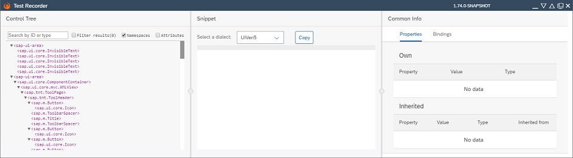
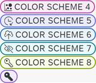

<!-- loioc22208a351a04399bf6b1c9614febb4e -->

# What's New in SAPUI5 1.74

With this release SAPUI5 is upgraded from version 1.73 to 1.74.

****

<table>
<tr>
<th valign="top">

Version

</th>
<th valign="top">

Type

</th>
<th valign="top">

Category

</th>
<th valign="top">

Title

</th>
<th valign="top">

Description

</th>
<th valign="top">

Action

</th>
<th valign="top">

Available as of

</th>
</tr>
<tr>
<td valign="top">

1.74 

</td>
<td valign="top">

New 

</td>
<td valign="top">

Feature 

</td>
<td valign="top">

**Test Recorder** 

</td>
<td valign="top">

**Test Recorder**

The Test Recorder tool is now part of the SAPUI5 framework and is available in all browsers. Use it in any SAPUI5 app to inspect the rendered user interface, view the control properties, and get hints about writing tests. The tool is aligned with the two official SAPUI5 testing tools – OPA5 and UIVeri5.

For more information, see [Test Recorder](../04_Essentials/test-recorder-2535ef9.md).

New•Feature•Info Only•1.74

</td>
<td valign="top">

Info Only

</td>
<td valign="top">

2020-01-30

</td>
</tr>
<tr>
<td valign="top">

1.74 

</td>
<td valign="top">

New 

</td>
<td valign="top">

Feature 

</td>
<td valign="top">

**Rule Builder Control** 

</td>
<td valign="top">

**Rule Builder Control**

You can model a text rule to perform an append operation on data objects or attributes in expression language 2.0. For more information, see **Operations** in [Features](../03_Get-Started/features-e603588.md).

New•Feature•Info Only•1.74

</td>
<td valign="top">

Info Only 

</td>
<td valign="top">

2020-01-30

</td>
</tr>
<tr>
<td valign="top">

1.74 

</td>
<td valign="top">

Changed 

</td>
<td valign="top">

Feature 

</td>
<td valign="top">

**Card Explorer** 

</td>
<td valign="top">

**Card Explorer**

We have enhanced the functionality to download samples from the Card Explorer, and now there are 3 optional file formats available: JSON, ZIP, and CARD.For more information, see [Card Explorer](https://ui5.sap.com/test-resources/sap/ui/integration/demokit/cardExplorer/index.html).

Changed•Feature•Info Only•1.74

</td>
<td valign="top">

Info Only 

</td>
<td valign="top">

2020-01-30

</td>
</tr>
<tr>
<td valign="top">

1.74 

</td>
<td valign="top">

Changed 

</td>
<td valign="top">

Feature 

</td>
<td valign="top">

**Navigation in Nested Components** 

</td>
<td valign="top">

**Navigation in Nested Components**

In recent releases, the capabilities to [Navigate with Nested Components](../04_Essentials/navigate-with-nested-components-8e9d6e4.md) were enhanced significantly. In addition to the available documentation, a [Sample](https://ui5.sap.com/#/entity/sap.ui.core.routing.Router/sample/sap.ui.core.sample.RoutingNestedComponent) has been added to showcase some fundamental possibilities of using components to structure applications and how to interconnect them via routing. 

Changed•Feature•Info Only•1.74

</td>
<td valign="top">

Info Only 

</td>
<td valign="top">

2020-01-30

</td>
</tr>
<tr>
<td valign="top">

1.74 

</td>
<td valign="top">

Changed 

</td>
<td valign="top">

Feature 

</td>
<td valign="top">

**Negative Predefined CSS Margin Classes** 

</td>
<td valign="top">

**Negative Predefined CSS Margin Classes**

We’ve introduced the following negative CSS margin classes to help you align controls that have their own default margins:

-   `sapUiTinyNegativeMarginBeginEnd`

-   `sapUiSmallNegativeMarginBeginEnd`

-   `sapUiMediumNegativeMarginBeginEnd`

-   `sapUiLargeNegativeMarginBeginEnd`

For more information, see [Using Predefined CSS Margin Classes](../04_Essentials/using-predefined-css-margin-classes-777168f.md)and the [Sample](https://ui5.sap.com/#/entity/sap.ui.core.StandardMargins/sample/sap.m.sample.StandardNegativeMarginsTwoSided).

Changed•Feature•Info Only•1.74

</td>
<td valign="top">

Info Only 

</td>
<td valign="top">

2020-01-30

</td>
</tr>
<tr>
<td valign="top">

1.74 

</td>
<td valign="top">

Changed 

</td>
<td valign="top">

Feature 

</td>
<td valign="top">

**Responsive Padding Enablement** 

</td>
<td valign="top">

**Responsive Padding Enablement**

We've introduced responsive paddings to the `sap.m.IconTabBar`, `sap.m.ObjectHeader`, and `sap.m.TabContainer` controls. For more information, see [Enabling Responsive Paddings According to the Control Width](../04_Essentials/enabling-responsive-paddings-according-to-the-control-width-3b718b5.md).

Changed•Feature•Info Only•1.74

</td>
<td valign="top">

Info Only 

</td>
<td valign="top">

2020-01-30

</td>
</tr>
<tr>
<td valign="top">

1.74 

</td>
<td valign="top">

Changed 

</td>
<td valign="top">

Feature 

</td>
<td valign="top">

**SAPUI5 OData V4 Model** 

</td>
<td valign="top">

**SAPUI5 OData V4 Model**

The new version of the SAPUI5 OData V4 model introduces the following features:

-   The `autoExpandSelect:true` model setting has been enhanced for property bindings that are added later.

-   We have added the `sap.ui.model.v4.ODataListBinding.getDownloadUrl` method.
-   `sap.ui.model.v4.AnnotationHelper.format` can now be used for operation parameters.
-   For messages returned in error responses of operation calls, targets pointing to operation parameters are now parsed correctly.
-   The `sap.ui.model.v4.Context.setProperty` method can be used to set properties locally on the client by specifying `null` as the `groupId`. The set value is then not included in PATCH and POST requests to create the new entity.
-   Annotation targets for \(overloaded\) bound operations in 4.01 Format are also supported in value list metadata.

> ### Restriction:  
> Due to the limited feature scope of this version of the SAPUI5 OData V4 model, check that all required features are in place before developing applications. Double-check the detailed documentation of the features, as certain parts of a feature may be missing. While we aim to be compatible with existing controls, some controls might not work due to small incompatibilities compared to `sap.ui.model.odata.(v2.)ODataModel`, or due to missing features in the model \(such as tree binding\). This also applies to smart controls \(`sap.ui.comp` library\) that do not support the SAPUI5 OData V4 model, as well as controls such as `TreeTable` and `AnalyticalTable`, which are not supported in combination with the SAPUI5 OData V4 model. The interface for applications has been changed for easier and more efficient use of the model. For a summary of these changes, see [Changes Compared to OData V2 Model](../04_Essentials/changes-compared-to-odata-v2-model-abd4d7c.md).

For more information, see [OData V4 Model](../04_Essentials/odata-v4-model-5de13cf.md), the [API Reference](https://ui5.sap.com/#/api/sap.ui.model.odata.v4), and the [Samples](https://ui5.sap.com/#/entity/sap.ui.model.odata.v4.ODataModel) in the Demo Kit.

Changed•Feature•Info Only•1.74

</td>
<td valign="top">

Info Only 

</td>
<td valign="top">

2020-01-30

</td>
</tr>
<tr>
<td valign="top">

1.74 

</td>
<td valign="top">

Changed 

</td>
<td valign="top">

Control 

</td>
<td valign="top">

**`sap.m.Avatar`** 

</td>
<td valign="top">

**`sap.m.Avatar`**

We've added *remove* and *reveal* actions in the `Avatar` design-time metadata. Now, the control can be removed and revealed when using UI adaptation at runtime.For more information, see the [Samples](https://ui5.sap.com/#/entity/sap.m.Avatar/sample/sap.m.sample.Avatar).

Changed•Control•Info Only•1.74

</td>
<td valign="top">

Info Only 

</td>
<td valign="top">

2020-01-30

</td>
</tr>
<tr>
<td valign="top">

1.74 

</td>
<td valign="top">

Changed 

</td>
<td valign="top">

Control 

</td>
<td valign="top">

**`sap.m.ColorPalette`** 

</td>
<td valign="top">

**`sap.m.ColorPalette`**

We have introduced a *Recent Colors* section, showing the last 5 recently used colors. This feature is enabled by default, making it is easier to find and select the exact colors. For more information, see the [API Reference](https://ui5.sap.com/#/api/sap.m.ColorPalette) and the [Sample](https://ui5.sap.com/#/entity/sap.m.ColorPalette/sample/sap.m.sample.ColorPalettePopover).

Changed•Control•Info Only•1.74

</td>
<td valign="top">

Info Only 

</td>
<td valign="top">

2020-01-30

</td>
</tr>
<tr>
<td valign="top">

1.74 

</td>
<td valign="top">

Changed 

</td>
<td valign="top">

Control 

</td>
<td valign="top">

**`sap.m.DateRangeSelection`** 

</td>
<td valign="top">

**`sap.m.DateRangeSelection`**

We have introduced the ability to select month and year ranges. This improves the user experience when only a month or a year range has to be selected, and is defined by the `displayFormat` property. For more information, see the [API Reference](https://ui5.sap.com/#/api/sap.m.DateRangeSelection) and the [Sample](https://ui5.sap.com/#/entity/sap.m.DateRangeSelection/sample/sap.m.sample.DateRangeSelection).

Changed•Control•Info Only•1.74

</td>
<td valign="top">

Info Only 

</td>
<td valign="top">

2020-01-30

</td>
</tr>
<tr>
<td valign="top">

1.74 

</td>
<td valign="top">

Changed 

</td>
<td valign="top">

Control 

</td>
<td valign="top">

**`sap.m.List`, `sap.m.Table`, `sap.m.Tree`** 

</td>
<td valign="top">

**`sap.m.List`, `sap.m.Table`, `sap.m.Tree`**

The busy indicator is now displayed in the center of the visible area of the UIs of these controls and is no longer vertically centered and therefore not always visible. For more information, see the [Sample](https://ui5.sap.com/#/entity/sap.m.List/sample/sap.m.sample.ListDeletion).

Changed•Control•Info Only•1.74

</td>
<td valign="top">

Info Only 

</td>
<td valign="top">

2020-01-30

</td>
</tr>
<tr>
<td valign="top">

1.74 

</td>
<td valign="top">

Changed 

</td>
<td valign="top">

Control 

</td>
<td valign="top">

**`sap.m.NavContainer`** 

</td>
<td valign="top">

**`sap.m.NavContainer`**

In version 1.69, the default value for the `defaultTransitionName` property was visually updated to behave as a slide & fade animation and the classic slide animation was no longer an option. Now, we've added the previous slide behavior as a new type of transition. To use it, set the `defaultTransitionName` property to `baseSlide`.For more information, see the [API Reference](https://ui5.sap.com/#/api/sap.m.NavContainer) and the [Sample](https://ui5.sap.com/#/entity/sap.m.NavContainer/sample/sap.m.sample.NavContainer).

Changed•Control•Info Only•1.74

</td>
<td valign="top">

Info Only 

</td>
<td valign="top">

2020-01-30

</td>
</tr>
<tr>
<td valign="top">

1.74 

</td>
<td valign="top">

Changed 

</td>
<td valign="top">

Control 

</td>
<td valign="top">

**`sap.m.NotificationListItem`** 

</td>
<td valign="top">

**`sap.m.NotificationListItem`**

The avatar background color can now be managed by the application developer using the new `authorAvatarColor` property. Now, if any of the `authorPicture` or `authorInitials` properties are not set, the default icon will not be displayed. For more information, see the [API Reference](https://ui5.sap.com/#/api/sap.m.NotificationListItem) and the [Sample](https://ui5.sap.com/#/entity/sap.m.NotificationListItem/sample/sap.m.sample.NotificationListItem).

Changed•Control•Info Only•1.74

</td>
<td valign="top">

Info Only 

</td>
<td valign="top">

2020-01-30

</td>
</tr>
<tr>
<td valign="top">

1.74 

</td>
<td valign="top">

Changed 

</td>
<td valign="top">

Control 

</td>
<td valign="top">

**`sap.m.plugins.DataStateIndicator`** 

</td>
<td valign="top">

**`sap.m.plugins.DataStateIndicator`**

This plugin for the table controls \(`sap.m.List, sap.m.Table, sap.ui.table.Table`\) allows you to implement binding-related messages and show them on the UI using a message strip. For more information, see the [API Reference](https://ui5.sap.com/#/api/sap.m.plugins.DataStateIndicator) and the [Sample](https://ui5.sap.com/#/entity/sap.ui.comp.smarttable.SmartTable/sample/sap.ui.comp.sample.smarttable.mtableDataState).

Changed•Control•Info Only•1.74

</td>
<td valign="top">

Info Only 

</td>
<td valign="top">

2020-01-30

</td>
</tr>
<tr>
<td valign="top">

1.74 

</td>
<td valign="top">

Changed 

</td>
<td valign="top">

Control 

</td>
<td valign="top">

**`sap.m.Select`** 

</td>
<td valign="top">

**`sap.m.Select`**

With the new `required` property, you can now indicate whether user input is required. This property is helpful for accessibility purposes when a single relationship between the field and a label can't be established, for example, when one label exists for multiple fields.For more information, see the [API Reference](https://ui5.sap.com/#/api/sap.m.Select).

Changed•Control•Info Only•1.74

</td>
<td valign="top">

Info Only 

</td>
<td valign="top">

2020-01-30

</td>
</tr>
<tr>
<td valign="top">

1.74 

</td>
<td valign="top">

Changed 

</td>
<td valign="top">

Control 

</td>
<td valign="top">

**`sap.m.StandardListItem`** 

</td>
<td valign="top">

**`sap.m.StandardListItem`**

The new `infoStateInverted` property changes the rendering behavior of the information state and information text. If it is set to `true`, the color defined by the `infoState` property is then shown as the background color of the information text. For more information, see the [API Reference](https://ui5.sap.com/#/api/sap.m.StandardListItem) and the [Sample](https://ui5.sap.com/#/entity/sap.m.StandardListItem/sample/sap.m.sample.StandardListItemInfoStateInverted).

Changed•Control•Info Only•1.74

</td>
<td valign="top">

Info Only 

</td>
<td valign="top">

2020-01-30

</td>
</tr>
<tr>
<td valign="top">

1.74 

</td>
<td valign="top">

Changed 

</td>
<td valign="top">

Control 

</td>
<td valign="top">

**`sap.m.Table`** 

</td>
<td valign="top">

**`sap.m.Table`**

A more comprehensive message text is now shown if no data is available because all table columns are hidden. For more information, see the [Sample](https://ui5.sap.com/#/entity/sap.m.Table/sample/sap.m.sample.TablePerso).

Changed•Control•Info Only•1.74

</td>
<td valign="top">

Info Only 

</td>
<td valign="top">

2020-01-30

</td>
</tr>
<tr>
<td valign="top">

1.74 

</td>
<td valign="top">

Changed 

</td>
<td valign="top">

Control 

</td>
<td valign="top">

**`sap.m.ViewSettingsDialog`** 

</td>
<td valign="top">

**`sap.m.ViewSettingsDialog`**

We have introduced a new button to display only the selected items in the filter tab, and to hide items that are not selected. This button works in combination with the Search field, so the displayed items are both filtered by title and selection. For more information, see the [API Reference](https://ui5.sap.com/#/api/sap.m.ViewSettingsDialog) and the [Sample](https://ui5.sap.com/#/entity/sap.m.ViewSettingsDialog/sample/sap.m.sample.ViewSettingsDialog).

Changed•Control•Info Only•1.74

</td>
<td valign="top">

Info Only 

</td>
<td valign="top">

2020-01-30

</td>
</tr>
<tr>
<td valign="top">

1.74 

</td>
<td valign="top">

Changed 

</td>
<td valign="top">

Control 

</td>
<td valign="top">

**`sap.m.Wizard`** 

</td>
<td valign="top">

**`sap.m.Wizard`**

We have enhanced the `sap.m.Wizard` control for better integration in the `sap.f.DynamicPage`. In order to make use of it, you need to make certain configurations. For more information, see the [API Reference](https://ui5.sap.com/#/api/sap.m.Wizard).

Changed•Control•Info Only•1.74

</td>
<td valign="top">

Info Only 

</td>
<td valign="top">

2020-01-30

</td>
</tr>
<tr>
<td valign="top">

1.74 

</td>
<td valign="top">

Changed 

</td>
<td valign="top">

Control 

</td>
<td valign="top">

**`sap.tnt.InfoLabel`** 

</td>
<td valign="top">

**`sap.tnt.InfoLabel`**

We have introduced the option to add an icon to the `sap.tnt.InfoLabel` content. It is defined by the new `icon` property. For more information, see the [API Reference](https://ui5.sap.com/#/api/sap.tnt.InfoLabel) and the [Sample](https://ui5.sap.com/#/entity/sap.tnt.InfoLabel/sample/sap.tnt.sample.InfoLabel).

Changed•Control•Info Only•1.74

</td>
<td valign="top">

Info Only 

</td>
<td valign="top">

2020-01-30

</td>
</tr>
<tr>
<td valign="top">

1.74 

</td>
<td valign="top">

Changed 

</td>
<td valign="top">

Control 

</td>
<td valign="top">

**`sap.ui.comp.smartfield.SmartField`, `sap.ui.comp.smartfilterbar.SmartFilterBar`** 

</td>
<td valign="top">

**`sap.ui.comp.smartfield.SmartField`, `sap.ui.comp.smartfilterbar.SmartFilterBar`**

We've introduced support for fiscal dates. The service metadata property must be of type `Edm.String` annotated with one of the fiscal annotations \(`IsFiscalYear`, `IsFiscalPeriod`, `IsFiscalYearPeriod`, `IsFiscalQuarter`, `IsFiscalYearQuarter`, `IsFiscalWeek`, `IsFiscalYearWeek`, `IsDayOfFiscalYear`\).For more information, see the [API Reference](https://ui5.sap.com/#/api/sap.ui.comp.smartfield.SmartField) for `SmartField`, the [API Reference](https://ui5.sap.com/#/api/sap.ui.comp.smartfield.SmartFilterBar) for `SmartFilterBar` and the [Sample](https://ui5.sap.com/#/entity/sap.ui.comp.smartfilterbar.SmartFilterBar/sample/sap.ui.comp.sample.smartfilterbar.FiscalDates) for `SmartFilterBar`.

Changed•Control•Info Only•1.74

</td>
<td valign="top">

Info Only 

</td>
<td valign="top">

2020-01-30

</td>
</tr>
<tr>
<td valign="top">

1.74 

</td>
<td valign="top">

Changed 

</td>
<td valign="top">

Control 

</td>
<td valign="top">

**`sap.ui.comp.smartfilterbar.SmartFilterBar`, `sap.ui.comp.smarttable.SmartTable`** 

</td>
<td valign="top">

**`sap.ui.comp.smartfilterbar.SmartFilterBar`, `sap.ui.comp.smarttable.SmartTable`**

We've updated the available exclude operators to match the include operators for each field type. The change affects the *Define Conditions* tab of the `ValueHelpDialog` in `SmartFilterBar` and the *Filter* tab of `TablePersoDialog` in `SmartTable`.For more information, see the [Sample](https://ui5.sap.com/#/entity/sap.ui.comp.smartfilterbar.SmartFilterBar/sample/sap.ui.comp.sample.smartfilterbar.example1) for `SmartFilterBar` and the [Sample](https://ui5.sap.com/#/entity/sap.ui.comp.smarttable.SmartTable/sample/sap.ui.comp.sample.smarttable) for `SmartTable`.

Changed•Control•Info Only•1.74

</td>
<td valign="top">

Info Only 

</td>
<td valign="top">

2020-01-30

</td>
</tr>
<tr>
<td valign="top">

1.74 

</td>
<td valign="top">

Changed 

</td>
<td valign="top">

Control 

</td>
<td valign="top">

**`sap.ui.comp.valuehelpdialog.ValueHelpDialog`** 

</td>
<td valign="top">

**`sap.ui.comp.valuehelpdialog.ValueHelpDialog`**

We've improved the behavior of the `ValueHelpDialog` basic search for `SmartFilterBar` and `SmartField`. Now, only the entered \(or modified\) value is taken over into the basic search. The search is triggered automatically when the dialog opens and takes over the value into the basic search \(if it’s not empty\). Only the entered characters are taken, regardless if the suggestion list is displaying a typeahead.For more information, see the [Sample](https://ui5.sap.com/#/entity/sap.ui.comp.smartfield.SmartField/sample/sap.ui.comp.sample.smartfield.SmartFieldWithValueHelp) for `SmartField` and the [Sample](https://ui5.sap.com/#/entity/sap.ui.comp.smartfilterbar.SmartFilterBar/sample/sap.ui.comp.sample.smartfilterbar.example1) for `SmartFilterBar`.

Changed•Control•Info Only•1.74

</td>
<td valign="top">

Info Only 

</td>
<td valign="top">

2020-01-30

</td>
</tr>
<tr>
<td valign="top">

1.74 

</td>
<td valign="top">

Changed 

</td>
<td valign="top">

Control 

</td>
<td valign="top">

**`sap.ui.export.Spreadsheet`** 

</td>
<td valign="top">

**`sap.ui.export.Spreadsheet`**

This class has been further improved to facilitate the export functions. The class now supports `sap.ui.model.Binding` as a `dataSource` parameter. For more information, see the [API Reference](https://ui5.sap.com/#/api/sap.ui.export.Spreadsheet).

Changed•Control•Info Only•1.74

</td>
<td valign="top">

Info Only 

</td>
<td valign="top">

2020-01-30

</td>
</tr>
<tr>
<td valign="top">

1.74 

</td>
<td valign="top">

Changed 

</td>
<td valign="top">

Control 

</td>
<td valign="top">

**`sap.ui.integration.widgets.Card`** 

</td>
<td valign="top">

**`sap.ui.integration.widgets.Card`**

-   A new experimental Calendar Card type is now available . Its purpose is to give an overview of a single entity \(a person, for example\). It consists of an interactive calendar, legend, and a schedule. For more information, see [Calendar Card](https://ui5.sap.com/test-resources/sap/ui/integration/demokit/cardExplorer/webapp/index.html#/learn/types/calendar) in the Card Explorer.
-   We have enabled Data Sources to be used in the descriptor for `sap.ui.integration.widgets.Card`. Data Sources are named and reusable manifest entities that hold configuration settings for services. Referenced using special double-bracketed syntax, they are used to construct data request URLs. Data Sources are defined in the `sap.app` part of the manifest. For more information, see [Data Sources](https://ui5.sap.com/test-resources/sap/ui/integration/demokit/cardExplorer/webapp/index.html#/learn/features/dataSources) in the Card Explorer.
-   We have introduced new number formatters to represent the data on the UI in human-readable format. Now we have predefined number formatters for:

    -   Currency
    -   Date and Time
    -   Floating-point numbers
    -   Integers
    -   Percent
    -   Units of measurement

    For more information, see [Card Formatters](https://ui5.sap.com/test-resources/sap/ui/integration/demokit/cardExplorer/webapp/index.html#/learn/formatters) in the Card Explorer.

-   We now also support objects as values for manifest parameters. Until now only string values were supported. For more information, see [Manifest Parameters](https://ui5.sap.com/test-resources/sap/ui/integration/demokit/cardExplorer/webapp/index.html#/learn/features/manifestParameters) section in the Card Explorer.
-   We have introduced a new experimental type of card - Adaptive Card. With this type of card, you can visualize and reuse cards created using the Microsoft Adaptive Cards specification and manifest, while achieving fully adapted SAP Fiori 3 user experience, out of the box. For more information, see [Adaptive Card](https://ui5.sap.com/test-resources/sap/ui/integration/demokit/cardExplorer/webapp/index.html#/learn/types/adaptive) in the Card Explorer.

Changed•Control•Info Only•1.74

</td>
<td valign="top">

Info Only 

</td>
<td valign="top">

2020-01-30

</td>
</tr>
<tr>
<td valign="top">

1.74 

</td>
<td valign="top">

Changed 

</td>
<td valign="top">

Control 

</td>
<td valign="top">

**`sap.uxap.ObjectPageLayout`** 

</td>
<td valign="top">

**`sap.uxap.ObjectPageLayout`**

You can now move the corresponding section numbers that are displayed in the `AnchorBar` when using UI adaptation at runtime.For more information, see the [Samples](https://ui5.sap.com/#/entity/sap.uxap.ObjectPageLayout).

Changed•Control•Info Only•1.74

</td>
<td valign="top">

Info Only 

</td>
<td valign="top">

2020-01-30

</td>
</tr>
<tr>
<td valign="top">

1.74 

</td>
<td valign="top">

Changed 

</td>
<td valign="top">

SAP Fiori Elements 

</td>
<td valign="top">

**SAP Fiori Elements** 

</td>
<td valign="top">

**SAP Fiori Elements**

**List Report and Object Page**

-   **Smart Multi-Input Control in Smart Tables** 

    It is now possible to include a smart multi-input field in a smart table on an object page. For more information, see [Using the Multi-Input Field on the Object Page](../06_SAP_Fiori_Elements/using-the-multi-input-field-on-the-object-page-04ff5b1.md).

-   **Flexible Column Layout: Displayed Item on Object Page Highlighted in Master List**

    The navigation row in the table is highlighted in blue to correlate with the object being displayed in applications with flexible column layout.

-   **Object Page Saves and Restores State of Control Variants**

    This means that the selected table variants are stored in the same way as the control variants for the list report page.

-   **Configuration of Relevant Links**

    SAP Fiori Elements now gives you the option of configuring relevant links in Related Apps. For more information, see [Enabling the Related Apps Button](../06_SAP_Fiori_Elements/enabling-the-related-apps-button-8dcfe2e.md).

-   **Option to Set Initial Expansion Level in List Report and Analytical List Page Tables**

    You can now set `initialExpansionLevel` using the `PresentationVariant` annotation to set the number of expanded levels for tables and trees. For more information, see [Initial Expansion Level for Tables in List Reports & Analytical List Pages](../06_SAP_Fiori_Elements/initial-expansion-level-for-tables-in-list-reports-analytical-list-pages-bc05d35.md).

-   **Themes**

    SAP Quartz Light is now available by default for applications that are generated by the SAP Web IDE wizard and plugin.

Changed•SAP Fiori Elements•Info Only•1.74

</td>
<td valign="top">

Info Only 

</td>
<td valign="top">

2020-01-30

</td>
</tr>
<tr>
<td valign="top">

1.74 

</td>
<td valign="top">

Changed 

</td>
<td valign="top">

User Documentation 

</td>
<td valign="top">

**Performance Checklist** 

</td>
<td valign="top">

**Performance Checklist**

Ensuring that your SAPUI5 apps run fast is an important topic in application development. To support you in this task, we have improved the existing performance-related documentation as well as added some new information. Please use the comprehensive [Performance Checklist](../03_Get-Started/performance-checklist-9c6400e.md) as a starting point for best practices to help you to review and speed up your SAPUI5 apps.

Changed•User Documentation•Info Only•1.74

</td>
<td valign="top">

Info Only 

</td>
<td valign="top">

2020-01-30

</td>
</tr>
</table>

**Related Information**  

[What's New in SAPUI5 1.141](what-s-new-in-sapui5-1-141-a7ed66d.md "With this release SAPUI5 is upgraded from version 1.140 to 1.141.")

[What's New in SAPUI5 1.140](what-s-new-in-sapui5-1-140-26a106c.md "With this release SAPUI5 is upgraded from version 1.139 to 1.140.")

[What's New in SAPUI5 1.139](what-s-new-in-sapui5-1-139-e10db71.md "With this release SAPUI5 is upgraded from version 1.138 to 1.139.")

[What's New in SAPUI5 1.138](what-s-new-in-sapui5-1-138-8f6a92b.md "With this release SAPUI5 is upgraded from version 1.136 to 1.138.")

[What's New in SAPUI5 1.136](what-s-new-in-sapui5-1-136-a82754d.md "With this release SAPUI5 is upgraded from version 1.135 to 1.136.")

[What's New in SAPUI5 1.135](what-s-new-in-sapui5-1-135-93d7630.md "With this release SAPUI5 is upgraded from version 1.134 to 1.135.")

[What's New in SAPUI5 1.134](what-s-new-in-sapui5-1-134-c512d71.md "With this release SAPUI5 is upgraded from version 1.133 to 1.134.")

[What's New in SAPUI5 1.133](what-s-new-in-sapui5-1-133-86d7605.md "With this release SAPUI5 is upgraded from version 1.132 to 1.133.")

[What's New in SAPUI5 1.132](what-s-new-in-sapui5-1-132-bd2e61f.md "With this release SAPUI5 is upgraded from version 1.131 to 1.132.")

[What's New in SAPUI5 1.131](what-s-new-in-sapui5-1-131-7d24d94.md "With this release SAPUI5 is upgraded from version 1.130 to 1.131.")

[What's New in SAPUI5 1.130](what-s-new-in-sapui5-1-130-85609d4.md "With this release SAPUI5 is upgraded from version 1.129 to 1.130.")

[What's New in SAPUI5 1.129](what-s-new-in-sapui5-1-129-d22b8af.md "With this release SAPUI5 is upgraded from version 1.128 to 1.129.")

[What's New in SAPUI5 1.128](what-s-new-in-sapui5-1-128-1f76220.md "With this release SAPUI5 is upgraded from version 1.127 to 1.128.")

[What's New in SAPUI5 1.127](what-s-new-in-sapui5-1-127-e5e1317.md "With this release SAPUI5 is upgraded from version 1.126 to 1.127.")

[What's New in SAPUI5 1.126](what-s-new-in-sapui5-1-126-1d98116.md "With this release SAPUI5 is upgraded from version 1.125 to 1.126.")

[What's New in SAPUI5 1.125](what-s-new-in-sapui5-1-125-9d87044.md "With this release SAPUI5 is upgraded from version 1.124 to 1.125.")

[What's New in SAPUI5 1.124](what-s-new-in-sapui5-1-124-7f77c3f.md "With this release SAPUI5 is upgraded from version 1.123 to 1.124.")

[What's New in SAPUI5 1.123](what-s-new-in-sapui5-1-123-9d00ac7.md "With this release SAPUI5 is upgraded from version 1.122 to 1.123.")

[What's New in SAPUI5 1.122](what-s-new-in-sapui5-1-122-5d078da.md "With this release SAPUI5 is upgraded from version 1.121 to 1.122.")

[What's New in SAPUI5 1.121](what-s-new-in-sapui5-1-121-91a4a2f.md "With this release SAPUI5 is upgraded from version 1.120 to 1.121.")

[What's New in SAPUI5 1.120](what-s-new-in-sapui5-1-120-2359b63.md "With this release SAPUI5 is upgraded from version 1.119 to 1.120.")

[What's New in SAPUI5 1.119](what-s-new-in-sapui5-1-119-0b1903a.md "With this release SAPUI5 is upgraded from version 1.118 to 1.119.")

[What's New in SAPUI5 1.118](what-s-new-in-sapui5-1-118-3eecbde.md "With this release SAPUI5 is upgraded from version 1.117 to 1.118.")

[What's New in SAPUI5 1.117](what-s-new-in-sapui5-1-117-029d3b4.md "With this release SAPUI5 is upgraded from version 1.116 to 1.117.")

[What's New in SAPUI5 1.116](what-s-new-in-sapui5-1-116-ebd6f34.md "With this release SAPUI5 is upgraded from version 1.115 to 1.116.")

[What's New in SAPUI5 1.115](what-s-new-in-sapui5-1-115-409fde8.md "With this release SAPUI5 is upgraded from version 1.114 to 1.115.")

[What's New in SAPUI5 1.114](what-s-new-in-sapui5-1-114-890fce1.md "With this release SAPUI5 is upgraded from version 1.113 to 1.114.")

[What's New in SAPUI5 1.113](what-s-new-in-sapui5-1-113-a9553fe.md "With this release SAPUI5 is upgraded from version 1.112 to 1.113.")

[What's New in SAPUI5 1.112](what-s-new-in-sapui5-1-112-34afc69.md "With this release SAPUI5 is upgraded from version 1.111 to 1.112.")

[What's New in SAPUI5 1.111](what-s-new-in-sapui5-1-111-7a67837.md "With this release SAPUI5 is upgraded from version 1.110 to 1.111.")

[What's New in SAPUI5 1.110](what-s-new-in-sapui5-1-110-71a855c.md "With this release SAPUI5 is upgraded from version 1.109 to 1.110.")

[What's New in SAPUI5 1.109](what-s-new-in-sapui5-1-109-3264bd2.md "With this release SAPUI5 is upgraded from version 1.108 to 1.109.")

[What's New in SAPUI5 1.108](what-s-new-in-sapui5-1-108-66e33f0.md "With this release SAPUI5 is upgraded from version 1.107 to 1.108.")

[What's New in SAPUI5 1.107](what-s-new-in-sapui5-1-107-d4ff916.md "With this release SAPUI5 is upgraded from version 1.106 to 1.107.")

[What's New in SAPUI5 1.106](what-s-new-in-sapui5-1-106-5b497b0.md "With this release SAPUI5 is upgraded from version 1.105 to 1.106.")

[What's New in SAPUI5 1.105](what-s-new-in-sapui5-1-105-4d6c00e.md "With this release SAPUI5 is upgraded from version 1.104 to 1.105.")

[What's New in SAPUI5 1.104](what-s-new-in-sapui5-1-104-69e567c.md "With this release SAPUI5 is upgraded from version 1.103 to 1.104.")

[What's New in SAPUI5 1.103](what-s-new-in-sapui5-1-103-0e98c76.md "With this release SAPUI5 is upgraded from version 1.102 to 1.103.")

[What's New in SAPUI5 1.102](what-s-new-in-sapui5-1-102-f038c99.md "With this release SAPUI5 is upgraded from version 1.101 to 1.102.")

[What's New in SAPUI5 1.101](what-s-new-in-sapui5-1-101-7733b00.md "With this release SAPUI5 is upgraded from version 1.100 to 1.101.")

[What's New in SAPUI5 1.100](what-s-new-in-sapui5-1-100-27dec1d.md "With this release SAPUI5 is upgraded from version 1.99 to 1.100.")

[What's New in SAPUI5 1.99](what-s-new-in-sapui5-1-99-4f35848.md "With this release SAPUI5 is upgraded from version 1.98 to 1.99.")

[What's New in SAPUI5 1.98](what-s-new-in-sapui5-1-98-d9f16f2.md "With this release SAPUI5 is upgraded from version 1.97 to 1.98.")

[What's New in SAPUI5 1.97](what-s-new-in-sapui5-1-97-fa0e282.md "With this release SAPUI5 is upgraded from version 1.96 to 1.97.")

[What's New in SAPUI5 1.96](what-s-new-in-sapui5-1-96-7a9269f.md "With this release SAPUI5 is upgraded from version 1.95 to 1.96.")

[What's New in SAPUI5 1.95](what-s-new-in-sapui5-1-95-a1aea67.md "With this release SAPUI5 is upgraded from version 1.94 to 1.95.")

[What's New in SAPUI5 1.94](what-s-new-in-sapui5-1-94-c40f1e6.md "With this release SAPUI5 is upgraded from version 1.93 to 1.94.")

[What's New in SAPUI5 1.93](what-s-new-in-sapui5-1-93-f273340.md "With this release SAPUI5 is upgraded from version 1.92 to 1.93.")

[What's New in SAPUI5 1.92](what-s-new-in-sapui5-1-92-1ef345d.md "With this release SAPUI5 is upgraded from version 1.91 to 1.92.")

[What's New in SAPUI5 1.91](what-s-new-in-sapui5-1-91-0a2bd79.md "With this release SAPUI5 is upgraded from version 1.90 to 1.91.")

[What's New in SAPUI5 1.90](what-s-new-in-sapui5-1-90-91c10c2.md "With this release SAPUI5 is upgraded from version 1.89 to 1.90.")

[What's New in SAPUI5 1.89](what-s-new-in-sapui5-1-89-e56cddc.md "With this release SAPUI5 is upgraded from version 1.88 to 1.89.")

[What's New in SAPUI5 1.88](what-s-new-in-sapui5-1-88-e15a206.md "With this release SAPUI5 is upgraded from version 1.87 to 1.88.")

[What's New in SAPUI5 1.87](what-s-new-in-sapui5-1-87-b506da7.md "With this release SAPUI5 is upgraded from version 1.86 to 1.87.")

[What's New in SAPUI5 1.86](what-s-new-in-sapui5-1-86-4c1c959.md "With this release SAPUI5 is upgraded from version 1.85 to 1.86.")

[What's New in SAPUI5 1.85](what-s-new-in-sapui5-1-85-1d18eb5.md "With this release SAPUI5 is upgraded from version 1.84 to 1.85.")

[What's New in SAPUI5 1.84](what-s-new-in-sapui5-1-84-dc76640.md "With this release SAPUI5 is upgraded from version 1.82 to 1.84.")

[What's New in SAPUI5 1.82](what-s-new-in-sapui5-1-82-3a8dd13.md "With this release SAPUI5 is upgraded from version 1.81 to 1.82.")

[What's New in SAPUI5 1.81](what-s-new-in-sapui5-1-81-f5e2a21.md "With this release SAPUI5 is upgraded from version 1.80 to 1.81.")

[What's New in SAPUI5 1.80](what-s-new-in-sapui5-1-80-8cee506.md "With this release SAPUI5 is upgraded from version 1.79 to 1.80.")

[What's New in SAPUI5 1.79](what-s-new-in-sapui5-1-79-99c4cdc.md "With this release SAPUI5 is upgraded from version 1.78 to 1.79.")

[What's New in SAPUI5 1.78](what-s-new-in-sapui5-1-78-f09b63e.md "With this release SAPUI5 is upgraded from version 1.77 to 1.78.")

[What's New in SAPUI5 1.77](what-s-new-in-sapui5-1-77-c46b439.md "With this release SAPUI5 is upgraded from version 1.76 to 1.77.")

[What's New in SAPUI5 1.76](what-s-new-in-sapui5-1-76-aad03b5.md "With this release SAPUI5 is upgraded from version 1.75 to 1.76.")

[What's New in SAPUI5 1.75](what-s-new-in-sapui5-1-75-5cbb62d.md "With this release SAPUI5 is upgraded from version 1.74 to 1.75.")

[What's New in SAPUI5 1.73](what-s-new-in-sapui5-1-73-231dd13.md "With this release SAPUI5 is upgraded from version 1.72 to 1.73.")

[What's New in SAPUI5 1.72](what-s-new-in-sapui5-1-72-521cad9.md "With this release SAPUI5 is upgraded from version 1.71 to 1.72.")

[What's New in SAPUI5 1.71](what-s-new-in-sapui5-1-71-a93a6a3.md "With this release SAPUI5 is upgraded from version 1.70 to 1.71.")

[What's New in SAPUI5 1.70](what-s-new-in-sapui5-1-70-f073d69.md "With this release SAPUI5 is upgraded from version 1.69 to 1.70.")

[What's New in SAPUI5 1.69](what-s-new-in-sapui5-1-69-89a18bd.md "With this release SAPUI5 is upgraded from version 1.68 to 1.69.")

[What's New in SAPUI5 1.68](what-s-new-in-sapui5-1-68-f94bf93.md "With this release SAPUI5 is upgraded from version 1.67 to 1.68.")

[What's New in SAPUI5 1.67](what-s-new-in-sapui5-1-67-a6b1472.md "With this release SAPUI5 is upgraded from version 1.66 to 1.67.")

[What's New in SAPUI5 1.66](what-s-new-in-sapui5-1-66-c9896e9.md "With this release SAPUI5 is upgraded from version 1.65 to 1.66.")

[What's New in SAPUI5 1.65](what-s-new-in-sapui5-1-65-0f5acfd.md "With this release SAPUI5 is upgraded from version 1.64 to 1.65.")

[What's New in SAPUI5 1.64](what-s-new-in-sapui5-1-64-0e30822.md "With this release SAPUI5 is upgraded from version 1.63 to 1.64.")

[What's New in SAPUI5 1.63](what-s-new-in-sapui5-1-63-e8d9da7.md "With this release SAPUI5 is upgraded from version 1.62 to 1.63.")

[What's New in SAPUI5 1.62](what-s-new-in-sapui5-1-62-771f4d5.md "With this release SAPUI5 is upgraded from version 1.61 to 1.62.")

[What's New in SAPUI5 1.61](what-s-new-in-sapui5-1-61-d991552.md "With this release SAPUI5 is upgraded from version 1.60 to 1.61.")

[What's New in SAPUI5 1.60](what-s-new-in-sapui5-1-60-5a0e1f7.md "With this release SAPUI5 is upgraded from version 1.58 to 1.60.")

[What's New in SAPUI5 1.58](what-s-new-in-sapui5-1-58-7c927aa.md "With this release SAPUI5 is upgraded from version 1.56 to 1.58.")

[What's New in SAPUI5 1.56](what-s-new-in-sapui5-1-56-108b7fd.md "With this release SAPUI5 is upgraded from version 1.54 to 1.56.")

[What's New in SAPUI5 1.54](what-s-new-in-sapui5-1-54-c838330.md "With this release SAPUI5 is upgraded from version 1.52 to 1.54.")

[What's New in SAPUI5 1.52](what-s-new-in-sapui5-1-52-849e1b6.md "With this release SAPUI5 is upgraded from version 1.50 to 1.52.")

[What's New in SAPUI5 1.50](what-s-new-in-sapui5-1-50-759e9f3.md "With this release SAPUI5 is upgraded from version 1.48 to 1.50.")

[What's New in SAPUI5 1.48](what-s-new-in-sapui5-1-48-fa1efac.md "With this release SAPUI5 is upgraded from version 1.46 to 1.48.")

[What's New in SAPUI5 1.46](what-s-new-in-sapui5-1-46-6307539.md "With this release SAPUI5 is upgraded from version 1.44 to 1.46.")

[What's New in SAPUI5 1.44](what-s-new-in-sapui5-1-44-a0cb7a0.md "With this release SAPUI5 is upgraded from version 1.42 to 1.44.")

[What's New in SAPUI5 1.42](what-s-new-in-sapui5-1-42-468b05d.md "With this release SAPUI5 is upgraded from version 1.40 to 1.42.")

[What's New in SAPUI5 1.40](what-s-new-in-sapui5-1-40-fbab50e.md "With this release SAPUI5 is upgraded from version 1.38 to 1.40.")

[What's New in SAPUI5 1.38](what-s-new-in-sapui5-1-38-f218918.md "With this release SAPUI5 is upgraded from version 1.36 to 1.38.")

