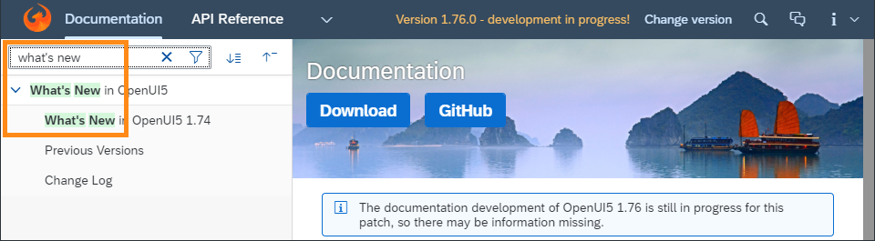
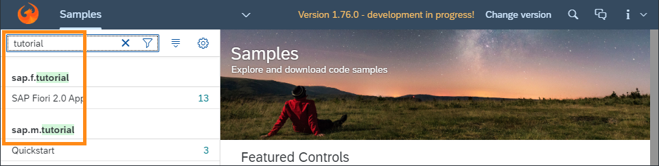

<!-- loio5cbb62df99cd4fe9ae4548a757ae9ad7 -->

# What's New in SAPUI5 1.75

With this release SAPUI5 is upgraded from version 1.74 to 1.75.

****

<table>
<tr>
<th valign="top">

Version

</th>
<th valign="top">

Type

</th>
<th valign="top">

Category

</th>
<th valign="top">

Title

</th>
<th valign="top">

Description

</th>
<th valign="top">

Action

</th>
<th valign="top">

Available as of

</th>
</tr>
<tr>
<td valign="top">

1.75 

</td>
<td valign="top">

New 

</td>
<td valign="top">

Feature 

</td>
<td valign="top">

**Accessibility Enhancement** 

</td>
<td valign="top">

**Accessibility Enhancement**

SAPUI5 is following the SAP ‘s updated design and development guidelines, as well as the testing procedures and accessibility reporting, that are based on WCAG 2.1 level A and AA.

New•Feature•Info Only•1.75

</td>
<td valign="top">

Info Only

</td>
<td valign="top">

2020-02-27

</td>
</tr>
<tr>
<td valign="top">

1.75 

</td>
<td valign="top">

New 

</td>
<td valign="top">

Feature 

</td>
<td valign="top">

**Browser and Platform Support** 

</td>
<td valign="top">

**Browser and Platform Support**

SAPUI5 now supports the latest Chromium-based version of Microsoft Edge. The next long-term maintenance SAPUI5 release that comes after 1.71 will be the last release to support the legacy EdgeHTML-based version of Microsoft Edge. For more information, see [Browser and Platform Support](../02_Read-Me-First/browser-and-platform-support-74b59ef.md).

New•Feature•Info Only•1.75

</td>
<td valign="top">

Info Only 

</td>
<td valign="top">

2020-02-27

</td>
</tr>
<tr>
<td valign="top">

1.75 

</td>
<td valign="top">

New 

</td>
<td valign="top">

Feature 

</td>
<td valign="top">

**UI Adaptation: Embedding External Content** 

</td>
<td valign="top">

**UI Adaptation: Embedding External Content**

If you have enabled an app for UI adaptation \(see [SAPUI5 Flexibility: Enable Your App for UI Adaptation](../05_Developing_Apps/sapui5-flexibility-enable-your-app-for-ui-adaptation-f1430c0.md)\), users of this app can now embed external content, such as maps or videos, as iFrames. This feature is available for key users at runtime in UI adaptation mode as well as for developers within the SAPUI5 Visual Editor in SAP Web IDE.

New•Feature•Info Only•1.75

</td>
<td valign="top">

Info Only 

</td>
<td valign="top">

2020-02-27

</td>
</tr>
<tr>
<td valign="top">

1.75 

</td>
<td valign="top">

Changed 

</td>
<td valign="top">

Feature 

</td>
<td valign="top">

**Card Explorer** 

</td>
<td valign="top">

**Card Explorer**

We have introduced a schema validation feature in our samples in the Card Explorer. With this option, developers can see a more detailed report for mistakes inside the card manifest. Things like wrong names of properties, bad property types or bad structures are easily spotted.For more information, explore the samples in the [Card Explorer](https://ui5.sap.com/test-resources/sap/ui/integration/demokit/cardExplorer/webapp/index.html#/exploreOverview/types).

Changed•Feature•Info Only•1.75

</td>
<td valign="top">

Info Only 

</td>
<td valign="top">

2020-02-27

</td>
</tr>
<tr>
<td valign="top">

1.75 

</td>
<td valign="top">

Changed 

</td>
<td valign="top">

Feature 

</td>
<td valign="top">

**Currency Codes** 

</td>
<td valign="top">

**Currency Codes**

When displaying ISO currency codes using `sap.ui.core.format.NumberFormat`, `sap.ui.model.type.Currency` or `sap.ui.model.odata.type.Currency`, the currency code is now displayed by default after the amount, ignoring locale, in order to be consistent with SAP design guidelines. The core configuration parameter `trailingCurrencyCode` can be used to switch the behavior globally.

If currency symbols are enabled \(formatting option `currencyCode: false`\), they continue to follow locale-specific placement.

Changed•Feature•Info Only•1.75

</td>
<td valign="top">

Info Only 

</td>
<td valign="top">

2020-02-27

</td>
</tr>
<tr>
<td valign="top">

1.75 

</td>
<td valign="top">

Changed 

</td>
<td valign="top">

Feature 

</td>
<td valign="top">

**SAPUI5 OData V2 Messages** 

</td>
<td valign="top">

**SAPUI5 OData V2 Messages**

With the new version of the SAPUI5 OData V2 model, the target of server messages is shortened by removing associated pairs of navigation properties. For example, a `/SalesOrderSet('1')/ToLineItems(SalesOrderID='1',ItemPosition='10')/ToHeader/GrossAmount` message target gets reduced to `/SalesOrderSet('1')/GrossAmount` if the `ToLineItems` and `ToHeader` navigation properties have the same relationship in the service metadata. If the second navigation property references a collection, the message target path is reduced only if the referenced entity is the same as without the navigation.

Changed•Feature•Info Only•1.75

</td>
<td valign="top">

Info Only 

</td>
<td valign="top">

2020-02-27

</td>
</tr>
<tr>
<td valign="top">

1.75 

</td>
<td valign="top">

Changed 

</td>
<td valign="top">

Feature 

</td>
<td valign="top">

**SAPUI5 OData V4 Model** 

</td>
<td valign="top">

**SAPUI5 OData V4 Model**

The new version of the SAPUI5 OData V4 model introduces the following features:

-   When displaying aggregated data with a list binding using either the `$$aggregation` binding parameter or `sap.ui.model.odata.v4.ODataListBinding#setAggregation`, you can filter by properties that are part of the original entity set but not of the result set. Note that these filters need to be provided as `sap.ui.model.Filter` objects.
-   `sap.ui.model.odata.v4.Context#requestSideEffects` now supports updating in parent bindings by specifying navigation properties to the parent entities in the path expressions. The respective navigation properties from the parent binding to the binding of the context and back to the parent need to be marked as partners in the metadata.
-   When using `autoExpandSelect`, paths with navigation properties can now be added to `$select`. The binding will evaluate this and automatically derive `$select` and `$expand`.
-   For `sap.ui.model.odata.v4.ODataPropertyBinding`, a `$$noPatch` binding parameter is provided, so that values can be changed in the model without updating them in the back end.
-   The `resume` method of the `v4.ODataContextBinding` and `v4.ODataListBinding` classes now works synchronously.

> ### Restriction:  
> Due to the limited feature scope of this version of the SAPUI5 OData V4 model, check that all required features are in place before developing applications. Double-check the detailed documentation of the features, as certain parts of a feature may be missing. While we aim to be compatible with existing controls, some controls might not work due to small incompatibilities compared to `sap.ui.model.odata.(v2.)ODataModel`, or due to missing features in the model \(such as tree binding\). This also applies to smart controls \(`sap.ui.comp` library\) that do not support the SAPUI5 OData V4 model, as well as controls such as `TreeTable` and `AnalyticalTable`, which are not supported in combination with the SAPUI5 OData V4 model. The interface for applications has been changed for easier and more efficient use of the model. For a summary of these changes, see [Changes Compared to OData V2 Model](../04_Essentials/changes-compared-to-odata-v2-model-abd4d7c.md).

For more information, see [OData V4 Model](../04_Essentials/odata-v4-model-5de13cf.md), the [API Reference](https://ui5.sap.com/#/api/sap.ui.model.odata.v4), and the [Samples](https://ui5.sap.com/#/entity/sap.ui.model.odata.v4.ODataModel) in the Demo Kit.

Changed•Feature•Info Only•1.75

</td>
<td valign="top">

Info Only 

</td>
<td valign="top">

2020-02-27

</td>
</tr>
<tr>
<td valign="top">

1.75 

</td>
<td valign="top">

Changed 

</td>
<td valign="top">

Feature 

</td>
<td valign="top">

**Title Support in Nested Components** 

</td>
<td valign="top">

**Title Support in Nested Components**

The `title` property can now also be defined on routing targets of type `Component`. When set with a binding syntax, it is resolved in the context of the root view of the component loaded by this target.

The router of a nested component may also have a `title` property defined on its own target\(s\) and eventually fire its own `titleChanged` event once such a target is displayed. A new configuration `propagateTitle` allows the `titleChanged` event to propagate from an individual `Component` target to the router of its parent component. In the routing configuration, this can also be enabled for all `Component` targets, so that it is not necessary to define the `propagateTitle` property on each `Component` target.

For more information, see [Using the title Property in Targets](../04_Essentials/using-the-title-property-in-targets-1238d70.md) and [Enabling Routing in Nested Components](../04_Essentials/enabling-routing-in-nested-components-fb19f50.md). In addition, the [Sample](https://ui5.sap.com/#/entity/sap.ui.core.routing.Router/sample/sap.ui.core.sample.RoutingNestedComponent) application introduced in the previous release to feature routing of nested components has been enhanced. It now shows how the new title definition and title propagation could be used in an application built with nested \(or reuse\) components. 

Changed•Feature•Info Only•1.75

</td>
<td valign="top">

Info Only 

</td>
<td valign="top">

2020-02-27

</td>
</tr>
<tr>
<td valign="top">

1.75 

</td>
<td valign="top">

Changed 

</td>
<td valign="top">

Control 

</td>
<td valign="top">

**`sap.m.InitialPagePattern`** 

</td>
<td valign="top">

**`sap.m.InitialPagePattern`**

We have introduced the initial page floorplan as a Demo Kit sample. The floorplan allows users to navigate to a single object to view or edit it. The interaction point on the screen is a single input field and it relies on assisted input to direct the user to the object in as few steps as possible \(using features such as value help and live search\). For more information, see the [CardSAP Fiori Design Guidelines](https://experience.sap.com/fiori-design-web/initial-page-floorplan/)and the [Sample](https://ui5.sap.com/#/entity/sap.m.InitialPagePattern/sample/sap.m.sample.InitialPagePattern).

Changed•Control•Info Only•1.75

</td>
<td valign="top">

Info Only 

</td>
<td valign="top">

2020-02-27

</td>
</tr>
<tr>
<td valign="top">

1.75 

</td>
<td valign="top">

Changed 

</td>
<td valign="top">

Control 

</td>
<td valign="top">

**`sap.m.Link`** 

</td>
<td valign="top">

**`sap.m.Link`**

The `text` property can now be changed using UI adaptation at runtime. This enables key users to provide meaningful link text according to the application context.For more information, see the [Samples](https://ui5.sap.com/#/entity/sap.m.Link).

Changed•Control•Info Only•1.75

</td>
<td valign="top">

Info Only 

</td>
<td valign="top">

2020-02-27

</td>
</tr>
<tr>
<td valign="top">

1.75 

</td>
<td valign="top">

Changed 

</td>
<td valign="top">

Control 

</td>
<td valign="top">

**`sap.m.MessageBox`** 

</td>
<td valign="top">

**`sap.m.MessageBox`**

We have introduced a new `emphasizedAction` property. This allows developers to specify which button in the dialog will receive the type `Emphasized`. If `emphasizedAction` is empty with no actions provided, the default value applies. For more information, see the [API Reference](https://ui5.sap.com/#/api/sap.m.MessageBox) and the [Samples](https://ui5.sap.com/#/entity/sap.m.MessageBox).

Changed•Control•Info Only•1.75

</td>
<td valign="top">

Info Only 

</td>
<td valign="top">

2020-02-27

</td>
</tr>
<tr>
<td valign="top">

1.75 

</td>
<td valign="top">

Changed 

</td>
<td valign="top">

Control 

</td>
<td valign="top">

**`sap.m.ObjectStatus`** 

</td>
<td valign="top">

**`sap.m.ObjectStatus`**

We have enhanced the `sap.ui.core.IndicationColor` palette. Three new colors were added to the palette as numbers 6, 7, and 8. These colors enable developers to represent statuses that don't require a meaning in the sense of good-bad, but should be visually distinguishable. For example, statuses such as Updated, New, or Active. For more information, see the [API Reference](https://ui5.sap.com/#/api/sap.m.ObjectStatus) and the [Sample](https://ui5.sap.com/#/entity/sap.m.ObjectStatus/sample/sap.m.sample.ObjectStatus).

Changed•Control•Info Only•1.75

</td>
<td valign="top">

Info Only 

</td>
<td valign="top">

2020-02-27

</td>
</tr>
<tr>
<td valign="top">

1.75 

</td>
<td valign="top">

Changed 

</td>
<td valign="top">

Control 

</td>
<td valign="top">

**`sap.ui.comp.smartfilterbar.SmartFilterBar`** 

</td>
<td valign="top">

**`sap.ui.comp.smartfilterbar.SmartFilterBar`**

-   The export and import functionality of the `SelectionVariant` is now enhanced and includes the related texts that are used in the filters when fields are set. The feature is available without further configuration.For more information, see the [Sample](https://ui5.sap.com/#/entity/sap.ui.comp.smartfilterbar.SmartFilterBar/sample/sap.ui.comp.sample.smartfilterbar.example1).

-   We have introduced the option to define different columns in the table of the `ValueHelpDialog` and the suggestion list of the `SmartFilterBar`. In the `ValueList` annotation, each parameter can be statically annotated as important using the `Importance` annotation with `EnumMember` set to `High`.For more information, see the [API Reference](https://ui5.sap.com/#/api/sap.ui.comp.smartfilterbar.SmartFilterBar%23annotations/ValueList).

-   We have enabled the `useDateRangeType` property so that it can be modified from the UI adaptation at runtime.

Changed•Control•Info Only•1.75

</td>
<td valign="top">

Info Only 

</td>
<td valign="top">

2020-02-27

</td>
</tr>
<tr>
<td valign="top">

1.75 

</td>
<td valign="top">

Changed 

</td>
<td valign="top">

Control 

</td>
<td valign="top">

**`sap.ui.integration.widgets.Card`** 

</td>
<td valign="top">

**`sap.ui.integration.widgets.Card`**

We have enhanced the capabilities of the Adaptive Card \(Experimental\).

-   You can now load the Adaptive Card manifest/descriptor from а URL.

-   The Adaptive Card supports templating, which enables the separation of data from the layout.

For more information, see the [Adaptive Card](https://ui5.sap.com/test-resources/sap/ui/integration/demokit/cardExplorer/webapp/index.html#/learn/types/adaptive) in the Card Explorer.

Changed•Control•Info Only•1.75

</td>
<td valign="top">

Info Only 

</td>
<td valign="top">

2020-02-27

</td>
</tr>
<tr>
<td valign="top">

1.75 

</td>
<td valign="top">

Changed 

</td>
<td valign="top">

Control 

</td>
<td valign="top">

**`sap.ui.table.AnalyticalTable`, `sap.ui.table.Table, sap.ui.table.TreeTable`** 

</td>
<td valign="top">

**`sap.ui.table.AnalyticalTable`, `sap.ui.table.Table, sap.ui.table.TreeTable`**

A more comprehensive message text is now shown if no data is available because all table columns are hidden. For more information, see the [Sample](https://ui5.sap.com/#/entity/sap.ui.comp.smarttable.SmartTable/sample/sap.ui.comp.sample.smarttable.smartTableWithCriticality).

Changed•Control•Info Only•1.75

</td>
<td valign="top">

Info Only 

</td>
<td valign="top">

2020-02-27

</td>
</tr>
<tr>
<td valign="top">

1.75 

</td>
<td valign="top">

Changed 

</td>
<td valign="top">

SAP Fiori Elements 

</td>
<td valign="top">

**SAP Fiori Elements** 

</td>
<td valign="top">

**SAP Fiori Elements**

**List Report and Object Page**

-   **Option to Show an Error Message on an Empty Table in the Object Page** 

    You can now show an error message strip if a table is empty or if any of the table rows contain an error in a section or subsection of an Object Page.

-   **List Report Page Loaded with Data on Launch**

    By default, the list report page is loaded with data when an application is launched. For more information, see [List Report Elements](../06_SAP_Fiori_Elements/list-report-elements-1cf5c7f.md).

-   **Option to Set Vertical Alignment for Responsive Tables in List Report and Object Pages**

    You can now set the vertical alignment property for the whole responsive table via a manifest property `tableColumnVerticalAlignment` under the settings of `sap.ui.generic.app`. You can set the value of this string to `Top`, `Middle`, and `Bottom`.

-   **Option to Define the Table Type for Each Tab of a List Report**

    You can now define the table type for tabs with different entity sets in a List Report page. For more information, see [Multiple Views on List Report Tables](../06_SAP_Fiori_Elements/multiple-views-on-list-report-tables-a37df40.md) and [Defining Multiple Views on a List Report with Different Entity Sets and Table Settings](../06_SAP_Fiori_Elements/defining-multiple-views-on-a-list-report-with-different-entity-sets-and-table-settings-b6b59e4.md).

Changed•SAP Fiori Elements•Info Only•1.75

</td>
<td valign="top">

Info Only 

</td>
<td valign="top">

2020-02-27

</td>
</tr>
<tr>
<td valign="top">

1.75 

</td>
<td valign="top">

Changed 

</td>
<td valign="top">

SAP Fiori Elements 

</td>
<td valign="top">

**UX Improvement** 

</td>
<td valign="top">

**UX Improvement**

-   **Consistent Font Size** 

    You can now see consistent fonts size for group labels in the Object Page header.

-   **Message Strip**

    Object Page tables can now show a message strip for empty tables and tables with errors.

Changed•SAP Fiori Elements•Info Only•1.75

</td>
<td valign="top">

Info Only 

</td>
<td valign="top">

2020-02-27

</td>
</tr>
<tr>
<td valign="top">

1.75 

</td>
<td valign="top">

New 

</td>
<td valign="top">

Feature 

</td>
<td valign="top">

**Demo Kit Improvements** 

</td>
<td valign="top">

**Demo Kit Improvements**

**Search Highlighting in the *Documentation* and *Samples* sections**

The search highlighting functionality is now also available in the *Documentation* tree filter and the *Samples* list.

New•Feature•Info Only•1.75

</td>
<td valign="top">

Info Only 

</td>
<td valign="top">

2020-02-27

</td>
</tr>
</table>

**Related Information**  

[What's New in SAPUI5 1.131](what-s-new-in-sapui5-1-131-7d24d94.md "With this release SAPUI5 is upgraded from version 1.130 to 1.131.")

[What's New in SAPUI5 1.130](what-s-new-in-sapui5-1-130-85609d4.md "With this release SAPUI5 is upgraded from version 1.129 to 1.130.")

[What's New in SAPUI5 1.129](what-s-new-in-sapui5-1-129-d22b8af.md "With this release SAPUI5 is upgraded from version 1.128 to 1.129.")

[What's New in SAPUI5 1.128](what-s-new-in-sapui5-1-128-1f76220.md "With this release SAPUI5 is upgraded from version 1.127 to 1.128.")

[What's New in SAPUI5 1.127](what-s-new-in-sapui5-1-127-e5e1317.md "With this release SAPUI5 is upgraded from version 1.126 to 1.127.")

[What's New in SAPUI5 1.126](what-s-new-in-sapui5-1-126-1d98116.md "With this release SAPUI5 is upgraded from version 1.125 to 1.126.")

[What's New in SAPUI5 1.125](what-s-new-in-sapui5-1-125-9d87044.md "With this release SAPUI5 is upgraded from version 1.124 to 1.125.")

[What's New in SAPUI5 1.124](what-s-new-in-sapui5-1-124-7f77c3f.md "With this release SAPUI5 is upgraded from version 1.123 to 1.124.")

[What's New in SAPUI5 1.123](what-s-new-in-sapui5-1-123-9d00ac7.md "With this release SAPUI5 is upgraded from version 1.122 to 1.123.")

[What's New in SAPUI5 1.122](what-s-new-in-sapui5-1-122-5d078da.md "With this release SAPUI5 is upgraded from version 1.121 to 1.122.")

[What's New in SAPUI5 1.121](what-s-new-in-sapui5-1-121-91a4a2f.md "With this release SAPUI5 is upgraded from version 1.120 to 1.121.")

[What's New in SAPUI5 1.120](what-s-new-in-sapui5-1-120-2359b63.md "With this release SAPUI5 is upgraded from version 1.119 to 1.120.")

[What's New in SAPUI5 1.119](what-s-new-in-sapui5-1-119-0b1903a.md "With this release SAPUI5 is upgraded from version 1.118 to 1.119.")

[What's New in SAPUI5 1.118](what-s-new-in-sapui5-1-118-3eecbde.md "With this release SAPUI5 is upgraded from version 1.117 to 1.118.")

[What's New in SAPUI5 1.117](what-s-new-in-sapui5-1-117-029d3b4.md "With this release SAPUI5 is upgraded from version 1.116 to 1.117.")

[What's New in SAPUI5 1.116](what-s-new-in-sapui5-1-116-ebd6f34.md "With this release SAPUI5 is upgraded from version 1.115 to 1.116.")

[What's New in SAPUI5 1.115](what-s-new-in-sapui5-1-115-409fde8.md "With this release SAPUI5 is upgraded from version 1.114 to 1.115.")

[What's New in SAPUI5 1.114](what-s-new-in-sapui5-1-114-890fce1.md "With this release SAPUI5 is upgraded from version 1.113 to 1.114.")

[What's New in SAPUI5 1.113](what-s-new-in-sapui5-1-113-a9553fe.md "With this release SAPUI5 is upgraded from version 1.112 to 1.113.")

[What's New in SAPUI5 1.112](what-s-new-in-sapui5-1-112-34afc69.md "With this release SAPUI5 is upgraded from version 1.111 to 1.112.")

[What's New in SAPUI5 1.111](what-s-new-in-sapui5-1-111-7a67837.md "With this release SAPUI5 is upgraded from version 1.110 to 1.111.")

[What's New in SAPUI5 1.110](what-s-new-in-sapui5-1-110-71a855c.md "With this release SAPUI5 is upgraded from version 1.109 to 1.110.")

[What's New in SAPUI5 1.109](what-s-new-in-sapui5-1-109-3264bd2.md "With this release SAPUI5 is upgraded from version 1.108 to 1.109.")

[What's New in SAPUI5 1.108](what-s-new-in-sapui5-1-108-66e33f0.md "With this release SAPUI5 is upgraded from version 1.107 to 1.108.")

[What's New in SAPUI5 1.107](what-s-new-in-sapui5-1-107-d4ff916.md "With this release SAPUI5 is upgraded from version 1.106 to 1.107.")

[What's New in SAPUI5 1.106](what-s-new-in-sapui5-1-106-5b497b0.md "With this release SAPUI5 is upgraded from version 1.105 to 1.106.")

[What's New in SAPUI5 1.105](what-s-new-in-sapui5-1-105-4d6c00e.md "With this release SAPUI5 is upgraded from version 1.104 to 1.105.")

[What's New in SAPUI5 1.104](what-s-new-in-sapui5-1-104-69e567c.md "With this release SAPUI5 is upgraded from version 1.103 to 1.104.")

[What's New in SAPUI5 1.103](what-s-new-in-sapui5-1-103-0e98c76.md "With this release SAPUI5 is upgraded from version 1.102 to 1.103.")

[What's New in SAPUI5 1.102](what-s-new-in-sapui5-1-102-f038c99.md "With this release SAPUI5 is upgraded from version 1.101 to 1.102.")

[What's New in SAPUI5 1.101](what-s-new-in-sapui5-1-101-7733b00.md "With this release SAPUI5 is upgraded from version 1.100 to 1.101.")

[What's New in SAPUI5 1.100](what-s-new-in-sapui5-1-100-27dec1d.md "With this release SAPUI5 is upgraded from version 1.99 to 1.100.")

[What's New in SAPUI5 1.99](what-s-new-in-sapui5-1-99-4f35848.md "With this release SAPUI5 is upgraded from version 1.98 to 1.99.")

[What's New in SAPUI5 1.98](what-s-new-in-sapui5-1-98-d9f16f2.md "With this release SAPUI5 is upgraded from version 1.97 to 1.98.")

[What's New in SAPUI5 1.97](what-s-new-in-sapui5-1-97-fa0e282.md "With this release SAPUI5 is upgraded from version 1.96 to 1.97.")

[What's New in SAPUI5 1.96](what-s-new-in-sapui5-1-96-7a9269f.md "With this release SAPUI5 is upgraded from version 1.95 to 1.96.")

[What's New in SAPUI5 1.95](what-s-new-in-sapui5-1-95-a1aea67.md "With this release SAPUI5 is upgraded from version 1.94 to 1.95.")

[What's New in SAPUI5 1.94](what-s-new-in-sapui5-1-94-c40f1e6.md "With this release SAPUI5 is upgraded from version 1.93 to 1.94.")

[What's New in SAPUI5 1.93](what-s-new-in-sapui5-1-93-f273340.md "With this release SAPUI5 is upgraded from version 1.92 to 1.93.")

[What's New in SAPUI5 1.92](what-s-new-in-sapui5-1-92-1ef345d.md "With this release SAPUI5 is upgraded from version 1.91 to 1.92.")

[What's New in SAPUI5 1.91](what-s-new-in-sapui5-1-91-0a2bd79.md "With this release SAPUI5 is upgraded from version 1.90 to 1.91.")

[What's New in SAPUI5 1.90](what-s-new-in-sapui5-1-90-91c10c2.md "With this release SAPUI5 is upgraded from version 1.89 to 1.90.")

[What's New in SAPUI5 1.89](what-s-new-in-sapui5-1-89-e56cddc.md "With this release SAPUI5 is upgraded from version 1.88 to 1.89.")

[What's New in SAPUI5 1.88](what-s-new-in-sapui5-1-88-e15a206.md "With this release SAPUI5 is upgraded from version 1.87 to 1.88.")

[What's New in SAPUI5 1.87](what-s-new-in-sapui5-1-87-b506da7.md "With this release SAPUI5 is upgraded from version 1.86 to 1.87.")

[What's New in SAPUI5 1.86](what-s-new-in-sapui5-1-86-4c1c959.md "With this release SAPUI5 is upgraded from version 1.85 to 1.86.")

[What's New in SAPUI5 1.85](what-s-new-in-sapui5-1-85-1d18eb5.md "With this release SAPUI5 is upgraded from version 1.84 to 1.85.")

[What's New in SAPUI5 1.84](what-s-new-in-sapui5-1-84-dc76640.md "With this release SAPUI5 is upgraded from version 1.82 to 1.84.")

[What's New in SAPUI5 1.82](what-s-new-in-sapui5-1-82-3a8dd13.md "With this release SAPUI5 is upgraded from version 1.81 to 1.82.")

[What's New in SAPUI5 1.81](what-s-new-in-sapui5-1-81-f5e2a21.md "With this release SAPUI5 is upgraded from version 1.80 to 1.81.")

[What's New in SAPUI5 1.80](what-s-new-in-sapui5-1-80-8cee506.md "With this release SAPUI5 is upgraded from version 1.79 to 1.80.")

[What's New in SAPUI5 1.79](what-s-new-in-sapui5-1-79-99c4cdc.md "With this release SAPUI5 is upgraded from version 1.78 to 1.79.")

[What's New in SAPUI5 1.78](what-s-new-in-sapui5-1-78-f09b63e.md "With this release SAPUI5 is upgraded from version 1.77 to 1.78.")

[What's New in SAPUI5 1.77](what-s-new-in-sapui5-1-77-c46b439.md "With this release SAPUI5 is upgraded from version 1.76 to 1.77.")

[What's New in SAPUI5 1.76](what-s-new-in-sapui5-1-76-aad03b5.md "With this release SAPUI5 is upgraded from version 1.75 to 1.76.")

[What's New in SAPUI5 1.74](what-s-new-in-sapui5-1-74-c22208a.md "With this release SAPUI5 is upgraded from version 1.73 to 1.74.")

[What's New in SAPUI5 1.73](what-s-new-in-sapui5-1-73-231dd13.md "With this release SAPUI5 is upgraded from version 1.72 to 1.73.")

[What's New in SAPUI5 1.72](what-s-new-in-sapui5-1-72-521cad9.md "With this release SAPUI5 is upgraded from version 1.71 to 1.72.")

[What's New in SAPUI5 1.71](what-s-new-in-sapui5-1-71-a93a6a3.md "With this release SAPUI5 is upgraded from version 1.70 to 1.71.")

[What's New in SAPUI5 1.70](what-s-new-in-sapui5-1-70-f073d69.md "With this release SAPUI5 is upgraded from version 1.69 to 1.70.")

[What's New in SAPUI5 1.69](what-s-new-in-sapui5-1-69-89a18bd.md "With this release SAPUI5 is upgraded from version 1.68 to 1.69.")

[What's New in SAPUI5 1.68](what-s-new-in-sapui5-1-68-f94bf93.md "With this release SAPUI5 is upgraded from version 1.67 to 1.68.")

[What's New in SAPUI5 1.67](what-s-new-in-sapui5-1-67-a6b1472.md "With this release SAPUI5 is upgraded from version 1.66 to 1.67.")

[What's New in SAPUI5 1.66](what-s-new-in-sapui5-1-66-c9896e9.md "With this release SAPUI5 is upgraded from version 1.65 to 1.66.")

[What's New in SAPUI5 1.65](what-s-new-in-sapui5-1-65-0f5acfd.md "With this release SAPUI5 is upgraded from version 1.64 to 1.65.")

[What's New in SAPUI5 1.64](what-s-new-in-sapui5-1-64-0e30822.md "With this release SAPUI5 is upgraded from version 1.63 to 1.64.")

[What's New in SAPUI5 1.63](what-s-new-in-sapui5-1-63-e8d9da7.md "With this release SAPUI5 is upgraded from version 1.62 to 1.63.")

[What's New in SAPUI5 1.62](what-s-new-in-sapui5-1-62-771f4d5.md "With this release SAPUI5 is upgraded from version 1.61 to 1.62.")

[What's New in SAPUI5 1.61](what-s-new-in-sapui5-1-61-d991552.md "With this release SAPUI5 is upgraded from version 1.60 to 1.61.")

[What's New in SAPUI5 1.60](what-s-new-in-sapui5-1-60-5a0e1f7.md "With this release SAPUI5 is upgraded from version 1.58 to 1.60.")

[What's New in SAPUI5 1.58](what-s-new-in-sapui5-1-58-7c927aa.md "With this release SAPUI5 is upgraded from version 1.56 to 1.58.")

[What's New in SAPUI5 1.56](what-s-new-in-sapui5-1-56-108b7fd.md "With this release SAPUI5 is upgraded from version 1.54 to 1.56.")

[What's New in SAPUI5 1.54](what-s-new-in-sapui5-1-54-c838330.md "With this release SAPUI5 is upgraded from version 1.52 to 1.54.")

[What's New in SAPUI5 1.52](what-s-new-in-sapui5-1-52-849e1b6.md "With this release SAPUI5 is upgraded from version 1.50 to 1.52.")

[What's New in SAPUI5 1.50](what-s-new-in-sapui5-1-50-759e9f3.md "With this release SAPUI5 is upgraded from version 1.48 to 1.50.")

[What's New in SAPUI5 1.48](what-s-new-in-sapui5-1-48-fa1efac.md "With this release SAPUI5 is upgraded from version 1.46 to 1.48.")

[What's New in SAPUI5 1.46](what-s-new-in-sapui5-1-46-6307539.md "With this release SAPUI5 is upgraded from version 1.44 to 1.46.")

[What's New in SAPUI5 1.44](what-s-new-in-sapui5-1-44-a0cb7a0.md "With this release SAPUI5 is upgraded from version 1.42 to 1.44.")

[What's New in SAPUI5 1.42](what-s-new-in-sapui5-1-42-468b05d.md "With this release SAPUI5 is upgraded from version 1.40 to 1.42.")

[What's New in SAPUI5 1.40](what-s-new-in-sapui5-1-40-fbab50e.md "With this release SAPUI5 is upgraded from version 1.38 to 1.40.")

[What's New in SAPUI5 1.38](what-s-new-in-sapui5-1-38-f218918.md "With this release SAPUI5 is upgraded from version 1.36 to 1.38.")

