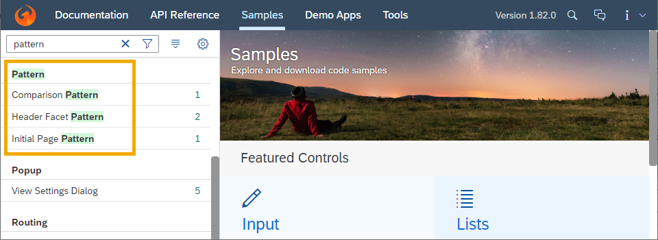

<!-- loiof5e2a21dd36d4b81a12ad30f5d5db20e -->

# What's New in SAPUI5 1.81

With this release SAPUI5 is upgraded from version 1.80 to 1.81.

****

<table>
<tr>
<th valign="top">

Version

</th>
<th valign="top">

Type

</th>
<th valign="top">

Category

</th>
<th valign="top">

Title

</th>
<th valign="top">

Description

</th>
<th valign="top">

Action

</th>
<th valign="top">

Available as of

</th>
</tr>
<tr>
<td valign="top">

1.81 

</td>
<td valign="top">

New 

</td>
<td valign="top">

Feature 

</td>
<td valign="top">

**Consuming SAP Icon Font in a Non-UI5 Environment** 

</td>
<td valign="top">

**Consuming SAP Icon Font in a Non-UI5 Environment**

You can now consume the predefined `SAP-icons` icon font in an environment where SAPUI5 isn't available. An example for integration is given [here](../10_More_About_Controls/icon-and-icon-pool-21ea0ea.md#loio21ea0ea94614480d9a910b2e93431291__section_whp_y2l_mmb).

New•Feature•Info Only•1.81

</td>
<td valign="top">

Info Only

</td>
<td valign="top">

2020-08-13

</td>
</tr>
<tr>
<td valign="top">

1.81 

</td>
<td valign="top">

New 

</td>
<td valign="top">

Feature 

</td>
<td valign="top">

**Incompatible jQuery Security Fix** 

</td>
<td valign="top">

**Incompatible jQuery Security Fix**

We have added a jQuery security fix to SAPUI5, which may introduce incompatibilities to existing application or library code.

For checking and, if required, fixing your applications and libraries, see SAP Note [2941170](https://me.sap.com/notes/2941170). This note also contains information on the security background.

New•Feature•Info Only•1.81

</td>
<td valign="top">

Info Only 

</td>
<td valign="top">

2020-08-13

</td>
</tr>
<tr>
<td valign="top">

1.81 

</td>
<td valign="top">

New 

</td>
<td valign="top">

Feature 

</td>
<td valign="top">

**Special URL Prefixes in App Descriptor** 

</td>
<td valign="top">

**Special URL Prefixes in App Descriptor**

Inside the app descriptor, you can now use special URLs prefixed with `ui5://`. These URLs are resolved automatically during component startup, before any models are created.

One common use case is the resolution of local annotation files. By default the local annotation files are resolved relative to the manifest. When using a `ui5://` URL, you can enforce a different resolution, for example to a server-absolute URL.

Find more details about the usage of such URL prefixes and an example in the [documentation](../04_Essentials/descriptor-for-applications-components-and-libraries-manifest-json-be0cf40.md#loiobe0cf40f61184b358b5faedaec98b2da__section_rmc_3xj_mmb).

New•Feature•Info Only•1.81

</td>
<td valign="top">

Info Only 

</td>
<td valign="top">

2020-08-13

</td>
</tr>
<tr>
<td valign="top">

1.81 

</td>
<td valign="top">

Changed 

</td>
<td valign="top">

Feature 

</td>
<td valign="top">

**SAPUI5 OData V4 Model** 

</td>
<td valign="top">

**SAPUI5 OData V4 Model**

The new version of the SAPUI5 OData V4 model introduces the following features:

-   The following methods are now public:
    -   `sap.ui.model.odata.v4.ODataListBinding#getGroupId`,
    -   `sap.ui.model.odata.v4.ODataListBinding#getUpdateGroupId`,
    -   `sap.ui.model.odata.v4.ODataContextBinding#getGroupId`,
    -   `sap.ui.model.odata.v4.ODataContextBinding#getUpdateGroupId`,
    -   `sap.ui.model.odata.v4.ODataPropertyBinding#getGroupId`,
    -   `sap.ui.model.odata.v4.ODataPropertyBinding#getUpdateGroupId`,
    -   `sap.ui.model.odata.v4.ODataMetaModel#getMetaPath`.

-   The `requestUI5Type` and `getUI5Type` methods now have an additional parameter to pass any format options to be taken into account.
-   You can now use the `sap.ui.model.odata.v4.Context#requestSideEffects` method on bindings with the `$$aggregation` binding parameter.
-   We have introduced the new `sap.ui.model.odata.v4.Context#setKeepAlive` method for row contexts of list bindings. With this new method, you can extend the lifetime of the context, so that it does not get destroyed when the corresponding entity is no longer part of the list, for example, due to filtering or sorting of the list. Note that the `refresh`, `requestSideEffects`, and `delete` methods are currently not supported for kept-alive contexts.
-   The OData V4 model now supports the `metadataUrlParams` parameter. The `sap-context-token` URL parameter can only be used for the request of the root metadata.

> ### Restriction:  
> Due to the limited feature scope of this version of the SAPUI5 OData V4 model, check that all required features are in place before developing applications. Double-check the detailed documentation of the features, as certain parts of a feature may be missing. While we aim to be compatible with existing controls, some controls might not work due to small incompatibilities compared to `sap.ui.model.odata.(v2.)ODataModel`, or due to missing features in the model \(such as tree binding\). This also applies to smart controls \(`sap.ui.comp` library\) that do not support the SAPUI5 OData V4 model, as well as controls such as `TreeTable` and `AnalyticalTable`, which are not supported in combination with the SAPUI5 OData V4 model. The interface for applications has been changed for easier and more efficient use of the model. For a summary of these changes, see [Changes Compared to OData V2 Model](../04_Essentials/changes-compared-to-odata-v2-model-abd4d7c.md).

For more information, see [OData V4 Model](../04_Essentials/odata-v4-model-5de13cf.md), the [API Reference](https://ui5.sap.com/#/api/sap.ui.model.odata.v4), and the [Samples](https://ui5.sap.com/#/entity/sap.ui.model.odata.v4.ODataModel) in the Demo Kit.

Changed•Feature•Info Only•1.81

</td>
<td valign="top">

Info Only 

</td>
<td valign="top">

2020-08-13

</td>
</tr>
<tr>
<td valign="top">

1.81 

</td>
<td valign="top">

Changed 

</td>
<td valign="top">

Control 

</td>
<td valign="top">

**`sap.f.GridContainer`** 

</td>
<td valign="top">

**`sap.f.GridContainer`**

We have enhanced the keyboard handling capabilities of the Grid Container. You can now navigate to the item below or above using the [Down Arrow\] and [Up Arrow\]. If you reach any of the borders of the Grid Container, the `borderReached` event will be fired.

You can now perform drag-and-drop operations using [Ctrl\] + [Arrow Keys\]  simultaneously. If your Grid Container is configured for drag and drop \(has `sap.ui.core.dnd.DropInfo` and `sap.f.dnd.GridDragInfo`\), then you will receive similar events as if you were dragging with a mouse.

For more information, see the [API Reference](https://ui5.sap.com/#/api/sap.f.GridContainer%23methods/focusItem) and the [Sample](https://ui5.sap.com/#/entity/sap.f.GridContainer/sample/sap.f.sample.GridContainerDragAndDrop).

Changed•Control•Info Only•1.81

</td>
<td valign="top">

Info Only 

</td>
<td valign="top">

2020-08-13

</td>
</tr>
<tr>
<td valign="top">

1.81 

</td>
<td valign="top">

Changed 

</td>
<td valign="top">

Control 

</td>
<td valign="top">

**`sap.m.Button`** 

</td>
<td valign="top">

**`sap.m.Button`**

Visualization of shortcut hints on focus and hover is now available. For example, [Ctrl\] + [S\]  is displayed for the Save button to help the user to find the correct shortcut. This is done by adding a command to a button. This new feature is available for the standalone `sap.m.Button` as well as for composite controls like `sap.ui.comp.smarttable.SmartTable` and `sap.ui.comp.smartfilterbar.SmartFilterBar`. For more information, see the [Sample](https://ui5.sap.com/#/entity/sap.ui.core.sample.Commands/sample/sap.ui.core.sample.Commands).

Changed•Control•Info Only•1.81

</td>
<td valign="top">

Info Only 

</td>
<td valign="top">

2020-08-13

</td>
</tr>
<tr>
<td valign="top">

1.81 

</td>
<td valign="top">

Changed 

</td>
<td valign="top">

Control 

</td>
<td valign="top">

**`sap.m.DatePicker`, `sap.m.DateTimePicker`, and `sap.m.TimePicker`** 

</td>
<td valign="top">

**`sap.m.DatePicker`, `sap.m.DateTimePicker`, and `sap.m.TimePicker`**

We have aligned the visualization of the full-screen dialog in mobile view for these controls.

Changed•Control•Info Only•1.81

</td>
<td valign="top">

Info Only 

</td>
<td valign="top">

2020-08-13

</td>
</tr>
<tr>
<td valign="top">

1.81 

</td>
<td valign="top">

Changed 

</td>
<td valign="top">

Control 

</td>
<td valign="top">

**`sap.m.MessageView`** 

</td>
<td valign="top">

**`sap.m.MessageView`**

The grouping functionality in the `sap.m.MessageView` shows the messages in the order they were added to the control, or provided in the model. For more information, see the [API Reference](https://ui5.sap.com/#/api/sap.m.MessageView).

Changed•Control•Info Only•1.81

</td>
<td valign="top">

Info Only 

</td>
<td valign="top">

2020-08-13

</td>
</tr>
<tr>
<td valign="top">

1.81 

</td>
<td valign="top">

Changed 

</td>
<td valign="top">

Control 

</td>
<td valign="top">

**`sap.m.PlanningCalendar`** 

</td>
<td valign="top">

**`sap.m.PlanningCalendar`**

-   We have introduced the option to add a third text row and multiple alternatives to display the appointment text. The third text row is available using the new `description` property of the `sap.ui.unified.CalendarAppointment` control. To specify the display of the appointment text, you can use the new `appointmentHeight` property of `sap.m.PlanningCalendar`.
-   The new `appointmentRoundWidth` \(experimental\) property allows developers to avoid cell overlapping by rounding \(up or down\) the width of the appointments by half of a column. The `appointmentRoundWidth` has preset values `HalfColumn` or `None` \(default\) and can only be applied when the calendar interval type is `day` and the view shows more than 20 days.

For more information, see the [API Reference](https://ui5.sap.com/#/api/sap.m.PlanningCalendar%23controlProperties) and the [Sample](https://ui5.sap.com/#/entity/sap.m.PlanningCalendar/sample/sap.m.sample.PlanningCalendarAppointmentSizes).

Changed•Control•Info Only•1.81

</td>
<td valign="top">

Info Only 

</td>
<td valign="top">

2020-08-13

</td>
</tr>
<tr>
<td valign="top">

1.81 

</td>
<td valign="top">

Changed 

</td>
<td valign="top">

Control 

</td>
<td valign="top">

**`sap.ui.comp.smartfield.SmartField`** 

</td>
<td valign="top">

**`sap.ui.comp.smartfield.SmartField`**

To support better async validation in the applications, we have introduced a `changeModelValue` event that is triggered on end-user interaction and is fired only after the model has been updated. For more information, see the [API Reference](https://ui5.sap.com/#/api/sap.ui.comp.smartfield.SmartField%23events/changeModelValue).

Changed•Control•Info Only•1.81

</td>
<td valign="top">

Info Only 

</td>
<td valign="top">

2020-08-13

</td>
</tr>
<tr>
<td valign="top">

1.81 

</td>
<td valign="top">

Changed 

</td>
<td valign="top">

Control 

</td>
<td valign="top">

**`sap.ui.comp.smartfilterbar.SmartFilterBar`** 

</td>
<td valign="top">

**`sap.ui.comp.smartfilterbar.SmartFilterBar`**

-   We have implemented the handling of analytical parameters. This functionality allows you to navigate from an analytical to a non-analytical app with the same selection information. To achieve this, the first app passes a parameter `P_<fieldname>` and the second app has a filter `<fieldname>`. The value for `P_<fieldname>` is applied to the field with the technical name `<fieldname>` in the second app after navigation.

-   We have improved the `SmartFilterBar` behavior so that now, if you use semantic date ranges for *Date* fields, semantic dates such as Today or Tomorrow are restored when reloading your app.

Changed•Control•Info Only•1.81

</td>
<td valign="top">

Info Only 

</td>
<td valign="top">

2020-08-13

</td>
</tr>
<tr>
<td valign="top">

1.81 

</td>
<td valign="top">

Changed 

</td>
<td valign="top">

Control 

</td>
<td valign="top">

**`sap.ui.comp.smarttable.SmartTable`** 

</td>
<td valign="top">

**`sap.ui.comp.smarttable.SmartTable`**

The [Show Details\]/[Hide Details\] feature for toggling the visibility of hidden columns in the pop-in area has been enhanced for mobile phones. For more information, see the [API Reference](https://ui5.sap.com/#/api/sap.ui.comp.smarttable.SmartTable%23methods/getShowDetailsButton) for the related method and the [Sample](https://ui5.sap.com/#/entity/sap.ui.comp.smarttable.SmartTable/sample/sap.ui.comp.sample.smarttable.mtableShowDetails).

Changed•Control•Info Only•1.81

</td>
<td valign="top">

Info Only 

</td>
<td valign="top">

2020-08-13

</td>
</tr>
<tr>
<td valign="top">

1.81 

</td>
<td valign="top">

Changed 

</td>
<td valign="top">

Control 

</td>
<td valign="top">

**`sap.ui.comp.smartvariants.SmartVariantManagement`** 

</td>
<td valign="top">

**`sap.ui.comp.smartvariants.SmartVariantManagement`**

Key users can now define and delete favorites as well as define a default view in the *Manage Views* dialog. These changes are stored in the `CUSTOMER` layer of the layered repository for SAPUI5 flexibility and made available to all users. The new `adaptationInfo` property is now available for this purpose. For more information, see the [API Reference](https://ui5.sap.com/#/api/sap.ui.comp.smartvariants.SmartVariantManagement) and the [Sample](https://ui5.sap.com/#/entity/sap.ui.comp.tutorial.smartControls/sample/sap.ui.comp.tutorial.smartControls.07).

Changed•Control•Info Only•1.81

</td>
<td valign="top">

Info Only 

</td>
<td valign="top">

2020-08-13

</td>
</tr>
<tr>
<td valign="top">

1.81 

</td>
<td valign="top">

Changed 

</td>
<td valign="top">

Control 

</td>
<td valign="top">

**`sap.ui.integration.widgets.Card`** 

</td>
<td valign="top">

**`sap.ui.integration.widgets.Card`**

-   Developers who are defining data requests in `sap.ui.integration.Extension` \(Experimental\) can now specify the content type of the data in the expected response \(XML along JSON are supported\). You do this by using the `dataType` property of the `request` object. For more information, see the [Card Extension](https://ui5.sap.com/test-resources/sap/ui/integration/demokit/cardExplorer/webapp/index.html#/learn/features/extension) section and the [Sample](https://ui5.sap.com/test-resources/sap/ui/integration/demokit/cardExplorer/webapp/index.html#/explore/extension/gettingData) in the Card Explorer.
-   We have added support for the text badge \(experimental\), which can be used to display concise and important information that attracts the user's attention. Typical usage of the text badge is, for example, to show a new card in the user’s home page. For more information, see the [Text Badge](https://ui5.sap.com/test-resources/sap/ui/integration/demokit/cardExplorer/webapp/index.html#/integrate/badge) section and the [Sample](https://ui5.sap.com/test-resources/sap/ui/integration/demokit/cardExplorer/webapp/index.html#/explore/badge) in the Card Explorer.
-   We have introduced a new `visible` property in the manifest for the Table Card and the Object Card, to allow the card author to dynamically control the visibility of the columns in the Table Card and visibility of the groups and group items of the Object Card. For more information, see the [Table Card](https://ui5.sap.com/test-resources/sap/ui/integration/demokit/cardExplorer/webapp/index.html#/learn/types/table) section and the [Object Card](https://ui5.sap.com/test-resources/sap/ui/integration/demokit/cardExplorer/webapp/index.html#/learn/types/object) sections in the Card Explorer.
-   The Adaptive Cards are no longer in experimental state. We have also added an example of how to use the extension mechanism of the Adaptive Cards.For more information, see the [Adaptive Cards](https://ui5.sap.com/test-resources/sap/ui/integration/demokit/cardExplorer/webapp/index.html#/learn/types/adaptive) section and the [Submit with Extension](https://ui5.sap.com/test-resources/sap/ui/integration/demokit/cardExplorer/webapp/index.html#/explore/adaptive/extension) sample in the Card Explorer.

Changed•Control•Info Only•1.81

</td>
<td valign="top">

Info Only 

</td>
<td valign="top">

2020-08-13

</td>
</tr>
<tr>
<td valign="top">

1.81 

</td>
<td valign="top">

Changed 

</td>
<td valign="top">

Control 

</td>
<td valign="top">

**`sap.ui.unified.Calendar`** 

</td>
<td valign="top">

**`sap.ui.unified.Calendar`**

We have added a new property to the `DateTypeRange` class, called `secondaryType`. It allows developers to set any special day as a non-working day, using a single object. This new property is of type `CalendarDayType` and accepts only `None` and `NonWorkingDay` values, which can be combined with other `CalendarDayType` objects. For more information, see the [API Reference](https://ui5.sap.com/#/api/sap.ui.unified.DateTypeRange).

Changed•Control•Info Only•1.81

</td>
<td valign="top">

Info Only 

</td>
<td valign="top">

2020-08-13

</td>
</tr>
<tr>
<td valign="top">

1.81 

</td>
<td valign="top">

Changed 

</td>
<td valign="top">

Control 

</td>
<td valign="top">

**`sap.ui.unified.FileUploader`** 

</td>
<td valign="top">

**`sap.ui.unified.FileUploader`**

We have added a new `httpRequestMethod` \(experimental\) property to enable the file upload with both HTTP POST and HTTP PUT request methods according to the data service requirements. This new property accepts enumeration of type `sap.ui.unified.FileUploaderHttpRequestMethod`. For more information, see the [API Reference](https://ui5.sap.com/#/api/sap.ui.unified.FileUploader).

Changed•Control•Info Only•1.81

</td>
<td valign="top">

Info Only 

</td>
<td valign="top">

2020-08-13

</td>
</tr>
<tr>
<td valign="top">

1.81 

</td>
<td valign="top">

Changed 

</td>
<td valign="top">

SAP Fiori Elements 

</td>
<td valign="top">

**SAP Fiori Elements** 

</td>
<td valign="top">

**SAP Fiori Elements**

-   The SAP Fiori elements list report now provides an option to show a confirmation popup for warnings for *Delete* actions triggered from the list report. For more information, see [Confirmation Popups](../06_SAP_Fiori_Elements/confirmation-popups-9a53662.md).

-   You can now apply the sort order coming from navigation to target list report and analytical list page applications when the navigation is from overview page table or chart. For more information, see [Configuring External Navigation](../06_SAP_Fiori_Elements/configuring-external-navigation-1d4a0f9.md) and [Configuring Sort Properties](../06_SAP_Fiori_Elements/configuring-sort-properties-41af842.md).

-   In SAP Fiori elements, the *Save As Tile* option now creates static tiles by default if semantic date ranges filters are used. For more information, see [Extending the Bookmark Function to Save Static Tiles to the SAP Fiori Launchpad](../06_SAP_Fiori_Elements/extending-the-bookmark-function-to-save-static-tiles-to-the-sap-fiori-launchpad-7e34ea9.md).

-   It is now possible to exclude certain date range value in semantic date range fields. For more information, see [Enabling Semantic Operators in the Filter Bar](../06_SAP_Fiori_Elements/enabling-semantic-operators-in-the-filter-bar-fef65d0.md).

-   It is now possible to create non-draft sub-objects using a dialog on the object page. For more information, see [Enabling Sub-object Creation Through Dialog on a Non-draft Object Page](../06_SAP_Fiori_Elements/enabling-sub-object-creation-through-dialog-on-a-non-draft-object-page-d7be84d.md).

-   The SAP Fiori elements list reports and analytical list pages now support the use of user default filters and filters from standard variants together in combination.

-   The SAP Fiori elements object page now supports filtering of error rows in a table.

-   The SAP Fiori elements analytical list pages now provide an option to enable date range filters in the smart filter bar. For more information, see [Enabling Semantic Operators in the Filter Bar](../06_SAP_Fiori_Elements/enabling-semantic-operators-in-the-filter-bar-fef65d0.md).

-   The SAP Fiori elements analytical list pages now support data label visibility in smart charts. To enable this, set the property `showDataLabel` to `True` in the manifest file. For more information, see [Configuring the Chart-Only View as the Default Option](../06_SAP_Fiori_Elements/configuring-the-chart-only-view-as-the-default-option-8e6e885.md).

-   The errors logged by the SAP Fiori elements layer in an overview page is now displayed in the format *FioriElements Floorplan Class Name*. For example, *FioriElements OVP Main.Controller*.

Changed•SAP Fiori Elements•Info Only•1.81

</td>
<td valign="top">

Info Only 

</td>
<td valign="top">

2020-08-13

</td>
</tr>
<tr>
<td valign="top">

1.81 

</td>
<td valign="top">

Changed 

</td>
<td valign="top">

Feature 

</td>
<td valign="top">

**Demo Kit Samples** 

</td>
<td valign="top">

**Demo Kit Samples**

We have added a new *Pattern* category in the *Samples* section of the Demo Kit app. The samples added in this category aim to improve the representation of more complex scenarios, such as layouts and floorplans.

Changed•Feature•Info Only•1.81

</td>
<td valign="top">

Info Only 

</td>
<td valign="top">

2020-08-13

</td>
</tr>
</table>

**Related Information**  

[What's New in SAPUI5 1.125](what-s-new-in-sapui5-1-125-9d87044.md "With this release SAPUI5 is upgraded from version 1.124 to 1.125.")

[What's New in SAPUI5 1.124](what-s-new-in-sapui5-1-124-7f77c3f.md "With this release SAPUI5 is upgraded from version 1.123 to 1.124.")

[What's New in SAPUI5 1.123](what-s-new-in-sapui5-1-123-9d00ac7.md "With this release SAPUI5 is upgraded from version 1.122 to 1.123.")

[What's New in SAPUI5 1.122](what-s-new-in-sapui5-1-122-5d078da.md "With this release SAPUI5 is upgraded from version 1.121 to 1.122.")

[What's New in SAPUI5 1.121](what-s-new-in-sapui5-1-121-91a4a2f.md "With this release SAPUI5 is upgraded from version 1.120 to 1.121.")

[What's New in SAPUI5 1.120](what-s-new-in-sapui5-1-120-2359b63.md "With this release SAPUI5 is upgraded from version 1.119 to 1.120.")

[What's New in SAPUI5 1.119](what-s-new-in-sapui5-1-119-0b1903a.md "With this release SAPUI5 is upgraded from version 1.118 to 1.119.")

[What's New in SAPUI5 1.118](what-s-new-in-sapui5-1-118-3eecbde.md "With this release SAPUI5 is upgraded from version 1.117 to 1.118.")

[What's New in SAPUI5 1.117](what-s-new-in-sapui5-1-117-029d3b4.md "With this release SAPUI5 is upgraded from version 1.116 to 1.117.")

[What's New in SAPUI5 1.116](what-s-new-in-sapui5-1-116-ebd6f34.md "With this release SAPUI5 is upgraded from version 1.115 to 1.116.")

[What's New in SAPUI5 1.115](what-s-new-in-sapui5-1-115-409fde8.md "With this release SAPUI5 is upgraded from version 1.114 to 1.115.")

[What's New in SAPUI5 1.114](what-s-new-in-sapui5-1-114-890fce1.md "With this release SAPUI5 is upgraded from version 1.113 to 1.114.")

[What's New in SAPUI5 1.113](what-s-new-in-sapui5-1-113-a9553fe.md "With this release SAPUI5 is upgraded from version 1.112 to 1.113.")

[What's New in SAPUI5 1.112](what-s-new-in-sapui5-1-112-34afc69.md "With this release SAPUI5 is upgraded from version 1.111 to 1.112.")

[What's New in SAPUI5 1.111](what-s-new-in-sapui5-1-111-7a67837.md "With this release SAPUI5 is upgraded from version 1.110 to 1.111.")

[What's New in SAPUI5 1.110](what-s-new-in-sapui5-1-110-71a855c.md "With this release SAPUI5 is upgraded from version 1.109 to 1.110.")

[What's New in SAPUI5 1.109](what-s-new-in-sapui5-1-109-3264bd2.md "With this release SAPUI5 is upgraded from version 1.108 to 1.109.")

[What's New in SAPUI5 1.108](what-s-new-in-sapui5-1-108-66e33f0.md "With this release SAPUI5 is upgraded from version 1.107 to 1.108.")

[What's New in SAPUI5 1.107](what-s-new-in-sapui5-1-107-d4ff916.md "With this release SAPUI5 is upgraded from version 1.106 to 1.107.")

[What's New in SAPUI5 1.106](what-s-new-in-sapui5-1-106-5b497b0.md "With this release SAPUI5 is upgraded from version 1.105 to 1.106.")

[What's New in SAPUI5 1.105](what-s-new-in-sapui5-1-105-4d6c00e.md "With this release SAPUI5 is upgraded from version 1.104 to 1.105.")

[What's New in SAPUI5 1.104](what-s-new-in-sapui5-1-104-69e567c.md "With this release SAPUI5 is upgraded from version 1.103 to 1.104.")

[What's New in SAPUI5 1.103](what-s-new-in-sapui5-1-103-0e98c76.md "With this release SAPUI5 is upgraded from version 1.102 to 1.103.")

[What's New in SAPUI5 1.102](what-s-new-in-sapui5-1-102-f038c99.md "With this release SAPUI5 is upgraded from version 1.101 to 1.102.")

[What's New in SAPUI5 1.101](what-s-new-in-sapui5-1-101-7733b00.md "With this release SAPUI5 is upgraded from version 1.100 to 1.101.")

[What's New in SAPUI5 1.100](what-s-new-in-sapui5-1-100-27dec1d.md "With this release SAPUI5 is upgraded from version 1.99 to 1.100.")

[What's New in SAPUI5 1.99](what-s-new-in-sapui5-1-99-4f35848.md "With this release SAPUI5 is upgraded from version 1.98 to 1.99.")

[What's New in SAPUI5 1.98](what-s-new-in-sapui5-1-98-d9f16f2.md "With this release SAPUI5 is upgraded from version 1.97 to 1.98.")

[What's New in SAPUI5 1.97](what-s-new-in-sapui5-1-97-fa0e282.md "With this release SAPUI5 is upgraded from version 1.96 to 1.97.")

[What's New in SAPUI5 1.96](what-s-new-in-sapui5-1-96-7a9269f.md "With this release SAPUI5 is upgraded from version 1.95 to 1.96.")

[What's New in SAPUI5 1.95](what-s-new-in-sapui5-1-95-a1aea67.md "With this release SAPUI5 is upgraded from version 1.94 to 1.95.")

[What's New in SAPUI5 1.94](what-s-new-in-sapui5-1-94-c40f1e6.md "With this release SAPUI5 is upgraded from version 1.93 to 1.94.")

[What's New in SAPUI5 1.93](what-s-new-in-sapui5-1-93-f273340.md "With this release SAPUI5 is upgraded from version 1.92 to 1.93.")

[What's New in SAPUI5 1.92](what-s-new-in-sapui5-1-92-1ef345d.md "With this release SAPUI5 is upgraded from version 1.91 to 1.92.")

[What's New in SAPUI5 1.91](what-s-new-in-sapui5-1-91-0a2bd79.md "With this release SAPUI5 is upgraded from version 1.90 to 1.91.")

[What's New in SAPUI5 1.90](what-s-new-in-sapui5-1-90-91c10c2.md "With this release SAPUI5 is upgraded from version 1.89 to 1.90.")

[What's New in SAPUI5 1.89](what-s-new-in-sapui5-1-89-e56cddc.md "With this release SAPUI5 is upgraded from version 1.88 to 1.89.")

[What's New in SAPUI5 1.88](what-s-new-in-sapui5-1-88-e15a206.md "With this release SAPUI5 is upgraded from version 1.87 to 1.88.")

[What's New in SAPUI5 1.87](what-s-new-in-sapui5-1-87-b506da7.md "With this release SAPUI5 is upgraded from version 1.86 to 1.87.")

[What's New in SAPUI5 1.86](what-s-new-in-sapui5-1-86-4c1c959.md "With this release SAPUI5 is upgraded from version 1.85 to 1.86.")

[What's New in SAPUI5 1.85](what-s-new-in-sapui5-1-85-1d18eb5.md "With this release SAPUI5 is upgraded from version 1.84 to 1.85.")

[What's New in SAPUI5 1.84](what-s-new-in-sapui5-1-84-dc76640.md "With this release SAPUI5 is upgraded from version 1.82 to 1.84.")

[What's New in SAPUI5 1.82](what-s-new-in-sapui5-1-82-3a8dd13.md "With this release SAPUI5 is upgraded from version 1.81 to 1.82.")

[What's New in SAPUI5 1.80](what-s-new-in-sapui5-1-80-8cee506.md "With this release SAPUI5 is upgraded from version 1.79 to 1.80.")

[What's New in SAPUI5 1.79](what-s-new-in-sapui5-1-79-99c4cdc.md "With this release SAPUI5 is upgraded from version 1.78 to 1.79.")

[What's New in SAPUI5 1.78](what-s-new-in-sapui5-1-78-f09b63e.md "With this release SAPUI5 is upgraded from version 1.77 to 1.78.")

[What's New in SAPUI5 1.77](what-s-new-in-sapui5-1-77-c46b439.md "With this release SAPUI5 is upgraded from version 1.76 to 1.77.")

[What's New in SAPUI5 1.76](what-s-new-in-sapui5-1-76-aad03b5.md "With this release SAPUI5 is upgraded from version 1.75 to 1.76.")

[What's New in SAPUI5 1.75](what-s-new-in-sapui5-1-75-5cbb62d.md "With this release SAPUI5 is upgraded from version 1.74 to 1.75.")

[What's New in SAPUI5 1.74](what-s-new-in-sapui5-1-74-c22208a.md "With this release SAPUI5 is upgraded from version 1.73 to 1.74.")

[What's New in SAPUI5 1.73](what-s-new-in-sapui5-1-73-231dd13.md "With this release SAPUI5 is upgraded from version 1.72 to 1.73.")

[What's New in SAPUI5 1.72](what-s-new-in-sapui5-1-72-521cad9.md "With this release SAPUI5 is upgraded from version 1.71 to 1.72.")

[What's New in SAPUI5 1.71](what-s-new-in-sapui5-1-71-a93a6a3.md "With this release SAPUI5 is upgraded from version 1.70 to 1.71.")

[What's New in SAPUI5 1.70](what-s-new-in-sapui5-1-70-f073d69.md "With this release SAPUI5 is upgraded from version 1.69 to 1.70.")

[What's New in SAPUI5 1.69](what-s-new-in-sapui5-1-69-89a18bd.md "With this release SAPUI5 is upgraded from version 1.68 to 1.69.")

[What's New in SAPUI5 1.68](what-s-new-in-sapui5-1-68-f94bf93.md "With this release SAPUI5 is upgraded from version 1.67 to 1.68.")

[What's New in SAPUI5 1.67](what-s-new-in-sapui5-1-67-a6b1472.md "With this release SAPUI5 is upgraded from version 1.66 to 1.67.")

[What's New in SAPUI5 1.66](what-s-new-in-sapui5-1-66-c9896e9.md "With this release SAPUI5 is upgraded from version 1.65 to 1.66.")

[What's New in SAPUI5 1.65](what-s-new-in-sapui5-1-65-0f5acfd.md "With this release SAPUI5 is upgraded from version 1.64 to 1.65.")

[What's New in SAPUI5 1.64](what-s-new-in-sapui5-1-64-0e30822.md "With this release SAPUI5 is upgraded from version 1.63 to 1.64.")

[What's New in SAPUI5 1.63](what-s-new-in-sapui5-1-63-e8d9da7.md "With this release SAPUI5 is upgraded from version 1.62 to 1.63.")

[What's New in SAPUI5 1.62](what-s-new-in-sapui5-1-62-771f4d5.md "With this release SAPUI5 is upgraded from version 1.61 to 1.62.")

[What's New in SAPUI5 1.61](what-s-new-in-sapui5-1-61-d991552.md "With this release SAPUI5 is upgraded from version 1.60 to 1.61.")

[What's New in SAPUI5 1.60](what-s-new-in-sapui5-1-60-5a0e1f7.md "With this release SAPUI5 is upgraded from version 1.58 to 1.60.")

[What's New in SAPUI5 1.58](what-s-new-in-sapui5-1-58-7c927aa.md "With this release SAPUI5 is upgraded from version 1.56 to 1.58.")

[What's New in SAPUI5 1.56](what-s-new-in-sapui5-1-56-108b7fd.md "With this release SAPUI5 is upgraded from version 1.54 to 1.56.")

[What's New in SAPUI5 1.54](what-s-new-in-sapui5-1-54-c838330.md "With this release SAPUI5 is upgraded from version 1.52 to 1.54.")

[What's New in SAPUI5 1.52](what-s-new-in-sapui5-1-52-849e1b6.md "With this release SAPUI5 is upgraded from version 1.50 to 1.52.")

[What's New in SAPUI5 1.50](what-s-new-in-sapui5-1-50-759e9f3.md "With this release SAPUI5 is upgraded from version 1.48 to 1.50.")

[What's New in SAPUI5 1.48](what-s-new-in-sapui5-1-48-fa1efac.md "With this release SAPUI5 is upgraded from version 1.46 to 1.48.")

[What's New in SAPUI5 1.46](what-s-new-in-sapui5-1-46-6307539.md "With this release SAPUI5 is upgraded from version 1.44 to 1.46.")

[What's New in SAPUI5 1.44](what-s-new-in-sapui5-1-44-a0cb7a0.md "With this release SAPUI5 is upgraded from version 1.42 to 1.44.")

[What's New in SAPUI5 1.42](what-s-new-in-sapui5-1-42-468b05d.md "With this release SAPUI5 is upgraded from version 1.40 to 1.42.")

[What's New in SAPUI5 1.40](what-s-new-in-sapui5-1-40-fbab50e.md "With this release SAPUI5 is upgraded from version 1.38 to 1.40.")

[What's New in SAPUI5 1.38](what-s-new-in-sapui5-1-38-f218918.md "With this release SAPUI5 is upgraded from version 1.36 to 1.38.")

