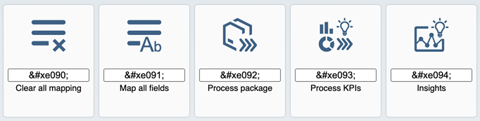

<!-- loio3a8dd1312c374a2983056247096772de -->

# What's New in SAPUI5 1.82

With this release SAPUI5 is upgraded from version 1.81 to 1.82.

****

<table>
<tr>
<th valign="top">

Version

</th>
<th valign="top">

Type

</th>
<th valign="top">

Category

</th>
<th valign="top">

Title

</th>
<th valign="top">

Description

</th>
<th valign="top">

Action

</th>
<th valign="top">

Available as of

</th>
</tr>
<tr>
<td valign="top">

1.82 

</td>
<td valign="top">

Changed 

</td>
<td valign="top">

Announcement 

</td>
<td valign="top">

**Third-Party Library Upgrades** 

</td>
<td valign="top">

**Third-Party Library Upgrades**

**`Handlebars.js` Library**

The `Handlebars.js` library has been upgraded from version 4.4.3 to 4.7.6.

**Upgrade to New jQuery Version**

We have upgraded the third-party jQuery library from jQuery 2.2.3 to jQuery 3.5.1. Several measures have been implemented to make this new version of jQuery delivered with SAPUI5 as compatible to the previous version as feasible. In particular, we have introduced a compatibility layer to ensure that most of your existing application or control code won't need adjustment. This could, however, introduce incompatibilities to the new jQuery version. For more information, see [Upgrading from a Version Below 1.82](../02_Read-Me-First/upgrading-from-a-version-below-1-82-147eef9.md) to understand any current and possible future impact.

Changed•Announcement•Info Only•1.82

</td>
<td valign="top">

Info Only

</td>
<td valign="top">

2020-09-17

</td>
</tr>
<tr>
<td valign="top">

1.82 

</td>
<td valign="top">

New 

</td>
<td valign="top">

Feature 

</td>
<td valign="top">

**Badge Implementation** 

</td>
<td valign="top">

**Badge Implementation**

Badges display very short and important information that attracts the user’s attention. We have made improvements in these controls to implement badge:

-   <code><b>sap.ui.integration.widgets.Card</b></code> – the badge is no longer in experimental state. For more information, see the [Text Badge](https://ui5.sap.com/test-resources/sap/ui/integration/demokit/cardExplorer/webapp/index.html#/integrate/badge) section and the [Sample](https://ui5.sap.com/test-resources/sap/ui/integration/demokit/cardExplorer/webapp/index.html#/explore/badge) in the Card Explorer.
-   <code><b>sap.m.Button</b></code> - the badge acts both as a visual eye catcher and as a counter to display a maximum of 4 digits or characters. It can be applied to any button type, but we recommend that you only use it on the `Default`, `Ghost`, `Transparent`, and `Emphasized` button types.

    

    For more information, see the [Sample](https://ui5.sap.com/#/entity/sap.m.Button/sample/sap.m.sample.ButtonWithBadge).

-   The **`<ui-integration-card>` HTML custom element** now supports text badges. For more information, see the [Sample](https://ui5.sap.com/test-resources/sap/ui/integration/demokit/cardExplorer/webapp/index.html#/explore/htmlConsumption) in the Card Explorer.

New•Feature•Info Only•1.82

</td>
<td valign="top">

Info Only 

</td>
<td valign="top">

2020-09-17

</td>
</tr>
<tr>
<td valign="top">

1.82 

</td>
<td valign="top">

Changed 

</td>
<td valign="top">

Feature 

</td>
<td valign="top">

**Five New Icons Available in the *SAP Fiori Tools* Icon Font** 

</td>
<td valign="top">

**Five New Icons Available in the *SAP Fiori Tools* Icon Font**

Find the icon that fits your needs via the [SAPUI5 Icon Explorer](https://ui5.sap.com/test-resources/sap/m/demokit/iconExplorer/webapp/index.html).

Changed•Feature•Info Only•1.82

</td>
<td valign="top">

Info Only 

</td>
<td valign="top">

2020-09-17

</td>
</tr>
<tr>
<td valign="top">

1.82 

</td>
<td valign="top">

Changed 

</td>
<td valign="top">

Feature 

</td>
<td valign="top">

**SAPUI5 OData V2 Model** 

</td>
<td valign="top">

**SAPUI5 OData V2 Model**

With the new version of the SAPUI5 OData V2 model, we introduced the new `ignoreMessages` binding parameter for the `sap.ui.model.odata.ODataPropertyBinding`. If `ignoreMessages` is set to `true`, model messages are not propagated to the binding. This is useful if a part of a composite binding is required for formatting, but not displayed itself.

Depending on their format options, some composite types, such as `sap.ui.model.type.Currency`, automatically ignore model messages for some of their parts. Setting this parameter to `true` or `false` overrules this default behavior.

Changed•Feature•Info Only•1.82

</td>
<td valign="top">

Info Only 

</td>
<td valign="top">

2020-09-17

</td>
</tr>
<tr>
<td valign="top">

1.82 

</td>
<td valign="top">

Changed 

</td>
<td valign="top">

Feature 

</td>
<td valign="top">

**SAPUI5 OData V4 Model** 

</td>
<td valign="top">

**SAPUI5 OData V4 Model**

The new version of the SAPUI5 OData V4 model introduces the following features:

-   The new `$$ignoreMessages` binding parameter is available for `sap.ui.model.odata.v4.ODataPropertyBinding`. If `$$ignoreMessages` is set to `true`, model messages are not propagated to the binding. This is useful if a part of a composite binding is required for formatting, but not displayed itself. Depending on their format options, some composite types such as `sap.ui.model.type.Currency` or `sap.ui.model.odata.type.Unit` automatically ignore model messages for some of their parts. Explicitly setting this parameter overrules this default.
-   The `sap.ui.model.odata.v4.Context#requestProperty` method now also works for properties that are not part of the `$select` option of the underlying binding and were not fetched previously.
-   The `sap.ui.model.odata.v4.Context#requestSideEffects` method now supports absolute paths. These must start with the entity container of the service, for example `/com.sap.gateway.default.iwbep.tea_busi.v0001.Container/TEAMS`.
-   `The sap.ui.model.odata.v4.Context#delete` method is now supported for kept-alive contexts. A context can be kept alive with the `sap.ui.model.odata.v4.Context#setKeepAlive` method introduced with SAPUI5 1.81.

> ### Restriction:  
> Due to the limited feature scope of this version of the SAPUI5 OData V4 model, check that all required features are in place before developing applications. Double-check the detailed documentation of the features, as certain parts of a feature may be missing. While we aim to be compatible with existing controls, some controls might not work due to small incompatibilities compared to `sap.ui.model.odata.(v2.)ODataModel`, or due to missing features in the model \(such as tree binding\). This also applies to smart controls \(`sap.ui.comp` library\) that do not support the SAPUI5 OData V4 model, as well as controls such as `TreeTable` and `AnalyticalTable`, which are not supported in combination with the SAPUI5 OData V4 model. The interface for applications has been changed for easier and more efficient use of the model. For a summary of these changes, see [Changes Compared to OData V2 Model](../04_Essentials/changes-compared-to-odata-v2-model-abd4d7c.md).

For more information, see [OData V4 Model](../04_Essentials/odata-v4-model-5de13cf.md), the [API Reference](https://ui5.sap.com/#/api/sap.ui.model.odata.v4), and the [Samples](https://ui5.sap.com/#/entity/sap.ui.model.odata.v4.ODataModel) in the Demo Kit.

Changed•Feature•Info Only•1.82

</td>
<td valign="top">

Info Only 

</td>
<td valign="top">

2020-09-17

</td>
</tr>
<tr>
<td valign="top">

1.82 

</td>
<td valign="top">

Changed 

</td>
<td valign="top">

Control 

</td>
<td valign="top">

**`sap.ui.comp.smartchart.SmartChart`** 

</td>
<td valign="top">

**`sap.ui.comp.smartchart.SmartChart`**

To display dates in a standardized format, the following calendar and fiscal OData V4 annotations are now supported:

-   `com.sap.vocabularies.Common.v1.IsFiscalYear`

-   `com.sap.vocabularies.Common.v1.IsFiscalYearPeriod`

-   `com.sap.vocabularies.Common.v1.IsCalendarYear`

-   `com.sap.vocabularies.Common.v1.IsCalendarYearQuarter`

-   `com.sap.vocabularies.Common.v1.IsCalendarYearMonth`

-   `com.sap.vocabularies.Common.v1.IsCalendarYearWeek`

For more information, see the [API Reference](https://ui5.sap.com/#/api/sap.ui.comp.smartchart.SmartChart%23annotations) for the annotations and the [Samples](https://ui5.sap.com/#/entity/sap.ui.comp.smartchart.SmartChart).

Changed•Control•Info Only•1.82

</td>
<td valign="top">

Info Only 

</td>
<td valign="top">

2020-09-17

</td>
</tr>
<tr>
<td valign="top">

1.82 

</td>
<td valign="top">

Changed 

</td>
<td valign="top">

Control 

</td>
<td valign="top">

**`sap.ui.comp.smartfilterbar.SmartFilterBar`** 

</td>
<td valign="top">

**`sap.ui.comp.smartfilterbar.SmartFilterBar`**

The look and feel of the *Adapt Filters* dialog has been improved and now shows the filtered content in a popup with collapsible groups of filter fields that are connected semantically. This way you can, for example, easily find a field label that occurs in several places in the dialog. You can also toggle between all available filter fields and the ones that are actually visible. The design of the dialog has also been simplified in some other places, for example, the arrangement of the buttons for further actions.

For more information, see the [Sample](https://ui5.sap.com/#/entity/sap.ui.comp.smartfilterbar.SmartFilterBar/sample/sap.ui.comp.sample.smartfilterbar.example1).

Changed•Control•Info Only•1.82

</td>
<td valign="top">

Info Only 

</td>
<td valign="top">

2020-09-17

</td>
</tr>
<tr>
<td valign="top">

1.82 

</td>
<td valign="top">

Changed 

</td>
<td valign="top">

Control 

</td>
<td valign="top">

**`sap.ui.comp.SmartForm`** 

</td>
<td valign="top">

**`sap.ui.comp.SmartForm`**

We have introduced the option to set `textInEditModeSource` to all smart fields inside `SmartForm`. You can add `defaultTextInEditModeSource` to the form as custom data and it will propagate to all smart fields that fulfill the conditions for supporting the `textInEditModeSource` property. Note that if you add `textInEditModeSource` as a property to `SmartField`, it will override the `defaultTextInEditModeSource` from the `SmartForm` custom data. For more information, see the [API Reference](https://ui5.sap.com/#/api/sap.ui.comp.smartfield.SmartField%23controlProperties) and the [Sample](https://ui5.sap.com/#/entity/sap.ui.comp.smartfield.SmartField/sample/sap.ui.comp.sample.smartfield.TextInEditModeSource).

Changed•Control•Info Only•1.82

</td>
<td valign="top">

Info Only 

</td>
<td valign="top">

2020-09-17

</td>
</tr>
<tr>
<td valign="top">

1.82 

</td>
<td valign="top">

Changed 

</td>
<td valign="top">

Control 

</td>
<td valign="top">

**`sap.ui.integration.widgets.Card`** 

</td>
<td valign="top">

**`sap.ui.integration.widgets.Card`**

We have updated the UI5 Web Components dependency of the Adaptive Cards to the v1.0.0-rc.8 version. With this update the Adaptive Cards receive the theming and custom theming support. Now you can use both High Contrast Black and High Contrast White themes, or add a custom theme, as the Web Components are compatible with the UI Theme Designer tool. For more information, see the [High Contrast Black](https://ui5.sap.com/test-resources/sap/ui/integration/demokit/cardExplorer/webapp/index.html?sap-ui-theme=sap_fiori_3_hcb#/explore/adaptive) and the [High Contrast White](https://ui5.sap.com/test-resources/sap/ui/integration/demokit/cardExplorer/webapp/index.html?sap-ui-theme=sap_fiori_3_hcw#/explore/adaptive) samples in the Card Explorer.

Changed•Control•Info Only•1.82

</td>
<td valign="top">

Info Only 

</td>
<td valign="top">

2020-09-17

</td>
</tr>
<tr>
<td valign="top">

1.82 

</td>
<td valign="top">

Changed 

</td>
<td valign="top">

SAP Fiori Elements 

</td>
<td valign="top">

**SAP Fiori Elements** 

</td>
<td valign="top">

**SAP Fiori Elements**

-   The finalizing action buttons now vary based on the mode of the object page. In create mode, the *Create* button is available and in edit mode, the *Save* button is available. For more information, see [Displaying Actions on the Object Page](../06_SAP_Fiori_Elements/displaying-actions-on-the-object-page-f65e8b1.md).

-   In the SAP Fiori elements list reports, the extensionAPI `invokeActions` now supports changeset processing. For more information, see [Using the extensionAPI](../06_SAP_Fiori_Elements/using-the-extensionapi-bd2994b.md).

-   In list reports and analytical list pages, the *Export to Excel* button is now available by default. For more information, see [Adapting the UI: List Report and Object Page](../06_SAP_Fiori_Elements/adapting-the-ui-list-report-and-object-page-0d2f1a9.md) and [Adapting the UI: Analytical List Page](../06_SAP_Fiori_Elements/adapting-the-ui-analytical-list-page-2c5fa29.md).

-   If you have defined default filter values in SAP Fiori Launchpad, they are now merged with the default filter values set in standard variant. This applies to list reports and analytical list pages. For more information, see [Configuring Default Filter Values](../06_SAP_Fiori_Elements/configuring-default-filter-values-f27ad7b.md).

-   Object pages now provide a new `BeforeSaveExtension`. For more information, see [Adapting Logic Before Save Operation](../06_SAP_Fiori_Elements/adapting-logic-before-save-operation-6a0a050.md).

-   On an analytical list page, each button of the *Adapt Filters* dialog in visual filter mode can be tweaked via UI adaptations. For more information, see [Adapting the UI: Analytical List Page](../06_SAP_Fiori_Elements/adapting-the-ui-analytical-list-page-2c5fa29.md).

Changed•SAP Fiori Elements•Info Only•1.82

</td>
<td valign="top">

Info Only 

</td>
<td valign="top">

2020-09-17

</td>
</tr>
</table>

**Related Information**  

[What's New in SAPUI5 1.128](what-s-new-in-sapui5-1-128-1f76220.md "With this release SAPUI5 is upgraded from version 1.127 to 1.128.")

[What's New in SAPUI5 1.127](what-s-new-in-sapui5-1-127-e5e1317.md "With this release SAPUI5 is upgraded from version 1.126 to 1.127.")

[What's New in SAPUI5 1.126](what-s-new-in-sapui5-1-126-1d98116.md "With this release SAPUI5 is upgraded from version 1.125 to 1.126.")

[What's New in SAPUI5 1.125](what-s-new-in-sapui5-1-125-9d87044.md "With this release SAPUI5 is upgraded from version 1.124 to 1.125.")

[What's New in SAPUI5 1.124](what-s-new-in-sapui5-1-124-7f77c3f.md "With this release SAPUI5 is upgraded from version 1.123 to 1.124.")

[What's New in SAPUI5 1.123](what-s-new-in-sapui5-1-123-9d00ac7.md "With this release SAPUI5 is upgraded from version 1.122 to 1.123.")

[What's New in SAPUI5 1.122](what-s-new-in-sapui5-1-122-5d078da.md "With this release SAPUI5 is upgraded from version 1.121 to 1.122.")

[What's New in SAPUI5 1.121](what-s-new-in-sapui5-1-121-91a4a2f.md "With this release SAPUI5 is upgraded from version 1.120 to 1.121.")

[What's New in SAPUI5 1.120](what-s-new-in-sapui5-1-120-2359b63.md "With this release SAPUI5 is upgraded from version 1.119 to 1.120.")

[What's New in SAPUI5 1.119](what-s-new-in-sapui5-1-119-0b1903a.md "With this release SAPUI5 is upgraded from version 1.118 to 1.119.")

[What's New in SAPUI5 1.118](what-s-new-in-sapui5-1-118-3eecbde.md "With this release SAPUI5 is upgraded from version 1.117 to 1.118.")

[What's New in SAPUI5 1.117](what-s-new-in-sapui5-1-117-029d3b4.md "With this release SAPUI5 is upgraded from version 1.116 to 1.117.")

[What's New in SAPUI5 1.116](what-s-new-in-sapui5-1-116-ebd6f34.md "With this release SAPUI5 is upgraded from version 1.115 to 1.116.")

[What's New in SAPUI5 1.115](what-s-new-in-sapui5-1-115-409fde8.md "With this release SAPUI5 is upgraded from version 1.114 to 1.115.")

[What's New in SAPUI5 1.114](what-s-new-in-sapui5-1-114-890fce1.md "With this release SAPUI5 is upgraded from version 1.113 to 1.114.")

[What's New in SAPUI5 1.113](what-s-new-in-sapui5-1-113-a9553fe.md "With this release SAPUI5 is upgraded from version 1.112 to 1.113.")

[What's New in SAPUI5 1.112](what-s-new-in-sapui5-1-112-34afc69.md "With this release SAPUI5 is upgraded from version 1.111 to 1.112.")

[What's New in SAPUI5 1.111](what-s-new-in-sapui5-1-111-7a67837.md "With this release SAPUI5 is upgraded from version 1.110 to 1.111.")

[What's New in SAPUI5 1.110](what-s-new-in-sapui5-1-110-71a855c.md "With this release SAPUI5 is upgraded from version 1.109 to 1.110.")

[What's New in SAPUI5 1.109](what-s-new-in-sapui5-1-109-3264bd2.md "With this release SAPUI5 is upgraded from version 1.108 to 1.109.")

[What's New in SAPUI5 1.108](what-s-new-in-sapui5-1-108-66e33f0.md "With this release SAPUI5 is upgraded from version 1.107 to 1.108.")

[What's New in SAPUI5 1.107](what-s-new-in-sapui5-1-107-d4ff916.md "With this release SAPUI5 is upgraded from version 1.106 to 1.107.")

[What's New in SAPUI5 1.106](what-s-new-in-sapui5-1-106-5b497b0.md "With this release SAPUI5 is upgraded from version 1.105 to 1.106.")

[What's New in SAPUI5 1.105](what-s-new-in-sapui5-1-105-4d6c00e.md "With this release SAPUI5 is upgraded from version 1.104 to 1.105.")

[What's New in SAPUI5 1.104](what-s-new-in-sapui5-1-104-69e567c.md "With this release SAPUI5 is upgraded from version 1.103 to 1.104.")

[What's New in SAPUI5 1.103](what-s-new-in-sapui5-1-103-0e98c76.md "With this release SAPUI5 is upgraded from version 1.102 to 1.103.")

[What's New in SAPUI5 1.102](what-s-new-in-sapui5-1-102-f038c99.md "With this release SAPUI5 is upgraded from version 1.101 to 1.102.")

[What's New in SAPUI5 1.101](what-s-new-in-sapui5-1-101-7733b00.md "With this release SAPUI5 is upgraded from version 1.100 to 1.101.")

[What's New in SAPUI5 1.100](what-s-new-in-sapui5-1-100-27dec1d.md "With this release SAPUI5 is upgraded from version 1.99 to 1.100.")

[What's New in SAPUI5 1.99](what-s-new-in-sapui5-1-99-4f35848.md "With this release SAPUI5 is upgraded from version 1.98 to 1.99.")

[What's New in SAPUI5 1.98](what-s-new-in-sapui5-1-98-d9f16f2.md "With this release SAPUI5 is upgraded from version 1.97 to 1.98.")

[What's New in SAPUI5 1.97](what-s-new-in-sapui5-1-97-fa0e282.md "With this release SAPUI5 is upgraded from version 1.96 to 1.97.")

[What's New in SAPUI5 1.96](what-s-new-in-sapui5-1-96-7a9269f.md "With this release SAPUI5 is upgraded from version 1.95 to 1.96.")

[What's New in SAPUI5 1.95](what-s-new-in-sapui5-1-95-a1aea67.md "With this release SAPUI5 is upgraded from version 1.94 to 1.95.")

[What's New in SAPUI5 1.94](what-s-new-in-sapui5-1-94-c40f1e6.md "With this release SAPUI5 is upgraded from version 1.93 to 1.94.")

[What's New in SAPUI5 1.93](what-s-new-in-sapui5-1-93-f273340.md "With this release SAPUI5 is upgraded from version 1.92 to 1.93.")

[What's New in SAPUI5 1.92](what-s-new-in-sapui5-1-92-1ef345d.md "With this release SAPUI5 is upgraded from version 1.91 to 1.92.")

[What's New in SAPUI5 1.91](what-s-new-in-sapui5-1-91-0a2bd79.md "With this release SAPUI5 is upgraded from version 1.90 to 1.91.")

[What's New in SAPUI5 1.90](what-s-new-in-sapui5-1-90-91c10c2.md "With this release SAPUI5 is upgraded from version 1.89 to 1.90.")

[What's New in SAPUI5 1.89](what-s-new-in-sapui5-1-89-e56cddc.md "With this release SAPUI5 is upgraded from version 1.88 to 1.89.")

[What's New in SAPUI5 1.88](what-s-new-in-sapui5-1-88-e15a206.md "With this release SAPUI5 is upgraded from version 1.87 to 1.88.")

[What's New in SAPUI5 1.87](what-s-new-in-sapui5-1-87-b506da7.md "With this release SAPUI5 is upgraded from version 1.86 to 1.87.")

[What's New in SAPUI5 1.86](what-s-new-in-sapui5-1-86-4c1c959.md "With this release SAPUI5 is upgraded from version 1.85 to 1.86.")

[What's New in SAPUI5 1.85](what-s-new-in-sapui5-1-85-1d18eb5.md "With this release SAPUI5 is upgraded from version 1.84 to 1.85.")

[What's New in SAPUI5 1.84](what-s-new-in-sapui5-1-84-dc76640.md "With this release SAPUI5 is upgraded from version 1.82 to 1.84.")

[What's New in SAPUI5 1.81](what-s-new-in-sapui5-1-81-f5e2a21.md "With this release SAPUI5 is upgraded from version 1.80 to 1.81.")

[What's New in SAPUI5 1.80](what-s-new-in-sapui5-1-80-8cee506.md "With this release SAPUI5 is upgraded from version 1.79 to 1.80.")

[What's New in SAPUI5 1.79](what-s-new-in-sapui5-1-79-99c4cdc.md "With this release SAPUI5 is upgraded from version 1.78 to 1.79.")

[What's New in SAPUI5 1.78](what-s-new-in-sapui5-1-78-f09b63e.md "With this release SAPUI5 is upgraded from version 1.77 to 1.78.")

[What's New in SAPUI5 1.77](what-s-new-in-sapui5-1-77-c46b439.md "With this release SAPUI5 is upgraded from version 1.76 to 1.77.")

[What's New in SAPUI5 1.76](what-s-new-in-sapui5-1-76-aad03b5.md "With this release SAPUI5 is upgraded from version 1.75 to 1.76.")

[What's New in SAPUI5 1.75](what-s-new-in-sapui5-1-75-5cbb62d.md "With this release SAPUI5 is upgraded from version 1.74 to 1.75.")

[What's New in SAPUI5 1.74](what-s-new-in-sapui5-1-74-c22208a.md "With this release SAPUI5 is upgraded from version 1.73 to 1.74.")

[What's New in SAPUI5 1.73](what-s-new-in-sapui5-1-73-231dd13.md "With this release SAPUI5 is upgraded from version 1.72 to 1.73.")

[What's New in SAPUI5 1.72](what-s-new-in-sapui5-1-72-521cad9.md "With this release SAPUI5 is upgraded from version 1.71 to 1.72.")

[What's New in SAPUI5 1.71](what-s-new-in-sapui5-1-71-a93a6a3.md "With this release SAPUI5 is upgraded from version 1.70 to 1.71.")

[What's New in SAPUI5 1.70](what-s-new-in-sapui5-1-70-f073d69.md "With this release SAPUI5 is upgraded from version 1.69 to 1.70.")

[What's New in SAPUI5 1.69](what-s-new-in-sapui5-1-69-89a18bd.md "With this release SAPUI5 is upgraded from version 1.68 to 1.69.")

[What's New in SAPUI5 1.68](what-s-new-in-sapui5-1-68-f94bf93.md "With this release SAPUI5 is upgraded from version 1.67 to 1.68.")

[What's New in SAPUI5 1.67](what-s-new-in-sapui5-1-67-a6b1472.md "With this release SAPUI5 is upgraded from version 1.66 to 1.67.")

[What's New in SAPUI5 1.66](what-s-new-in-sapui5-1-66-c9896e9.md "With this release SAPUI5 is upgraded from version 1.65 to 1.66.")

[What's New in SAPUI5 1.65](what-s-new-in-sapui5-1-65-0f5acfd.md "With this release SAPUI5 is upgraded from version 1.64 to 1.65.")

[What's New in SAPUI5 1.64](what-s-new-in-sapui5-1-64-0e30822.md "With this release SAPUI5 is upgraded from version 1.63 to 1.64.")

[What's New in SAPUI5 1.63](what-s-new-in-sapui5-1-63-e8d9da7.md "With this release SAPUI5 is upgraded from version 1.62 to 1.63.")

[What's New in SAPUI5 1.62](what-s-new-in-sapui5-1-62-771f4d5.md "With this release SAPUI5 is upgraded from version 1.61 to 1.62.")

[What's New in SAPUI5 1.61](what-s-new-in-sapui5-1-61-d991552.md "With this release SAPUI5 is upgraded from version 1.60 to 1.61.")

[What's New in SAPUI5 1.60](what-s-new-in-sapui5-1-60-5a0e1f7.md "With this release SAPUI5 is upgraded from version 1.58 to 1.60.")

[What's New in SAPUI5 1.58](what-s-new-in-sapui5-1-58-7c927aa.md "With this release SAPUI5 is upgraded from version 1.56 to 1.58.")

[What's New in SAPUI5 1.56](what-s-new-in-sapui5-1-56-108b7fd.md "With this release SAPUI5 is upgraded from version 1.54 to 1.56.")

[What's New in SAPUI5 1.54](what-s-new-in-sapui5-1-54-c838330.md "With this release SAPUI5 is upgraded from version 1.52 to 1.54.")

[What's New in SAPUI5 1.52](what-s-new-in-sapui5-1-52-849e1b6.md "With this release SAPUI5 is upgraded from version 1.50 to 1.52.")

[What's New in SAPUI5 1.50](what-s-new-in-sapui5-1-50-759e9f3.md "With this release SAPUI5 is upgraded from version 1.48 to 1.50.")

[What's New in SAPUI5 1.48](what-s-new-in-sapui5-1-48-fa1efac.md "With this release SAPUI5 is upgraded from version 1.46 to 1.48.")

[What's New in SAPUI5 1.46](what-s-new-in-sapui5-1-46-6307539.md "With this release SAPUI5 is upgraded from version 1.44 to 1.46.")

[What's New in SAPUI5 1.44](what-s-new-in-sapui5-1-44-a0cb7a0.md "With this release SAPUI5 is upgraded from version 1.42 to 1.44.")

[What's New in SAPUI5 1.42](what-s-new-in-sapui5-1-42-468b05d.md "With this release SAPUI5 is upgraded from version 1.40 to 1.42.")

[What's New in SAPUI5 1.40](what-s-new-in-sapui5-1-40-fbab50e.md "With this release SAPUI5 is upgraded from version 1.38 to 1.40.")

[What's New in SAPUI5 1.38](what-s-new-in-sapui5-1-38-f218918.md "With this release SAPUI5 is upgraded from version 1.36 to 1.38.")

