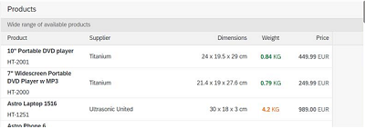

<!-- loioeeb5bd913fe448598e0449050143027a -->

# What's New in SAPUI5 1.85

With this release SAPUI5 is upgraded from version 1.84 to 1.85.

<a name="loioeeb5bd913fe448598e0449050143027a__section_qwl_pb5_zcb"/>

## Improved Features

<table>
<tr>
<td valign="top">

**SAPUI5 OData V4 Model**

The new version of the SAPUI5 OData V4 model introduces the following features:

-   We now provide the `sap.ui.model.odata.v4.ODataModel#getMessages` method for use by `sap.ui.model.Context#getMessages`. Both methods can be used to highlight table rows with messages. For more information, see [Highlighting Table Rows with Messages](../04_Essentials/server-messages-in-the-odata-v4-model-fbe1cb5.md#loiofbe1cb5613cf4a40a841750bf813238e__section_highlighting_table_rows).

-   The `sap.ui.model.odata.v4.ODataListBinding#refresh` method is now supported for kept-alive contexts. A list binding context can be kept alive with the `sap.ui.model.odata.v4.Context#setKeepAlive` method introduced with SAPUI5 1.81.
-   When using `groupLevels` with the `$$aggregation` list binding parameter, we now support grand totals.
-   `TargetProperties` of type `edm.String` are supported in accordance with recent changes to the `SideEffectsType` and can be directly provided to the `sap.ui.model.odata.v4.Context#requestSideEffects` method.
-   You can now set the value of an instance annotation for a newly created or already existing entity. The set value is sent to the back end in a `POST` or `PATCH` request, respectively.

For more information, see [OData V4 Model](../04_Essentials/odata-v4-model-5de13cf.md), the [API Reference](https://ui5.sap.com/#/api/sap.ui.model.odata.v4), and the [Samples](https://ui5.sap.com/#/entity/sap.ui.model.odata.v4.ODataModel) in the Demo Kit.

</td>
</tr>
<tr>
<td valign="top">

**Special Messaging Support for Visually Impaired Users**

The `sap.ui.core.InvisibleMessage` class is no longer experimental. This class is used to programmatically expose dynamic content changes that can be announced by the screen reader. For more information, see [Invisible Messaging](../05_Developing_Apps/invisible-messaging-b9a7d6f.md), the [API Reference](https://ui5.sap.com/#/api/sap.ui.core.InvisibleMessage) and the [Sample](https://ui5.sap.com/#/entity/sap.ui.core.InvisibleMessage).

</td>
</tr>
</table>

<a name="loioeeb5bd913fe448598e0449050143027a__section_rqn_wd5_zcb"/>

## Improved Controls

<table>
<tr>
<td valign="top">

**`sap.f.GridContainer`**

We have improved the two-dimensional keyboard navigation. Now navigation using the [Arrow Keys\] follows the configurable two-dimensional grid. This model provides stable navigation paths when there are items of different sizes. When the user presses an [Arrow Key\] in a direction outward of the `GridContainer`, a `borderReached` event is fired. The implementation of the `borderReached` event allows the application developer to control where the focus goes and \(depending on the surrounding layout\) to pass the focus to a specific place in a neighboring `GridContainer` using the `GridContainer#focusItemByDirection` method. For more information, see the [API Reference](https://ui5.sap.com/#/api/sap.f.GridContainer) and the [Sample](https://ui5.sap.com/#/entity/sap.f.GridContainer/sample/sap.f.sample.GridContainersNavigation). 

</td>
</tr>
<tr>
<td valign="top">

**`sap.m.Bar`**

We have added a new `titleAlignment` property. It enables developers to create custom headers for controls that use headers based on `sap.m.Bar` and to achieve proper title alignment. To keep the default `Bar` behavior \(when it is not used as a header\), we have added a new value `None` \(default\) to the `sap.m.TitleAlignment` enumeration. If the `titleAlignment` value is set to `Start` or `Center`, the horizontal alignment of the `contentMiddle` aggregation of `sap.m.Bar` accepts the same setting. If the `titleAlignment` is set to `Auto`, the `contentMiddle` aggregation is set according to the default theme setting. For more information, see the [API Reference](https://ui5.sap.com/#/api/sap.m.Bar).

</td>
</tr>
<tr>
<td valign="top">

**`sap.m.ColorPalette`, `sap.m.ColorPalettePopover`, and `sap.ui.unified.ColorPickerPopover`**

A `liveChange` event is now available in these controls, which are using the `sap.ui.unified.ColorPicker` internally. This event is used to propagate real-time color changes from inside the `ColorPicker` before closing the popover that contains this `ColorPicker`. For more information, see the [ColorPickerPopover](https://ui5.sap.com/#/entity/sap.ui.unified.ColorPicker/sample/sap.ui.unified.sample.ColorPickerPopover) and the [ColorPalettePopover](https://ui5.sap.com/#/entity/sap.m.ColorPalette/sample/sap.m.sample.ColorPalettePopover) samples.

</td>
</tr>
<tr>
<td valign="top">

**`sap.m.SinglePlanningCalendar`**

The `specialDates` aggregation, which allows you to define special dates for the control, is now visible in the Month view for all supported SAP themes. For more information, see the [API Reference](https://ui5.sap.com/#/api/sap.m.SinglePlanningCalendar).

</td>
</tr>
<tr>
<td valign="top">

**`sap.m.Table`**

> ### Caution:  
> This feature is no longer in place as of 1.85.1. as the default behavior . For more information , see the What’s New in 1.86 and the [API Reference](https://ui5.sap.com/#/api/sap.m.Table) for `fixedLayout`. 

If the sum of the width of all columns in a table is less than the available space for the whole table, we now render a placeholder column to occupy the remaining unused space.This feature is enabled by default.

  

For more information, see the [API Reference](https://ui5.sap.com/#/api/sap.m.Table).

</td>
</tr>
<tr>
<td valign="top">

**`sap.ui.comp.smartfield.SmartField`**

We've updated the object status icons of the `SmartField` according to the latest [SAP Fiori design guidelines](https://experience.sap.com/fiori-design-web/object-display-elements/).

</td>
</tr>
<tr>
<td valign="top">

**`sap.ui.comp.smartfilterbar.SmartFilterBar, sap.ui.comp.smartfield.SmartField`**

-   We have enabled the support of a `ValueListParameterConstant` as a `valueList` property of the `Common.v1.ValueList` annotation. This constant specifies a unique value that is used to get an exact match result of your queries. It affects the autocomplete suggestion feature and the value help option. Parameters with a constant value are not shown in the filter bar of the `ValueHelpDialog` as filterable fields.

     For more information, see the [Sample](https://ui5.sap.com/#/entity/sap.ui.comp.smartfield.SmartField/sample/sap.ui.comp.sample.smartfield.WithValueListAndConstantParameter). 

-   Until now, the recently used values function didn't take into account possible language changes in the application. Now, if you use your application in one language and switch the language in SAP Fiori launchpad, the recently used values consider this change and store the data for the different languages. Note that all data stored before the introduction of this feature will be displayed in the field history only when the application is in English.

</td>
</tr>
<tr>
<td valign="top">

**`sap.ui.integration.widgets.Card`**

-   You can now configure the `min-height` of the content within Analytical and Component cards. To achieve this, add the <code>“minHeight”: “&lt;<i>CSS value</i>&gt;”</code> property to the `content` section of the manifest. For more information, see the [Analytical Card](https://ui5.sap.com/test-resources/sap/ui/integration/demokit/cardExplorer/webapp/index.html#/learn/types/analytical) and [Component Card](https://ui5.sap.com/test-resources/sap/ui/integration/demokit/cardExplorer/webapp/index.html#/learn/types/component) sections in the Card Explorer.

-   We have added a new `actionDefinitions` \(experimental\) aggregation. It defines the action buttons that appear in the card-header menu. The `actionDefinitions` is of type `sap.ui.integation.ActionDefinition`, which allows developers to add, remove, or modify the actions at any time. This aggregation replaces the \(deprecated\) `actions` property of `sap.ui.integration.Extension`. For more information, see the [API Reference](https://ui5.sap.com/#/api/sap.ui.integration.widgets.Card/Aggregations) in the Demo Kit and the [Extension](https://ui5.sap.com/test-resources/sap/ui/integration/demokit/cardExplorer/webapp/index.html#/explore/extension/customActions) and [Component Card](https://ui5.sap.com/test-resources/sap/ui/integration/demokit/cardExplorer/webapp/index.html#/explore/component/customActions) samples in the Card Explorer.

</td>
</tr>
</table>

<a name="loioeeb5bd913fe448598e0449050143027a__section_g3r_bf5_zcb"/>

## SAP Fiori Elements

<table>
<tr>
<td valign="top">

The following changes and new features are available for SAP Fiori elements for OData V2:

-   In object pages, if the subsection has only one type of content \(table or chart\), and the subsection title is the same as the control title, then only the control title is displayed in the subsection. For more information, see [Adding Titles to Object Page Tables](../06_SAP_Fiori_Elements/adding-titles-to-object-page-tables-d9a4539.md).

-   Analytical list pages now enable visual filter charts to convey information in an intuitive manner. This is done using semantic colors for filter values that are compared against predefined colors for dimension values. For more information, see [Enabling Semantic Operators in the Filter Bar](../06_SAP_Fiori_Elements/enabling-semantic-operators-in-the-filter-bar-fef65d0.md).

-   Analytical list pages now support the `QuickInfo` property for visual filters.

-   Technical errors are now displayed in a popup, instead of navigating to a separate error page.

</td>
</tr>
<tr>
<td valign="top">

The following changes and new features are available for SAP Fiori elements for OData V4:

-   Value help with a dropdown list now also supports text arrangement with `#textFirst`, `#textLast`. For more information, see [Value Help as a Dropdown List](../06_SAP_Fiori_Elements/value-help-as-a-dropdown-list-2a0a630.md).

-   Key users can now move and rename sections and subsections on the object page. For more information, see [Adapting the UI: List Report and Object Page](../06_SAP_Fiori_Elements/adapting-the-ui-list-report-and-object-page-0d2f1a9.md).

-   You can now define context-dependent value help via the `Common.ValueListRelevantQualifiers` annotation term. For more information, see [Configuring Fields](../06_SAP_Fiori_Elements/configuring-fields-4b50f21.md).

-   You can now exclude specific fields from the table personalization dialog in the list report and object page. For more information, see [Tables](../06_SAP_Fiori_Elements/tables-c0f6592.md).

-   You can now add custom fields and facets on the object page header. For more information, see [Extension Points for Object Page Header Facets](../06_SAP_Fiori_Elements/extension-points-for-object-page-header-facets-61cf0ee.md).

-   If you have added custom content to your app, you can now adjust the inner-app state. For more information, refer to [Custom State Handling for Extended Apps](../06_SAP_Fiori_Elements/custom-state-handling-for-extended-apps-89fa878.md).

-   The navigation behavior of an app after executing an action has been updated. The navigation after executing an action is triggered, by default, only when the entity type of the returned instance is the same and the returned instance is different from the current instance against which the action was called. For more information, see [Configuring Internal Navigation](../06_SAP_Fiori_Elements/configuring-internal-navigation-2c65f07.md).

-   List reports now support default values for the filter fields when the standard variant is used. The default values can be specified via annotations. For more information, see [Configuring Default Filter Values](../06_SAP_Fiori_Elements/configuring-default-filter-values-f27ad7b.md).

-   You can now highlight important values in blue, so that users know immediately which values require their attention within a large table view. For more information, see [Status Colors and Icons](../06_SAP_Fiori_Elements/status-colors-and-icons-1641180.md).

-   You can now use the `operatorConfiguration` option to include or exclude specific date range operations when using a semantic date range. For more information, see [Enabling Semantic Operators in the Filter Bar](../06_SAP_Fiori_Elements/enabling-semantic-operators-in-the-filter-bar-fef65d0.md).

-   You can now adapt the size of micro charts in responsive tables and configure the label. For more information, see [Adding a Micro Chart to a Table](../06_SAP_Fiori_Elements/adding-a-micro-chart-to-a-table-b8312a4.md).

-   In the list report, users can now create a dynamic tile with a record count, where the applied filter is also considered. For more information, see ["Share" Functionality](../06_SAP_Fiori_Elements/share-functionality-022bf0d.md).

-   If a property has a `SemanticObject` annotation, but no navigation is available from this application for this `SemanticObject`, the link is displayed as a text.

-   You can now have several entity sets in parallel in the list report. The list report shows multiple tables via tabs, and each table can be based on different entity sets. For more information, see [Defining Multiple Views on a List Report with Different Entity Sets and Table Settings](../06_SAP_Fiori_Elements/defining-multiple-views-on-a-list-report-with-different-entity-sets-and-table-settings-b6b59e4.md).

-   If the copy/paste feature is available on the object page, the 'Export to Spreadsheet' feature is now available by default. It can be disabled. A message is displayed to users when they click on the *Paste* button to paste data into tables, informing about the correct keyboard shortcut combination they should use, based on the desktop device they are using. For more information, see [Copying and Pasting from Spreadsheet Applications to Tables](../06_SAP_Fiori_Elements/copying-and-pasting-from-spreadsheet-applications-to-tables-f6a8fd2.md).

-   By using the *Information* criticality type on the `LineItem`, you can now highlight \(in blue\) new items that were created outside of the app \(for example, through an API in the back end, or as a side effect\) and need the user's attention, . For more information, see [Highlighting Line Items Based on Criticality](../06_SAP_Fiori_Elements/highlighting-line-items-based-on-criticality-0d501b1.md).

</td>
</tr>
</table>

**Parent topic:** [Previous Versions](previous-versions-6660a59.md "")

**Related Information**  

[What's New in SAPUI5 1.105](what-s-new-in-sapui5-1-105-5567dcc.md "With this release SAPUI5 is upgraded from version 1.104 to 1.105.")

[What's New in SAPUI5 1.104](what-s-new-in-sapui5-1-104-f01ebd4.md "With this release SAPUI5 is upgraded from version 1.103 to 1.104.")

[What's New in SAPUI5 1.103](what-s-new-in-sapui5-1-103-7534ae8.md "With this release SAPUI5 is upgraded from version 1.102 to 1.103.")

[What's New in SAPUI5 1.102](what-s-new-in-sapui5-1-102-b530db3.md "With this release SAPUI5 is upgraded from version 1.101 to 1.102.")

[What's New in SAPUI5 1.101](what-s-new-in-sapui5-1-101-5a18410.md "With this release SAPUI5 is upgraded from version 1.100 to 1.101.")

[What's New in SAPUI5 1.100](what-s-new-in-sapui5-1-100-5deb78f.md "With this release SAPUI5 is upgraded from version 1.99 to 1.100.")

[What's New in SAPUI5 1.99](what-s-new-in-sapui5-1-99-5e35c25.md "With this release SAPUI5 is upgraded from version 1.98 to 1.99.")

[What's New in SAPUI5 1.98](what-s-new-in-sapui5-1-98-7aacb4e.md "With this release SAPUI5 is upgraded from version 1.97 to 1.98.")

[What's New in SAPUI5 1.97](what-s-new-in-sapui5-1-97-f21858f.md "With this release SAPUI5 is upgraded from version 1.96 to 1.97.")

[What's New in SAPUI5 1.96](what-s-new-in-sapui5-1-96-b39a11b.md "With this release SAPUI5 is upgraded from version 1.95 to 1.96.")

[What's New in SAPUI5 1.95](what-s-new-in-sapui5-1-95-1b09465.md "With this release SAPUI5 is upgraded from version 1.94 to 1.95.")

[What's New in SAPUI5 1.94](what-s-new-in-sapui5-1-94-2d6ffdd.md "With this release SAPUI5 is upgraded from version 1.93 to 1.94.")

[What's New in SAPUI5 1.93](what-s-new-in-sapui5-1-93-e9c8356.md "With this release SAPUI5 is upgraded from version 1.92 to 1.93.")

[What's New in SAPUI5 1.92](what-s-new-in-sapui5-1-92-1492551.md "With this release SAPUI5 is upgraded from version 1.91 to 1.92.")

[What's New in SAPUI5 1.91](what-s-new-in-sapui5-1-91-75777da.md "With this release SAPUI5 is upgraded from version 1.90 to 1.91.")

[What's New in SAPUI5 1.90](what-s-new-in-sapui5-1-90-b475202.md "With this release SAPUI5 is upgraded from version 1.89 to 1.90.")

[What's New in SAPUI5 1.89](what-s-new-in-sapui5-1-89-0805036.md "With this release SAPUI5 is upgraded from version 1.88 to 1.89.")

[What's New in SAPUI5 1.88](what-s-new-in-sapui5-1-88-bda141b.md "With this release SAPUI5 is upgraded from version 1.87 to 1.88.")

[What's New in SAPUI5 1.87](what-s-new-in-sapui5-1-87-e315108.md "With this release SAPUI5 is upgraded from version 1.86 to 1.87.")

[What's New in SAPUI5 1.86](what-s-new-in-sapui5-1-86-067e2fb.md "With this release SAPUI5 is upgraded from version 1.85 to 1.86.")

[What's New in SAPUI5 1.84](what-s-new-in-sapui5-1-84-ccf76b7.md "With this release SAPUI5 is upgraded from version 1.82 to 1.84.")

[What's New in SAPUI5 1.82](what-s-new-in-sapui5-1-82-f081cf0.md "With this release SAPUI5 is upgraded from version 1.81 to 1.82.")

[What's New in SAPUI5 1.81](what-s-new-in-sapui5-1-81-f71563c.md "With this release SAPUI5 is upgraded from version 1.80 to 1.81.")

[What's New in SAPUI5 1.80](what-s-new-in-sapui5-1-80-3294c68.md "With this release SAPUI5 is upgraded from version 1.79 to 1.80.")

[What's New in SAPUI5 1.79](what-s-new-in-sapui5-1-79-edf8e35.md "With this release SAPUI5 is upgraded from version 1.78 to 1.79.")

[What's New in SAPUI5 1.78](what-s-new-in-sapui5-1-78-d176be3.md "With this release SAPUI5 is upgraded from version 1.77 to 1.78.")

[What's New in SAPUI5 1.77](what-s-new-in-sapui5-1-77-2ec6b6b.md "With this release SAPUI5 is upgraded from version 1.76 to 1.77.")

[What's New in SAPUI5 1.76](what-s-new-in-sapui5-1-76-b9b0a3f.md "With this release SAPUI5 is upgraded from version 1.75 to 1.76.")

[What's New in SAPUI5 1.75](what-s-new-in-sapui5-1-75-dc3d3ce.md "With this release SAPUI5 is upgraded from version 1.74 to 1.75.")

[What's New in SAPUI5 1.74](what-s-new-in-sapui5-1-74-21fc6cb.md "With this release SAPUI5 is upgraded from version 1.73 to 1.74.")

[What's New in SAPUI5 1.73](what-s-new-in-sapui5-1-73-7b82664.md "With this release SAPUI5 is upgraded from version 1.72 to 1.73.")

[What's New in SAPUI5 1.72](what-s-new-in-sapui5-1-72-25e5326.md "With this release SAPUI5 is upgraded from version 1.71 to 1.72.")

[What's New in SAPUI5 1.71](what-s-new-in-sapui5-1-71-609fd01.md "With this release SAPUI5 is upgraded from version 1.70 to 1.71.")

[What's New in SAPUI5 1.70](what-s-new-in-sapui5-1-70-4e89fee.md "With this release SAPUI5 is upgraded from version 1.69 to 1.70.")

[What's New in SAPUI5 1.69](what-s-new-in-sapui5-1-69-41203fd.md "With this release SAPUI5 is upgraded from version 1.68 to 1.69.")

[What's New in SAPUI5 1.68](what-s-new-in-sapui5-1-68-5531aef.md "With this release SAPUI5 is upgraded from version 1.67 to 1.68.")

[What's New in SAPUI5 1.67](what-s-new-in-sapui5-1-67-0968958.md "With this release SAPUI5 is upgraded from version 1.66 to 1.67.")

[What's New in SAPUI5 1.66](what-s-new-in-sapui5-1-66-ebe7fda.md "With this release SAPUI5 is upgraded from version 1.65 to 1.66.")

[What's New in SAPUI5 1.65](what-s-new-in-sapui5-1-65-9d2b189.md "With this release SAPUI5 is upgraded from version 1.64 to 1.65.")

[What's New in SAPUI5 1.64](what-s-new-in-sapui5-1-64-1975e30.md "With this release SAPUI5 is upgraded from version 1.63 to 1.64.")

[What's New in SAPUI5 1.63](what-s-new-in-sapui5-1-63-77e1dcc.md "With this release SAPUI5 is upgraded from version 1.62 to 1.63.")

[What's New in SAPUI5 1.62](what-s-new-in-sapui5-1-62-27eea38.md "With this release SAPUI5 is upgraded from version 1.61 to 1.62.")

[What's New in SAPUI5 1.61](what-s-new-in-sapui5-1-61-de4d50b.md "With this release SAPUI5 is upgraded from version 1.60 to 1.61.")

[What's New in SAPUI5 1.60](what-s-new-in-sapui5-1-60-2a70354.md "With this release SAPUI5 is upgraded from version 1.58 to 1.60.")

[What's New in SAPUI5 1.58](what-s-new-in-sapui5-1-58-b28edde.md "With this release, SAPUI5 is upgraded from version 1.56 to 1.58.")

[What's New in SAPUI5 1.56](what-s-new-in-sapui5-1-56-53b4b5e.md "With this release, SAPUI5 is upgraded from version 1.54 to 1.56.")

[What's New in SAPUI5 1.54](what-s-new-in-sapui5-1-54-f29023e.md "With this release, SAPUI5 is upgraded from version 1.52 to 1.54.")

[What's New in SAPUI5 1.52](what-s-new-in-sapui5-1-52-a09dd79.md "With this release, SAPUI5 is upgraded from version 1.50 to 1.52.")

[What's New in SAPUI5 1.50](what-s-new-in-sapui5-1-50-a844984.md "With this release, SAPUI5 is upgraded from version 1.48 to 1.50.")

[What's New in SAPUI5 1.48](what-s-new-in-sapui5-1-48-2818f80.md "With this release, SAPUI5 is upgraded from version 1.46 to 1.48.")

[What's New in SAPUI5 1.46](what-s-new-in-sapui5-1-46-4cf0986.md "With this release, SAPUI5 is upgraded from version 1.44 to 1.46.")

[What's New in SAPUI5 1.44](what-s-new-in-sapui5-1-44-05ce1dc.md "With this release, SAPUI5 is upgraded from version 1.42 to 1.44.")

[What's New in SAPUI5 1.42](what-s-new-in-sapui5-1-42-4768f1a.md "With this release, SAPUI5 is upgraded from version 1.40 to 1.42.")

[What's New in SAPUI5 1.40](what-s-new-in-sapui5-1-40-e659bd2.md "With this release, SAPUI5 is upgraded from version 1.38 to 1.40.")

[What's New in SAPUI5 1.38](what-s-new-in-sapui5-1-38-6a875f9.md#loio6a875f998994489483e8085705347d72 "With this release, SAPUI5 is upgraded from version 1.36 to 1.38.")

