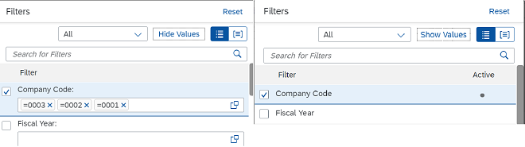

<!-- loio4c1c95953602429798faec98065f2096 -->

# What's New in SAPUI5 1.86

With this release SAPUI5 is upgraded from version 1.85 to 1.86.

** **

<table>
<tr>
<th valign="top">

Version

</th>
<th valign="top">

Type

</th>
<th valign="top">

Category

</th>
<th valign="top">

Title

</th>
<th valign="top">

Description

</th>
<th valign="top">

Action

</th>
<th valign="top">

Available as of

</th>
</tr>
<tr>
<td valign="top">

 1.86 

</td>
<td valign="top">

 Deprecated 

</td>
<td valign="top">

 Announcement 

</td>
<td valign="top">

 **Preannouncement: End of Support for Microsoft Internet Explorer 11 after SAPUI5 1.87** 

</td>
<td valign="top">

**Preannouncement: End of Support for Microsoft Internet Explorer 11 after SAPUI5 1.87**

SAPUI5 1.87 will be the last version to support Microsoft Internet Explorer 11. For more information, see [SAPUI5 Support Status for Microsoft Internet Explorer 11](../02_Read-Me-First/browser-and-platform-support-74b59ef.md#loio74b59efa0eef48988d3b716bd0ecc933__MS_IE).

Deprecated•Announcement•Info Only•1.86

</td>
<td valign="top">

Info Only

</td>
<td valign="top">

2021-01-28

</td>
</tr>
<tr>
<td valign="top">

 1.86 

</td>
<td valign="top">

 Changed 

</td>
<td valign="top">

 Feature 

</td>
<td valign="top">

 **SAPUI5 OData V4 Model** 

</td>
<td valign="top">

**SAPUI5 OData V4 Model**

The new version of the SAPUI5 OData V4 model introduces the following features:

-   A new `unit` property within the `aggregate` map of the `$$aggregation` list binding parameter.

    You can use it to determine the correct currency or unit value for the grand total, as well as subtotals. Note that the name provided for `unit` has to refer to a structural property as well as to a custom aggregate. The custom aggregate has to provide the single value of that unit if there is only one, or `null` if there is more than one distinct value.

-   New `grandTotalAtBottomOnly` and `subtotalsAtBottomOnly` properties in the `$$aggregation` list binding parameter. For more information, see [`sap.ui.model.odata.v4.ODataListBinding#setAggregation`](https://ui5.sap.com/#/api/sap.ui.model.odata.v4.ODataListBinding/methods/setAggregation).
-   You can now filter by properties that are not aggregated when using visual grouping, that is when having `groupLevels` defined in the `$$aggregation` list binding parameter.
-   If the `$$patchWithoutSideEffects` binding parameter is set, `PATCH` requests are now sent out with the `return=minimal` preference in the [`Prefer` header](http://docs.oasis-open.org/odata/odata/v4.0/errata03/os/complete/part1-protocol/odata-v4.0-errata03-os-part1-protocol-complete.html#_Toc453752234). This allows the server to skip the determination of the response.
-   The `sap.ui.model.odata.v4.ODataListBinding#refresh` method can now handle several kept-alive contexts, and also a kept-alive context that has been deleted in the back end, for example due to a side effect. Note that refreshing dependent bindings relative to the context of a deleted entity will fail as that entity no longer exists.

    A list binding context can be kept alive with the `sap.ui.model.odata.v4.Context#setKeepAlive` method introduced with SAPUI5 1.81.

For more information, see [OData V4 Model](../04_Essentials/odata-v4-model-5de13cf.md), the [API Reference](https://ui5.sap.com/#/api/sap.ui.model.odata.v4), and the [Samples](https://ui5.sap.com/#/entity/sap.ui.model.odata.v4.ODataModel) in the Demo Kit.

Changed•Feature•Info Only•1.86

</td>
<td valign="top">

 Info Only 

</td>
<td valign="top">

2021-01-28

</td>
</tr>
<tr>
<td valign="top">

 1.86 

</td>
<td valign="top">

 Changed 

</td>
<td valign="top">

 Control 

</td>
<td valign="top">

 **`sap.m.FormattedText`** 

</td>
<td valign="top">

**`sap.m.FormattedText`**

We have introduced two ways to set the text direction in the control:

-   The HTML `bdi` tag and the HTML `dir` attribute can now be used in the control.
-   The new `textDirection` property sets the text direction for the root DOM element.

To set the text alignment for the DOM element of the control, you can now use the `textAlign` property.

For more information, see the [API Reference](https://ui5.sap.com/#/api/sap.m.FormattedText) and the [Samples](https://ui5.sap.com/#/entity/sap.m.FormattedText).

Changed•Control•Info Only•1.86

</td>
<td valign="top">

 Info Only 

</td>
<td valign="top">

2021-01-28

</td>
</tr>
<tr>
<td valign="top">

 1.86 

</td>
<td valign="top">

 Changed 

</td>
<td valign="top">

 Control 

</td>
<td valign="top">

 **`sap.m.IconTabBar`, `sap.m.RadioButton`** 

</td>
<td valign="top">

**`sap.m.IconTabBar`, `sap.m.RadioButton`**

Value states are not shown when the controls are in read-only or disabled mode. If the controls are set as enabled and editable later, then value states are shown.

Changed•Control•Info Only•1.86

</td>
<td valign="top">

 Info Only 

</td>
<td valign="top">

2021-01-28

</td>
</tr>
<tr>
<td valign="top">

 1.86 

</td>
<td valign="top">

 Changed 

</td>
<td valign="top">

 Control 

</td>
<td valign="top">

 **`sap.m.Label`** 

</td>
<td valign="top">

**`sap.m.Label`**

The colon symbol \(:\) is represented differently in different languages. In German the colon is followed by a space, in French the colon is preceded by a `U+202F: NARROW NO-BREAK SPACE` character and followed by a space, and in Chinese the character itself is different. The colon symbol used in the control is now dynamically determined, according to which of these languages is used.

Changed•Control•Info Only•1.86

</td>
<td valign="top">

 Info Only 

</td>
<td valign="top">

2021-01-28

</td>
</tr>
<tr>
<td valign="top">

 1.86 

</td>
<td valign="top">

 Changed 

</td>
<td valign="top">

 Control 

</td>
<td valign="top">

 **`sap.m.Select`** 

</td>
<td valign="top">

**`sap.m.Select`**

With the new experimental `columnRatio` property, you can now set a custom ratio of the columns when you're using a two-column layout for `sap.m.Select`.For more information, see the [API Reference](https://ui5.sap.com/#/api/sap.m.Select) and the [Sample](https://ui5.sap.com/#/entity/sap.m.Select/sample/sap.m.sample.Select2Columns).

Changed•Control•Info Only•1.86

</td>
<td valign="top">

 Info Only 

</td>
<td valign="top">

2021-01-28

</td>
</tr>
<tr>
<td valign="top">

 1.86 

</td>
<td valign="top">

 Changed 

</td>
<td valign="top">

 Control 

</td>
<td valign="top">

 **`sap.m.Table`** 

</td>
<td valign="top">

**`sap.m.Table`**

In version 1.85.1 we have added the `Strict` value to the `fixedLayout` property. If this value is set, and the `width` property of `sap.m.Column` is not set to `auto` for any of the columns, the table renders a placeholder column that occupies the remaining width of the control to ensure the column width is strictly applied.

For more information, see the [API Reference](https://ui5.sap.com/#/api/sap.m.Table/methods/getFixedLayout) and the [Sample](https://ui5.sap.com/#/entity/sap.m.Table/sample/sap.m.sample.TableColumnWidth).

Changed•Control•Info Only•1.86

</td>
<td valign="top">

 Info Only 

</td>
<td valign="top">

2021-01-28

</td>
</tr>
<tr>
<td valign="top">

 1.86 

</td>
<td valign="top">

 Changed 

</td>
<td valign="top">

 Control 

</td>
<td valign="top">

 **`sap.m.Title`** 

</td>
<td valign="top">

**`sap.m.Title`**

We have introduced the `textDirection` property, which is also available in the `sap.m.FormattedText`, `sap.m.Label`, and `sap.m.Text` controls. It allows you to set the text direction to right-to-left \(RTL\) or left-to-right \(LTR\) on a page with mixed-language content. This is important in cases where content from different-direction languages must be shown on the same page. Do not use the `textDirection` property on single-language pages where the direction is centrally determined depending on the language. For more information, see the [API Reference](https://ui5.sap.com/#/api/sap.m.Title) and the [Samples](https://ui5.sap.com/#/entity/sap.m.Title).

Changed•Control•Info Only•1.86

</td>
<td valign="top">

 Info Only 

</td>
<td valign="top">

2021-01-28

</td>
</tr>
<tr>
<td valign="top">

 1.86 

</td>
<td valign="top">

 Changed 

</td>
<td valign="top">

 Control 

</td>
<td valign="top">

 **`sap.ui.comp.smartfield.SmartField`** 

</td>
<td valign="top">

**`sap.ui.comp.smartfield.SmartField`**

-   Until now, the `TextInEditModeSource` functionality didn't include the option to fetch text if the corresponding text provider entity had a compound key. When requested with a non-fully specified key, the text provider would return more than one text result. Now, when fetching the text description, we use all of the keys defined in the OData query to guarantee that a single result is returned.

    > ### Note:  
    > Keep in mind that since now all defined keys are added to the filter query, this may lead to the query returning empty data results in some applications.

-   Until now, value list in display mode rendered `sap.m.Text` or `sap.m.ComboBox`, depending on the setting. To improve performance, we've removed the rendering of `sap.m.ComboBox` as it was making extra backend requests.
-   The `textDirection` property, which is also available in the `sap.m.Label`, `sap.m.Title`, and `sap.m.Text` controls, now also works with `SmartField`. It allows you to explicitly set the text direction to right-to-left \(RTL\) or left-to-right \(LTR\) on a page with mixed-language content. This is important if you want to have different-direction languages on the same page. In contrast, you shouldn't use this property on pages containing only one language where the direction is determined centrally.

Changed•Control•Info Only•1.86

</td>
<td valign="top">

 Info Only 

</td>
<td valign="top">

2021-01-28

</td>
</tr>
<tr>
<td valign="top">

 1.86 

</td>
<td valign="top">

 Changed 

</td>
<td valign="top">

 Control 

</td>
<td valign="top">

 **`sap.ui.comp.smartfilterbar.SmartFilterBar`** 

</td>
<td valign="top">

**`sap.ui.comp.smartfilterbar.SmartFilterBar`**

The *Filters* dialog of the control has been improved: You can now toggle between *List View* and *Group View* depending on how you would like to view the filtered data. For example, you might want to use the list view if there is only a small number of fields available. You can also choose between *Hide Values* and *Show Values*, if you want to see the filter values for the active filter fields.

  

For more information, see the [Sample](https://ui5.sap.com/#/entity/sap.ui.comp.smartfilterbar.SmartFilterBar/sample/sap.ui.comp.sample.smartfilterbar.example1).

Changed•Control•Info Only•1.86

</td>
<td valign="top">

 Info Only 

</td>
<td valign="top">

2021-01-28

</td>
</tr>
<tr>
<td valign="top">

 1.86 

</td>
<td valign="top">

 Changed 

</td>
<td valign="top">

 Control 

</td>
<td valign="top">

 **`sap.ui.comp.smarttable.SmartTable`** 

</td>
<td valign="top">

**`sap.ui.comp.smarttable.SmartTable`**

-   We have introduced handling of default column sizes for the responsive table, and also improved for the grid table.

    The algorithm that calculates the size of the column now provides a more suitable result based on the `HTML5.CssDefaults` annotation and metadata information. When calculating the column width, the column header, and the cell template, for example, are now also taken into account along with the data type. We have provided the `enableAutoColumnWidth` property \(experimental\) for this purpose.

    For more information, see the [API Reference](https://ui5.sap.com/#/api/sap.ui.comp.smarttable.SmartTable%23methods/getEnableAutoColumnWidth) and the [Sample](https://ui5.sap.com/#/entity/sap.ui.comp.smarttable.SmartTable/sample/sap.ui.comp.sample.smarttable.mtable).

-   Applications can now define which columns are hidden in the pop-in area when a user selects the *Show Details* button. This configuration then replaces the default behavior. The new `detailsButtonSetting` property is now available. For more information, see the [API Reference](https://ui5.sap.com/#/api/sap.ui.comp.smarttable.SmartTable%23methods/getDetailsButtonSetting).

Changed•Control•Info Only•1.86

</td>
<td valign="top">

 Info Only 

</td>
<td valign="top">

2021-01-28

</td>
</tr>
<tr>
<td valign="top">

 1.86 

</td>
<td valign="top">

 Changed 

</td>
<td valign="top">

 Control 

</td>
<td valign="top">

 **`sap.ui.comp.valuehelpdialog.ValueHelpDialog`** 

</td>
<td valign="top">

**`sap.ui.comp.valuehelpdialog.ValueHelpDialog`**

-   As part of the user experience improvement of the `ValueHelpDialog`, when opening a dialog with a basic search field, the filter area is collapsed. When the user needs to refine the search, they can expand the filters by clicking the *Show Filters* button. If the `ValueHelpDialog` has no basic search field, the filter area is expanded by default.

    > ### Note:  
    > As a result of this change, some OPA tests, such as those that require interactions with `ValueHelpDialog` filters, may fail. In these cases, the filter area should be expanded before accessing the filters.

-   Another visual improvement is that the dropdown has been changed from type `sap.m.Select` to type `sap.m.ComboBox` and the operators are now grouped under *Include* and *Exclude* headers.

    > ### Note:  
    > If you have tests that depend on the presence of `sap.m.Select`, you will have to adapt them accordingly.

For more information, see the [Sample](https://ui5.sap.com/#/entity/sap.ui.comp.smartfilterbar.SmartFilterBar/sample/sap.ui.comp.sample.smartfilterbar.example1).

Changed•Control•Info Only•1.86

</td>
<td valign="top">

 Info Only 

</td>
<td valign="top">

2021-01-28

</td>
</tr>
<tr>
<td valign="top">

 1.86 

</td>
<td valign="top">

 Changed 

</td>
<td valign="top">

 Control 

</td>
<td valign="top">

 **`sap.ui.integration.widgets.Card`** 

</td>
<td valign="top">

**`sap.ui.integration.widgets.Card`**

-   We have introduced a text formatter for texts with placeholders. The text formatter takes a string that contains placeholders and puts values inside these placeholders. Typically the values are translation texts coming from an `i18n` resource bundle. The text formatter allows this replacement to be performed properly for different languages \(each with its own word order\). For more information, see the [Text Formatter](https://ui5.sap.com/test-resources/sap/ui/integration/demokit/cardExplorer/webapp/index.html#/learn/formatters/text) section in the Card Explorer.
-   Using the new `showLoadingPlaceholders` and `hideLoadingPlaceholders` methods you can now precisely control the loading-animation placeholders when using Component card or Extension. For example, as a card developer, you can show the loading-animation placeholder when requesting data and hide it when the data is available. These placeholders can be loaded on a section \(for example, `Header`, `Content`, or `Filters`\) or on the whole card. For more information, see the [API Reference](https://ui5.sap.com/#/api/sap.ui.integration.widgets.Card) and the [Explore Extension](https://ui5.sap.com/test-resources/sap/ui/integration/demokit/cardExplorer/webapp/index.html#/explore/extension/namedDataSection) section in the Card Explorer.

Changed•Control•Info Only•1.86

</td>
<td valign="top">

 Info Only 

</td>
<td valign="top">

2021-01-28

</td>
</tr>
<tr>
<td valign="top">

 1.86 

</td>
<td valign="top">

 Changed 

</td>
<td valign="top">

 Control 

</td>
<td valign="top">

 **`sap.ui.layout.form.SemanticFormElement`** 

</td>
<td valign="top">

**`sap.ui.layout.form.SemanticFormElement`**

The `SemanticFormElement` element \(experimental\) now allows you to render semantically connected fields separately in edit mode. For more information, see the [API Reference](https://ui5.sap.com/#/api/sap.ui.layout.form.SemanticFormElement).

Changed•Control•Info Only•1.86

</td>
<td valign="top">

 Info Only 

</td>
<td valign="top">

2021-01-28

</td>
</tr>
<tr>
<td valign="top">

 1.86 

</td>
<td valign="top">

 Changed 

</td>
<td valign="top">

 Control 

</td>
<td valign="top">

 **`sap.ui.richtexteditor.RichTextEditor`** 

</td>
<td valign="top">

**`sap.ui.richtexteditor.RichTextEditor`**

We have enabled TinyMCE version 5 to be used with `sap.ui.richtexteditor.RichTextEditor`. You could use it by setting the following property: `editorType: sap.ui.richtexteditor.RichTextEditor.EDITORTYPE_TINYMCE5`. For more information, see [sap.ui.richtexteditor](../10_More_About_Controls/sap-ui-richtexteditor-d4f3f15.md) and the [API Reference](https://ui5.sap.com/#/api/sap.ui.richtexteditor.RichTextEditor).

Changed•Control•Info Only•1.86

</td>
<td valign="top">

 Info Only 

</td>
<td valign="top">

2021-01-28

</td>
</tr>
<tr>
<td valign="top">

 1.86 

</td>
<td valign="top">

 Changed 

</td>
<td valign="top">

 Control 

</td>
<td valign="top">

 **`sap.ui.table.AnalyticalTable`, `sap.ui.table.Table`, `sap.ui.table.TreeTable`** 

</td>
<td valign="top">

**`sap.ui.table.AnalyticalTable`, `sap.ui.table.Table`, `sap.ui.table.TreeTable`**

The `rowsUpdated` event is now available so applications can find out about any updates in the tables they are using, for example, if there has been a model update or a user interaction that modified the rows. For more information, see the [API Reference](https://ui5.sap.com/#/api/sap.ui.table.Table/events/rowsUpdated).

Changed•Control•Info Only•1.86

</td>
<td valign="top">

 Info Only 

</td>
<td valign="top">

2021-01-28

</td>
</tr>
<tr>
<td valign="top">

 1.86 

</td>
<td valign="top">

 Changed 

</td>
<td valign="top">

 SAP Fiori Elements 

</td>
<td valign="top">

 **SAP Fiori elements for OData V2** 

</td>
<td valign="top">

**SAP Fiori elements for OData V2**

The following changes and new features are available for SAP Fiori elements for OData V2:

-   List reports now support default filter values from the `SelectionVariant` annotation. For more information, see [Configuring Default Filter Values](../06_SAP_Fiori_Elements/configuring-default-filter-values-f27ad7b.md).

-   The object page now provides an option to retain the tab selection while switching between objects or sub-objects. For more information, see [Enabling Discovery/Persistence Mode](../06_SAP_Fiori_Elements/enabling-discovery-persistence-mode-7c62084.md).

-   It is now possible to trigger *Edit* from any sub-object page in draft applications.

-   It is now possible to handle response code 423 triggered from the back end while editing locked objects.

Changed•SAP Fiori Elements•Info Only•1.86

</td>
<td valign="top">

 Info Only 

</td>
<td valign="top">

2021-01-28

</td>
</tr>
<tr>
<td valign="top">

 1.86 

</td>
<td valign="top">

 Changed 

</td>
<td valign="top">

 SAP Fiori Elements 

</td>
<td valign="top">

 **SAP Fiori elements for OData V4** 

</td>
<td valign="top">

**SAP Fiori elements for OData V4**

The following changes and new features are available for SAP Fiori elements for OData V4:

-   The side-effect logic was changed as follows: Side effects with an empty `TargetEntities` definition don't only refresh the structural properties, but now also refresh the navigation properties according to the side-effect specification. If you want to continue to refresh only the structural properties, you must use `TargetProperties` with an asterisk \(\*\) in the `PropertyPath`, for example `toItems/*`.

-   Application developers can now add additional links under the *Related Apps* button of the object page header. For more information, see [Enabling the Related Apps Button](../06_SAP_Fiori_Elements/enabling-the-related-apps-button-8dcfe2e.md).

-   Two new extension methods are available:

    -   Application developers can use the new extension method `adaptNavigationContext` to modify \(add/remove/change\) the information available in the navigation context just before the external outbound navigation is triggered. For more information, see [Creating an Extension to Modify Properties in the Navigation Context](../06_SAP_Fiori_Elements/creating-an-extension-to-modify-properties-in-the-navigation-context-199a496.md).

    -   Application developers can use the new extension method `onBeforeNavigation` to selectively change the target when chevron navigation is triggered from a table in list reports and object pages. For more information, see [Example: Replacing Standard Navigation in a Responsive Table in the List Report](../06_SAP_Fiori_Elements/example-replacing-standard-navigation-in-a-responsive-table-in-the-list-report-a12ad60.md).

-   The share functionality has been updated: A static tile is now created if the filter bar contains a semantic date. For more information, see ["Share" Functionality](../06_SAP_Fiori_Elements/share-functionality-022bf0d.md).

-   A new method for grouping actions is now available using the *Menu* button. For more information, see [Actions](../06_SAP_Fiori_Elements/actions-cbf16c5.md).

-   When you add custom tables to a list report or an object page, you can now use sorting and filtering. For more information, see [Extension Points for Tables](../06_SAP_Fiori_Elements/extension-points-for-tables-d525522.md).

-   The annotation `InitialValueIsSignificant` allows you to identify an initial value, for example an empty string, as a valid and significant value for value help IN parameters. For more information, see [Configuring Fields](../06_SAP_Fiori_Elements/configuring-fields-4b50f21.md).

-   It is now possible to define whether data in the list report should be only automatically loaded if preset filters are available. For more information, see [List Report Elements](../06_SAP_Fiori_Elements/list-report-elements-1cf5c7f.md).

-   Application developers can now group the fields of a filter popup for the list report by explicitly defining filter facets or using field groups. For more information, see [Adapting the Filter Bar](../06_SAP_Fiori_Elements/adapting-the-filter-bar-609c39a.md).

Changed•SAP Fiori Elements•Info Only•1.86

</td>
<td valign="top">

 Info Only 

</td>
<td valign="top">

2021-01-28

</td>
</tr>
<tr>
<td valign="top">

 1.86 

</td>
<td valign="top">

 Changed 

</td>
<td valign="top">

 Feature 

</td>
<td valign="top">

 **Demo Kit Search Suggestions in Global Search** 

</td>
<td valign="top">

**Demo Kit Search Suggestions in Global Search**

We’ve improved the global search functionality in the Demo Kit. Now, when you start typing in the search field, you immediately get a popover with the top ten suggestions that match your keyword. From there, you can pick one suggestion and proceed to the specific page.

If you’re typing in the search field while the page you're currently on is in one of the main categories \(*API Reference*, *Documentation*, or *Samples*\), the top ten search results only display matches that belong to the same category.

To proceed to the page that lists all search results, you can either finish your search by pressing [Enter\], or you can select the *All* button below the top ten search results.

At the bottom of the popover, you have the *Results by Category* section from where you can proceed directly to the chosen search results page \(*API Reference*, *Documentation*, or *Samples*\).

Changed•Feature•Info Only•1.86

</td>
<td valign="top">

 Info Only 

</td>
<td valign="top">

2021-01-28

</td>
</tr>
</table>

**Related Information**  

[What's New in SAPUI5 1.111](what-s-new-in-sapui5-1-111-7a67837.md "With this release SAPUI5 is upgraded from version 1.110 to 1.111.")

[What's New in SAPUI5 1.110](what-s-new-in-sapui5-1-110-71a855c.md "With this release SAPUI5 is upgraded from version 1.109 to 1.110.")

[What's New in SAPUI5 1.109](what-s-new-in-sapui5-1-109-3264bd2.md "With this release SAPUI5 is upgraded from version 1.108 to 1.109.")

[What's New in SAPUI5 1.108](what-s-new-in-sapui5-1-108-66e33f0.md "With this release SAPUI5 is upgraded from version 1.107 to 1.108.")

[What's New in SAPUI5 1.107](what-s-new-in-sapui5-1-107-d4ff916.md "With this release SAPUI5 is upgraded from version 1.106 to 1.107.")

[What's New in SAPUI5 1.106](what-s-new-in-sapui5-1-106-5b497b0.md "With this release SAPUI5 is upgraded from version 1.105 to 1.106.")

[What's New in SAPUI5 1.105](what-s-new-in-sapui5-1-105-4d6c00e.md "With this release SAPUI5 is upgraded from version 1.104 to 1.105.")

[What's New in SAPUI5 1.104](what-s-new-in-sapui5-1-104-69e567c.md "With this release SAPUI5 is upgraded from version 1.103 to 1.104.")

[What's New in SAPUI5 1.103](what-s-new-in-sapui5-1-103-0e98c76.md "With this release SAPUI5 is upgraded from version 1.102 to 1.103.")

[What's New in SAPUI5 1.102](what-s-new-in-sapui5-1-102-f038c99.md "With this release SAPUI5 is upgraded from version 1.101 to 1.102.")

[What's New in SAPUI5 1.101](what-s-new-in-sapui5-1-101-7733b00.md "With this release SAPUI5 is upgraded from version 1.100 to 1.101.")

[What's New in SAPUI5 1.100](what-s-new-in-sapui5-1-100-27dec1d.md "With this release SAPUI5 is upgraded from version 1.99 to 1.100.")

[What's New in SAPUI5 1.99](what-s-new-in-sapui5-1-99-4f35848.md "With this release SAPUI5 is upgraded from version 1.98 to 1.99.")

[What's New in SAPUI5 1.98](what-s-new-in-sapui5-1-98-d9f16f2.md "With this release SAPUI5 is upgraded from version 1.97 to 1.98.")

[What's New in SAPUI5 1.97](what-s-new-in-sapui5-1-97-fa0e282.md "With this release SAPUI5 is upgraded from version 1.96 to 1.97.")

[What's New in SAPUI5 1.96](what-s-new-in-sapui5-1-96-7a9269f.md "With this release SAPUI5 is upgraded from version 1.95 to 1.96.")

[What's New in SAPUI5 1.95](what-s-new-in-sapui5-1-95-a1aea67.md "With this release SAPUI5 is upgraded from version 1.94 to 1.95.")

[What's New in SAPUI5 1.94](what-s-new-in-sapui5-1-94-c40f1e6.md "With this release SAPUI5 is upgraded from version 1.93 to 1.94.")

[What's New in SAPUI5 1.93](what-s-new-in-sapui5-1-93-f273340.md "With this release SAPUI5 is upgraded from version 1.92 to 1.93.")

[What's New in SAPUI5 1.92](what-s-new-in-sapui5-1-92-1ef345d.md "With this release SAPUI5 is upgraded from version 1.91 to 1.92.")

[What's New in SAPUI5 1.91](what-s-new-in-sapui5-1-91-0a2bd79.md "With this release SAPUI5 is upgraded from version 1.90 to 1.91.")

[What's New in SAPUI5 1.90](what-s-new-in-sapui5-1-90-91c10c2.md "With this release SAPUI5 is upgraded from version 1.89 to 1.90.")

[What's New in SAPUI5 1.89](what-s-new-in-sapui5-1-89-e56cddc.md "With this release SAPUI5 is upgraded from version 1.88 to 1.89.")

[What's New in SAPUI5 1.88](what-s-new-in-sapui5-1-88-e15a206.md "With this release SAPUI5 is upgraded from version 1.87 to 1.88.")

[What's New in SAPUI5 1.87](what-s-new-in-sapui5-1-87-b506da7.md "With this release SAPUI5 is upgraded from version 1.86 to 1.87.")

[What's New in SAPUI5 1.85](what-s-new-in-sapui5-1-85-1d18eb5.md "With this release SAPUI5 is upgraded from version 1.84 to 1.85.")

[What's New in SAPUI5 1.84](what-s-new-in-sapui5-1-84-dc76640.md "With this release SAPUI5 is upgraded from version 1.82 to 1.84.")

[What's New in SAPUI5 1.82](what-s-new-in-sapui5-1-82-3a8dd13.md "With this release SAPUI5 is upgraded from version 1.81 to 1.82.")

[What's New in SAPUI5 1.81](what-s-new-in-sapui5-1-81-f5e2a21.md "With this release SAPUI5 is upgraded from version 1.80 to 1.81.")

[What's New in SAPUI5 1.80](what-s-new-in-sapui5-1-80-8cee506.md "With this release SAPUI5 is upgraded from version 1.79 to 1.80.")

[What's New in SAPUI5 1.79](what-s-new-in-sapui5-1-79-99c4cdc.md "With this release SAPUI5 is upgraded from version 1.78 to 1.79.")

[What's New in SAPUI5 1.78](what-s-new-in-sapui5-1-78-f09b63e.md "With this release SAPUI5 is upgraded from version 1.77 to 1.78.")

[What's New in SAPUI5 1.77](what-s-new-in-sapui5-1-77-c46b439.md "With this release SAPUI5 is upgraded from version 1.76 to 1.77.")

[What's New in SAPUI5 1.76](what-s-new-in-sapui5-1-76-aad03b5.md "With this release SAPUI5 is upgraded from version 1.75 to 1.76.")

[What's New in SAPUI5 1.75](what-s-new-in-sapui5-1-75-5cbb62d.md "With this release SAPUI5 is upgraded from version 1.74 to 1.75.")

[What's New in SAPUI5 1.74](what-s-new-in-sapui5-1-74-c22208a.md "With this release SAPUI5 is upgraded from version 1.73 to 1.74.")

[What's New in SAPUI5 1.73](what-s-new-in-sapui5-1-73-231dd13.md "With this release SAPUI5 is upgraded from version 1.72 to 1.73.")

[What's New in SAPUI5 1.72](what-s-new-in-sapui5-1-72-521cad9.md "With this release SAPUI5 is upgraded from version 1.71 to 1.72.")

[What's New in SAPUI5 1.71](what-s-new-in-sapui5-1-71-a93a6a3.md "With this release SAPUI5 is upgraded from version 1.70 to 1.71.")

[What's New in SAPUI5 1.70](what-s-new-in-sapui5-1-70-f073d69.md "With this release SAPUI5 is upgraded from version 1.69 to 1.70.")

[What's New in SAPUI5 1.69](what-s-new-in-sapui5-1-69-89a18bd.md "With this release SAPUI5 is upgraded from version 1.68 to 1.69.")

[What's New in SAPUI5 1.68](what-s-new-in-sapui5-1-68-f94bf93.md "With this release SAPUI5 is upgraded from version 1.67 to 1.68.")

[What's New in SAPUI5 1.67](what-s-new-in-sapui5-1-67-a6b1472.md "With this release SAPUI5 is upgraded from version 1.66 to 1.67.")

[What's New in SAPUI5 1.66](what-s-new-in-sapui5-1-66-c9896e9.md "With this release SAPUI5 is upgraded from version 1.65 to 1.66.")

[What's New in SAPUI5 1.65](what-s-new-in-sapui5-1-65-0f5acfd.md "With this release SAPUI5 is upgraded from version 1.64 to 1.65.")

[What's New in SAPUI5 1.64](what-s-new-in-sapui5-1-64-0e30822.md "With this release SAPUI5 is upgraded from version 1.63 to 1.64.")

[What's New in SAPUI5 1.63](what-s-new-in-sapui5-1-63-e8d9da7.md "With this release SAPUI5 is upgraded from version 1.62 to 1.63.")

[What's New in SAPUI5 1.62](what-s-new-in-sapui5-1-62-771f4d5.md "With this release SAPUI5 is upgraded from version 1.61 to 1.62.")

[What's New in SAPUI5 1.61](what-s-new-in-sapui5-1-61-d991552.md "With this release SAPUI5 is upgraded from version 1.60 to 1.61.")

[What's New in SAPUI5 1.60](what-s-new-in-sapui5-1-60-5a0e1f7.md "With this release SAPUI5 is upgraded from version 1.58 to 1.60.")

[What's New in SAPUI5 1.58](what-s-new-in-sapui5-1-58-7c927aa.md "With this release SAPUI5 is upgraded from version 1.56 to 1.58.")

[What's New in SAPUI5 1.56](what-s-new-in-sapui5-1-56-108b7fd.md "With this release SAPUI5 is upgraded from version 1.54 to 1.56.")

[What's New in SAPUI5 1.54](what-s-new-in-sapui5-1-54-c838330.md "With this release SAPUI5 is upgraded from version 1.52 to 1.54.")

[What's New in SAPUI5 1.52](what-s-new-in-sapui5-1-52-849e1b6.md "With this release SAPUI5 is upgraded from version 1.50 to 1.52.")

[What's New in SAPUI5 1.50](what-s-new-in-sapui5-1-50-759e9f3.md "With this release SAPUI5 is upgraded from version 1.48 to 1.50.")

[What's New in SAPUI5 1.48](what-s-new-in-sapui5-1-48-fa1efac.md "With this release SAPUI5 is upgraded from version 1.46 to 1.48.")

[What's New in SAPUI5 1.46](what-s-new-in-sapui5-1-46-6307539.md "With this release SAPUI5 is upgraded from version 1.44 to 1.46.")

[What's New in SAPUI5 1.44](what-s-new-in-sapui5-1-44-a0cb7a0.md "With this release SAPUI5 is upgraded from version 1.42 to 1.44.")

[What's New in SAPUI5 1.42](what-s-new-in-sapui5-1-42-468b05d.md "With this release SAPUI5 is upgraded from version 1.40 to 1.42.")

[What's New in SAPUI5 1.40](what-s-new-in-sapui5-1-40-fbab50e.md "With this release SAPUI5 is upgraded from version 1.38 to 1.40.")

[What's New in SAPUI5 1.38](what-s-new-in-sapui5-1-38-f218918.md "With this release SAPUI5 is upgraded from version 1.36 to 1.38.")

