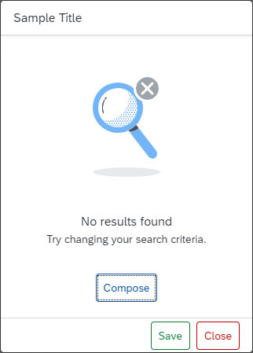
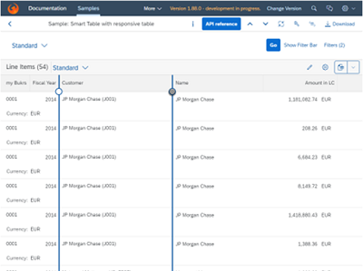

<!-- loiobda141b86c464e5bad7c0a0cc9dee753 -->

# What's New in SAPUI5 1.88

With this release SAPUI5 is upgraded from version 1.87 to 1.88.

<a name="loiobda141b86c464e5bad7c0a0cc9dee753__section_yxw_pxt_zcb"/>

## Announcements

<table>
<tr>
<td valign="top">

**End of Support for Microsoft Internet Explorer 11**

Starting with version 1.88, SAPUI5 no longer supports Microsoft Internet Explorer 11. For more information, see [SAPUI5 Support Status for Microsoft Internet Explorer 11](../02_Read-Me-First/browser-and-platform-support-74b59ef.md#loio74b59efa0eef48988d3b716bd0ecc933__MS_IE).

</td>
</tr>
</table>

<a name="loiobda141b86c464e5bad7c0a0cc9dee753__section_r5v_3h5_zcb"/>

## Demo Kit Feedback

<table>
<tr>
<td valign="top">

**Demo Kit Improvements**

Thank you all for using the Demo Kit feedback function! We have received many comments and suggestions about the different Demo Kit functionalities and we are considering all of them. Please continue providing your valuable feedback, and we will continue to implement it.

We have improved the following Demo Kit areas:

-   You can now choose to view the whole Demo Kit app in dark or light mode. We have added an *Appearance* setting in the *More Information* menu. If you choose Auto, the mode is based on your OS settings.

-   We have improved the readability of the *Known direct subclasses* popover in the *API Reference*. The subclasses are displayed in a list with only one item per row. It is now easier to browse through the numerous subclasses of base controls, such as `sap.ui.core.Control`.Check it out in the [API Reference](https://ui5.sap.com/#/api/sap.ui.core.Control).

-   You can now use the new  [Ctrl\] + [Shift\] + [F\]  shortcut combination to directly enable the global search functionality and start typing without the need to select the search field.

-   We have improved the appearance of long API names, such as methods and aggregations, in the *API Reference* so that they are no longer truncated.

</td>
</tr>
</table>

<a name="loiobda141b86c464e5bad7c0a0cc9dee753__section_bkm_s15_zcb"/>

## New Controls

<table>
<tr>
<td valign="top">

**`sap.f.IllustratedMessage` \(Experimental\)**

Empty states are moments in the user experience where there’s no data to display. Success states are occasions to celebrate and reward a user’s special accomplishment or the completion of an important task. The new `IllustratedMessage` control is the recommended combination of a solution-oriented message, an engaging illustration, and conversational tone to better communicate empty or success states.

For more information, see the [API Reference](https://ui5.sap.com/#/api/sap.f.IllustratedMessage) and the [Samples](https://ui5.sap.com/#/entity/sap.f.IllustratedMessage).

</td>
</tr>
</table>

<a name="loiobda141b86c464e5bad7c0a0cc9dee753__section_qwl_pb5_zcb"/>

## Improved Features

<table>
<tr>
<td valign="top">

**SAPUI5 Models**

The new version of SAPUI5 introduces a new `sap.ui.model.Binding#getResolvedPath` method, which provides the resolved path for a binding's path and context. The method can be used with all bindings. For more information, see the [API Reference](https://ui5.sap.com/#/api/sap.ui.model.Binding/methods/getResolvedPath).

</td>
</tr>
<tr>
<td valign="top">

**SAPUI5 OData V4 Model**

If you use a list binding for an OData V4 model and have specified a list of groupable properties in the `groupLevels` array of the `$$aggregation` list binding parameter, you can now use the `sap.ui.model.odata.v4.ODataListBinding#getDownloadUrl` method to obtain the URL for the leaf level data.

For more information, see [OData V4 Model](../04_Essentials/odata-v4-model-5de13cf.md), the [API Reference](https://ui5.sap.com/#/api/sap.ui.model.odata.v4), and the [Samples](https://ui5.sap.com/#/entity/sap.ui.model.odata.v4.ODataModel).

</td>
</tr>
<tr>
<td valign="top">

**Test Recorder**

We've introduced the option to generate code snippets with assertions. Assertions verify that the selected property will have exactly the same value during the test as it does at the moment of recording. For more information, see [Test Recorder](../04_Essentials/test-recorder-2535ef9.md).

</td>
</tr>
<tr>
<td valign="top">

**White Spaces in Spreadsheet Export**

Leading and trailing white spaces are now also taken into account during the spreadsheet export and are shown in the generated spreadsheet.

For more information, see [Spreadsheet Export](../04_Essentials/spreadsheet-export-2691788.md), the [API Reference](https://ui5.sap.com/#/api/sap.ui.export.Spreadsheet/overview), and the [Samples](https://ui5.sap.com/#/entity/sap.ui.export.Spreadsheet).

</td>
</tr>
</table>

<a name="loiobda141b86c464e5bad7c0a0cc9dee753__section_rqn_wd5_zcb"/>

## Improved Controls

<table>
<tr>
<td valign="top">

**`P13nDialog`**

We've visually modified the filter tab of the table personalization dialog, or `P13nDialog`, to align it with the latest changes in the `ValueHelpDialog` *Define Conditions* tab. In the new design, the *Include* and *Exclude* operations are displayed in the same dropdown as group headers. The type of dropdown has been changed from `sap.m.Select` to `sap.m.ComboBox` since `sap.m.Select` doesn't have group headers. For more information, see the [Sample](https://ui5.sap.com/#/entity/sap.ui.comp.smartfilterbar.SmartFilterBar/sample/sap.ui.comp.sample.smartfilterbar.example1).

> ### Note:  
> If you have tests that depend on the presence of the exclude operations dropdown or the `sap.m.Select` control, you must adapt them accordingly.

</td>
</tr>
<tr>
<td valign="top">

**`sap.f.GridContainer`**

We have added a new `columnsChange` event, fired when the count of grid columns changes. For more information, see the [API Reference](https://ui5.sap.com/#/api/sap.f.GridContainer) and the [Sample](https://ui5.sap.com/#/entity/sap.f.GridContainer/sample/sap.f.sample.GridContainer).

</td>
</tr>
<tr>
<td valign="top">

**`sap.gantt`**

We have improved the usability of the Gantt chart with the large interval/label always visible on the time axis.

 For more information, see the [API Reference](https://ui5.sap.com/#/api/sap.gantt.misc.AxisTime) and the [Sample](https://ui5.sap.com/#/entity/sap.gantt.simple.GanttChartWithTable). 

</td>
</tr>
<tr>
<td valign="top">

**`sap.m.UploadCollection`**

As of the SAPUI5 1.88 release, the Upload Collection control is deprecated. You can use the Upload Set \(`sap.m.upload.UploadSet`\) control that has better handling of headers and requests, unified behavior of instant and deferred uploads, as well as improved progress indication.

 For more information, see the [API Reference](https://ui5.sap.com/#/api/sap.m.upload.UploadSet). 

</td>
</tr>
<tr>
<td valign="top">

**`sap.ui.comp.filterbar.FilterBar, sap.ui.comp.valuehelpdialog.ValueHelpDialog`**

We have introduced several small visual changes:

-   To comply with the design guidelines, the *Go* button of the `FilterBar` now comes before *Show Filter Bar*/*Hide Filter Bar* in the header toolbar.

-   In the `ValueHelpDialog` with a filter bar, if there are more than 8 filters, clicking on the *Show Filters* button now displays only 7 filters and a *Show All Filters* button. To see all filters, you need to click *Show All Filters*. There is no option to hide all filters. If you close and reopen the `ValueHelpDialog`, you will again see 7 filters.

-   On a mobile device, when `ValueHelpDialog` has only the *Define Conditions* tab or only the *Search and Select* tab, the tab now opens directly. We have removed the intermediate step where you had to click on a list that opened the *Define Conditions* and *Search and Select* dialogs.

 For more information, see the [Samples](https://ui5.sap.com/#/entity/sap.ui.comp.valuehelpdialog.ValueHelpDialog). 

> ### Note:  
> If you have OPA tests that depend on the previous states of these controls, you must adapt the tests accordingly.

</td>
</tr>
<tr>
<td valign="top">

**`sap.ui.comp.smartfield.SmartField, sap.ui.comp.smartfilterbar.SmartFilterBar`**

We've introduced the highlighting of search suggestions of the `SmartField` and `SmartFilterBar` based on the `TypeAhead` functionality. This feature makes it easier to find the desired value in the suggestions. For more information, see the [SmartField Sample](https://ui5.sap.com/#/entity/sap.ui.comp.smartfield.SmartField/sample/sap.ui.comp.sample.smartfield.TextInEditModeSource) and the [SmartFilterBar Sample](https://ui5.sap.com/#/entity/sap.ui.comp.smartfilterbar.SmartFilterBar/sample/sap.ui.comp.sample.smartfilterbar.example1).

</td>
</tr>
<tr>
<td valign="top">

**`sap.ui.comp.smartfield.SmartField`**

We've introduced a new property, `fixedValueListValidationEnabled`, to turn off the handling of incorrect values in the `ComboBox` feature. The default value of the property is `false`. If it’s set to `true`, a standard validation for `sap.m.ComboBox` is performed. For more information, see the [API Reference](https://ui5.sap.com/#/api/sap.ui.comp.smartfield.SmartField).

</td>
</tr>
<tr>
<td valign="top">

**`sap.ui.comp.smartform.SmartForm`**

We've introduced a new control called `SemanticGroupElement` to handle the logic of semantically connected fields in the `SmartForm`. In `edit` mode, semantically connected fields are rendered as input fields with delimiters in between. In `display` mode, they behave as a single text. Note that this functionality is restricted only to string fields. It's not applicable to URLs, or the `ObjectStatus` or `ObjectIdentifier` controls.

The maximum number of fields that can be separated by a delimiter is three. The default delimiter is "/". In the `SmartForm`, you can use both `SemanticGroupElement` and `GroupElement` in one and the same Group or separated in different Groups.

 For more information, see the [API Reference](https://ui5.sap.com/#/api/sap.ui.comp.smartform.SemanticGroupElement). 

</td>
</tr>
<tr>
<td valign="top">

**`sap.ui.comp.smarttable.SmartTable`**

We have improved the usability and accessibility of column resizing for the responsive table. For example, we have added resize handles and keyboard shortcuts in the table. For more information, see the [API Reference](https://ui5.sap.com/#/api/sap.ui.comp.smarttable.SmartTable%23methods/getEnableAutoColumnWidth) and the [Sample](https://ui5.sap.com/#/entity/sap.ui.comp.smarttable.SmartTable/sample/sap.ui.comp.sample.smarttable.mtable).

</td>
</tr>
<tr>
<td valign="top">

**`sap.ui.integration.widgets.Card`**

-   To improve the loading performance of Integration cards, we have added a new `Auto` value to the `dataMode` \(experimental\) property. It sets the card to start the manifest processing only when the card is in the viewport. For more information, see the [Sample](https://ui5.sap.com/#/entity/sap.ui.integration.widgets.Card/sample/sap.ui.integration.sample.LazyLoading) and the [Integrate](https://ui5.sap.com/test-resources/sap/ui/integration/demokit/cardExplorer/webapp/index.html#/integrate/api) section in the Card Explorer.
-   In Calendar card, using the new `actions` \(experimental\) property, you can now define an action for each calendar item. A possible use case is when you want to provide a link for an online event or application. For more information, see the [Sample](https://ui5.sap.com/test-resources/sap/ui/integration/demokit/cardExplorer/webapp/index.html#/explore/calendar/calendar) and the [Calendar Card](https://ui5.sap.com/test-resources/sap/ui/integration/demokit/cardExplorer/webapp/index.html#/learn/types/calendar) section in the Card Explorer.

-   Actions can now also be used as column entries in the Table card and as group entries in the Object card. For more information, see the [Table Card](https://ui5.sap.com/test-resources/sap/ui/integration/demokit/cardExplorer/webapp/index.html#/learn/types/table) and the [Object Card](https://ui5.sap.com/test-resources/sap/ui/integration/demokit/cardExplorer/webapp/index.html#/learn/types/object) sections in the Card Explorer

</td>
</tr>
<tr>
<td valign="top">

**`sap.ui.unified.Currency`**

As an app developer you can now define custom currency names with a length of up to 5 symbols and values with a larger number of digits after the decimal point. If not explicitly set, the default maximal precision is decided based on the number of digits after the decimal point. For more information, see the [Sample](https://ui5.sap.com/#/entity/sap.ui.unified.Currency/sample/sap.ui.unified.sample.Currency).

</td>
</tr>
</table>

<a name="loiobda141b86c464e5bad7c0a0cc9dee753__section_g3r_bf5_zcb"/>

## SAP Fiori Elements

<table>
<tr>
<td valign="top">

The following changes and new features are available for SAP Fiori elements for OData V2 and SAP Fiori elements for OData V4:

-   End users now get the sort and filter options in the column header of columns annotated with `UI.DataFieldForAnnotation` in grid, analytical, and tree tables.
-   Application developers can customize the width of columns defined in the line items of a list report and object page using the UI annotation `com.sap.vocabularies.HTML5.v1.CssDefaults`. For more information, see [Setting the Default Column Width](../06_SAP_Fiori_Elements/setting-the-default-column-width-a765253.md).

</td>
</tr>
<tr>
<td valign="top">

The following changes and new features are available for SAP Fiori elements for OData V2:

-   Application developers can now add two tables in a subsection of an object page. The tables in the subsection adjust their respective widths depending on the available screen size. For more information, see [Adding Two Tables in a Subsection](../06_SAP_Fiori_Elements/adding-two-tables-in-a-subsection-17564c2.md).
-   Overview pages now support horizontal bar charts. For more information, see [Bar Chart Card](../06_SAP_Fiori_Elements/bar-chart-card-95f6aeb.md).
-   Analytical list pages now provide visual indication of the item that is shown on the object page.

</td>
</tr>
<tr>
<td valign="top">

The following changes and new features are available for SAP Fiori elements for OData V4:

-   Application developers can now use side effects in the list report to refresh multiple lists from different entity sets. For more information, see [Side Effects](../06_SAP_Fiori_Elements/side-effects-18b17bd.md) and [Side Effect Annotations: Examples](../06_SAP_Fiori_Elements/side-effect-annotations-examples-61cf21d.md).
-   Application developers can now add a custom filter field, based on a field defined on the client side whose values depend on entity properties from the OData service. For more information, see [Adding Custom Fields to the Filter Bar](../06_SAP_Fiori_Elements/adding-custom-fields-to-the-filter-bar-5fb9f57.md).
-   Application developers can now use multiple value help dialogs. For more information, see [Field Help](../06_SAP_Fiori_Elements/field-help-a5608ea.md).
-   Charts are now also supported for entity sets based on custom aggregations in the back end. For more information, see [Configuring Charts](../06_SAP_Fiori_Elements/configuring-charts-653ed0f.md).
-   Listing actions \(custom actions from the manifest and actions from annotations\) as menu buttons is now also possible for form actions. For more information, see [Actions](../06_SAP_Fiori_Elements/actions-cbf16c5.md).
-   Application developers can now define their own field length for multi-line text fields. For more information, see [Different Representations of a Field](../06_SAP_Fiori_Elements/different-representations-of-a-field-c18ada4.md).

</td>
</tr>
</table>

**Related Information**  

[What's New in SAPUI5 1.106](what-s-new-in-sapui5-1-106-c70bb90.md "With this release SAPUI5 is upgraded from version 1.105 to 1.106.")

[What's New in SAPUI5 1.105](what-s-new-in-sapui5-1-105-5567dcc.md "With this release SAPUI5 is upgraded from version 1.104 to 1.105.")

[What's New in SAPUI5 1.104](what-s-new-in-sapui5-1-104-f01ebd4.md "With this release SAPUI5 is upgraded from version 1.103 to 1.104.")

[What's New in SAPUI5 1.103](what-s-new-in-sapui5-1-103-7534ae8.md "With this release SAPUI5 is upgraded from version 1.102 to 1.103.")

[What's New in SAPUI5 1.102](what-s-new-in-sapui5-1-102-b530db3.md "With this release SAPUI5 is upgraded from version 1.101 to 1.102.")

[What's New in SAPUI5 1.101](what-s-new-in-sapui5-1-101-5a18410.md "With this release SAPUI5 is upgraded from version 1.100 to 1.101.")

[What's New in SAPUI5 1.100](what-s-new-in-sapui5-1-100-5deb78f.md "With this release SAPUI5 is upgraded from version 1.99 to 1.100.")

[What's New in SAPUI5 1.99](what-s-new-in-sapui5-1-99-5e35c25.md "With this release SAPUI5 is upgraded from version 1.98 to 1.99.")

[What's New in SAPUI5 1.98](what-s-new-in-sapui5-1-98-7aacb4e.md "With this release SAPUI5 is upgraded from version 1.97 to 1.98.")

[What's New in SAPUI5 1.97](what-s-new-in-sapui5-1-97-f21858f.md "With this release SAPUI5 is upgraded from version 1.96 to 1.97.")

[What's New in SAPUI5 1.96](what-s-new-in-sapui5-1-96-b39a11b.md "With this release SAPUI5 is upgraded from version 1.95 to 1.96.")

[What's New in SAPUI5 1.95](what-s-new-in-sapui5-1-95-1b09465.md "With this release SAPUI5 is upgraded from version 1.94 to 1.95.")

[What's New in SAPUI5 1.94](what-s-new-in-sapui5-1-94-2d6ffdd.md "With this release SAPUI5 is upgraded from version 1.93 to 1.94.")

[What's New in SAPUI5 1.93](what-s-new-in-sapui5-1-93-e9c8356.md "With this release SAPUI5 is upgraded from version 1.92 to 1.93.")

[What's New in SAPUI5 1.92](what-s-new-in-sapui5-1-92-1492551.md "With this release SAPUI5 is upgraded from version 1.91 to 1.92.")

[What's New in SAPUI5 1.91](what-s-new-in-sapui5-1-91-75777da.md "With this release SAPUI5 is upgraded from version 1.90 to 1.91.")

[What's New in SAPUI5 1.90](what-s-new-in-sapui5-1-90-b475202.md "With this release SAPUI5 is upgraded from version 1.89 to 1.90.")

[What's New in SAPUI5 1.89](what-s-new-in-sapui5-1-89-0805036.md "With this release SAPUI5 is upgraded from version 1.88 to 1.89.")

[What's New in SAPUI5 1.87](what-s-new-in-sapui5-1-87-e315108.md "With this release SAPUI5 is upgraded from version 1.86 to 1.87.")

[What's New in SAPUI5 1.86](what-s-new-in-sapui5-1-86-067e2fb.md "With this release SAPUI5 is upgraded from version 1.85 to 1.86.")

[What's New in SAPUI5 1.85](what-s-new-in-sapui5-1-85-eeb5bd9.md "With this release SAPUI5 is upgraded from version 1.84 to 1.85.")

[What's New in SAPUI5 1.84](what-s-new-in-sapui5-1-84-ccf76b7.md "With this release SAPUI5 is upgraded from version 1.82 to 1.84.")

[What's New in SAPUI5 1.82](what-s-new-in-sapui5-1-82-f081cf0.md "With this release SAPUI5 is upgraded from version 1.81 to 1.82.")

[What's New in SAPUI5 1.81](what-s-new-in-sapui5-1-81-f71563c.md "With this release SAPUI5 is upgraded from version 1.80 to 1.81.")

[What's New in SAPUI5 1.80](what-s-new-in-sapui5-1-80-3294c68.md "With this release SAPUI5 is upgraded from version 1.79 to 1.80.")

[What's New in SAPUI5 1.79](what-s-new-in-sapui5-1-79-edf8e35.md "With this release SAPUI5 is upgraded from version 1.78 to 1.79.")

[What's New in SAPUI5 1.78](what-s-new-in-sapui5-1-78-d176be3.md "With this release SAPUI5 is upgraded from version 1.77 to 1.78.")

[What's New in SAPUI5 1.77](what-s-new-in-sapui5-1-77-2ec6b6b.md "With this release SAPUI5 is upgraded from version 1.76 to 1.77.")

[What's New in SAPUI5 1.76](what-s-new-in-sapui5-1-76-b9b0a3f.md "With this release SAPUI5 is upgraded from version 1.75 to 1.76.")

[What's New in SAPUI5 1.75](what-s-new-in-sapui5-1-75-dc3d3ce.md "With this release SAPUI5 is upgraded from version 1.74 to 1.75.")

[What's New in SAPUI5 1.74](what-s-new-in-sapui5-1-74-21fc6cb.md "With this release SAPUI5 is upgraded from version 1.73 to 1.74.")

[What's New in SAPUI5 1.73](what-s-new-in-sapui5-1-73-7b82664.md "With this release SAPUI5 is upgraded from version 1.72 to 1.73.")

[What's New in SAPUI5 1.72](what-s-new-in-sapui5-1-72-25e5326.md "With this release SAPUI5 is upgraded from version 1.71 to 1.72.")

[What's New in SAPUI5 1.71](what-s-new-in-sapui5-1-71-609fd01.md "With this release SAPUI5 is upgraded from version 1.70 to 1.71.")

[What's New in SAPUI5 1.70](what-s-new-in-sapui5-1-70-4e89fee.md "With this release SAPUI5 is upgraded from version 1.69 to 1.70.")

[What's New in SAPUI5 1.69](what-s-new-in-sapui5-1-69-41203fd.md "With this release SAPUI5 is upgraded from version 1.68 to 1.69.")

[What's New in SAPUI5 1.68](what-s-new-in-sapui5-1-68-5531aef.md "With this release SAPUI5 is upgraded from version 1.67 to 1.68.")

[What's New in SAPUI5 1.67](what-s-new-in-sapui5-1-67-0968958.md "With this release SAPUI5 is upgraded from version 1.66 to 1.67.")

[What's New in SAPUI5 1.66](what-s-new-in-sapui5-1-66-ebe7fda.md "With this release SAPUI5 is upgraded from version 1.65 to 1.66.")

[What's New in SAPUI5 1.65](what-s-new-in-sapui5-1-65-9d2b189.md "With this release SAPUI5 is upgraded from version 1.64 to 1.65.")

[What's New in SAPUI5 1.64](what-s-new-in-sapui5-1-64-1975e30.md "With this release SAPUI5 is upgraded from version 1.63 to 1.64.")

[What's New in SAPUI5 1.63](what-s-new-in-sapui5-1-63-77e1dcc.md "With this release SAPUI5 is upgraded from version 1.62 to 1.63.")

[What's New in SAPUI5 1.62](what-s-new-in-sapui5-1-62-27eea38.md "With this release SAPUI5 is upgraded from version 1.61 to 1.62.")

[What's New in SAPUI5 1.61](what-s-new-in-sapui5-1-61-de4d50b.md "With this release SAPUI5 is upgraded from version 1.60 to 1.61.")

[What's New in SAPUI5 1.60](what-s-new-in-sapui5-1-60-2a70354.md "With this release SAPUI5 is upgraded from version 1.58 to 1.60.")

[What's New in SAPUI5 1.58](what-s-new-in-sapui5-1-58-b28edde.md "With this release, SAPUI5 is upgraded from version 1.56 to 1.58.")

[What's New in SAPUI5 1.56](what-s-new-in-sapui5-1-56-53b4b5e.md "With this release, SAPUI5 is upgraded from version 1.54 to 1.56.")

[What's New in SAPUI5 1.54](what-s-new-in-sapui5-1-54-f29023e.md "With this release, SAPUI5 is upgraded from version 1.52 to 1.54.")

[What's New in SAPUI5 1.52](what-s-new-in-sapui5-1-52-a09dd79.md "With this release, SAPUI5 is upgraded from version 1.50 to 1.52.")

[What's New in SAPUI5 1.50](what-s-new-in-sapui5-1-50-a844984.md "With this release, SAPUI5 is upgraded from version 1.48 to 1.50.")

[What's New in SAPUI5 1.48](what-s-new-in-sapui5-1-48-2818f80.md "With this release, SAPUI5 is upgraded from version 1.46 to 1.48.")

[What's New in SAPUI5 1.46](what-s-new-in-sapui5-1-46-4cf0986.md "With this release, SAPUI5 is upgraded from version 1.44 to 1.46.")

[What's New in SAPUI5 1.44](what-s-new-in-sapui5-1-44-05ce1dc.md "With this release, SAPUI5 is upgraded from version 1.42 to 1.44.")

[What's New in SAPUI5 1.42](what-s-new-in-sapui5-1-42-4768f1a.md "With this release, SAPUI5 is upgraded from version 1.40 to 1.42.")

[What's New in SAPUI5 1.40](what-s-new-in-sapui5-1-40-e659bd2.md "With this release, SAPUI5 is upgraded from version 1.38 to 1.40.")

[What's New in SAPUI5 1.38](what-s-new-in-sapui5-1-38-6a875f9.md#loio6a875f998994489483e8085705347d72 "With this release, SAPUI5 is upgraded from version 1.36 to 1.38.")

