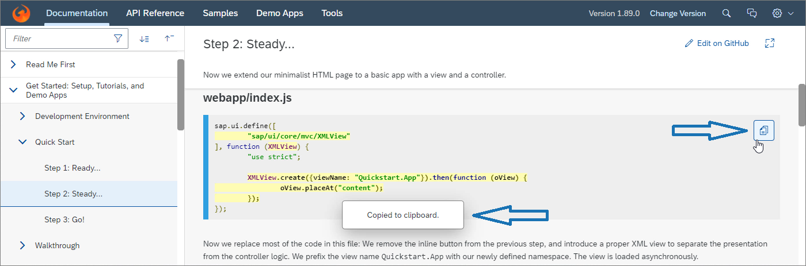

<!-- loio08050365ef9f4777af7b3c139fdb0d82 -->

# What's New in SAPUI5 1.89

With this release SAPUI5 is upgraded from version 1.88 to 1.89.

<a name="loio08050365ef9f4777af7b3c139fdb0d82__section_r5v_3h5_zcb"/>

## Demo Kit Feedback

<table>
<tr>
<td valign="top">

**Demo Kit Improvements**

Here are some Demo Kit improvements that we implemented based on your feedback:

-   You can now quickly cancel the global search by pressing [Esc\].

-   We implemented a copy button in all code samples in the *Documentation* section:

    

</td>
</tr>
</table>

<a name="loio08050365ef9f4777af7b3c139fdb0d82__section_qwl_pb5_zcb"/>

## Improved Features

<table>
<tr>
<td valign="top">

**SAPUI5 OData V2 Model**

You can now provide unit and currency customizing for the `sap.ui.model.odata.type.Unit` and `sap.ui.model.odata.type.Currency` data types as part of the data service. For more information, see [Currency and Unit Customizing in OData V2](../04_Essentials/odata-v2-model-6c47b2b.md#loioaa9024c7c5444822a68daeb21a92bd51).

</td>
</tr>
<tr>
<td valign="top">

**SAPUI5 OData V4 Model**

Additional targets are now supported for [server messages](../04_Essentials/server-messages-in-the-odata-v4-model-fbe1cb5.md).

</td>
</tr>
<tr>
<td valign="top">

**SAPUI5 Data Types**

The `preserveDecimals` format option introduced in `sap.ui.core.format.NumberFormat` with SAPUI5 1.87 is now enabled by default, unless the `style` format option is set to either `short` or `long`. This applies to the following data types:

-   `sap.ui.model.type.Currency`
-   `sap.ui.model.type.Float`
-   `sap.ui.model.type.Unit`
-   `sap.ui.model.odata.type.Currency`
-   `sap.ui.model.odata.type.Decimal`
-   `sap.ui.model.odata.type.Double`
-   `sap.ui.model.odata.type.Single`
-   `sap.ui.model.odata.type.Unit`

This change fixes the shortcoming that displayed values can be truncated if the back end provides more decimals than accounted for on the UI. It is also a prerequisite for highlighting all instances of invalid data entered by the user if the same property is displayed in multiple places on the UI.

However, in some cases it can be necessary to display a value with fewer decimals than actually exist for the property. You would then need to add the `preserveDecimals` format option with a value of `false` to the type instance.

</td>
</tr>
</table>

<a name="loio08050365ef9f4777af7b3c139fdb0d82__section_rqn_wd5_zcb"/>

## Improved Controls

<table>
<tr>
<td valign="top">

**`sap.m.Link`, `sap.m.ObjectIdentifier`, `sap.m.ObjectNumber`, `sap.m.ObjectStatus`, and `sap.ui.unified.Currency`**

Similar to the `sap.m.Text` control, these controls now also implement the new `emptyIndicatorMode` property. It allows developers to display an empty text as a language dependent “-” symbol.

</td>
</tr>
<tr>
<td valign="top">

**`sap.ui.comp.navpopover.SmartLink`**

You can now also use `SmartLink` as the content of `sap.m.title`. For more information, see the [Sample](https://ui5.sap.com/#/entity/sap.ui.comp.navpopover.SmartLink/sample/sap.ui.comp.sample.smartlink.example_01).

</td>
</tr>
<tr>
<td valign="top">

**`sap.ui.comp.smartfield.SmartField`**

Until now, when `SmartField` was represented by `sap.m.TextArea` as an inner control, we used `sap.m.Text` in display mode. However, this caused longer text to be truncated. So, in this scenario we now use the new `sap.m.ExpandableText` control. It shows only the first characters of the text field, followed by a *More* link. Clicking on the link displays the full text.

</td>
</tr>
<tr>
<td valign="top">

**`sap.ui.comp.smartfilterbar.SmartFilterBar, sap.ui.comp.valuehelpdialog.ValueHelpDialog`**

-   Before, the user was notified of an error in the `SmartFilterBar` fields by means of a message box. The user had to close the message box and expand the filters to correct the error. For better user experience, we now directly expand the filter bar, focusing on the first field with an error. Developers still have the option to show the message box by changing the `showMessages` property of the `SmartFilterBar`.

-   When `SmartFilterBar` is in `ValueHelpDialog`, it's initially collapsed, except for the following cases:

    -   When there is no basic search field.
    -   When `preventInitialDataFetchInValueHelpDialog` is set to `true` or `fetchValues` of the `valueList` annotation is set to 2.

    -   When there are mandatory fields, all fields are expanded, not only the first 7.

For more information, see the [API Reference](https://ui5.sap.com/#/api/sap.ui.comp.smartfilterbar.SmartFilterBar) and the [Sample](https://ui5.sap.com/#/entity/sap.ui.comp.smartfilterbar.SmartFilterBar/sample/sap.ui.comp.sample.smartfilterbar.example1). 

</td>
</tr>
<tr>
<td valign="top">

**`sap.ui.comp.smartfilterbar.SmartFilterBar`**

*List View* is now the default view in the *Filters* dialog. For more information, see the [Sample](https://ui5.sap.com/#/entity/sap.ui.comp.smartfilterbar.SmartFilterBar/sample/sap.ui.comp.sample.smartfilterbar.example1).

</td>
</tr>
<tr>
<td valign="top">

**`sap.ui.comp.smarttable.SmartTable`**

-   `SmartTable` delays its initialization until all related SAPUI5 flexibility changes have been made. Therefore, we have now enabled some of the static properties of `SmartTable`, such as `initiallyVisibleFields` and `enableAutoColumnWidth`, for these changes for design time adaptation.

-   We have made the message filtering, which is based on data states, available for `SmartTable`. To integrate this feature, the `DataStateIndicator` plugin has the relevant `enableFiltering` property, and `SmartTable` now has the related `dataStataIndicator` aggregation. For more information, see the [API Reference](https://ui5.sap.com/#/api/sap.ui.comp.smarttable.SmartTable%23methods/getDataStateIndicator) and the [Sample](https://ui5.sap.com/#/entity/sap.ui.comp.smarttable.SmartTable/sample/sap.ui.comp.sample.smarttable.mtableDataState).

-   We have provided the `refresh` method for the `DataStateIndicator` plugin for refreshing the message filters based on the current data state. For more information, see the [API Reference](https://ui5.sap.com/#/api/sap.m.plugins.DataStateIndicator%23methods/refresh) and the [Sample](https://ui5.sap.com/#/entity/sap.ui.comp.smarttable.SmartTable/sample/sap.ui.comp.sample.smarttable.mtableDataState).

-   `SmartTable` now takes UoM- and currency-specific formatting into account in the dialog and during a spreadsheet export. The `com.sap.vocabularies.CodeList.v1.CurrencyCodes` and `com.sap.vocabularies.CodeList.v1.UnitOfMeasure` annotations provide the required formatting. For more information, see [Currency and Unit Customizing in OData V2](../04_Essentials/odata-v2-model-6c47b2b.md#loioaa9024c7c5444822a68daeb21a92bd51).

</td>
</tr>
<tr>
<td valign="top">

**`sap.ui.layout.form.Form`, `sap.ui.layout.form.SimpleForm`**

You can now define up to six columns in extra-large size in a form. For more information, see the [API Reference](https://ui5.sap.com/#/api/sap.ui.layout.form.ColumnsXL), the [Samples](https://ui5.sap.com/#/entity/sap.ui.layout.form.Form) for `Form`, and the [Samples](https://ui5.sap.com/#/entity/sap.ui.layout.form.SimpleForm) for `SimpleForm`.

</td>
</tr>
</table>

<a name="loio08050365ef9f4777af7b3c139fdb0d82__section_g3r_bf5_zcb"/>

## SAP Fiori Elements

<table>
<tr>
<td valign="top">

The following changes and new features are available for SAP Fiori elements for OData V2 and SAP Fiori elements for OData V4:

-   Change in the behavior on the UI of the list report: When an app is started on desktop devices, the filter bar is now expanded, irrespective of initial data load. For more information, see [List Report Elements](../06_SAP_Fiori_Elements/list-report-elements-1cf5c7f.md).

</td>
</tr>
<tr>
<td valign="top">

The following changes and new features are available for SAP Fiori elements for OData V2:

-   Application developers can now set a default value for semantic date range filter fields on the filter bar. For more information, see [Enabling Semantic Operators in the Filter Bar](../06_SAP_Fiori_Elements/enabling-semantic-operators-in-the-filter-bar-fef65d0.md).

-   Key users can now create delivery variants. For more information, see [Adapting the UI](../06_SAP_Fiori_Elements/adapting-the-ui-59bfd31.md).

-   The *Share* functionality is now automatically hidden for new drafts. For more information, see ["Share" Functionality](../06_SAP_Fiori_Elements/share-functionality-022bf0d.md).
-   Adaptation of filter bars on overview pages is now enabled by default. For more information, see [Key User Capabilities](../06_SAP_Fiori_Elements/key-user-capabilities-4966938.md).

-   It is now possible to sort and filter columns that are defined via `DataFieldForAnnotation`.

</td>
</tr>
<tr>
<td valign="top">

The following changes and new features are available for SAP Fiori elements for OData V4:

-   The context of entity sets is now passed when outbound navigation is triggered. For more information, see [Navigation from an App \(Outbound Navigation\)](../06_SAP_Fiori_Elements/navigation-from-an-app-outbound-navigation-d782acf.md).

-   Semantically connected fields are now displayed side by side to reflect their data relation. For more information, see [Grouping of Fields](../06_SAP_Fiori_Elements/grouping-of-fields-cb1748e.md).

-   The *Share in SAP Jam* option is now available on platforms that are integrated with SAP Jam. For more information, see ["Share" Functionality](../06_SAP_Fiori_Elements/share-functionality-022bf0d.md).

-   Application developers can now define the sort order of the different columns of the table in the value help dialog. End users will find the table content sorted accordingly. For more information, see [Field Help](../06_SAP_Fiori_Elements/field-help-a5608ea.md).

-   Application developers can now enable table personalization independent of variant management. For more information, see [Enabling Variant Management in the Object Page](../06_SAP_Fiori_Elements/enabling-variant-management-in-the-object-page-f26d42b.md).

</td>
</tr>
</table>

**Related Information**  

[What's New in SAPUI5 1.106](what-s-new-in-sapui5-1-106-c70bb90.md "With this release SAPUI5 is upgraded from version 1.105 to 1.106.")

[What's New in SAPUI5 1.105](what-s-new-in-sapui5-1-105-5567dcc.md "With this release SAPUI5 is upgraded from version 1.104 to 1.105.")

[What's New in SAPUI5 1.104](what-s-new-in-sapui5-1-104-f01ebd4.md "With this release SAPUI5 is upgraded from version 1.103 to 1.104.")

[What's New in SAPUI5 1.103](what-s-new-in-sapui5-1-103-7534ae8.md "With this release SAPUI5 is upgraded from version 1.102 to 1.103.")

[What's New in SAPUI5 1.102](what-s-new-in-sapui5-1-102-b530db3.md "With this release SAPUI5 is upgraded from version 1.101 to 1.102.")

[What's New in SAPUI5 1.101](what-s-new-in-sapui5-1-101-5a18410.md "With this release SAPUI5 is upgraded from version 1.100 to 1.101.")

[What's New in SAPUI5 1.100](what-s-new-in-sapui5-1-100-5deb78f.md "With this release SAPUI5 is upgraded from version 1.99 to 1.100.")

[What's New in SAPUI5 1.99](what-s-new-in-sapui5-1-99-5e35c25.md "With this release SAPUI5 is upgraded from version 1.98 to 1.99.")

[What's New in SAPUI5 1.98](what-s-new-in-sapui5-1-98-7aacb4e.md "With this release SAPUI5 is upgraded from version 1.97 to 1.98.")

[What's New in SAPUI5 1.97](what-s-new-in-sapui5-1-97-f21858f.md "With this release SAPUI5 is upgraded from version 1.96 to 1.97.")

[What's New in SAPUI5 1.96](what-s-new-in-sapui5-1-96-b39a11b.md "With this release SAPUI5 is upgraded from version 1.95 to 1.96.")

[What's New in SAPUI5 1.95](what-s-new-in-sapui5-1-95-1b09465.md "With this release SAPUI5 is upgraded from version 1.94 to 1.95.")

[What's New in SAPUI5 1.94](what-s-new-in-sapui5-1-94-2d6ffdd.md "With this release SAPUI5 is upgraded from version 1.93 to 1.94.")

[What's New in SAPUI5 1.93](what-s-new-in-sapui5-1-93-e9c8356.md "With this release SAPUI5 is upgraded from version 1.92 to 1.93.")

[What's New in SAPUI5 1.92](what-s-new-in-sapui5-1-92-1492551.md "With this release SAPUI5 is upgraded from version 1.91 to 1.92.")

[What's New in SAPUI5 1.91](what-s-new-in-sapui5-1-91-75777da.md "With this release SAPUI5 is upgraded from version 1.90 to 1.91.")

[What's New in SAPUI5 1.90](what-s-new-in-sapui5-1-90-b475202.md "With this release SAPUI5 is upgraded from version 1.89 to 1.90.")

[What's New in SAPUI5 1.88](what-s-new-in-sapui5-1-88-bda141b.md "With this release SAPUI5 is upgraded from version 1.87 to 1.88.")

[What's New in SAPUI5 1.87](what-s-new-in-sapui5-1-87-e315108.md "With this release SAPUI5 is upgraded from version 1.86 to 1.87.")

[What's New in SAPUI5 1.86](what-s-new-in-sapui5-1-86-067e2fb.md "With this release SAPUI5 is upgraded from version 1.85 to 1.86.")

[What's New in SAPUI5 1.85](what-s-new-in-sapui5-1-85-eeb5bd9.md "With this release SAPUI5 is upgraded from version 1.84 to 1.85.")

[What's New in SAPUI5 1.84](what-s-new-in-sapui5-1-84-ccf76b7.md "With this release SAPUI5 is upgraded from version 1.82 to 1.84.")

[What's New in SAPUI5 1.82](what-s-new-in-sapui5-1-82-f081cf0.md "With this release SAPUI5 is upgraded from version 1.81 to 1.82.")

[What's New in SAPUI5 1.81](what-s-new-in-sapui5-1-81-f71563c.md "With this release SAPUI5 is upgraded from version 1.80 to 1.81.")

[What's New in SAPUI5 1.80](what-s-new-in-sapui5-1-80-3294c68.md "With this release SAPUI5 is upgraded from version 1.79 to 1.80.")

[What's New in SAPUI5 1.79](what-s-new-in-sapui5-1-79-edf8e35.md "With this release SAPUI5 is upgraded from version 1.78 to 1.79.")

[What's New in SAPUI5 1.78](what-s-new-in-sapui5-1-78-d176be3.md "With this release SAPUI5 is upgraded from version 1.77 to 1.78.")

[What's New in SAPUI5 1.77](what-s-new-in-sapui5-1-77-2ec6b6b.md "With this release SAPUI5 is upgraded from version 1.76 to 1.77.")

[What's New in SAPUI5 1.76](what-s-new-in-sapui5-1-76-b9b0a3f.md "With this release SAPUI5 is upgraded from version 1.75 to 1.76.")

[What's New in SAPUI5 1.75](what-s-new-in-sapui5-1-75-dc3d3ce.md "With this release SAPUI5 is upgraded from version 1.74 to 1.75.")

[What's New in SAPUI5 1.74](what-s-new-in-sapui5-1-74-21fc6cb.md "With this release SAPUI5 is upgraded from version 1.73 to 1.74.")

[What's New in SAPUI5 1.73](what-s-new-in-sapui5-1-73-7b82664.md "With this release SAPUI5 is upgraded from version 1.72 to 1.73.")

[What's New in SAPUI5 1.72](what-s-new-in-sapui5-1-72-25e5326.md "With this release SAPUI5 is upgraded from version 1.71 to 1.72.")

[What's New in SAPUI5 1.71](what-s-new-in-sapui5-1-71-609fd01.md "With this release SAPUI5 is upgraded from version 1.70 to 1.71.")

[What's New in SAPUI5 1.70](what-s-new-in-sapui5-1-70-4e89fee.md "With this release SAPUI5 is upgraded from version 1.69 to 1.70.")

[What's New in SAPUI5 1.69](what-s-new-in-sapui5-1-69-41203fd.md "With this release SAPUI5 is upgraded from version 1.68 to 1.69.")

[What's New in SAPUI5 1.68](what-s-new-in-sapui5-1-68-5531aef.md "With this release SAPUI5 is upgraded from version 1.67 to 1.68.")

[What's New in SAPUI5 1.67](what-s-new-in-sapui5-1-67-0968958.md "With this release SAPUI5 is upgraded from version 1.66 to 1.67.")

[What's New in SAPUI5 1.66](what-s-new-in-sapui5-1-66-ebe7fda.md "With this release SAPUI5 is upgraded from version 1.65 to 1.66.")

[What's New in SAPUI5 1.65](what-s-new-in-sapui5-1-65-9d2b189.md "With this release SAPUI5 is upgraded from version 1.64 to 1.65.")

[What's New in SAPUI5 1.64](what-s-new-in-sapui5-1-64-1975e30.md "With this release SAPUI5 is upgraded from version 1.63 to 1.64.")

[What's New in SAPUI5 1.63](what-s-new-in-sapui5-1-63-77e1dcc.md "With this release SAPUI5 is upgraded from version 1.62 to 1.63.")

[What's New in SAPUI5 1.62](what-s-new-in-sapui5-1-62-27eea38.md "With this release SAPUI5 is upgraded from version 1.61 to 1.62.")

[What's New in SAPUI5 1.61](what-s-new-in-sapui5-1-61-de4d50b.md "With this release SAPUI5 is upgraded from version 1.60 to 1.61.")

[What's New in SAPUI5 1.60](what-s-new-in-sapui5-1-60-2a70354.md "With this release SAPUI5 is upgraded from version 1.58 to 1.60.")

[What's New in SAPUI5 1.58](what-s-new-in-sapui5-1-58-b28edde.md "With this release, SAPUI5 is upgraded from version 1.56 to 1.58.")

[What's New in SAPUI5 1.56](what-s-new-in-sapui5-1-56-53b4b5e.md "With this release, SAPUI5 is upgraded from version 1.54 to 1.56.")

[What's New in SAPUI5 1.54](what-s-new-in-sapui5-1-54-f29023e.md "With this release, SAPUI5 is upgraded from version 1.52 to 1.54.")

[What's New in SAPUI5 1.52](what-s-new-in-sapui5-1-52-a09dd79.md "With this release, SAPUI5 is upgraded from version 1.50 to 1.52.")

[What's New in SAPUI5 1.50](what-s-new-in-sapui5-1-50-a844984.md "With this release, SAPUI5 is upgraded from version 1.48 to 1.50.")

[What's New in SAPUI5 1.48](what-s-new-in-sapui5-1-48-2818f80.md "With this release, SAPUI5 is upgraded from version 1.46 to 1.48.")

[What's New in SAPUI5 1.46](what-s-new-in-sapui5-1-46-4cf0986.md "With this release, SAPUI5 is upgraded from version 1.44 to 1.46.")

[What's New in SAPUI5 1.44](what-s-new-in-sapui5-1-44-05ce1dc.md "With this release, SAPUI5 is upgraded from version 1.42 to 1.44.")

[What's New in SAPUI5 1.42](what-s-new-in-sapui5-1-42-4768f1a.md "With this release, SAPUI5 is upgraded from version 1.40 to 1.42.")

[What's New in SAPUI5 1.40](what-s-new-in-sapui5-1-40-e659bd2.md "With this release, SAPUI5 is upgraded from version 1.38 to 1.40.")

[What's New in SAPUI5 1.38](what-s-new-in-sapui5-1-38-6a875f9.md#loio6a875f998994489483e8085705347d72 "With this release, SAPUI5 is upgraded from version 1.36 to 1.38.")

