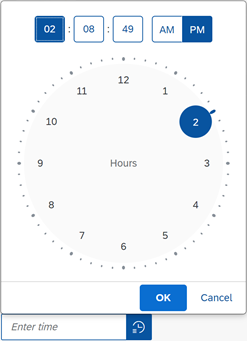

<!-- loio91c10c22e72448ca8b78d12f74169c18 -->

# What's New in SAPUI5 1.90

With this release SAPUI5 is upgraded from version 1.89 to 1.90.

****

<table>
<tr>
<th valign="top">

Version

</th>
<th valign="top">

Type

</th>
<th valign="top">

Category

</th>
<th valign="top">

Title

</th>
<th valign="top">

Description

</th>
<th valign="top">

Action

</th>
<th valign="top">

Available as of

</th>
</tr>
<tr>
<td valign="top">

1.90 

</td>
<td valign="top">

New 

</td>
<td valign="top">

Control 

</td>
<td valign="top">

**`sap.m.NotificationList`** 

</td>
<td valign="top">

**`sap.m.NotificationList`**

The control provides a container for `sap.m.NotificationListGroup` and `sap.m.NotificationListItem` items where this control should be used, instead of `sap.m.List`. While the `sap.m.List` is still working properly, we strongly recommend you to use the new `sap.m.NotificationList` control in order to benefit from the accessibility features that are built-in. For more information, see the [API Reference](https://ui5.sap.com/#/api/sap.m.NotificationList).

New•Control•Info Only•1.90

</td>
<td valign="top">

Info Only

</td>
<td valign="top">

2021-05-20

</td>
</tr>
<tr>
<td valign="top">

1.90 

</td>
<td valign="top">

New 

</td>
<td valign="top">

Feature 

</td>
<td valign="top">

**Key User Adaptation: Local Reset of Controls** 

</td>
<td valign="top">

**Key User Adaptation: Local Reset of Controls**

In UI adaptation mode, key users can now remove all key user changes for specific controls by using the new *Reset Container* action. Previously, key users had to either manually undo individual UI changes or reset all UI changes for the entire app. This new local reset is currently supported for the following controls: `Form`, `SimpleForm`, `SmartForm`.

> ### Restriction:  
> This feature is currently not available on SAP BTP.

New•Feature•Info Only•1.90

</td>
<td valign="top">

Info Only 

</td>
<td valign="top">

2021-05-20

</td>
</tr>
<tr>
<td valign="top">

1.90 

</td>
<td valign="top">

Changed 

</td>
<td valign="top">

Feature 

</td>
<td valign="top">

**One Page Acceptance Tests \(OPA5\)** 

</td>
<td valign="top">

**One Page Acceptance Tests \(OPA5\)**

You can now simulate scroll in controls that provide a scrollable area. For more information, see [Simulating User Interactions on Controls](../04_Essentials/simulating-user-interactions-on-controls-8615a0b.md).

Changed•Feature•Info Only•1.90

</td>
<td valign="top">

Info Only 

</td>
<td valign="top">

2021-05-20

</td>
</tr>
<tr>
<td valign="top">

1.90 

</td>
<td valign="top">

Changed 

</td>
<td valign="top">

Feature 

</td>
<td valign="top">

**UI Adaptation Support for OData V2 `SmartVariantManagement` Controls** 

</td>
<td valign="top">

**UI Adaptation Support for OData V2 `SmartVariantManagement` Controls**

Key users can now use the `sap.ui.comp.smartvariants.SmartVariantManagement` control to save variants \(or "views"\) for end users. On the SAPUI5 side, this works out of the box for any app that is enabled for UI adaptation, but you may need to update your back-end system. For more information, see [Key User Adaptation](../10_More_About_Controls/key-user-adaptation-2e6920b.md) and [SAPUI5 Flexibility: Enable Your App for UI Adaptation](../05_Developing_Apps/sapui5-flexibility-enable-your-app-for-ui-adaptation-f1430c0.md).

On the design-time side, this type of variant is ready to be implemented in SAP's design-time environments \(SAP Business Application Studio, SAP Fiori tools\).

Changed•Feature•Info Only•1.90

</td>
<td valign="top">

Info Only 

</td>
<td valign="top">

2021-05-20

</td>
</tr>
<tr>
<td valign="top">

1.90 

</td>
<td valign="top">

Changed 

</td>
<td valign="top">

Feature 

</td>
<td valign="top">

**Accessibility** 

</td>
<td valign="top">

**Accessibility**

We are now using JAWS 2021 as reference testing environment in SAPUI5. For more information, see the Assistive technologies reference testing environment for SAPUI5 [2564165](https://me.sap.com/notes/2564165).

Changed•Feature•Info Only•1.90

</td>
<td valign="top">

Info Only 

</td>
<td valign="top">

2021-05-20

</td>
</tr>
<tr>
<td valign="top">

1.90 

</td>
<td valign="top">

Changed 

</td>
<td valign="top">

Control 

</td>
<td valign="top">

**`P13nDialog`** 

</td>
<td valign="top">

**`P13nDialog`**

The filter panel of the table personalization dialog now supports the `sap.m.ComboBox` control to make it easier for the user to choose from a list of fixed values. The operators dropdown is disabled for fields of `Boolean` type and in the *Define Conditions* tab of the `ValueHelpDialog`. For more information, see the [Smart Filter Bar Sample](https://ui5.sap.com/#/entity/sap.ui.comp.smartfilterbar.SmartFilterBar/sample/sap.ui.comp.sample.smartfilterbar.example1).

Changed•Control•Info Only•1.90

</td>
<td valign="top">

Info Only 

</td>
<td valign="top">

2021-05-20

</td>
</tr>
<tr>
<td valign="top">

1.90 

</td>
<td valign="top">

Changed 

</td>
<td valign="top">

Control 

</td>
<td valign="top">

**`sap.f.IllustratedMessage` \(Experimental\)** 

</td>
<td valign="top">

**`sap.f.IllustratedMessage` \(Experimental\)**

We have implemented two new samples for specific scenarios:

-   The first sample is useful for apps that have user sign in and use a mechanism for automated sign out as a result of inactivity over a predefined period of time. The period of inactivity can vary between 5 to 60 minutes. A session timeout dialog appears automatically to inform the user.For more information, see the [sample](https://ui5.sap.com/#/entity/sap.f.IllustratedMessage/sample/sap.f.sample.IllustratedMessageSessionTimeout).

-   The second sample demonstrates the TNT Illustration Set where you can preview the illustration types in the different illustration sizes.For more information, see the [sample](https://ui5.sap.com/#/entity/sap.f.IllustratedMessage/sample/sap.f.sample.IllustratedMessageInPageTNT).

Changed•Control•Info Only•1.90

</td>
<td valign="top">

Info Only 

</td>
<td valign="top">

2021-05-20

</td>
</tr>
<tr>
<td valign="top">

1.90 

</td>
<td valign="top">

Changed 

</td>
<td valign="top">

Control 

</td>
<td valign="top">

**`sap.gantt`** 

</td>
<td valign="top">

**`sap.gantt`**

Key users can now use the new customization feature to make changes to the user interface of a Gantt chart as per their requirements. For more information, see the [API Reference](https://ui5.sap.com/#/api/sap.gantt.simple.GanttChartWithTable).

Changed•Control•Info Only•1.90

</td>
<td valign="top">

Info Only 

</td>
<td valign="top">

2021-05-20

</td>
</tr>
<tr>
<td valign="top">

1.90 

</td>
<td valign="top">

Changed 

</td>
<td valign="top">

Control 

</td>
<td valign="top">

**`sap.m.Dialog`** 

</td>
<td valign="top">

**`sap.m.Dialog`**

The control adopts the `setWithinArea` feature of `sap.ui.core.Popup`. Now, when a custom within area is set, the dialog is centered inside it, and cannot be dragged or resized out of this area. For more information, see the [API Reference](https://ui5.sap.com/#/api/sap.ui.core.Popup/methods/sap.ui.core.Popup.setWithinArea) and the [Sample](https://ui5.sap.com/#/entity/sap.m.Dialog/sample/sap.m.sample.DialogWithinArea).

Changed•Control•Info Only•1.90

</td>
<td valign="top">

Info Only 

</td>
<td valign="top">

2021-05-20

</td>
</tr>
<tr>
<td valign="top">

1.90 

</td>
<td valign="top">

Changed 

</td>
<td valign="top">

Control 

</td>
<td valign="top">

**`sap.m.IconTabBar`** 

</td>
<td valign="top">

**`sap.m.IconTabBar`**

We have introduced a new `TabsOverflowMode` property, which defines the overflow behavior of the control. Now, application developers can choose whether to display the overflow tabs at the `End` \(default\) of the Icon Tab Bar, or alternatively at `StartAndEnd` - with two overflows on both ends of the bar. Usage of the property with `StartAndEnd` value is recommended for scenarios, where the order of the tabs is important; for example, when the tabs represent process steps. For more information, see the [API Reference](https://ui5.sap.com/#/api/sap.m.IconTabBar) and the [Sample](https://ui5.sap.com/#/entity/sap.m.IconTabBar/sample/sap.m.sample.IconTabBarStartAndEndOverflow).

Changed•Control•Info Only•1.90

</td>
<td valign="top">

Info Only 

</td>
<td valign="top">

2021-05-20

</td>
</tr>
<tr>
<td valign="top">

1.90 

</td>
<td valign="top">

Changed 

</td>
<td valign="top">

Control 

</td>
<td valign="top">

**`sap.m.Input`, `sap.m.MultiInput`** 

</td>
<td valign="top">

**`sap.m.Input`, `sap.m.MultiInput`**

We have introduced a new property called `enableTableAutoPopinMode`. The property is responsible for enabling the auto popin mode of the `sap.m.Table` when we have an input with tabular suggestions. For more information, see the [API Reference](https://ui5.sap.com/#/api/sap.m.Input) and the [Samples](https://ui5.sap.com/#/entity/sap.m.Input).

Changed•Control•Info Only•1.90

</td>
<td valign="top">

Info Only 

</td>
<td valign="top">

2021-05-20

</td>
</tr>
<tr>
<td valign="top">

1.90 

</td>
<td valign="top">

Changed 

</td>
<td valign="top">

Control 

</td>
<td valign="top">

**`sap.m.InputBase`** 

</td>
<td valign="top">

**`sap.m.InputBase`**

We have introduced a new association called `ariaDescribedBy`. The association is responsible for referencing the elements that describe the control. For more information, see the [API Reference](https://ui5.sap.com/#/api/sap.m.InputBase) and the [Sample](https://ui5.sap.com/#/entity/sap.m.Input/sample/sap.m.sample.InputDescription).

Changed•Control•Info Only•1.90

</td>
<td valign="top">

Info Only 

</td>
<td valign="top">

2021-05-20

</td>
</tr>
<tr>
<td valign="top">

1.90 

</td>
<td valign="top">

Changed 

</td>
<td valign="top">

Control 

</td>
<td valign="top">

**`sap.m.TimePicker`** 

</td>
<td valign="top">

**`sap.m.TimePicker`**

We have redesigned the control, and now when you select the TimePicker icon, a new clock-dial interface appears instead of sliders. On desktop devices, the behavior of the input field remains unchanged; but on a mobile device - a new popover with numeric inputs and a numeric keyboard appears.

For more information, see the [API Reference](https://ui5.sap.com/#/api/sap.m.TimePicker) and the [Samples](https://ui5.sap.com/#/entity/sap.m.TimePicker).

Changed•Control•Info Only•1.90

</td>
<td valign="top">

Info Only 

</td>
<td valign="top">

2021-05-20

</td>
</tr>
<tr>
<td valign="top">

1.90 

</td>
<td valign="top">

Changed 

</td>
<td valign="top">

Control 

</td>
<td valign="top">

**`sap.ui.comp.smartfield.SmartField`** 

</td>
<td valign="top">

**`sap.ui.comp.smartfield.SmartField`**

The `SmartField` control now supports `com.sap.vocabularies.UI.v1.Hidden` annotation with a binding path expression. The binding path must point to another EDM property of `Edm.Boolean` type. For more information, see the [API Reference](https://ui5.sap.com/#/api/sap.ui.comp.smartfield.SmartField%23annotations/Hidden) and the [Sample](https://ui5.sap.com/#/entity/sap.ui.comp.smartfield.SmartField/sample/sap.ui.comp.sample.smartfield.Overview).

Changed•Control•Info Only•1.90

</td>
<td valign="top">

Info Only 

</td>
<td valign="top">

2021-05-20

</td>
</tr>
<tr>
<td valign="top">

1.90 

</td>
<td valign="top">

Changed 

</td>
<td valign="top">

Control 

</td>
<td valign="top">

**`sap.ui.comp.smarttable.SmartTable`** 

</td>
<td valign="top">

**`sap.ui.comp.smarttable.SmartTable`**

-   To automatically resize a column in a responsive table to an optimal width, the user can now double-click on the column resizer. The resizing is done based on the visible cell content. For more information, see the [Sample](https://ui5.sap.com/#/entity/sap.ui.comp.smarttable.SmartTable/sample/sap.ui.comp.sample.smarttable.mtable).

-   We now use a monospaced font \(72 font family\) for units of measure and currencies. Also, these units are now right-aligned. For more information, see the [Sample](https://ui5.sap.com/#/entity/sap.ui.comp.smarttable.SmartTable/sample/sap.ui.comp.sample.smarttable.smartTableWithCriticality).

Changed•Control•Info Only•1.90

</td>
<td valign="top">

Info Only 

</td>
<td valign="top">

2021-05-20

</td>
</tr>
<tr>
<td valign="top">

1.90 

</td>
<td valign="top">

Changed 

</td>
<td valign="top">

Control 

</td>
<td valign="top">

**`sap.ui.integration.widgets.Card`** 

</td>
<td valign="top">

**`sap.ui.integration.widgets.Card`**

-   Integration cards now support \(in experimental state\) OData batch requests, which are sent using the HTTP POST method. This enables application developers to describe such requests in the manifest file, in an extension, or in a Component card. This feature allows a single HTTP POST \(batch\) request to be sent to both OData V2 and V4 services, which improves the performance. For more information, see the [Sample](https://ui5.sap.com/test-resources/sap/ui/integration/demokit/cardExplorer/webapp/index.html#/explore/data/batchRequest) and the [Data Handling](https://ui5.sap.com/test-resources/sap/ui/integration/demokit/cardExplorer/webapp/index.html#/learn/features/data) section in the Card Explorer.

-   We have introduced \(in experimental state\) a new type of Integration card – the WebPage card. It allows you to embed an HTML page inside the content of the card. For more information, see the [Sample](https://ui5.sap.com/test-resources/sap/ui/integration/demokit/cardExplorer/webapp/index.html#/explore/webPage) and the [WebPage Card](https://ui5.sap.com/test-resources/sap/ui/integration/demokit/cardExplorer/webapp/index.html#/learn/types/webPage) section in the Card Explorer.

Changed•Control•Info Only•1.90

</td>
<td valign="top">

Info Only 

</td>
<td valign="top">

2021-05-20

</td>
</tr>
<tr>
<td valign="top">

1.90 

</td>
<td valign="top">

Changed 

</td>
<td valign="top">

SAP Fiori Elements 

</td>
<td valign="top">

**SAP Fiori elements for OData V2** 

</td>
<td valign="top">

**SAP Fiori elements for OData V2**

The following changes and new features are available for SAP Fiori elements for OData V2:

-   You can now configure standard list items and object list items in a list report. For more information, see [Enabling Standard List Items and Object List Items](../06_SAP_Fiori_Elements/enabling-standard-list-items-and-object-list-items-4ed47aa.md).

-   Application developers can now arrange semantically connected fields side by side to reflect their data retention using the `UI.ConnectedFields` annotation. For more information, see [Grouping of Fields](../06_SAP_Fiori_Elements/grouping-of-fields-cb1748e.md).

-   A new text is now provided in the variant management dialog for standard variants. For more information, see [List Report Elements](../06_SAP_Fiori_Elements/list-report-elements-1cf5c7f.md).

-   Application developers can now extend the delivered SAP Fiori elements applications to add new nodes \(entity sets\), perform create and update operations on the newly defined node, or change the existing manifest page configurations. For more information, see [Extending the Delivered Apps Manifest Using an Adaptation Project](../06_SAP_Fiori_Elements/extending-the-delivered-apps-manifest-using-an-adaptation-project-a2b24a6.md).

-   SAP Fiori elements has improved performance by reducing the transition time while navigating from a list report to an object page.

-   Application developers can now configure a confirmation popup for draft discard scenarios. For more information, see [Confirmation Popups](../06_SAP_Fiori_Elements/confirmation-popups-9a53662.md).

-   In an analytical list page, application developers can define multiple views on a table and display them in single table mode. For more information, see [Defining Multiple Views of a Table in an Analytical List Page](../06_SAP_Fiori_Elements/defining-multiple-views-of-a-table-in-an-analytical-list-page-664a79a.md).

Changed•SAP Fiori Elements•Info Only•1.90

</td>
<td valign="top">

Info Only 

</td>
<td valign="top">

2021-05-20

</td>
</tr>
<tr>
<td valign="top">

1.90 

</td>
<td valign="top">

Changed 

</td>
<td valign="top">

SAP Fiori Elements 

</td>
<td valign="top">

**SAP Fiori elements for OData V4** 

</td>
<td valign="top">

**SAP Fiori elements for OData V4**

The following changes and new features are available for SAP Fiori elements for OData V4:

-   Application developers can now extend controllers for a specific instance in an object page. For more information, see [Extending SAP Fiori Elements-Based Apps](../06_SAP_Fiori_Elements/extending-sap-fiori-elements-based-apps-358cf25.md).

-   Application developers can now export the custom columns they have defined via manifest settings to a spreadsheet. For more information, see [Using the Export Button](../06_SAP_Fiori_Elements/using-the-export-button-4bab6f2.md).

-   SAP Fiori elements now supports path-based semantic objects for semantic links, so application developers can maintain different semantic objects for each item. For more information, see [Enabling Quick Views for Link Navigation](../06_SAP_Fiori_Elements/enabling-quick-views-for-link-navigation-307ced1.md).

-   Application developers can now add an address facet to an object page as a header facet. For more information, see [Address Facet in the Object Page Header](../06_SAP_Fiori_Elements/address-facet-in-the-object-page-header-0b73cbb.md).

-   In display mode of an object page, if there is a bound transition message from the back end, this is now shown in a message dialog and no longer in a message popover. For more information, see [Using Messages](../06_SAP_Fiori_Elements/using-messages-239b192.md).

-   Application developers can now set a field to be read only within a table, but set it to be editable on the UI. For more information, see [Further Features of the Field](../06_SAP_Fiori_Elements/further-features-of-the-field-f49a0f7.md).

-   Applications can now filter by navigation properties on non-main entities. For more information, see [Defining Multiple Views on a List Report with Different Entity Sets and Table Settings](../06_SAP_Fiori_Elements/defining-multiple-views-on-a-list-report-with-different-entity-sets-and-table-settings-b6b59e4.md).

Changed•SAP Fiori Elements•Info Only•1.90

</td>
<td valign="top">

Info Only 

</td>
<td valign="top">

2021-05-20

</td>
</tr>
</table>

**Related Information**  

[What's New in SAPUI5 1.134](what-s-new-in-sapui5-1-134-c512d71.md "With this release SAPUI5 is upgraded from version 1.133 to 1.134.")

[What's New in SAPUI5 1.133](what-s-new-in-sapui5-1-133-86d7605.md "With this release SAPUI5 is upgraded from version 1.132 to 1.133.")

[What's New in SAPUI5 1.132](what-s-new-in-sapui5-1-132-bd2e61f.md "With this release SAPUI5 is upgraded from version 1.131 to 1.132.")

[What's New in SAPUI5 1.131](what-s-new-in-sapui5-1-131-7d24d94.md "With this release SAPUI5 is upgraded from version 1.130 to 1.131.")

[What's New in SAPUI5 1.130](what-s-new-in-sapui5-1-130-85609d4.md "With this release SAPUI5 is upgraded from version 1.129 to 1.130.")

[What's New in SAPUI5 1.129](what-s-new-in-sapui5-1-129-d22b8af.md "With this release SAPUI5 is upgraded from version 1.128 to 1.129.")

[What's New in SAPUI5 1.128](what-s-new-in-sapui5-1-128-1f76220.md "With this release SAPUI5 is upgraded from version 1.127 to 1.128.")

[What's New in SAPUI5 1.127](what-s-new-in-sapui5-1-127-e5e1317.md "With this release SAPUI5 is upgraded from version 1.126 to 1.127.")

[What's New in SAPUI5 1.126](what-s-new-in-sapui5-1-126-1d98116.md "With this release SAPUI5 is upgraded from version 1.125 to 1.126.")

[What's New in SAPUI5 1.125](what-s-new-in-sapui5-1-125-9d87044.md "With this release SAPUI5 is upgraded from version 1.124 to 1.125.")

[What's New in SAPUI5 1.124](what-s-new-in-sapui5-1-124-7f77c3f.md "With this release SAPUI5 is upgraded from version 1.123 to 1.124.")

[What's New in SAPUI5 1.123](what-s-new-in-sapui5-1-123-9d00ac7.md "With this release SAPUI5 is upgraded from version 1.122 to 1.123.")

[What's New in SAPUI5 1.122](what-s-new-in-sapui5-1-122-5d078da.md "With this release SAPUI5 is upgraded from version 1.121 to 1.122.")

[What's New in SAPUI5 1.121](what-s-new-in-sapui5-1-121-91a4a2f.md "With this release SAPUI5 is upgraded from version 1.120 to 1.121.")

[What's New in SAPUI5 1.120](what-s-new-in-sapui5-1-120-2359b63.md "With this release SAPUI5 is upgraded from version 1.119 to 1.120.")

[What's New in SAPUI5 1.119](what-s-new-in-sapui5-1-119-0b1903a.md "With this release SAPUI5 is upgraded from version 1.118 to 1.119.")

[What's New in SAPUI5 1.118](what-s-new-in-sapui5-1-118-3eecbde.md "With this release SAPUI5 is upgraded from version 1.117 to 1.118.")

[What's New in SAPUI5 1.117](what-s-new-in-sapui5-1-117-029d3b4.md "With this release SAPUI5 is upgraded from version 1.116 to 1.117.")

[What's New in SAPUI5 1.116](what-s-new-in-sapui5-1-116-ebd6f34.md "With this release SAPUI5 is upgraded from version 1.115 to 1.116.")

[What's New in SAPUI5 1.115](what-s-new-in-sapui5-1-115-409fde8.md "With this release SAPUI5 is upgraded from version 1.114 to 1.115.")

[What's New in SAPUI5 1.114](what-s-new-in-sapui5-1-114-890fce1.md "With this release SAPUI5 is upgraded from version 1.113 to 1.114.")

[What's New in SAPUI5 1.113](what-s-new-in-sapui5-1-113-a9553fe.md "With this release SAPUI5 is upgraded from version 1.112 to 1.113.")

[What's New in SAPUI5 1.112](what-s-new-in-sapui5-1-112-34afc69.md "With this release SAPUI5 is upgraded from version 1.111 to 1.112.")

[What's New in SAPUI5 1.111](what-s-new-in-sapui5-1-111-7a67837.md "With this release SAPUI5 is upgraded from version 1.110 to 1.111.")

[What's New in SAPUI5 1.110](what-s-new-in-sapui5-1-110-71a855c.md "With this release SAPUI5 is upgraded from version 1.109 to 1.110.")

[What's New in SAPUI5 1.109](what-s-new-in-sapui5-1-109-3264bd2.md "With this release SAPUI5 is upgraded from version 1.108 to 1.109.")

[What's New in SAPUI5 1.108](what-s-new-in-sapui5-1-108-66e33f0.md "With this release SAPUI5 is upgraded from version 1.107 to 1.108.")

[What's New in SAPUI5 1.107](what-s-new-in-sapui5-1-107-d4ff916.md "With this release SAPUI5 is upgraded from version 1.106 to 1.107.")

[What's New in SAPUI5 1.106](what-s-new-in-sapui5-1-106-5b497b0.md "With this release SAPUI5 is upgraded from version 1.105 to 1.106.")

[What's New in SAPUI5 1.105](what-s-new-in-sapui5-1-105-4d6c00e.md "With this release SAPUI5 is upgraded from version 1.104 to 1.105.")

[What's New in SAPUI5 1.104](what-s-new-in-sapui5-1-104-69e567c.md "With this release SAPUI5 is upgraded from version 1.103 to 1.104.")

[What's New in SAPUI5 1.103](what-s-new-in-sapui5-1-103-0e98c76.md "With this release SAPUI5 is upgraded from version 1.102 to 1.103.")

[What's New in SAPUI5 1.102](what-s-new-in-sapui5-1-102-f038c99.md "With this release SAPUI5 is upgraded from version 1.101 to 1.102.")

[What's New in SAPUI5 1.101](what-s-new-in-sapui5-1-101-7733b00.md "With this release SAPUI5 is upgraded from version 1.100 to 1.101.")

[What's New in SAPUI5 1.100](what-s-new-in-sapui5-1-100-27dec1d.md "With this release SAPUI5 is upgraded from version 1.99 to 1.100.")

[What's New in SAPUI5 1.99](what-s-new-in-sapui5-1-99-4f35848.md "With this release SAPUI5 is upgraded from version 1.98 to 1.99.")

[What's New in SAPUI5 1.98](what-s-new-in-sapui5-1-98-d9f16f2.md "With this release SAPUI5 is upgraded from version 1.97 to 1.98.")

[What's New in SAPUI5 1.97](what-s-new-in-sapui5-1-97-fa0e282.md "With this release SAPUI5 is upgraded from version 1.96 to 1.97.")

[What's New in SAPUI5 1.96](what-s-new-in-sapui5-1-96-7a9269f.md "With this release SAPUI5 is upgraded from version 1.95 to 1.96.")

[What's New in SAPUI5 1.95](what-s-new-in-sapui5-1-95-a1aea67.md "With this release SAPUI5 is upgraded from version 1.94 to 1.95.")

[What's New in SAPUI5 1.94](what-s-new-in-sapui5-1-94-c40f1e6.md "With this release SAPUI5 is upgraded from version 1.93 to 1.94.")

[What's New in SAPUI5 1.93](what-s-new-in-sapui5-1-93-f273340.md "With this release SAPUI5 is upgraded from version 1.92 to 1.93.")

[What's New in SAPUI5 1.92](what-s-new-in-sapui5-1-92-1ef345d.md "With this release SAPUI5 is upgraded from version 1.91 to 1.92.")

[What's New in SAPUI5 1.91](what-s-new-in-sapui5-1-91-0a2bd79.md "With this release SAPUI5 is upgraded from version 1.90 to 1.91.")

[What's New in SAPUI5 1.89](what-s-new-in-sapui5-1-89-e56cddc.md "With this release SAPUI5 is upgraded from version 1.88 to 1.89.")

[What's New in SAPUI5 1.88](what-s-new-in-sapui5-1-88-e15a206.md "With this release SAPUI5 is upgraded from version 1.87 to 1.88.")

[What's New in SAPUI5 1.87](what-s-new-in-sapui5-1-87-b506da7.md "With this release SAPUI5 is upgraded from version 1.86 to 1.87.")

[What's New in SAPUI5 1.86](what-s-new-in-sapui5-1-86-4c1c959.md "With this release SAPUI5 is upgraded from version 1.85 to 1.86.")

[What's New in SAPUI5 1.85](what-s-new-in-sapui5-1-85-1d18eb5.md "With this release SAPUI5 is upgraded from version 1.84 to 1.85.")

[What's New in SAPUI5 1.84](what-s-new-in-sapui5-1-84-dc76640.md "With this release SAPUI5 is upgraded from version 1.82 to 1.84.")

[What's New in SAPUI5 1.82](what-s-new-in-sapui5-1-82-3a8dd13.md "With this release SAPUI5 is upgraded from version 1.81 to 1.82.")

[What's New in SAPUI5 1.81](what-s-new-in-sapui5-1-81-f5e2a21.md "With this release SAPUI5 is upgraded from version 1.80 to 1.81.")

[What's New in SAPUI5 1.80](what-s-new-in-sapui5-1-80-8cee506.md "With this release SAPUI5 is upgraded from version 1.79 to 1.80.")

[What's New in SAPUI5 1.79](what-s-new-in-sapui5-1-79-99c4cdc.md "With this release SAPUI5 is upgraded from version 1.78 to 1.79.")

[What's New in SAPUI5 1.78](what-s-new-in-sapui5-1-78-f09b63e.md "With this release SAPUI5 is upgraded from version 1.77 to 1.78.")

[What's New in SAPUI5 1.77](what-s-new-in-sapui5-1-77-c46b439.md "With this release SAPUI5 is upgraded from version 1.76 to 1.77.")

[What's New in SAPUI5 1.76](what-s-new-in-sapui5-1-76-aad03b5.md "With this release SAPUI5 is upgraded from version 1.75 to 1.76.")

[What's New in SAPUI5 1.75](what-s-new-in-sapui5-1-75-5cbb62d.md "With this release SAPUI5 is upgraded from version 1.74 to 1.75.")

[What's New in SAPUI5 1.74](what-s-new-in-sapui5-1-74-c22208a.md "With this release SAPUI5 is upgraded from version 1.73 to 1.74.")

[What's New in SAPUI5 1.73](what-s-new-in-sapui5-1-73-231dd13.md "With this release SAPUI5 is upgraded from version 1.72 to 1.73.")

[What's New in SAPUI5 1.72](what-s-new-in-sapui5-1-72-521cad9.md "With this release SAPUI5 is upgraded from version 1.71 to 1.72.")

[What's New in SAPUI5 1.71](what-s-new-in-sapui5-1-71-a93a6a3.md "With this release SAPUI5 is upgraded from version 1.70 to 1.71.")

[What's New in SAPUI5 1.70](what-s-new-in-sapui5-1-70-f073d69.md "With this release SAPUI5 is upgraded from version 1.69 to 1.70.")

[What's New in SAPUI5 1.69](what-s-new-in-sapui5-1-69-89a18bd.md "With this release SAPUI5 is upgraded from version 1.68 to 1.69.")

[What's New in SAPUI5 1.68](what-s-new-in-sapui5-1-68-f94bf93.md "With this release SAPUI5 is upgraded from version 1.67 to 1.68.")

[What's New in SAPUI5 1.67](what-s-new-in-sapui5-1-67-a6b1472.md "With this release SAPUI5 is upgraded from version 1.66 to 1.67.")

[What's New in SAPUI5 1.66](what-s-new-in-sapui5-1-66-c9896e9.md "With this release SAPUI5 is upgraded from version 1.65 to 1.66.")

[What's New in SAPUI5 1.65](what-s-new-in-sapui5-1-65-0f5acfd.md "With this release SAPUI5 is upgraded from version 1.64 to 1.65.")

[What's New in SAPUI5 1.64](what-s-new-in-sapui5-1-64-0e30822.md "With this release SAPUI5 is upgraded from version 1.63 to 1.64.")

[What's New in SAPUI5 1.63](what-s-new-in-sapui5-1-63-e8d9da7.md "With this release SAPUI5 is upgraded from version 1.62 to 1.63.")

[What's New in SAPUI5 1.62](what-s-new-in-sapui5-1-62-771f4d5.md "With this release SAPUI5 is upgraded from version 1.61 to 1.62.")

[What's New in SAPUI5 1.61](what-s-new-in-sapui5-1-61-d991552.md "With this release SAPUI5 is upgraded from version 1.60 to 1.61.")

[What's New in SAPUI5 1.60](what-s-new-in-sapui5-1-60-5a0e1f7.md "With this release SAPUI5 is upgraded from version 1.58 to 1.60.")

[What's New in SAPUI5 1.58](what-s-new-in-sapui5-1-58-7c927aa.md "With this release SAPUI5 is upgraded from version 1.56 to 1.58.")

[What's New in SAPUI5 1.56](what-s-new-in-sapui5-1-56-108b7fd.md "With this release SAPUI5 is upgraded from version 1.54 to 1.56.")

[What's New in SAPUI5 1.54](what-s-new-in-sapui5-1-54-c838330.md "With this release SAPUI5 is upgraded from version 1.52 to 1.54.")

[What's New in SAPUI5 1.52](what-s-new-in-sapui5-1-52-849e1b6.md "With this release SAPUI5 is upgraded from version 1.50 to 1.52.")

[What's New in SAPUI5 1.50](what-s-new-in-sapui5-1-50-759e9f3.md "With this release SAPUI5 is upgraded from version 1.48 to 1.50.")

[What's New in SAPUI5 1.48](what-s-new-in-sapui5-1-48-fa1efac.md "With this release SAPUI5 is upgraded from version 1.46 to 1.48.")

[What's New in SAPUI5 1.46](what-s-new-in-sapui5-1-46-6307539.md "With this release SAPUI5 is upgraded from version 1.44 to 1.46.")

[What's New in SAPUI5 1.44](what-s-new-in-sapui5-1-44-a0cb7a0.md "With this release SAPUI5 is upgraded from version 1.42 to 1.44.")

[What's New in SAPUI5 1.42](what-s-new-in-sapui5-1-42-468b05d.md "With this release SAPUI5 is upgraded from version 1.40 to 1.42.")

[What's New in SAPUI5 1.40](what-s-new-in-sapui5-1-40-fbab50e.md "With this release SAPUI5 is upgraded from version 1.38 to 1.40.")

[What's New in SAPUI5 1.38](what-s-new-in-sapui5-1-38-f218918.md "With this release SAPUI5 is upgraded from version 1.36 to 1.38.")

