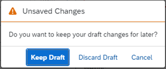
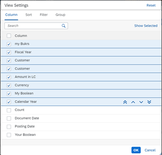

<!-- loio1492551a0b8d4f58adc46eefcf58a2fa -->

# What's New in SAPUI5 1.92

With this release SAPUI5 is upgraded from version 1.91 to 1.92.

<a name="loio1492551a0b8d4f58adc46eefcf58a2fa__section_yvs_ksr_2qb"/>

## Preview and Announcements

The following information concerns important upcoming changes for end users. These changes may require end users to adjust and/or test cases to be adapted, but they won't stop or disrupt software or processes.

<table>
<tr>
<th valign="top">

Type

</th>
<th valign="top">

Description

</th>
<th valign="top">

Available as of SAPUI5 Version

</th>
</tr>
<tr>
<td valign="top">

UI Change

</td>
<td valign="top">

**Dialog for Smart Controls**

We have improved the usability of the *View Settings* dialog for the smart chart and the smart table and made it more consistent with other dialogs. For example, we have changed the settings for selecting columns as well as sorting, filtering, and grouping them: They are now no longer buttons but tabs. For more information, see [Improved Controls](what-s-new-in-sapui5-1-92-1492551.md#loio1492551a0b8d4f58adc46eefcf58a2fa__section_rqn_wd5_zcb).

</td>
<td valign="top">

1.92

</td>
</tr>
<tr>
<td valign="top">

UI Change

</td>
<td valign="top">

**Confirmation Message for Drafts**

When a user has created or edited an object in a draft-enabled object page app that is based on SAP Fiori elements and tries to leave the object without saving the changes, a message box is displayed that asks the user to keep or discard the draft.

</td>
<td valign="top">

1.92

</td>
</tr>
</table>

<a name="loio1492551a0b8d4f58adc46eefcf58a2fa__section_bkm_s15_zcb"/>

## New Controls

<table>
<tr>
<td valign="top">

**`sap.m.DynamicDateRange` \(Experimental\)**

The new \(experimental\) `DynamicDateRange` control enables users to select absolute and relative dates and date ranges using a different offset from the current date. Application developers can configure the list of values offered. The `DynamicDateRange` control supports several standard options, but as a developer, you can also define a custom option that fits your specific use case. For more information, see the [API Reference](https://ui5.sap.com/#/api/sap.m.DynamicDateRange) and the [Sample](https://ui5.sap.com/#/entity/sap.m.DynamicDateRange).

</td>
</tr>
</table>

<a name="loio1492551a0b8d4f58adc46eefcf58a2fa__section_qwl_pb5_zcb"/>

## Improved Features

<table>
<tr>
<td valign="top">

**SAPUI5 OData V4 Model**

The new version of the SAPUI5 OData V4 model introduces the following features:

-   The `sap.ui.model.odata.v4.Context#setKeepAlive` method now provides an additional `bRequestMessages` parameter that allows you to request bound messages for the kept-alive context. The message property is identified through the `com.sap.vocabularies.Common.v1.Messages` annotation. For more information, see [Server Messages in the OData V4 Model](../04_Essentials/server-messages-in-the-odata-v4-model-fbe1cb5.md).

-   You can now execute actions with the `Prefer` header `handling=strict`. For more information, see [Strict Handling](../04_Essentials/odata-operations-b54f789.md#loiob54f7895b7594c61a83fa7257fa9d13f__section_SH).

-   We now support absolute property bindings of `$count`. Note that this will display the count as it is provided by the server. If a count that includes transient entries is required, the header context has to be used. For more information, see [Binding Collection Inline Count](../04_Essentials/binding-collection-inline-count-77d2310.md).

</td>
</tr>
</table>

<a name="loio1492551a0b8d4f58adc46eefcf58a2fa__section_rqn_wd5_zcb"/>

## Improved Controls

<table>
<tr>
<td valign="top">

**`sap.m.Dialog`**

We have updated the colors of value-state status icons. Now, they have better color-contrast ratios for improved accessibility. For more information, see the [Sample](https://ui5.sap.com/#/entity/sap.m.Dialog/sample/sap.m.sample.DialogMessage).

</td>
</tr>
<tr>
<td valign="top">

**`sap.m.List, sap.m.Table, sap.m.Tree`**

We have provided the new `requestItems` method that lets you load more data in a control. You can now trigger the growing feature manually, if the `growing` property is set to `true`. For more information, see the [API Reference](https://ui5.sap.com/#/api/sap.m.ListBase%23methods/requestItems).

</td>
</tr>
<tr>
<td valign="top">

**`sap.m.QuickViewPage`**

The control now supports avatars, which display business objects, images, initials, and more. To enable this functionality, the `QuickViewPage` control uses `sap.m.Avatar` as an aggregation. The `icon` and `fallbackIcon` properties of the `QuickViewPage` are now deprecated. Instead, developers should use the functionality of the new `avatar` aggregation. For more information, see the [API Reference](https://ui5.sap.com/#/api/sap.m.QuickViewPage) and the [Sample](https://ui5.sap.com/#/entity/sap.m.QuickView/sample/sap.m.sample.QuickViewAvatarConfiguration).

</td>
</tr>
<tr>
<td valign="top">

**`sap.ui.comp.smartchart.SmartChart`, `sap.ui.comp.smarttable.SmartTable`**

We have improved the usability of the *View Settings* dialog in these controls and made it more consistent with other dialogs. For example, we have changed the following:

-   We changed the settings for selecting columns as well as sorting, filtering, and grouping them: They are now no longer buttons but tabs. This has also been changed for `SmartChart`.

-   The icons have been aligned with the general SAP Fiori guidelines.

-   To change the order of columns, you can now drag and drop the entries in the list. You can also use the icons in each row.

-   Sorting has been simplified for both `SmartChart` and `SmartTable`.

-   If you choose the *Reset* button, you receive a warning that you are about to set back your changes.

 

 For more information, see the [API Reference](https://ui5.sap.com/#/api/sap.ui.comp.smarttable.SmartTable) and the [Sample](https://ui5.sap.com/#/entity/sap.ui.comp.smarttable.SmartTable/sample/sap.ui.comp.sample.smarttable.mtableCustom).

</td>
</tr>
<tr>
<td valign="top">

**`sap.ui.comp.smarttable.SmartTable`**

We have introduced a global `customData` setting that allows you to configure the `preserveDecimals` format for the `Edm.Decimal` type as well as for units and currencies. This way, you can keep the decimals returned by the back end. For more information, see the [API Reference](https://ui5.sap.com/#/api/sap.ui.comp.smarttable.SmartTable) and the [Sample](https://ui5.sap.com/#/entity/sap.ui.comp.smarttable.SmartTable/sample/sap.ui.comp.sample.smarttable.smartTableWithCriticality).

</td>
</tr>
<tr>
<td valign="top">

**`sap.ui.integration.widgets.Card`**

The charts in the Analytical card now support \(in experimental state\) interactions on the detail level. Until now, users could only interact with the whole content area. Now, the user can click on separate points of the charts. As an application developer you can configure two optional scenarios upon click:

-   Trigger navigation actions defined by the `actionableArea` \(experimental\) property.

-   Open a popover with more details about the selected point defined by the `popover` \(experimental\) property.

For more information, see the [Analytical Card](https://ui5.sap.com/test-resources/sap/ui/integration/demokit/cardExplorer/webapp/index.html#/learn/types/analytical) section and the [Chart Actions](https://ui5.sap.com/test-resources/sap/ui/integration/demokit/cardExplorer/webapp/index.html#/explore/analytical/chartActions) and [Details Popover](https://ui5.sap.com/test-resources/sap/ui/integration/demokit/cardExplorer/webapp/index.html#/explore/analytical/detailsPopover) samples in the Card Explorer.

</td>
</tr>
<tr>
<td valign="top">

**`sap.ui.layout.ResponsiveSplitter`**

We have added a new `resize` event, fired when the contents of the `sap.ui.layout.PaneContainer` are resized. For more information, see the [API Reference](https://ui5.sap.com/#/api/sap.ui.layout.PaneContainer) and the [Sample](https://ui5.sap.com/#/entity/sap.ui.layout.ResponsiveSplitter/sample/sap.ui.layout.sample.ResponsiveSplitter).

</td>
</tr>
</table>

<a name="loio1492551a0b8d4f58adc46eefcf58a2fa__section_yxw_pxt_zcb"/>

## Deprecations

<table>
<tr>
<td valign="top">

**Deprecation of String-Based Rendering**

String-based rendering \(also known as "apiVersion 1" of a renderer\) has been deprecated. Please use the [Semantic Rendering API \("apiVersion 2"\)](https://ui5.sap.com/#/api/sap.ui.core.RenderManager) instead.For a complete list of all deprecations, see [Deprecated APIs](https://ui5.sap.com/#/api/deprecated).

</td>
</tr>
</table>

<a name="loio1492551a0b8d4f58adc46eefcf58a2fa__section_g3r_bf5_zcb"/>

## SAP Fiori Elements

<table>
<tr>
<td valign="top">

The following changes and new features are available for SAP Fiori elements for OData V4:

-   You can now define an integer value or a string containing an integer value that defines the maximum number of lines that the text field can grow to when it is editable before a scrollbar is shown. For more information, see the section *Manifest-Based Definition of the Length of a Text Field* in the topic [Different Representations of a Field](../06_SAP_Fiori_Elements/different-representations-of-a-field-c18ada4.md).

-   You can now enable the button to toggle between draft and saved values on the object page. For more information, see [Toggling Between Draft and Saved Values](../06_SAP_Fiori_Elements/toggling-between-draft-and-saved-values-fd3950a.md).

-   SAP Fiori elements for OData V4 now supports inbound processing of values coming for navigation properties when the filter bar is available in the target application. For more information, see the section *Handling Incoming Filters for Navigation Entity Set Properties* in the topic [Navigation to an App \(Inbound Navigation\)](../06_SAP_Fiori_Elements/navigation-to-an-app-inbound-navigation-c337d8b.md).

-   You can now easily see which table, column or row an error message is related to if the app contains many tables, since error messages are now grouped accordingly. For more information, see *Handling Bound Messages* \> *Layout: Message Popover* \> *Group Name* in [Using Messages](../06_SAP_Fiori_Elements/using-messages-239b192.md).

-   When displaying the quick view of semantic links, SAP Fiori elements for OData V4 now ensures that links are always shown in the footer, and that a subtitle is always shown in the header. For more information, see [Configuring the Content of Quick Views](../06_SAP_Fiori_Elements/configuring-the-content-of-quick-views-c245ad7.md).

</td>
</tr>
</table>

**Related Information**  

[What's New in SAPUI5 1.108](what-s-new-in-sapui5-1-108-799291a.md "With this release SAPUI5 is upgraded from version 1.107 to 1.108.")

[What's New in SAPUI5 1.107](what-s-new-in-sapui5-1-107-b88b40e.md "With this release SAPUI5 is upgraded from version 1.106 to 1.107.")

[What's New in SAPUI5 1.106](what-s-new-in-sapui5-1-106-c70bb90.md "With this release SAPUI5 is upgraded from version 1.105 to 1.106.")

[What's New in SAPUI5 1.105](what-s-new-in-sapui5-1-105-5567dcc.md "With this release SAPUI5 is upgraded from version 1.104 to 1.105.")

[What's New in SAPUI5 1.104](what-s-new-in-sapui5-1-104-f01ebd4.md "With this release SAPUI5 is upgraded from version 1.103 to 1.104.")

[What's New in SAPUI5 1.103](what-s-new-in-sapui5-1-103-7534ae8.md "With this release SAPUI5 is upgraded from version 1.102 to 1.103.")

[What's New in SAPUI5 1.102](what-s-new-in-sapui5-1-102-b530db3.md "With this release SAPUI5 is upgraded from version 1.101 to 1.102.")

[What's New in SAPUI5 1.101](what-s-new-in-sapui5-1-101-5a18410.md "With this release SAPUI5 is upgraded from version 1.100 to 1.101.")

[What's New in SAPUI5 1.100](what-s-new-in-sapui5-1-100-5deb78f.md "With this release SAPUI5 is upgraded from version 1.99 to 1.100.")

[What's New in SAPUI5 1.99](what-s-new-in-sapui5-1-99-5e35c25.md "With this release SAPUI5 is upgraded from version 1.98 to 1.99.")

[What's New in SAPUI5 1.98](what-s-new-in-sapui5-1-98-7aacb4e.md "With this release SAPUI5 is upgraded from version 1.97 to 1.98.")

[What's New in SAPUI5 1.97](what-s-new-in-sapui5-1-97-f21858f.md "With this release SAPUI5 is upgraded from version 1.96 to 1.97.")

[What's New in SAPUI5 1.96](what-s-new-in-sapui5-1-96-b39a11b.md "With this release SAPUI5 is upgraded from version 1.95 to 1.96.")

[What's New in SAPUI5 1.95](what-s-new-in-sapui5-1-95-1b09465.md "With this release SAPUI5 is upgraded from version 1.94 to 1.95.")

[What's New in SAPUI5 1.94](what-s-new-in-sapui5-1-94-2d6ffdd.md "With this release SAPUI5 is upgraded from version 1.93 to 1.94.")

[What's New in SAPUI5 1.93](what-s-new-in-sapui5-1-93-e9c8356.md "With this release SAPUI5 is upgraded from version 1.92 to 1.93.")

[What's New in SAPUI5 1.91](what-s-new-in-sapui5-1-91-75777da.md "With this release SAPUI5 is upgraded from version 1.90 to 1.91.")

[What's New in SAPUI5 1.90](what-s-new-in-sapui5-1-90-b475202.md "With this release SAPUI5 is upgraded from version 1.89 to 1.90.")

[What's New in SAPUI5 1.89](what-s-new-in-sapui5-1-89-0805036.md "With this release SAPUI5 is upgraded from version 1.88 to 1.89.")

[What's New in SAPUI5 1.88](what-s-new-in-sapui5-1-88-bda141b.md "With this release SAPUI5 is upgraded from version 1.87 to 1.88.")

[What's New in SAPUI5 1.87](what-s-new-in-sapui5-1-87-e315108.md "With this release SAPUI5 is upgraded from version 1.86 to 1.87.")

[What's New in SAPUI5 1.86](what-s-new-in-sapui5-1-86-067e2fb.md "With this release SAPUI5 is upgraded from version 1.85 to 1.86.")

[What's New in SAPUI5 1.85](what-s-new-in-sapui5-1-85-eeb5bd9.md "With this release SAPUI5 is upgraded from version 1.84 to 1.85.")

[What's New in SAPUI5 1.84](what-s-new-in-sapui5-1-84-ccf76b7.md "With this release SAPUI5 is upgraded from version 1.82 to 1.84.")

[What's New in SAPUI5 1.82](what-s-new-in-sapui5-1-82-f081cf0.md "With this release SAPUI5 is upgraded from version 1.81 to 1.82.")

[What's New in SAPUI5 1.81](what-s-new-in-sapui5-1-81-f71563c.md "With this release SAPUI5 is upgraded from version 1.80 to 1.81.")

[What's New in SAPUI5 1.80](what-s-new-in-sapui5-1-80-3294c68.md "With this release SAPUI5 is upgraded from version 1.79 to 1.80.")

[What's New in SAPUI5 1.79](what-s-new-in-sapui5-1-79-edf8e35.md "With this release SAPUI5 is upgraded from version 1.78 to 1.79.")

[What's New in SAPUI5 1.78](what-s-new-in-sapui5-1-78-d176be3.md "With this release SAPUI5 is upgraded from version 1.77 to 1.78.")

[What's New in SAPUI5 1.77](what-s-new-in-sapui5-1-77-2ec6b6b.md "With this release SAPUI5 is upgraded from version 1.76 to 1.77.")

[What's New in SAPUI5 1.76](what-s-new-in-sapui5-1-76-b9b0a3f.md "With this release SAPUI5 is upgraded from version 1.75 to 1.76.")

[What's New in SAPUI5 1.75](what-s-new-in-sapui5-1-75-dc3d3ce.md "With this release SAPUI5 is upgraded from version 1.74 to 1.75.")

[What's New in SAPUI5 1.74](what-s-new-in-sapui5-1-74-21fc6cb.md "With this release SAPUI5 is upgraded from version 1.73 to 1.74.")

[What's New in SAPUI5 1.73](what-s-new-in-sapui5-1-73-7b82664.md "With this release SAPUI5 is upgraded from version 1.72 to 1.73.")

[What's New in SAPUI5 1.72](what-s-new-in-sapui5-1-72-25e5326.md "With this release SAPUI5 is upgraded from version 1.71 to 1.72.")

[What's New in SAPUI5 1.71](what-s-new-in-sapui5-1-71-609fd01.md "With this release SAPUI5 is upgraded from version 1.70 to 1.71.")

[What's New in SAPUI5 1.70](what-s-new-in-sapui5-1-70-4e89fee.md "With this release SAPUI5 is upgraded from version 1.69 to 1.70.")

[What's New in SAPUI5 1.69](what-s-new-in-sapui5-1-69-41203fd.md "With this release SAPUI5 is upgraded from version 1.68 to 1.69.")

[What's New in SAPUI5 1.68](what-s-new-in-sapui5-1-68-5531aef.md "With this release SAPUI5 is upgraded from version 1.67 to 1.68.")

[What's New in SAPUI5 1.67](what-s-new-in-sapui5-1-67-0968958.md "With this release SAPUI5 is upgraded from version 1.66 to 1.67.")

[What's New in SAPUI5 1.66](what-s-new-in-sapui5-1-66-ebe7fda.md "With this release SAPUI5 is upgraded from version 1.65 to 1.66.")

[What's New in SAPUI5 1.65](what-s-new-in-sapui5-1-65-9d2b189.md "With this release SAPUI5 is upgraded from version 1.64 to 1.65.")

[What's New in SAPUI5 1.64](what-s-new-in-sapui5-1-64-1975e30.md "With this release SAPUI5 is upgraded from version 1.63 to 1.64.")

[What's New in SAPUI5 1.63](what-s-new-in-sapui5-1-63-77e1dcc.md "With this release SAPUI5 is upgraded from version 1.62 to 1.63.")

[What's New in SAPUI5 1.62](what-s-new-in-sapui5-1-62-27eea38.md "With this release SAPUI5 is upgraded from version 1.61 to 1.62.")

[What's New in SAPUI5 1.61](what-s-new-in-sapui5-1-61-de4d50b.md "With this release SAPUI5 is upgraded from version 1.60 to 1.61.")

[What's New in SAPUI5 1.60](what-s-new-in-sapui5-1-60-2a70354.md "With this release SAPUI5 is upgraded from version 1.58 to 1.60.")

[What's New in SAPUI5 1.58](what-s-new-in-sapui5-1-58-b28edde.md "With this release, SAPUI5 is upgraded from version 1.56 to 1.58.")

[What's New in SAPUI5 1.56](what-s-new-in-sapui5-1-56-53b4b5e.md "With this release, SAPUI5 is upgraded from version 1.54 to 1.56.")

[What's New in SAPUI5 1.54](what-s-new-in-sapui5-1-54-f29023e.md "With this release, SAPUI5 is upgraded from version 1.52 to 1.54.")

[What's New in SAPUI5 1.52](what-s-new-in-sapui5-1-52-a09dd79.md "With this release, SAPUI5 is upgraded from version 1.50 to 1.52.")

[What's New in SAPUI5 1.50](what-s-new-in-sapui5-1-50-a844984.md "With this release, SAPUI5 is upgraded from version 1.48 to 1.50.")

[What's New in SAPUI5 1.48](what-s-new-in-sapui5-1-48-2818f80.md "With this release, SAPUI5 is upgraded from version 1.46 to 1.48.")

[What's New in SAPUI5 1.46](what-s-new-in-sapui5-1-46-4cf0986.md "With this release, SAPUI5 is upgraded from version 1.44 to 1.46.")

[What's New in SAPUI5 1.44](what-s-new-in-sapui5-1-44-05ce1dc.md "With this release, SAPUI5 is upgraded from version 1.42 to 1.44.")

[What's New in SAPUI5 1.42](what-s-new-in-sapui5-1-42-4768f1a.md "With this release, SAPUI5 is upgraded from version 1.40 to 1.42.")

[What's New in SAPUI5 1.40](what-s-new-in-sapui5-1-40-e659bd2.md "With this release, SAPUI5 is upgraded from version 1.38 to 1.40.")

[What's New in SAPUI5 1.38](what-s-new-in-sapui5-1-38-6a875f9.md#loio6a875f998994489483e8085705347d72 "With this release, SAPUI5 is upgraded from version 1.36 to 1.38.")

