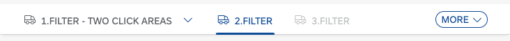
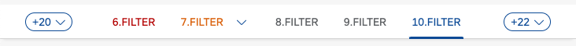
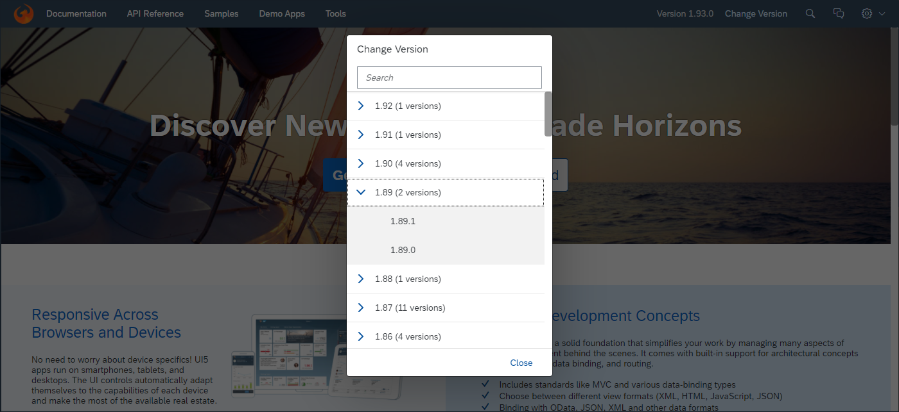

<!-- loiof273340e4c3f4d4180296af070f59f50 -->

# What's New in SAPUI5 1.93

With this release SAPUI5 is upgraded from version 1.92 to 1.93.

****

<table>
<tr>
<th valign="top">

Version

</th>
<th valign="top">

Type

</th>
<th valign="top">

Category

</th>
<th valign="top">

Title

</th>
<th valign="top">

Description

</th>
<th valign="top">

Action

</th>
<th valign="top">

Available as of

</th>
</tr>
<tr>
<td valign="top">

1.93 

</td>
<td valign="top">

New 

</td>
<td valign="top">

Feature 

</td>
<td valign="top">

**New Theme Available for SAP Fiori User Experience \(Experimental\)** 

</td>
<td valign="top">

**New Theme Available for SAP Fiori User Experience \(Experimental\)**

We have introduced a new theme with SAPUI5 1.93.3, the preview version of the *Horizon* visual theme for SAP Fiori \(theme ID: `sap_horizon`\), as an addition to the existing themes. To preview the new theme, see [https://ui5.sap.com/?sap-ui-theme=sap\_horizon\#/controls](https://ui5.sap.com/?sap-ui-theme=sap_horizon#/controls).

> ### Note:  
> The theme has the status 'experimental' and thus is subject to change. It must not be used as a basis for custom themes as long as the status is 'experimental'.

New•Feature•Info Only•1.93

</td>
<td valign="top">

Info Only

</td>
<td valign="top">

2021-08-12

</td>
</tr>
<tr>
<td valign="top">

1.93 

</td>
<td valign="top">

Changed 

</td>
<td valign="top">

Feature 

</td>
<td valign="top">

**SAPUI5 Data Types** 

</td>
<td valign="top">

**SAPUI5 Data Types**

The new version of SAPUI5 introduces a new `skipDecimalsValidation` constraint for the `sap.ui.model.odata.type.Unit` and `sap.ui.model.odata.type.Currency` data types. It allows you to switch off validation on the number of decimals.

Changed•Feature•Info Only•1.93

</td>
<td valign="top">

Info Only 

</td>
<td valign="top">

2021-08-12

</td>
</tr>
<tr>
<td valign="top">

1.93 

</td>
<td valign="top">

Changed 

</td>
<td valign="top">

Feature 

</td>
<td valign="top">

**SAPUI5 OData V2 Model** 

</td>
<td valign="top">

**SAPUI5 OData V2 Model**

The new version of the SAPUI5 OData V2 model introduces the following features:

-   An OData V2-specific context, `sap.ui.model.odata.v2.Context`. Methods of the OData V2 model now return this context instead of the basis context, `sap.ui.model.Context`.

-   The new `sap.ui.model.ListBinding#getCount` method, which returns the count of entries in a list.

Changed•Feature•Info Only•1.93

</td>
<td valign="top">

Info Only 

</td>
<td valign="top">

2021-08-12

</td>
</tr>
<tr>
<td valign="top">

1.93 

</td>
<td valign="top">

Changed 

</td>
<td valign="top">

Feature 

</td>
<td valign="top">

**SAPUI5 OData V4 Model** 

</td>
<td valign="top">

**SAPUI5 OData V4 Model**

The new version of the SAPUI5 OData V4 model introduces the following features:

-   A `search` property in the `$$aggregation` binding parameter that allows you to specify a search that is executed before the aggregation. Note that this requires the service to support the `search` transformation in `$apply`. For more information, see [Search Before Data Aggregation](../04_Essentials/extension-for-data-aggregation-7d91431.md#loio7d914317c0b64c23824bf932cc8a4ae1__section_SBDA).

-   A `retryAfter` property in the technical details of a message originating from a response with a `Retry-After` header. For more information, see [Accessing the HTTP Status Code](../04_Essentials/server-messages-in-the-odata-v4-model-fbe1cb5.md#loiofbe1cb5613cf4a40a841750bf813238e__section_httpStatus).

Changed•Feature•Info Only•1.93

</td>
<td valign="top">

Info Only 

</td>
<td valign="top">

2021-08-12

</td>
</tr>
<tr>
<td valign="top">

1.93 

</td>
<td valign="top">

Changed 

</td>
<td valign="top">

Control 

</td>
<td valign="top">

**`sap.f.DynamicPage`** 

</td>
<td valign="top">

**`sap.f.DynamicPage`**

With the new `headerPinned` property and `headerContentPinnedStateChange` event, you can now control the pinned state of the `DynamicPageHeader` programmatically.For more information, see the [API Reference](https://ui5.sap.com/#/api/sap.f.DynamicPage).

Changed•Control•Info Only•1.93

</td>
<td valign="top">

Info Only 

</td>
<td valign="top">

2021-08-12

</td>
</tr>
<tr>
<td valign="top">

1.93 

</td>
<td valign="top">

Changed 

</td>
<td valign="top">

Control 

</td>
<td valign="top">

**`sap.m.IconTabBar`** 

</td>
<td valign="top">

**`sap.m.IconTabBar`**

-   We have updated the design of the overflow tab according to the latest SAP Fiori guidelines.

    

    Additionally, when using the `StartAndEnd` tab overflow mode, both overflow tabs will display the number of tabs that they hold.

    

    For more information, see the [Sample](https://ui5.sap.com/#/entity/sap.m.IconTabBar/sample/sap.m.sample.IconTabBarStartAndEndOverflow).

-   When the control is used in `Inline` header mode, icons can be added in front of the tab-filter titles. This allows, for example, the `sap.m.IconTabBar` control to be used as a horizontal navigation in the `sap.tnt.ToolHeader`.For more information, see the [Sample](https://ui5.sap.com/#/entity/sap.m.IconTabBar/sample/sap.m.sample.IconTabBarInlineIcons).

Changed•Control•Info Only•1.93

</td>
<td valign="top">

Info Only 

</td>
<td valign="top">

2021-08-12

</td>
</tr>
<tr>
<td valign="top">

1.93 

</td>
<td valign="top">

Changed 

</td>
<td valign="top">

Control 

</td>
<td valign="top">

**`sap.m.List, sap.m.Table, sap.m.Tree`** 

</td>
<td valign="top">

**`sap.m.List, sap.m.Table, sap.m.Tree`**

We have provided a new toggle option in multi-selection mode for these controls: If the new `multiSelectMode` property has the `Default` value, the table renders the *Select All* checkbox in the column header as before. If the value of the property is `ClearAll`, the *Select All* checkbox and the related feature are no longer available. The list or table then provides an option to deselect all selected items at once. For more information, see the [API Reference](https://ui5.sap.com/#/api/sap.m.ListBase%23methods/getMultiSelectMode) and the [Sample](https://ui5.sap.com/#/entity/sap.m.Table/sample/sap.m.sample.TableMultiSelectMode).

Changed•Control•Info Only•1.93

</td>
<td valign="top">

Info Only 

</td>
<td valign="top">

2021-08-12

</td>
</tr>
<tr>
<td valign="top">

1.93 

</td>
<td valign="top">

Changed 

</td>
<td valign="top">

Control 

</td>
<td valign="top">

**`sap.m.MultiComboBox`** 

</td>
<td valign="top">

**`sap.m.MultiComboBox`**

We have the range selection functionality in `sap.m.MultiComboBox`. Two new parameters have been introduced to the `selectionChange` event: `changedItems` and `selectAll`. Users can now select a group of items by holding the [Shift\] key and selecting the checkboxes of the first and the last items from the desired group. For more information, see the [Sample](https://ui5.sap.com/#/entity/sap.m.MultiComboBox/sample/sap.m.sample.MultiComboBox).

Changed•Control•Info Only•1.93

</td>
<td valign="top">

Info Only 

</td>
<td valign="top">

2021-08-12

</td>
</tr>
<tr>
<td valign="top">

1.93 

</td>
<td valign="top">

Changed 

</td>
<td valign="top">

Control 

</td>
<td valign="top">

**`sap.m.PlanningCalendar`** 

</td>
<td valign="top">

**`sap.m.PlanningCalendar`**

-   Application developers can now define relative timeframes that are different from the absolute values in the calendar. A relative view displays periods that are relative to a given custom start date. Common use-case scenarios include Week X, Day X \(since the start of a project\), etc. This feature is in experimental state. For more information, see the [API Reference](https://ui5.sap.com/#/api/sap.m.PlanningCalendarView) and the [Sample](https://ui5.sap.com/#/entity/sap.m.PlanningCalendar/sample/sap.m.sample.PlanningCalendarRelativeViews). 

-   We have introduced \(in experimental state\) a way to place custom content inside the `CalendarAppointment` control for non-SAP Fiori \(custom\) applications with a freestyle nature. When the `customContent` aggregation is used, the `title`, `text`, `description`, and `icon` properties of the appointment are ignored. The application developer must ensure that all of the accessibility requirements are met, and that the height of the content conforms with the height provided by the appointment. We do not recommend using interactive controls as content, as they may trigger unwanted selection of the appointment with unpredictable results. For more information, see the [API Reference](https://ui5.sap.com/#/api/sap.ui.unified.CalendarAppointment).

Changed•Control•Info Only•1.93

</td>
<td valign="top">

Info Only 

</td>
<td valign="top">

2021-08-12

</td>
</tr>
<tr>
<td valign="top">

1.93 

</td>
<td valign="top">

Changed 

</td>
<td valign="top">

Control 

</td>
<td valign="top">

**`sap.m.SelectDialog`, `sap.m.TableSelectDialog`** 

</td>
<td valign="top">

**`sap.m.SelectDialog`, `sap.m.TableSelectDialog`**

The `updateStarted`, `updateFinished`, and `selectionChange` events from an inner list or a table are now exposed to the `sap.m.SelectDialog` and `sap.m.TableSelectDialog` controls. Application developers can use these events to achieve lazy loading with JSON model. For more information, see the [Sample](https://ui5.sap.com/#/entity/sap.m.SelectDialog/sample/sap.m.sample.SelectDialogLazyLoading).

Changed•Control•Info Only•1.93

</td>
<td valign="top">

Info Only 

</td>
<td valign="top">

2021-08-12

</td>
</tr>
<tr>
<td valign="top">

1.93 

</td>
<td valign="top">

Changed 

</td>
<td valign="top">

Control 

</td>
<td valign="top">

**`sap.tnt.ToolPage`** 

</td>
<td valign="top">

**`sap.tnt.ToolPage`**

We have added a new `subHeader` aggregation to the control. You can use it to create a horizontal navigation bar in the tool page layout. For more information, see the [Sample](https://ui5.sap.com/#/entity/sap.tnt.ToolPage/sample/sap.tnt.sample.ToolPageNavigation).

Changed•Control•Info Only•1.93

</td>
<td valign="top">

Info Only 

</td>
<td valign="top">

2021-08-12

</td>
</tr>
<tr>
<td valign="top">

1.93 

</td>
<td valign="top">

Changed 

</td>
<td valign="top">

Control 

</td>
<td valign="top">

**`sap.ui.integration.widgets.Card`** 

</td>
<td valign="top">

**`sap.ui.integration.widgets.Card`**

-   We have introduced a Configuration Editor tool that supports the card integration process on the customer side. Roles that can use the Configuration Editor include local administrators, page/content administrators, and translators. For more information, see the [Configuration Editor](https://ui5.sap.com/test-resources/sap/ui/integration/demokit/cardExplorer/webapp/index.html#/designtime/overview) section and a [Card Sample](https://ui5.sap.com/test-resources/sap/ui/integration/demokit/cardExplorer/webapp/index.html#/explore/list) in the Card Explorer.

-   We have added \(in experimental state\) a new feature, and now Integration cards can have a footer with actionable buttons. Additionally, the List type card is enhanced and now list items support the same actionable buttons, including the option to remove the item. This behavior is achieved using the new `actionsStrip` \(experimental\) property that describes all buttons and their behavior. For more information, see the [Footer](https://ui5.sap.com/test-resources/sap/ui/integration/demokit/cardExplorer/webapp/index.html#/learn/footer), and [List Card](https://ui5.sap.com/test-resources/sap/ui/integration/demokit/cardExplorer/webapp/index.html#/learn/types/list) sections, and the [Footer](https://ui5.sap.com/test-resources/sap/ui/integration/demokit/cardExplorer/webapp/index.html#/explore/footer) and [List Card Quick Actions](https://ui5.sap.com/test-resources/sap/ui/integration/demokit/cardExplorer/webapp/index.html#/explore/list/quickActions) samples in the Card Explorer.

Changed•Control•Info Only•1.93

</td>
<td valign="top">

Info Only 

</td>
<td valign="top">

2021-08-12

</td>
</tr>
<tr>
<td valign="top">

1.93 

</td>
<td valign="top">

Changed 

</td>
<td valign="top">

Control 

</td>
<td valign="top">

**`sap.uxap.ObjectPageLayout`** 

</td>
<td valign="top">

**`sap.uxap.ObjectPageLayout`**

With the new `headerContentPinned` property and `pinnedStateChange` event, you can now control the pinned state of the `DynamicPageHeader` programmatically.For more information, see the [API Reference](https://ui5.sap.com/#/api/sap.uxap.ObjectPageLayout).

Changed•Control•Info Only•1.93

</td>
<td valign="top">

Info Only 

</td>
<td valign="top">

2021-08-12

</td>
</tr>
<tr>
<td valign="top">

1.93 

</td>
<td valign="top">

Changed 

</td>
<td valign="top">

SAP Fiori Elements 

</td>
<td valign="top">

**SAP Fiori elements for OData V4** 

</td>
<td valign="top">

**SAP Fiori elements for OData V4**

The following changes and new features are available for SAP Fiori elements for OData V4:

-   The content for the analytical list page has been enhanced with information for SAP Fiori elements for OData V4. For more information, see [Analytical List Page](../06_SAP_Fiori_Elements/analytical-list-page-3d33684.md).

-   App developers can now use singletons to influence the visibility of the *Create*, *Delete*, and *Edit* buttons. For more information, see [Adding Actions to Tables](../06_SAP_Fiori_Elements/adding-actions-to-tables-b623e0b.md).

-   Key users can now use variant management in the list report via SAPUI5 flexibility. For more information, see [Enabling an App for Key User Adaptation](../06_SAP_Fiori_Elements/enabling-an-app-for-key-user-adaptation-ccd45ba.md).

-   App developers can now use fractional digits on visual filters. For more information, see [Visual Filters](../06_SAP_Fiori_Elements/visual-filters-1714720.md).

-   App developers can now edit the values used in a custom header facet. For more information, see [Extension Points for Object Page Header Facets](../06_SAP_Fiori_Elements/extension-points-for-object-page-header-facets-61cf0ee.md).

-   The `FlexibleColumnLayoutActions` building block provides you with an easy way to instantiate the *Close*, *Enter Full Screen*, and *Exit Full Screen* buttons. For more information, see  <?sap-ot O2O class="- topic/xref " href="24c1304739dd4f19af0ce2482c4d9bbe.xml" text="Building Blocks" desc="" xtrc="xref:35" xtrf="file:/home/builder/src/dita-all/zyl1693565473561/loioa82e269bbb584cfcbdbd3ae8765d8e7f_en-US/src/content/localization/en-us/f273340e4c3f4d4180296af070f59f50.xml" ?> .

-   App developers can now display custom content in a dedicated tab together with regular tabs defined through annotations. For more information, see [Extension Points for Views in the List Report](../06_SAP_Fiori_Elements/extension-points-for-views-in-the-list-report-eb37203.md).

-   App developers can now use the `MicroChart` building block and the `Share` building block. For more information, see  <?sap-ot O2O class="- topic/xref " href="24c1304739dd4f19af0ce2482c4d9bbe.xml" text="Building Blocks" desc="" xtrc="xref:39" xtrf="file:/home/builder/src/dita-all/zyl1693565473561/loioa82e269bbb584cfcbdbd3ae8765d8e7f_en-US/src/content/localization/en-us/f273340e4c3f4d4180296af070f59f50.xml" ?> .

Changed•SAP Fiori Elements•Info Only•1.93

</td>
<td valign="top">

Info Only 

</td>
<td valign="top">

2021-08-12

</td>
</tr>
<tr>
<td valign="top">

1.93 

</td>
<td valign="top">

Changed 

</td>
<td valign="top">

User Documentation 

</td>
<td valign="top">

**FAQ for Smart Controls** 

</td>
<td valign="top">

**FAQ for Smart Controls**

To help you find all information about a control in a single place, we have moved the FAQ for several controls from the SAPUI5 documentation to the *API Reference* of the Demo Kit. In particular, we have moved the FAQ for the following smart controls:

-   [`SmartField`](https://ui5.sap.com/#/api/sap.ui.comp.smartfield.SmartField%23faq)

-   [`SmartFilterBar`](https://ui5.sap.com/#/api/sap.ui.comp.smartfilterbar.SmartFilterBar%23faq)

-   [`SmartTable`](https://ui5.sap.com/#/api/sap.ui.comp.smarttable.SmartTable%23faq)

You can now find them on the new *FAQ* tab in the *API Reference*.

Changed•User Documentation•Info Only•1.93

</td>
<td valign="top">

Info Only 

</td>
<td valign="top">

2021-08-12

</td>
</tr>
<tr>
<td valign="top">

1.93 

</td>
<td valign="top">

Changed 

</td>
<td valign="top">

Feature 

</td>
<td valign="top">

**Demo Kit Change Version Dialog** 

</td>
<td valign="top">

**Demo Kit Change Version Dialog**

We have improved the *Change Version* dialog to help you find the desired version faster. We grouped the patch numbers according to minor version, and we added a search field.

Changed•Feature•Info Only•1.93

</td>
<td valign="top">

Info Only 

</td>
<td valign="top">

2021-08-12

</td>
</tr>
</table>

**Related Information**  

[What's New in SAPUI5 1.117](what-s-new-in-sapui5-1-117-029d3b4.md "With this release SAPUI5 is upgraded from version 1.116 to 1.117.")

[What's New in SAPUI5 1.116](what-s-new-in-sapui5-1-116-ebd6f34.md "With this release SAPUI5 is upgraded from version 1.115 to 1.116.")

[What's New in SAPUI5 1.115](what-s-new-in-sapui5-1-115-409fde8.md "With this release SAPUI5 is upgraded from version 1.114 to 1.115.")

[What's New in SAPUI5 1.114](what-s-new-in-sapui5-1-114-890fce1.md "With this release SAPUI5 is upgraded from version 1.113 to 1.114.")

[What's New in SAPUI5 1.113](what-s-new-in-sapui5-1-113-a9553fe.md "With this release SAPUI5 is upgraded from version 1.112 to 1.113.")

[What's New in SAPUI5 1.112](what-s-new-in-sapui5-1-112-34afc69.md "With this release SAPUI5 is upgraded from version 1.111 to 1.112.")

[What's New in SAPUI5 1.111](what-s-new-in-sapui5-1-111-7a67837.md "With this release SAPUI5 is upgraded from version 1.110 to 1.111.")

[What's New in SAPUI5 1.110](what-s-new-in-sapui5-1-110-71a855c.md "With this release SAPUI5 is upgraded from version 1.109 to 1.110.")

[What's New in SAPUI5 1.109](what-s-new-in-sapui5-1-109-3264bd2.md "With this release SAPUI5 is upgraded from version 1.108 to 1.109.")

[What's New in SAPUI5 1.108](what-s-new-in-sapui5-1-108-66e33f0.md "With this release SAPUI5 is upgraded from version 1.107 to 1.108.")

[What's New in SAPUI5 1.107](what-s-new-in-sapui5-1-107-d4ff916.md "With this release SAPUI5 is upgraded from version 1.106 to 1.107.")

[What's New in SAPUI5 1.106](what-s-new-in-sapui5-1-106-5b497b0.md "With this release SAPUI5 is upgraded from version 1.105 to 1.106.")

[What's New in SAPUI5 1.105](what-s-new-in-sapui5-1-105-4d6c00e.md "With this release SAPUI5 is upgraded from version 1.104 to 1.105.")

[What's New in SAPUI5 1.104](what-s-new-in-sapui5-1-104-69e567c.md "With this release SAPUI5 is upgraded from version 1.103 to 1.104.")

[What's New in SAPUI5 1.103](what-s-new-in-sapui5-1-103-0e98c76.md "With this release SAPUI5 is upgraded from version 1.102 to 1.103.")

[What's New in SAPUI5 1.102](what-s-new-in-sapui5-1-102-f038c99.md "With this release SAPUI5 is upgraded from version 1.101 to 1.102.")

[What's New in SAPUI5 1.101](what-s-new-in-sapui5-1-101-7733b00.md "With this release SAPUI5 is upgraded from version 1.100 to 1.101.")

[What's New in SAPUI5 1.100](what-s-new-in-sapui5-1-100-27dec1d.md "With this release SAPUI5 is upgraded from version 1.99 to 1.100.")

[What's New in SAPUI5 1.99](what-s-new-in-sapui5-1-99-4f35848.md "With this release SAPUI5 is upgraded from version 1.98 to 1.99.")

[What's New in SAPUI5 1.98](what-s-new-in-sapui5-1-98-d9f16f2.md "With this release SAPUI5 is upgraded from version 1.97 to 1.98.")

[What's New in SAPUI5 1.97](what-s-new-in-sapui5-1-97-fa0e282.md "With this release SAPUI5 is upgraded from version 1.96 to 1.97.")

[What's New in SAPUI5 1.96](what-s-new-in-sapui5-1-96-7a9269f.md "With this release SAPUI5 is upgraded from version 1.95 to 1.96.")

[What's New in SAPUI5 1.95](what-s-new-in-sapui5-1-95-a1aea67.md "With this release SAPUI5 is upgraded from version 1.94 to 1.95.")

[What's New in SAPUI5 1.94](what-s-new-in-sapui5-1-94-c40f1e6.md "With this release SAPUI5 is upgraded from version 1.93 to 1.94.")

[What's New in SAPUI5 1.92](what-s-new-in-sapui5-1-92-1ef345d.md "With this release SAPUI5 is upgraded from version 1.91 to 1.92.")

[What's New in SAPUI5 1.91](what-s-new-in-sapui5-1-91-0a2bd79.md "With this release SAPUI5 is upgraded from version 1.90 to 1.91.")

[What's New in SAPUI5 1.90](what-s-new-in-sapui5-1-90-91c10c2.md "With this release SAPUI5 is upgraded from version 1.89 to 1.90.")

[What's New in SAPUI5 1.89](what-s-new-in-sapui5-1-89-e56cddc.md "With this release SAPUI5 is upgraded from version 1.88 to 1.89.")

[What's New in SAPUI5 1.88](what-s-new-in-sapui5-1-88-e15a206.md "With this release SAPUI5 is upgraded from version 1.87 to 1.88.")

[What's New in SAPUI5 1.87](what-s-new-in-sapui5-1-87-b506da7.md "With this release SAPUI5 is upgraded from version 1.86 to 1.87.")

[What's New in SAPUI5 1.86](what-s-new-in-sapui5-1-86-4c1c959.md "With this release SAPUI5 is upgraded from version 1.85 to 1.86.")

[What's New in SAPUI5 1.85](what-s-new-in-sapui5-1-85-1d18eb5.md "With this release SAPUI5 is upgraded from version 1.84 to 1.85.")

[What's New in SAPUI5 1.84](what-s-new-in-sapui5-1-84-dc76640.md "With this release SAPUI5 is upgraded from version 1.82 to 1.84.")

[What's New in SAPUI5 1.82](what-s-new-in-sapui5-1-82-3a8dd13.md "With this release SAPUI5 is upgraded from version 1.81 to 1.82.")

[What's New in SAPUI5 1.81](what-s-new-in-sapui5-1-81-f5e2a21.md "With this release SAPUI5 is upgraded from version 1.80 to 1.81.")

[What's New in SAPUI5 1.80](what-s-new-in-sapui5-1-80-8cee506.md "With this release SAPUI5 is upgraded from version 1.79 to 1.80.")

[What's New in SAPUI5 1.79](what-s-new-in-sapui5-1-79-99c4cdc.md "With this release SAPUI5 is upgraded from version 1.78 to 1.79.")

[What's New in SAPUI5 1.78](what-s-new-in-sapui5-1-78-f09b63e.md "With this release SAPUI5 is upgraded from version 1.77 to 1.78.")

[What's New in SAPUI5 1.77](what-s-new-in-sapui5-1-77-c46b439.md "With this release SAPUI5 is upgraded from version 1.76 to 1.77.")

[What's New in SAPUI5 1.76](what-s-new-in-sapui5-1-76-aad03b5.md "With this release SAPUI5 is upgraded from version 1.75 to 1.76.")

[What's New in SAPUI5 1.75](what-s-new-in-sapui5-1-75-5cbb62d.md "With this release SAPUI5 is upgraded from version 1.74 to 1.75.")

[What's New in SAPUI5 1.74](what-s-new-in-sapui5-1-74-c22208a.md "With this release SAPUI5 is upgraded from version 1.73 to 1.74.")

[What's New in SAPUI5 1.73](what-s-new-in-sapui5-1-73-231dd13.md "With this release SAPUI5 is upgraded from version 1.72 to 1.73.")

[What's New in SAPUI5 1.72](what-s-new-in-sapui5-1-72-521cad9.md "With this release SAPUI5 is upgraded from version 1.71 to 1.72.")

[What's New in SAPUI5 1.71](what-s-new-in-sapui5-1-71-a93a6a3.md "With this release SAPUI5 is upgraded from version 1.70 to 1.71.")

[What's New in SAPUI5 1.70](what-s-new-in-sapui5-1-70-f073d69.md "With this release SAPUI5 is upgraded from version 1.69 to 1.70.")

[What's New in SAPUI5 1.69](what-s-new-in-sapui5-1-69-89a18bd.md "With this release SAPUI5 is upgraded from version 1.68 to 1.69.")

[What's New in SAPUI5 1.68](what-s-new-in-sapui5-1-68-f94bf93.md "With this release SAPUI5 is upgraded from version 1.67 to 1.68.")

[What's New in SAPUI5 1.67](what-s-new-in-sapui5-1-67-a6b1472.md "With this release SAPUI5 is upgraded from version 1.66 to 1.67.")

[What's New in SAPUI5 1.66](what-s-new-in-sapui5-1-66-c9896e9.md "With this release SAPUI5 is upgraded from version 1.65 to 1.66.")

[What's New in SAPUI5 1.65](what-s-new-in-sapui5-1-65-0f5acfd.md "With this release SAPUI5 is upgraded from version 1.64 to 1.65.")

[What's New in SAPUI5 1.64](what-s-new-in-sapui5-1-64-0e30822.md "With this release SAPUI5 is upgraded from version 1.63 to 1.64.")

[What's New in SAPUI5 1.63](what-s-new-in-sapui5-1-63-e8d9da7.md "With this release SAPUI5 is upgraded from version 1.62 to 1.63.")

[What's New in SAPUI5 1.62](what-s-new-in-sapui5-1-62-771f4d5.md "With this release SAPUI5 is upgraded from version 1.61 to 1.62.")

[What's New in SAPUI5 1.61](what-s-new-in-sapui5-1-61-d991552.md "With this release SAPUI5 is upgraded from version 1.60 to 1.61.")

[What's New in SAPUI5 1.60](what-s-new-in-sapui5-1-60-5a0e1f7.md "With this release SAPUI5 is upgraded from version 1.58 to 1.60.")

[What's New in SAPUI5 1.58](what-s-new-in-sapui5-1-58-7c927aa.md "With this release SAPUI5 is upgraded from version 1.56 to 1.58.")

[What's New in SAPUI5 1.56](what-s-new-in-sapui5-1-56-108b7fd.md "With this release SAPUI5 is upgraded from version 1.54 to 1.56.")

[What's New in SAPUI5 1.54](what-s-new-in-sapui5-1-54-c838330.md "With this release SAPUI5 is upgraded from version 1.52 to 1.54.")

[What's New in SAPUI5 1.52](what-s-new-in-sapui5-1-52-849e1b6.md "With this release SAPUI5 is upgraded from version 1.50 to 1.52.")

[What's New in SAPUI5 1.50](what-s-new-in-sapui5-1-50-759e9f3.md "With this release SAPUI5 is upgraded from version 1.48 to 1.50.")

[What's New in SAPUI5 1.48](what-s-new-in-sapui5-1-48-fa1efac.md "With this release SAPUI5 is upgraded from version 1.46 to 1.48.")

[What's New in SAPUI5 1.46](what-s-new-in-sapui5-1-46-6307539.md "With this release SAPUI5 is upgraded from version 1.44 to 1.46.")

[What's New in SAPUI5 1.44](what-s-new-in-sapui5-1-44-a0cb7a0.md "With this release SAPUI5 is upgraded from version 1.42 to 1.44.")

[What's New in SAPUI5 1.42](what-s-new-in-sapui5-1-42-468b05d.md "With this release SAPUI5 is upgraded from version 1.40 to 1.42.")

[What's New in SAPUI5 1.40](what-s-new-in-sapui5-1-40-fbab50e.md "With this release SAPUI5 is upgraded from version 1.38 to 1.40.")

[What's New in SAPUI5 1.38](what-s-new-in-sapui5-1-38-f218918.md "With this release SAPUI5 is upgraded from version 1.36 to 1.38.")

