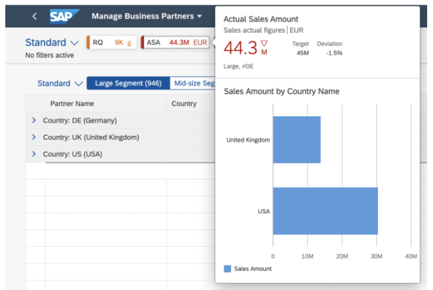

<!-- loio7a9269ffe51c4ee7bc8529e120480d78 -->

# What's New in SAPUI5 1.96

With this release SAPUI5 is upgraded from version 1.95 to 1.96.

** **

<table>
<tr>
<th valign="top">

Version

</th>
<th valign="top">

Type

</th>
<th valign="top">

Category

</th>
<th valign="top">

Title

</th>
<th valign="top">

Description

</th>
<th valign="top">

Action

</th>
<th valign="top">

Available as of

</th>
</tr>
<tr>
<td valign="top">

 1.96 

</td>
<td valign="top">

 New 

</td>
<td valign="top">

 Feature 

</td>
<td valign="top">

 **Enabling Apps to Comply with a Content Security Policy \(CSP\) without `eval()` and Inline Styles** 

</td>
<td valign="top">

**Enabling Apps to Comply with a Content Security Policy \(CSP\) without `eval()` and Inline Styles**

The SAPUI5 framework now allows you to run applications in environments with stricter CSPs. Large parts of SAPUI5 don't require `eval()` or similar functions, as well as inline styles, any longer. For details about the supported policies as well as recommendations on writing CSP-compliant applications, see [Content Security Policy](../05_Developing_Apps/content-security-policy-fe1a6db.md).

> ### Note:  
> To run in a CSP-enabled environment, your apps need to be prepared for the policy used. See [Content Security Policy](../05_Developing_Apps/content-security-policy-fe1a6db.md).

New•Feature•Info Only•1.96

</td>
<td valign="top">

 Info Only 

</td>
<td valign="top">

2021-11-04

</td>
</tr>
<tr>
<td valign="top">

 1.96 

</td>
<td valign="top">

 UI Changed 

</td>
<td valign="top">

 Announcement 

</td>
<td valign="top">

 **SAP Fiori Elements: Multi-Select in Responsive Tables: *Clear All* Instead of *Select All*** 

</td>
<td valign="top">

**SAP Fiori Elements: Multi-Select in Responsive Tables: *Clear All* Instead of *Select All***

> ### Note:  
> The following information concerns important changes for end users. These changes may require end users to adjust and/or test cases to be adapted, but they won't stop or disrupt software or processes.

Responsive tables with a multi-select option will show a *Clear All* checkbox instead of a *Select All* checkbox. This is the same behavior as in other table types.

UI Changed•Announcement•Info Only•1.95

</td>
<td valign="top">

 Info Only 

</td>
<td valign="top">

2021-11-04

</td>
</tr>
<tr>
<td valign="top">

 1.96 

</td>
<td valign="top">

 New 

</td>
<td valign="top">

 Feature 

</td>
<td valign="top">

 **New Theme Available for SAP Fiori User Experience \(Experimental\)** 

</td>
<td valign="top">

**New Theme Available for SAP Fiori User Experience \(Experimental\)**

We have introduced a new theme, the preview version of the *Horizon* visual theme for SAP Fiori \(theme ID: `sap_horizon`\), as an addition to the existing themes. To preview the new theme, see [https://ui5.sap.com/?sap-ui-theme=sap\_horizon\#/controls](https://ui5.sap.com/?sap-ui-theme=sap_horizon#/controls) .

> ### Note:  
> The theme has the status 'experimental' and is thus subject to change. It must not be used as a basis for custom themes as long as the status is 'experimental'.

New•Feature•Info Only•1.96

</td>
<td valign="top">

 Info Only 

</td>
<td valign="top">

2021-11-04

</td>
</tr>
<tr>
<td valign="top">

 1.96 

</td>
<td valign="top">

 Changed 

</td>
<td valign="top">

 Feature 

</td>
<td valign="top">

 **SAPUI5 Models** 

</td>
<td valign="top">

**SAPUI5 Models**

We have provided the new `sap.ui.model.ListBinding#getFilters` method. It is available in all list bindings inheriting from `sap.ui.model.ListBinding`, for example in `sap.ui.model.odata.v4.ODataListBinding` and `sap.ui.model.odata.v2.ODataListBinding`. We also provide getters for `sap.ui.model.Filter`.

Changed•Feature•Info Only•1.96

</td>
<td valign="top">

 Info Only 

</td>
<td valign="top">

2021-11-04

</td>
</tr>
<tr>
<td valign="top">

 1.96 

</td>
<td valign="top">

 Changed 

</td>
<td valign="top">

 Feature 

</td>
<td valign="top">

 **SAPUI5 OData V2 Model** 

</td>
<td valign="top">

**SAPUI5 OData V2 Model**

We have introduced the new `sap.ui.model.odata.v2.Context#created` method. For created records, the method returns a promise that resolves when the record is created in the back end. The promise is rejected if the record is deleted before being persisted in the back end.

Changed•Feature•Info Only•1.96

</td>
<td valign="top">

 Info Only 

</td>
<td valign="top">

2021-11-04

</td>
</tr>
<tr>
<td valign="top">

 1.96 

</td>
<td valign="top">

 Changed 

</td>
<td valign="top">

 Feature 

</td>
<td valign="top">

 **SAPUI5 OData V4 Model** 

</td>
<td valign="top">

**SAPUI5 OData V4 Model**

The new version of the SAPUI5 OData V4 model introduces the following features:

-   You can now specify `$select` in addition to the `$$inheritExpandSelect` binding parameter of [OData Operations](../04_Essentials/odata-operations-b54f789.md).

-   We have complemented the [OData V4 Tutorial](../03_Get-Started/odata-v4-tutorial-bcdbde6.md) with additional chapters showing how to reuse data in a list-detail scenario.

-   You can now use [`Common.ValueListWithFixedValues`](https://github.com/SAP/odata-vocabularies/blob/main/vocabularies/Common.xml#L672:~:text=%3CTerm%20Name=%22-,ValueListWithFixedValues,-%22) in combination with [`Common.ValueListRelevantQualifiers`](https://github.com/SAP/odata-vocabularies/blob/main/vocabularies/Common.xml#L666:~:text=%3CTerm%20Name=%22-,ValueListRelevantQualifiers,-%22) if only one value list qualifier is relevant at a time. The `sap.ui.model.odata.v4.ODataMetaModel#requestValueListInfo` method returns the relevant value list for the `""` qualifier and provides the original qualifier as the `$qualifier` property of the value list mapping.

Changed•Feature•Info Only•1.96

</td>
<td valign="top">

 Info Only 

</td>
<td valign="top">

2021-11-04

</td>
</tr>
<tr>
<td valign="top">

 1.96 

</td>
<td valign="top">

 Changed 

</td>
<td valign="top">

 Control 

</td>
<td valign="top">

 **`sap.m.MaskInput`** 

</td>
<td valign="top">

**`sap.m.MaskInput`**

We have introduced the `showClearIcon` property. If set to `true`, when there is text input it shows an additional icon that allows users to clear their input. For more information, see the [API Reference](https://ui5.sap.com/#/api/sap.m.MaskInput).

Changed•Control•Info Only•1.96

</td>
<td valign="top">

 Info Only 

</td>
<td valign="top">

2021-11-04

</td>
</tr>
<tr>
<td valign="top">

 1.96 

</td>
<td valign="top">

 Changed 

</td>
<td valign="top">

 Control 

</td>
<td valign="top">

 **`sap.m.MultiComboBox`** 

</td>
<td valign="top">

**`sap.m.MultiComboBox`**

We have implemented a checkbox that allows users to select all options, placed on top of the suggestions pop-up in the `sap.m.MultiComboBox` control. You can enable it using the `showSelectAll` property. The checkbox gives users the possibility to easily select/deselect all options, also when filtering them. For more information, see the [Sample](https://ui5.sap.com/#/entity/sap.m.MultiComboBox/sample/sap.m.sample.MultiComboBoxSelectAll). 

Changed•Control•Info Only•1.96

</td>
<td valign="top">

 Info Only 

</td>
<td valign="top">

2021-11-04

</td>
</tr>
<tr>
<td valign="top">

 1.96 

</td>
<td valign="top">

 Changed 

</td>
<td valign="top">

 Control 

</td>
<td valign="top">

 **`sap.ui.comp.smartfield.SmartField`** 

</td>
<td valign="top">

**`sap.ui.comp.smartfield.SmartField`**

-   `SmartField` now shows by default multiple consecutive whitespace characters for string-based properties in display mode. Until now, the browser was merging whitespace characters into one single whitespace instead of displaying the original string. For more information, see [Whitespaces Concept](../05_Developing_Apps/whitespaces-concept-37deb0b.md). 

-   `SmartField` now supports the `Common.ValueListRelevantQualifiers` annotation. This annotation can limit the number of value list qualifiers based on a specific context determined by a property different from the annotated property. For more information, see the [API Reference](https://ui5.sap.com/#/api/sap.ui.comp.smartfield.SmartField%23annotations/ValueListRelevantQualifiers) and the [Sample](https://ui5.sap.com/#/entity/sap.ui.comp.smartfield.SmartField/sample/sap.ui.comp.sample.smartfield.ContextDependentValueHelp).

Changed•Control•Info Only•1.96

</td>
<td valign="top">

 Info Only 

</td>
<td valign="top">

2021-11-04

</td>
</tr>
<tr>
<td valign="top">

 1.96 

</td>
<td valign="top">

 Changed 

</td>
<td valign="top">

 Control 

</td>
<td valign="top">

 **`sap.ui.comp.smarttable.SmartTable`** 

</td>
<td valign="top">

**`sap.ui.comp.smarttable.SmartTable`**

We have provided an option to disable the *Paste* button and control the related `Paste` event using the `enablePaste` property. For more information, see the [API Reference](https://ui5.sap.com/#/api/sap.ui.comp.smarttable.SmartTable%23methods/getEnablePaste).

Changed•Control•Info Only•1.96

</td>
<td valign="top">

 Info Only 

</td>
<td valign="top">

2021-11-04

</td>
</tr>
<tr>
<td valign="top">

 1.96 

</td>
<td valign="top">

 Changed 

</td>
<td valign="top">

 Control 

</td>
<td valign="top">

 **`sap.ui.integration.widgets.Card`** 

</td>
<td valign="top">

**`sap.ui.integration.widgets.Card`**

-   The List and Table cards now allow their content items to be grouped. You can use the new `group` manifest extension to configure the titles of the groups and the order of the items in these groups. For more information, see the [List Card](https://ui5.sap.com/test-resources/sap/ui/integration/demokit/cardExplorer/webapp/index.html#/learn/types/list) section and the [Sample](https://ui5.sap.com/test-resources/sap/ui/integration/demokit/cardExplorer/webapp/index.html#/explore/list/grouping) in the Card Explorer.

-   List cards now support attributes on an item level. They can show up to six attributes of their items’ attributes, which are displayed in one or two columns. For more information, see the [List Card](https://ui5.sap.com/test-resources/sap/ui/integration/demokit/cardExplorer/webapp/index.html#/learn/types/list) section and the [Sample](https://ui5.sap.com/test-resources/sap/ui/integration/demokit/cardExplorer/webapp/index.html#/explore/list/attributes) in the Card Explorer.

-   We have added a new `configurationChange` event, which is fired when some configuration settings are changed as a result of user interaction \(for example - filter change\). For more information, see the [Integration Cards API](https://ui5.sap.com/test-resources/sap/ui/integration/demokit/cardExplorer/webapp/index.html#/integrate/api) section and the [Sample](https://ui5.sap.com/test-resources/sap/ui/integration/demokit/cardExplorer/webapp/index.html#/explore/configurationChanges) in the Card Explorer.

-   We have introduced a new `sideIndicatorsAlignment` property to the `sap.f.cards.NumericHeader`. This property controls the alignment of the side indicators in the numeric header. It can have two values `Begin` \(default\) or `End`. For more information, see the [Numeric Header](https://ui5.sap.com/test-resources/sap/ui/integration/demokit/cardExplorer/webapp/index.html#/learn/headers/numeric) section in the Card Explorer.

Changed•Control•Info Only•1.96

</td>
<td valign="top">

 Info Only 

</td>
<td valign="top">

2021-11-04

</td>
</tr>
<tr>
<td valign="top">

 1.96 

</td>
<td valign="top">

 Changed 

</td>
<td valign="top">

 SAP Fiori Elements 

</td>
<td valign="top">

 **SAP Fiori elements for OData V4 and SAP Fiori elements for OData V2** 

</td>
<td valign="top">

**SAP Fiori elements for OData V4 and SAP Fiori elements for OData V2**

The following changes and new features are available for SAP Fiori elements for OData V4 and SAP Fiori elements for OData V2:

-   You can now create a global filter bar using the SAP Fiori elements for OData V4 service for an overview page application. Use the filter bar to create a filter. An automatic switch occurs to the filter bar when the `globalFilterModel` is defined as OData V4 model. Currently, filtering on the cards, variant management, and value list annotation is supported.

Changed•SAP Fiori Elements•Info Only•1.96

</td>
<td valign="top">

 Info Only 

</td>
<td valign="top">

2021-11-04

</td>
</tr>
<tr>
<td valign="top">

 1.96 

</td>
<td valign="top">

 Changed 

</td>
<td valign="top">

 SAP Fiori Elements 

</td>
<td valign="top">

 **SAP Fiori elements for OData V2** 

</td>
<td valign="top">

**SAP Fiori elements for OData V2**

The following changes and new features are available for SAP Fiori elements for OData V2:

-   The object page header is now collapsed to a summary line when you scroll it on small screen devices. This optimizes the content view.

-   In the worklist applications, the options to sort, group, and filter are now available within the table personalization dialog that is consistent with the list report. For more information, see [Worklist](../06_SAP_Fiori_Elements/worklist-d1d588f.md).

-   The persistence mode is now default for List Report/Object Page applications with flexible column layout. For more information, see [Enabling Discovery/Persistence Mode](../06_SAP_Fiori_Elements/enabling-discovery-persistence-mode-7c62084.md).

-   List Report and Object Page tables now have a full screen mode option, enabled by default, when launched on mobile phones. For more information, see [Tables](../06_SAP_Fiori_Elements/tables-c0f6592.md).

-   Enhanced support is now available for the manifest settings such as `filterSettings`, `editableHeaderContent`, `showRelatedApps`, `tableSettings`, `dataLoadSettings`, etc. using the adaptation project for application extensibility. For more information, see [Extending the Delivered Apps Manifest Using an Adaptation Project](../06_SAP_Fiori_Elements/extending-the-delivered-apps-manifest-using-an-adaptation-project-a2b24a6.md).

-   Input fields can now get the default values from `DefaultValuesFunction` in the create page and function import dialog of the non-draft applications. For more information, see [Actions](../06_SAP_Fiori_Elements/actions-cbf16c5.md).

-   User defaults are now applied on top of the standard variant if the applications are launched with the standard variant. This is possible if the user defaults are configured. In this case, the standard variant is marked with an asterisk \(\*\).

Changed•SAP Fiori Elements•Info Only•1.96

</td>
<td valign="top">

 Info Only 

</td>
<td valign="top">

2021-11-04

</td>
</tr>
<tr>
<td valign="top">

 1.96 

</td>
<td valign="top">

 Changed 

</td>
<td valign="top">

 SAP Fiori Elements 

</td>
<td valign="top">

 **SAP Fiori elements for OData V4** 

</td>
<td valign="top">

**SAP Fiori elements for OData V4**

The following changes and new features are available for SAP Fiori elements for OData V4:

-   Application developers can now use the following building blocks:

    -   Paginator

    -   Chart

    -   FilterBar

    For more information, see [Building Blocks](../06_SAP_Fiori_Elements/building-blocks-24c1304.md).

-   SAP Fiori elements now provides an option to pass the variant IDs of a page, the filter bar, or a table as URL parameters to the app. For more information, see [Passing Variant IDs as URL Parameters](../06_SAP_Fiori_Elements/passing-variant-ids-as-url-parameters-4132ffa.md).

-   SAP Fiori elements now provides two new extension methods for applications that run in `sap-keep-alive` mode. Application developers can then add custom code when the application is suspended or restored during an external navigation. For more information, see [Refresh Entity Sets in sap-keep-alive Mode](../06_SAP_Fiori_Elements/refresh-entity-sets-in-sap-keep-alive-mode-3c65f2c.md) and [Refresh Data Set for Back Navigation When sap-keep-alive Is Set to True](../06_SAP_Fiori_Elements/refresh-data-set-for-back-navigation-when-sap-keep-alive-is-set-to-true-f1c2704.md).

-   You can now use `MultiValueFields` within an action parameter dialog. For more information, see [Actions](../06_SAP_Fiori_Elements/actions-cbf16c5.md).

-   You can now use the preferred mode `CreateWith` to define an action to be executed for intent-based navigation. For more information, see [Handling of the preferredMode Parameter](../06_SAP_Fiori_Elements/handling-of-the-preferredmode-parameter-bfaf3cc.md).

-   Draft-enabled applications now have an additional entry in the *Editing Status* on the filter bar in the list report: *All \(Hiding Drafts\)*. For more information, see [Toggling Between Draft and Saved Values](../06_SAP_Fiori_Elements/toggling-between-draft-and-saved-values-fd3950a.md).

-   Icons on an `Edm.Stream` property are now mime-type specific. For more information, see [Different Representations of a Field](../06_SAP_Fiori_Elements/different-representations-of-a-field-c18ada4.md).

-   The message popover now displays error messages for a custom column of a table. For more information, see [Extension Points for Tables](../06_SAP_Fiori_Elements/extension-points-for-tables-d525522.md).

-   You can now display a KPI tag in applications using analytical services. When a user clicks the KPI tag, the KPI card opens with more details.

      

Changed•SAP Fiori Elements•Info Only•1.96

</td>
<td valign="top">

 Info Only 

</td>
<td valign="top">

2021-11-04

</td>
</tr>
<tr>
<td valign="top">

 1.96 

</td>
<td valign="top">

 New 

</td>
<td valign="top">

 User Documentation 

</td>
<td valign="top">

 **Accessibility Documentation for End Users** 

</td>
<td valign="top">

**Accessibility Documentation for End Users**

We have new accessibility documentation with detailed information about SAPUI5 keyboard handling and screen-reader support. It is designed to help end users work with apps that are based on our framework. For more information, see [Accessibility for End Users](https://help.sap.com/viewer/bc5a64aac808463baa95b4230f221716/1.96/en-US).

New•User Documentation•Info Only•1.96

</td>
<td valign="top">

 Info Only 

</td>
<td valign="top">

2021-11-04

</td>
</tr>
</table>

**Related Information**  

[What's New in SAPUI5 1.114](what-s-new-in-sapui5-1-114-890fce1.md "With this release SAPUI5 is upgraded from version 1.113 to 1.114.")

[What's New in SAPUI5 1.113](what-s-new-in-sapui5-1-113-a9553fe.md "With this release SAPUI5 is upgraded from version 1.112 to 1.113.")

[What's New in SAPUI5 1.112](what-s-new-in-sapui5-1-112-34afc69.md "With this release SAPUI5 is upgraded from version 1.111 to 1.112.")

[What's New in SAPUI5 1.111](what-s-new-in-sapui5-1-111-7a67837.md "With this release SAPUI5 is upgraded from version 1.110 to 1.111.")

[What's New in SAPUI5 1.110](what-s-new-in-sapui5-1-110-71a855c.md "With this release SAPUI5 is upgraded from version 1.109 to 1.110.")

[What's New in SAPUI5 1.109](what-s-new-in-sapui5-1-109-3264bd2.md "With this release SAPUI5 is upgraded from version 1.108 to 1.109.")

[What's New in SAPUI5 1.108](what-s-new-in-sapui5-1-108-66e33f0.md "With this release SAPUI5 is upgraded from version 1.107 to 1.108.")

[What's New in SAPUI5 1.107](what-s-new-in-sapui5-1-107-d4ff916.md "With this release SAPUI5 is upgraded from version 1.106 to 1.107.")

[What's New in SAPUI5 1.106](what-s-new-in-sapui5-1-106-5b497b0.md "With this release SAPUI5 is upgraded from version 1.105 to 1.106.")

[What's New in SAPUI5 1.105](what-s-new-in-sapui5-1-105-4d6c00e.md "With this release SAPUI5 is upgraded from version 1.104 to 1.105.")

[What's New in SAPUI5 1.104](what-s-new-in-sapui5-1-104-69e567c.md "With this release SAPUI5 is upgraded from version 1.103 to 1.104.")

[What's New in SAPUI5 1.103](what-s-new-in-sapui5-1-103-0e98c76.md "With this release SAPUI5 is upgraded from version 1.102 to 1.103.")

[What's New in SAPUI5 1.102](what-s-new-in-sapui5-1-102-f038c99.md "With this release SAPUI5 is upgraded from version 1.101 to 1.102.")

[What's New in SAPUI5 1.101](what-s-new-in-sapui5-1-101-7733b00.md "With this release SAPUI5 is upgraded from version 1.100 to 1.101.")

[What's New in SAPUI5 1.100](what-s-new-in-sapui5-1-100-27dec1d.md "With this release SAPUI5 is upgraded from version 1.99 to 1.100.")

[What's New in SAPUI5 1.99](what-s-new-in-sapui5-1-99-4f35848.md "With this release SAPUI5 is upgraded from version 1.98 to 1.99.")

[What's New in SAPUI5 1.98](what-s-new-in-sapui5-1-98-d9f16f2.md "With this release SAPUI5 is upgraded from version 1.97 to 1.98.")

[What's New in SAPUI5 1.97](what-s-new-in-sapui5-1-97-fa0e282.md "With this release SAPUI5 is upgraded from version 1.96 to 1.97.")

[What's New in SAPUI5 1.95](what-s-new-in-sapui5-1-95-a1aea67.md "With this release SAPUI5 is upgraded from version 1.94 to 1.95.")

[What's New in SAPUI5 1.94](what-s-new-in-sapui5-1-94-c40f1e6.md "With this release SAPUI5 is upgraded from version 1.93 to 1.94.")

[What's New in SAPUI5 1.93](what-s-new-in-sapui5-1-93-f273340.md "With this release SAPUI5 is upgraded from version 1.92 to 1.93.")

[What's New in SAPUI5 1.92](what-s-new-in-sapui5-1-92-1ef345d.md "With this release SAPUI5 is upgraded from version 1.91 to 1.92.")

[What's New in SAPUI5 1.91](what-s-new-in-sapui5-1-91-0a2bd79.md "With this release SAPUI5 is upgraded from version 1.90 to 1.91.")

[What's New in SAPUI5 1.90](what-s-new-in-sapui5-1-90-91c10c2.md "With this release SAPUI5 is upgraded from version 1.89 to 1.90.")

[What's New in SAPUI5 1.89](what-s-new-in-sapui5-1-89-e56cddc.md "With this release SAPUI5 is upgraded from version 1.88 to 1.89.")

[What's New in SAPUI5 1.88](what-s-new-in-sapui5-1-88-e15a206.md "With this release SAPUI5 is upgraded from version 1.87 to 1.88.")

[What's New in SAPUI5 1.87](what-s-new-in-sapui5-1-87-b506da7.md "With this release SAPUI5 is upgraded from version 1.86 to 1.87.")

[What's New in SAPUI5 1.86](what-s-new-in-sapui5-1-86-4c1c959.md "With this release SAPUI5 is upgraded from version 1.85 to 1.86.")

[What's New in SAPUI5 1.85](what-s-new-in-sapui5-1-85-1d18eb5.md "With this release SAPUI5 is upgraded from version 1.84 to 1.85.")

[What's New in SAPUI5 1.84](what-s-new-in-sapui5-1-84-dc76640.md "With this release SAPUI5 is upgraded from version 1.82 to 1.84.")

[What's New in SAPUI5 1.82](what-s-new-in-sapui5-1-82-3a8dd13.md "With this release SAPUI5 is upgraded from version 1.81 to 1.82.")

[What's New in SAPUI5 1.81](what-s-new-in-sapui5-1-81-f5e2a21.md "With this release SAPUI5 is upgraded from version 1.80 to 1.81.")

[What's New in SAPUI5 1.80](what-s-new-in-sapui5-1-80-8cee506.md "With this release SAPUI5 is upgraded from version 1.79 to 1.80.")

[What's New in SAPUI5 1.79](what-s-new-in-sapui5-1-79-99c4cdc.md "With this release SAPUI5 is upgraded from version 1.78 to 1.79.")

[What's New in SAPUI5 1.78](what-s-new-in-sapui5-1-78-f09b63e.md "With this release SAPUI5 is upgraded from version 1.77 to 1.78.")

[What's New in SAPUI5 1.77](what-s-new-in-sapui5-1-77-c46b439.md "With this release SAPUI5 is upgraded from version 1.76 to 1.77.")

[What's New in SAPUI5 1.76](what-s-new-in-sapui5-1-76-aad03b5.md "With this release SAPUI5 is upgraded from version 1.75 to 1.76.")

[What's New in SAPUI5 1.75](what-s-new-in-sapui5-1-75-5cbb62d.md "With this release SAPUI5 is upgraded from version 1.74 to 1.75.")

[What's New in SAPUI5 1.74](what-s-new-in-sapui5-1-74-c22208a.md "With this release SAPUI5 is upgraded from version 1.73 to 1.74.")

[What's New in SAPUI5 1.73](what-s-new-in-sapui5-1-73-231dd13.md "With this release SAPUI5 is upgraded from version 1.72 to 1.73.")

[What's New in SAPUI5 1.72](what-s-new-in-sapui5-1-72-521cad9.md "With this release SAPUI5 is upgraded from version 1.71 to 1.72.")

[What's New in SAPUI5 1.71](what-s-new-in-sapui5-1-71-a93a6a3.md "With this release SAPUI5 is upgraded from version 1.70 to 1.71.")

[What's New in SAPUI5 1.70](what-s-new-in-sapui5-1-70-f073d69.md "With this release SAPUI5 is upgraded from version 1.69 to 1.70.")

[What's New in SAPUI5 1.69](what-s-new-in-sapui5-1-69-89a18bd.md "With this release SAPUI5 is upgraded from version 1.68 to 1.69.")

[What's New in SAPUI5 1.68](what-s-new-in-sapui5-1-68-f94bf93.md "With this release SAPUI5 is upgraded from version 1.67 to 1.68.")

[What's New in SAPUI5 1.67](what-s-new-in-sapui5-1-67-a6b1472.md "With this release SAPUI5 is upgraded from version 1.66 to 1.67.")

[What's New in SAPUI5 1.66](what-s-new-in-sapui5-1-66-c9896e9.md "With this release SAPUI5 is upgraded from version 1.65 to 1.66.")

[What's New in SAPUI5 1.65](what-s-new-in-sapui5-1-65-0f5acfd.md "With this release SAPUI5 is upgraded from version 1.64 to 1.65.")

[What's New in SAPUI5 1.64](what-s-new-in-sapui5-1-64-0e30822.md "With this release SAPUI5 is upgraded from version 1.63 to 1.64.")

[What's New in SAPUI5 1.63](what-s-new-in-sapui5-1-63-e8d9da7.md "With this release SAPUI5 is upgraded from version 1.62 to 1.63.")

[What's New in SAPUI5 1.62](what-s-new-in-sapui5-1-62-771f4d5.md "With this release SAPUI5 is upgraded from version 1.61 to 1.62.")

[What's New in SAPUI5 1.61](what-s-new-in-sapui5-1-61-d991552.md "With this release SAPUI5 is upgraded from version 1.60 to 1.61.")

[What's New in SAPUI5 1.60](what-s-new-in-sapui5-1-60-5a0e1f7.md "With this release SAPUI5 is upgraded from version 1.58 to 1.60.")

[What's New in SAPUI5 1.58](what-s-new-in-sapui5-1-58-7c927aa.md "With this release SAPUI5 is upgraded from version 1.56 to 1.58.")

[What's New in SAPUI5 1.56](what-s-new-in-sapui5-1-56-108b7fd.md "With this release SAPUI5 is upgraded from version 1.54 to 1.56.")

[What's New in SAPUI5 1.54](what-s-new-in-sapui5-1-54-c838330.md "With this release SAPUI5 is upgraded from version 1.52 to 1.54.")

[What's New in SAPUI5 1.52](what-s-new-in-sapui5-1-52-849e1b6.md "With this release SAPUI5 is upgraded from version 1.50 to 1.52.")

[What's New in SAPUI5 1.50](what-s-new-in-sapui5-1-50-759e9f3.md "With this release SAPUI5 is upgraded from version 1.48 to 1.50.")

[What's New in SAPUI5 1.48](what-s-new-in-sapui5-1-48-fa1efac.md "With this release SAPUI5 is upgraded from version 1.46 to 1.48.")

[What's New in SAPUI5 1.46](what-s-new-in-sapui5-1-46-6307539.md "With this release SAPUI5 is upgraded from version 1.44 to 1.46.")

[What's New in SAPUI5 1.44](what-s-new-in-sapui5-1-44-a0cb7a0.md "With this release SAPUI5 is upgraded from version 1.42 to 1.44.")

[What's New in SAPUI5 1.42](what-s-new-in-sapui5-1-42-468b05d.md "With this release SAPUI5 is upgraded from version 1.40 to 1.42.")

[What's New in SAPUI5 1.40](what-s-new-in-sapui5-1-40-fbab50e.md "With this release SAPUI5 is upgraded from version 1.38 to 1.40.")

[What's New in SAPUI5 1.38](what-s-new-in-sapui5-1-38-f218918.md "With this release SAPUI5 is upgraded from version 1.36 to 1.38.")

