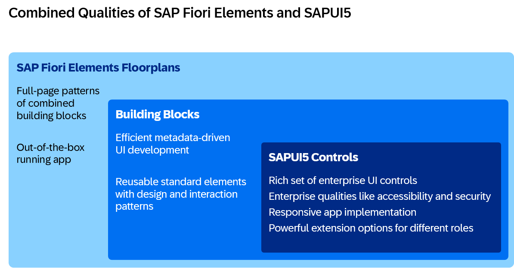
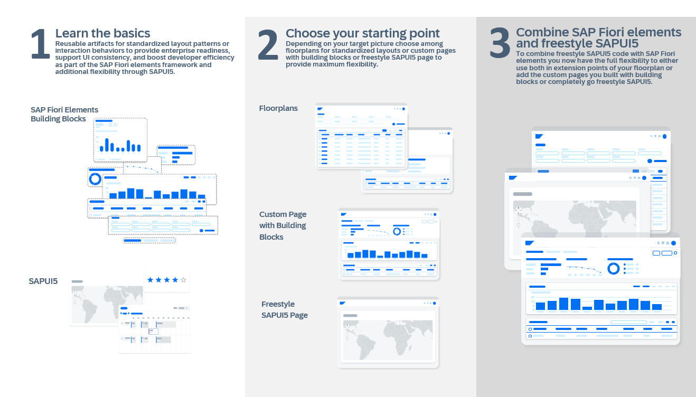

<!-- loio4cb54eb25b7e4df794c05268e83c22b4 -->

# Developing Apps with Modern Concepts: Guidance for Developers

This guidance explains how you can balance development efficiency, maintenance costs, and design flexibility when building enterprise-ready applications with SAP Fiori elements and freestyle SAPUI5.

This guidance is for developers who need to build enterprise-ready SAP Fiori apps. After working with business stakeholders to create your target design, evaluate how closely it matches SAP’s standard designs. Then determine which approach will help you best balance the following priorities:

-   Development efficiency
-   Flexibility to meet business requirements
-   Maintenance effort and cost

SAP offers two main options to help you balance your priorities in these areas and build SAPUI5 apps at scale. The options are not exclusive: You can combine them and adjust the balance as your needs evolve.

## SAP Fiori Elements Development

SAP Fiori elements uses metadata-driven UI capabilities to develop SAPUI5 apps. As a developer, you primarily create annotations on OData services that control reusable building blocks at runtime. In some cases, you can use collections of building blocks that are organized into commonly-used floorplans.

You benefit from rapidly creating SAP Fiori applications following SAP's recommended UX patterns and SAP Fiori design, while using pre-built building blocks. Fill in any gaps where building blocks don’t meet your design needs with custom SAPUI5 code. This approach covers:

-   Creating standard business applications at scale using consistent, reusable building blocks across your applications
-   Leveraging standard SAP Fiori design elements and re-using SAP's UI logic to benefit from the framework that SAP uses in its standard apps
-   Using collections of building blocks grouped into standard floorplans, such as List Reports with filter bars, tables, sorting, navigation, and collaboration and Object Pages with navigation, card creating, and various visualizations formats for viewing and editing business objects

Building an SAP Fiori elements app requires knowledge of OData annotations and how they control the UI at runtime.

## Freestyle SAPUI5 Development

Following this approach, the SAPUI5 framework with its UI controls and application framework capabilities is directly used to develop an app. As a developer, you primarily write SAPUI5 code \(for example, JavaScript or TypeScript\). You have full flexibility to implement any requirements with complete control over the UI design and app behavior. This approach covers:

-   Implementing highly specialized business processes, such as unique design requirements or customized user experience behavior
-   Connecting to non-standard data sources or protocols and integration with external systems
-   Gaining complete control over performance optimizations

Building a freestyle SAPUI5 app requires web development skills \(JavaScript or TypeScript\) and SAPUI5 framework knowledge.

## Combined Development

Although these approaches are explained separately, you typically use them together, combining building blocks and freestyle SAPUI5 code to meet your specific needs. This gives you the ability to balance development efficiency, maintenance costs, and design flexibility. Depending on your design requirements, you balance the **efficiency** \(reuse of SAP Fiori elements building blocks\) with **flexibility** \(freestyle SAPUI5 code\).

Additional criteria to help determine the best balance include:

<table>
<tr>
<th valign="top">

Criteria

</th>
<th valign="top">

SAP Fiori Elements Development

</th>
<th valign="top">

Freestyle SAPUI5 Development

</th>
</tr>
<tr>
<td valign="top">

Maintenance / code ownership

</td>
<td valign="top">

More on SAP side

</td>
<td valign="top">

More on customer / partner side

</td>
</tr>
<tr>
<td valign="top">

UI consistency

</td>
<td valign="top">

Automatic SAP Fiori compliance

</td>
<td valign="top">

Custom implementation

</td>
</tr>
<tr>
<td valign="top">

Possible customization

</td>
<td valign="top">

Augment building blocks and extension points with custom SAPUI5 code

</td>
<td valign="top">

Unlimited

</td>
</tr>
<tr>
<td valign="top">

Developer knowledge

</td>
<td valign="top">

UI annotations, OData

</td>
<td valign="top">

Web development with SAPUI5

</td>
</tr>
<tr>
<td valign="top">

Best For

</td>
<td valign="top">

Standard business apps

</td>
<td valign="top">

Unique requirements

</td>
</tr>
</table>

## Guidance for App Developers

With any of the mentioned approaches, you develop an enterprise-ready SAPUI5 application. By combining the metadata-driven SAP Fiori elements approach with the freestyle SAPUI5 code, you can balance your development efficiency and flexibility:

1.  **Set your foundation** by learning about the SAP Fiori elements framework with its building blocks and floorplans and by understanding SAPUI5 with its controls.
2.  **Choose the best starting point** based on your design requirements and the criteria listed above:

    -   a **full-page floorplan of SAP Fiori elements**. SAP recommends this approach, as this allows you to reuse most of the standard SAP Fiori design and UI logic, which are already part of most SAP standard apps; or
    -   a **custom page of SAP Fiori elements**, using building blocks. This lets you implement a custom freestyle layout, while reusing standard patterns, such as filter bar and table, out of the box \(note that custom pages are available for OData V4\); or
    -   a **freestyle SAPUI5** page. this gives you full flexibility to implement any custom requirements.

    Note that you can combine all three types of pages within one app.

3.  **Implement app requirements**: Regardless of your starting point, you implement additional requirements using the approach that fits best, for example by adding
    -   building blocks to reuse metadata-driven UI elements of SAP Fiori elements, and/or
    -   freestyle SAPUI5 code using SAPUI5 controls.

To summarize: SAP recommends using as much SAP Fiori elements as possible and as much freestyle SAPUI5 as needed.

**Related Information**  

[Developing Apps](../05_Developing_Apps/developing-apps-23cfd95.md "Create apps with rich user interfaces for modern web business applications, responsive across browsers and devices, based on HTML5.")

[Developing Apps with SAP Fiori Elements](../06_SAP_Fiori_Elements/developing-apps-with-sap-fiori-elements-03265b0.md "Develop apps using SAP Fiori elements and benefit from a metadata-driven approach.")

