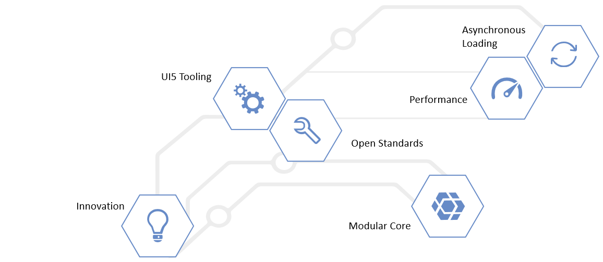

<!-- loiobf2d55eaa33b44a78ef95e7946d658e8 -->

# Enterprise Features of SAPUI5

As an enterprise framework,SAPUI5 offers many powerful enterprise features to support your entire app development project.

The individual capabilities of SAPUI5 help you to easily build enterprise apps. Here are some of the most important value adds that SAPUI5 delivers:

-   **Consistent UX**: SAPUI5 enables the SAP Fiori design evolution towards a consistent user experience across SAP solutions \(and beyond\).

-   **Use anywhere**: SAPUI5 allows a single, responsive app implementation for all browsers, platforms, and devices.

-   **Hundreds of enterprise UI elements**: SAPUI5 offers a rich set of UI elements to build professional user interfaces for an enterprise context while complying to product standards such as security and accessibility.

-   **Easy to integrate**: SAPUI5 lets you run large numbers of highly-consistent apps that can be integrated to complex business processesof the SAP ecosystem.

-   **Powerful extension options**: You can extend SAP standard apps and customize UIs without any coding effort thanks to SAPUI5's integrated adaptation capabilities.

-   **Flexible tools for any developer**: SAPUI5 comes with development environments and tools to efficiently build, test, and deploy apps.Both in pro-code as well as low-code ways.

-   **Benefit from innovations**: SAPUI5 brings a clear lifecycle separation of application and framework code to centrally innovate while being upgrade-compatible.

-   **Unlimited usage in SAP and non-SAP**: SAPUI5 qualities are also available for non-SAP technology stacks and as open source \(OpenUI5\).

<a name="loiobf2d55eaa33b44a78ef95e7946d658e8__section_lmp_12y_1gb"/>

## Key Concepts

Hover over the shapes to find out more about some key benefits of SAPUI5. Please note: The shapes do not link to other pages.

