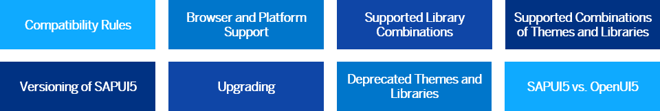

<!-- loio167193ced54c41c3961d7df3479d7bbe -->

# Read Me First

Before you start using SAPUI5 productively, please read the **important information** in the section. Here you read everything you need to know about supported library combinations, the supported browsers and platforms, and so on.

-   **[Enterprise Features of SAPUI5](enterprise-features-of-sapui5-bf2d55e.md "As an enterprise framework, SAPUI5 offers many powerful enterprise features to support your entire app
		development project.")**  
As an enterprise framework,SAPUI5 offers many powerful enterprise features to support your entire app development project.
-   **[Compatibility Rules](compatibility-rules-91f0873.md "The following sections describe what SAP can change in major, minor, and patch
		releases. Always consider these rules when developing apps, features, or controls with or
		for SAPUI5.")**  
The following sections describe what SAP can change in major, minor, and patch releases. Always consider these rules when developing apps, features, or controls with or for SAPUI5.
-   **[Browser and Platform Support](browser-and-platform-support-74b59ef.md "Browser and platform support for the SAPUI5 libraries on iOS,
		Android, macOS, and Windows platforms.")**  
Browser and platform support for the SAPUI5 libraries on iOS, Android, macOS, and Windows platforms.
-   **[Supported Library Combinations](supported-library-combinations-363cd16.md "SAPUI5 provides a set of
		JavaScript and CSS libraries, which can be combined in an application using the combinations
		that are supported.")**  
SAPUI5 provides a set of JavaScript and CSS libraries, which can be combined in an application using the combinations that are supported.
-   **[Supported Combinations of Themes and Libraries](supported-combinations-of-themes-and-libraries-38ff8c2.md "This chapter gives an overview of the possible combinations of themes and libraries for
		the SAPUI5 versions that are
		still in maintenance.")**  
This chapter gives an overview of the possible combinations of themes and libraries for the SAPUI5 versions that are still in maintenance.
-   **[Versioning and Maintenance of SAPUI5](versioning-and-maintenance-of-sapui5-91f0214.md " Versioning and maintenance strategy for SAPUI5.")**  
 Versioning and maintenance strategy for SAPUI5.
-   **[Upgrading](upgrading-9638e4f.md "The following sections describe what you have to consider when upgrading to a new version of SAPUI5.")**  
The following sections describe what you have to consider when upgrading to a new version of SAPUI5.
-   **[Deprecated Themes and Libraries](deprecated-themes-and-libraries-a87ca84.md "As SAPUI5 evolves over
		time, some of the UI controls are replaced by others, or their concepts abandoned entirely.
		This chapter gives an overview on theme and library level of the most important
		deprecations. Individual control deprecations and more information about the controls
		replacing them can be found in the API reference within the Demo Kit.")**  
As SAPUI5 evolves over time, some of the UI controls are replaced by others, or their concepts abandoned entirely. This chapter gives an overview on theme and library level of the most important deprecations. Individual control deprecations and more information about the controls replacing them can be found in the API reference within the Demo Kit.
-   **[SAPUI5 vs. OpenUI5](sapui5-vs-openui5-5982a97.md "With SAPUI5 and OpenUI5 we provide two deliveries of
		our UI development toolkit. Both are very closely related, but have their
		differences.")**  
With SAPUI5 and OpenUI5 we provide two deliveries of our UI development toolkit. Both are very closely related, but have their differences.

