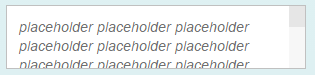
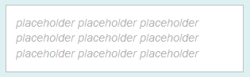

<!-- loiof08f29636be1472dac8f35fe7918ee08 -->

# Visual Degradations

Depending on the combination of device and browser, visual degradations may occur in certain libraries.

The following sections give an overview of the known degradations.

## `sap.m.TextArea`: Placeholder Property

As there is no W3C specification for how to use the placeholder property, browser handling for this property varies. Some browsers use a native placeholder property, but for browsers that do not support this, SAP implements its own placeholder version.

`sap.m.TextArea` is a multiline control and behaves differently according to the browser:

<table>
<tr>
<th valign="top">

Browser

</th>
<th valign="top">

Situation

</th>
</tr>
<tr>
<td valign="top">

Google Chrome

</td>
<td valign="top">

Google Chrome supports the native placeholder property and displays multiple lines along with a scrollbar

</td>
</tr>
<tr>
<td valign="top">

Mozilla Firefox

</td>
<td valign="top">

Mozilla Firefox supports the native placeholder property but does not display a scrollbar or an ellipsis, instead it simply truncates the placeholder text string

</td>
</tr>
</table>

