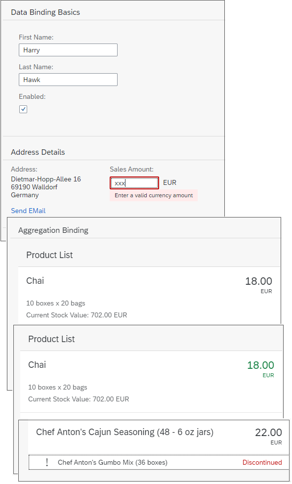

<!-- loioe5310932a71f42daa41f3a6143efca9c -->

# Data Binding Tutorial

In this tutorial, we will explain the concepts of data binding in SAPUI5.

You use data binding to bind UI elements to data sources to keep the data in sync and allow data editing on the UI.

For data binding, you need a model and a binding instance: The model instance holds the data and provides methods to set the data or to retrieve the data from a server. It also provides a method for creating bindings to the data. When this method is called, a binding instance is created, which contains the binding information and provides an event, which is fired whenever the bound data changes. An element can listen to this event and update its visualization according to the new data.

The UI uses data binding to bind controls to the model which holds the application data, so that the controls are updated automatically whenever application data changes. Data binding is also used the other way round, when changes in the control cause updates in the underlying application data, for example data entered by the user. This is called two-way binding.

## Preview

> ### Tip:  
> You don't have to do all tutorial steps sequentially, you can also jump directly to any step you want. Just download the code from the previous step, copy it to your workspace and make sure that the application runs by calling the `webapp/index.html` file.
> 
> You can view and download the files for all steps in the Demo Kit at [Data Binding](https://ui5.sap.com/#/entity/sap.ui.core.tutorial.databinding). Depending on your development environment you might have to adjust resource paths and configuration entries.
> 
> For more information check the [Downloading Code for a Tutorial Step](get-started-setup-tutorials-and-demo-apps-8b49fc1.md#loio8b49fc198bf04b2d9800fc37fecbb218__tutorials_download) section of the tutorials overview page [Get Started: Setup, Tutorials, and Demo Apps](get-started-setup-tutorials-and-demo-apps-8b49fc1.md).

**Related Information**  

[Data Binding](../04_Essentials/data-binding-68b9644.md "You use data binding to bind UI elements to data sources to keep the data in sync and allow data editing on the UI.")

[Model View Controller \(MVC\)](../04_Essentials/model-view-controller-mvc-91f2334.md "The Model View Controller (MVC) concept is used in SAPUI5 to separate the representation of information from the user interaction. This separation facilitates development and the changing of parts independently.")

