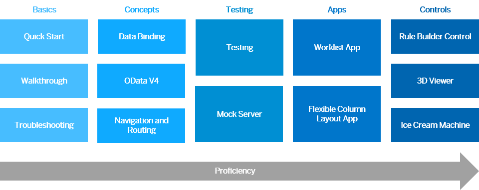

<!-- loio8b49fc198bf04b2d9800fc37fecbb218 -->

# Get Started: Setup, Tutorials, and Demo Apps

Set up your development environment and go through our tutorials. They introduce you to all major development paradigms of SAPUI5 using practical examples in an interactive format. The demo apps show SAPUI5 in action.

<a name="loio8b49fc198bf04b2d9800fc37fecbb218__tutorials_prerequisites"/>

## Prerequisites and Setup

-   You should be familiar with JavaScript.

-   Set up your [Development Environment](../05_Developing_Apps/development-environment-7bb04e0.md). We recommend UI5 Tooling , but you could also use other development environments.

-   Set up a folder where you would place the application content. We will refer to this folder as the “app root folder”.

<a name="loio8b49fc198bf04b2d9800fc37fecbb218__tutorials_path"/>

## Learning Path

> ### Tip:  
> **Learn with openSAP:**
> 
> The openSAP course [Developing Web Apps with SAPUI5](https://open.sap.com/courses/ui51) introduces you to the main concepts of SAPUI5.
> 
> The JavaScript exercises for each unit will give you the technical background needed to develop your own responsive Web apps. We’ll start from scratch with the very basics and lots of hands-on coding. As we go through the weeks of this course, you’ll learn more about the powerful development concepts and truly master SAPUI5.
> 
> The openSAP course [Evolved Web Apps with SAPUI5](https://open.sap.com/courses/ui52) for more experienced SAPUI5 developers and ambitious beginners introduces more advanced scenarios and concepts.

<a name="loio8b49fc198bf04b2d9800fc37fecbb218__tutorials_download"/>

## Downloading Code for a Tutorial Step

To download the code from the Demo Kit, follow these steps:

1.  Follow the link in the *Coding* section of the tutorial step or find the code in the *Samples* section of the Demo Kit \(filter by "*Tutorial*" to get a list of the tutorials that are available\).

2.  Download a `zip` file to your local machine \(find the *Download* button on the top right\).

3.  Extract the project folder to a desired location on your local machine.

4.  **If you use UI5 Tooling \(recommended\):** At your chosen location, open a new shell and execute `npm install`. After all dependencies have been installed, enter `npm start` to start the development server. \(**Note:** if they're not already present, you may have to create and adapt some project configuration files first; see the [Walkthrough Tutorial](walkthrough-tutorial-3da5f4b.md) for an example.\)

5.  Test your project setup by opening one of its HTML pages in your development environment and making sure that the app displays the features exactly as shown in the preview of the step.

<a name="loio8b49fc198bf04b2d9800fc37fecbb218__tutorials_troubleshooting"/>

## Troubleshooting

If you get stuck, check the [Troubleshooting](../04_Essentials/troubleshooting-615d9e4.md) section under *Essentials*, or refer to the [Troubleshooting tutorial](troubleshooting-tutorial-5661952.md).

If you can't fix the problem, try downloading the solution of the previews or current step. This should get your project fixed again, just don’t forget to check the resource path and the project configuration files again.

<a name="loio8b49fc198bf04b2d9800fc37fecbb218__section_fbp_hjc_tkb"/>

## See SAPUI5 in Action - Our Demo Apps

If you want to see some practical examples for SAPUI5 apps, check out our [Demo Apps](https://ui5.sap.com/#/demoapps). These are fully-functional apps that showcase certain floorplans, control libraries, or other SAPUI5 features. You can also download the source code of each demo app to find out how everything works together. Feel free to explore!

**Related Information**  

[Demo Apps](demo-apps-a3ab54e.md "With the Demo Kit, we deliver some demo apps that show you how you can use the various features and controls of SAPUI5.")

