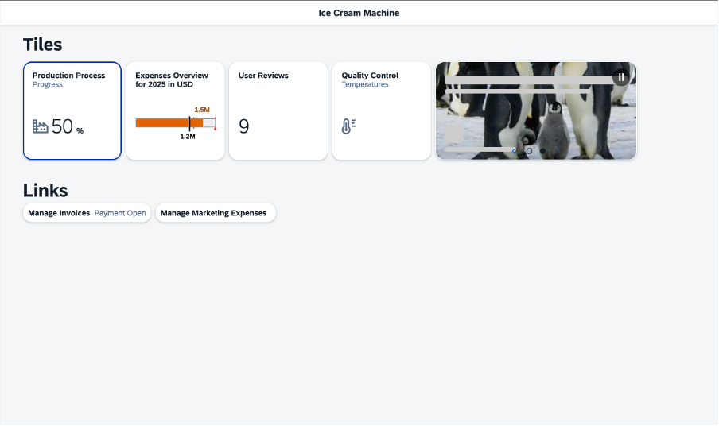

<!-- loioe5b7f8a93e4b432198869b3ae75981b0 -->

# Ice Cream Machine Tutorial

In this tutorial, we will show you how to use SAPUI5 controls like Generic Tiles, Micro Charts, and Process Flow.

Welcome to our **Ice Cream Machine** tutorial.

To get all of the important information about the production process at a glance, we will create a new start page. We will use the `GenericTile` control in different scenarios, the `NumericContent`, and several micro charts. The `ProcessFlow` will be used in a further view to display detailed data in the production process. We will create micro charts that show more specific information as in the `ProcessFlow`. In another view, the `ChartContainer` will be used to display the test results of the newly built ice cream machine. Finally, we will create an additional view with a `Timeline` control that will display our customer reviews.

<a name="loioe5b7f8a93e4b432198869b3ae75981b0__section_jtg_1sp_f1b"/>

## Preview

