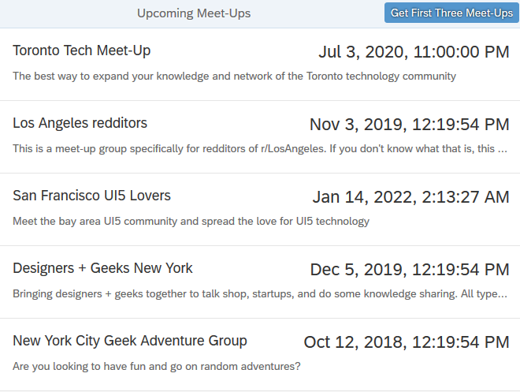

<!-- loio3a9728ec31f94ca18a7d543ce419d85d -->

# OData V2 Mock Server Tutorial

In this tutorial, we will explore some advanced features of the OData V2 mock server.

If no OData V2 service is available or you simply don’t want to depend on the OData back-end connectivity for your development and tests, the mock server can mimic the OData V2 back-end calls. It is designed to simulate an OData V2 provider by intercepting the HTTP communication made to the server, and providing a fake output. All this is transparent to the data binding and usage of the OData V2 model.

In certain scenarios, using only the built-in OData V2 simulation of the mock server is insufficient for completely server-independent tests. For example, if your application is using an OData feature that is not supported by the mock server, or if your application invokes a function import that depends on a server specific implementation \(and thus is also not simulated generically\). We will demonstrate how to use function callbacks in order to change existing mock requests.

Additionally, we will demonstrate how to mock an additional request that is not simulated out of the box by the SAPUI5 OData V2 mock server.

> ### Caution:  
> The tutorial describes how to use some advanced features of the mock server, disregarding the legal aspects of shipping mock data. Usually the mock data and mock server invocation is done in a test folder that is not shipped to customers. Be very careful that you don't ship mock data!

## Preview

  

> ### Tip:  
> You don't have to do all tutorial steps sequentially, you can also jump directly to any step you want. Just download the code from the previous step, and start there.
> 
> You can view and download the files for all steps in the Demo Kit at [Mock Server](https://ui5.sap.com/#/entity/sap.ui.core.tutorial.mockserver). Copy the code to your workspace and make sure that the application runs by calling the `webapp/index.html` file. Depending on your development environment you might have to adjust resource paths and configuration entries.
> 
> For more information check the following sections of the tutorials overview page \(see [Get Started: Setup, Tutorials, and Demo Apps](get-started-setup-tutorials-and-demo-apps-8b49fc1.md)\):
> 
> -   [Downloading Code for a Tutorial Step](get-started-setup-tutorials-and-demo-apps-8b49fc1.md#loio8b49fc198bf04b2d9800fc37fecbb218__tutorials_download)
> 
> -   [Adapting Code to Your Development Environment](get-started-setup-tutorials-and-demo-apps-8b49fc1.md#loio8b49fc198bf04b2d9800fc37fecbb218__tutorials_adaptation)

## Prerequisites

This tutorial assumes you have access to the SAP Business Application Studio. For more information, see [App Development Using SAP Business Application Studio](../05_Developing_Apps/app-development-using-sap-business-application-studio-6bbad66.md).

You should also be familiar with the concepts explained in the [Walkthrough Tutorial](walkthrough-tutorial-3da5f4b.md) tutorial and with the OData specification.

**Related Information**  

[Mock Server](../04_Essentials/mock-server-69d3cbd.md "A mock server mimics one or more back-end services. It is used to simplify integration testing and to decouple UI development from service development. By using a mock server you can develop and test the UI even if the service in the back end is incomplete or unstable.")

