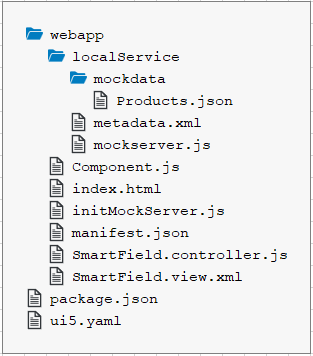

<!-- loio0e84ac7c9d3e4acaa49e61e6ee808649 -->

# Prerequisites

Preparation steps for the *Smart Controls* tutorial

You have already gone through the following tutorials:

-   [Walkthrough Tutorial \(JavaScript\)](walkthrough-tutorial-javascript-3da5f4b.md)

-   [Data Binding Tutorial](data-binding-tutorial-e531093.md)


In addition, you need some background knowledge about OData and annotations that you can find here: [http://www.sap.com/protocols/SAPData](http://www.sap.com/protocols/SAPData).

> ### Note:  
> The smart controls require a default OData model, and named models are not supported.


<a name="loio0e84ac7c9d3e4acaa49e61e6ee808649__section_p4v_21b_mzb"/>

## File Structure

For each step we will create the following files:



In some steps, additional files are needed. They will be explained in those steps. Since many of these files are almost identical from step to step, we show their content here but only briefly point to interesting points in these files if necessary. Please refer to the *Walkthrough* tutorial for further details on the general setup and the content of the outer `Component.js` file \(the top-level file on the same level as the webapp folder\) in which we define that the `index.html` will be shown in an iFrame.


<a name="loio0e84ac7c9d3e4acaa49e61e6ee808649__section_jwr_b1b_mzb"/>

## Coding

1.  Create a folder on your local machine which will contain all the sources of the app we're going to build. We'll refer to this folder as the “app root folder”.
2.  Create a new file called `package.json` which will enable you to execute commands and consume packages from the[npm registry](https://www.npmjs.com/) via the npm command line interface. Enter the following content:

    **package.json \(New\)**

    ```
    {
      "name": "ui5.smartcontrols",
      "version": "1.0.0",
      "description": "The smart controls tutorial",
      "scripts": {
          "start": "ui5 serve -o index.html"
      }
    }
    
    ```

3.  Create a new folder named `webapp` in the app root folder. It will contain all the sources that become available in the browser later. We'll refer to this folder as the "webapp folder".

4.  Create a new HTML file named `index.html` in your webapp folder and enter the following content:

    **webapp/index.html \(New\)**

    ```html
    <!DOCTYPE html>
    <html>
    <head>
    	<meta charset="utf-8">
    	<meta name="viewport" content="width=device-width, initial-scale=1.0">
    	<title>Smart Controls Tutorial</title>
    
    	<script id="sap-ui-bootstrap"
    		src="resources/sap-ui-core.js"
    		data-sap-ui-theme="sap_horizon"
    		data-sap-ui-resource-roots='{
    			"sap.ui.demo.smartControls": "./"
    		}'
    		data-sap-ui-on-init="module:sap/ui/demo/smartControls/initMockServer"
    		data-sap-ui-compat-version="edge"
    		data-sap-ui-async="true"
    		data-sap-ui-frame-options="trusted">
    	</script>
    </head>
    
    <body class="sapUiBody">
    	<div data-sap-ui-component data-name="sap.ui.demo.smartControls" data-id="container" data-settings='{"id" : "smartControls"}'></div>
    </body>
    </html>
    ```

5.  In this `index.html`, you will recognize that we reference the library `sap.ui.comp`, since this is the **main library** for the smart controls. This `index.html` file references the `Component.js` \(through the name: "sap.ui.demo.smartControls"\) which always looks like this:

    **webapp/Component.js \(New\)**

    ```js
    sap.ui.define([
    	"sap/ui/core/UIComponent"
    ], function(UIComponent) {
    	"use strict";
    
    	return UIComponent.extend("sap.ui.demo.smartControls.Component", {
    		metadata: {
    			manifest: "json"
    		}
    	});
    });
    
    ```

6.  In the `Component.js` file, we refer to the `manifest.json` file:

    **webapp/manifest.json \(New\)**

    ```
    {
      "_version": "1.8.0",
      "sap.app": {
    	"id": "sap.ui.demo.smartControls",
    	"type": "application",
    	"title": "SAPUI5 Smart Controls",
    	"description": "A simple app that explains the most important concepts of smart controls in SAPUI5",
    	"applicationVersion": {
    		"version": "1.0.0"
    	},
    	"dataSources": {
    	  "mainService": {
    		"uri": "/here/goes/your/serviceUrl/",
    		"type": "OData",
    		"settings": {
    		  "odataVersion": "2.0"
    		  "localUri": "localService/metadata.xml"
    		}
    	  }
    	}
      },
      "sap.ui": {
    	"technology": "UI5"
      },
      "sap.ui5": {
    	"rootView": {
    		"viewName": "sap.ui.demo.smartControls.SmartField",
    		"type": "XML"
    		"async": true
    	},
    	"dependencies": {
    	  "minUI5Version": "1.30",
    	  "libs": {
    	    "sap.m": {},
    	    "sap.ui.comp": {},
    	    "sap.ui.layout": {}
    	  }
    	},
    	"models": {
    	   "": {
    		"dataSource": "mainService",
    		"settings": {
    			"defaultBindingMode": "TwoWay"
    		}
    	  }
    	}
      }
    }
    ```

    In the `manifest.json` file we define the `rootView` and also the model of the application. Please note that the `TwoWay` binding mode ensures that an input validation is done automatically based on the metadata.

7.  Create a new file called `mockserver.js` where we define a mock server handling the server requests.

    **webapp/localService/mockserver.js \(New\)**

    ```js
    sap.ui.define([
    	"sap/ui/core/util/MockServer"
    ], function(MockServer) {
    	"use strict";
    
    	return {
    		init: function() {
    			// mock the service call from manifest.json
    			var oMockServer = new MockServer({
    				rootUri: "/sap/opu/odata/sap/EPM_REF_APPS_PROD_MAN_SRV/"
    			});
    
    			// configure
    			MockServer.config({
    				autoRespond: true,
    				autoRespondAfter: 500
    			});
    
    			// simulate
    			var sPath = sap.ui.require.toUrl("sap/ui/demo/smartControls/localService");
    			oMockServer.simulate(sPath + "/metadata.xml", {
    				sMockdataBaseUrl: sPath + "/mockdata",
    				bGenerateMissingMockData: true
    			});
    
    			// start
    			oMockServer.start();
    		}
    	};
    });
    ```

8.  The last file that we wish to list here is the `initMockServer.js`. In this file we require the `mockserver.js` module and start the mock server.

    **webapp/initMockServer.js \(New\)**

    ```js
    sap.ui.define([
    	"sap/ui/demo/smartControls/localService/mockserver"
    ], function (mockserver) {
    	"use strict";
    
    	// initialize the mock server
    	mockserver.init();
    
    	// initialize the embedded component on the HTML page
    	sap.ui.require(["sap/ui/core/ComponentSupport"]);
    });
    ```

9.  Open a terminal in the app root folder and execute `npm i -D @ui5/cli` to install UI5 Tooling.

10. Execute `ui5 init` in the app root folder.

11. Execute `ui5 use SAPUI5`

12. Execute `ui5 add sap.m sap.ui.core sap.ui.comp sap.ui.layout themelib_sap_horizon`

13. Execute `npm start` to start the web server and to open a new browser window hosting your newly created `index.html`.


> ### Note:  
> You might notice the rather flat setup of the files that is different from the setup propagated in the *Walkthrough* tutorial where the `Model-View-Controller` paradigm is reflected in the folder structure. We have chosen the flat setup for this tutorial since our examples all have exactly **one** single file for the view and **one** single file for the controller. Additional folders would add a complexity that we would like to avoid.

