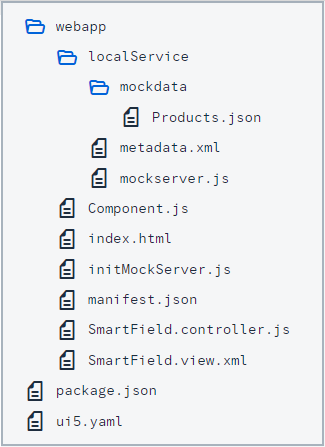

<!-- loio0e84ac7c9d3e4acaa49e61e6ee808649 -->

# Prerequisites

Preparation steps for the *Smart Controls* tutorial

You have already gone through the following tutorials:

-   [Walkthrough Tutorial](walkthrough-tutorial-3da5f4b.md)

-   [Data Binding Tutorial](data-binding-tutorial-e531093.md)


In addition, you need some background knowledge about OData and annotations that you can find here: [http://www.sap.com/protocols/SAPData](http://www.sap.com/protocols/SAPData).

> ### Note:  
> The smart controls require a default OData model, and named models are not supported.

You need a web server to host the files that are created in the tutorial steps, and you need the relevant SAPUI5 libraries, of course.

Please note that for each step there is a separate folder with its own copy of the files used.


## File Structure

For each step we will create the following files:



In some steps, additional files are needed. They will be explained in those steps. Since many of these files are almost identical from step to step, we show their content here but only briefly point to interesting points in these files if necessary. Please refer to the *Walkthrough* tutorial for further details on the general setup and the content of the outer `Component.js` file \(the top-level file on the same level as the webapp folder\) in which we define that the `index.html` will be shown in an iFrame.

```html
<!DOCTYPE html>
<html>
<head>
<meta charset="utf-8">
<title>SmartControls</title>
<script id="sap-ui-bootstrap"
	src="../../../../../../../../../resources/sap-ui-core.js"
	data-sap-ui-theme="sap_belize"
	data-sap-ui-libs="sap.m, sap.ui.comp"
	data-sap-ui-bindingSyntax="complex" 
	data-sap-ui-compatVersion="edge"
	data-sap-ui-preload="async"
	data-sap-ui-resourceroots='{
		"sap.ui.demo.smartControls": "./"
	}'>
</script>
<script>
	sap.ui.getCore().attachInit(function() {
		sap.ui.require([
			"sap/ui/demo/smartControls/test/service/server"
		], function(server) {
			server.init();
			new sap.ui.core.ComponentContainer({
				name: "sap.ui.demo.smartControls",
				height: "100%"
			}).placeAt("content");
		});
	});
</script>
</head>
<body class="sapUiBody" id="content">
</body>
</html>
```

In this index file, you will recognize that we reference the library `sap.ui.comp` since this is the **main library** for the smart controls. This `index.html` file references the `Component.js` \(through the name: "sap.ui.demo.smartControls"\) which always looks like this:

```js
sap.ui.define([
	"sap/ui/core/UIComponent"
], function(UIComponent) {
	"use strict";

	return UIComponent.extend("sap.ui.demo.smartControls.Component", {
		metadata: {
			manifest: "json"
		}
	});
});

```

In the `Component.js` file we use the `manifest.json` file.

```js
{
  "_version": "1.8.0",
  "sap.app": {
	"id": "sap.ui.demo.smartControls",
	"type": "application",
	"title": "SAPUI5 Smart Controls",
	"description": "A simple app that explains the most important concepts of smart controls in SAPUI5",
	"applicationVersion": {
		"version": "1.0.0"
	},
	"dataSources": {
	  "mainService": {
		"uri": "/here/goes/your/serviceUrl/",
		"type": "OData",
		"settings": {
		  "odataVersion": "2.0"
		  "localUri": "localService/metadata.xml"
		}
	  }
	}
  },
  "sap.ui": {
	"technology": "UI5"
  },
  "sap.ui5": {
	"rootView": {
		"viewName": "sap.ui.demo.smartControls.SmartField",
		"type": "XML"
		"async": true
	},
	"dependencies": {
	  "minUI5Version": "1.30",
	  "libs": {
	    "sap.m": {},
	    "sap.ui.comp": {}
	  }
	},
	"models": {
	   "": {
		"dataSource": "mainService",
		"settings": {
			"defaultBindingMode": "TwoWay"
		}
	  }
	}
  }
}
```

In the `manifest.json` file we define the `rootView` and also the model of the application. Please note that the `TwoWay` binding mode ensures that an input validation is done automatically based on the metadata.

The last file that we wish to list here is the `server.js`:

```js
sap.ui.define([
	"sap/ui/core/util/MockServer"
], function (MockServer) {
	"use strict";

	return {

		init: function () {

			// create
			var oMockServer = new MockServer({
				rootUri: "/here/goes/your/serviceUrl/"
			});

			// configure
			MockServer.config({
				autoRespond: true,
				autoRespondAfter: 1000
			});

			// simulate
			var sPath = sap.ui.require.toUrl("sap/ui/demo/smartControls/test/service");
			oMockServer.simulate(sPath + "/metadata.xml", sPath);

			// start
			oMockServer.start();
		}
	};

});
```

In this file we define the `MockServer` handling the server requests.

> ### Note:  
> You might notice the rather flat setup of the files that is different from the setup propagated in the *Walkthrough* tutorial where the `Model-View-Controller` paradigm is reflected in the folder structure. We have chosen the flat setup for this tutorial since our examples all have exactly **one** single file for the view and **one** single file for the controller. Additional folders would add a complexity that we would like to avoid.

