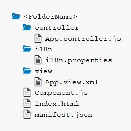

<!-- loio4bd6efb6c96046879224ac9a34880bcc -->

# Prerequisites

Prerequisite steps for the 3D Viewer tutorial.

Before proceeding with the 3D Viewer tutorial, ensure that you are familiar with the concepts introduced in the following tutorials:

-   [Walkthrough Tutorial \(JavaScript\)](walkthrough-tutorial-javascript-3da5f4b.md)

-   [Data Binding Tutorial](data-binding-tutorial-e531093.md)

## File Structure

Please note that for each step in this tutorial, you will be creating a separate folder with its own copy of the following files:

