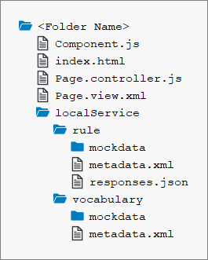

<!-- loio67fcb301d0504fd4a24915edf4058c51 -->

# Rule Builder Control Tutorial

In this tutorial you will learn how to embed a rule builder control to manage business rules in your application.

A business rule is a logic that defines some aspect of business and always resolves to either true or false. This logic can be maintained by non-technical users via a simplified rule language and user interface. Thus, business rules allow your application’s customers to add their own logic without needing technical customization or coding.

The rule builder control enables business users to create and edit business rules in applications based on SAPUI5. The control defines SAP standard UX for creating business rules in an SAP Fiori application and should be the default UI component for SAP Fiori UI developers to add business rule capabilities.

The `sap.rules.ui` library provides controls to manage business rules. The two main components are:

-   `RuleBuilder` – Provides visualization of the rule in the form of a decision table and text rule to simplify the creation and editing of the rule's business logic.
-   Expression Language Services – Provides expression language services to support the readability and correctness of business rules.

The visualization provided by the `RuleBuilder` component contains text parts and the expression language services support the end user in creating and editing those text parts.

> ### Tip:  
> You do not have to do the tutorial steps sequentially; you can start the tutorial at any step you want. Just download the code, copy it to your workspace and make sure that the application runs by calling the `index.html` file.
> 
> You can view and download all the files required for steps 1 and 2 in decision table section at [Rule Builder - Guided Decision Table](https://ui5.sap.com/#/entity/sap.rules.ui.RuleBuilder/sample/sap.rules.ui.sample.GuidedDecisionTable). This is applicable only for decision table rules modeled using rule expression language.
> 
> You can view and download all the files required for steps 1 and 2 in text rule section at [Rule Builder - Text Rule](https://ui5.sap.com/#/entity/sap.rules.ui.RuleBuilder/sample/sap.rules.ui.sample.TextRule).
> 
> For more information check the [Downloading Code for a Tutorial Step](get-started-setup-tutorials-and-demo-apps-8b49fc1.md#loio8b49fc198bf04b2d9800fc37fecbb218__tutorials_download) section of the tutorials overview page [Get Started: Setup, Tutorials, and Demo Apps](get-started-setup-tutorials-and-demo-apps-8b49fc1.md).


<a name="loio67fcb301d0504fd4a24915edf4058c51__section_dh5_y54_hkb"/>

## Expression Languages

You can model rules using an expression language. There are two expression languages supported by the rule builder:

-   **Expression Language 1.0 \(Rule Expression Language\)**: Expression language 1.0 enable users to define business decision logic in simple readable syntax. This is the default language supported by the rule builder. A typical rule condition in expression language 1.0 is as shown below:

    `customer_name of the customer is equal to 'John`

    > ### Caution:  
    > Deprecated as of version 1.120.2. Instead, use expression Language 2.0 \(DMN SFEEL\).

-   **Expression Language 2.0 \(DMN SFEEL\)**: Expression language 2.0 or DMN SFEEL is a subset of the Friendly Enough Expression Language \(FEEL\), provides a standard syntax for rule conditions, and reduces ambiguities while modeling a rule. A typical rule condition in expression language 2.0 is as shown below:

    `customer.customer name MATCHES 'John'`

    Key features of expression language 2.0 include:

    -   **Autosuggest list** is a suggestion dropdown menu that lets you select the required element of the rule expression. You do not have to type the rule expression in the corresponding fields.

    -   You can also type the rule expression in the field and select the corresponding vocabulary elements from the autosuggest list. Using free flow typing, you can also edit and delete the tokens in a rule expressions.

        > ### Example:  
        > In the following rule expression:
        > 
        > DO1.Equipment *=* 'Laptop' *AND* DO2.Date *=* 'Dec 3, 2020'
        > 
        > -   If the cursor is placed between *DO* and *1*, then all the data objects starting with DO are listed in the autosuggest list. Similarly, according to the cursor position, the corresponding data object or attribute name is listed.
        > 
        > -   To change a date or timestamp value, edit the value in the *Fixed Value* field of the autosuggest list.
        > 
        > -   If the cursor is placed before the attribute name *Equipment*, then the attribute name is deleted.
        > 
        > -   If the cursor is placed in between or before the data object name, *DO1*, then both the data object and attribute name, *DO1.Equipment*, is deleted.

    -   Expression language 2.0 supports the use of **vocabulary rules**. The rules which can be used in a rule expression are called vocabulary rules. The result returned by the vocabulary rule can be consumed in a rule expression.


The following are the objects for each expression language:


<table>
<tr>
<th valign="top">

Expression Language

</th>
<th valign="top">

Expression Language Object

</th>
</tr>
<tr>
<td valign="top">

Expression language 1.0

</td>
<td valign="top">

`ExpressionLanguage`

</td>
</tr>
<tr>
<td valign="top">

Expression language 2.0

</td>
<td valign="top">

`AstExpressionLanguage`

</td>
</tr>
</table>


### Migrate to Expression Language 2.0

You can change the expression language from Expression Language 1.0 to Expression Language 2.0. You can only change the expression language from 1.0 to 2.0 and not the vice versa.

To migrate to Expression Language 2.0, set the expression language object to `AstExpressionLanguage` in the your code as shown:

```
oExpressionLanguage = new sap.rules.ui.services.AstExpressionLanguage();
oRuleBuilder.setExpressionLanguage(oAstExpressionLanguage);
```

For more information, see *Coding* section in

-   [Step 2: Associating the Expression Language for Decision Tables](step-2-associating-the-expression-language-for-decision-tables-33ef2b0.md)

-   [Step 2: Associating the Expression Language for Text Rules](step-2-associating-the-expression-language-for-text-rules-34d774f.md)


<a name="loio67fcb301d0504fd4a24915edf4058c51__section_tn3_gd3_rz"/>

## Prerequisites

You should already know about SAPUI5 application development and the SAP Rules framework.

For more information, see the documentation for the SAP HANA Rules Framework on the SAP Help Portal at [https://help.sap.com/viewer/p/SAP\_HANA\_RULES\_FRAMEWORK](https://help.sap.com/viewer/p/SAP_HANA_RULES_FRAMEWORK).

This tutorial uses the OData V2 mock server to provide the required data. Before proceeding with this tutorial, ensure that you are familiar with the concepts introduced in the following tutorials:

-   [Walkthrough Tutorial](walkthrough-tutorial-3da5f4b.md), specifically [Step 26: Mock Server Configuration](step-26-mock-server-configuration-bae9d90.md)
-   [OData V2 Mock Server Tutorial](odata-v2-mock-server-tutorial-3a9728e.md)

> ### Note:  
> Alternatively, you can use a properly configured backend system with the following implemented OData services:
> 
> -   Rules OData service – provides rule resources to create and edit all the elements required for rules.
> -   Vocabulary OData service – provides vocabulary data resources.

We will use a simple HTML page that will serve as a single-page application. There we will define the content of this page, which will include the meta tags, a script tag to load the SAPUI5 `sap.rules.ui` libraries, and the `RuleBuilder` control with data from the OData V2 mock server.


<a name="loio67fcb301d0504fd4a24915edf4058c51__section_agj_pf4_rz"/>

## File Structure

For this tutorial, you will be creating a folder with the following files:



