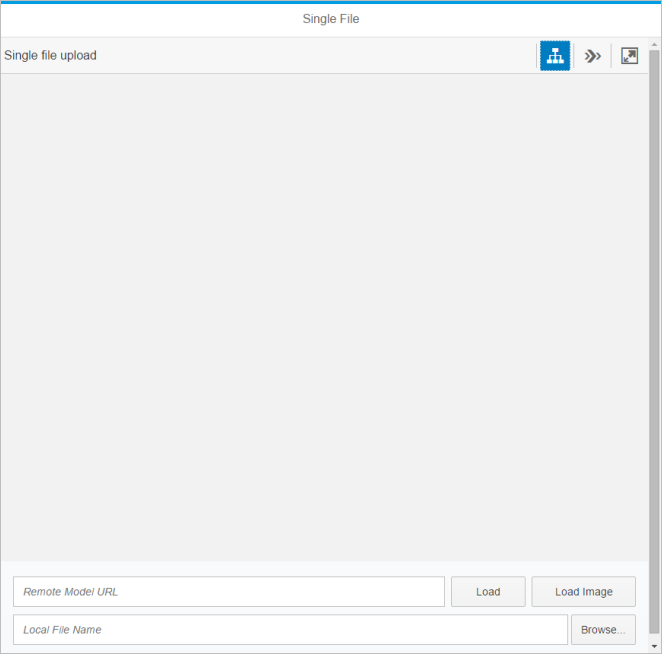
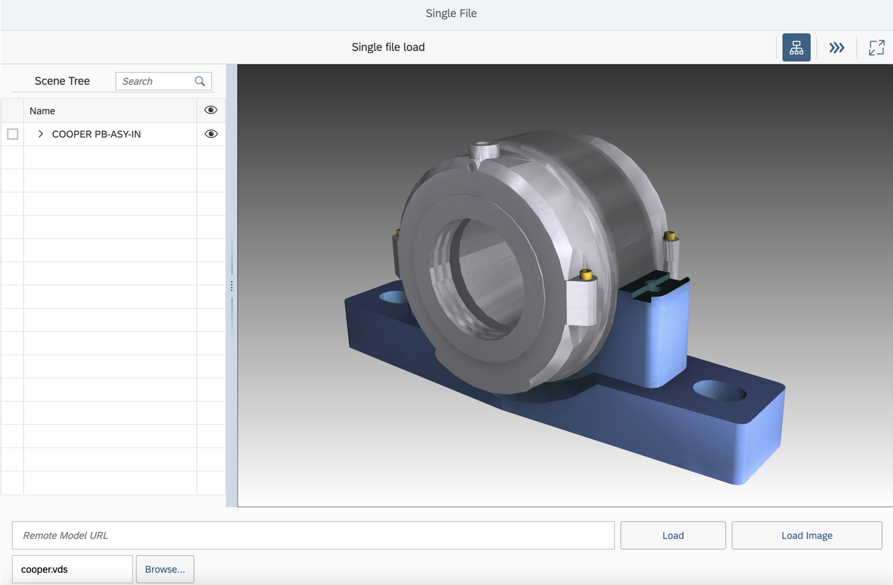

<!-- loio0e219128fe564855b91ae50d7a29424b -->

# Step 1: 3D Viewer With Single File Loading

In this step, you will be creating a 3D Viewer application that allows a user to load a single 2D image or 3D model that is stored locally or remotely.


## Preview

By the end of this step, you will have created a Viewer application that allows you to load a 2D or 3D resource. The Viewer application will look as follows:

   
  
**Viewer application with single file loading functionality**

  


## Coding

You can view and download all files at [3D Viewer - Step 1 - 3D Viewer With Single File Loading](https://ui5.sap.com/#/entity/sap.ui.vk.tutorial.VIT/sample/sap.ui.vk.tutorial.VIT.01).


### index.html

In the first `script` element of this `index.html` file, we are referencing:

-   the `sap.ui.vk`3D Viewer - Step 1 - 3D Viewer With Single library, which contains the controls for adding 3D visualization functionality \(the `sap.ui.vk` value in the `data-sap-ui-libs` property\)

-   the component file called `Component.js` \(the `data-sap-ui-resourceroots` property\)


We specify that resources related to `singleFile` are located in the same folder as this `index.html` file.

In the second `script` element, we create a function that will be called as soon as SAPUI5 is loaded and initialized. We add our application into this function.

```html
<!DOCTYPE HTML>
<html>
    <head>
        <meta http-equiv="Content-Type" content="text/html;charset=UTF-8"/> 
    <script id="sap-ui-bootstrap"
        src="https://ui5.sap.com/resources/sap-ui-core.js"
        data-sap-ui-libs="sap.ui.vk, sap.m"
        data-sap-ui-theme="sap_belize"
        data-sap-ui-bindingSyntax="complex"
        data-sap-ui-resourceroots='{
            "singleFile": "./"
         }' >
    </script>
    <script>
    sap.ui.getCore().attachInit(function(){
        new sap.m.Shell({
            app: new sap.ui.core.ComponentContainer({
                name : "singleFile"
            })
        }).placeAt("content");
    });
    </script>
    </head>
    <body id="content" class="sapUiBody">
    </body>
</html>
```


### Component.js

In the `Component.js` file, the only item for you to consider is to reference is the `manifest.json` file.

```js
sap.ui.define([
    "sap/ui/core/UIComponent"
], function (UIComponent) {
    "use strict";

    return UIComponent.extend("singleFile.Component", {

        metadata: {
            manifest: "json"
        },

        init: function () {
            // call the init function of the parent
            UIComponent.prototype.init.apply(this, arguments);
        }
    });
});
```


### i18n.properties

The `i18n.properties` file contains all the user interface labels for the application, which includes the labels for the toolbar, the page title, the buttons, the text input fields, and the error message that will be displayed when no URL is specified.

```ini
# App Descriptor
appTitle=App title
appDescription=This is a description coming from the i18n as specified in manifest.json

# Viewer Descriptor
viewerToolbarTitle=Single file load

# Page Descriptor
pageTitle=Single File

# Form Descriptor
formRemoteURL=Remote Model URL
buttonLoadModel=Load
buttonLoadImage=Load Image
formLocalFileName=Local File Name

# Message Toast
missingUrl=Please specify a URL
```


### manifest.json

The `manifest.json` file contains information about the files that we need to use in our application.

In this file, we reference the `i18n.properties` file to specify what language the user interface of our application will have. We also specify what the root view of the application is, that is, the page that is loaded first when the application is first started. This is set in the `rootView` property.

```js
{
  "_version": "1.8.0",
  "sap.app": {
    "id": "singleFile",
    "type": "application",
    "i18n": "i18n/i18n.properties",
    "title": "{{appTitle}}",
    "description": "{{appDescription}}",
    "applicationVersion": {
      "version": "1.0.0"
    }
  },
  "sap.ui": {
    "technology": "UI5",
    "deviceTypes": {
      "desktop": true,
      "tablet": true,
      "phone": true
    }
  },
  "sap.ui5": {
    "rootView": "singleFile.view.App",
    "dependencies": {
      "minUI5Version": "1.30",
      "libs": {
        "sap.m": {}
      }
    },
    "models": {
      "i18n": {
        "type": "sap.ui.model.resource.ResourceModel",
        "settings": {
          "bundleName": "singleFile.i18n.i18n"
        }
      }
    }
  }
}
```


### App.view.xml

The `App.view.xml` file specifies how the page in the application will be laid out. We have one form container containing two form elements \(`formElement`\). The first `formElement` element contains the fields for loading 2D or 3D resources located remotely. We have specifed one input text field, and two buttons: one button for loading 2D images, and the other button for loading 3D models.

In the second `formElement`, we use the `FileUploader` control to generate an input text field and a button to load 2D or 3D resources stored locally. We have specified the following file types as valid file types for loading using this `formElement`.

The labels for each of the fields are specified in the text attributes.

```xml
<mvc:View
   controllerName="singleFile.controller.App"
   xmlns="sap.m"
   xmlns:mvc="sap.ui.core.mvc"
   xmlns:vk="sap.ui.vk"
   xmlns:l="sap.ui.layout"
   xmlns:f="sap.ui.layout.form"
   xmlns:u="sap.ui.unified"
   displayBlock="true">
    <App id="singleFile">
        <Page
            title="{i18n>pageTitle}">
            <vk:Viewer
                id="viewer"
                toolbarTitle="{i18n>viewerToolbarTitle}"
                width="100%"
                height="85%"
                       />
                <f:Form editable="true">
                    <f:layout>
                        <f:GridLayout/>
                    </f:layout>
                    <f:formContainers>
                        <f:FormContainer>
                            <f:formElements>
                                <f:FormElement>      
                                    <f:fields>
                                        <Input
                                           value="{source>/remoteUrl}"
                                           valueLiveUpdate="true"
                                           placeholder="{i18n>formRemoteURL}">
                                            <layoutData>
                                                <l:GridElementData hCells="auto" />
                                            </layoutData>
                                        </Input>
                                        <Button
                                            text="{i18n>buttonLoadModel}"
                                            press="onPressLoadRemoteModel">
                                            <layoutData>
                                                <l:GridElementData hCells="2" />
                                            </layoutData>
                                        </Button>
                                        <Button
                                            text="{i18n>buttonLoadImage}"
                                            press="onPressLoadRemoteImage">
                                            <layoutData>
                                                <l:GridElementData hCells="3" />
                                            </layoutData>
                                        </Button>
                                    </f:fields>
                                </f:FormElement>
                                <f:FormElement>      
                                    <f:fields>
                                        <u:FileUploader
                                           fileType="vds,png,jpg,jpeg,gif"
                                           placeholder="{i18n>formLocalFileName}"
                                           width="100%"
                                           change="onChangeFileUploader">
                                        </u:FileUploader>
                                    </f:fields>
                                </f:FormElement>
                            </f:formElements>
                        </f:FormContainer>
                    </f:formContainers>
                </f:Form>
            </Page>
        </App>
    </mvc:View>
```


### App.controller.js

This file contains the logic for loading files into the Viewer application.

-   The `handleEmptyUrl` function specifies what should occur if a user clicks on any of the buttons for loading, without having specified a URL to a resource first.
-   The `loadModelIntoViewer` function specifies how the resource will be loaded into the Viewer application for viewing.
-   The following event functions specify how the form elements should behave during certain events. The following list outlines what each of the functions do:
    -   `onInit` - declares an empty structure when the controller is initialized. The empty structure is set as the model for the URLs.
    -   `onPressLoadRemoteModel` - the logic for the button that loads 3D resources stored remotely.
    -   `onPressLoadRemoteImage` - the logic for the button that loads 2D resources stored remotely.
    -   `onChangeFileUploader` - the logic for the fields that load 2D or 3D resources stored locally.


```js
sap.ui.define([
    "sap/ui/core/mvc/Controller",
    "sap/ui/model/json/JSONModel",
    "sap/ui/vk/ContentResource",
    "sap/m/MessageToast"
], function(Controller, JSONModel, ContentResource, MessageToast) {
    "use strict";

    var handleEmptyUrl = function(view) {
        var oBundle = view.getModel("i18n").getResourceBundle();
        var msg = oBundle.getText("missingUrl");
        MessageToast.show(msg);
    };

    var loadModelIntoViewer = function(viewer, remoteUrl, sourceType, localFile) {
        //what is currently loaded in the view is destroyed
        viewer.destroyContentResources();

        var source = remoteUrl || localFile;

        if (source) {
            
            //content of viewer is replaced with new data
            var contentResource = new ContentResource({
                source: source,
                sourceType: sourceType,
                sourceId: "abc"
            });

            //content: chosen path. content added to the view
            viewer.addContentResource(contentResource);
        } 
    };

    return Controller.extend("singleFile.controller.App", {
        onInit: function() {
            var sourceData = {
                localFile: undefined,
                remoteUrl: undefined
            };
            var model = new JSONModel();
            model.setData(sourceData);
            this.getView().setModel(model, "source");
        },

        onPressLoadRemoteModel: function(event) {
            var view = this.getView();
            var sourceData = view.getModel("source").oData;
            var viewer = view.byId("viewer");
            if (sourceData.remoteUrl) {
                loadModelIntoViewer(viewer, sourceData.remoteUrl, "vds4");
            } else {
                handleEmptyUrl(view);
            }
        },

        onPressLoadRemoteImage: function(event) {
            var view = this.getView();
            var sourceData = view.getModel("source").oData;
            var viewer = view.byId("viewer");
            if (sourceData.remoteUrl) {
                loadModelIntoViewer(viewer, sourceData.remoteUrl, "jpg");
            } else {
                handleEmptyUrl(view);
            }
        },

        onChangeFileUploader: function(event) {
            var view = this.getView();
            var viewer = view.byId("viewer");
            var localFile = event.getParameter("files")[0];
            //if user selects a local file
            if (localFile) {
                var fileName = localFile.name;
                var index = fileName.lastIndexOf(".");
                if (index >= 0 && index < fileName.length - 1) {
                    var sourceType = fileName.substr(index + 1).toLowerCase();                     
                if (sourceType == "vds") { 

                    sourceType = "vds4"; // Use new loader 

                } ;
                    loadModelIntoViewer(viewer, null, sourceType, localFile);
                }
            }
        }
    });
});
```


### Testing the Application

To test that the application works, we will load a local 3D resource into the Viewer application.

Download the `cooper.vds` file from the *Samples*. Click the *Browse...* button, navigate to the folder where the 3D resource is located, and load the model. Your screen should look like the following:

   
  
**Viewer application loaded with a single VDS file**




## API Reference

-   [`sap.ui.vk.Viewer`](https://ui5.sap.com/#/api/sap.ui.vk.Viewer)
-   [`sap.ui.vk.ContentResource`](https://ui5.sap.com/#/api/sap.ui.vk.ContentResource)

